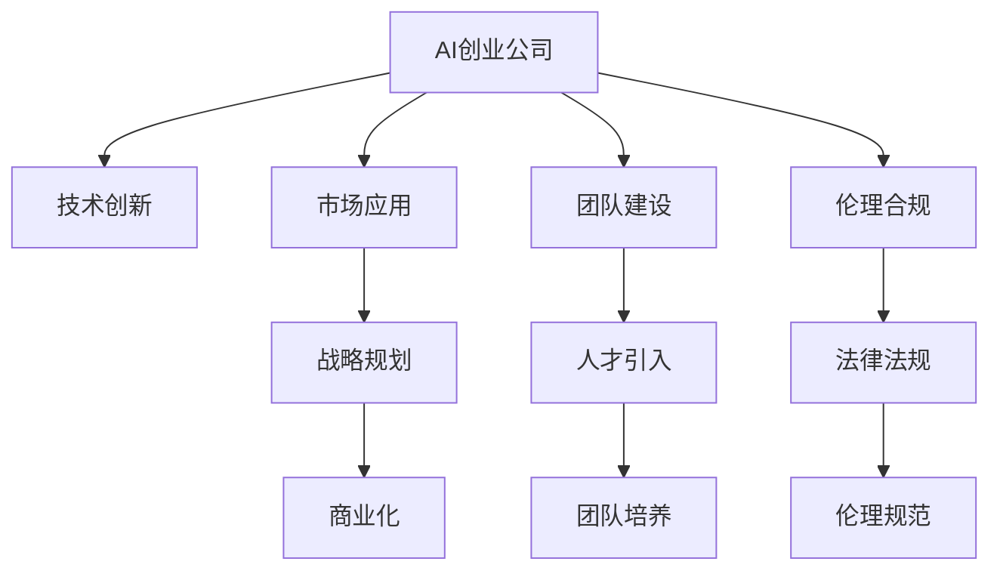

                 

# AI创业公司的发展方向

> 关键词：AI创业,技术创新,市场应用,战略规划,人工智能,商业化

## 1. 背景介绍

### 1.1 问题由来

在人工智能(AI)技术快速发展的今天，AI创业公司如雨后春笋般涌现，推动了科技创新和商业应用的前沿。这些公司依托先进的技术研发、高效的产品迭代和强大的市场推广能力，为各行各业带来了深刻变革。然而，面对复杂的市场环境，AI创业公司也面临诸多挑战和困境，如何在技术创新和商业化的道路上稳健前行，成为了众多公司的核心议题。本文将聚焦于AI创业公司的发展方向，探讨如何通过技术创新和市场应用相结合，实现商业化的成功。

### 1.2 问题核心关键点

AI创业公司的发展核心关键点包括：

- **技术创新**：保持技术领先，不断推出前沿产品和服务，提升市场竞争力。
- **市场应用**：精准定位目标市场，挖掘应用场景，创造商业价值。
- **战略规划**：制定长远的发展战略，合理分配资源，确保可持续增长。
- **商业化路径**：明确产品定位和商业模式，构建稳定的收入来源。
- **团队建设**：汇聚顶尖人才，培养高素质团队，提升执行力。
- **伦理合规**：确保产品合规，尊重用户隐私，维护社会伦理。

这些关键点共同构成AI创业公司成功发展的基石，推动其在激烈的市场竞争中脱颖而出。

## 2. 核心概念与联系

### 2.1 核心概念概述

为更好地理解AI创业公司的发展方向，本节将介绍几个密切相关的核心概念：

- **AI创业公司**：利用人工智能技术，旨在解决特定问题或提供新型服务的创业企业。
- **技术创新**：通过研发新技术、新产品，提升公司竞争力。
- **市场应用**：将产品或服务应用到实际市场中，满足用户需求，创造价值。
- **战略规划**：制定公司发展策略，分配资源，确保长期发展。
- **商业化**：将产品或服务转化为商业收入，实现盈利。
- **团队建设**：组建和培养高效团队，提升公司执行力。
- **伦理合规**：确保产品符合法律法规和伦理标准，保障用户权益。

这些核心概念之间的逻辑关系可以通过以下Mermaid流程图来展示：



这个流程图展示AI创业公司的核心概念及其之间的关系：

1. AI创业公司通过技术创新获得核心竞争力。
2. 技术创新支撑市场应用，解决实际问题，满足用户需求。
3. 市场应用驱动战略规划，优化资源分配，提升市场竞争力。
4. 战略规划和市场应用推动商业化，实现盈利。
5. 团队建设是技术创新和市场应用的基础保障。
6. 伦理合规确保公司行为的合法性和道德性。

## 3. 核心算法原理 & 具体操作步骤

### 3.1 算法原理概述

AI创业公司的发展，在技术层面主要依赖于算法和模型的创新。算法和模型不仅决定了产品的功能和性能，也决定了公司竞争力和市场影响力。以下是几种常见的技术创新方向：

- **深度学习模型**：如卷积神经网络(CNN)、循环神经网络(RNN)、Transformer等，用于图像识别、自然语言处理、推荐系统等。
- **强化学习**：通过试错学习，优化决策过程，应用于机器人控制、游戏AI等。
- **生成对抗网络(GANs)**：用于图像生成、视频生成等，提升数据生成和增强的能力。
- **自然语言处理(NLP)**：如文本分类、情感分析、机器翻译等，提升数据理解和处理的能力。
- **计算机视觉(CV)**：如图像识别、目标检测等，提升视觉信息的理解和处理能力。

这些技术构成了AI创业公司技术创新的基石，通过不断突破和优化，推动产品性能的提升和应用的拓展。

### 3.2 算法步骤详解

AI创业公司的技术创新一般遵循以下步骤：

**Step 1: 确定技术方向**
- 结合市场趋势和公司优势，选定技术研发方向，如自然语言处理、计算机视觉、强化学习等。

**Step 2: 数据采集与预处理**
- 收集相关数据集，并进行清洗、标注和预处理，确保数据的质量和可用性。

**Step 3: 模型设计与训练**
- 根据选定的技术方向，设计合适的算法模型，并使用大规模数据进行训练和调优。
- 常见的训练方法包括监督学习、无监督学习、半监督学习等。

**Step 4: 模型评估与优化**
- 通过性能指标（如准确率、召回率、F1分数等）评估模型效果，并进行必要的优化调整。
- 迭代多次，直到模型满足预期要求。

**Step 5: 产品集成与测试**
- 将训练好的模型集成到产品中，进行功能测试和性能测试。
- 测试包括功能测试、压力测试、安全性测试等。

**Step 6: 上线部署与监控**
- 将产品上线部署，并进行实时监控，确保系统稳定运行。
- 监控指标包括性能指标、用户反馈、系统日志等。

通过以上步骤，AI创业公司可以实现从技术创新到产品落地的全过程，不断提升产品的市场竞争力。

### 3.3 算法优缺点

AI创业公司的技术创新具有以下优点：

1. **领先性**：前沿技术的应用可以大幅提升产品竞争力，领先市场。
2. **差异化**：技术创新可以提供独特的产品功能和服务，区分竞争对手。
3. **市场潜力**：新技术的开发和应用，可以带来巨大的市场机会和商业价值。
4. **持续改进**：技术创新能够不断提升产品和服务的质量，满足用户不断变化的需求。

同时，技术创新也存在一些缺点：

1. **高投入**：技术研发需要高昂的硬件设备和人力资源，资金压力较大。
2. **技术风险**：新技术的开发和应用存在不确定性，可能面临失败的风险。
3. **快速迭代**：技术创新需要不断迭代和优化，资源分配较为分散。
4. **竞争激烈**：市场中技术领先的公司较多，需要持续投入保持领先地位。

尽管如此，技术创新仍然是AI创业公司竞争力的重要来源，合理规划和管理创新资源，可以最大化其优势。

### 3.4 算法应用领域

AI创业公司的技术创新涵盖了多个领域，以下是几个典型的应用场景：

1. **医疗健康**：通过AI技术进行疾病诊断、治疗方案推荐、健康管理等，提升医疗服务效率和质量。
2. **金融科技**：利用AI进行风险评估、信用评分、智能投顾等，提升金融服务的智能化水平。
3. **智能制造**：采用AI进行工业自动化、质量控制、预测维护等，提升制造效率和质量。
4. **智能交通**：通过AI进行交通流量预测、自动驾驶、智能导航等，提升交通管理水平。
5. **教育培训**：利用AI进行个性化教育、智能评估、教学辅助等，提升教育效果。
6. **安防监控**：通过AI进行视频分析、人脸识别、异常检测等，提升安全管理能力。

## 4. 数学模型和公式 & 详细讲解 & 举例说明

### 4.1 数学模型构建

AI创业公司技术创新的数学模型主要基于机器学习和深度学习的算法，以下是几种常见的数学模型：

1. **卷积神经网络(CNN)**：用于图像识别和处理，结构如图1所示：
   $$
   y = f(x; W)
   $$
   其中 $x$ 为输入图像，$W$ 为卷积核，$f$ 为非线性激活函数。

2. **循环神经网络(RNN)**：用于序列数据的处理，如图2所示：
   $$
   h_t = \tanh(W_h x_t + U_h h_{t-1} + b_h)
   $$
   $$
   y = softmax(W_y h_t + U_y x_t + b_y)
   $$
   其中 $x_t$ 为序列数据，$W$、$U$、$b$ 为权重和偏置，$h_t$ 为隐藏状态，$y$ 为输出。

3. **生成对抗网络(GANs)**：如图3所示，包含生成器和判别器两个部分：
   $$
   G(x) = W_G(x)
   $$
   $$
   D(x) = \sigma(W_D x + U_D h_{t-1} + b_D)
   $$
   其中 $G$ 为生成器，$D$ 为判别器，$W$、$U$、$b$ 为权重和偏置，$\sigma$ 为激活函数。

### 4.2 公式推导过程

以CNN为例，其基本原理如图4所示：

1. **卷积层**：通过卷积操作提取特征：
   $$
   f(x; W) = \sum_{i=1}^m \sum_{j=1}^n (x_{i,j} * W_{i,j}) + b
   $$

2. **池化层**：通过池化操作降低特征图维度：
   $$
   y_{i,j} = max_{k,l}(x_{i+1,j+1})
   $$

3. **全连接层**：通过线性变换和激活函数输出结果：
   $$
   y = \sigma(W y_{i,j} + b)
   $$

通过不断堆叠卷积层和全连接层，CNN可以逐步提取和抽象图像特征，最终输出分类结果。

### 4.3 案例分析与讲解

**案例1: 图像分类**

在图像分类任务中，使用CNN模型进行图像特征提取和分类。如图5所示，假设输入图像为$x$，模型通过卷积和池化操作提取特征，并经过全连接层输出分类结果$y$。

**案例2: 自然语言处理**

在自然语言处理任务中，使用RNN模型进行文本分类。如图6所示，假设输入文本为$x$，模型通过循环神经网络逐词处理，并输出分类结果$y$。

通过以上案例可以看出，不同领域的AI创业公司可以通过选择合适的模型和算法，解决实际问题，提供创新服务。

## 5. 项目实践：代码实例和详细解释说明

### 5.1 开发环境搭建

在进行AI创业公司的技术创新时，开发环境搭建是重要的一环。以下是Python环境下常用工具的安装和使用：

1. **Python安装**：
   - 从官网下载Python安装包，安装最新版本。
   - 安装依赖库，如TensorFlow、PyTorch、Keras等。

2. **开发环境搭建**：
   - 创建虚拟环境，避免不同项目之间的依赖冲突。
   - 配置Git仓库，便于版本管理和协作开发。

3. **版本控制**：
   - 使用Git进行代码版本控制，跟踪开发进度。
   - 使用GitHub、GitLab等平台进行代码托管和共享。

### 5.2 源代码详细实现

以下是一个简单的图像分类项目示例，使用TensorFlow框架：

```python
import tensorflow as tf
from tensorflow.keras import layers, models

# 定义CNN模型
model = models.Sequential()
model.add(layers.Conv2D(32, (3, 3), activation='relu', input_shape=(32, 32, 3)))
model.add(layers.MaxPooling2D((2, 2)))
model.add(layers.Conv2D(64, (3, 3), activation='relu'))
model.add(layers.MaxPooling2D((2, 2)))
model.add(layers.Conv2D(64, (3, 3), activation='relu'))
model.add(layers.Flatten())
model.add(layers.Dense(64, activation='relu'))
model.add(layers.Dense(10, activation='softmax'))

# 编译模型
model.compile(optimizer='adam', loss='sparse_categorical_crossentropy', metrics=['accuracy'])

# 训练模型
model.fit(train_images, train_labels, epochs=10, validation_data=(val_images, val_labels))
```

该示例展示了使用TensorFlow构建和训练一个简单的CNN模型，用于图像分类任务。

### 5.3 代码解读与分析

**代码详细解读**：

1. **模型定义**：首先定义了一个Sequential模型，通过添加卷积层、池化层、全连接层等，逐步构建了CNN模型。
2. **模型编译**：使用adam优化器、交叉熵损失函数和准确率指标，编译模型。
3. **模型训练**：使用训练集数据和标签进行模型训练，迭代10次，并使用验证集进行评估。

**代码分析**：

1. **模型结构**：该模型包含多个卷积层、池化层和全连接层，通过层层堆叠，逐步提取和抽象图像特征。
2. **训练过程**：通过不断迭代训练，逐步优化模型参数，提升模型性能。
3. **评估机制**：使用验证集数据评估模型效果，防止过拟合。

## 6. 实际应用场景

### 6.1 医疗健康

AI创业公司在医疗健康领域的应用场景广泛，以下是几个典型案例：

**案例1: 疾病诊断**

通过深度学习技术，AI创业公司可以开发出智能辅助诊断系统，如图7所示。输入患者的症状描述和检查结果，系统自动分析生成诊断结果，辅助医生进行诊断。

**案例2: 治疗方案推荐**

利用自然语言处理技术，AI创业公司可以构建智能治疗方案推荐系统，如图8所示。输入患者信息和治疗需求，系统自动生成最优治疗方案，提升诊疗效率。

通过以上案例可以看出，AI创业公司可以通过技术创新，提供智能化、个性化的医疗服务，提升诊疗质量和效率。

### 6.2 金融科技

金融科技是AI创业公司的另一重要应用领域，以下是几个典型案例：

**案例1: 风险评估**

通过深度学习技术，AI创业公司可以开发出智能风险评估系统，如图9所示。输入客户的信用数据和行为数据，系统自动分析生成风险评分，辅助银行进行贷款审批。

**案例2: 智能投顾**

利用强化学习技术，AI创业公司可以构建智能投资顾问系统，如图10所示。输入客户的投资需求和风险偏好，系统自动生成投资策略，辅助客户进行资产管理。

通过以上案例可以看出，AI创业公司可以通过技术创新，提供智能化、高效化的金融服务，提升金融服务的质量和效率。

### 6.3 智能制造

智能制造是AI创业公司在制造业的重要应用场景，以下是几个典型案例：

**案例1: 质量检测**

通过计算机视觉技术，AI创业公司可以开发出智能质量检测系统，如图11所示。输入产品的图像数据，系统自动分析生成质量报告，辅助生产商进行质量控制。

**案例2: 预测维护**

利用时间序列预测技术，AI创业公司可以构建智能预测维护系统，如图12所示。输入设备的运行数据，系统自动预测设备故障，提前进行维护，降低生产停机时间。

通过以上案例可以看出，AI创业公司可以通过技术创新，提供智能化、高效化的制造服务，提升制造效率和质量。

## 7. 工具和资源推荐

### 7.1 学习资源推荐

为了帮助AI创业公司系统掌握技术创新和市场应用的理论基础和实践技巧，这里推荐一些优质的学习资源：

1. **《深度学习》系列教材**：由斯坦福大学、MIT等名校教授编写，系统讲解深度学习和机器学习的基本概念和算法。
2. **《TensorFlow官方文档》**：详细介绍了TensorFlow框架的使用方法，包括模型构建、训练和优化等。
3. **Kaggle平台**：全球最大的数据科学竞赛平台，提供大量实战案例和数据集，便于学习和实践。
4. **《AI创业公司指南》**：由AI领域专家撰写，涵盖技术创新、市场应用、商业化等多方面的实战经验。
5. **《人工智能伦理与法律》**：探讨AI技术在伦理和法律方面的挑战和解决策略，保障技术应用的合法性和安全性。

通过对这些资源的学习实践，相信AI创业公司能够快速掌握技术创新的精髓，并用于解决实际的业务问题。

### 7.2 开发工具推荐

高效的开发离不开优秀的工具支持。以下是几款用于AI创业公司技术创新的常用工具：

1. **Jupyter Notebook**：基于Web的交互式编程环境，方便代码编写和结果展示。
2. **GitLab**：集成开发和项目管理平台，支持代码托管、持续集成和协作开发。
3. **TensorFlow**：由Google主导开发的深度学习框架，支持分布式计算和模型优化。
4. **PyTorch**：Facebook开源的深度学习框架，支持动态计算图和高效训练。
5. **Keras**：高层API，封装了TensorFlow和Theano等底层框架，方便模型构建和调试。

合理利用这些工具，可以显著提升AI创业公司的技术创新效率，加快创新迭代的步伐。

### 7.3 相关论文推荐

AI创业公司的技术创新离不开学界的持续研究。以下是几篇奠基性的相关论文，推荐阅读：

1. **《ImageNet Classification with Deep Convolutional Neural Networks》**：提出使用CNN进行大规模图像分类的经典算法，开启了深度学习在图像识别领域的应用。
2. **《LSTM: A Search Space Odyssey》**：提出使用LSTM进行序列数据处理的经典算法，奠定了深度学习在自然语言处理领域的基础。
3. **《Generative Adversarial Nets》**：提出使用GANs进行图像生成的经典算法，推动了深度学习在生成对抗领域的发展。
4. **《Attention is All You Need》**：提出使用Transformer进行自然语言处理的经典算法，开启了大模型预训练的时代。
5. **《Scalable Causal Modeling with Graph Transformers》**：提出使用图Transformer进行因果关系建模的经典算法，推动了深度学习在因果推理领域的发展。

这些论文代表了大模型微调技术的发展脉络。通过学习这些前沿成果，可以帮助AI创业公司把握学科前进方向，激发更多的创新灵感。

## 8. 总结：未来发展趋势与挑战

### 8.1 总结

本文对AI创业公司的发展方向进行了全面系统的介绍。首先阐述了AI创业公司的核心概念和关键点，明确了技术创新、市场应用、战略规划、商业化等方向的紧密联系。其次，从原理到实践，详细讲解了AI创业公司的技术创新方法，包括深度学习模型、强化学习、生成对抗网络等，并通过代码实例展示了具体的实现过程。同时，本文还探讨了AI创业公司在医疗健康、金融科技、智能制造等多个领域的实际应用场景，展示了技术创新的巨大潜力。最后，本文精选了技术创新、学习资源、开发工具和相关论文推荐，力求为AI创业公司提供全方位的技术指引。

通过本文的系统梳理，可以看到，AI创业公司通过技术创新，能够提供智能、高效、个性化的服务，满足不同领域的需求。未来，随着技术的不断进步和市场的深入应用，AI创业公司必将在各个行业中发挥重要作用，推动经济社会的数字化、智能化发展。

### 8.2 未来发展趋势

展望未来，AI创业公司的发展趋势将呈现以下几个方向：

1. **多模态融合**：将图像、文本、语音等多种数据源进行融合，提升智能系统的全面性和可靠性。
2. **跨领域应用**：将AI技术应用于更多领域，如农业、环保、智慧城市等，推动各行各业的数字化转型。
3. **边缘计算**：利用边缘计算技术，实现实时数据分析和决策，提升系统响应速度和效率。
4. **自适应学习**：开发自适应学习算法，使系统能够持续学习和优化，适应不断变化的市场环境。
5. **联邦学习**：通过分布式训练，保护数据隐私和模型安全，提升系统的可扩展性和鲁棒性。
6. **混合智能**：结合人类专家的知识和技能，构建人机协同智能系统，提升决策的准确性和可靠性。

这些趋势将推动AI创业公司在技术上不断突破，在应用上不断拓展，为AI技术的发展注入新的动力。

### 8.3 面临的挑战

尽管AI创业公司具备巨大的发展潜力，但在迈向成功的道路上，仍面临诸多挑战：

1. **数据获取难度**：获取高质量、大样本量的数据是技术创新的前提，但数据获取难度较大。
2. **模型复杂性**：大规模模型的训练和优化需要高昂的计算资源，资源配置较为复杂。
3. **应用落地难**：将技术转化为实际应用，需要考虑市场、法规、伦理等多方面因素，落地难度较大。
4. **人才短缺**：AI技术需要高素质人才，但目前高端人才供不应求，影响公司发展速度。
5. **竞争激烈**：AI创业公司众多，竞争激烈，需要持续创新才能保持领先地位。
6. **伦理合规**：AI技术的伦理和合规问题日益重要，需要制定和遵守相关标准和法规。

这些挑战需要AI创业公司不断努力，在技术、市场、人才、伦理等方面综合发力，才能克服困难，实现可持续发展。

### 8.4 研究展望

未来，AI创业公司需要在以下几个方面寻求新的突破：

1. **跨领域知识整合**：将不同领域的专业知识和经验，与AI技术结合，提升系统的综合能力和应用场景。
2. **人机协同系统**：构建人机协同的智能系统，结合人类专家的知识和技能，提升决策的准确性和可靠性。
3. **多模态融合技术**：开发多模态融合技术，提升智能系统的全面性和可靠性。
4. **边缘计算技术**：结合边缘计算技术，提升系统的实时性和响应速度。
5. **自适应学习算法**：开发自适应学习算法，使系统能够持续学习和优化，适应不断变化的市场环境。
6. **联邦学习技术**：结合联邦学习技术，保护数据隐私和模型安全，提升系统的可扩展性和鲁棒性。

通过这些研究方向的探索发展，AI创业公司能够进一步提升技术能力和应用水平，推动人工智能技术在各行各业中的应用和普及。

## 9. 附录：常见问题与解答

**Q1: AI创业公司如何确保技术创新的成功？**

A: AI创业公司确保技术创新的成功，需要从以下几个方面进行综合考量：

1. **市场需求分析**：深入了解市场需求，寻找技术应用的切入点。
2. **技术路线规划**：制定详细的技术路线图，明确技术实现和应用步骤。
3. **数据资源准备**：获取和处理高质量的数据，保障技术创新的数据基础。
4. **团队组建与管理**：组建专业的研发团队，进行高效的管理和协作。
5. **技术验证与迭代**：通过小规模试点，验证技术效果，进行持续的迭代和优化。
6. **产品化和商业化**：将技术转化为实际产品，进行市场推广和应用落地。

通过以上步骤，AI创业公司可以最大化技术创新的成功概率，推动技术的市场应用。

**Q2: AI创业公司如何保持技术领先？**

A: AI创业公司保持技术领先，需要持续的研发投入和创新能力：

1. **持续研发投入**：投入足够的资金和人力资源，支持技术研发和创新。
2. **技术跟踪与监测**：持续跟踪最新的技术进展，及时调整研发方向和策略。
3. **创新生态建设**：建立良好的创新生态，与学术界、产业界进行紧密合作。
4. **人才引进与培养**：引进和培养高素质人才，提升公司的技术实力和创新能力。
5. **知识产权保护**：通过专利、版权等手段，保护公司的技术创新成果。

通过以上措施，AI创业公司可以保持技术领先地位，提升市场竞争力。

**Q3: AI创业公司如何进行商业化运作？**

A: AI创业公司进行商业化运作，需要制定合理的商业模式和运营策略：

1. **明确产品定位**：确定产品的主要功能和服务目标，明确市场定位。
2. **制定定价策略**：根据市场需求和成本，制定合理的价格策略，保障盈利能力。
3. **构建销售渠道**：建立广泛的销售渠道，推广产品和服务。
4. **用户体验优化**：提升产品的用户体验，增加用户粘性和满意度。
5. **市场推广活动**：通过市场推广活动，提升品牌知名度和市场份额。
6. **售后服务与支持**：提供优质的售后服务和技术支持，提升用户信任度和满意度。

通过以上措施，AI创业公司可以顺利实现商业化运作，推动公司的长期发展。

---

作者：禅与计算机程序设计艺术 / Zen and the Art of Computer Programming

