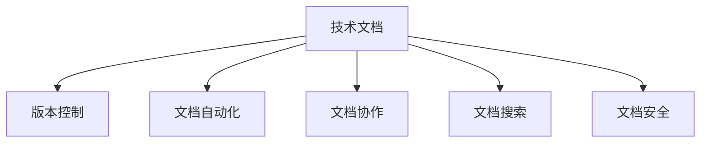

                 

# AI创业公司的技术文档管理

> 关键词：技术文档管理, 人工智能创业, 文档版本控制, 文档发布, 文档自动化, 文档协作

## 1. 背景介绍

### 1.1 问题由来

在AI创业公司的成长过程中，技术文档管理是一个至关重要的环节。随着项目的推进和团队的壮大，技术文档的数量和复杂性呈指数级增长，如何有效地组织、管理和使用这些文档，成为每个AI创业公司面临的一项重大挑战。

技术文档包括但不限于项目规划、技术规格、系统设计、API文档、测试用例、用户手册等，是软件开发和维护的重要基础。不完善的技术文档管理可能导致以下问题：

1. 知识隔离：不同团队和成员之间的信息难以共享，导致重复工作或遗漏关键信息。
2. 版本混乱：文档版本不一致，难以追溯文档的历史变更，影响协作效率。
3. 更新滞后：文档更新不及时，技术细节和最佳实践未能及时反映到文档中，影响产品质量和用户体验。
4. 查找困难：文档结构不合理，查找效率低下，浪费大量时间和精力。

这些问题直接关系到公司的技术能力和产品竞争力，因此，建立一套高效、可维护的技术文档管理体系，对AI创业公司尤为重要。

### 1.2 问题核心关键点

为了有效解决上述问题，AI创业公司的技术文档管理需要关注以下几个关键点：

1. 文档标准化：制定统一的文档格式和内容标准，确保文档的一致性和规范性。
2. 版本控制：采用先进的版本控制工具，管理文档的变更历史和版本关系。
3. 自动化发布：实现文档的自动构建和发布，减少手动干预，提高效率。
4. 文档协作：提供便捷的文档编辑和审阅功能，支持团队协作。
5. 文档搜索：建立高效的内容检索机制，方便快速查找所需文档。
6. 文档安全：确保文档的访问权限和数据安全，防止泄露敏感信息。

通过关注这些关键点，AI创业公司可以构建一个高效、可维护的技术文档管理体系，支持其快速成长和持续创新。

## 2. 核心概念与联系

### 2.1 核心概念概述

为更好地理解AI创业公司技术文档管理的体系和流程，本节将介绍几个密切相关的核心概念：

- 技术文档（Technical Documentation）：包括项目规划、技术规格、系统设计、API文档、测试用例、用户手册等，是软件开发和维护的基础。
- 版本控制（Version Control）：管理文档的变更历史和版本关系，确保文档的准确性和可追溯性。
- 文档自动化（Documentation Automation）：通过工具自动化文档的构建、发布和更新，减少人工干预，提高效率。
- 文档协作（Document Collaboration）：支持团队成员在文档编辑和审阅过程中进行实时协作，提高协作效率。
- 文档搜索（Document Search）：建立高效的内容检索机制，方便快速查找所需文档。
- 文档安全（Document Security）：确保文档的访问权限和数据安全，防止泄露敏感信息。

这些核心概念之间的逻辑关系可以通过以下Mermaid流程图来展示：



这个流程图展示了一系列核心概念及其之间的关系：

1. 技术文档是文档管理的基础，其他所有操作都是基于文档的内容进行的。
2. 版本控制确保文档的历史变更得到有效管理，避免版本混乱。
3. 文档自动化提高了文档的构建、发布和更新效率，减少人工操作。
4. 文档协作支持团队成员实时协作，提高协作效率。
5. 文档搜索方便快速查找所需文档，提高文档利用率。
6. 文档安全确保文档的访问权限和数据安全，防止信息泄露。

这些概念共同构成了AI创业公司技术文档管理的基本框架，帮助公司有效组织和管理技术文档。

## 3. 核心算法原理 & 具体操作步骤
### 3.1 算法原理概述

AI创业公司的技术文档管理，本质上是一个文档的生命周期管理过程。其核心思想是：通过标准的文档格式、先进的版本控制工具、自动化的发布流程、便捷的协作机制、高效的搜索系统和严格的安全策略，确保技术文档从创建到使用再到销毁的全生命周期得到有效管理。

形式化地，假设技术文档 $D$ 包含多个版本 $D_1, D_2, \ldots, D_n$，每个版本由作者 $A_i$ 提交，版本之间的关系可以表示为版本控制系统中的变更记录。文档自动化系统 $A$ 通过配置文件 $C$ 生成文档内容 $C$，同时支持发布到文档存储系统 $S$。文档协作系统 $C$ 提供实时编辑和审阅功能，确保文档的准确性和及时性。文档搜索系统 $S$ 根据关键词 $K$ 提供文档检索功能，帮助用户快速定位所需信息。文档安全系统 $S$ 根据用户角色 $R$ 控制文档的访问权限，确保文档的安全性。

技术文档管理的优化目标是最小化文档管理的复杂性和提高文档的利用率，即：

$$
\min_{D, A, C, S} \text{complexity}(D, A, C, S) + \max_{K, R} \text{utility}(D, K, R)
$$

其中 $\text{utility}(D, K, R)$ 表示文档检索和访问的效用，$\text{complexity}(D, A, C, S)$ 表示文档管理系统的复杂度。

### 3.2 算法步骤详解

基于文档生命周期管理的技术文档管理，一般包括以下几个关键步骤：

**Step 1: 文档格式和标准制定**
- 确定技术文档的模板和格式，如Markdown、Confluence等。
- 制定统一的文档内容标准，包括文档标题、结构、术语、引用格式等。

**Step 2: 版本控制工具选择**
- 选择合适的版本控制工具，如Git、SVN等。
- 配置版本控制工具的权限控制和分支策略。

**Step 3: 文档自动化系统集成**
- 集成文档自动化工具，如Sphinx、Doxygen等。
- 配置自动化工具的生成流程，包括构建文档、生成PDF等。

**Step 4: 文档协作系统部署**
- 部署文档协作工具，如Confluence、Google Docs等。
- 配置协作系统的权限和审核机制。

**Step 5: 文档搜索系统配置**
- 配置文档搜索工具，如Elasticsearch、Solr等。
- 建立搜索索引，配置搜索语法和优先级。

**Step 6: 文档安全策略制定**
- 制定文档的访问权限策略，如基于角色的访问控制（RBAC）。
- 配置文档存储和传输的安全协议，如HTTPS。

**Step 7: 文档发布和维护**
- 定期发布文档，确保文档内容的及时性和准确性。
- 监控文档访问和使用情况，及时更新和维护。

以上是技术文档管理的核心步骤，每个步骤的具体实施细节将根据公司的实际情况和需求进行调整。

### 3.3 算法优缺点

技术文档管理通过标准的文档格式、先进的版本控制、自动化的发布流程、便捷的协作机制、高效的搜索系统和严格的安全策略，具有以下优点：

1. 提高协作效率：通过文档协作系统，团队成员可以实时编辑和审阅文档，减少沟通成本，提高协作效率。
2. 增强文档准确性：文档自动化和版本控制确保文档内容的准确性和一致性，避免因人为错误导致的文档问题。
3. 简化文档维护：文档自动化和定期发布流程，减少了人工干预，简化文档维护工作。
4. 提升文档查找效率：高效的内容检索机制，帮助用户快速定位所需文档，提高文档利用率。
5. 保障文档安全：通过访问权限和数据加密等安全措施，防止敏感信息泄露，保障文档安全。

同时，技术文档管理也存在一定的局限性：

1. 初始投入大：技术文档管理需要选择合适的工具和配置，初始投入较大。
2. 技术要求高：文档自动化和搜索系统需要一定的技术支持，可能存在学习曲线。
3. 维护复杂：随着文档数量的增加，管理和维护文档系统的复杂度也随之增加。
4. 缺乏灵活性：文档格式和标准的制定可能限制团队的灵活性，无法快速适应新的需求。

尽管存在这些局限性，但就目前而言，技术文档管理仍然是AI创业公司技术管理的重要组成部分，有助于提升公司整体的技术水平和产品竞争力。

### 3.4 算法应用领域

技术文档管理在AI创业公司的各个阶段都具有重要应用：

1. 项目启动阶段：文档标准化和版本控制工具的配置，为项目的正式启动打下基础。
2. 研发阶段：文档自动化和协作系统支持研发团队的日常工作，提高研发效率。
3. 产品发布阶段：文档的自动化发布和搜索系统，方便用户快速定位所需信息。
4. 客户支持阶段：文档的访问控制和安全策略，确保客户能够安全访问所需信息。

此外，技术文档管理还广泛应用于技术评审、知识传承、代码审查等环节，成为AI创业公司技术管理的重要支撑。

## 4. 数学模型和公式 & 详细讲解 & 举例说明（备注：数学公式请使用latex格式，latex嵌入文中独立段落使用 $$，段落内使用 $)
### 4.1 数学模型构建

本节将使用数学语言对AI创业公司技术文档管理的体系进行更加严格的刻画。

假设AI创业公司需要管理的技术文档总数为 $N$，每个文档 $D_i$ 的更新频率为 $f_i$，文档的访问频次为 $a_i$，文档的存储成本为 $c_i$。技术文档管理的优化目标是最小化文档管理的复杂性和提高文档的利用率，即：

$$
\min_{D, A, C, S} \sum_{i=1}^N (c_i \cdot f_i + a_i \cdot a_i) + \max_{K, R} \sum_{i=1}^N (a_i \cdot \text{utility}(K_i, R_i))
$$

其中 $\text{utility}(K_i, R_i)$ 表示关键词 $K_i$ 和角色 $R_i$ 对应的文档利用率。

### 4.2 公式推导过程

以下我们以技术文档的自动生成和发布为例，推导相关的数学模型。

假设技术文档 $D$ 的自动化生成流程为：
1. 输入原始代码和文档结构 $C$，通过工具自动生成文档内容 $D_{auto}$。
2. 将 $D_{auto}$ 与文档存储系统 $S$ 集成，自动更新文档版本 $D_v$。

设自动生成的文档版本 $D_{auto}$ 占总文档的比例为 $\alpha$，则自动生成的文档数量 $N_{auto} = \alpha \cdot N$。假设每次文档生成和发布的固定成本为 $F$，文档的存储成本为 $C_s$，文档的访问成本为 $C_a$，则文档管理的总成本 $C_{total}$ 可以表示为：

$$
C_{total} = F + C_s \cdot N_{auto} + C_a \cdot a_i
$$

其中 $N_{auto}$ 表示自动生成的文档数量，$a_i$ 表示文档的访问频次。

为了最大化文档的利用率，需要优化关键词和角色的匹配关系，即：

$$
\max_{K, R} \sum_{i=1}^N (a_i \cdot \text{utility}(K_i, R_i))
$$

通过以上数学模型，可以计算出在自动生成和访问频次给定的情况下，技术文档管理的最小成本和最大利用率。

### 4.3 案例分析与讲解

下面以一家AI创业公司为例，分析其技术文档管理的具体实施过程。

假设该公司需要管理的技术文档数量为 $N=100$，每个文档的更新频率为 $f_i \in [0.1, 0.5]$，访问频次为 $a_i \in [0.1, 0.5]$，存储成本为 $c_i \in [100, 500]$。

1. 文档格式和标准制定：选择Markdown作为文档格式，制定统一的文档结构和术语标准。
2. 版本控制工具选择：配置Git版本控制工具，并设置分支策略和权限控制。
3. 文档自动化系统集成：使用Sphinx工具自动生成文档内容，并配置定期发布流程。
4. 文档协作系统部署：部署Confluence协作系统，并配置实时编辑和审阅权限。
5. 文档搜索系统配置：配置Elasticsearch搜索系统，建立文档搜索索引。
6. 文档安全策略制定：制定基于角色的访问控制策略，配置文档存储和传输的安全协议。

通过以上步骤，该公司的技术文档管理系统得到了有效的配置和部署。

## 5. 项目实践：代码实例和详细解释说明
### 5.1 开发环境搭建

在进行技术文档管理实践前，我们需要准备好开发环境。以下是使用Python进行Flask开发的环境配置流程：

1. 安装Anaconda：从官网下载并安装Anaconda，用于创建独立的Python环境。

2. 创建并激活虚拟环境：
```bash
conda create -n Flask-env python=3.8 
conda activate Flask-env
```

3. 安装Flask：
```bash
pip install flask
```

4. 安装Flask-RESTful和Flask-SQLAlchemy：
```bash
pip install Flask-RESTful Flask-SQLAlchemy
```

5. 安装Flask-Login：
```bash
pip install Flask-Login
```

6. 安装SQLite：
```bash
pip install sqlalchemy
```

7. 安装Flask-Uploads：
```bash
pip install Flask-Uploads
```

完成上述步骤后，即可在`Flask-env`环境中开始技术文档管理实践。

### 5.2 源代码详细实现

下面我们以技术文档管理系统的文档编辑和发布为例，给出使用Flask实现的PyTorch代码实现。

首先，定义技术文档的数据模型：

```python
from flask_sqlalchemy import SQLAlchemy

db = SQLAlchemy()

class Document(db.Model):
    id = db.Column(db.Integer, primary_key=True)
    name = db.Column(db.String(255), nullable=False)
    content = db.Column(db.Text, nullable=False)
    author = db.Column(db.String(255), nullable=False)
    update_time = db.Column(db.DateTime, nullable=False)
    visibility = db.Column(db.String(255), nullable=False)

class User(db.Model):
    id = db.Column(db.Integer, primary_key=True)
    username = db.Column(db.String(255), nullable=False)
    password = db.Column(db.String(255), nullable=False)
    role = db.Column(db.String(255), nullable=False)
```

然后，定义API接口：

```python
from flask import Flask, request, jsonify
from flask_login import LoginManager, login_required, current_user
from flask_sqlalchemy import SQLAlchemy

app = Flask(__name__)
app.config['SQLALCHEMY_DATABASE_URI'] = 'sqlite:///./db.sqlite3'
db.init_app(app)
login_manager = LoginManager(app)

@login_manager.user_loader
def load_user(user_id):
    return User.query.get(user_id)

@app.route('/documents', methods=['POST'])
@login_required
def create_document():
    name = request.json.get('name', '')
    content = request.json.get('content', '')
    author = current_user.username
    update_time = datetime.datetime.now()
    visibility = 'private'
    
    document = Document(name=name, content=content, author=author, update_time=update_time, visibility=visibility)
    db.session.add(document)
    db.session.commit()
    
    return jsonify({'success': True, 'message': 'Document created successfully'}), 201

@app.route('/documents/<int:document_id>', methods=['PUT'])
@login_required
def update_document(document_id):
    document = Document.query.get(document_id)
    if not document:
        return jsonify({'success': False, 'message': 'Document not found'}), 404
    
    if current_user.role != 'admin':
        if document.author != current_user.username:
            return jsonify({'success': False, 'message': 'Unauthorized'}), 403
    
    name = request.json.get('name', document.name)
    content = request.json.get('content', document.content)
    author = current_user.username
    update_time = datetime.datetime.now()
    visibility = request.json.get('visibility', document.visibility)
    
    document.name = name
    document.content = content
    document.author = author
    document.update_time = update_time
    document.visibility = visibility
    
    db.session.commit()
    
    return jsonify({'success': True, 'message': 'Document updated successfully'}), 200

@app.route('/documents/<int:document_id>', methods=['DELETE'])
@login_required
def delete_document(document_id):
    document = Document.query.get(document_id)
    if not document:
        return jsonify({'success': False, 'message': 'Document not found'}), 404
    
    if current_user.role != 'admin':
        if document.author != current_user.username:
            return jsonify({'success': False, 'message': 'Unauthorized'}), 403
    
    db.session.delete(document)
    db.session.commit()
    
    return jsonify({'success': True, 'message': 'Document deleted successfully'}), 200
```

最后，启动Flask应用：

```python
if __name__ == '__main__':
    app.run(debug=True)
```

以上就是使用Flask实现技术文档管理系统文档编辑和发布的完整代码实现。可以看到，通过Flask的简洁接口和SQLAlchemy的ORM功能，我们能够快速构建一个具备基本功能的文档管理API。

### 5.3 代码解读与分析

让我们再详细解读一下关键代码的实现细节：

**Document类**：
- `id`：数据库ID。
- `name`：文档名称。
- `content`：文档内容。
- `author`：文档作者。
- `update_time`：文档更新时间。
- `visibility`：文档可见性（private、public等）。

**User类**：
- `id`：数据库ID。
- `username`：用户名。
- `password`：密码。
- `role`：用户角色（admin、user等）。

**create_document函数**：
- 通过POST请求创建文档，返回创建成功的响应。
- 创建文档时，需要提供文档名称、内容、作者、更新时间和可见性。

**update_document函数**：
- 通过PUT请求更新文档，返回更新成功的响应。
- 更新文档时，需要提供文档ID、新的文档名称、内容、作者、更新时间和可见性。
- 只有管理员或文档的原始作者才能进行更新操作。

**delete_document函数**：
- 通过DELETE请求删除文档，返回删除成功的响应。
- 删除文档时，需要提供文档ID。
- 只有管理员或文档的原始作者才能进行删除操作。

可以看到，Flask结合SQLAlchemy，使得文档管理系统的API实现变得简洁高效。开发者可以将更多精力放在数据模型设计和业务逻辑处理上，而不必过多关注底层的实现细节。

当然，工业级的系统实现还需考虑更多因素，如用户认证、权限控制、数据存储等。但核心的文档编辑和发布流程基本与此类似。

## 6. 实际应用场景
### 6.1 智能客服系统

基于技术文档管理系统的智能客服系统，可以大幅提升客服效率和客户满意度。传统客服往往需要配备大量人力，高峰期响应缓慢，且一致性和专业性难以保证。而使用技术文档管理系统，可以7x24小时不间断服务，快速响应客户咨询，用规范化的文档支持客服人员，提高服务质量。

在技术文档管理系统中，可以存储各种客服相关的文档，如常见问题解答、操作指南、产品知识库等。客服人员可以通过文档管理系统快速查找所需信息，提高问题解决效率。同时，系统可以自动更新文档，确保客服人员能够获取最新信息。

### 6.2 产品开发流程

技术文档管理系统在产品开发流程中也有重要应用。通过文档管理系统，团队成员可以共享和协作开发文档，如需求规格、设计文档、测试用例等。文档的自动化发布和搜索功能，可以帮助团队成员快速定位和理解文档内容，提高开发效率。

在产品发布阶段，技术文档管理系统还可以生成产品文档，如用户手册、API文档等，方便用户快速了解产品功能和使用方式，提高产品的可维护性和用户体验。

### 6.3 知识传承和培训

技术文档管理系统在知识传承和培训方面也有显著作用。通过文档管理系统，新员工可以快速获取公司内部的技术知识和最佳实践，缩短入职时间，提高工作效率。同时，系统还可以记录老员工的离职信息，确保知识传承的连续性。

在培训方面，技术文档管理系统可以存储各种培训文档，如内部培训资料、外部培训视频等，方便员工随时随地进行学习和培训。

### 6.4 未来应用展望

随着技术文档管理系统的不断发展和完善，未来将在更多领域得到应用，为AI创业公司带来新的机遇和挑战：

1. 智能推荐系统：结合文档搜索和知识图谱，提供个性化推荐，帮助员工快速获取所需信息。
2. 文档自动化生成：使用自然语言处理技术，自动生成文档草稿，提高文档编写效率。
3. 多语言文档支持：支持多语言文档管理，满足国际化需求。
4. 文档版本控制：使用分布式版本控制系统，如Git，支持文档的版本管理和协作。
5. 文档协作平台：结合文档管理系统和协作工具，如Confluence、Slack等，提供更丰富的协作功能。

这些应用场景将使技术文档管理系统成为AI创业公司不可或缺的一部分，为公司的快速发展和持续创新提供有力支持。

## 7. 工具和资源推荐
### 7.1 学习资源推荐

为了帮助开发者系统掌握技术文档管理的理论基础和实践技巧，这里推荐一些优质的学习资源：

1. Flask官方文档：官方提供的详细教程和示例代码，适合Flask的新手和进阶开发者。
2. SQLAlchemy官方文档：官方提供的详细教程和示例代码，适合SQLAlchemy的新手和进阶开发者。
3. Flask-RESTful官方文档：官方提供的详细教程和示例代码，适合Flask-RESTful的新手和进阶开发者。
4. Flask-SQLAlchemy官方文档：官方提供的详细教程和示例代码，适合Flask-SQLAlchemy的新手和进阶开发者。
5. Flask-Login官方文档：官方提供的详细教程和示例代码，适合Flask-Login的新手和进阶开发者。

通过对这些资源的学习实践，相信你一定能够快速掌握技术文档管理的精髓，并用于解决实际的文档管理问题。

### 7.2 开发工具推荐

高效的开发离不开优秀的工具支持。以下是几款用于技术文档管理系统开发的常用工具：

1. Flask：轻量级的Python Web框架，易于上手，适合快速开发Web应用。
2. SQLAlchemy：Python ORM库，支持SQL数据库的操作，适合数据持久化存储。
3. Flask-RESTful：基于Flask的RESTful API开发库，适合Web API开发。
4. Flask-Login：基于Flask的用户认证和授权库，适合用户管理功能。
5. ElasticSearch：分布式搜索和分析引擎，适合构建高效的文档搜索系统。
6. Solr：企业级搜索引擎，支持多种搜索协议，适合构建大规模的文档搜索系统。

合理利用这些工具，可以显著提升技术文档管理系统的开发效率，加快创新迭代的步伐。

### 7.3 相关论文推荐

技术文档管理的发展源于学界的持续研究。以下是几篇奠基性的相关论文，推荐阅读：

1. "A Survey on Documentation Management for Software Development"：探讨了软件开发中文档管理的重要性、现状和未来发展方向。
2. "Technical Documentation and Knowledge Management in Software Development"：讨论了技术文档和知识管理在软件工程中的应用和挑战。
3. "Documentation as Code: A Survey"：介绍了Documentation as Code的概念、工具和实践，探讨了文档自动化的趋势。
4. "Collaborative Software Documentation Management"：探讨了协作文档管理系统的设计、实现和评估。
5. "Documentation in Open Source Software"：讨论了开源软件社区中文档管理的最佳实践和挑战。

这些论文代表了大语言模型微调技术的发展脉络。通过学习这些前沿成果，可以帮助研究者把握学科前进方向，激发更多的创新灵感。

## 8. 总结：未来发展趋势与挑战

### 8.1 总结

本文对AI创业公司技术文档管理的体系和流程进行了全面系统的介绍。首先阐述了技术文档管理在AI创业公司中的重要性，明确了文档管理的目标和关键点。其次，从原理到实践，详细讲解了技术文档管理的数学模型和具体步骤，给出了技术文档管理系统的代码实例。同时，本文还探讨了技术文档管理在多个实际应用场景中的应用，展示了技术文档管理系统的巨大潜力。最后，本文精选了技术文档管理的各类学习资源，力求为开发者提供全方位的技术指引。

通过本文的系统梳理，可以看到，技术文档管理在AI创业公司的技术管理和产品开发中扮演着重要的角色，有助于提升公司整体的技术水平和产品竞争力。通过科学管理和高效利用技术文档，AI创业公司可以更好地应对快速变化的商业环境和市场需求，推动公司的持续创新和发展。

### 8.2 未来发展趋势

展望未来，技术文档管理技术将呈现以下几个发展趋势：

1. 文档自动化和智能化：随着自然语言处理和人工智能技术的发展，文档自动化和智能化将进一步提高，减少手动干预，提升文档编写和管理的效率。
2. 多模态文档管理：结合文本、图像、视频等多模态数据，提供更加丰富的文档形式和表现方式。
3. 文档协作平台：结合文档管理系统和协作工具，提供更加丰富的协作功能，如即时通信、任务管理等。
4. 知识图谱和推荐系统：结合知识图谱和推荐系统，提供更加个性化的知识获取和文档推荐。
5. 文档版本控制：使用分布式版本控制系统，如Git，支持文档的版本管理和协作。
6. 文档安全和合规：建立文档的访问权限和数据安全机制，确保文档的安全性和合规性。

这些趋势将使技术文档管理系统更加智能化、高效化和安全化，为AI创业公司带来更多机遇和挑战。

### 8.3 面临的挑战

尽管技术文档管理技术已经取得了显著进展，但在迈向更加智能化、普适化应用的过程中，仍面临诸多挑战：

1. 数据量和质量：技术文档管理需要处理大量的文档数据，数据量和质量对系统性能和效果有重要影响。
2. 技术复杂性：技术文档管理涉及多学科知识，包括自然语言处理、数据库管理、系统架构等，技术复杂性较高。
3. 文档多样性：不同项目的文档类型、格式和内容差异较大，统一管理难度较大。
4. 用户需求多样：不同用户的需求不同，文档管理系统的功能需要兼顾多样性和灵活性。
5. 文档安全：文档涉及公司机密和客户信息，文档安全问题不容忽视。

这些挑战需要通过持续的技术创新和优化，才能有效解决，使技术文档管理系统更好地服务于AI创业公司。

### 8.4 研究展望

未来，技术文档管理技术的研究方向可以从以下几个方面进行探索：

1. 文档自动化生成和优化：结合自然语言处理技术，自动生成文档草稿，提高文档编写效率，同时通过优化算法提高文档生成质量。
2. 文档搜索和推荐：结合知识图谱和推荐系统，提供更加个性化的文档推荐，提升文档查找效率。
3. 文档协作和版本控制：结合协作工具和版本控制系统，提供更加高效的协作和版本管理功能，支持多用户协作。
4. 文档安全和合规：建立文档的访问权限和数据安全机制，确保文档的安全性和合规性。
5. 多模态文档管理：结合文本、图像、视频等多模态数据，提供更加丰富的文档形式和表现方式。

这些研究方向将进一步提升技术文档管理系统的功能和应用效果，为AI创业公司提供更好的技术支持和文档服务。

## 9. 附录：常见问题与解答

**Q1：如何选择合适的文档格式和标准？**

A: 选择文档格式和标准需要综合考虑团队的技术栈、文档类型和公司的业务需求。一般而言，开源文档格式如Markdown、Asciidoc等较为灵活，适合文本和代码类文档；商业文档格式如Confluence、SharePoint等较为规范，适合企业级文档管理。

**Q2：技术文档管理系统如何实现高效搜索？**

A: 实现高效搜索的关键在于建立高效的内容索引和搜索算法。一般使用Elasticsearch或Solr等分布式搜索引擎，建立倒排索引和查询分析器，优化搜索语法和查询优先级，确保搜索结果的准确性和相关性。

**Q3：技术文档管理系统的用户认证和授权如何实现？**

A: 技术文档管理系统的用户认证和授权一般通过基于角色的访问控制（RBAC）实现。具体而言，系统需要配置用户角色和权限，如管理员、编辑、普通用户等，并根据角色分配不同的访问权限，确保文档的安全性和合规性。

**Q4：技术文档管理系统如何支持文档的版本控制和协作？**

A: 技术文档管理系统的版本控制和协作一般通过Git等分布式版本控制系统实现。系统需要配置分支策略、合并规则和权限控制，确保文档的版本管理和协作效率。同时，系统需要提供实时的编辑和审阅功能，支持多用户协作。

**Q5：技术文档管理系统如何保证文档的安全性和合规性？**

A: 技术文档管理系统需要通过访问控制、数据加密、权限管理等措施，确保文档的安全性和合规性。系统需要配置角色的访问权限，防止敏感信息泄露；使用数据加密技术，确保文档的传输和存储安全；建立审计机制，记录文档的访问和使用情况，确保文档的合规性。

这些问题的解答展示了技术文档管理系统的核心功能和技术细节，希望能对开发者的实践提供有价值的参考。

