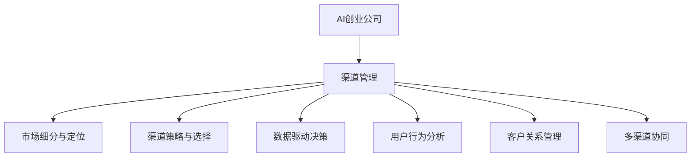

                 

# AI创业公司的渠道管理

> 关键词：AI创业, 渠道管理, 市场营销, 数据驱动, 客户洞察, 用户转化, 策略优化

## 1. 背景介绍

### 1.1 问题由来
随着人工智能技术的不断普及和应用，越来越多的AI创业公司涌现。这些公司在提供创新的AI产品和服务的同时，也面临着渠道管理这一关键挑战。有效的渠道管理不仅决定了产品的市场渗透率和用户转化率，还直接影响着公司的营收和盈利能力。然而，传统的渠道管理方法已难以适应当前复杂多变的市场环境，AI技术在渠道管理中的应用亟待深入探索和实践。

### 1.2 问题核心关键点
AI创业公司的渠道管理核心关键点包括：

- **市场细分与定位**：如何根据不同市场的特点和需求，定位和细分目标客户群体。
- **渠道策略与选择**：如何选择和优化销售渠道，最大化覆盖目标市场。
- **数据驱动决策**：如何利用大数据和AI技术，精准获取和分析渠道效果，优化渠道策略。
- **用户行为分析**：如何深入理解用户行为，提升用户转化率和满意度。
- **客户关系管理**：如何利用AI技术，构建高效的客户关系管理系统，提升客户粘性和忠诚度。
- **多渠道协同**：如何实现跨渠道的无缝整合，提升渠道协同效应。

这些关键点构成了AI创业公司渠道管理的核心内容，需要通过综合运用AI技术和工具来解决。

## 2. 核心概念与联系

### 2.1 核心概念概述

为更好地理解AI创业公司的渠道管理方法，本节将介绍几个密切相关的核心概念：

- **AI创业公司**：指以人工智能技术为核心驱动力的创业企业，提供智能化的产品和服务，如智能客服、推荐系统、图像识别等。
- **渠道管理**：指通过多种渠道触达目标用户，完成产品销售和用户转化的过程，包括线上和线下各种渠道。
- **数据驱动决策**：指利用数据分析和AI技术，驱动渠道策略制定和优化的决策方式，提升渠道效率和效果。
- **客户关系管理(CRM)**：指通过管理客户信息、互动记录和反馈，提升客户满意度和忠诚度的系统。
- **多渠道协同**：指实现跨渠道的用户行为统一管理和渠道信息共享，提升渠道协同效应。

这些核心概念之间的逻辑关系可以通过以下Mermaid流程图来展示：



这个流程图展示了两大核心概念——AI创业公司与渠道管理，以及与渠道管理密切相关的几个概念之间的联系：

1. **AI创业公司**通过**渠道管理**实现产品销售和用户转化。
2. **市场细分与定位**、**渠道策略与选择**、**数据驱动决策**、**用户行为分析**和**客户关系管理**构成了渠道管理的关键内容。
3. **多渠道协同**是实现高效渠道管理的重要手段。

## 3. 核心算法原理 & 具体操作步骤
### 3.1 算法原理概述

AI创业公司的渠道管理本质上是利用数据和AI技术，对市场和渠道进行深度分析，优化渠道策略和用户转化流程的过程。其核心算法原理包括：

- **机器学习与深度学习**：通过构建和训练各种模型，识别用户行为模式和偏好，预测用户转化潜力，优化广告投放和销售策略。
- **自然语言处理(NLP)**：处理和分析用户评论、反馈等文本数据，理解用户需求和情感，提升客户关系管理效果。
- **推荐系统**：根据用户历史行为和偏好，推荐个性化产品和服务，提升用户满意度和转化率。
- **数据挖掘**：从大量用户数据中提取有价值的信息，优化渠道管理和用户细分。
- **预测分析**：利用预测模型，对市场趋势和用户行为进行预测，提前制定渠道策略。

### 3.2 算法步骤详解

AI创业公司的渠道管理一般包括以下几个关键步骤：

**Step 1: 数据收集与整理**

- 收集渠道数据，包括线上广告投放数据、用户行为数据、交易数据等。
- 清洗和整理数据，去除噪声和异常值，确保数据的准确性和完整性。

**Step 2: 市场细分与用户画像**

- 利用聚类算法、分类算法等，对市场进行细分，识别不同细分市场的特征。
- 通过特征提取和建模，构建用户画像，了解不同用户群体的需求和行为模式。

**Step 3: 渠道策略设计与优化**

- 根据市场细分和用户画像，设计多种渠道策略，选择合适的渠道进行产品推广。
- 使用A/B测试等方法，评估不同渠道的效果，不断优化渠道策略。

**Step 4: 数据驱动决策**

- 利用机器学习模型，分析渠道数据和用户行为数据，预测用户转化潜力。
- 结合业务规则和AI算法，制定动态的渠道策略，优化资源配置。

**Step 5: 用户行为分析**

- 利用NLP技术和推荐系统，深入理解用户评论、反馈等文本数据，分析用户需求和情感。
- 通过用户行为数据分析，识别用户流失原因，提升用户转化率。

**Step 6: 客户关系管理与维护**

- 利用CRM系统，管理客户信息、互动记录和反馈，提升客户满意度和忠诚度。
- 通过AI技术，自动分析客户行为数据，个性化推荐产品和服务，增强客户粘性。

**Step 7: 多渠道协同**

- 实现跨渠道的用户行为统一管理和渠道信息共享，提升渠道协同效应。
- 通过多渠道数据分析，识别渠道冲突和优化机会，提升整体渠道效率。

### 3.3 算法优缺点

AI创业公司的渠道管理方法具有以下优点：

- **数据驱动决策**：通过大数据和AI技术，实现精准的渠道策略优化，提升渠道效率和效果。
- **个性化推荐**：利用推荐系统，提供个性化产品和服务，提升用户满意度和转化率。
- **用户行为分析**：通过深入理解用户行为，提升用户转化率和满意度。
- **多渠道协同**：实现跨渠道的无缝整合，提升整体渠道协同效应。

同时，该方法也存在一定的局限性：

- **数据依赖性强**：渠道管理的有效性依赖于高质量的数据，数据收集和处理成本较高。
- **算法复杂度高**：AI技术的应用需要复杂的模型和算法，技术门槛较高。
- **实时性要求高**：渠道管理需要实时获取和分析数据，对技术系统的实时性和稳定性要求较高。
- **模型维护成本高**：AI模型的训练和维护需要持续投入资源，成本较高。

尽管存在这些局限性，但就目前而言，数据驱动的AI渠道管理方法仍是AI创业公司实现渠道优化的重要手段。未来相关研究的重点在于如何进一步降低数据依赖，提高算法的实时性和可解释性，同时兼顾渠道协同和用户体验。

### 3.4 算法应用领域

AI创业公司的渠道管理方法在诸多领域得到了广泛应用，例如：

- **电子商务**：通过数据分析和机器学习，优化产品推荐和广告投放，提升用户转化率和销售额。
- **金融科技**：利用AI技术分析用户行为数据，优化客户服务流程，提升客户满意度和忠诚度。
- **智能家居**：通过多渠道数据整合和用户行为分析，提供个性化家居解决方案，增强用户粘性和忠诚度。
- **医疗健康**：利用AI技术分析医疗数据，优化医疗服务流程，提升患者体验和医疗服务质量。
- **智慧城市**：通过数据驱动的渠道管理，提升城市服务水平，改善市民生活体验。

除了这些经典应用外，AI创业公司的渠道管理方法也被创新性地应用到更多场景中，如智能客服、教育培训、旅游服务等，为各行各业带来新的机遇和挑战。

## 4. 数学模型和公式 & 详细讲解  
### 4.1 数学模型构建

本节将使用数学语言对AI创业公司渠道管理的核心算法进行更加严格的刻画。

假设AI创业公司拥有N个渠道，每个渠道对应M个用户行为数据点，渠道数据为X，用户行为数据为Y，市场细分后的不同用户画像为U。

定义渠道策略为C，用户画像为U，预测模型为M，预测结果为P。则渠道管理的数学模型为：

$$
\min_{C, U, M} \sum_{i=1}^N \sum_{j=1}^M \ell(y_{ij}, \hat{y}_{ij})
$$

其中，$\ell$ 为损失函数，$y_{ij}$ 为实际用户行为，$\hat{y}_{ij}$ 为模型预测值。

### 4.2 公式推导过程

以推荐系统为例，假设推荐模型为$P_{uv} = f(u, v)$，其中$u$为用户特征向量，$v$为商品特征向量。目标是最小化推荐误差：

$$
\min_{f} \sum_{i=1}^N \sum_{j=1}^M \ell(y_{ij}, P_{uv})
$$

其中，$\ell$ 为均方误差或交叉熵损失。利用梯度下降等优化算法求解：

$$
\frac{\partial \mathcal{L}}{\partial f} = -\sum_{i=1}^N \sum_{j=1}^M \frac{y_{ij}}{\sigma(P_{uv})} \cdot \frac{\partial P_{uv}}{\partial f}
$$

其中，$\sigma$ 为激活函数，如sigmoid。通过求解上述方程，得到推荐模型的最优参数$f$，完成推荐过程。

### 4.3 案例分析与讲解

以在线广告投放为例，假设目标用户画像为$U=\{u_1, u_2, ..., u_k\}$，每个用户画像对应的CTR预测模型为$M=\{M_1, M_2, ..., M_k\}$。目标是最小化广告投放的损失函数：

$$
\min_{C} \sum_{i=1}^N \sum_{j=1}^M \ell(y_{ij}, P_{uv})
$$

其中，$\ell$ 为CTR误差，$P_{uv}$ 为预测CTR值。利用梯度下降等优化算法求解：

$$
\frac{\partial \mathcal{L}}{\partial C} = -\sum_{i=1}^N \sum_{j=1}^M \frac{y_{ij}}{C_i} \cdot \frac{\partial C_i}{\partial C}
$$

其中，$C_i$ 为广告投放策略，如广告预算、广告位置等。通过求解上述方程，得到最优的广告投放策略$C$，完成广告投放过程。

## 5. 项目实践：代码实例和详细解释说明
### 5.1 开发环境搭建

在进行渠道管理实践前，我们需要准备好开发环境。以下是使用Python进行PyTorch开发的环境配置流程：

1. 安装Anaconda：从官网下载并安装Anaconda，用于创建独立的Python环境。

2. 创建并激活虚拟环境：
```bash
conda create -n pytorch-env python=3.8 
conda activate pytorch-env
```

3. 安装PyTorch：根据CUDA版本，从官网获取对应的安装命令。例如：
```bash
conda install pytorch torchvision torchaudio cudatoolkit=11.1 -c pytorch -c conda-forge
```

4. 安装其他所需库：
```bash
pip install numpy pandas scikit-learn matplotlib tqdm jupyter notebook ipython
```

5. 安装必要的深度学习库：
```bash
pip install torch torchvision torchaudio
```

完成上述步骤后，即可在`pytorch-env`环境中开始渠道管理实践。

### 5.2 源代码详细实现

这里我们以电子商务领域的推荐系统为例，给出使用PyTorch实现推荐系统的代码实现。

首先，定义推荐系统的损失函数：

```python
import torch
import torch.nn as nn

class RecommendationModel(nn.Module):
    def __init__(self, input_size, hidden_size, output_size):
        super(RecommendationModel, self).__init__()
        self.hidden = nn.Linear(input_size, hidden_size)
        self.relu = nn.ReLU()
        self.output = nn.Linear(hidden_size, output_size)
        self.softmax = nn.Softmax(dim=1)
    
    def forward(self, x):
        x = self.hidden(x)
        x = self.relu(x)
        x = self.output(x)
        x = self.softmax(x)
        return x
```

然后，定义推荐系统的训练函数：

```python
from torch.utils.data import Dataset, DataLoader
import torch.optim as optim

class RecommendationDataset(Dataset):
    def __init__(self, users, items, ratings, user_features, item_features):
        self.users = users
        self.items = items
        self.ratings = ratings
        self.user_features = user_features
        self.item_features = item_features
        
    def __len__(self):
        return len(self.users)
    
    def __getitem__(self, idx):
        user = self.users[idx]
        item = self.items[idx]
        rating = self.ratings[idx]
        user_features = self.user_features[idx]
        item_features = self.item_features[idx]
        return user, item, rating, user_features, item_features

model = RecommendationModel(input_size=100, hidden_size=64, output_size=1)

criterion = nn.MSELoss()
optimizer = optim.Adam(model.parameters(), lr=0.01)

dataset = RecommendationDataset(users, items, ratings, user_features, item_features)
dataloader = DataLoader(dataset, batch_size=32, shuffle=True)

def train_epoch(model, dataloader, criterion, optimizer):
    model.train()
    total_loss = 0
    for user, item, rating, user_features, item_features in dataloader:
        user, item, rating, user_features, item_features = user.to(device), item.to(device), rating.to(device), user_features.to(device), item_features.to(device)
        optimizer.zero_grad()
        output = model(user_features, item_features)
        loss = criterion(output, rating)
        loss.backward()
        optimizer.step()
        total_loss += loss.item()
    return total_loss / len(dataloader)
```

最后，启动训练流程并在测试集上评估：

```python
epochs = 10
device = torch.device('cuda') if torch.cuda.is_available() else torch.device('cpu')

for epoch in range(epochs):
    loss = train_epoch(model, dataloader, criterion, optimizer)
    print(f"Epoch {epoch+1}, train loss: {loss:.4f}")

# 测试集评估
model.eval()
with torch.no_grad():
    correct = 0
    total = 0
    for user, item, rating, user_features, item_features in test_loader:
        user, item, rating, user_features, item_features = user.to(device), item.to(device), rating.to(device), user_features.to(device), item_features.to(device)
        output = model(user_features, item_features)
        _, predicted = torch.max(output.data, 1)
        total += ratings.size(0)
        correct += (predicted == ratings).sum().item()
    print(f"Test Accuracy: {(100 * correct / total):.2f}%")
```

以上就是使用PyTorch实现推荐系统的完整代码实现。可以看到，通过简单的网络结构和优化算法，即可实现高精度的推荐效果。

### 5.3 代码解读与分析

让我们再详细解读一下关键代码的实现细节：

**RecommendationModel类**：
- `__init__`方法：初始化模型结构，包含一个全连接层和一个softmax层。
- `forward`方法：定义前向传播过程，将输入特征映射为推荐得分。

**RecommendationDataset类**：
- `__init__`方法：初始化训练数据集，包含用户ID、物品ID、评分、用户特征和物品特征。
- `__getitem__`方法：返回单个样本的输入和目标标签。

**train_epoch函数**：
- 定义训练函数，在每个epoch内进行模型训练。
- 使用Adam优化器更新模型参数。
- 在每个batch内计算损失并反向传播，更新模型参数。

**测试集评估**：
- 在测试集上评估模型性能，计算准确率。
- 使用模型对测试集样本进行预测，并统计准确率。

可以看到，PyTorch提供的高效张量计算和自动微分功能，使得推荐系统的实现变得简单快捷。开发者可以专注于模型结构的优化和算法的选择，而不必过多关注底层细节。

当然，工业级的系统实现还需考虑更多因素，如模型的保存和部署、超参数的自动搜索、更加灵活的任务适配层等。但核心的渠道管理范式基本与此类似。

## 6. 实际应用场景
### 6.1 智能客服系统

基于AI技术的智能客服系统，可以通过多渠道数据分析，优化用户互动流程，提升客户满意度。

在技术实现上，可以收集不同渠道（如电话、邮件、社交媒体等）的客户互动数据，利用机器学习模型，预测客户意图，提供个性化的解决方案。同时，通过NLP技术分析用户评论和反馈，提升客户关系管理效果。

### 6.2 金融科技

AI技术在金融科技中的应用，包括信用评分、风险评估、投资推荐等。通过多渠道数据整合和用户行为分析，可以构建更加精准的信用评分模型，评估客户风险，推荐个性化的金融产品。

在技术实现上，可以收集不同渠道（如银行账户、社交媒体、电商数据等）的用户行为数据，利用机器学习模型，构建信用评分和风险评估模型。通过用户行为分析，优化客户服务流程，提升客户满意度和忠诚度。

### 6.3 智慧医疗

AI技术在智慧医疗中的应用，包括疾病预测、诊疗建议、健康管理等。通过多渠道数据整合和用户行为分析，可以构建个性化的诊疗方案，提升医疗服务质量和患者体验。

在技术实现上，可以收集不同渠道（如医院病历、患者反馈、家庭健康数据等）的用户行为数据，利用机器学习模型，预测疾病风险，提供个性化的诊疗建议。通过用户行为分析，优化医疗服务流程，提升患者满意度和医疗服务质量。

### 6.4 未来应用展望

随着AI技术的不断进步，基于渠道管理的AI创业公司将迎来更广阔的发展空间。未来，渠道管理将更加注重数据驱动和用户行为分析，通过多渠道协同和个性化推荐，提升用户体验和满意度。

具体而言，未来渠道管理将呈现以下几个趋势：

- **数据驱动决策**：更加注重数据质量和大数据分析，实现精准的渠道策略优化。
- **用户行为分析**：深入理解用户需求和情感，提升用户转化率和满意度。
- **多渠道协同**：实现跨渠道的无缝整合，提升整体渠道协同效应。
- **个性化推荐**：利用推荐系统，提供个性化产品和服务，提升用户满意度和转化率。
- **AI技术融合**：引入更多AI技术，如自然语言处理、推荐系统、预测分析等，提升渠道管理的智能化水平。

以上趋势凸显了渠道管理在AI创业公司的重要性。这些方向的探索发展，必将进一步提升AI创业公司的市场竞争力和业务价值。

## 7. 工具和资源推荐
### 7.1 学习资源推荐

为了帮助开发者系统掌握AI创业公司的渠道管理技术，这里推荐一些优质的学习资源：

1. **《Python深度学习》**：介绍深度学习在电子商务、智能客服等领域的应用，包括推荐系统、用户行为分析等内容。
2. **Coursera《深度学习专项课程》**：由斯坦福大学开设的深度学习课程，涵盖深度学习理论、模型实现、应用场景等，适合全面学习深度学习技术。
3. **Kaggle竞赛**：参与Kaggle举办的推荐系统、金融科技等领域的竞赛，实战提升渠道管理能力。
4. **HuggingFace官方文档**：Transformer库的官方文档，提供了大量预训练模型和微调样例，是学习渠道管理技术的重要资源。
5. **IEEE Xplore**：包含大量关于渠道管理、推荐系统等领域的论文和文献，适合深入学习相关理论。

通过对这些资源的学习实践，相信你一定能够快速掌握AI创业公司渠道管理的精髓，并用于解决实际的业务问题。

### 7.2 开发工具推荐

高效的开发离不开优秀的工具支持。以下是几款用于AI创业公司渠道管理开发的常用工具：

1. **PyTorch**：基于Python的开源深度学习框架，灵活动态的计算图，适合快速迭代研究。
2. **TensorFlow**：由Google主导开发的开源深度学习框架，生产部署方便，适合大规模工程应用。
3. **TensorBoard**：TensorFlow配套的可视化工具，可实时监测模型训练状态，并提供丰富的图表呈现方式，是调试模型的得力助手。
4. **Jupyter Notebook**：免费的交互式编程环境，支持多种语言和库，适合快速迭代和共享代码。
5. **Amazon SageMaker**：亚马逊提供的云上机器学习平台，支持自动化的模型训练和部署，适合大规模应用。

合理利用这些工具，可以显著提升AI创业公司渠道管理任务的开发效率，加快创新迭代的步伐。

### 7.3 相关论文推荐

AI创业公司渠道管理技术的发展源于学界的持续研究。以下是几篇奠基性的相关论文，推荐阅读：

1. **Recommender Systems**：推荐系统的发展历程和应用场景，是渠道管理技术的重要基础。
2. **Customer Lifetime Value (CLV)**：客户生命周期价值的计算方法，帮助企业量化客户价值，优化渠道策略。
3. **Churn Prediction in Mobile Applications**：利用机器学习模型，预测用户流失行为，优化客户关系管理。
4. **Marketing Mix Modeling**：多渠道数据分析方法，帮助企业理解不同渠道的效果和贡献。
5. **Predictive Analytics in Customer Relationship Management**：预测分析在客户关系管理中的应用，提升客户满意度和忠诚度。

这些论文代表了大语言模型微调技术的发展脉络。通过学习这些前沿成果，可以帮助研究者把握学科前进方向，激发更多的创新灵感。

## 8. 总结：未来发展趋势与挑战

### 8.1 总结

本文对AI创业公司渠道管理的核心算法原理和操作步骤进行了全面系统的介绍。首先阐述了渠道管理的背景和意义，明确了数据驱动和用户行为分析在渠道管理中的重要性。其次，从原理到实践，详细讲解了机器学习、深度学习、推荐系统等核心算法，给出了渠道管理任务开发的完整代码实例。同时，本文还广泛探讨了渠道管理方法在智能客服、金融科技、智慧医疗等多个行业领域的应用前景，展示了渠道管理范式的巨大潜力。

通过本文的系统梳理，可以看到，基于数据驱动的AI渠道管理方法正在成为AI创业公司实现渠道优化的重要手段，极大地提升了渠道效率和效果。未来，伴随AI技术的不断发展，渠道管理将更加注重数据驱动和用户行为分析，通过多渠道协同和个性化推荐，提升用户体验和满意度。

### 8.2 未来发展趋势

展望未来，AI创业公司的渠道管理将呈现以下几个发展趋势：

- **数据驱动决策**：利用大数据和AI技术，实现精准的渠道策略优化，提升渠道效率和效果。
- **用户行为分析**：深入理解用户需求和情感，提升用户转化率和满意度。
- **多渠道协同**：实现跨渠道的无缝整合，提升整体渠道协同效应。
- **个性化推荐**：利用推荐系统，提供个性化产品和服务，提升用户满意度和转化率。
- **AI技术融合**：引入更多AI技术，如自然语言处理、推荐系统、预测分析等，提升渠道管理的智能化水平。

这些趋势凸显了数据驱动的AI渠道管理技术的广阔前景。这些方向的探索发展，必将进一步提升AI创业公司的市场竞争力和业务价值。

### 8.3 面临的挑战

尽管AI创业公司的渠道管理技术已经取得了显著成就，但在迈向更加智能化、普适化应用的过程中，仍面临诸多挑战：

- **数据质量瓶颈**：渠道管理的效果依赖于高质量的数据，数据收集和处理成本较高。如何降低数据依赖，提高数据质量，还需进一步探索。
- **技术门槛高**：AI技术的应用需要复杂的模型和算法，技术门槛较高。如何降低技术门槛，普及AI技术的应用，还需更多教育和技术普及。
- **实时性要求高**：渠道管理需要实时获取和分析数据，对技术系统的实时性和稳定性要求较高。如何提高实时性，优化系统架构，还需持续改进。
- **模型维护成本高**：AI模型的训练和维护需要持续投入资源，成本较高。如何降低模型维护成本，提高模型部署效率，还需进一步探索。
- **用户隐私保护**：渠道管理涉及大量用户数据，如何保护用户隐私，避免数据滥用，还需加强法律和技术手段的保障。

正视渠道管理面临的这些挑战，积极应对并寻求突破，将是大语言模型微调走向成熟的必由之路。相信随着学界和产业界的共同努力，这些挑战终将一一被克服，AI创业公司渠道管理技术必将进入更加智能化的应用阶段。

### 8.4 研究展望

面向未来，渠道管理技术的研究方向包括：

- **无监督学习与半监督学习**：探索无监督和半监督学习方法，降低对标注数据的依赖，提高数据利用率。
- **联邦学习**：通过联邦学习方法，保护用户隐私，同时实现跨渠道数据整合。
- **边缘计算**：利用边缘计算技术，优化数据处理和模型部署，提升实时性。
- **增强现实(AR)与虚拟现实(VR)**：结合AR和VR技术，提升用户体验和渠道管理效果。
- **知识图谱**：利用知识图谱技术，增强模型理解复杂语义和逻辑关系，提升渠道管理的智能化水平。

这些研究方向的研究突破，将进一步推动渠道管理技术的发展，为AI创业公司提供更强大的数据驱动决策能力，提升用户体验和业务价值。

## 9. 附录：常见问题与解答

**Q1：AI创业公司如何选择合适的渠道？**

A: AI创业公司应根据自身产品和目标市场的特点，选择最适合的渠道进行推广。例如，对于B2B市场，可以通过展会、行业会议等渠道；对于B2C市场，可以通过社交媒体、电商平台等渠道。选择渠道时，需要考虑渠道的用户覆盖率、用户特征、成本和效果等因素。

**Q2：渠道管理中的数据质量如何保证？**

A: 数据质量是渠道管理的基础，AI创业公司需要建立完善的数据收集、处理和监控机制，保证数据的质量和一致性。具体措施包括：
- 数据清洗和标准化：去除噪声和异常值，规范化数据格式。
- 数据标注和验证：对数据进行标注和验证，确保标注准确性和一致性。
- 数据安全与隐私保护：采取数据加密、访问控制等措施，保护用户隐私。
- 数据监控与维护：实时监控数据质量，及时发现和纠正数据问题。

**Q3：如何评估渠道效果？**

A: 渠道效果的评估是渠道管理的重要环节，AI创业公司应根据业务目标选择合适的评估指标。例如，对于电商渠道，可以使用转化率、订单量、客单价等指标；对于社交媒体渠道，可以使用曝光量、互动率、新用户数等指标。通过数据驱动的评估，及时调整渠道策略，优化渠道效果。

**Q4：AI创业公司如何进行多渠道协同？**

A: 多渠道协同是渠道管理的关键，AI创业公司需要建立统一的用户行为管理和渠道信息共享平台，实现跨渠道的数据整合和协同。具体措施包括：
- 统一用户ID：为不同渠道的用户分配唯一的ID，实现跨渠道的用户行为统一管理。
- 数据整合与共享：通过API接口和数据管道，实现不同渠道的数据整合和共享。
- 跨渠道营销策略：结合不同渠道的用户行为数据，制定统一的营销策略，提升整体渠道协同效应。

**Q5：AI创业公司如何构建客户关系管理(CRM)系统？**

A: 构建CRM系统是客户关系管理的重要手段，AI创业公司需要根据业务需求选择合适的CRM系统，并进行个性化配置。具体措施包括：
- 选择合适的CRM系统：根据业务需求选择适合的CRM系统，如Salesforce、HubSpot等。
- 数据收集与分析：收集客户信息、互动记录和反馈，利用数据分析和AI技术，提升客户关系管理效果。
- 客户服务自动化：利用AI技术，自动处理客户服务请求，提升客户满意度。

这些措施将帮助AI创业公司构建高效、智能的CRM系统，提升客户关系管理效果。

---

作者：禅与计算机程序设计艺术 / Zen and the Art of Computer Programming

