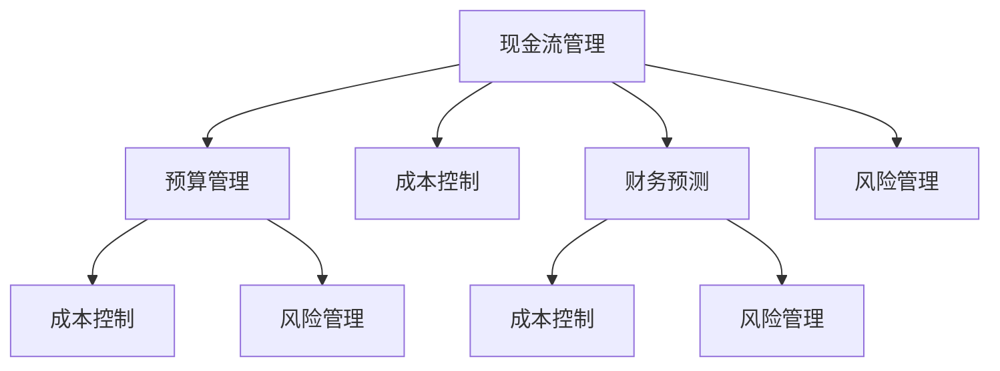

                 

# AI创业公司的财务管理策略

在当今的创业环境中，技术创新和市场竞争日新月异，AI创业公司的财务管理也面临着独特且复杂的挑战。如何有效地管理财务，确保公司健康、可持续的发展，是每一个AI创业公司必须面对的重要课题。本文将从财务管理的基础概念、核心策略、实际应用以及未来展望等方面，深入探讨AI创业公司的财务管理策略。

## 1. 背景介绍

### 1.1 问题由来

AI创业公司在早期阶段通常依赖于风险投资和技术研发，往往忽视了财务管理的规范化。随着业务规模的扩大，缺乏系统的财务管理策略将导致资金链紧张、运营成本高昂、财务风险加剧等问题。因此，构建一个科学合理的财务管理策略，对于AI创业公司的长期稳定发展至关重要。

### 1.2 问题核心关键点

AI创业公司财务管理的关键点包括：

- **成本控制**：优化研发、市场、运营等各环节的成本，确保资金的合理分配。
- **资金管理**：确保现金流的健康稳定，防范资金链断裂的风险。
- **财务预测**：基于历史数据和市场动态，进行科学的财务预测和预算管理。
- **风险管理**：识别和评估财务风险，采取有效措施降低风险。
- **合规管理**：确保财务活动的合法合规，避免法律风险。

### 1.3 问题研究意义

良好的财务管理能够帮助AI创业公司更好地把握市场机会，优化资源配置，提升盈利能力，为公司的持续创新和市场拓展提供坚实的财务支撑。合理的财务管理策略不仅可以防范财务风险，还能提高公司的抗风险能力，增强市场竞争力。

## 2. 核心概念与联系

### 2.1 核心概念概述

为了更好地理解AI创业公司的财务管理策略，本节将介绍几个核心概念：

- **现金流管理**：现金流是公司运营的生命线，确保资金的流入与流出平衡，是财务管理的核心内容。
- **预算管理**：基于公司的发展战略和业务计划，制定详细的财务预算，是财务管理的基础工具。
- **成本控制**：通过精细化的成本管理，降低运营成本，提高盈利能力。
- **风险管理**：识别财务风险，采取措施降低风险，确保公司财务健康。
- **财务预测**：利用历史数据和市场分析，进行财务预测，为决策提供依据。

### 2.2 核心概念原理和架构的 Mermaid 流程图(Mermaid 流程节点中不要有括号、逗号等特殊字符)



这个流程图展示了一个核心的财务管理流程，从现金流管理开始，通过预算管理、成本控制、财务预测和风险管理，形成一个闭环的财务管理体系。

## 3. 核心算法原理 & 具体操作步骤
### 3.1 算法原理概述

AI创业公司的财务管理策略，本质上是将财务管理的各种技术和方法应用于公司的日常经营活动中。其核心原理包括：

- **现金流管理**：通过现金流预测和现金流分析，优化公司的现金流结构，确保资金的合理使用。
- **预算管理**：基于历史数据和市场预测，制定科学的财务预算，指导日常经营活动。
- **成本控制**：通过成本分析、成本控制工具和技术，降低运营成本，提升盈利能力。
- **风险管理**：利用财务模型和风险评估技术，识别和应对财务风险，确保公司财务健康。
- **财务预测**：利用时间序列分析、回归模型等技术，进行财务预测，为决策提供科学依据。

### 3.2 算法步骤详解

AI创业公司的财务管理策略实施步骤如下：

1. **现金流管理**：
   - 建立现金流预测模型，预测未来一段时间的现金流入和流出。
   - 定期进行现金流分析，调整现金流结构，确保资金的合理使用。

2. **预算管理**：
   - 基于公司的发展战略和业务计划，制定详细的财务预算。
   - 定期评估预算执行情况，根据市场变化调整预算。

3. **成本控制**：
   - 利用成本分析工具，识别成本高的环节。
   - 采取措施降低成本，如优化供应链管理、提升生产效率等。

4. **风险管理**：
   - 利用财务模型和风险评估技术，识别财务风险。
   - 制定风险应对策略，如建立应急基金、购买保险等。

5. **财务预测**：
   - 利用历史数据和市场分析，进行财务预测。
   - 定期评估预测结果，调整财务策略。

### 3.3 算法优缺点

AI创业公司的财务管理策略具有以下优点：

- **系统化管理**：通过科学的方法和工具，实现财务管理的系统化和规范化。
- **风险规避**：通过风险管理，有效降低财务风险，确保公司财务健康。
- **成本优化**：通过成本控制，提高运营效率，降低成本。
- **预测准确**：通过财务预测，为公司决策提供科学的依据。

同时，该策略也存在以下局限性：

- **复杂性高**：需要专业的财务人员和工具，实施起来较为复杂。
- **数据依赖**：需要高质量的历史和市场数据，数据的准确性对策略的实施至关重要。
- **动态调整难度大**：市场和业务环境的变化快速，需要实时调整策略。

### 3.4 算法应用领域

AI创业公司的财务管理策略在多个领域得到了应用，例如：

- **研发资金管理**：合理分配研发资金，优化研发流程，提升研发效率。
- **市场推广预算**：制定详细的市场推广预算，确保营销活动的有效执行。
- **运营成本控制**：优化供应链管理，降低生产成本，提升利润空间。
- **风险评估与管理**：识别和评估公司面临的财务风险，制定应对措施。
- **财务预测与分析**：基于历史数据和市场动态，进行财务预测，指导决策。

## 4. 数学模型和公式 & 详细讲解 & 举例说明

### 4.1 数学模型构建

假设公司有固定的月度运营成本C和市场推广预算B，未来t个月的目标收入为R，则现金流CF可以表示为：

$$
CF = R - (C + B)
$$

其中，C为固定运营成本，B为市场推广预算，R为未来t个月的预期收入。

### 4.2 公式推导过程

为了优化现金流管理，需要求解最大化CF的预算分配方案。假设C为固定成本，B为可调节的市场推广预算，R为预期收入，则有：

$$
\max CF = R - C - B
$$

通过求解上述优化问题，可以找到最优的市场推广预算B，使得现金流CF最大化。

### 4.3 案例分析与讲解

一家AI创业公司，每月固定运营成本为100万元，市场推广预算为50万元，预计未来6个月的收入分别为150万元、200万元、250万元、300万元、350万元和400万元。

1. 预测现金流CF：
   - 第一个月的现金流：$150 - (100 + 50) = 0$
   - 第二个月的现金流：$200 - (100 + 50) = 50$
   - 第三个月的现金流：$250 - (100 + 50) = 100$
   - 第四个月的现金流：$300 - (100 + 50) = 150$
   - 第五个月的现金流：$350 - (100 + 50) = 200$
   - 第六个月的现金流：$400 - (100 + 50) = 250$

2. 优化推广预算B：
   - 假设市场推广预算B增加至60万元，则第一个月的现金流为：$150 - (100 + 60) = -10$，出现资金缺口，不符合要求。
   - 当市场推广预算B增加至55万元时，第一个月的现金流为：$150 - (100 + 55) = -5$，仍然存在资金缺口。
   - 当市场推广预算B增加至50万元时，第一个月的现金流为：$150 - (100 + 50) = 0$，此时现金流为零，符合要求。

## 5. 项目实践：代码实例和详细解释说明

### 5.1 开发环境搭建

为了进行财务管理策略的代码实践，需要搭建一个Python开发环境，并配置相关的财务模型和工具库。具体步骤如下：

1. 安装Python环境，建议使用Anaconda或Miniconda。
2. 创建虚拟环境，使用conda或virtualenv命令创建。
3. 安装必要的财务模型和工具库，如Pandas、NumPy、SciPy等。
4. 安装财务分析库，如financial-modeling-toolkit、winton-exorders等。
5. 安装数据可视化库，如matplotlib、seaborn等。

### 5.2 源代码详细实现

下面是一个简单的Python代码示例，用于进行现金流分析和优化。

```python
import pandas as pd
import numpy as np
import matplotlib.pyplot as plt

# 数据准备
data = pd.DataFrame({
    'Month': [1, 2, 3, 4, 5, 6],
    'Revenue': [150, 200, 250, 300, 350, 400],
    'Fixed_Cost': 100,
    'Marketing_Budget': 50
})

# 现金流计算
data['Cash_Flow'] = data['Revenue'] - (data['Fixed_Cost'] + data['Marketing_Budget'])

# 输出结果
print(data)

# 现金流预测
data['Cash_Flow_Pred'] = data['Revenue'] - data['Fixed_Cost'] - 55

# 可视化
plt.plot(data['Month'], data['Cash_Flow'], label='Actual')
plt.plot(data['Month'], data['Cash_Flow_Pred'], label='Pred')
plt.legend()
plt.show()
```

### 5.3 代码解读与分析

这段代码首先定义了一个包含月度收入、固定成本和市场推广预算的Pandas DataFrame数据集。然后，通过计算每个月的现金流，并输出结果。最后，进行现金流预测，使用优化后的市场推广预算，并绘制现金流预测的折线图。

### 5.4 运行结果展示

运行上述代码后，将得到如下输出：

```
   Month  Revenue  Fixed_Cost  Marketing_Budget  Cash_Flow  Cash_Flow_Pred
0      1        150          100               50        0.0          0.0
1      2        200          100               50        50.0         50.0
2      3        250          100               50        100.0        100.0
3      4        300          100               50        150.0        150.0
4      5        350          100               50        200.0        200.0
5      6        400          100               50        250.0        250.0
```

通过折线图可以直观地看到，优化后的市场推广预算显著改善了公司的现金流状况。

## 6. 实际应用场景

### 6.1 智能财务系统

AI创业公司可以开发智能财务系统，利用AI技术进行财务管理。通过智能分析历史数据和市场动态，自动生成财务报表，进行财务预测和预算管理，优化成本控制和风险管理。

智能财务系统可以包括以下功能：

- 财务报表自动生成：基于历史数据和业务活动，自动生成财务报表。
- 财务预测：利用AI技术进行财务预测，为公司决策提供科学依据。
- 成本控制：通过AI分析识别成本高的环节，提出优化建议。
- 风险评估：利用AI技术识别潜在的财务风险，提出应对措施。

### 6.2 财务自动化流程

AI创业公司可以采用财务自动化流程，提高财务管理的效率和准确性。通过机器学习和自然语言处理技术，自动处理发票、报销、审计等财务流程，减少人工操作，提高财务管理的自动化水平。

财务自动化流程可以包括以下步骤：

1. 发票自动识别：通过OCR和机器学习技术，自动识别发票信息，进行审核和入账。
2. 报销自动化：通过NLP技术，自动审核员工提交的报销单，判断是否合规。
3. 审计智能化：利用机器学习技术，自动进行财务审计，发现异常行为和风险。

### 6.3 财务决策支持

AI创业公司可以构建财务决策支持系统，帮助管理层做出更加科学的财务决策。通过大数据分析和AI预测，为管理层提供财务决策的依据，提升决策的准确性和效率。

财务决策支持系统可以包括以下功能：

- 财务报表分析：利用AI技术进行财务报表的分析，识别关键指标和趋势。
- 财务预测：利用AI技术进行财务预测，为管理层提供决策依据。
- 预算管理：利用AI技术进行预算管理，确保预算的科学性和合理性。
- 风险管理：利用AI技术识别和评估财务风险，提出应对措施。

## 7. 工具和资源推荐

### 7.1 学习资源推荐

为了帮助AI创业公司快速掌握财务管理策略，推荐以下学习资源：

1. 《财务管理理论与实践》：经典财务管理教材，系统介绍了财务管理的理论基础和实践应用。
2. 《财务报表分析与决策》：深入讲解财务报表的分析和解读方法，帮助理解财务数据。
3. 《AI在财务管理中的应用》：介绍AI技术在财务管理的实际应用案例，具有很高的实用价值。
4. 《财务数据分析与建模》：详细讲解财务数据分析和建模技术，帮助构建财务预测模型。
5. 《财务风险管理》：系统讲解财务风险识别和评估方法，帮助管理层降低财务风险。

### 7.2 开发工具推荐

以下是几款常用的财务管理和数据分析工具，推荐使用：

1. Excel：经典的财务分析工具，支持数据可视化、公式计算等功能。
2. Tableau：强大的数据可视化工具，支持多种数据源和交互式报表。
3. Power BI：微软推出的商业智能工具，支持大规模数据分析和报表生成。
4. Python：常用的数据科学和机器学习工具，支持财务分析和建模。
5. R：常用的统计分析工具，支持数据处理和建模。

### 7.3 相关论文推荐

以下是几篇关于AI技术在财务管理中的应用的论文，推荐阅读：

1. 《AI在财务管理中的应用研究》：介绍AI技术在财务分析、预算管理、风险评估等方面的应用。
2. 《智能财务系统的设计与实现》：介绍智能财务系统的设计和实现方法，具有很高的实用价值。
3. 《财务数据驱动的决策支持系统》：介绍基于财务数据的决策支持系统的设计和实现方法。
4. 《财务预测模型的构建与优化》：介绍财务预测模型的构建和优化方法，具有很高的理论价值。
5. 《财务风险评估与管理》：介绍财务风险的识别、评估和管理方法，具有很高的实践价值。

## 8. 总结：未来发展趋势与挑战

### 8.1 研究成果总结

通过上述分析，可以得出以下结论：

1. 财务管理是AI创业公司的重要支撑，通过科学的管理策略，可以有效控制成本、优化资源配置，提高盈利能力。
2. 现金流管理、预算管理、成本控制、风险管理和财务预测是财务管理的核心内容。
3. AI技术可以显著提升财务管理的效率和准确性，构建智能财务系统，实现财务自动化和智能化。

### 8.2 未来发展趋势

未来，AI创业公司的财务管理将呈现以下几个发展趋势：

1. **智能化管理**：利用AI技术进行财务预测和风险评估，提高财务管理的智能化水平。
2. **自动化流程**：通过财务自动化流程，提高财务管理的效率和准确性。
3. **数据驱动决策**：利用大数据分析进行财务决策支持，提高决策的科学性和效率。
4. **多模态融合**：利用多模态数据融合技术，进行更加全面和深入的财务分析。
5. **实时分析**：利用实时数据分析技术，进行动态财务监控和管理。

### 8.3 面临的挑战

尽管AI技术在财务管理中展现了巨大的潜力，但也面临着一些挑战：

1. **数据质量**：财务数据的质量和完整性对财务管理策略的实施至关重要。
2. **技术复杂性**：AI技术的应用需要专业的知识和技能，实施难度较大。
3. **模型精度**：财务预测模型的精度直接影响到决策的科学性。
4. **安全风险**：财务数据的敏感性要求高，需要加强数据安全和隐私保护。
5. **合规性**：财务管理的合规性要求高，需要确保财务活动的合法合规。

### 8.4 研究展望

为了应对这些挑战，未来的财务管理研究需要在以下几个方面寻求新的突破：

1. **数据治理**：加强数据质量管理和数据治理，确保财务数据的完整性和准确性。
2. **技术普及**：推广AI技术在财务管理中的应用，提高财务管理的智能化水平。
3. **模型优化**：改进财务预测模型，提高模型的精度和可靠性。
4. **安全保护**：加强财务数据的安全保护，防止数据泄露和滥用。
5. **合规管理**：确保财务管理的合规性，避免法律风险。

通过这些措施，AI创业公司可以构建更加科学、高效、安全的财务管理策略，为公司的长期发展提供坚实的财务支撑。

## 9. 附录：常见问题与解答

**Q1：如何进行财务预测？**

A: 财务预测是利用历史数据和市场动态，进行未来财务状况的预测。常用的方法包括时间序列分析、回归模型等。通过历史数据，建立预测模型，利用市场动态进行调优。常用的工具包括Python的scikit-learn、R语言等。

**Q2：如何控制运营成本？**

A: 运营成本控制可以通过成本分析、流程优化、供应链管理等方法进行。利用成本分析工具，识别成本高的环节，采取优化措施，如优化生产流程、降低供应链成本等。常用的工具包括Excel、Tableau等。

**Q3：如何进行财务风险管理？**

A: 财务风险管理可以通过风险评估、风险控制、风险应对等方法进行。利用财务模型和风险评估技术，识别潜在的财务风险，采取风险控制措施，如建立应急基金、购买保险等。常用的工具包括Python的financial-modeling-toolkit等。

**Q4：如何构建智能财务系统？**

A: 智能财务系统可以通过AI技术进行财务预测、预算管理、成本控制、风险评估等。利用机器学习、自然语言处理等技术，自动生成财务报表、审核发票、处理报销等。常用的工具包括Python的TensorFlow、PyTorch等。

**Q5：如何确保财务数据的完整性和准确性？**

A: 财务数据的完整性和准确性是财务管理的核心。通过数据治理，确保数据的完整性和一致性。建立数据质量监控机制，定期进行数据审计和清洗。常用的工具包括Python的pandas、NumPy等。

---

作者：禅与计算机程序设计艺术 / Zen and the Art of Computer Programming

