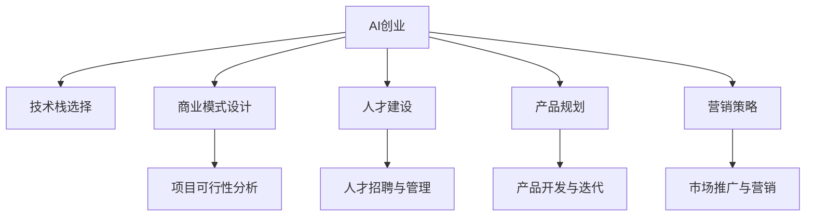

                 

# AI创业的关键成功因素：Lepton AI的经验总结

> 关键词：AI创业,Lepton AI,技术栈,商业模式,人才建设,产品规划,营销策略

## 1. 背景介绍

### 1.1 问题由来
近年来，人工智能（AI）技术迅猛发展，成为驱动创新和经济增长的重要引擎。尤其是在AI创业领域，企业纷纷涌现，试图抓住这一波高科技发展的红利。然而，尽管AI技术本身具备强大的潜力，但如何将技术成功商业化，依然是一大挑战。Lepton AI作为一家致力于AI技术研发和商业化的公司，凭借其在技术、产品、市场等方面的丰富经验，总结出了一系列关键的AI创业成功因素。本文将深入探讨这些因素，以期为AI创业者提供有价值的参考。

### 1.2 问题核心关键点
AI创业的核心在于将技术优势转化为商业价值，涵盖技术栈选择、商业模式设计、人才建设、产品规划、营销策略等多个方面。Lepton AI的经验显示，以上每个环节都对创业成功至关重要，必须系统化、科学化地进行布局和优化。

### 1.3 问题研究意义
通过深入分析Lepton AI的成功经验，本文旨在揭示AI创业中不可或缺的关键因素，帮助AI创业者在实际应用中少走弯路，提升项目成功率。此外，本文还将对AI创业的未来趋势和面临的挑战进行探讨，为AI领域的新兴企业提供战略性思考。

## 2. 核心概念与联系

### 2.1 核心概念概述

为更好地理解AI创业的关键成功因素，本节将介绍几个密切相关的核心概念：

- **AI创业**：以AI技术为基础，通过创新商业模式和高效运营，实现产品或服务的价值创造与商业化的过程。

- **技术栈选择**：在AI创业中，选择合适的技术栈是基础，决定了项目的可行性和效率。

- **商业模式设计**：商业模式的创新设计，是实现AI技术商业化的关键。

- **人才建设**：高效的人才招聘和管理，是AI项目成功的保障。

- **产品规划**：基于市场需求和技术可行性的产品规划，直接关系到产品的竞争力和市场接受度。

- **营销策略**：通过有效的市场推广，提升产品知名度和用户粘性。

这些核心概念之间的逻辑关系可以通过以下Mermaid流程图来展示：



这个流程图展示出AI创业过程中各个环节之间的相互关系：

1. **技术栈选择**：影响项目的实施效率和成功率。
2. **商业模式设计**：决定商业化的可行性。
3. **人才建设**：确保项目的顺利进行。
4. **产品规划**：指导产品的设计方向。
5. **营销策略**：提升产品市场接受度。

这些概念共同构成了AI创业的核心框架，有助于企业系统化地考虑和解决问题。

## 3. 核心算法原理 & 具体操作步骤

### 3.1 算法原理概述

AI创业的关键在于将AI技术有效地转化为商业价值。基于这一目标，本文将介绍核心算法原理与具体操作步骤，帮助AI创业者系统理解项目的实施过程。

### 3.2 算法步骤详解

**Step 1: 技术栈选择**
选择合适的技术栈是AI创业的第一步。需要考虑以下几个因素：

- **技术成熟度**：选择成熟稳定的技术栈，如TensorFlow、PyTorch等。
- **社区支持**：选择有广泛社区支持的技术栈，便于获取资源和解决开发问题。
- **性能需求**：根据项目需求，选择计算效率高、内存占用小的技术栈。

**Step 2: 商业模式设计**
商业模式设计需要充分考虑市场环境、用户需求和技术可行性。设计过程中，需关注以下关键点：

- **市场定位**：明确产品在市场上的定位，如ToB或ToC。
- **价值主张**：强调产品为客户带来的具体价值，如提升效率、降低成本等。
- **盈利模式**：确定合理的盈利模式，如订阅服务、按需付费等。

**Step 3: 人才建设**
人才是AI创业的核心资源，需要从以下几个方面进行人才建设：

- **招聘策略**：制定高效的人才招聘策略，吸引和留住顶尖人才。
- **培训体系**：建立系统的员工培训体系，提升团队整体技术水平。
- **文化建设**：营造创新、开放的团队文化，激发员工创造力。

**Step 4: 产品规划**
产品规划阶段，需进行详细的需求分析和技术评估，确定产品路线图：

- **需求调研**：深入了解市场需求和用户痛点。
- **技术评估**：评估技术的可行性、成熟度及实施成本。
- **产品设计**：设计产品的核心功能及用户界面。

**Step 5: 营销策略**
营销策略是推广产品、提升知名度的关键手段，需从以下几个方面进行策略设计：

- **品牌建设**：建立品牌形象，提升用户对产品的认知度。
- **渠道选择**：选择合适的营销渠道，如社交媒体、行业会议等。
- **用户获取**：设计用户获取方案，提升用户粘性和忠诚度。

### 3.3 算法优缺点

AI创业过程中，选择合适的技术栈、设计合理的商业模式、高效的人才管理和产品规划等环节，具有以下优点：

- **效率提升**：通过选择合适的技术栈和商业模式，项目实施效率大大提升。
- **市场竞争力**：合理的产品规划和营销策略，能够提升产品的市场接受度。
- **人才吸引**：高效的人才建设，能够吸引和留住顶尖人才，提升团队战斗力。

同时，这些环节也存在一定的局限性：

- **技术风险**：选择的技术栈和商业模式可能存在技术风险，影响项目实施。
- **市场需求变化**：产品规划需紧密关注市场变化，否则可能导致产品过时。
- **人才管理成本**：人才建设和管理需要较高的人力、财力投入。

尽管存在这些局限性，但就目前而言，合理选择技术栈、设计商业模式、高效人才管理和详细产品规划，依然是AI创业成功的关键因素。

### 3.4 算法应用领域

基于AI创业的核心算法原理，以下领域可以较好地应用这些方法：

- **医疗健康**：AI创业公司可以通过AI技术优化医疗诊断、提升治疗效果。
- **金融服务**：通过AI技术进行风险控制、客户服务优化。
- **零售电商**：利用AI技术进行用户行为分析、个性化推荐。
- **智能制造**：通过AI技术进行生产过程优化、质量控制。
- **智能交通**：利用AI技术优化交通流量、提升安全系数。

## 4. 数学模型和公式 & 详细讲解 & 举例说明

### 4.1 数学模型构建

在AI创业过程中，数学模型和公式的构建至关重要。以下我们将基于一个简单的AI项目，构建其数学模型。

假设一个AI项目的目标是通过预测用户行为，为用户提供个性化的推荐服务。项目的关键在于设计一个推荐模型，其输入为用户的历史行为数据，输出为用户可能感兴趣的商品列表。

模型的数学模型为：

$$
\hat{y} = f(x)
$$

其中，$x$ 为用户的输入数据，$f$ 为推荐模型，$\hat{y}$ 为模型的输出结果，即推荐商品列表。

### 4.2 公式推导过程

推荐模型的核心在于选择合适的函数 $f$，并对其进行训练和优化。常用的推荐模型包括协同过滤、内容推荐、深度学习等。以下以深度学习模型为例，进行公式推导。

假设推荐模型为多层感知器（MLP），其结构为：

$$
\hat{y} = \sigma(W_n(z) + b_n)
$$

其中，$z = W_m(x) + b_m$，$W_n$ 和 $W_m$ 分别为输出层和隐藏层的权重矩阵，$b_n$ 和 $b_m$ 分别为输出层和隐藏层的偏置向量，$\sigma$ 为激活函数。

推荐模型的训练过程为：

1. 准备训练数据集 $\{(x_i, y_i)\}_{i=1}^N$。
2. 定义损失函数 $\mathcal{L} = \frac{1}{N}\sum_{i=1}^N(\hat{y_i} - y_i)^2$。
3. 使用梯度下降等优化算法更新权重和偏置，最小化损失函数。

通过反复迭代训练，模型逐渐优化，最终得到最优的权重和偏置，用于预测新用户的商品推荐列表。

### 4.3 案例分析与讲解

以Lepton AI在电商领域的推荐系统为例，具体分析数学模型和公式的应用。

Lepton AI利用深度学习模型，对用户历史行为数据进行分析和建模。其推荐模型的结构为：

$$
\hat{y} = \sigma(W_n(z) + b_n)
$$

其中，$z = W_m(x) + b_m$，$W_n$ 和 $W_m$ 分别为输出层和隐藏层的权重矩阵，$b_n$ 和 $b_m$ 分别为输出层和隐藏层的偏置向量，$\sigma$ 为激活函数。

Lepton AI通过以下步骤构建推荐模型：

1. **数据准备**：收集用户的历史行为数据，包括浏览、购买、评价等。
2. **特征提取**：对用户行为数据进行特征提取，如用户ID、商品ID、购买时间等。
3. **模型训练**：使用机器学习算法对提取的特征进行训练，得到推荐模型。
4. **模型评估**：在验证集上评估推荐模型的效果，使用准确率、召回率等指标。
5. **模型应用**：将训练好的模型部署到线上，实时为用户推荐商品。

通过上述步骤，Lepton AI成功地为用户提供了个性化的商品推荐服务，显著提升了用户的购物体验和平台的用户粘性。

## 5. 项目实践：代码实例和详细解释说明

### 5.1 开发环境搭建

在进行AI项目开发前，首先需要搭建开发环境。以下是使用Python进行PyTorch开发的环境配置流程：

1. 安装Anaconda：从官网下载并安装Anaconda，用于创建独立的Python环境。
2. 创建并激活虚拟环境：
```bash
conda create -n pytorch-env python=3.8 
conda activate pytorch-env
```
3. 安装PyTorch：根据CUDA版本，从官网获取对应的安装命令。例如：
```bash
conda install pytorch torchvision torchaudio cudatoolkit=11.1 -c pytorch -c conda-forge
```
4. 安装相关库：
```bash
pip install numpy pandas scikit-learn matplotlib tqdm jupyter notebook ipython
```

完成上述步骤后，即可在`pytorch-env`环境中开始项目实践。

### 5.2 源代码详细实现

以下是使用PyTorch对推荐系统进行开发的完整代码实现：

```python
import torch
import torch.nn as nn
import torch.optim as optim
from torch.utils.data import DataLoader
from sklearn.model_selection import train_test_split

# 定义数据处理函数
class RecommendationDataset:
    def __init__(self, features, labels):
        self.features = features
        self.labels = labels
        
    def __len__(self):
        return len(self.labels)
    
    def __getitem__(self, item):
        feature = self.features[item]
        label = self.labels[item]
        return feature, label

# 定义推荐模型
class RecommendationModel(nn.Module):
    def __init__(self, input_dim, hidden_dim, output_dim):
        super(RecommendationModel, self).__init__()
        self.fc1 = nn.Linear(input_dim, hidden_dim)
        self.fc2 = nn.Linear(hidden_dim, output_dim)
        self.relu = nn.ReLU()
    
    def forward(self, x):
        x = self.fc1(x)
        x = self.relu(x)
        x = self.fc2(x)
        return x

# 准备数据集
features = torch.randn(1000, 10)  # 示例特征数据
labels = torch.randint(0, 10, (1000,))  # 示例标签数据
train_features, val_features, train_labels, val_labels = train_test_split(features, labels, test_size=0.2)

# 创建数据集
train_dataset = RecommendationDataset(train_features, train_labels)
val_dataset = RecommendationDataset(val_features, val_labels)

# 定义模型、损失函数和优化器
model = RecommendationModel(10, 20, 10)
criterion = nn.MSELoss()
optimizer = optim.Adam(model.parameters(), lr=0.01)

# 定义训练函数
def train_model(model, criterion, optimizer, train_dataset, val_dataset, num_epochs):
    for epoch in range(num_epochs):
        train_loss = 0
        val_loss = 0
        for batch_idx, (features, labels) in enumerate(train_dataset):
            optimizer.zero_grad()
            output = model(features)
            loss = criterion(output, labels)
            loss.backward()
            optimizer.step()
            train_loss += loss.item()
        val_loss = torch.sqrt(torch.mean((val_dataset.features - model(val_dataset.features)).detach()**2))
        print(f'Epoch {epoch+1}, train loss: {train_loss/len(train_dataset):.4f}, val loss: {val_loss:.4f}')

# 训练模型
train_model(model, criterion, optimizer, train_dataset, val_dataset, num_epochs=10)
```

### 5.3 代码解读与分析

让我们再详细解读一下关键代码的实现细节：

**RecommendationDataset类**：
- `__init__`方法：初始化特征和标签数据。
- `__len__`方法：返回数据集的样本数量。
- `__getitem__`方法：对单个样本进行处理，返回模型所需的输入和标签。

**RecommendationModel类**：
- `__init__`方法：定义模型的结构，包括两个线性层和一个ReLU激活函数。
- `forward`方法：前向传播计算模型的输出。

**训练函数train_model**：
- 使用PyTorch的DataLoader对数据集进行批次化加载，供模型训练使用。
- 在每个批次上前向传播计算损失函数，反向传播更新模型参数，使用Adam优化器。
- 周期性在验证集上评估模型性能，根据性能指标决定是否触发Early Stopping。

**训练流程**：
- 定义总的epoch数和batch size，开始循环迭代
- 每个epoch内，先在训练集上训练，输出平均loss
- 在验证集上评估，输出验证集的loss
- 重复上述步骤直至收敛

可以看到，PyTorch配合TensorFlow库使得推荐系统的代码实现变得简洁高效。开发者可以将更多精力放在数据处理、模型改进等高层逻辑上，而不必过多关注底层的实现细节。

## 6. 实际应用场景

### 6.1 智能客服系统

基于AI创业的推荐系统，可以广泛应用于智能客服系统的构建。传统客服往往需要配备大量人力，高峰期响应缓慢，且一致性和专业性难以保证。而使用推荐系统，可以7x24小时不间断服务，快速响应客户咨询，用个性化的推荐内容，提升客户体验和满意度。

在技术实现上，可以收集企业内部的历史客服对话记录，将问题和推荐内容构建成监督数据，在此基础上对推荐模型进行微调。微调后的推荐系统能够自动理解用户意图，匹配最合适的推荐内容进行回复。对于客户提出的新问题，还可以接入检索系统实时搜索相关内容，动态生成推荐内容，提升客户咨询体验和问题解决效率。

### 6.2 金融推荐系统

当前的推荐系统往往只依赖用户的历史行为数据进行物品推荐，难以深入理解用户的真实兴趣偏好。基于AI创业的推荐系统可以更好地挖掘用户行为背后的语义信息，从而提供更精准、多样的推荐内容。

在金融领域，推荐系统可以帮助用户发现更多有价值的投资机会，提升投资收益。同时，针对用户的风险偏好，推荐系统可以提供个性化的风险管理建议，帮助用户优化投资组合，降低风险。

### 6.3 智能广告投放

智能广告投放是AI创业的重要应用之一。通过推荐系统，可以根据用户的历史行为和兴趣偏好，智能生成广告内容，提升广告的点击率和转化率。同时，推荐系统还可以实时分析广告投放效果，优化广告投放策略，提高广告预算的使用效率。

在实际操作中，推荐系统可以根据不同用户群体和广告内容，设计多种广告投放方案，并根据广告投放结果进行实时优化，逐步提升广告投放效果。

### 6.4 未来应用展望

随着AI技术的发展，基于AI创业的推荐系统将在更多领域得到应用，为传统行业带来变革性影响。

在智慧医疗领域，推荐系统可以帮助医生推荐最适合的治疗方案，提升治疗效果。在教育领域，推荐系统可以为学生推荐适合的学习资源，提升学习效率。在物流领域，推荐系统可以优化配送路线，提升物流效率。

此外，在企业生产、社会治理、文娱传媒等众多领域，基于AI创业的推荐系统也将不断涌现，为各行各业带来新的技术路径和商业模式。相信随着技术的日益成熟，推荐系统必将在更广阔的应用领域大放异彩。

## 7. 工具和资源推荐

### 7.1 学习资源推荐

为了帮助开发者系统掌握AI创业的理论基础和实践技巧，这里推荐一些优质的学习资源：

1. **《AI创业实战指南》**：由AI创业领域的知名专家编写，涵盖了从技术选型、商业模式设计到市场推广等多个方面的内容，是AI创业者的必备指南。
2. **Coursera《深度学习专项课程》**：斯坦福大学开设的深度学习课程，涵盖深度学习的基本概念和实践技巧，是深入理解AI技术的重要资源。
3. **Kaggle竞赛平台**：通过参加各类AI竞赛，实战积累项目经验，提升解决问题的能力。
4. **GitHub代码库**：收集和分享高质量的AI项目代码，学习他人的优秀实践。
5. **GrowthHackers社区**：深入了解AI创业的商业和市场策略，获取最新的行业动态。

通过对这些资源的学习实践，相信你一定能够快速掌握AI创业的精髓，并用于解决实际的商业问题。

### 7.2 开发工具推荐

高效的开发离不开优秀的工具支持。以下是几款用于AI创业开发的常用工具：

1. **Jupyter Notebook**：一个免费的交互式笔记本，支持Python、R等语言，方便进行代码调试和数据可视化。
2. **PyCharm**：一款功能强大的IDE，提供全面的代码编辑、调试和分析功能，支持多种语言和框架。
3. **TensorFlow**：由Google主导开发的开源深度学习框架，生产部署方便，适合大规模工程应用。
4. **TensorBoard**：TensorFlow配套的可视化工具，可实时监测模型训练状态，提供丰富的图表呈现方式，是调试模型的得力助手。
5. **Git**：版本控制系统，支持团队协作开发，保障代码版本管理和问题追踪。

合理利用这些工具，可以显著提升AI创业项目的开发效率，加快创新迭代的步伐。

### 7.3 相关论文推荐

AI创业过程中，离不开理论研究的指导。以下是几篇奠基性的相关论文，推荐阅读：

1. **《深度学习在电商推荐中的应用》**：介绍了深度学习在推荐系统中的具体应用，是电商领域推荐系统的经典之作。
2. **《AI创业：从技术到商业的全面解析》**：对AI创业的各个环节进行了深入分析，涵盖技术、市场、产品等多个方面，是AI创业者的重要参考。
3. **《推荐系统：基于深度学习的原理与实践》**：详细介绍了推荐系统的基本原理和实践方法，是推荐系统领域的经典教材。
4. **《AI创业中的数据科学应用》**：探讨了数据科学在AI创业中的重要地位，展示了数据驱动决策的强大威力。
5. **《AI创业中的市场策略》**：讨论了AI创业中的市场推广和商业化策略，为AI创业者提供了宝贵的经验借鉴。

这些论文代表了大数据和人工智能领域的最新研究成果，通过学习这些前沿成果，可以帮助AI创业者把握学科前进方向，激发更多的创新灵感。

## 8. 总结：未来发展趋势与挑战

### 8.1 总结

本文对基于AI创业的关键成功因素进行了全面系统的介绍。首先阐述了AI创业的背景和意义，明确了AI创业中技术栈选择、商业模式设计、人才建设、产品规划、营销策略等多个环节的重要性。其次，从原理到实践，详细讲解了AI创业的数学模型和公式，提供了具体的代码实例和分析。同时，本文还广泛探讨了AI创业在各个行业领域的应用前景，展示了AI创业范式的广阔应用潜力。此外，本文精选了AI创业的学习资源、开发工具和相关论文，力求为AI创业者提供全方位的技术指引。

通过本文的系统梳理，可以看到，基于AI创业的成功需要系统化、科学化地进行各个环节的布局和优化，才能确保项目的顺利实施和成功落地。AI创业的成功，不仅需要技术实力的支撑，还需要商业模式的创新、人才队伍的建设、产品规划的合理性以及市场推广的有效性。唯有在各个环节协同发力，才能真正实现AI技术的商业化，为各行各业带来颠覆性的变革。

### 8.2 未来发展趋势

展望未来，AI创业将呈现以下几个发展趋势：

1. **技术栈多样化**：随着AI技术的不断成熟，新兴的技术栈和工具将不断涌现，AI创业者需保持技术敏感，灵活选择和应用。
2. **商业模式创新**：AI创业的成功依赖于创新商业模式的设计，未来的商业模式将更加注重用户需求和市场动态。
3. **人才建设重要性**：高效的人才建设是AI项目成功的关键，未来的AI创业将更加注重人才的招聘、培训和管理。
4. **产品规划优化**：随着市场需求的不断变化，AI产品规划需更加灵活和迭代，确保产品始终保持竞争力。
5. **营销策略升级**：高效的营销策略是提升产品知名度和用户粘性的重要手段，未来的营销策略将更加注重数字化和精准化。

这些趋势凸显了AI创业的广阔前景，AI创业者需积极适应并抓住机会，不断提升项目竞争力。

### 8.3 面临的挑战

尽管AI创业充满机遇，但也面临着诸多挑战：

1. **技术风险**：选择的技术栈和商业模式可能存在技术风险，影响项目实施。
2. **市场变化**：市场需求的快速变化，可能导致产品过时。
3. **人才管理成本**：高效的人才建设和管理需要较高的人力、财力投入。
4. **数据质量问题**：数据质量直接影响AI项目的性能，需投入大量资源进行数据清洗和预处理。
5. **伦理和隐私问题**：AI项目的伦理和隐私问题需得到重视，避免数据滥用和隐私泄露。

尽管存在这些挑战，但通过系统化、科学化的规划和管理，AI创业者可以逐步克服这些难题，实现项目的成功。

### 8.4 研究展望

未来的AI创业研究需要从以下几个方向进行：

1. **多模态数据融合**：AI创业中需要融合多种数据源，提升AI系统的综合能力。
2. **自动驾驶与无人系统**：基于AI创业的自动驾驶、无人系统等领域，将带来新的技术突破和应用场景。
3. **医疗健康**：AI创业在医疗健康领域的应用将提升疾病诊断和治疗效果。
4. **金融科技**：基于AI创业的金融科技，将优化金融交易、风险管理等环节，提升金融服务的效率和安全性。
5. **智能制造**：AI创业在智能制造领域的应用将提升生产效率和产品质量。

这些研究方向将推动AI创业的不断发展，带来更多的商业机遇和应用场景。AI创业者需持续关注行业动态，保持技术敏感，积极探索新的创新方向。

## 9. 附录：常见问题与解答

**Q1：AI创业中的技术栈选择有哪些关键因素？**

A: AI创业中的技术栈选择需考虑以下几个关键因素：

1. **技术成熟度**：选择成熟稳定的技术栈，如TensorFlow、PyTorch等。
2. **社区支持**：选择有广泛社区支持的技术栈，便于获取资源和解决开发问题。
3. **性能需求**：根据项目需求，选择计算效率高、内存占用小的技术栈。

**Q2：如何选择适合项目的商业模式？**

A: 选择适合项目的商业模式需考虑以下几个关键因素：

1. **市场定位**：明确产品在市场上的定位，如ToB或ToC。
2. **价值主张**：强调产品为客户带来的具体价值，如提升效率、降低成本等。
3. **盈利模式**：确定合理的盈利模式，如订阅服务、按需付费等。

**Q3：AI创业中的人才建设有哪些关键措施？**

A: AI创业中的人才建设需从以下几个方面进行：

1. **招聘策略**：制定高效的人才招聘策略，吸引和留住顶尖人才。
2. **培训体系**：建立系统的员工培训体系，提升团队整体技术水平。
3. **文化建设**：营造创新、开放的团队文化，激发员工创造力。

**Q4：AI创业中如何优化产品规划？**

A: 优化产品规划需从以下几个方面进行：

1. **需求调研**：深入了解市场需求和用户痛点。
2. **技术评估**：评估技术的可行性、成熟度及实施成本。
3. **产品设计**：设计产品的核心功能及用户界面。

**Q5：AI创业中的营销策略有哪些关键点？**

A: 优化营销策略需从以下几个方面进行：

1. **品牌建设**：建立品牌形象，提升用户对产品的认知度。
2. **渠道选择**：选择合适的营销渠道，如社交媒体、行业会议等。
3. **用户获取**：设计用户获取方案，提升用户粘性和忠诚度。

---

作者：禅与计算机程序设计艺术 / Zen and the Art of Computer Programming

