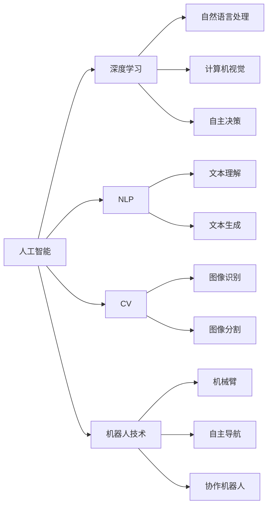

                 

## 1. 背景介绍

在AI领域，创新与突破无时无刻不在发生。新技术、新应用层出不穷，使得AI创业市场迎来了前所未有的机遇。特别是随着AI技术在垂直领域的应用逐步深入，创业者有机会创造巨大的商业价值。本文将探讨垂直领域AI创业的可能性，以及如何利用AI技术解决实际问题，释放商业潜能。

## 2. 核心概念与联系

### 2.1 核心概念概述

为了更好地理解AI创业的机遇，首先需要明确几个核心概念：

- **人工智能（AI）**：使用算法和计算工具，使计算机能够模拟人类智能过程的学科。
- **垂直领域**：特定行业或领域的应用场景，如医疗、金融、教育等。
- **深度学习（Deep Learning）**：一种基于神经网络的机器学习方法，能够处理复杂的非线性关系。
- **自然语言处理（NLP）**：使计算机能够理解、解释和生成人类语言的学科。
- **计算机视觉（CV）**：使计算机能够理解和分析图像和视频数据的学科。
- **机器人技术**：结合AI与机械工程，实现自主决策和操作的机械装置。

这些概念之间的联系在于，它们都基于人工智能技术，旨在解决特定领域的实际问题。通过AI技术的应用，不同领域的挑战得到了不同程度的解决，从而激发了商业机会。

### 2.2 核心概念原理和架构的 Mermaid 流程图



以上流程图展示了AI技术在各个核心概念中的应用，表明了它们之间的联系和协同作用。

## 3. 核心算法原理 & 具体操作步骤

### 3.1 算法原理概述

在AI创业中，算法选择至关重要。以下是几个核心的算法原理：

- **深度学习（Deep Learning）**：通过神经网络模拟人脑的工作方式，能够处理大量数据并提取特征。在图像识别、语音识别和自然语言处理等任务上表现出色。
- **卷积神经网络（CNN）**：一种特殊的深度学习网络，擅长处理图像和视频数据。
- **循环神经网络（RNN）**：能够处理序列数据，如时间序列和文本数据，适合于NLP任务。
- **生成对抗网络（GAN）**：能够生成逼真的图像和视频内容，用于数据增强和生成式任务。
- **强化学习（RL）**：通过与环境的交互，使智能体（agent）学习最优策略，适合于机器人控制和游戏AI。

这些算法构成了AI创业的技术基础，帮助解决垂直领域的具体问题。

### 3.2 算法步骤详解

以下是AI创业的详细步骤：

1. **市场调研**：了解目标市场的具体需求和痛点，确定潜在的商业机会。
2. **产品定位**：明确产品的核心功能和应用场景，确保与市场需求相匹配。
3. **技术选型**：根据产品需求选择最适合的AI算法和技术框架。
4. **数据准备**：收集和准备高质量的数据，确保模型训练效果。
5. **模型训练**：使用选定的算法对数据进行训练，优化模型性能。
6. **模型评估**：评估模型在实际场景中的表现，调整参数和优化策略。
7. **产品部署**：将训练好的模型部署到实际应用中，并进行测试和优化。
8. **市场推广**：通过市场营销和用户反馈，不断改进产品，扩大市场份额。

### 3.3 算法优缺点

AI算法的选择需要综合考虑其优缺点：

#### 优点：

- **高效处理复杂数据**：深度学习等算法能够处理大规模、复杂的数据，提取特征并建立模型。
- **适应性强**：不同算法可以应对不同类型的数据和任务，如图像识别、文本分析和语音识别。
- **可扩展性高**：通过调整模型架构和参数，算法能够应对多种不同的应用场景和需求。

#### 缺点：

- **资源消耗大**：深度学习算法需要大量的计算资源和存储空间，对硬件设备有较高要求。
- **模型复杂度高**：复杂算法需要更多的调试和优化，增加了开发和维护的难度。
- **易过拟合**：模型容易在特定数据上表现良好，但在新数据上泛化效果不佳。

### 3.4 算法应用领域

AI算法在各个垂直领域的应用非常广泛：

- **医疗**：利用AI进行疾病诊断、图像识别、个性化治疗等。
- **金融**：用于信用评分、风险管理、算法交易等。
- **教育**：通过智能辅导、学习分析、自动化评估等提升教育效果。
- **零售**：实现个性化推荐、库存管理、客户服务自动化等。
- **制造**：应用AI进行质量控制、供应链优化、机器人自动化等。

## 4. 数学模型和公式 & 详细讲解 & 举例说明

### 4.1 数学模型构建

数学模型是AI创业的重要工具，用于描述问题和解决问题的算法。以下是一些常见的数学模型：

- **线性回归（Linear Regression）**：用于预测连续变量的数学模型，广泛应用于金融、电商等领域。
- **逻辑回归（Logistic Regression）**：用于分类问题的数学模型，适用于二分类和多分类任务。
- **支持向量机（SVM）**：通过最大化分类间隔，实现高维空间中的分类和回归。
- **神经网络（Neural Network）**：多层感知器（MLP）和卷积神经网络（CNN）等。
- **卷积神经网络（CNN）**：通过卷积层、池化层和全连接层等，实现图像和视频数据的处理。

### 4.2 公式推导过程

以卷积神经网络（CNN）为例，推导其基本的数学公式：

1. **卷积层（Convolutional Layer）**：
$$
y = \sigma(W*x + b)
$$
其中，$W$ 是卷积核，$x$ 是输入数据，$b$ 是偏置项，$\sigma$ 是激活函数。

2. **池化层（Pooling Layer）**：
$$
y = \max_k(x) = \max\limits_{(i,j)}(x_{i,j})
$$
其中，$x$ 是输入数据，$y$ 是池化后的数据。

3. **全连接层（Fully Connected Layer）**：
$$
y = W*x + b
$$
其中，$W$ 是权重矩阵，$x$ 是输入数据，$b$ 是偏置项。

### 4.3 案例分析与讲解

以医疗领域中的影像诊断为例，说明CNN的应用：

1. **数据准备**：收集大量的医疗影像数据，并进行标注和预处理。
2. **模型构建**：设计并训练CNN模型，提取影像中的关键特征。
3. **模型评估**：在独立的测试集上评估模型性能，优化模型参数。
4. **应用部署**：将训练好的模型部署到临床系统中，实现自动诊断。

## 5. 项目实践：代码实例和详细解释说明

### 5.1 开发环境搭建

在进行AI创业项目开发时，需要搭建一个高效的开发环境。以下是一些常用工具和环境：

1. **Python**：主流编程语言，支持丰富的科学计算和机器学习库。
2. **Jupyter Notebook**：交互式编程环境，便于代码编写和数据处理。
3. **TensorFlow**：Google开发的深度学习框架，支持分布式计算和GPU加速。
4. **PyTorch**：Facebook开发的深度学习框架，易于使用和扩展。
5. **AWS/Google Cloud/Azure**：提供强大的云资源和AI服务，支持模型训练和部署。
6. **Docker/Kubernetes**：容器化技术，便于模型的打包和部署。

### 5.2 源代码详细实现

以下是一个基于TensorFlow的图像分类项目实现：

```python
import tensorflow as tf
from tensorflow.keras import layers, models

# 加载数据
(train_images, train_labels), (test_images, test_labels) = tf.keras.datasets.cifar10.load_data()

# 数据预处理
train_images = train_images / 255.0
test_images = test_images / 255.0

# 定义模型
model = models.Sequential([
    layers.Conv2D(32, (3, 3), activation='relu', input_shape=(32, 32, 3)),
    layers.MaxPooling2D((2, 2)),
    layers.Conv2D(64, (3, 3), activation='relu'),
    layers.MaxPooling2D((2, 2)),
    layers.Conv2D(64, (3, 3), activation='relu'),
    layers.Flatten(),
    layers.Dense(64, activation='relu'),
    layers.Dense(10)
])

# 编译模型
model.compile(optimizer='adam',
              loss=tf.keras.losses.SparseCategoricalCrossentropy(from_logits=True),
              metrics=['accuracy'])

# 训练模型
model.fit(train_images, train_labels, epochs=10, 
          validation_data=(test_images, test_labels))
```

### 5.3 代码解读与分析

1. **数据加载和预处理**：使用`tf.keras.datasets`加载CIFAR-10数据集，并进行归一化处理。
2. **模型定义**：设计一个简单的CNN模型，包含卷积层、池化层和全连接层。
3. **模型编译**：使用`compile`方法定义优化器、损失函数和评价指标。
4. **模型训练**：使用`fit`方法训练模型，并验证测试集上的性能。

## 6. 实际应用场景

### 6.1 医疗

在医疗领域，AI技术能够提升诊疗效率和准确性。例如，通过深度学习算法，可以从医学影像中自动识别肿瘤、检测眼病等。这些技术可以辅助医生诊断，缩短诊断时间，提高诊断准确率。

### 6.2 金融

金融领域的应用包括信用评分、风险管理、算法交易等。AI算法能够分析大量的交易数据和用户行为数据，预测市场趋势，优化投资组合，降低风险。

### 6.3 教育

教育领域的应用包括智能辅导、学习分析、自动化评估等。AI技术可以个性化推荐学习资源，分析学生学习行为，提供个性化的学习路径和评估。

### 6.4 零售

在零售领域，AI技术可以用于个性化推荐、库存管理、客户服务自动化等。通过分析用户购买行为和偏好，提供个性化的商品推荐，提升用户满意度和销售额。

### 6.5 制造

制造领域的应用包括质量控制、供应链优化、机器人自动化等。AI算法可以实时监测生产过程，预测设备故障，优化生产计划，提高生产效率和产品质量。

## 7. 工具和资源推荐

### 7.1 学习资源推荐

以下是一些优质的学习资源，帮助开发者系统掌握AI创业所需的技能：

1. **Coursera**：提供大量的AI和机器学习课程，涵盖深度学习、自然语言处理、计算机视觉等方向。
2. **Udacity**：提供实战项目导向的AI课程，包括自动驾驶、机器人、语音识别等。
3. **Kaggle**：数据科学竞赛平台，提供丰富的数据集和实际项目经验。
4. **GitHub**：代码托管平台，提供大量的开源项目和代码示例。
5. **ArXiv**：学术论文数据库，提供最新的AI研究成果和技术进展。

### 7.2 开发工具推荐

以下是一些常用的开发工具和环境：

1. **Python**：主流编程语言，支持丰富的科学计算和机器学习库。
2. **Jupyter Notebook**：交互式编程环境，便于代码编写和数据处理。
3. **TensorFlow**：Google开发的深度学习框架，支持分布式计算和GPU加速。
4. **PyTorch**：Facebook开发的深度学习框架，易于使用和扩展。
5. **AWS/Google Cloud/Azure**：提供强大的云资源和AI服务，支持模型训练和部署。
6. **Docker/Kubernetes**：容器化技术，便于模型的打包和部署。

### 7.3 相关论文推荐

以下是一些关键的AI创业论文，帮助理解技术趋势和前沿进展：

1. **ImageNet Classification with Deep Convolutional Neural Networks**：AlexNet论文，介绍深度学习在图像分类任务中的应用。
2. **Rethinking the Inception Architecture for Computer Vision**：Inception论文，提出Inception网络，提升模型性能。
3. **Natural Language Processing (almost) for Free with Unsupervised Learning**：Transformer论文，介绍基于自监督学习的预训练模型。
4. **GANs Trained by a Two Time-Scale Update Rule Converge to the Fixed Points of Their Limiting Equations**：GAN论文，介绍生成对抗网络的基本原理和应用。
5. **Playing Atari with Deep Reinforcement Learning**：AlphaGo论文，介绍深度强化学习在游戏AI中的应用。

## 8. 总结：未来发展趋势与挑战

### 8.1 研究成果总结

AI创业在过去几年中取得了显著的进展，以下是对关键研究成果的总结：

1. **深度学习算法**：深度学习在图像识别、语音识别和自然语言处理等领域表现出色，成为AI创业的核心技术。
2. **数据驱动的决策**：通过分析大量的数据，AI算法能够做出更加精准的决策，提升业务效率和效果。
3. **自监督学习**：无需标注数据，通过自监督学习技术，能够实现高效的模型训练和知识迁移。
4. **边缘计算**：在边缘设备上部署AI模型，实现低延迟、高可靠性的计算。

### 8.2 未来发展趋势

未来AI创业将呈现以下几个趋势：

1. **跨领域融合**：AI技术将与多个垂直领域进行深度融合，提升业务智能化水平。
2. **自动化决策**：通过AI技术实现自动化的决策和执行，提升企业运营效率。
3. **持续学习**：AI模型能够不断学习和适应新数据，保持高性能和稳定性。
4. **人机协同**：AI与人类协同工作，提升决策的准确性和可解释性。
5. **隐私保护**：在数据驱动的AI系统中，隐私保护成为重要课题，需要加强数据安全和隐私保护措施。

### 8.3 面临的挑战

尽管AI创业充满机遇，但仍面临以下挑战：

1. **数据隐私和安全**：数据隐私和安全问题越来越受到关注，需要加强数据保护措施。
2. **算法透明性**：AI算法的决策过程复杂，缺乏透明性和可解释性，影响其可信度。
3. **模型鲁棒性**：AI模型容易受到输入噪声和攻击，需要提高模型的鲁棒性和安全性。
4. **成本和资源消耗**：AI技术的实现需要大量的计算资源和人力投入，成本较高。
5. **伦理和法规**：AI技术的应用需要遵循伦理和法规要求，避免带来负面的社会影响。

### 8.4 研究展望

未来AI创业需要在以下几个方面进行研究：

1. **隐私保护技术**：开发更加安全、可靠的数据隐私保护技术，保障数据安全。
2. **透明性研究**：提高AI算法的透明性和可解释性，增强其可信度。
3. **鲁棒性提升**：提高AI模型的鲁棒性，使其能够在各种复杂场景中稳定运行。
4. **自动化工具**：开发更加自动化和便捷的AI开发工具，降低技术门槛。
5. **伦理和法规研究**：建立AI技术的伦理和法规框架，确保其应用符合社会价值观和法规要求。

## 9. 附录：常见问题与解答

**Q1: 如何选择最适合的AI算法？**

A: 选择AI算法需要考虑数据类型、应用场景和资源限制。例如，图像识别适合使用卷积神经网络，自然语言处理适合使用循环神经网络，推荐系统适合使用协同过滤算法。

**Q2: 如何提高模型的准确性和泛化能力？**

A: 通过增加数据量、调整模型架构和超参数、引入正则化技术等手段，可以提高模型的准确性和泛化能力。

**Q3: 如何在垂直领域应用AI技术？**

A: 需要深入了解领域需求和问题，选择合适的算法和技术，进行数据预处理和模型训练，评估模型性能并优化模型。

**Q4: 如何保护数据隐私和安全？**

A: 使用数据脱敏技术、加密技术、访问控制等手段，确保数据在处理、存储和传输过程中的安全。

**Q5: 如何提高AI算法的透明性和可解释性？**

A: 开发可解释性模型，如LIME、SHAP等，并结合可视化工具展示模型决策过程，增强算法的透明性。

---

作者：禅与计算机程序设计艺术 / Zen and the Art of Computer Programming

