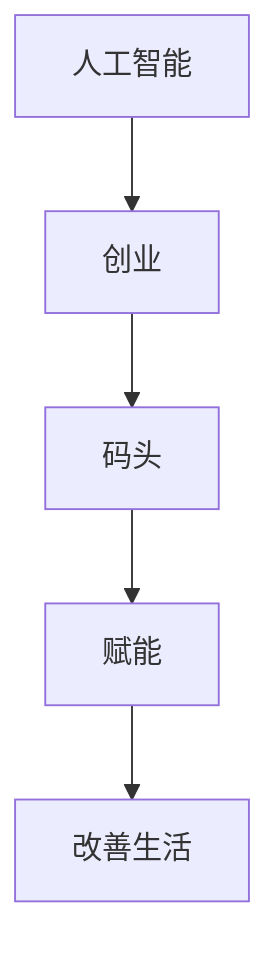

                 

# AI创业者的码头愿景：AI赋能，改善生活

> 关键词：人工智能(AI)，创业，码头(vision)，赋能，改善生活

## 1. 背景介绍

### 1.1 问题由来
在21世纪，人工智能(AI)技术已经深刻改变了各行各业，推动了人类社会的进步。AI创业，作为连接技术创新和市场应用的重要桥梁，在推动科技发展、促进社会进步、创造商业价值方面发挥着重要作用。然而，在AI创业的浪潮中，技术创新与商业落地之间的差距依然存在，如何在技术成熟与市场需求之间找到平衡，是每个AI创业者面临的重大挑战。

### 1.2 问题核心关键点
AI创业的关键在于如何将前沿技术转化为具有实际价值的商业解决方案，解决用户的痛点问题，并实现商业模式的闭环。这其中，技术创新、市场需求分析、产品迭代优化、商业模式设计等环节至关重要。

### 1.3 问题研究意义
探索AI创业的愿景和策略，对于推动AI技术在实际应用中的落地，激发更多创新创业，提升社会生活质量，具有重要意义：

1. **促进科技发展**：AI创业将前沿技术转化为实际产品，推动科技创新的产业化应用。
2. **满足市场需求**：通过解决具体问题，提升用户体验，创造新的市场需求。
3. **提升经济效益**：AI创业带来新的商业模式，推动产业升级，提升经济效益。
4. **促进社会进步**：AI技术在医疗、教育、交通等领域的应用，可以提升社会运行效率，改善人民生活质量。
5. **赋能创业者和企业**：AI技术提供新的创业工具，降低创业门槛，帮助更多创业者实现梦想。

## 2. 核心概念与联系

### 2.1 核心概念概述

为更好地理解AI创业的愿景与策略，本节将介绍几个密切相关的核心概念：

- **人工智能(AI)**：涉及计算智能、感知智能、认知智能等多个层次，旨在模拟人类智能行为，解决复杂问题。
- **创业(vision)**：从零开始，将创新技术和商业模式转化为实际产品和服务的过程。
- **码头**：象征着AI创业的出发点与归宿，即清晰定义的商业愿景与目标市场。
- **赋能**：通过AI技术提升产品和服务的功能与性能，提高用户满意度和市场竞争力。
- **改善生活**：AI创业的最终目标，通过提供有效的解决方案，提升生活质量和社会福祉。

这些核心概念之间的逻辑关系可以通过以下Mermaid流程图来展示：



这个流程图展示出AI创业的主要流程：

1. 利用AI技术进行创新，实现技术突破。
2. 明确商业模式，确定目标市场，设计产品方案。
3. 将AI技术应用到产品中，提升其功能和性能。
4. 通过提升用户体验，改善人民生活质量，实现社会福祉的提升。

## 3. 核心算法原理 & 具体操作步骤

### 3.1 算法原理概述

AI创业的核心算法原理主要围绕两个方面：技术创新和市场需求分析。其中，技术创新包括但不限于机器学习、深度学习、自然语言处理等，市场需求分析则通过用户调研、数据挖掘、市场分析等方法进行。

具体而言，AI创业的算法流程如下：

1. **技术创新**：收集和分析数据，进行模型训练和优化，得到具有实际应用价值的AI模型。
2. **市场需求分析**：通过问卷调查、数据分析、用户访谈等手段，深入理解目标市场的需求和痛点。
3. **产品设计**：根据市场需求和技术能力，设计出能够解决具体问题、满足用户需求的产品方案。
4. **产品迭代优化**：通过用户体验反馈，持续改进产品功能，提升性能。
5. **商业模式设计**：确定盈利模式，制定市场推广策略，实现商业模式的闭环。

### 3.2 算法步骤详解

#### 3.2.1 技术创新

**步骤1: 数据收集与预处理**
- 获取目标领域的相关数据，如文本、图像、音频等。
- 进行数据清洗和标注，确保数据质量和一致性。

**步骤2: 模型选择与训练**
- 选择适合的任务模型，如CNN、RNN、Transformer等。
- 使用大规模数据进行模型训练，优化模型参数。

**步骤3: 模型验证与优化**
- 在验证集上评估模型性能，调整超参数和模型结构。
- 使用测试集进行最终验证，确保模型泛化性能。

**步骤4: 模型部署与迭代**
- 将模型部署到实际应用中，收集用户反馈。
- 根据反馈持续迭代优化模型，提升用户体验。

#### 3.2.2 市场需求分析

**步骤1: 用户调研**
- 通过问卷调查、用户访谈等方式收集用户需求和痛点。
- 分析用户反馈，确定主要问题和需求。

**步骤2: 数据分析**
- 使用数据分析工具，挖掘潜在市场需求和趋势。
- 进行用户行为分析，优化产品设计和功能。

**步骤3: 市场分析**
- 分析竞争对手，了解市场竞争格局。
- 确定目标市场和用户群体，制定市场推广策略。

### 3.3 算法优缺点

**优点**：
1. **技术先进性**：AI技术提供强大的算法支持，可以解决复杂问题，提升产品性能。
2. **用户体验提升**：通过AI技术优化产品功能，提供更高效、智能的服务。
3. **市场竞争力增强**：AI技术提升产品差异化，增强市场竞争力。
4. **快速迭代优化**：AI技术提供高效的数据分析和用户反馈机制，可以快速优化产品。

**缺点**：
1. **技术复杂性高**：AI模型训练和优化需要专业知识，门槛较高。
2. **数据获取难度大**：高质量数据的获取和标注成本高，可能限制AI技术的应用。
3. **技术依赖性强**：AI技术依赖于数据和算法，可能面临数据质量波动和算法失效的风险。
4. **市场推广困难**：创新产品推广需要时间和资源，市场接受度不高时，可能面临市场风险。

### 3.4 算法应用领域

AI创业的应用领域极其广泛，涵盖医疗、教育、金融、交通等多个领域，具体如下：

- **医疗领域**：通过AI技术辅助诊断、个性化治疗、患者监护等，提高医疗服务质量。
- **教育领域**：开发智能辅导系统、个性化学习平台、智能作业批改等，提升教学效果。
- **金融领域**：应用AI技术进行风险评估、金融产品推荐、智能投顾等，提升金融服务效率。
- **交通领域**：开发智能交通管理系统、自动驾驶系统、智能出行助手等，优化交通运行效率。

此外，AI创业还在零售、制造、物流、安防等众多领域大显身手，为各行各业注入新的活力。

## 4. 数学模型和公式 & 详细讲解

### 4.1 数学模型构建

本节将使用数学语言对AI创业的关键技术进行更加严格的刻画。

假设目标领域的AI创业项目为$A$，市场需求为$D$，技术创新能力为$T$，商业模式为$M$。则AI创业的总体模型可以表示为：

$$
A = f(D, T, M)
$$

其中，$f$为映射函数，表示将市场需求、技术能力和商业模式映射为实际创业项目的过程。

### 4.2 公式推导过程

以下是详细推导过程：

**步骤1: 需求分析**
- 设市场需求$D$由用户调研数据$U$和市场数据$M$组成，则$D = g(U, M)$。

**步骤2: 技术创新**
- 设技术创新$T$由算法选择$A$、模型训练$M$和模型优化$O$组成，则$T = h(A, M, O)$。

**步骤3: 商业模式**
- 设商业模式$M$由盈利模式$F$和市场推广策略$P$组成，则$M = k(F, P)$。

将上述公式代入总体模型中，得：

$$
A = f(g(U, M), h(A, M, O), k(F, P))
$$

### 4.3 案例分析与讲解

**案例分析**：开发智能医疗平台

**需求分析**：通过用户调研和市场分析，确定目标用户为患病家庭，主要需求为智能问诊和个性化治疗建议。

**技术创新**：选择基于自然语言处理的问答系统模型，使用大规模医疗数据进行模型训练，优化模型参数。

**商业模式**：采用订阅制模式，免费提供智能问诊服务，同时提供付费的个性化治疗方案。

**产品迭代优化**：根据用户反馈，持续优化问答系统，提升匹配准确率和响应速度。

**市场推广**：通过社交媒体和合作医院推广，吸引更多用户使用。

## 5. 项目实践：代码实例和详细解释说明

### 5.1 开发环境搭建

在进行AI创业项目开发前，首先需要搭建合适的开发环境。以下是Python环境搭建的步骤：

1. 安装Anaconda：从官网下载并安装Anaconda，用于创建独立的Python环境。
2. 创建并激活虚拟环境：
```bash
conda create -n ai-dev python=3.8 
conda activate ai-dev
```
3. 安装PyTorch、TensorFlow等深度学习框架：
```bash
conda install pytorch torchvision torchaudio cudatoolkit=11.1 -c pytorch -c conda-forge
conda install tensorflow -c conda-forge
```
4. 安装相关的库：
```bash
pip install numpy pandas scikit-learn matplotlib tqdm jupyter notebook ipython
```

### 5.2 源代码详细实现

下面以智能医疗平台为例，给出基于PyTorch进行自然语言处理模型开发的代码实现。

**步骤1: 数据预处理**

```python
from torchtext.data import Field, TabularDataset
import pandas as pd

# 定义数据字段
TEXT = Field(tokenize='spacy', lower=True, include_lengths=True)
LABEL = Field(sequential=False, use_vocab=False)

# 加载数据集
train_data, test_data = TabularDataset.splits(
    path='data',
    train='train.csv',
    test='test.csv',
    format='csv',
    fields=[(TEXT, 'text'), (LABEL, None)]
)

# 构建词汇表
TEXT.build_vocab(train_data, max_size=5000)
LABEL.build_vocab(train_data)

# 分割训练集和验证集
train_data, valid_data = train_data.split(valid_pct=0.2, random_state=random.seed(1234))
```

**步骤2: 模型定义**

```python
import torch.nn as nn
import torch.nn.functional as F

class LSTMClassifier(nn.Module):
    def __init__(self, input_size, hidden_size, output_size):
        super(LSTMClassifier, self).__init__()
        self.hidden_size = hidden_size
        self.rnn = nn.LSTM(input_size, hidden_size, batch_first=True)
        self.fc = nn.Linear(hidden_size, output_size)
        self.softmax = nn.Softmax(dim=1)

    def forward(self, input, lengths):
        h0 = self.initHidden(input.size(0))
        out, _ = self.rnn(input, h0)
        out = self.fc(out[:, -1, :])
        out = self.softmax(out)
        return out

    def initHidden(self, bsz):
        weight = next(self.parameters()).data
        return (weight.new_zeros(1, bsz, self.hidden_size), weight.new_zeros(1, bsz, self.hidden_size))
```

**步骤3: 训练和评估**

```python
from torchtext import data
from torchtext.data import Field, TabularDataset

# 定义数据字段
TEXT = Field(tokenize='spacy', lower=True, include_lengths=True)
LABEL = Field(sequential=False, use_vocab=False)

# 加载数据集
train_data, test_data = TabularDataset.splits(
    path='data',
    train='train.csv',
    test='test.csv',
    format='csv',
    fields=[(TEXT, 'text'), (LABEL, None)]
)

# 构建词汇表
TEXT.build_vocab(train_data, max_size=5000)
LABEL.build_vocab(train_data)

# 分割训练集和验证集
train_data, valid_data = train_data.split(valid_pct=0.2, random_state=random.seed(1234))

# 定义模型和优化器
model = LSTMClassifier(input_size=train_data.fields[TEXT].vocab.stoi['[CLS]'], hidden_size=128, output_size=len(train_data.fields[LABEL].vocab))
optimizer = torch.optim.Adam(model.parameters(), lr=0.001)

# 定义训练函数
def train(model, iterator, optimizer, criterion):
    model.train()
    total_loss = 0
    for batch in iterator:
        optimizer.zero_grad()
        predictions, _ = model(batch.text, batch.lengths)
        loss = criterion(predictions, batch.label)
        total_loss += loss.item()
        loss.backward()
        optimizer.step()
    return total_loss / len(iterator)

# 定义评估函数
def evaluate(model, iterator, criterion):
    model.eval()
    total_loss = 0
    total_correct = 0
    with torch.no_grad():
        for batch in iterator:
            predictions, _ = model(batch.text, batch.lengths)
            loss = criterion(predictions, batch.label)
            total_loss += loss.item()
            total_correct += torch.sum((predictions.argmax(1) == batch.label).float()).item()
    return total_loss / len(iterator), total_correct / len(iterator.dataset)

# 训练模型
for epoch in range(10):
    train_loss = train(model, train_iterator, optimizer, criterion)
    valid_loss, acc = evaluate(model, valid_iterator, criterion)
    print(f"Epoch: {epoch+1:02}, Train Loss: {train_loss:.3f}, Val Loss: {valid_loss:.3f}, Accuracy: {acc:.2f}")
```

### 5.3 代码解读与分析

**代码解读**：

1. **数据预处理**：通过`torchtext`库对数据进行分割、词汇表构建和模型定义。
2. **模型定义**：定义基于LSTM的分类模型，前向传播计算损失函数。
3. **训练和评估**：在训练集和验证集上分别进行训练和评估，输出损失和准确率。

**分析**：

- 数据预处理是构建模型的基础。`torchtext`提供了便捷的数据处理接口，可以快速进行数据加载和预处理。
- 模型定义中，LSTM模型能够捕捉文本中的长期依赖关系，适用于自然语言处理任务。
- 训练和评估函数通过迭代器对数据进行批处理，使用优化器和损失函数更新模型参数，并输出训练和验证结果。

## 6. 实际应用场景

### 6.1 医疗健康

智能医疗平台是AI创业的典型应用之一，通过自然语言处理、图像识别等技术，提升医疗服务质量和效率。

**实际案例**：A公司开发智能问诊系统，结合自然语言处理和图像识别技术，能够快速诊断疾病并提供个性化治疗建议。平台集成大数据分析和医疗知识图谱，帮助医生进行精准诊断和合理治疗。

**商业化应用**：平台提供基础免费问答服务，同时提供付费的诊断报告和个性化治疗方案。通过合作医院和社区健康中心推广，累计用户数百万。

### 6.2 教育培训

AI技术在教育培训领域的应用也非常广泛，能够提供智能辅导、个性化学习、作业批改等解决方案。

**实际案例**：B公司开发智能辅导系统，通过自然语言处理技术，实时解答学生问题，提供个性化学习方案。系统集成机器学习算法，能够根据学生的学习进度和反馈，动态调整教学内容和难度。

**商业化应用**：系统提供基础免费试用，通过学校和教育机构推广，逐步实现商业化。累计用户数百万，覆盖多个学科，提供丰富的教学资源。

### 6.3 金融服务

金融行业对AI的需求非常迫切，AI技术可以用于风险评估、智能投顾、智能客服等多个环节。

**实际案例**：C公司开发智能投顾系统，通过自然语言处理和机器学习技术，实时分析市场数据，提供投资建议和风险评估报告。系统集成多模态数据，能够综合分析股票、基金、债券等多种资产。

**商业化应用**：系统提供免费试用，通过银行和券商推广，实现商业化。累计用户数百万，服务多家大型金融机构。

## 7. 工具和资源推荐

### 7.1 学习资源推荐

为了帮助开发者系统掌握AI创业的关键技术和策略，这里推荐一些优质的学习资源：

1. **深度学习框架教程**：包括PyTorch、TensorFlow等，提供从入门到高级的详细教程，帮助开发者掌握深度学习技术。
2. **自然语言处理教程**：包括NLTK、SpaCy等工具库，提供自然语言处理的实践案例和算法原理。
3. **创业课程和书籍**：提供创业流程、商业模式、市场分析等系统性的知识，帮助创业者快速上手。
4. **AI创业社区**：提供AI创业的最新动态、技术交流和商业机会，帮助开发者交流经验、分享成果。

通过对这些资源的学习实践，相信你一定能够快速掌握AI创业的精髓，并用于解决实际的NLP问题。

### 7.2 开发工具推荐

高效的开发离不开优秀的工具支持。以下是几款用于AI创业开发的常用工具：

1. **深度学习框架**：包括PyTorch、TensorFlow等，提供了丰富的深度学习算法和模型库。
2. **自然语言处理工具**：包括NLTK、SpaCy等，提供了便捷的自然语言处理功能。
3. **项目管理工具**：包括Jira、Trello等，提供了任务管理和协作功能，帮助团队高效合作。
4. **云计算平台**：包括AWS、Azure、Google Cloud等，提供了丰富的AI计算资源和云服务。
5. **版本控制工具**：包括Git、SVN等，提供了代码版本管理和协作功能。

合理利用这些工具，可以显著提升AI创业的开发效率，加快创新迭代的步伐。

### 7.3 相关论文推荐

AI创业的研究源于学界的持续研究。以下是几篇奠基性的相关论文，推荐阅读：

1. **深度学习在医疗领域的应用**：介绍深度学习在医疗影像、诊断、治疗等方面的应用。
2. **智能辅导系统设计**：介绍基于自然语言处理的智能辅导系统设计和实现。
3. **智能投顾系统的设计与实现**：介绍基于机器学习的智能投顾系统设计，提供投资建议和风险评估。

这些论文代表了大规模AI创业技术的发展脉络。通过学习这些前沿成果，可以帮助研究者把握学科前进方向，激发更多的创新灵感。

## 8. 总结：未来发展趋势与挑战

### 8.1 总结

本文对AI创业的愿景和策略进行了全面系统的介绍。首先阐述了AI创业的背景和意义，明确了AI技术创新和市场需求分析在创业过程中的重要性。其次，从原理到实践，详细讲解了AI创业的关键技术，包括自然语言处理、机器学习等，给出了实际项目开发的完整代码实例。同时，本文还广泛探讨了AI创业在医疗健康、教育培训、金融服务等多个领域的应用前景，展示了AI创业的巨大潜力。此外，本文精选了AI创业的学习资源、开发工具和相关论文，力求为读者提供全方位的技术指引。

通过本文的系统梳理，可以看到，AI创业在推动科技发展、提升社会生活质量、赋能企业和创业者方面具有重要意义。AI技术通过在实际应用中的落地，能够解决复杂问题，提供高效、智能的服务，显著提升用户体验。未来，伴随AI技术的不断进步，AI创业必将在更多领域大放异彩，为社会带来更广泛的价值。

### 8.2 未来发展趋势

展望未来，AI创业技术将呈现以下几个发展趋势：

1. **技术融合加速**：AI创业将更多地与其他前沿技术融合，如物联网、区块链、边缘计算等，提供更全面、智能的解决方案。
2. **数据驱动创新**：通过大数据分析和机器学习，不断挖掘市场和用户需求，提供更加精准的产品和服务。
3. **跨界融合发展**：AI创业将更多地跨界融合，整合多个行业的知识和资源，提供一体化的服务。
4. **开放生态构建**：AI创业将推动开源社区和生态系统建设，促进技术共享和合作创新。
5. **伦理和安全重视**：在AI创业过程中，将更加重视数据隐私和算法公平性，保护用户权益。

以上趋势凸显了AI创业技术的广阔前景。这些方向的探索发展，必将进一步推动AI技术在实际应用中的落地，为各行各业带来新的突破。

### 8.3 面临的挑战

尽管AI创业技术已经取得了瞩目成就，但在迈向更加智能化、普适化应用的过程中，仍面临诸多挑战：

1. **数据质量问题**：高质量数据的获取和标注成本高，数据质量波动可能影响模型性能。
2. **算法复杂性**：深度学习等AI算法的复杂性高，模型训练和优化需要专业知识。
3. **市场接受度**：新产品的推广需要时间和资源，市场接受度不高时，可能面临市场风险。
4. **技术安全风险**：AI技术可能面临数据泄露、算法误导等问题，需要加强技术安全和隐私保护。
5. **商业模式创新**：传统商业模式的转型和创新，需要不断探索和试验。

### 8.4 研究展望

面对AI创业所面临的种种挑战，未来的研究需要在以下几个方面寻求新的突破：

1. **数据自动化采集和标注**：通过自动化技术和数据增强技术，提高数据采集和标注效率。
2. **模型压缩和加速**：通过模型压缩和优化算法，降低计算资源消耗，提升模型性能和效率。
3. **算法安全和隐私保护**：引入安全性和隐私保护技术，保障数据和模型的安全。
4. **跨领域知识融合**：将多个领域的知识和资源整合，提供一体化的解决方案。
5. **市场和用户研究**：深入研究市场需求和用户行为，提供更加精准的产品和服务。

## 9. 附录：常见问题与解答

**Q1: AI创业是否需要高昂的初始资金投入？**

A: 对于创业项目而言，高昂的初始资金投入是常见的问题。AI创业需要构建数据集、训练模型、开发产品、市场推广等，前期投入较大。然而，通过众筹、政府资助、风险投资等方式，可以缓解资金压力。

**Q2: AI创业的核心竞争力是什么？**

A: AI创业的核心竞争力在于技术创新和市场洞察。技术创新能够提供先进的产品和服务，市场洞察能够把握市场需求和用户痛点，两者结合才能实现商业成功。

**Q3: AI创业的商业模式有哪些？**

A: AI创业的商业模式多种多样，包括订阅制、按需付费、SaaS、API服务等。选择适合自身产品的商业模式，是实现商业化的关键。

**Q4: AI创业需要哪些关键技术？**

A: AI创业需要多种关键技术，包括深度学习、自然语言处理、计算机视觉、机器学习等。这些技术共同构成了AI创业的技术基础。

**Q5: AI创业的实际应用场景有哪些？**

A: AI创业的实际应用场景非常广泛，包括医疗健康、教育培训、金融服务、零售、制造、物流、安防等。每个行业都有不同的需求和痛点，AI技术可以提供多种解决方案。

---

作者：禅与计算机程序设计艺术 / Zen and the Art of Computer Programming

