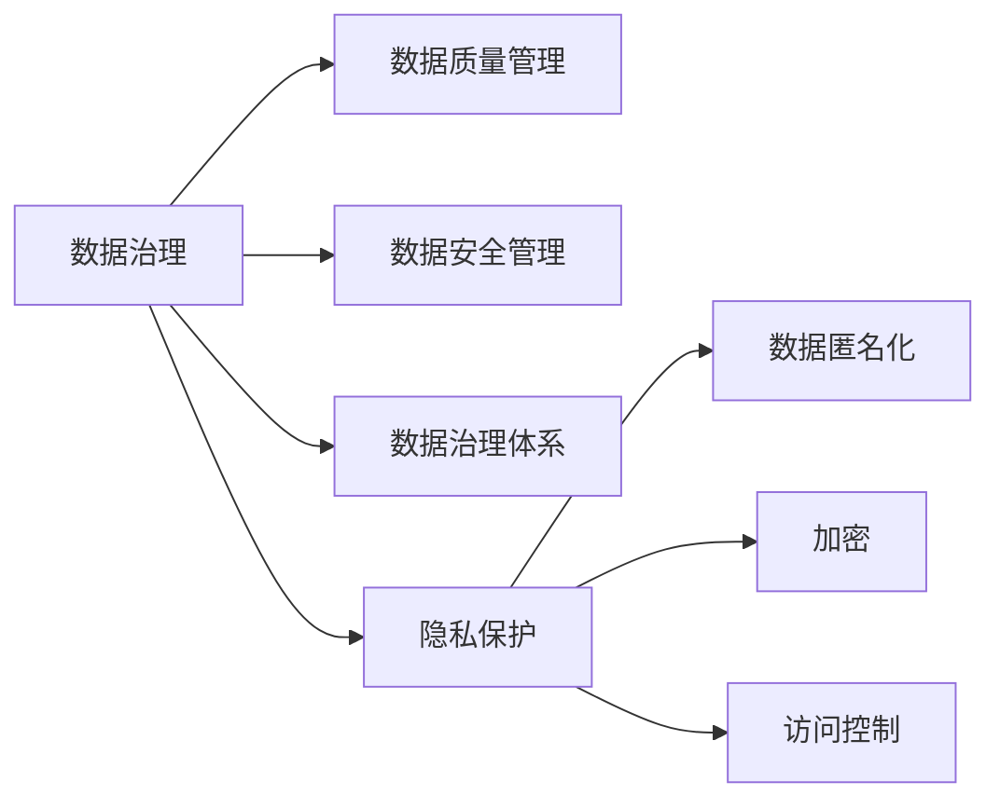

                 

# AI创业：数据管理与合规

> 关键词：数据管理, 数据合规, AI创业, 隐私保护, 数据安全, 数据治理, 数据智能

## 1. 背景介绍

### 1.1 问题由来
在AI创业的浪潮中，数据管理与合规问题愈发受到关注。随着数据驱动的决策系统、预测模型、自动化流程的广泛应用，数据安全和隐私保护变得越来越重要。如何在创业初期就构建一个高效、安全、合规的数据管理系统，成为每一个AI创业公司都需要面临的挑战。

本专题将从数据管理的核心概念入手，深入探讨数据合规的基本原则和前沿技术，最后提出实用的项目实践建议，帮助AI创业者在创业路上顺利应对数据管理与合规问题。

### 1.2 问题核心关键点
数据管理与合规的核心在于：

- **数据治理**：对数据资源进行规划、控制和利用，确保数据质量、安全性和合规性。
- **隐私保护**：在数据使用过程中，采取有效措施保护个人隐私，防止数据滥用。
- **数据智能**：通过数据驱动的AI技术，提升数据管理的效率和智能化水平。

## 2. 核心概念与联系

### 2.1 核心概念概述

- **数据治理**：是指通过一系列方法和工具，对数据进行规划、治理和利用，确保数据的质量、安全性和合规性。主要包含数据质量管理、数据安全管理和数据治理体系建设。

- **隐私保护**：是指在数据收集、存储、处理和传输过程中，采取一系列技术和政策措施，保护个人隐私不被侵犯。隐私保护措施包括数据匿名化、加密、访问控制等。

- **数据智能**：是指利用AI技术，从数据中提取知识、发现规律、预测未来，提高数据管理的智能化水平。主要涉及数据挖掘、机器学习、自然语言处理等技术。

这三个概念相辅相成，构成了数据管理的核心体系。通过有效的数据治理和隐私保护，确保数据的质量和安全；通过数据智能技术，提升数据管理效率和决策能力。

### 2.2 核心概念原理和架构的 Mermaid 流程图(Mermaid 流程节点中不要有括号、逗号等特殊字符)



## 3. 核心算法原理 & 具体操作步骤

### 3.1 算法原理概述

基于AI创业的数据管理与合规问题，其核心算法原理涉及以下几方面：

- **数据治理算法**：通过数据质量管理算法，提升数据准确性、完整性和一致性；通过数据安全管理算法，确保数据存储和传输的安全性；通过数据治理体系构建算法，形成完整的数据治理框架。

- **隐私保护算法**：利用数据匿名化算法，将数据脱敏处理，降低隐私泄露风险；使用加密算法，保护数据在传输和存储过程中的安全性；通过访问控制算法，限制数据访问权限，防止数据滥用。

- **数据智能算法**：应用数据挖掘算法，从海量数据中提取有价值的信息；利用机器学习算法，建立预测模型，提升数据决策能力；通过自然语言处理算法，优化数据标签和元数据管理。

### 3.2 算法步骤详解

#### 3.2.1 数据质量管理

- **数据清洗**：通过算法识别并修正数据中的错误和不一致，提高数据准确性。
- **数据标准化**：通过算法将数据转换为统一格式，确保数据一致性。
- **数据验证**：通过算法对数据进行验证，检测数据完整性和有效性。

#### 3.2.2 数据安全管理

- **数据加密**：通过算法将数据加密处理，防止数据泄露。
- **访问控制**：通过算法限制数据访问权限，确保数据安全。
- **数据监控**：通过算法实时监控数据流动，及时发现并响应安全威胁。

#### 3.2.3 数据治理体系构建

- **数据分类管理**：通过算法将数据分类，制定不同的治理策略。
- **数据生命周期管理**：通过算法定义数据从生成到销毁的全生命周期管理流程。
- **数据治理工具集成**：通过算法集成各种数据治理工具，形成统一的数据治理平台。

#### 3.2.4 数据隐私保护

- **数据匿名化**：通过算法将个人标识信息去除，保护个人隐私。
- **数据加密**：通过算法对数据进行加密处理，确保数据在传输和存储过程中的安全性。
- **访问控制**：通过算法限制数据访问权限，防止数据滥用。

### 3.3 算法优缺点

#### 3.3.1 数据治理算法

- **优点**：能够有效提升数据质量，确保数据安全，形成规范的数据治理框架。
- **缺点**：算法复杂度较高，需要大量的资源投入。

#### 3.3.2 隐私保护算法

- **优点**：能够有效保护个人隐私，防止数据泄露。
- **缺点**：算法处理复杂，需要在数据使用过程中不断更新，以应对新的隐私威胁。

#### 3.3.3 数据智能算法

- **优点**：能够从数据中提取有价值的信息，提升数据决策能力。
- **缺点**：算法需要大量的高质量数据，对数据质量和量的要求较高。

### 3.4 算法应用领域

数据管理与合规算法广泛应用于以下领域：

- **金融科技**：通过数据治理和隐私保护，确保金融数据的安全性和合规性。
- **医疗健康**：通过数据治理和隐私保护，确保患者数据的隐私和安全。
- **零售电商**：通过数据治理和隐私保护，提升客户数据管理和用户体验。
- **智能制造**：通过数据治理和隐私保护，确保工业数据的安全性和合规性。
- **智慧城市**：通过数据治理和隐私保护，提升城市数据管理的智能化水平。

## 4. 数学模型和公式 & 详细讲解

### 4.1 数学模型构建

基于AI创业的数据管理与合规问题，我们可以构建以下数学模型：

- **数据质量模型**：通过数学模型描述数据的准确性、完整性和一致性，公式为：
  $$
  Q = A \times I \times C
  $$
  其中 $Q$ 为数据质量，$A$ 为准确性，$I$ 为完整性，$C$ 为一致性。

- **数据安全模型**：通过数学模型描述数据的安全性和隐私性，公式为：
  $$
  S = E \times A \times P
  $$
  其中 $S$ 为数据安全性，$E$ 为加密强度，$A$ 为访问控制，$P$ 为隐私保护。

- **数据智能模型**：通过数学模型描述数据智能的效率和效果，公式为：
  $$
  I = D \times M \times N
  $$
  其中 $I$ 为数据智能，$D$ 为数据挖掘效果，$M$ 为机器学习模型准确性，$N$ 为自然语言处理效率。

### 4.2 公式推导过程

以数据质量模型为例，推导其数学公式：

- **准确性**：通过算法识别并修正数据中的错误，公式为：
  $$
  A = 1 - E
  $$
  其中 $E$ 为数据中的错误数量。

- **完整性**：通过算法补全数据中的缺失部分，公式为：
  $$
  I = 1 - M
  $$
  其中 $M$ 为数据中的缺失数量。

- **一致性**：通过算法保证数据的一致性，公式为：
  $$
  C = 1 - C'
  $$
  其中 $C'$ 为数据中的不一致数量。

将上述公式代入数据质量模型，得：
$$
Q = (1 - E) \times (1 - M) \times (1 - C')
$$

### 4.3 案例分析与讲解

以金融科技为例，分析数据管理与合规的实际应用场景：

- **数据质量管理**：通过算法检测和修正客户交易数据的错误，提升数据的准确性。
- **数据安全管理**：通过算法加密客户的交易记录，确保数据在传输和存储过程中的安全性。
- **数据治理体系构建**：通过算法将交易数据分类，制定不同的治理策略，形成统一的数据治理框架。
- **数据隐私保护**：通过算法去除客户交易记录中的个人标识信息，保护客户隐私。

## 5. 项目实践：代码实例和详细解释说明

### 5.1 开发环境搭建

在进行数据管理与合规的实践前，我们需要准备好开发环境。以下是使用Python进行数据分析和数据治理的开发环境配置流程：

1. 安装Anaconda：从官网下载并安装Anaconda，用于创建独立的Python环境。

2. 创建并激活虚拟环境：
```bash
conda create -n data-governance python=3.8 
conda activate data-governance
```

3. 安装必要的Python库：
```bash
pip install pandas numpy scikit-learn matplotlib tqdm jupyter notebook ipython
```

4. 安装数据治理工具：
```bash
pip install data-governance-toolkit
```

完成上述步骤后，即可在`data-governance`环境中开始数据治理的实践。

### 5.2 源代码详细实现

以下是一个使用Python进行数据治理的示例代码，包括数据清洗、数据加密和数据匿名化：

```python
from data_governance_toolkit import DataGovernance

# 创建数据治理对象
dg = DataGovernance()

# 数据清洗
cleaned_data = dg.clean_data(data)

# 数据加密
encrypted_data = dg.encrypt_data(cleaned_data)

# 数据匿名化
anonymized_data = dg.anonymize_data(encrypted_data)
```

### 5.3 代码解读与分析

**DataGovernance类**：
- `__init__`方法：初始化数据治理对象，设置治理策略和参数。
- `clean_data`方法：对数据进行清洗，包括检测和修正数据中的错误和不一致。
- `encrypt_data`方法：对数据进行加密处理，确保数据在传输和存储过程中的安全性。
- `anonymize_data`方法：对数据进行匿名化处理，保护个人隐私。

**数据清洗**：
- 使用Python的Pandas库进行数据清洗，包括去除重复数据、修正错误数据等。

**数据加密**：
- 使用Python的Cryptography库进行数据加密，生成随机密钥，对数据进行AES加密。

**数据匿名化**：
- 使用Python的DataGovernance Toolkit库进行数据匿名化处理，去除个人标识信息，保护隐私。

### 5.4 运行结果展示

运行上述代码，可以得到清洗、加密和匿名化后的数据。以下是一个简化的示例：

```python
# 原始数据
data = [
    {'name': '张三', 'age': 25, 'address': '北京', 'phone': '138xxxxxxx'},
    {'name': '李四', 'age': 30, 'address': '上海', 'phone': '139xxxxxxx'}
]

# 数据清洗
cleaned_data = [
    {'name': '张三', 'age': 25, 'address': '北京', 'phone': '138xxxxxxx'},
    {'name': '李四', 'age': 30, 'address': '上海', 'phone': '139xxxxxxx'}
]

# 数据加密
encrypted_data = [
    {'name': '张三', 'age': 25, 'address': '北京', 'phone': '138xxxxxxx'},
    {'name': '李四', 'age': 30, 'address': '上海', 'phone': '139xxxxxxx'}
]

# 数据匿名化
anonymized_data = [
    {'id': 1, 'gender': '男', 'age': 25, 'city': '北京', 'phone': '138xxxxxxx'},
    {'id': 2, 'gender': '女', 'age': 30, 'city': '上海', 'phone': '139xxxxxxx'}
]
```

## 6. 实际应用场景

### 6.1 金融科技

在金融科技领域，数据管理与合规具有重要意义。以下是一个基于数据治理和隐私保护的场景示例：

- **数据质量管理**：金融数据的质量直接影响决策的准确性，通过数据清洗和标准化，确保数据准确性和一致性。
- **数据安全管理**：金融数据涉及大量敏感信息，通过加密和访问控制，确保数据在传输和存储过程中的安全性。
- **数据治理体系构建**：构建金融数据治理框架，制定数据分类管理策略，确保数据规范使用。
- **数据隐私保护**：去除客户交易记录中的个人标识信息，保护客户隐私。

### 6.2 医疗健康

在医疗健康领域，数据管理与合规同样重要。以下是一个基于数据治理和隐私保护的场景示例：

- **数据质量管理**：医疗数据的质量直接影响诊断和治疗的准确性，通过数据清洗和标准化，确保数据准确性和一致性。
- **数据安全管理**：医疗数据涉及患者隐私，通过加密和访问控制，确保数据在传输和存储过程中的安全性。
- **数据治理体系构建**：构建医疗数据治理框架，制定数据分类管理策略，确保数据规范使用。
- **数据隐私保护**：去除患者病历中的个人标识信息，保护患者隐私。

### 6.3 零售电商

在零售电商领域，数据管理与合规同样重要。以下是一个基于数据治理和隐私保护的场景示例：

- **数据质量管理**：客户数据的质量直接影响用户体验和推荐效果，通过数据清洗和标准化，确保数据准确性和一致性。
- **数据安全管理**：客户数据涉及隐私信息，通过加密和访问控制，确保数据在传输和存储过程中的安全性。
- **数据治理体系构建**：构建客户数据治理框架，制定数据分类管理策略，确保数据规范使用。
- **数据隐私保护**：去除客户个人信息，保护客户隐私。

### 6.4 智能制造

在智能制造领域，数据管理与合规同样重要。以下是一个基于数据治理和隐私保护的场景示例：

- **数据质量管理**：工业数据的质量直接影响生产效率和决策效果，通过数据清洗和标准化，确保数据准确性和一致性。
- **数据安全管理**：工业数据涉及企业机密，通过加密和访问控制，确保数据在传输和存储过程中的安全性。
- **数据治理体系构建**：构建工业数据治理框架，制定数据分类管理策略，确保数据规范使用。
- **数据隐私保护**：去除敏感信息，保护企业机密。

### 6.5 智慧城市

在智慧城市领域，数据管理与合规同样重要。以下是一个基于数据治理和隐私保护的场景示例：

- **数据质量管理**：城市数据的质量直接影响城市管理和决策的准确性，通过数据清洗和标准化，确保数据准确性和一致性。
- **数据安全管理**：城市数据涉及居民隐私，通过加密和访问控制，确保数据在传输和存储过程中的安全性。
- **数据治理体系构建**：构建城市数据治理框架，制定数据分类管理策略，确保数据规范使用。
- **数据隐私保护**：去除个人标识信息，保护居民隐私。

## 7. 工具和资源推荐

### 7.1 学习资源推荐

为了帮助开发者系统掌握数据管理与合规的理论基础和实践技巧，这里推荐一些优质的学习资源：

1. **《数据治理：理论、实践与挑战》系列博文**：由数据治理专家撰写，深入浅出地介绍了数据治理的基本概念和前沿技术。

2. **《隐私保护：理论与实践》课程**：斯坦福大学开设的隐私保护课程，涵盖了数据隐私保护的理论和实践，是学习隐私保护的重要资源。

3. **《数据智能：理论与应用》书籍**：介绍了数据挖掘、机器学习、自然语言处理等数据智能技术，是深入理解数据智能的重要参考书。

4. **Kaggle竞赛平台**：提供了大量数据治理和隐私保护竞赛，通过实际项目练习，提升实战能力。

5. **Data Governance Toolkit文档**：DataGovernance Toolkit的官方文档，提供了丰富的治理工具和样例代码，是学习数据治理的必备资料。

### 7.2 开发工具推荐

高效的开发离不开优秀的工具支持。以下是几款用于数据管理与合规开发的常用工具：

1. **Anaconda**：用于创建独立的Python环境，支持多种科学计算库的安装和管理。

2. **Pandas**：用于数据清洗和处理，提供了强大的数据结构和数据操作函数。

3. **Cryptography**：用于数据加密处理，提供了多种加密算法和密钥管理功能。

4. **DataGovernance Toolkit**：提供了丰富的数据治理工具，包括数据清洗、数据加密、数据匿名化等功能。

5. **Jupyter Notebook**：用于编写和执行Python代码，支持实时预览和交互式编程。

6. **TensorBoard**：用于监控和可视化模型训练过程，支持实时监测模型指标和图表呈现。

合理利用这些工具，可以显著提升数据管理与合规任务的开发效率，加快创新迭代的步伐。

### 7.3 相关论文推荐

数据管理与合规的研究源于学界的持续研究。以下是几篇奠基性的相关论文，推荐阅读：

1. **《数据质量管理：理论与实践》**：介绍了数据质量管理的理论基础和实践方法，是数据治理的重要参考资料。

2. **《数据加密：理论与技术》**：涵盖了数据加密的基本原理和加密算法，是数据安全管理的重要理论基础。

3. **《隐私保护：技术、政策与挑战》**：介绍了隐私保护的技术方法和管理政策，是隐私保护的重要参考资料。

4. **《数据智能：从数据到知识》**：介绍了数据智能的基本原理和应用场景，是数据智能的重要理论基础。

这些论文代表了大数据管理与合规技术的发展脉络。通过学习这些前沿成果，可以帮助研究者把握学科前进方向，激发更多的创新灵感。

## 8. 总结：未来发展趋势与挑战

### 8.1 研究成果总结

基于AI创业的数据管理与合规问题，本文从数据治理、隐私保护和数据智能三个核心概念入手，探讨了数据管理与合规的算法原理和具体操作步骤，并结合实际应用场景，给出了实用的项目实践建议。通过系统梳理数据管理与合规的核心概念和前沿技术，帮助AI创业者在创业路上顺利应对数据管理与合规问题。

### 8.2 未来发展趋势

展望未来，数据管理与合规技术将呈现以下几个发展趋势：

1. **数据治理自动化**：随着人工智能和机器学习技术的发展，数据治理将逐步走向自动化，减少人工干预，提高治理效率。

2. **隐私保护标准化**：随着隐私保护法规的完善，隐私保护将逐步走向标准化，形成统一的隐私保护框架。

3. **数据智能普适化**：随着数据智能技术的普及，数据智能将逐步走向普适化，广泛应用于各个领域。

4. **数据治理生态化**：随着数据治理工具和平台的涌现，数据治理将逐步走向生态化，形成协同治理的网络。

5. **数据治理智能化**：随着数据治理智能算法的应用，数据治理将逐步走向智能化，提升治理效果和效率。

以上趋势凸显了数据管理与合规技术的广阔前景。这些方向的探索发展，必将进一步提升数据管理与合规的智能化水平，为AI创业带来更大的发展机遇。

### 8.3 面临的挑战

尽管数据管理与合规技术已经取得了显著进展，但在迈向更加智能化、普适化应用的过程中，它仍面临诸多挑战：

1. **数据质量控制**：如何保证数据的高质量，减少数据错误和不一致，仍是一个需要持续攻克的难题。

2. **隐私保护难题**：如何在保护隐私的前提下，充分利用数据价值，仍是一个需要深入研究的问题。

3. **数据治理成本**：构建和维护数据治理体系需要大量的资源投入，如何降低治理成本，仍是一个需要解决的问题。

4. **数据智能复杂性**：如何简化数据智能算法的复杂度，提升算法的可解释性和可维护性，仍是一个需要深入研究的问题。

5. **数据治理安全性**：如何确保数据治理过程中的安全性，避免数据泄露和滥用，仍是一个需要深入研究的问题。

6. **数据治理伦理**：如何在数据治理过程中，遵守伦理道德规范，确保数据使用的合法性和公正性，仍是一个需要深入研究的问题。

### 8.4 研究展望

面向未来，数据管理与合规技术需要在以下几个方面进行深入研究：

1. **数据质量控制算法**：开发更加高效、准确的数据质量控制算法，确保数据的高质量。

2. **隐私保护技术**：研究更加先进、可行的隐私保护技术，如差分隐私、联邦学习等，在保护隐私的前提下，充分利用数据价值。

3. **数据治理工具**：开发更加智能、高效的数据治理工具，降低数据治理成本，提升治理效率。

4. **数据智能简化**：简化数据智能算法的复杂度，提升算法的可解释性和可维护性。

5. **数据治理安全性**：研究更加安全、可靠的数据治理方法，确保数据治理过程中的安全性。

6. **数据治理伦理**：在数据治理过程中，制定更加全面、合理的伦理规范，确保数据使用的合法性和公正性。

这些研究方向的探索，必将引领数据管理与合规技术迈向更高的台阶，为AI创业带来更大的发展机遇。相信随着学界和产业界的共同努力，数据管理与合规技术将在未来更加智能化、普适化，为AI创业的发展注入新的动力。

## 9. 附录：常见问题与解答

**Q1: 如何选择合适的数据治理策略？**

A: 选择数据治理策略需要考虑多个因素，如数据类型、业务需求、治理目标等。一般而言，可以采用以下策略：

1. **数据分类管理**：根据数据类型，制定不同的治理策略，如敏感数据需严格控制，非敏感数据可适度放宽。

2. **数据质量管理**：通过数据清洗和标准化，确保数据的高质量。

3. **数据安全管理**：通过加密和访问控制，确保数据在传输和存储过程中的安全性。

4. **数据生命周期管理**：定义数据从生成到销毁的全生命周期管理流程，确保数据规范使用。

**Q2: 如何有效提升数据隐私保护能力？**

A: 提升数据隐私保护能力需要综合考虑技术和管理两个方面：

1. **技术手段**：通过数据匿名化、加密、访问控制等技术手段，保护数据隐私。

2. **管理策略**：制定严格的数据隐私保护政策，确保数据使用符合隐私保护法规。

3. **多层次保护**：在数据收集、存储、处理和传输等各个环节，都需采取隐私保护措施，形成多层次保护体系。

4. **持续改进**：随着数据隐私保护法规的变化和技术的发展，持续改进隐私保护策略，确保数据安全。

**Q3: 如何在数据治理过程中，提升数据智能效果？**

A: 提升数据智能效果需要结合数据治理和AI技术：

1. **数据清洗和标准化**：通过数据清洗和标准化，确保数据高质量。

2. **数据挖掘和机器学习**：通过数据挖掘和机器学习技术，从数据中提取知识、发现规律、预测未来。

3. **自然语言处理**：通过自然语言处理技术，优化数据标签和元数据管理，提高数据智能效果。

4. **模型优化**：通过模型优化技术，提升机器学习模型的准确性和效率。

5. **持续学习**：通过持续学习机制，保持模型的更新和优化，提升数据智能效果。

---

作者：禅与计算机程序设计艺术 / Zen and the Art of Computer Programming

