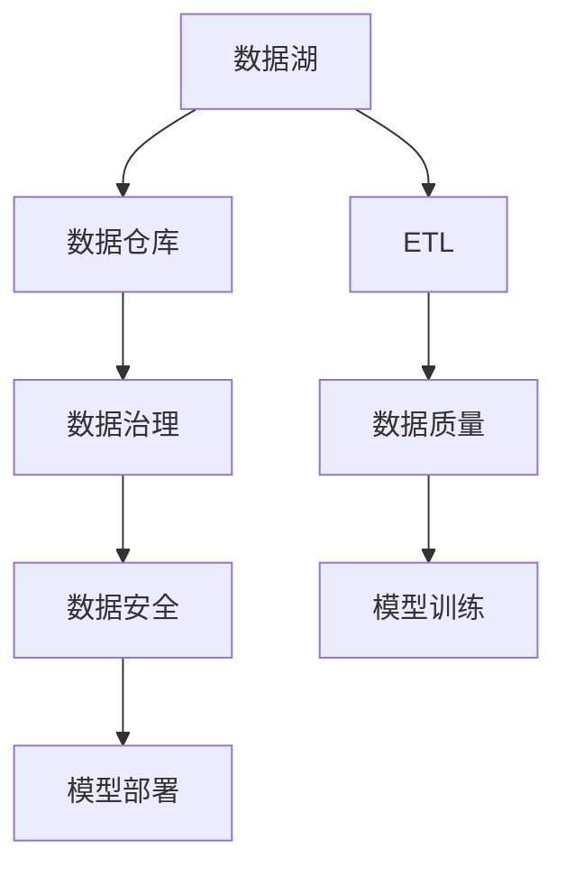

                 

# AI创业：数据管理最佳实践指南

在当今快速发展的AI领域，创业公司正面临前所未有的机遇与挑战。数据作为AI系统的核心要素，其管理质量直接影响AI系统的性能和应用效果。本文旨在提供一份详尽的AI创业数据管理最佳实践指南，帮助创业者构建高效、可靠、可扩展的数据管理体系，助力企业成功实现AI创新。

## 1. 背景介绍

### 1.1 问题由来
随着AI技术日益普及，创业公司利用AI解决业务问题变得愈发普遍。然而，由于数据源的多样性、数据量的庞大以及数据质量的不确定性，数据管理成为AI创业公司面临的首要挑战。如何有效地获取、存储、处理和利用数据，直接决定了AI项目的成败。

### 1.2 问题核心关键点
数据管理的核心关键点在于确保数据的完整性、准确性和安全性，并优化数据的处理效率。具体包括以下几个方面：

- **数据获取**：如何高效地从不同来源获取高质量的数据。
- **数据存储**：如何安全地存储大量数据，并实现快速访问。
- **数据处理**：如何对数据进行清洗、预处理和特征工程，以适应模型需求。
- **数据保护**：如何确保数据的隐私和安全，防止数据泄露和滥用。
- **数据治理**：如何制定和执行数据管理政策，保证数据管理的规范性和一致性。

### 1.3 问题研究意义
高质量的数据管理是AI创业成功的关键。通过对数据的高效管理，企业可以：

- 提高AI模型的准确性和鲁棒性。
- 降低数据获取和处理的成本。
- 确保数据安全和隐私，提升用户信任。
- 实现数据的跨部门、跨项目共享，提升资源利用率。

## 2. 核心概念与联系

### 2.1 核心概念概述

为更好地理解数据管理在AI创业中的重要性，本节将介绍几个关键概念：

- **数据湖(Data Lake)**：一个大型的、集中的数据存储系统，用于存储大规模、多源异构的数据。
- **数据仓库(Data Warehouse)**：一个结构化、集中化的数据存储系统，用于支持复杂的查询和分析。
- **ETL(Extract, Transform, Load)**：数据抽取、转换和加载的过程，用于将不同来源的数据整合到统一的存储系统中。
- **数据治理(Data Governance)**：制定和实施数据管理政策，确保数据的完整性、准确性和安全性。
- **数据质量(Data Quality)**：衡量数据准确性、完整性和一致性的标准。
- **数据安全(Data Security)**：保护数据免受未经授权的访问和篡改的措施。

这些概念之间的关系可以通过以下Mermaid流程图来展示：



这个流程图展示了数据管理的核心流程和关键组件：

1. 数据通过数据湖存储和ETL处理，进入数据仓库。
2. 数据仓库中的数据经过治理，确保其质量和安全性。
3. 数据治理后的高质量数据可用于模型训练，提升模型性能。
4. 数据安全机制保护数据不被滥用和泄露。
5. 最终，模型训练和部署后的应用输出可再次反馈到数据治理系统中，形成闭环。

## 3. 核心算法原理 & 具体操作步骤
### 3.1 算法原理概述

数据管理的核心算法原理主要围绕数据抽取、转换、加载以及数据治理展开。以下是各部分的基本原理：

- **数据抽取**：使用ETL工具从不同数据源中提取数据，并进行初步清洗。
- **数据转换**：根据模型需求，对提取的数据进行格式转换、标准化、归一化等预处理。
- **数据加载**：将处理后的数据加载到数据仓库或数据湖中，以供后续分析和建模使用。
- **数据治理**：制定数据管理政策和流程，确保数据质量和安全。

### 3.2 算法步骤详解

数据管理的详细步骤通常包括以下几个方面：

**Step 1: 数据获取与清洗**
- 选择合适的数据源，如关系数据库、NoSQL数据库、API接口等。
- 使用ETL工具如Apache Nifi、AWS Glue、Google Dataflow等进行数据抽取。
- 对提取的数据进行初步清洗，去除重复、错误和不完整的数据。

**Step 2: 数据转换与标准化**
- 根据模型需求，对数据进行格式转换、标准化、归一化等预处理。
- 使用Python、R等脚本语言进行特征工程，提取有意义的特征。
- 进行缺失值处理、异常值检测和去除等数据预处理步骤。

**Step 3: 数据加载与存储**
- 将预处理后的数据加载到数据仓库或数据湖中，如使用Amazon Redshift、Google BigQuery等。
- 使用分布式存储技术，如Hadoop、Spark等，提高数据处理和存储的效率。
- 实施数据备份和灾难恢复策略，确保数据安全。

**Step 4: 数据治理与审计**
- 制定数据管理政策，如数据质量标准、访问权限控制等。
- 使用数据治理工具如Informatica、SAP Master Data Management等，监控数据质量和安全。
- 定期审计数据使用情况，确保数据管理的合规性和有效性。

### 3.3 算法优缺点

数据管理算法具有以下优点：
1. 支持大规模数据处理：能够高效处理海量数据，适应AI模型的高数据需求。
2. 保证数据质量和安全性：通过数据治理和审计，确保数据的完整性和隐私性。
3. 灵活的ETL过程：能够适应各种数据源和数据格式，支持多样化数据整合。

同时，该算法也存在一定的局限性：
1. 复杂度高：数据管理涉及大量数据源和处理环节，可能导致复杂性增加。
2. 依赖技术栈：需要选择合适的ETL工具和数据仓库，可能存在技术实现难度。
3. 成本高：大规模数据处理和存储需要高成本，可能不适合小规模项目。

尽管存在这些局限性，但数据管理算法在大规模AI项目中的应用，能够显著提升数据处理的效率和质量，为AI创业的成功奠定坚实基础。

### 3.4 算法应用领域

数据管理算法在AI创业中的应用领域广泛，包括但不限于：

- **智能推荐系统**：通过分析用户行为数据，推荐个性化内容。
- **金融风控系统**：实时监控交易数据，评估信用风险。
- **医疗诊断系统**：分析患者历史数据，辅助诊断和治疗决策。
- **智能客服系统**：分析客户对话记录，提升客户服务体验。
- **无人驾驶系统**：融合传感器数据，实现精准定位和路径规划。

## 4. 数学模型和公式 & 详细讲解  
### 4.1 数学模型构建

在数据管理的各个环节中，数学模型和公式扮演着重要的角色。以下是几个核心环节的数学模型构建：

### 4.2 公式推导过程

#### 数据抽取与清洗
假设原始数据集为 $D$，其中每个数据点 $d_i = (x_i, y_i)$，$x_i \in \mathbb{R}^n$ 为特征向量，$y_i \in \{0, 1\}$ 为标签。数据抽取和清洗过程如下：

1. **数据抽取**：从不同数据源提取 $D$，得到数据集 $D'$。
2. **数据清洗**：去除重复、错误和不完整的数据，得到数据集 $D''$。

#### 数据转换与标准化
假设 $D''$ 为清洗后的数据集，将其进行特征工程处理，得到新的数据集 $D'''$。

1. **特征选择**：选择对模型有用的特征 $x_i \in D'''$。
2. **特征处理**：进行归一化、标准化等预处理，得到处理后的特征 $\tilde{x}_i \in D'''$。

#### 数据加载与存储
假设 $D'''$ 为处理后的数据集，将其加载到数据仓库或数据湖中，得到数据集 $D_{\text{store}}$。

1. **数据加载**：使用ETL工具将 $D'''$ 加载到 $D_{\text{store}}$。
2. **数据存储**：使用分布式存储技术，将 $D_{\text{store}}$ 存储在Hadoop、Spark等分布式系统中。

#### 数据治理与审计
假设 $D_{\text{store}}$ 为已加载的数据集，进行数据治理和审计，得到治理后的数据集 $D_{\text{govern}}$。

1. **数据质量监控**：使用数据治理工具，监控 $D_{\text{store}}$ 的质量，得到 $D_{\text{govern}}$。
2. **访问权限控制**：制定访问权限政策，控制对 $D_{\text{govern}}$ 的访问，确保数据安全。

### 4.3 案例分析与讲解

以智能推荐系统为例，分析数据管理的关键环节：

- **数据获取**：从电商网站、社交平台等不同数据源中获取用户行为数据。
- **数据清洗**：去除重复和错误数据，筛选出有意义的特征。
- **数据转换**：对用户行为数据进行归一化、标准化处理，提取有意义的特征。
- **数据加载**：将处理后的数据加载到数据仓库或数据湖中，支持复杂的查询和分析。
- **数据治理**：制定数据质量标准，监控数据使用情况，确保数据安全和隐私。

## 5. 项目实践：代码实例和详细解释说明
### 5.1 开发环境搭建

在进行数据管理项目开发前，我们需要准备好开发环境。以下是使用Python进行数据管理的开发环境配置流程：

1. 安装Python：从官网下载并安装Python，建议安装最新版本。
2. 安装必要的Python库：如Pandas、NumPy、Scikit-learn等。
3. 安装ETL工具：如Apache Nifi、AWS Glue、Google Dataflow等。
4. 安装数据仓库：如Amazon Redshift、Google BigQuery等。
5. 安装数据治理工具：如Informatica、SAP Master Data Management等。

完成上述步骤后，即可在开发环境中进行数据管理的代码实现。

### 5.2 源代码详细实现

以下是一个简化的数据管理项目，使用Pandas库进行数据抽取、清洗和转换，并使用Amazon Redshift进行数据加载和存储。

```python
import pandas as pd
import boto3

# 数据抽取
def extract_data():
    # 从数据库或API接口中抽取数据
    data = pd.read_sql_query('SELECT * FROM data_source', con=conn)
    return data

# 数据清洗
def clean_data(data):
    # 去除重复、错误和不完整的数据
    cleaned_data = data.drop_duplicates().dropna()
    return cleaned_data

# 数据转换
def transform_data(data):
    # 进行特征选择和预处理
    transformed_data = data[['feature1', 'feature2', 'label']]
    transformed_data = transformed_data.apply(lambda x: x / 10) # 归一化
    return transformed_data

# 数据加载
def load_data(data):
    # 使用ETL工具将数据加载到数据仓库
    s3 = boto3.client('s3')
    s3.upload_file(data.to_csv(), 'bucket_name', 'data.csv')
    
    redshift = boto3.client('redshift')
    redshift.create_cluster(
        ClusterIdentifier='data_cluster',
        ClusterType='multi-node',
        MasterUsername='username',
        MasterUserPassword='password',
        NodeType='dc2.large',
        NumberOfNodes=2,
        DatabaseName='data_db'
    )

    redshift.load_data(
        SQL='COPY data_table FROM S3 bucket_name, access_key, secret_key, filename data.csv',
        Database='data_db',
        ClusterIdentifier='data_cluster',
        Role='public'
    )

# 数据治理
def govern_data():
    # 使用数据治理工具监控数据质量和安全
    # 这里我们假设使用Informatica进行数据治理
    informatica = Informatica()
    informatica.load_data_governance rules='data_governance_rules.xml'
```

### 5.3 代码解读与分析

让我们再详细解读一下关键代码的实现细节：

**extract_data函数**：
- 使用Pandas库从数据库或API接口中抽取数据，返回一个Pandas DataFrame。

**clean_data函数**：
- 对抽取的数据进行去重、去空值等清洗操作，返回清洗后的DataFrame。

**transform_data函数**：
- 对清洗后的数据进行特征选择和预处理，如归一化、标准化等操作，返回处理后的DataFrame。

**load_data函数**：
- 使用Amazon S3将处理后的数据上传到数据仓库，并使用Amazon Redshift创建和加载数据表。

**govern_data函数**：
- 使用数据治理工具Informatica，制定和执行数据质量监控和安全策略，确保数据合规性和安全性。

## 6. 实际应用场景
### 6.1 智能推荐系统

智能推荐系统是数据管理的典型应用场景。通过高效的数据管理，可以从用户行为数据中提取有价值的特征，进行推荐模型的训练和优化。

在技术实现上，可以收集用户浏览、点击、评分等行为数据，进行清洗、特征工程和模型训练。将模型部署到生产环境后，实时接收新数据，进行实时推荐。此外，使用数据治理工具监控推荐模型的质量和安全，确保推荐结果的可靠性和合规性。

### 6.2 金融风控系统

金融风控系统需要实时监控交易数据，评估用户信用风险。通过高效的数据管理，可以从交易记录中提取有意义的特征，进行风险评估模型的训练和优化。

在技术实现上，可以收集交易记录、用户基本信息等数据，进行清洗、特征工程和模型训练。将模型部署到生产环境后，实时接收新数据，进行风险评估。此外，使用数据治理工具监控模型质量和安全，确保模型的可靠性和合规性。

### 6.3 医疗诊断系统

医疗诊断系统需要分析患者历史数据，辅助诊断和治疗决策。通过高效的数据管理，可以从患者病历、检查报告等数据中提取有意义的特征，进行诊断模型和预测模型的训练和优化。

在技术实现上，可以收集患者病历、检查报告等数据，进行清洗、特征工程和模型训练。将模型部署到生产环境后，实时接收新数据，进行诊断和预测。此外，使用数据治理工具监控数据使用情况，确保数据安全和隐私。

### 6.4 未来应用展望

随着数据管理技术的不断发展，其在AI创业中的应用前景广阔。未来，数据管理将涵盖更多领域和应用场景，为AI创业的成功提供坚实的基础。以下是几个可能的未来应用方向：

- **智慧城市治理**：通过高效的数据管理，收集和分析城市事件、舆情等数据，实现智慧城市治理。
- **智能交通系统**：通过高效的数据管理，收集和分析交通流量、路况等数据，实现智能交通管理。
- **工业互联网**：通过高效的数据管理，收集和分析设备运行数据，实现工业互联网的智能制造和维护。

## 7. 工具和资源推荐
### 7.1 学习资源推荐

为了帮助开发者系统掌握数据管理的技术基础和实践技巧，这里推荐一些优质的学习资源：

1. 《Python数据科学手册》：详细介绍Python在数据处理、分析中的应用，适合初学者和进阶开发者。
2. 《大数据技术与应用》课程：由清华大学开设的课程，涵盖大数据技术的基础和应用，适合系统学习。
3. 《数据治理实践》书籍：详细讲解数据治理的理论和实践，适合数据管理领域的从业者。
4. Kaggle：一个开源的数据科学竞赛平台，提供大量数据集和项目，适合实战练习。
5. DataCamp：一个在线学习平台，提供数据管理和分析的课程，适合系统学习。

通过对这些资源的学习实践，相信你一定能够快速掌握数据管理的精髓，并用于解决实际的AI问题。
###  7.2 开发工具推荐

高效的开发离不开优秀的工具支持。以下是几款用于数据管理开发的常用工具：

1. Pandas：Python的数据处理库，适合数据清洗和预处理。
2. Apache Nifi：ETL工具，适合大规模数据抽取和转换。
3. Amazon S3：云存储服务，适合高效的数据存储和访问。
4. Apache Spark：分布式计算框架，适合大规模数据处理和分析。
5. Informatica：数据治理工具，适合监控和管理数据质量和安全。

合理利用这些工具，可以显著提升数据管理的开发效率，加快创新迭代的步伐。

### 7.3 相关论文推荐

数据管理技术的发展源于学界的持续研究。以下是几篇奠基性的相关论文，推荐阅读：

1. "Big Data: Concepts and Technology"：由Todd Paterson等著，全面介绍大数据技术和应用，适合数据管理领域的从业者。
2. "Principles of Data Governance"：由Kent Lindgreen等著，详细讲解数据治理的理论和实践，适合数据管理领域的从业者。
3. "Big Data Privacy and Security"：由Dmitry E. Lyu等著，详细介绍大数据隐私和安全的技术和应用，适合数据管理领域的从业者。
4. "Data Management in the Cloud"：由Mernish等著，详细介绍云环境下的数据管理技术，适合云计算和数据管理领域的从业者。

这些论文代表了大数据管理技术的发展脉络。通过学习这些前沿成果，可以帮助研究者把握学科前进方向，激发更多的创新灵感。

## 8. 总结：未来发展趋势与挑战
### 8.1 总结

本文对AI创业中数据管理的关键概念、算法原理和操作步骤进行了系统介绍。通过本文的系统梳理，可以看到数据管理在AI创业中的重要性，以及如何通过高效的数据管理，提升AI系统的性能和可靠性。

通过本文的系统梳理，可以看到数据管理在AI创业中的重要性，以及如何通过高效的数据管理，提升AI系统的性能和可靠性。

### 8.2 未来发展趋势

展望未来，数据管理技术将呈现以下几个发展趋势：

1. 数据质量管理将更加严格：随着数据量的大幅增加，数据质量管理将更加重要，提升数据质量将成为数据管理的核心目标。
2. 数据治理工具将更加智能：数据治理工具将引入更多自动化和智能化功能，提升数据管理的效率和准确性。
3. 数据安全和隐私保护将更加重要：随着数据泄露和滥用的风险增加，数据安全和隐私保护将成为数据管理的关键挑战。
4. 数据集成和共享将更加广泛：数据集成和共享将成为数据管理的常态，促进数据的共享和利用。
5. 数据管理将更加灵活和敏捷：数据管理工具将更加灵活，适应各种数据源和应用场景。

以上趋势凸显了数据管理技术的广阔前景。这些方向的探索发展，必将进一步提升数据管理的效率和质量，为AI创业的成功奠定坚实基础。

### 8.3 面临的挑战

尽管数据管理技术已经取得了显著进展，但在迈向更加智能化、普适化应用的过程中，它仍面临诸多挑战：

1. 数据质量瓶颈：如何高效地从不同数据源中获取高质量数据，仍然是一个难题。需要引入更多自动化和智能化技术，提升数据质量管理。
2. 数据安全和隐私保护：如何在保护数据隐私的前提下，满足数据的可用性和可访问性，仍然是一个挑战。需要引入更多加密和访问控制技术，提升数据安全管理。
3. 数据管理和AI模型集成：如何将数据管理与AI模型高效集成，提升模型的性能和可靠性，仍然是一个挑战。需要引入更多自动化和智能化技术，提升数据管理和模型训练的效率。
4. 数据管理和云计算集成：如何将数据管理与云计算平台高效集成，提升数据存储和处理的效率，仍然是一个挑战。需要引入更多自动化和智能化技术，提升数据管理和云计算平台的集成度。

尽管存在这些挑战，但数据管理技术的发展前景仍然广阔，相信随着学界和产业界的共同努力，这些挑战终将一一被克服，数据管理技术必将在AI创业中发挥越来越重要的作用。

### 8.4 研究展望

面对数据管理面临的种种挑战，未来的研究需要在以下几个方面寻求新的突破：

1. 探索更加高效的数据抽取和清洗方法：引入更多自动化和智能化技术，提升数据质量管理。
2. 开发更加智能的数据治理工具：引入更多自动化和智能化功能，提升数据治理的效率和准确性。
3. 研究数据安全和隐私保护的新技术：引入更多加密和访问控制技术，提升数据安全和隐私保护的水平。
4. 研究数据管理和AI模型集成的新方法：引入更多自动化和智能化技术，提升数据管理和模型训练的效率。
5. 研究数据管理和云计算集成的新技术：引入更多自动化和智能化技术，提升数据管理和云计算平台的集成度。

这些研究方向的探索，必将引领数据管理技术迈向更高的台阶，为AI创业的成功提供坚实的基础。只有勇于创新、敢于突破，才能不断拓展数据管理的边界，让数据管理技术更好地服务于AI创业的发展。

## 9. 附录：常见问题与解答
### Q1：数据管理和AI模型之间如何相互配合？

A: 数据管理和AI模型之间存在紧密的相互配合关系。数据管理通过高效的清洗、预处理和存储，为AI模型提供高质量的数据输入，提升模型的训练效果。同时，AI模型通过高效的特征工程和模型优化，提升数据管理的效果，实现数据的最大化利用。

### Q2：数据管理和云计算之间如何相互配合？

A: 数据管理和云计算之间的相互配合主要体现在数据存储和处理方面。数据管理工具可以将数据存储在云平台，如Amazon S3、Google Cloud Storage等，并利用云平台的高效处理能力，进行数据清洗、预处理和分析。同时，云平台也提供数据治理和安全管理工具，帮助企业实现数据的高质量管理和高效利用。

### Q3：数据管理在AI创业中如何发挥作用？

A: 数据管理在AI创业中发挥了以下重要作用：

1. 提升数据质量：数据管理通过高效的清洗、预处理和存储，提升数据质量，为AI模型提供高质量的数据输入。
2. 提升模型性能：数据管理通过高效的数据抽取和转换，提升模型的训练效果，实现高性能的AI模型。
3. 保障数据安全：数据管理通过严格的数据访问控制和加密技术，保障数据安全，提升用户信任。
4. 提升资源利用率：数据管理通过高效的数据治理和监控，实现数据的跨部门、跨项目共享，提升资源利用率。

### Q4：数据管理和数据治理之间的区别是什么？

A: 数据管理和数据治理之间的区别主要在于其功能和目标不同。数据管理主要关注数据的存储、处理和利用，目标是高效利用数据资源，提升数据价值。而数据治理则主要关注数据的规范性和合规性，目标是确保数据质量和安全，制定和执行数据管理政策。

通过本文的系统梳理，可以看到数据管理在AI创业中的重要性，以及如何通过高效的数据管理，提升AI系统的性能和可靠性。数据管理技术的发展前景广阔，未来将继续在AI创业中发挥重要作用。

