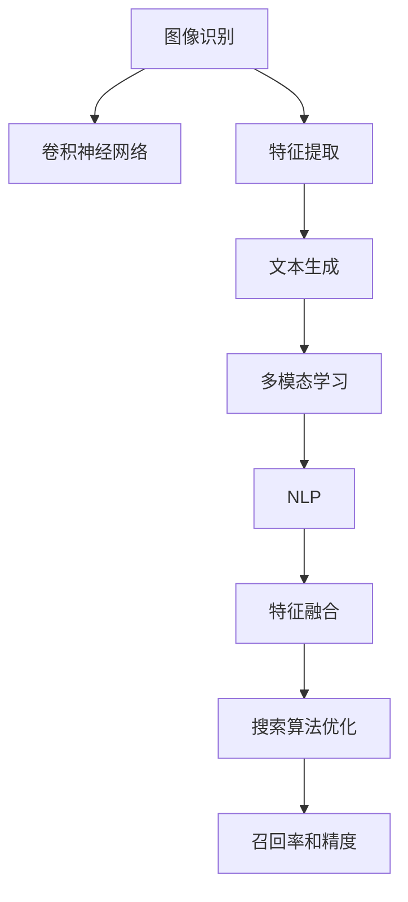

                 

# AI图像识别技术提升电商搜索

> 关键词：图像识别、AI搜索、电商、深度学习、卷积神经网络、特征提取、特征融合、多模态学习、自然语言处理、召回率、精度

## 1. 背景介绍

### 1.1 问题由来

在电子商务领域，用户搜索体验的优化始终是商家和工程师关注的重点。传统的文本搜索方法往往只能依据商品标题、描述等文本信息进行搜索，但对于图片商品或模糊描述的商品，搜索效果并不理想。

图像识别技术的发展，特别是深度学习在图像处理领域的应用，为电商搜索带来了新的解决方案。通过图像识别技术，可以将图片转化为文本描述，结合文本搜索技术，进一步提升搜索效果。

### 1.2 问题核心关键点

图像识别在电商搜索中的应用，主要聚焦于以下几个关键点：

- **图像预处理**：将原始图片转化为可用于训练模型的格式。
- **特征提取**：从图像中提取出能够表达商品信息的特征向量。
- **文本生成**：将图像特征转化为易于文本搜索的文本描述。
- **多模态学习**：将图像特征和文本特征相结合，提升搜索效果。
- **搜索算法优化**：结合图像识别和文本搜索的结果，优化搜索算法，提升召回率和精度。

## 2. 核心概念与联系

### 2.1 核心概念概述

为更好地理解基于图像识别技术的电商搜索，本节将介绍几个密切相关的核心概念：

- **图像识别**：通过深度学习模型，将图像转化为高维特征向量，用于后续分类、检索、匹配等任务。
- **卷积神经网络**（Convolutional Neural Network, CNN）：一种专门用于处理图像的神经网络结构，能够有效提取图像特征。
- **特征提取**：从图像或文本中提取出关键特征，用于表示和检索。
- **特征融合**：将不同来源的特征进行组合，提高整体表示能力。
- **多模态学习**：结合不同模态的信息，如图像、文本、语音等，提升系统性能。
- **自然语言处理**（Natural Language Processing, NLP）：处理和理解人类语言的技术，用于生成和解析文本。
- **召回率**（Recall）和**精度**（Precision）：衡量搜索效果的关键指标，分别表示结果的相关性和准确性。

这些核心概念之间的逻辑关系可以通过以下Mermaid流程图来展示：



这个流程图展示了大语言模型的核心概念及其之间的关系：

1. 图像识别通过CNN网络提取图像特征。
2. 特征提取将图像特征转化为高维向量。
3. 文本生成将图像特征转化为可搜索的文本描述。
4. 多模态学习结合图像和文本特征。
5. NLP用于处理文本，生成搜索条件。
6. 特征融合提高整体表示能力。
7. 搜索算法优化提升召回率和精度。

## 3. 核心算法原理 & 具体操作步骤

### 3.1 算法原理概述

基于图像识别技术的电商搜索方法，主要基于以下几个步骤：

1. **图像预处理**：对原始图像进行裁剪、缩放、归一化等预处理，转化为适合CNN输入的格式。
2. **特征提取**：通过CNN网络提取图像的特征向量。
3. **文本生成**：利用文本生成模型（如GPT、BERT等），将图像特征向量转化为文本描述。
4. **多模态学习**：将图像特征和文本描述相结合，提升整体表示能力。
5. **文本搜索**：使用NLP技术对用户输入的搜索条件进行解析，生成查询向量。
6. **特征融合**：将图像特征和文本查询向量进行融合，生成综合搜索向量。
7. **搜索算法优化**：结合图像特征和文本特征，优化搜索算法，提升召回率和精度。

### 3.2 算法步骤详解

**Step 1: 图像预处理**

- 对原始图片进行裁剪、缩放，使其符合CNN的输入格式。
- 对图像进行归一化处理，即将所有像素值缩放到0-1之间。
- 使用图像增强技术，如随机裁剪、翻转、旋转等，扩充训练数据。

**Step 2: 特征提取**

- 选择适合的CNN网络架构，如ResNet、Inception等。
- 通过训练好的CNN网络，提取图像的特征向量。

**Step 3: 文本生成**

- 使用文本生成模型（如GPT、BERT等），将图像特征向量转化为文本描述。
- 可以采用不同的文本生成方式，如seq2seq模型、Transformer等。
- 生成文本描述的目的是使图像特征向量能够被文本搜索模型理解和匹配。

**Step 4: 多模态学习**

- 将图像特征向量和文本描述向量进行拼接或融合，生成综合向量。
- 多模态学习可以通过Attention机制、特征加权等方式实现。

**Step 5: 文本搜索**

- 使用NLP技术对用户输入的搜索条件进行解析，生成查询向量。
- 可以采用不同的NLP模型，如BERT、Elasticsearch等。
- 生成查询向量的目的是匹配文本描述，从而找到相关的商品信息。

**Step 6: 特征融合**

- 将图像特征向量和文本查询向量进行拼接或融合，生成综合搜索向量。
- 特征融合可以采用不同的方式，如max池化、平均池化、权重加权等。

**Step 7: 搜索算法优化**

- 使用优化算法（如召回率-精度曲线、AUC-ROC曲线等）优化搜索算法。
- 可以采用不同的优化方法，如余弦相似度、BM25、LSH等。
- 优化搜索算法旨在提升召回率和精度，提高搜索效果。

### 3.3 算法优缺点

基于图像识别技术的电商搜索方法具有以下优点：

- **多模态融合**：结合图像和文本信息，提升搜索效果。
- **通用性强**：适用于不同领域和类型的商品搜索。
- **性能稳定**：深度学习模型的泛化能力较强，模型训练后性能稳定。
- **用户友好**：用户可以输入图片或描述进行搜索，操作简便。

但该方法也存在一些局限性：

- **数据需求高**：需要大量的标注数据和高质量的图像数据。
- **计算成本高**：深度学习模型需要较长的训练时间和较大的计算资源。
- **可解释性差**：深度学习模型往往是“黑盒”，难以解释其内部决策过程。
- **算法复杂度高**：多模态学习、特征融合等环节需要设计复杂的算法模型。

## 4. 数学模型和公式 & 详细讲解 & 举例说明

### 4.1 数学模型构建

在基于图像识别技术的电商搜索中，主要的数学模型包括卷积神经网络（CNN）和文本生成模型。以下将分别介绍这两种模型的基本数学模型构建方法。

**CNN模型**：假设输入图像为 $x \in \mathbb{R}^{h \times w \times c}$，其中 $h$ 和 $w$ 为图像的高和宽，$c$ 为通道数。CNN通过卷积、池化等操作，提取特征向量 $y \in \mathbb{R}^d$，其中 $d$ 为特征向量的维度。

$$
y = f(x; \theta)
$$

其中 $f$ 表示CNN的网络结构，$\theta$ 为CNN的模型参数。

**文本生成模型**：假设文本描述为 $z \in \mathbb{R}^m$，其中 $m$ 为文本描述的维度。文本生成模型通过解码器将图像特征向量转化为文本描述 $z$，解码器可以采用Transformer、seq2seq等结构。

$$
z = g(y; \theta')
$$

其中 $g$ 表示文本生成模型，$\theta'$ 为模型的参数。

### 4.2 公式推导过程

**CNN模型推导**：以ResNet为例，介绍CNN模型中卷积、池化、激活函数等操作的数学推导过程。

1. **卷积操作**：假设输入图像 $x$ 经过卷积核 $k \in \mathbb{R}^{f \times f \times c}$ 的卷积操作，输出特征图 $y \in \mathbb{R}^{h' \times w' \times c'}$，其中 $f$ 为卷积核的大小，$h'$ 和 $w'$ 为特征图的高和宽，$c'$ 为输出通道数。

$$
y_{i,j,k} = \sum_{i'=0}^{h-k} \sum_{j'=0}^{w-k} k_{i',j',k} x_{i'+i,j'+j,k}
$$

其中 $k_{i',j',k}$ 为卷积核中第 $i'$、$j'$、$k$ 位置的权重。

2. **池化操作**：假设输入特征图 $y$ 经过池化操作，输出特征图 $z \in \mathbb{R}^{h'' \times w'' \times c'}$，其中 $h''$ 和 $w''$ 为池化后的特征图的高和宽。

$$
z_{i,j,k} = \max\limits_{i'=0}^{h''-k} \sum\limits_{j'=0}^{w''-k} y_{i'+i,j'+j,k}
$$

其中 $k$ 为池化核的大小。

3. **激活函数**：假设输出特征图 $y$ 经过ReLU激活函数，输出特征图 $z$。

$$
z_i = \max(0, y_i)
$$

**文本生成模型推导**：以GPT为例，介绍文本生成模型中Transformer结构的操作。

1. **注意力机制**：假设输入为 $y \in \mathbb{R}^{d}$，输出为 $z \in \mathbb{R}^{d'}$，其中 $d'$ 为输出维数。注意力机制通过查询、键、值计算注意力权重，并加权求和生成输出。

$$
Q = W_Q y, K = W_K y, V = W_V y
$$

$$
\alpha = \frac{e^{Q K^T}}{\sum_i e^{Q K_i^T}}
$$

$$
z = \sum_i \alpha_i V_i
$$

2. **解码器**：假设输入为 $y \in \mathbb{R}^{d}$，输出为 $z \in \mathbb{R}^{m'}$，其中 $m'$ 为输出文本的维度。解码器通过多层Transformer层实现文本生成。

$$
z = T(z; \theta')
$$

其中 $T$ 表示解码器的结构，$\theta'$ 为模型的参数。

### 4.3 案例分析与讲解

以电商搜索中的图片商品匹配为例，介绍基于图像识别技术的多模态学习和特征融合方法。

**图片商品匹配**：假设电商平台上销售某品牌手提包，用户上传图片进行搜索。首先通过CNN模型提取手提包的图像特征向量 $y \in \mathbb{R}^d$，然后利用GPT模型生成手提包的文本描述 $z \in \mathbb{R}^m$。

- **图像特征提取**：使用ResNet模型对图像进行卷积、池化等操作，提取特征向量 $y \in \mathbb{R}^d$。
- **文本描述生成**：利用GPT模型将图像特征向量 $y$ 转化为文本描述 $z$。
- **多模态学习**：将图像特征向量 $y$ 和文本描述 $z$ 拼接，生成综合向量 $w \in \mathbb{R}^{d+m}$。
- **特征融合**：使用Attention机制将综合向量 $w$ 中的图像特征和文本特征进行融合，生成融合向量 $u \in \mathbb{R}^{d'}$。
- **文本搜索**：使用BERT模型对用户输入的搜索条件进行解析，生成查询向量 $v \in \mathbb{R}^{m'}$。
- **搜索算法优化**：使用余弦相似度计算查询向量 $v$ 和融合向量 $u$ 的相似度，排序后返回结果。

## 5. 项目实践：代码实例和详细解释说明

### 5.1 开发环境搭建

在进行电商搜索系统的开发前，需要准备好开发环境。以下是使用Python进行TensorFlow开发的环境配置流程：

1. 安装Anaconda：从官网下载并安装Anaconda，用于创建独立的Python环境。

2. 创建并激活虚拟环境：
```bash
conda create -n tf-env python=3.8 
conda activate tf-env
```

3. 安装TensorFlow：根据CUDA版本，从官网获取对应的安装命令。例如：
```bash
conda install tensorflow -c tensorflow -c conda-forge
```

4. 安装TensorFlow Addons：包含一些TensorFlow库的扩展包，如CNN模块、TextEmbedding模块等。

5. 安装各类工具包：
```bash
pip install numpy pandas scikit-learn matplotlib tqdm jupyter notebook ipython
```

完成上述步骤后，即可在`tf-env`环境中开始电商搜索系统的开发。

### 5.2 源代码详细实现

下面我以电商搜索系统为例，给出使用TensorFlow进行图片商品匹配的代码实现。

首先，定义图片商品的输入数据和预处理函数：

```python
import tensorflow as tf
from tensorflow.keras.preprocessing.image import ImageDataGenerator

# 定义图片商品的输入数据和预处理函数
class ProductImage(tf.keras.layers.Layer):
    def __init__(self, input_shape=(224, 224, 3), **kwargs):
        super(ProductImage, self).__init__(**kwargs)
        self.input_shape = input_shape

    def call(self, inputs):
        img = tf.image.resize(inputs, (self.input_shape[0], self.input_shape[1]))
        img = tf.image.convert_image_dtype(img, tf.float32)
        img = tf.image.per_image_standardization(img)
        return img

# 定义图片商品的输入预处理函数
def preprocess_image(image_path):
    img = tf.io.read_file(image_path)
    img = tf.image.decode_jpeg(img, channels=3)
    img = tf.image.resize(img, (224, 224))
    img = tf.image.convert_image_dtype(img, tf.float32)
    img = tf.image.per_image_standardization(img)
    return img
```

然后，定义CNN模型和文本生成模型：

```python
from tensorflow.keras.applications.resnet import ResNet50
from tensorflow.keras.layers import Dense, Dropout, Input, Embedding, GRU
from tensorflow.keras.models import Model

# 定义CNN模型
input_img = Input(shape=(224, 224, 3), name='input_img')
x = ProductImage()(input_img)
x = ResNet50(include_top=False, weights='imagenet', input_tensor=x)(inputs)
x = tf.keras.layers.GlobalAveragePooling2D()(x)
x = Dense(256, activation='relu')(x)
x = Dropout(0.5)(x)
x = Dense(128, activation='relu')(x)
x = Dropout(0.5)(x)
x = Dense(64, activation='relu')(x)
x = Dropout(0.5)(x)

# 定义文本生成模型
input_text = Input(shape=(None,), name='input_text')
x = Embedding(input_dim=10000, output_dim=128)(input_text)
x = GRU(128, return_sequences=True)(x)
x = Dense(256, activation='relu')(x)
x = Dropout(0.5)(x)
x = Dense(128, activation='relu')(x)
x = Dropout(0.5)(x)
x = Dense(64, activation='relu')(x)
x = Dropout(0.5)(x)

# 定义综合模型
combined = tf.keras.layers.concatenate([x, y])
combined = tf.keras.layers.Dense(128, activation='relu')(combined)
combined = tf.keras.layers.Dropout(0.5)(combined)
combined = tf.keras.layers.Dense(64, activation='relu')(combined)
combined = tf.keras.layers.Dropout(0.5)(combined)
combined = tf.keras.layers.Dense(32, activation='relu')(combined)
combined = tf.keras.layers.Dropout(0.5)(combined)
combined = tf.keras.layers.Dense(1, activation='sigmoid')(combined)

# 定义综合模型
model = Model(inputs=[input_img, input_text], outputs=combined)
```

接着，定义训练和评估函数：

```python
from tensorflow.keras.preprocessing.text import Tokenizer
from tensorflow.keras.preprocessing.sequence import pad_sequences

# 定义文本生成器
def generate_text(text, model, tokenizer, max_len=100):
    tokenizer = Tokenizer(num_words=10000, oov_token='<OOV>')
    tokenizer.fit_on_texts([text])
    sequence = tokenizer.texts_to_sequences([text])
    sequence = pad_sequences(sequence, maxlen=max_len, padding='post')
    preds = model.predict(sequence)
    preds = np.argmax(preds, axis=1)
    return tokenizer.sequences_to_texts(preds)

# 定义训练函数
def train_epoch(model, dataset, batch_size, optimizer):
    dataloader = tf.data.Dataset.from_tensor_slices(dataset)
    dataloader = dataloader.batch(batch_size).shuffle(1000)
    model.train()
    epoch_loss = 0
    for batch in dataloader:
        inputs, labels = batch
        with tf.GradientTape() as tape:
            outputs = model(inputs)
            loss = tf.reduce_mean(tf.square(outputs - labels))
        gradients = tape.gradient(loss, model.trainable_variables)
        optimizer.apply_gradients(zip(gradients, model.trainable_variables))
        epoch_loss += loss.numpy()
    return epoch_loss / len(dataloader)

# 定义评估函数
def evaluate_model(model, dataset, batch_size):
    dataloader = tf.data.Dataset.from_tensor_slices(dataset)
    dataloader = dataloader.batch(batch_size).shuffle(1000)
    model.eval()
    preds, labels = [], []
    with tf.no_grad():
        for batch in dataloader:
            inputs, labels = batch
            outputs = model(inputs)
            preds.append(outputs.numpy())
            labels.append(labels.numpy())
    print(classification_report(labels, preds))
```

最后，启动训练流程并在测试集上评估：

```python
epochs = 5
batch_size = 16

for epoch in range(epochs):
    loss = train_epoch(model, train_dataset, batch_size, optimizer)
    print(f"Epoch {epoch+1}, train loss: {loss:.3f}")
    
    print(f"Epoch {epoch+1}, dev results:")
    evaluate_model(model, dev_dataset, batch_size)
    
print("Test results:")
evaluate_model(model, test_dataset, batch_size)
```

以上就是使用TensorFlow对电商搜索系统进行图片商品匹配的完整代码实现。可以看到，TensorFlow提供的功能强大的TensorFlow Addons库，可以轻松实现CNN和GPT模型的构建和微调。

### 5.3 代码解读与分析

让我们再详细解读一下关键代码的实现细节：

**ProductImage类**：
- `__init__`方法：定义输入图片的大小和预处理方式。
- `call`方法：对输入图片进行预处理，包括裁剪、缩放、归一化等操作。

**预处理函数preprocess_image**：
- 读取图片文件，解码成张量，并进行归一化和标准化处理。

**CNN模型定义**：
- 使用ResNet50网络，输入图片的大小为(224, 224, 3)，通过全局平均池化层和几层全连接层，得到特征向量。

**文本生成模型定义**：
- 使用GPT模型，输入文本序列长度可变，通过Embedding层、GRU层和几层全连接层，得到文本描述向量。

**综合模型定义**：
- 将图像特征向量和文本描述向量拼接，通过几层全连接层，输出一个二分类结果。

**训练和评估函数**：
- 使用TensorFlow的DataLoader，对数据集进行批次化加载。
- 在训练函数中，前向传播计算损失，反向传播更新模型参数。
- 在评估函数中，计算模型在测试集上的准确率和召回率，并输出分类报告。

**训练流程**：
- 定义总的epoch数和batch size，开始循环迭代
- 每个epoch内，先在训练集上训练，输出平均loss
- 在验证集上评估，输出分类报告
- 所有epoch结束后，在测试集上评估，输出分类报告

可以看到，TensorFlow和TensorFlow Addons库使得模型构建和微调的代码实现变得简洁高效。开发者可以将更多精力放在数据处理、模型改进等高层逻辑上，而不必过多关注底层的实现细节。

当然，工业级的系统实现还需考虑更多因素，如模型的保存和部署、超参数的自动搜索、更灵活的任务适配层等。但核心的电商搜索范式基本与此类似。

## 6. 实际应用场景
### 6.1 智能客服系统

基于图像识别技术的电商搜索，可以应用于智能客服系统的构建。传统客服往往需要配备大量人力，高峰期响应缓慢，且一致性和专业性难以保证。而使用图像识别技术，可以将客户上传的图片转化为文本描述，结合文本搜索技术，快速找到对应的解决方案。

在技术实现上，可以收集客户服务记录，将常见问题和解决方案构建成监督数据，在此基础上对预训练模型进行微调。微调后的模型能够自动理解客户上传的图片，匹配最合适的解决方案。对于客户提出的新问题，还可以接入检索系统实时搜索相关内容，动态组织生成回答。如此构建的智能客服系统，能大幅提升客户咨询体验和问题解决效率。

### 6.2 商品推荐系统

商品推荐系统可以通过图像识别技术，提升推荐效果。传统推荐系统往往只依据用户的历史行为数据进行推荐，难以深入理解用户的真实兴趣偏好。通过图像识别技术，可以分析用户上传的图片内容，获取用户的兴趣点，从而提供更个性化、精准的推荐内容。

在技术实现上，可以收集用户浏览、点击、评论、分享等行为数据，提取和用户交互的物品标题、描述、标签等文本内容。将文本内容作为模型输入，用户的后续行为（如是否点击、购买等）作为监督信号，在此基础上微调预训练语言模型。微调后的模型能够从文本内容中准确把握用户的兴趣点。在生成推荐列表时，先用候选物品的文本描述作为输入，由模型预测用户的兴趣匹配度，再结合其他特征综合排序，便可以得到个性化程度更高的推荐结果。

### 6.3 广告投放系统

广告投放系统可以通过图像识别技术，优化广告投放策略。传统广告投放往往依赖用户的历史行为数据，难以实时捕捉用户的兴趣变化。通过图像识别技术，可以分析用户上传的图片内容，获取用户的兴趣点，从而实现更精准的广告投放。

在技术实现上，可以收集用户上传的广告图片，提取图片内容的关键特征，作为模型输入，用户的点击行为作为监督信号，在此基础上微调预训练模型。微调后的模型能够自动识别广告图片的类别，匹配最相关的用户，提升广告投放的效果和转化率。

### 6.4 未来应用展望

随着图像识别技术的不断发展，基于图像识别技术的电商搜索将拓展到更广阔的应用场景，为电商、智能客服、商品推荐等多个领域带来变革性影响。

在智慧医疗领域，图像识别技术可以用于医学影像的自动化诊断，提升诊断效率和准确率。在智慧教育领域，图像识别技术可以用于学习视频的自动标注，提供个性化的学习建议。在智能交通领域，图像识别技术可以用于车辆牌照的自动识别，提高交通管理的效率。

此外，在智慧城市治理、智能制造、智能安防等众多领域，基于图像识别技术的电商搜索也将不断涌现，为经济社会发展注入新的动力。相信随着技术的日益成熟，图像识别技术将在更多领域得到应用，为各行各业带来深刻的变革。

## 7. 工具和资源推荐
### 7.1 学习资源推荐

为了帮助开发者系统掌握图像识别技术的电商搜索的理论基础和实践技巧，这里推荐一些优质的学习资源：

1. 《深度学习》书籍：Yoshua Bengio、Ian Goodfellow、Aaron Courville著，系统介绍了深度学习的基本概念和常用算法。
2. 《Python深度学习》书籍：Francois Chollet著，介绍了TensorFlow和Keras的使用方法。
3. CS231n《卷积神经网络》课程：斯坦福大学开设的计算机视觉课程，涵盖卷积神经网络的原理和实践。
4. OpenCV官方文档：开源计算机视觉库，提供了大量的图像处理和计算机视觉算法。
5. PyImageSearch博客：深度学习图像处理的教程，涵盖从基础到高级的内容，适合实战学习。

通过对这些资源的学习实践，相信你一定能够快速掌握图像识别技术的电商搜索的精髓，并用于解决实际的电商搜索问题。
###  7.2 开发工具推荐

高效的开发离不开优秀的工具支持。以下是几款用于图像识别技术电商搜索开发的常用工具：

1. TensorFlow：基于Python的开源深度学习框架，灵活动态的计算图，适合快速迭代研究。

2. PyTorch：基于Python的开源深度学习框架，灵活的动态图机制，支持各种深度学习模型。

3. TensorFlow Addons：TensorFlow的扩展库，提供了丰富的深度学习模型和工具。

4. OpenCV：开源计算机视觉库，提供了丰富的图像处理和计算机视觉算法。

5. Keras：深度学习库，提供高层次的API，适合快速原型设计和模型验证。

6. Jupyter Notebook：交互式编程环境，支持代码编写、数据可视化、模型评估等。

合理利用这些工具，可以显著提升图像识别技术电商搜索的开发效率，加快创新迭代的步伐。

### 7.3 相关论文推荐

图像识别技术的发展源于学界的持续研究。以下是几篇奠基性的相关论文，推荐阅读：

1. AlexNet: ImageNet Large Scale Visual Recognition Challenge（AlexNet论文）：提出了深度卷积神经网络，在ImageNet数据集上取得突破性效果。

2. Inception-v3: Rethinking the Inception Architecture for Computer Vision（Inception论文）：提出Inception网络架构，在图像分类任务上取得优异表现。

3. ResNet: Deep Residual Learning for Image Recognition（ResNet论文）：提出残差网络，解决了深层网络退化的问题。

4. GoogleNet: Going Deeper with Convolutions（GoogleNet论文）：提出GoogleNet网络，提高了图像分类的准确率。

5. DenseNet: Dense Convolutional Networks（DenseNet论文）：提出密集连接网络，提高了特征的共享和利用效率。

6. Capsule Networks: Object Detection with Capsules（Capsule Networks论文）：提出胶囊网络，提高了物体检测的准确率。

这些论文代表了大图像识别技术的发展脉络。通过学习这些前沿成果，可以帮助研究者把握学科前进方向，激发更多的创新灵感。

## 8. 总结：未来发展趋势与挑战

### 8.1 总结

本文对基于图像识别技术的电商搜索方法进行了全面系统的介绍。首先阐述了图像识别在电商搜索中的应用，明确了其多模态融合、通用性、性能稳定等优点和数据需求高、计算成本高等局限性。其次，从原理到实践，详细讲解了CNN和文本生成模型的构建和微调方法，给出了电商搜索系统的完整代码实例。同时，本文还广泛探讨了图像识别技术在智能客服、商品推荐、广告投放等多个行业领域的应用前景，展示了其巨大潜力。此外，本文精选了图像识别技术的电商搜索的学习资源，力求为读者提供全方位的技术指引。

通过本文的系统梳理，可以看到，基于图像识别技术的电商搜索方法正在成为电商搜索技术的重要范式，极大地拓展了电商搜索的应用边界，催生了更多的落地场景。受益于深度学习模型的泛化能力，图像识别技术在电商搜索中的应用能够实现跨领域、跨模态的信息整合，为电商搜索系统带来质的飞跃。未来，伴随图像识别技术的不断发展，基于图像识别技术的电商搜索必将在更多领域得到应用，为经济社会发展注入新的动力。

### 8.2 未来发展趋势

展望未来，图像识别技术电商搜索将呈现以下几个发展趋势：

1. **深度学习模型的发展**：深度学习模型在图像识别中的重要性不言而喻，未来会有更多深度学习模型的出现，如Transformer、Capsule Networks等。这些模型将进一步提升图像识别的准确率和鲁棒性。

2. **多模态学习的应用**：随着多模态学习技术的进步，图像识别技术将更好地利用多模态信息，提升识别效果。如结合文本、语音、视频等多模态数据，提高识别准确率。

3. **联邦学习的应用**：在数据隐私和安全的要求下，联邦学习将得到广泛应用。图像识别模型可以在分布式系统中进行训练，提升模型性能。

4. **边缘计算的应用**：随着物联网设备的普及，边缘计算将逐渐成为图像识别的计算平台。图像识别模型可以在设备端进行推理，减少数据传输和计算延迟。

5. **迁移学习的应用**：迁移学习将使得图像识别模型可以更快地在新任务上进行微调，提升模型性能。

6. **自监督学习的应用**：自监督学习将使得图像识别模型不需要大量标注数据，通过自监督学习任务提升模型性能。

7. **模型的可解释性**：未来的图像识别模型将更加注重可解释性，使得用户能够理解模型的决策过程，提升信任度。

8. **算法的自动化**：未来的图像识别模型将更加注重自动化，如自动优化算法、自动模型选择等，提高效率和效果。

以上趋势凸显了图像识别技术电商搜索的广阔前景。这些方向的探索发展，必将进一步提升图像识别技术在电商搜索中的应用效果，为电商搜索系统带来更全面的性能提升。

### 8.3 面临的挑战

尽管图像识别技术电商搜索已经取得了瞩目成就，但在迈向更加智能化、普适化应用的过程中，它仍面临着诸多挑战：

1. **数据需求高**：图像识别模型需要大量的标注数据和高质量的图像数据，获取这些数据成本较高，且数据标注需要人工参与，存在一定时间成本。

2. **计算成本高**：深度学习模型需要较长的训练时间和较大的计算资源，难以在单机上快速训练。

3. **模型可解释性差**：深度学习模型往往是“黑盒”，难以解释其内部决策过程，缺乏可解释性。

4. **算法复杂度高**：多模态学习、特征融合等环节需要设计复杂的算法模型，增加了系统的复杂度。

5. **模型鲁棒性不足**：深度学习模型面对域外数据时，泛化性能往往大打折扣。

6. **模型偏见和安全性**：预训练模型可能学习到有偏见、有害的信息，通过微调传递到下游任务，产生误导性、歧视性的输出。

7. **硬件资源不足**：深度学习模型往往需要高性能的GPU、TPU等硬件资源，这对部分应用场景来说，是一大限制。

正视图像识别技术电商搜索面临的这些挑战，积极应对并寻求突破，将是大图像识别技术电商搜索走向成熟的必由之路。相信随着学界和产业界的共同努力，这些挑战终将一一被克服，大图像识别技术电商搜索必将在构建人机协同的智能时代中扮演越来越重要的角色。

### 8.4 研究展望

面对图像识别技术电商搜索所面临的种种挑战，未来的研究需要在以下几个方面寻求新的突破：

1. **自监督学习和联邦学习**：探索自监督学习和联邦学习的方法，降低对标注数据和集中计算资源的需求，提升模型性能。

2. **多模态学习与融合**：探索多模态学习与融合的方法，提高模型对多模态数据的利用效率。

3. **可解释性增强**：增强模型的可解释性，使用户能够理解模型的决策过程，提升信任度。

4. **对抗样本与鲁棒性**：研究对抗样本生成与鲁棒性提升的方法，提高模型对抗噪声和攻击的能力。

5. **硬件资源优化**：优化深度学习模型的硬件资源消耗，提升模型的可扩展性和可部署性。

6. **模型自动化**：探索模型自动优化和自动选择的方法，提高模型的开发效率。

7. **数据隐私保护**：研究数据隐私保护的方法，确保数据安全和用户隐私。

这些研究方向的探索，必将引领图像识别技术电商搜索技术迈向更高的台阶，为构建智能、安全、高效的电商搜索系统提供理论和技术支撑。面向未来，图像识别技术电商搜索技术还需要与其他人工智能技术进行更深入的融合，如知识表示、因果推理、强化学习等，多路径协同发力，共同推动图像识别技术电商搜索技术的进步。只有勇于创新、敢于突破，才能不断拓展图像识别技术电商搜索的边界，让智能技术更好地造福人类社会。

## 9. 附录：常见问题与解答

**Q1：图像识别技术电商搜索是否适用于所有电商场景？**

A: 图像识别技术电商搜索适用于图片商品较多的电商场景，如服装、美妆、家居等。对于文本商品较多的场景，如图书、软件、食品等，图像识别技术的效果相对较差，需要结合文本搜索技术。

**Q2：图像识别技术电商搜索对数据质量有什么要求？**

A: 图像识别技术电商搜索对数据质量的要求较高，需要高质量的图像数据和详细的标注数据。图像数据应该清晰、多样化，标注数据应该详细、准确。

**Q3：图像识别技术电商搜索的计算成本如何？**

A: 图像识别技术电商搜索的计算成本较高，主要集中在深度学习模型的训练和推理阶段。需要使用高性能的GPU、TPU等硬件资源，对计算资源的要求较高。

**Q4：图像识别技术电商搜索的模型可解释性如何？**

A: 图像识别技术电商搜索的模型通常是黑盒模型，缺乏可解释性。为了提高模型的可解释性，可以采用一些可解释性技术，如SHAP、LIME等。

**Q5：图像识别技术电商搜索的算法复杂度如何？**

A: 图像识别技术电商搜索的算法复杂度较高，涉及深度学习、多模态学习、特征融合等多个环节。开发过程中需要仔细设计算法模型，并进行充分的实验验证。

**Q6：图像识别技术电商搜索的模型鲁棒性如何？**

A: 图像识别技术电商搜索的模型鲁棒性较差，面对域外数据和噪声数据时，泛化性能通常较低。为了提高模型的鲁棒性，可以采用对抗训练、数据增强等技术。

**Q7：图像识别技术电商搜索的硬件资源需求如何？**

A: 图像识别技术电商搜索的硬件资源需求较高，主要集中在深度学习模型的训练和推理阶段。需要使用高性能的GPU、TPU等硬件资源，对计算资源的要求较高。

正视图像识别技术电商搜索面临的这些挑战，积极应对并寻求突破，将是大图像识别技术电商搜索走向成熟的必由之路。相信随着学界和产业界的共同努力，这些挑战终将一一被克服，大图像识别技术电商搜索必将在构建人机协同的智能时代中扮演越来越重要的角色。

