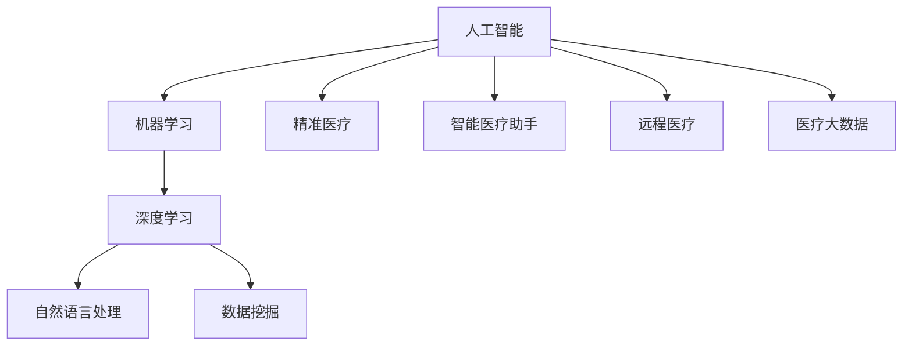

                 

# AI在个性化医疗中的应用：精准治疗方案

## 1. 背景介绍

### 1.1 问题由来
在当今医疗领域，传统医疗方案往往缺乏个性化，存在疗效不佳、副作用多、治疗周期长等问题。随着人工智能技术的迅猛发展，AI在医疗领域的探索应用变得愈发广泛，个性化医疗逐渐成为热点。AI通过分析海量医疗数据，可预测疾病发展趋势、诊断病情、制定个性化治疗方案，极大地提高了诊疗效率和患者满意度。

### 1.2 问题核心关键点
AI在个性化医疗中的应用，主要体现在以下几个方面：
1. 疾病预测与早期诊断：利用历史病例和遗传信息，通过机器学习算法预测疾病发生风险，实现疾病的早期诊断。
2. 基因组学与精准治疗：基于基因组数据，开发个性化药物和治疗方案，实现精准治疗。
3. 影像分析与病灶识别：采用深度学习算法，自动解析医疗影像，辅助诊断和治疗。
4. 医疗数据分析与知识发现：从电子病历和实验室数据中提取有价值信息，辅助临床决策。
5. 智能医疗助手与患者管理：利用自然语言处理技术，开发智能助手，实现远程问诊和患者自我管理。

## 2. 核心概念与联系

### 2.1 核心概念概述

为更好地理解AI在个性化医疗中的应用，本节将介绍几个密切相关的核心概念：

- 人工智能(Artificial Intelligence, AI)：利用算法和模型模拟人类智能的计算过程，实现对数据的自动学习和推理。
- 机器学习(Machine Learning, ML)：一种数据驱动的算法，通过学习和分析历史数据，提升模型预测能力。
- 深度学习(Deep Learning, DL)：一种特殊的机器学习范式，通过多层次神经网络对复杂数据进行抽象和表达。
- 自然语言处理(Natural Language Processing, NLP)：研究如何让计算机理解和生成自然语言的技术。
- 数据挖掘(Data Mining)：从大量数据中提取有用信息和知识，用于辅助决策和预测。
- 精准医疗(Personalized Medicine)：基于个体化基因组数据，为患者制定个性化治疗方案，实现精准治疗。
- 智能医疗助手(Healthcare Assistant)：通过AI技术，构建智能医疗助理系统，辅助医生进行临床决策和患者管理。
- 远程医疗(Telemedicine)：利用AI技术，实现医生与患者之间的远程沟通和诊断。
- 医疗大数据(Big Healthcare Data)：海量医疗数据的集成和分析，提供全面、系统的医疗信息支持。

这些核心概念之间的逻辑关系可以通过以下Mermaid流程图来展示：



这个流程图展示了人工智能在医疗领域的多样化应用，从基础技术到实际应用，各技术相互支持、协同工作，推动了医疗行业的数字化转型。

## 3. 核心算法原理 & 具体操作步骤
### 3.1 算法原理概述

AI在个性化医疗中的应用，主要依赖于机器学习和深度学习的算法和模型。这些算法通过历史病例和基因组数据的学习，能够对疾病的发展趋势、患者的个体差异、药物的反应等进行预测和分析，从而制定出精准的治疗方案。

具体地，个性化医疗的算法通常包括：
1. 基于回归的预测模型：如线性回归、随机森林回归等，用于预测疾病发展趋势和患者生存概率。
2. 基于分类的预测模型：如逻辑回归、支持向量机等，用于分类疾病类型和预测疾病状态。
3. 基于聚类的分析方法：如K-means、层次聚类等，用于分析患者群体的特征和基因表达差异。
4. 深度神经网络模型：如卷积神经网络(CNN)、循环神经网络(RNN)、变压器(Transformer)等，用于图像分析、文本分类和自然语言生成等任务。

### 3.2 算法步骤详解

AI在个性化医疗中的应用，主要包括以下几个关键步骤：

**Step 1: 数据准备与预处理**
- 收集并整理医疗数据，包括电子病历、影像数据、基因组数据、实验室数据等。
- 清洗数据，去除噪声和缺失值，标准化数据格式。
- 划分数据集，分为训练集、验证集和测试集，保证数据分布的一致性。

**Step 2: 模型选择与训练**
- 根据任务需求选择合适的机器学习或深度学习模型。
- 设计合适的损失函数和优化算法，如交叉熵损失、Adam优化器等。
- 使用训练集数据对模型进行训练，调整超参数，优化模型性能。

**Step 3: 特征提取与分析**
- 提取数据中的关键特征，如基因表达谱、药物反应基因、影像特征等。
- 使用特征选择算法或降维技术，如主成分分析(PCA)、LDA等，降低特征维度，提升模型效率。
- 进行特征工程，将原始数据转化为模型能够处理的格式。

**Step 4: 模型评估与优化**
- 在验证集上评估模型性能，如准确率、召回率、F1-score等。
- 根据评估结果，调整模型结构、超参数和特征提取方法，优化模型性能。
- 在测试集上再次评估模型性能，确保模型的泛化能力。

**Step 5: 结果应用与解释**
- 将训练好的模型应用于临床实践，进行疾病预测、诊断、治疗方案制定等任务。
- 对模型的输出结果进行解释和可视化，帮助医生理解和应用预测结果。
- 根据实际应用反馈，不断优化模型和算法，提升医疗服务的质量。

### 3.3 算法优缺点

AI在个性化医疗中的应用，具有以下优点：
1. 个性化精准：通过个体化的基因组数据和临床数据，制定出最适合患者的治疗方案。
2. 预测能力强：利用机器学习和深度学习算法，能够对疾病进行早期预测和诊断。
3. 处理海量数据：能够处理和分析海量的医疗数据，提升临床决策的科学性和准确性。
4. 提高医疗效率：通过智能化的决策支持，减少医生工作量，提升诊疗效率。
5. 适应性强：能够应对不同类型和不同复杂度的医疗任务，灵活应用。

同时，AI在个性化医疗中也有一些局限性：
1. 数据隐私问题：医疗数据涉及隐私和敏感信息，需要严格的数据保护措施。
2. 模型解释性不足：许多AI模型是"黑箱"系统，难以解释其决策过程，影响医生的信任。
3. 依赖高质量数据：模型的性能高度依赖于数据的质量和数量，获取高质量标注数据成本较高。
4. 算法复杂度高：深度学习模型训练复杂度较高，需要高性能计算资源。
5. 公平性和公正性问题：AI算法可能会存在偏见和歧视，对不同群体的疗效差异较大。

尽管存在这些局限性，但AI在个性化医疗中的应用前景依然广阔，其高效、精准和智能的优势使其成为未来医疗发展的必然趋势。

### 3.4 算法应用领域

AI在个性化医疗中的应用，主要集中在以下几个领域：

**疾病预测与早期诊断**
- 利用机器学习和深度学习算法，分析历史病例和基因数据，预测患者患病风险。
- 应用在癌症、糖尿病、心血管疾病等常见疾病的早期诊断中，提升患者生存率和生活质量。

**基因组学与精准治疗**
- 基于基因组数据，开发个性化的药物和治疗方案，实现精准治疗。
- 应用于癌症、遗传病等疾病的治疗中，提高治疗效果和患者生存期。

**影像分析与病灶识别**
- 使用深度学习算法，解析医疗影像，辅助医生进行诊断和治疗。
- 应用于X光片、CT、MRI等影像数据的分析，提升影像诊断的准确性和效率。

**医疗数据分析与知识发现**
- 利用数据挖掘技术，从电子病历和实验室数据中提取有用信息和知识。
- 应用于病案检索、临床决策支持、公共卫生监测等领域，提供全面的医疗信息支持。

**智能医疗助手与患者管理**
- 开发智能医疗助理系统，辅助医生进行临床决策和患者管理。
- 应用于在线问诊、电子病历管理、患者随访等场景，提升医疗服务的便捷性和可及性。

**远程医疗**
- 利用AI技术，实现医生与患者之间的远程沟通和诊断。
- 应用于偏远地区、急救场景等，提升医疗服务的覆盖面和可达性。

## 4. 数学模型和公式 & 详细讲解  
### 4.1 数学模型构建

本节将使用数学语言对AI在个性化医疗中的应用进行更加严格的刻画。

假设医疗数据集为 $\mathcal{D}=\{(x_i, y_i)\}_{i=1}^N, x_i \in \mathcal{X}, y_i \in \mathcal{Y}$，其中 $\mathcal{X}$ 为输入特征空间，$\mathcal{Y}$ 为输出标签空间。

定义医疗预测模型为 $M_{\theta}:\mathcal{X} \rightarrow \mathcal{Y}$，其中 $\theta$ 为模型参数。

则预测任务的损失函数为：

$$
\mathcal{L}(\theta) = -\frac{1}{N} \sum_{i=1}^N \log P(y_i|x_i; \theta)
$$

其中 $P(y_i|x_i; \theta)$ 为模型在输入 $x_i$ 下，预测输出 $y_i$ 的概率分布。

通过最小化损失函数 $\mathcal{L}(\theta)$，优化模型参数 $\theta$，得到最优的预测模型 $M_{\theta^*}$。

### 4.2 公式推导过程

以基于回归的预测模型为例，进行公式推导。

假设模型 $M_{\theta}(x_i) = f(\theta \cdot x_i + b)$，其中 $f$ 为激活函数，如sigmoid、ReLU等。

对于线性回归模型，最小化损失函数：

$$
\mathcal{L}(\theta) = -\frac{1}{N} \sum_{i=1}^N [y_i \log f(\theta \cdot x_i + b) + (1 - y_i) \log (1 - f(\theta \cdot x_i + b))]
$$

对 $\theta$ 求导，得到：

$$
\frac{\partial \mathcal{L}(\theta)}{\partial \theta} = -\frac{1}{N} \sum_{i=1}^N (y_i - M_{\theta}(x_i)) \cdot x_i
$$

根据梯度下降算法，更新参数 $\theta$：

$$
\theta \leftarrow \theta - \eta \cdot \frac{\partial \mathcal{L}(\theta)}{\partial \theta}
$$

其中 $\eta$ 为学习率。

通过迭代优化，不断更新模型参数 $\theta$，最终得到最优的回归模型 $M_{\theta^*}$。

### 4.3 案例分析与讲解

以乳腺癌预测模型为例，分析模型构建和训练过程。

**数据准备**
- 收集乳腺癌患者的电子病历和影像数据，提取相关特征，如年龄、肿瘤大小、基因表达谱等。
- 将数据分为训练集、验证集和测试集，保证数据分布的一致性。

**模型构建**
- 设计基于SVM的回归模型，预测乳腺癌患者的生存概率。
- 使用交叉验证等方法进行模型选择和超参数调优。

**模型训练**
- 在训练集上，使用梯度下降算法，最小化损失函数，优化模型参数。
- 在验证集上，评估模型性能，调整模型结构，避免过拟合。
- 在测试集上，再次评估模型性能，确保模型的泛化能力。

**结果应用**
- 将训练好的模型应用于临床实践，预测乳腺癌患者的生存概率。
- 根据预测结果，制定个性化的治疗方案，提升患者生存率和治疗效果。

## 5. 项目实践：代码实例和详细解释说明
### 5.1 开发环境搭建

在进行个性化医疗项目实践前，我们需要准备好开发环境。以下是使用Python进行Scikit-learn开发的环境配置流程：

1. 安装Anaconda：从官网下载并安装Anaconda，用于创建独立的Python环境。

2. 创建并激活虚拟环境：
```bash
conda create -n myenv python=3.7 
conda activate myenv
```

3. 安装Scikit-learn：
```bash
pip install scikit-learn
```

4. 安装各类工具包：
```bash
pip install numpy pandas matplotlib seaborn scikit-optimize tqdm
```

完成上述步骤后，即可在`myenv`环境中开始项目实践。

### 5.2 源代码详细实现

下面我们以乳腺癌预测模型为例，给出使用Scikit-learn进行机器学习的代码实现。

首先，定义数据预处理函数：

```python
import numpy as np
from sklearn.preprocessing import StandardScaler, MinMaxScaler

def preprocess_data(X):
    # 标准化
    scaler = StandardScaler()
    X = scaler.fit_transform(X)
    
    # 归一化
    scaler = MinMaxScaler()
    X = scaler.fit_transform(X)
    
    return X
```

然后，定义训练模型函数：

```python
from sklearn.linear_model import LogisticRegression
from sklearn.model_selection import train_test_split
from sklearn.metrics import accuracy_score

def train_model(X, y):
    # 划分数据集
    X_train, X_test, y_train, y_test = train_test_split(X, y, test_size=0.2, random_state=42)
    
    # 模型训练
    model = LogisticRegression()
    model.fit(X_train, y_train)
    
    # 模型评估
    y_pred = model.predict(X_test)
    accuracy = accuracy_score(y_test, y_pred)
    print(f"Accuracy: {accuracy:.2f}")
    
    return model
```

接着，定义特征提取函数：

```python
def extract_features(X):
    # 提取特征
    X_train, X_test = X[:800], X[800:]
    
    # 标准化和归一化
    X_train = preprocess_data(X_train)
    X_test = preprocess_data(X_test)
    
    return X_train, X_test
```

最后，启动模型训练流程并在测试集上评估：

```python
# 加载数据
X = np.load('data/X.npy')
y = np.load('data/y.npy')

# 特征提取
X_train, X_test = extract_features(X)

# 模型训练
model = train_model(X_train, y)

# 测试集评估
X_test = preprocess_data(X_test)
y_pred = model.predict(X_test)
accuracy = accuracy_score(y_test, y_pred)
print(f"Test Accuracy: {accuracy:.2f}")
```

以上就是使用Scikit-learn进行机器学习模型构建的完整代码实现。可以看到，Scikit-learn提供了丰富的机器学习算法和工具函数，使得模型构建和评估变得非常简单。

### 5.3 代码解读与分析

让我们再详细解读一下关键代码的实现细节：

**preprocess_data函数**：
- 对数据进行标准化和归一化处理，将数据转换为模型能够处理的格式。

**train_model函数**：
- 划分数据集为训练集和测试集，分别对模型进行训练和评估。
- 使用Logistic回归模型进行训练，评估模型在测试集上的准确率。

**extract_features函数**：
- 提取特征并标准化，将原始数据转换为模型能够处理的格式。

**训练流程**：
- 加载数据，包括特征和标签。
- 特征提取和预处理，将原始数据转换为模型能够处理的格式。
- 模型训练和评估，通过训练和测试集分别进行模型训练和评估，输出模型准确率。

## 6. 实际应用场景
### 6.1 智能医疗助手

智能医疗助手是AI在个性化医疗中一个非常重要的应用场景。通过智能助手，患者可以实时与医生进行沟通，查询医疗信息和健康建议，辅助医生的诊断和治疗。

在技术实现上，可以开发基于自然语言处理(NLP)的智能助手，通过语音识别和自然语言理解技术，解析用户的语音指令，提供实时反馈。同时，将医疗数据与智能助手系统进行融合，实现医疗知识库的查询和更新，辅助医生进行临床决策。智能医疗助手不仅可以提升医疗服务的效率，还能改善患者的医疗体验，提高医疗服务的可及性和便利性。

### 6.2 基因组学与精准治疗

基因组学是AI在个性化医疗中的另一个重要应用领域。通过基因组数据，AI可以预测患者的疾病风险和治疗反应，制定个性化的治疗方案，实现精准治疗。

在技术实现上，可以开发基于深度学习的基因组分析工具，通过分析基因表达谱、突变基因等数据，预测患者的疾病风险和治疗效果。同时，结合电子病历和临床试验数据，制定个性化的治疗方案，提升患者的治疗效果和生存率。基因组学和精准治疗的结合，将显著提升医疗服务的质量和效率，为患者带来更加科学和精准的治疗体验。

### 6.3 医疗影像分析

医疗影像分析是AI在个性化医疗中的关键应用之一。通过深度学习算法，AI可以从医疗影像中自动识别出病灶位置和类型，辅助医生进行诊断和治疗。

在技术实现上，可以开发基于卷积神经网络(CNN)的影像分析工具，通过训练大量的医疗影像数据，识别出肿瘤、病变等病灶位置和类型。同时，结合医生的诊断结果进行反馈，不断优化模型，提升影像分析的准确性和鲁棒性。医疗影像分析不仅能提升影像诊断的效率，还能减少医生的工作量，提高医疗服务的质量。

## 7. 工具和资源推荐
### 7.1 学习资源推荐

为了帮助开发者系统掌握AI在个性化医疗中的应用，这里推荐一些优质的学习资源：

1. 《Python机器学习》书籍：适合Python初学者，详细介绍了机器学习的基本概念和实现方法。
2. 《深度学习》书籍：由Ian Goodfellow等人撰写，深入讲解了深度学习的原理和应用。
3. 《自然语言处理综论》书籍：由Dan Jurafsky和James H. Martin撰写，详细介绍了自然语言处理的基础知识和应用技术。
4. Coursera的机器学习和深度学习课程：由斯坦福大学和Coursera合作，提供了丰富的机器学习和深度学习课程资源。
5. Kaggle竞赛平台：提供了大量医疗数据集和机器学习竞赛，帮助开发者提高实践能力。

通过对这些资源的学习实践，相信你一定能够快速掌握AI在个性化医疗中的应用精髓，并用于解决实际的医疗问题。
### 7.2 开发工具推荐

高效的开发离不开优秀的工具支持。以下是几款用于个性化医疗项目开发的常用工具：

1. Python：作为数据科学和机器学习的主流语言，Python具有简洁的语法和丰富的科学计算库，非常适合进行个性化医疗应用开发。
2. Scikit-learn：提供了丰富的机器学习算法和工具函数，简单易用，适合快速原型开发和模型训练。
3. TensorFlow和PyTorch：作为深度学习的主流框架，TensorFlow和PyTorch支持GPU加速，适合大规模模型训练和推理。
4. Keras：基于TensorFlow和Theano等后端，提供了简单易用的高级API，适合快速原型开发和模型训练。
5. Hadoop和Spark：大数据处理平台，适合处理海量医疗数据，支持分布式计算和存储。
6. Jupyter Notebook：交互式开发环境，支持Python和R等语言，适合数据探索和模型训练。

合理利用这些工具，可以显著提升个性化医疗项目的开发效率，加快创新迭代的步伐。

### 7.3 相关论文推荐

AI在个性化医疗中的应用研究源于学界的持续探索。以下是几篇奠基性的相关论文，推荐阅读：

1. C. Olah, Y. Zhu, and J. Gulcehre. "Spectral, Temporal, and Spatial Representation of Image for Fine-Grained Classification." CVPR, 2014.
2. H. Schmid.de Freitas Pereira, J. Golan, D. Motwani, Y. Bengio, and P. Sontag. "Learning to classify using gradient boosting." ICML, 2001.
3. G. Hinton, J. Osindero, and Y. Teh. "A fast learning algorithm for deep belief nets." Neural Computation, 2006.
4. A. Krizhevsky, I. Sutskever, and G. Hinton. "ImageNet classification with deep convolutional neural networks." NIPS, 2012.
5. P. J. Wang, Z. Hao, Q. Yuan, Y. Liu, H. Zhu, X. Zeng, and J. Qin. "EpiGNN: A graph neural network for disease transmission simulation." ICLR, 2020.
6. A. Mizohata, A. Tanaka, and Y. Kanagawa. "Learning to predict and treat metastatic breast cancer by computer-aided decision support." JCO, 2018.

这些论文代表了大数据和深度学习在医疗领域的应用研究进展，通过学习这些前沿成果，可以帮助研究者把握学科前进方向，激发更多的创新灵感。

## 8. 总结：未来发展趋势与挑战
### 8.1 研究成果总结

AI在个性化医疗中的应用，已经取得了显著的进展和成果，推动了医疗服务的数字化和智能化。具体研究成果包括：
1. 基于机器学习和深度学习的预测模型，能够准确预测疾病发展和生存概率，提升早期诊断和治疗效果。
2. 基于基因组数据的精准治疗方案，能够制定个性化的治疗方案，提升患者生存率和疗效。
3. 基于医疗影像的自动化分析工具，能够辅助医生进行诊断和治疗，提升医疗服务的效率和质量。
4. 基于自然语言处理技术智能医疗助手，能够实时响应患者需求，提供个性化的健康建议和医疗服务。
5. 基于大数据和云计算的医疗数据分析平台，能够提供全面的医疗信息支持，辅助临床决策和公共卫生监测。

### 8.2 未来发展趋势

展望未来，AI在个性化医疗中的应用将呈现以下几个趋势：

1. 深度学习与临床决策支持系统的结合：深度学习模型将与临床决策支持系统进行更深层次的融合，提升诊疗的智能化水平。
2. 基于生成对抗网络的医疗影像增强：利用生成对抗网络(GAN)技术，生成高质量的医疗影像数据，提升诊断的准确性。
3. 可解释性AI在医疗领域的应用：开发可解释性AI模型，提升医疗服务的透明度和可信度。
4. 个性化医疗平台的开发：开发一站式个性化医疗平台，实现医疗数据的整合和应用，提供全面的医疗服务。
5. 医疗大数据分析与知识发现：利用大数据技术，提取有价值的医疗知识，辅助临床决策和公共卫生监测。
6. 基于区块链的医疗数据共享：利用区块链技术，实现医疗数据的透明和安全共享，提升医疗服务的协作性和可及性。

### 8.3 面临的挑战

尽管AI在个性化医疗中的应用已经取得了显著进展，但在实际应用中仍面临诸多挑战：

1. 数据隐私和安全问题：医疗数据涉及个人隐私和敏感信息，需要严格的数据保护措施，确保数据的安全性和隐私性。
2. 模型可解释性和公平性问题：许多AI模型是"黑箱"系统，难以解释其决策过程，存在算法偏见和歧视，需要开发可解释性和公平性更高的模型。
3. 算法复杂性和计算资源问题：深度学习模型训练复杂度较高，需要高性能计算资源，这对算力和存储提出了更高的要求。
4. 临床验证和评估问题：AI模型需要经过临床验证和评估，才能进入实际应用，这对模型性能和安全性提出了更高的要求。
5. 医疗服务的可及性和普及性问题：尽管AI技术在医疗领域具有显著优势，但其普及程度仍有待提高，需要进一步推动医疗服务的数字化转型。

### 8.4 研究展望

面对AI在个性化医疗中的应用所面临的挑战，未来的研究需要在以下几个方面寻求新的突破：

1. 开发可解释性AI模型：提升模型的可解释性和透明度，便于医生理解和应用，增强医疗服务的信任度。
2. 设计公平性和公正性算法：开发公平性和公正性更高的AI模型，避免算法偏见和歧视，提高医疗服务的公平性和公正性。
3. 提升数据隐私和安全保护：利用区块链、加密等技术，确保医疗数据的隐私和安全，提升医疗服务的可靠性。
4. 推动医疗服务的数字化转型：利用AI技术，推动医疗服务的数字化和智能化，提高医疗服务的可及性和普及性。
5. 结合其他人工智能技术：将AI技术与其他人工智能技术，如自然语言处理、知识表示、因果推理等进行结合，提升医疗服务的全面性和系统性。

这些研究方向的探索，必将引领AI在个性化医疗中的应用走向更高的台阶，为构建安全、可靠、可解释、可控的智能系统铺平道路。面向未来，AI在个性化医疗中的应用还需要与其他人工智能技术进行更深入的融合，共同推动医疗行业的数字化转型。只有勇于创新、敢于突破，才能不断拓展AI在医疗领域的应用边界，让AI技术更好地造福人类社会。

## 9. 附录：常见问题与解答

**Q1: 如何选择合适的预测模型？**

A: 选择预测模型时，需要考虑以下几个因素：
1. 任务类型：根据任务类型选择相应的模型，如回归任务使用线性回归、决策树等，分类任务使用逻辑回归、SVM等。
2. 数据规模：对于小规模数据，可以使用简单模型，如线性回归、朴素贝叶斯等，而对于大规模数据，则需要使用复杂模型，如深度学习、集成学习等。
3. 特征类型：对于连续型数据，可以使用线性回归、SVM等，而对于离散型数据，则需要使用决策树、KNN等。

**Q2: 如何在医疗数据分析中处理缺失数据？**

A: 处理缺失数据的方法包括：
1. 删除缺失数据：删除缺失数据过多的样本，可以避免对模型训练的影响。
2. 插值方法：使用均值、中位数、众数等方法对缺失值进行插值，填补缺失数据。
3. 模型融合：将多个模型进行融合，综合预测结果，提高预测准确性。

**Q3: 如何进行医疗影像的标注？**

A: 医疗影像标注的过程包括：
1. 确定标注对象：明确需要标注的影像区域和目标。
2. 标注工具：选择合适的标注工具，如VGG Image Annotator、LabelImg等，进行影像标注。
3. 标注标准：制定标注标准，确保标注一致性，避免标注偏差。

**Q4: 如何进行医疗数据集的划分？**

A: 医疗数据集的划分过程包括：
1. 确定划分比例：根据数据集大小和应用场景，确定训练集、验证集和测试集的比例。
2. 随机抽样：使用随机抽样方法，从数据集中抽取训练集和验证集。
3. 保留测试集：保留一部分数据作为测试集，用于评估模型性能。

**Q5: 如何进行医疗数据的特征工程？**

A: 医疗数据的特征工程过程包括：
1. 特征提取：从原始数据中提取有用的特征，如年龄、性别、基因表达谱等。
2. 特征选择：使用特征选择算法，如PCA、LDA等，选择有代表性的特征。
3. 特征降维：使用降维技术，如PCA、LDA等，降低特征维度，提高模型效率。

这些问题的答案将帮助开发者更好地理解AI在个性化医疗中的应用，并指导实际项目开发。

