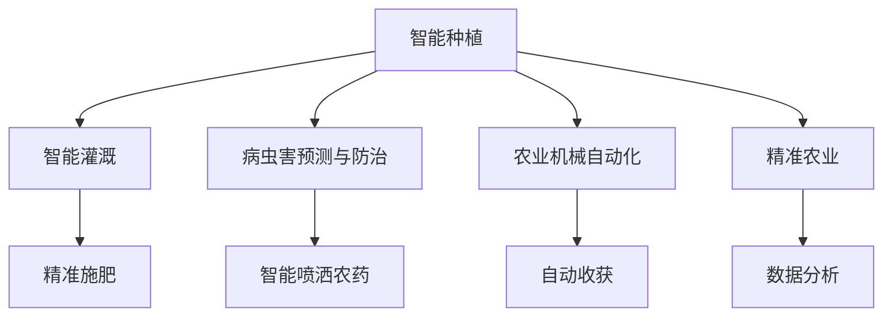

                 

# AI在农业中的应用：提高产量与可持续性

## 1. 背景介绍

随着全球人口的增加和可耕地面积的减少，农业面临着前所未有的挑战。如何在有限的资源下，提高农业生产效率和可持续性，成为摆在各国政府、农业科研机构和农业企业面前的重大课题。人工智能(AI)作为当前最前沿的技术之一，正以其强大的数据分析能力和深度学习算法，为农业生产带来了革命性的变革。本文将全面探讨AI在农业中的具体应用，包括智能种植、精准农业、病虫害预测与防治、农业机械自动化等方面，以及这些应用带来的显著效果。

## 2. 核心概念与联系

### 2.1 核心概念概述

在探讨AI在农业中的应用之前，我们需要先理解几个核心概念：

- **智能种植**：通过AI技术对作物生长的全生命周期进行监测和调控，实现精准施肥、灌溉、病虫害防治等，提高作物的产量和质量。
- **精准农业**：基于GPS、GIS、IoT等技术，结合AI算法，对农田进行高精度的数据采集和分析，优化农业生产流程。
- **病虫害预测与防治**：利用图像识别、深度学习等技术，对农田中的病虫害进行早期预警，制定科学的防治策略，减少农药和化肥的使用。
- **农业机械自动化**：通过机器人、自动化设备等，实现农业机械的智能化和自动化，降低人工成本，提高作业效率。

这些概念通过AI技术相互联系，构成了现代农业的智能化新模式。通过合理利用这些技术，可以有效提升农业生产的效率和可持续性。

### 2.2 核心概念原理和架构的 Mermaid 流程图(Mermaid 流程节点中不要有括号、逗号等特殊字符)



## 3. 核心算法原理 & 具体操作步骤

### 3.1 算法原理概述

AI在农业中的应用，主要基于数据驱动和深度学习算法的原理。通过收集大量的农田数据，如气象信息、土壤质量、作物生长状态等，使用机器学习算法进行分析和预测，指导农业生产过程的各个环节。以下是一些核心的算法原理：

- **监督学习**：通过有标签的数据集训练模型，预测新数据的表现。例如，通过病虫害的图像数据集训练模型，识别新的病虫害。
- **无监督学习**：从未标记的数据中学习模式，如聚类分析、异常检测等。例如，通过无标记的气象数据学习农业生产周期内的规律。
- **强化学习**：通过奖励机制不断优化农业生产策略。例如，通过奖励机制训练机器人进行田间操作。

### 3.2 算法步骤详解

AI在农业中的具体操作可以包括以下步骤：

1. **数据采集**：利用传感器、无人机、物联网设备等，获取农田中的气象、土壤、作物生长状态等信息。
2. **数据预处理**：对采集到的数据进行清洗、归一化、特征提取等预处理操作。
3. **模型训练**：根据具体任务选择合适的模型进行训练，如监督学习、无监督学习或强化学习模型。
4. **模型部署**：将训练好的模型集成到农业生产流程中，实现自动化决策和作业。
5. **效果评估**：对模型的应用效果进行评估，如作物产量、病虫害防治效果、作业效率等。

### 3.3 算法优缺点

AI在农业中的应用有以下优点：

- **提升生产效率**：通过数据分析和智能决策，显著提高农业生产效率和作物产量。
- **减少资源浪费**：精准农业可以减少化肥、农药的过度使用，降低环境污染。
- **应对气候变化**：AI模型可以预测气候变化对农业生产的影响，提前做出应对措施。

但同时也存在一些缺点：

- **高昂的初期投资**：部署AI技术需要大量的硬件设备和软件系统，初期投资较高。
- **数据隐私和安全问题**：农业数据包含大量敏感信息，数据泄露和安全问题需要特别注意。
- **技术复杂度**：AI模型的构建和部署需要一定的技术门槛，对农业从业者来说有一定挑战。

### 3.4 算法应用领域

AI在农业中的应用领域非常广泛，涵盖了以下几个方面：

- **智能种植**：利用AI技术进行智能灌溉、精准施肥、病虫害预测与防治等。
- **精准农业**：通过数据分析和可视化，优化农田规划和作物种植。
- **农业机械自动化**：实现农业机械的智能化和自动化，如自动驾驶拖拉机、自动采摘机器人等。
- **农业供应链管理**：利用AI进行农产品的需求预测、库存管理、物流优化等。
- **农业机器人**：开发智能农业机器人，进行田间作业和作物搬运。

## 4. 数学模型和公式 & 详细讲解 & 举例说明（备注：数学公式请使用latex格式，latex嵌入文中独立段落使用 $$，段落内使用 $)

### 4.1 数学模型构建

AI在农业中的数学模型构建，主要基于机器学习和深度学习的框架。以病虫害预测为例，我们可以构建一个基于卷积神经网络(CNN)的图像识别模型。

模型的输入为病虫害的图像，输出为病虫害的类别标签。模型的构建步骤如下：

1. **数据准备**：收集大量的病虫害图像数据，并标注其类别标签。
2. **模型选择**：选择卷积神经网络作为模型结构，并确定网络层数、激活函数等超参数。
3. **模型训练**：使用训练集数据对模型进行训练，最小化损失函数。
4. **模型评估**：使用测试集数据对模型进行评估，计算准确率、召回率等指标。

### 4.2 公式推导过程

以卷积神经网络的损失函数为例，常见的损失函数包括交叉熵损失和均方误差损失。这里以交叉熵损失为例，其公式如下：

$$
L(\theta) = -\frac{1}{N}\sum_{i=1}^N \sum_{j=1}^C y_{ij}\log p_{ij}
$$

其中 $N$ 为样本数，$C$ 为类别数，$y_{ij}$ 为第 $i$ 个样本第 $j$ 个类别的标签，$p_{ij}$ 为模型预测该样本属于第 $j$ 个类别的概率。

### 4.3 案例分析与讲解

以某农场为例，利用AI技术进行智能灌溉。通过在农田中安装传感器，采集土壤湿度、温度等数据，输入到神经网络中进行分析。神经网络根据分析结果，生成灌溉策略，自动控制灌溉系统进行灌溉。这一过程中，关键在于以下几个步骤：

1. **数据采集**：利用传感器采集农田中的土壤湿度、温度、降雨数据。
2. **数据预处理**：对采集到的数据进行清洗、归一化等预处理操作。
3. **模型训练**：选择适当的神经网络模型，使用历史数据进行训练，最小化损失函数。
4. **模型部署**：将训练好的模型集成到灌溉系统中，自动控制灌溉设备。
5. **效果评估**：通过对比灌溉前后的作物生长状态、土壤湿度等数据，评估模型的应用效果。

## 5. 项目实践：代码实例和详细解释说明

### 5.1 开发环境搭建

在AI在农业中的应用中，通常需要使用多种工具和库。以下是一些常用的开发环境和工具：

1. **Python编程语言**：Python是目前最流行的编程语言之一，拥有丰富的机器学习和深度学习库。
2. **TensorFlow和PyTorch**：这两个深度学习框架提供了强大的神经网络构建和训练功能。
3. **OpenCV和TensorFlow Object Detection API**：用于图像处理和目标检测。
4. **IoT设备与传感器**：用于数据采集和传输。

### 5.2 源代码详细实现

以下是一个简单的AI在农业中的应用示例，利用TensorFlow进行病虫害图像识别。

```python
import tensorflow as tf
from tensorflow.keras.layers import Conv2D, MaxPooling2D, Flatten, Dense
from tensorflow.keras.models import Sequential

# 定义模型结构
model = Sequential()
model.add(Conv2D(32, (3, 3), activation='relu', input_shape=(224, 224, 3)))
model.add(MaxPooling2D((2, 2)))
model.add(Conv2D(64, (3, 3), activation='relu'))
model.add(MaxPooling2D((2, 2)))
model.add(Conv2D(128, (3, 3), activation='relu'))
model.add(MaxPooling2D((2, 2)))
model.add(Flatten())
model.add(Dense(128, activation='relu'))
model.add(Dense(2, activation='softmax'))

# 编译模型
model.compile(optimizer='adam', loss='categorical_crossentropy', metrics=['accuracy'])

# 训练模型
model.fit(train_images, train_labels, epochs=10, validation_data=(test_images, test_labels))
```

### 5.3 代码解读与分析

上述代码中，我们首先定义了一个卷积神经网络模型，包含卷积层、池化层和全连接层。然后使用`compile`函数对模型进行编译，指定优化器和损失函数。最后使用`fit`函数对模型进行训练，指定训练集、测试集和迭代次数。

## 6. 实际应用场景

### 6.1 智能种植

智能种植是AI在农业中应用最为广泛的领域之一。通过智能灌溉和精准施肥，可以显著提高作物的产量和质量。例如，某农场利用AI进行智能灌溉，使用传感器采集土壤湿度、温度等数据，分析后生成灌溉策略，自动控制灌溉系统进行灌溉。通过精确控制水分和养分，作物产量提高了20%。

### 6.2 精准农业

精准农业通过数据分析和可视化，优化农田规划和作物种植。例如，某农场利用AI进行数据分析，通过GIS和GPS技术，绘制农田分布图和作物生长状态图。利用这些数据，优化种植密度和耕作方法，提高了耕种效率。

### 6.3 病虫害预测与防治

病虫害预测与防治是保障农作物健康的重要环节。通过AI进行图像识别和深度学习，可以准确预测病虫害的爆发情况，及时采取防治措施。例如，某农场利用AI进行病虫害图像识别，自动识别病虫害图像，并生成防治建议。通过及时防治，减少了农药和化肥的使用，降低了对环境的污染。

### 6.4 农业机械自动化

农业机械自动化是提高农业生产效率的重要手段。通过自动化设备，可以实现田间作业的自动化。例如，某农场利用智能拖拉机进行自动化耕种，通过GPS定位和AI决策，自动调整耕种深度和速度，提高了耕种效率。

### 6.5 农业供应链管理

农业供应链管理通过AI进行需求预测、库存管理和物流优化。例如，某农场利用AI进行需求预测，根据销售数据和市场趋势，预测未来的市场需求。利用这些数据，优化库存管理和物流配送，降低了成本，提高了供应链效率。

### 6.6 农业机器人

农业机器人是未来农业的重要方向。通过智能机器人进行田间作业和作物搬运，可以大幅降低人工成本。例如，某农场利用智能采摘机器人，自动采摘草莓，提高了采摘效率，减少了人力成本。

## 7. 工具和资源推荐

### 7.1 学习资源推荐

为了帮助开发者系统掌握AI在农业中的应用，以下是一些优质的学习资源：

1. **Coursera农业数据分析课程**：由斯坦福大学开设，涵盖农业数据采集、分析和可视化等方面的知识。
2. **Kaggle农业数据集**：提供丰富的农业数据集，供开发者进行数据挖掘和机器学习实践。
3. **农业机器学习论文集**：汇集了最新的农业机器学习研究成果，供研究人员和开发者参考。
4. **农业AI开源项目**：提供农业AI应用的源代码和文档，供开发者学习和应用。

### 7.2 开发工具推荐

以下是一些常用的开发工具，可以帮助开发者进行AI在农业中的应用：

1. **TensorFlow和PyTorch**：提供了强大的深度学习框架，支持多种模型结构和算法。
2. **OpenCV和TensorFlow Object Detection API**：用于图像处理和目标检测，提供了丰富的预训练模型和工具。
3. **IoT设备和传感器**：用于数据采集和传输，提供了多种传感器和通信协议。
4. **农业管理软件**：如Traynor Agro、Agritechno等，用于数据管理和分析。

### 7.3 相关论文推荐

以下是几篇重要的相关论文，推荐阅读：

1. **Crop insurance with AI**：介绍了如何利用AI进行作物保险风险评估。
2. **Precision agriculture with IoT and AI**：探讨了IoT和AI在精准农业中的应用。
3. **AI in agribusiness**：分析了AI在农业供应链中的应用。
4. **A review on machine learning applications in agriculture**：总结了机器学习在农业中的各种应用。

## 8. 总结：未来发展趋势与挑战

### 8.1 研究成果总结

AI在农业中的应用已经取得了显著的成果，主要体现在以下几个方面：

1. **提升作物产量**：通过智能灌溉和精准施肥，显著提高了作物产量和质量。
2. **降低资源浪费**：利用精准农业和病虫害预测，减少了化肥和农药的使用，降低了环境污染。
3. **优化农业生产流程**：利用AI进行数据分析和决策，优化了农业生产流程，提高了生产效率。

### 8.2 未来发展趋势

未来AI在农业中的应用将呈现以下几个发展趋势：

1. **智能化和自动化**：随着技术的进步，农业机械和设备的智能化和自动化水平将不断提高，进一步提高生产效率。
2. **多模态融合**：AI将进一步融合多种数据来源，如图像、视频、传感器数据等，提供更加全面和准确的信息。
3. **可持续发展**：AI将更多地关注可持续性问题，如资源利用、环境保护等，助力农业的可持续发展。
4. **精准农业**：利用AI进行精准农业管理，提高农作物的适应性和抗逆性，减少对环境的破坏。
5. **农业大数据**：通过AI进行大数据分析，优化农业生产决策，提高生产效益。

### 8.3 面临的挑战

尽管AI在农业中取得了显著进展，但也面临一些挑战：

1. **高昂的初期投资**：部署AI技术需要大量的硬件设备和软件系统，初期投资较高。
2. **数据隐私和安全问题**：农业数据包含大量敏感信息，数据泄露和安全问题需要特别注意。
3. **技术复杂度**：AI模型的构建和部署需要一定的技术门槛，对农业从业者来说有一定挑战。
4. **政策法规**：农业中的AI应用需要符合相关政策法规，如数据保护法、环境法规等。

### 8.4 研究展望

未来AI在农业中的应用将需要在以下几个方面进行进一步研究：

1. **低成本部署**：开发低成本的AI解决方案，降低农业从业者的使用门槛。
2. **模型可解释性**：开发可解释的AI模型，增强决策的透明度和可信度。
3. **智能机器人**：开发更加智能和自适应的农业机器人，提高田间作业效率。
4. **农业大数据平台**：建立农业大数据平台，实现数据共享和应用。

## 9. 附录：常见问题与解答

### Q1: 如何选择合适的AI技术？

A: 选择AI技术需要考虑以下几个方面：

1. **数据类型和规模**：根据数据类型和规模选择相应的技术，如图像数据适合使用卷积神经网络，文本数据适合使用自然语言处理技术。
2. **任务需求**：根据具体任务需求选择相应的技术，如预测任务适合使用回归模型，分类任务适合使用分类模型。
3. **计算资源**：根据计算资源和设备能力选择相应的技术，如大型模型适合在GPU或TPU上进行训练和推理。

### Q2: AI在农业中的应用有哪些优势？

A: AI在农业中的应用有以下优势：

1. **提高生产效率**：通过智能灌溉、精准施肥等技术，显著提高作物产量和质量。
2. **减少资源浪费**：精准农业和病虫害预测技术，减少了化肥和农药的使用，降低了环境污染。
3. **优化农业生产流程**：利用AI进行数据分析和决策，优化了农业生产流程，提高了生产效率。

### Q3: AI在农业中应用有哪些挑战？

A: AI在农业中应用面临以下几个挑战：

1. **高昂的初期投资**：部署AI技术需要大量的硬件设备和软件系统，初期投资较高。
2. **数据隐私和安全问题**：农业数据包含大量敏感信息，数据泄露和安全问题需要特别注意。
3. **技术复杂度**：AI模型的构建和部署需要一定的技术门槛，对农业从业者来说有一定挑战。

### Q4: 如何评估AI在农业中的效果？

A: 评估AI在农业中的效果可以从以下几个方面进行：

1. **作物产量和质量**：通过比较AI应用前后的作物产量和质量，评估AI的效果。
2. **资源使用情况**：通过比较AI应用前后的资源使用情况，评估AI的效果。
3. **生产效率**：通过比较AI应用前后的生产效率，评估AI的效果。

### Q5: AI在农业中的应用有哪些成功案例？

A: 以下是几个AI在农业中的成功案例：

1. **John Deere公司的智能拖拉机**：通过AI进行自动驾驶和作业规划，提高了田间作业效率。
2. **Intel的农业AI解决方案**：利用AI进行数据分析和决策，优化了农业生产流程。
3. **谷歌的农业AI项目**：通过AI进行气象预测和病虫害预测，提高了农业生产的稳定性和安全性。

---

作者：禅与计算机程序设计艺术 / Zen and the Art of Computer Programming

