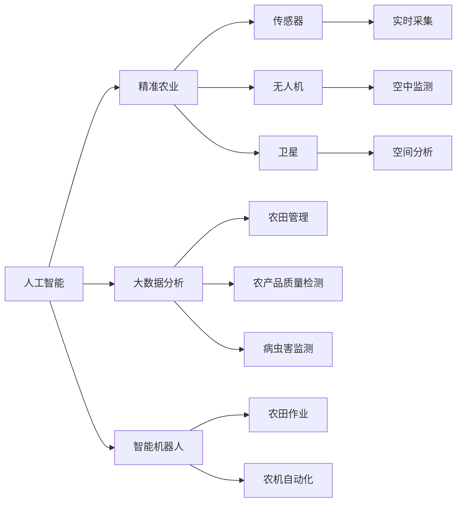

                 

## 1. 背景介绍

### 1.1 问题由来
现代农业面临着诸多挑战，如气候变化、水资源短缺、土地退化等，这些问题对农业生产造成了严重影响。传统的农业管理方法已经难以应对这些问题，迫切需要借助技术手段提升农业生产效率，保障食品安全，促进农业可持续发展。人工智能（AI）技术的发展，为农业的智能化转型提供了新的路径。通过AI在农业中的应用，可以有效提高农作物的产量，降低生产成本，同时保护环境，实现农业的绿色、可持续性发展。

### 1.2 问题核心关键点
人工智能在农业中的应用主要集中在以下几个关键点：

- **数据驱动**：通过收集和分析农业生产中的各类数据，如气象数据、土壤数据、作物生长数据等，为农业生产提供决策支持。
- **精准农业**：利用AI技术进行土地监测、作物病虫害监测、农产品质量检测等，实现精准农业管理。
- **智能决策**：基于机器学习和深度学习算法，对农业生产中的各种问题进行智能分析和决策。
- **机器人技术**：利用智能机器人进行农田管理、农机自动化作业等，提高农业生产效率。
- **大数据分析**：通过对海量农业数据进行分析和挖掘，提取有价值的信息，指导农业生产。

这些关键点共同构成了AI在农业中的主要应用方向，旨在通过智能化手段提高农业生产的效率和可持续性。

### 1.3 问题研究意义
AI在农业中的应用，对于提升农业生产效率、保障食品安全、促进农业可持续发展具有重要意义：

1. **提高产量**：通过精准农业和智能决策，优化种植和施肥方案，减少资源浪费，提高农作物产量。
2. **降低成本**：利用智能机器人进行农田管理和农机自动化作业，降低人力成本和物资消耗。
3. **保障安全**：通过智能检测和预测，及时发现和防治病虫害，减少农药使用，保障食品安全和生态环境。
4. **促进可持续性**：通过数据分析和优化，实现资源的高效利用，减少环境污染，推动农业的绿色发展。
5. **推动产业化**：AI技术的应用将使农业生产更加标准化、规模化，促进农业产业的现代化进程。

## 2. 核心概念与联系

### 2.1 核心概念概述

为了更好地理解AI在农业中的应用，我们首先介绍几个核心概念及其之间的联系：

- **人工智能（AI）**：一种通过模拟人类智能进行信息处理的技术，包括机器学习、深度学习、自然语言处理等。
- **精准农业（Precision Agriculture）**：利用传感器、无人机、卫星等技术，对农田进行精准监测和管理，实现资源的最优配置。
- **智能机器人（Robotics）**：通过人工智能和自动化技术，实现农业机械的智能化作业，提高生产效率。
- **大数据分析（Big Data Analytics）**：通过对海量农业数据进行分析和挖掘，提取有价值的信息，指导农业生产。
- **物联网（IoT）**：将农业生产中的各种设备、传感器等通过网络连接起来，实现数据的实时采集和传输。
- **机器学习（Machine Learning）**：利用算法从数据中学习规律，进行预测和决策。

这些概念之间的联系可以通过以下Mermaid流程图来展示：



这个流程图展示了大语言模型的核心概念及其之间的关系：

1. 人工智能通过机器学习和深度学习算法，提供智能决策支持。
2. 精准农业通过传感器、无人机、卫星等技术，实现农田的精准监测和管理。
3. 智能机器人通过自动化技术，提高农业生产效率。
4. 大数据分析通过海量数据的分析挖掘，提供农业生产指导。
5. 物联网实现设备与网络的连接，确保数据的实时采集和传输。
6. 机器学习从数据中学习规律，进行预测和决策。

这些概念共同构成了AI在农业中的应用框架，使其能够在各种场景下发挥强大的智能功能。通过理解这些核心概念，我们可以更好地把握AI在农业中的应用方向和优化路径。

## 3. 核心算法原理 & 具体操作步骤

### 3.1 算法原理概述

AI在农业中的应用，主要基于机器学习和深度学习的原理，通过数据驱动的方式实现智能决策和优化。具体而言，包括数据收集、数据预处理、模型训练和模型应用等步骤。

1. **数据收集**：收集农业生产中的各类数据，如气象数据、土壤数据、作物生长数据等。
2. **数据预处理**：对收集到的数据进行清洗、归一化等预处理，确保数据的质量和一致性。
3. **模型训练**：利用机器学习和深度学习算法，对处理后的数据进行训练，构建预测模型。
4. **模型应用**：将训练好的模型应用于实际农业生产中，进行智能决策和优化。

### 3.2 算法步骤详解

以下是AI在农业中的应用，具体算法步骤的详细介绍：

**Step 1: 数据收集**

数据收集是AI在农业应用的基础。通常情况下，数据来源包括：

- **气象数据**：如温度、湿度、降雨量等。
- **土壤数据**：如土壤湿度、pH值、氮磷钾含量等。
- **作物生长数据**：如作物生长阶段、叶绿素含量、果实大小等。
- **农田管理数据**：如耕作方式、施肥量、灌溉量等。

数据可以通过各种传感器、无人机、卫星等设备进行实时采集和记录。

**Step 2: 数据预处理**

数据预处理是确保数据质量的关键步骤，包括：

- **清洗数据**：去除噪声数据、异常值等。
- **归一化**：将数据转换到同一尺度，便于模型处理。
- **特征选择**：选择对模型预测有帮助的特征，去除冗余特征。
- **数据增强**：通过数据扩增、合成等方式，丰富训练集的多样性。

数据预处理完成后，即可用于后续的模型训练。

**Step 3: 模型训练**

模型训练是AI在农业中的核心步骤，包括以下几个关键技术：

- **机器学习算法**：包括回归、分类、聚类等算法，用于构建预测模型。
- **深度学习算法**：如卷积神经网络（CNN）、循环神经网络（RNN）、长短期记忆网络（LSTM）等，用于提取数据中的复杂特征。
- **数据集划分**：将数据集划分为训练集、验证集和测试集，用于模型训练、调参和评估。
- **超参数优化**：通过网格搜索、随机搜索等方法，寻找最优的超参数组合。
- **模型评估**：使用各种评估指标，如准确率、召回率、F1值等，评估模型的性能。

**Step 4: 模型应用**

模型应用是将训练好的模型应用于实际农业生产中，进行智能决策和优化的过程。主要包括以下几个方面：

- **智能决策**：基于训练好的模型，进行农作物的种植、施肥、灌溉等决策。
- **精准农业**：通过智能决策，优化资源配置，提高生产效率。
- **病虫害监测**：利用智能算法，实时监测农作物的病虫害情况，及时采取防治措施。
- **农产品质量检测**：通过智能检测，确保农产品的质量和安全。

### 3.3 算法优缺点

AI在农业中的应用，具有以下优点：

- **提高生产效率**：通过智能决策和精准农业，优化资源配置，提高农作物产量。
- **降低成本**：利用智能机器人进行农田管理和农机自动化作业，降低人力成本和物资消耗。
- **保障安全**：通过智能检测和预测，及时发现和防治病虫害，减少农药使用，保障食品安全和生态环境。
- **促进可持续性**：通过数据分析和优化，实现资源的高效利用，减少环境污染，推动农业的绿色发展。

同时，AI在农业中应用也存在一些缺点：

- **数据质量问题**：数据收集和预处理过程中，可能存在噪声、缺失值等问题，影响模型性能。
- **模型解释性不足**：AI模型往往缺乏解释性，难以解释决策过程，需要结合人工干预和验证。
- **资源消耗较大**：AI模型训练和应用需要大量的计算资源，对硬件设备要求较高。
- **技术门槛较高**：AI在农业中的应用需要跨学科的知识，对技术团队的要求较高。

尽管存在这些缺点，但AI在农业中的应用前景仍然广阔，具有巨大的潜力。

### 3.4 算法应用领域

AI在农业中的应用，主要集中在以下几个领域：

- **智能种植**：利用AI进行作物的种植和生长监测，优化种植方案，提高产量和质量。
- **精准农业**：通过传感器、无人机、卫星等技术，实现农田的精准监测和管理。
- **农产品质量检测**：利用智能检测技术，对农产品的质量进行检测和分类。
- **智能决策**：通过AI算法，进行农作物病虫害监测、资源优化等决策。
- **智能机器人**：利用智能机器人进行农田管理和农机自动化作业。
- **农业物联网**：通过物联网技术，实现设备的实时监控和数据传输。

这些应用领域共同构成了AI在农业中的广泛应用场景，推动了农业生产方式的现代化和智能化。

## 4. 数学模型和公式 & 详细讲解

### 4.1 数学模型构建

AI在农业中的应用，通常基于机器学习和深度学习的数学模型。以回归问题为例，我们可以使用线性回归模型进行建模，其数学表达式为：

$$ y = \theta_0 + \theta_1 x_1 + \theta_2 x_2 + \cdots + \theta_n x_n + \epsilon $$

其中，$y$ 为预测目标，$x_1, x_2, \cdots, x_n$ 为输入特征，$\theta_0, \theta_1, \theta_2, \cdots, \theta_n$ 为模型参数，$\epsilon$ 为误差项。

线性回归模型的目标是最小化预测值和真实值之间的误差，通常使用均方误差（MSE）作为损失函数：

$$ \mathcal{L} = \frac{1}{2m} \sum_{i=1}^m (y_i - \hat{y}_i)^2 $$

其中，$m$ 为样本数，$y_i$ 为真实值，$\hat{y}_i$ 为预测值。

### 4.2 公式推导过程

线性回归模型的推导过程如下：

1. **最小二乘法**：将损失函数对模型参数求导，得到偏导数：

$$ \frac{\partial \mathcal{L}}{\partial \theta_j} = \frac{1}{m} \sum_{i=1}^m (y_i - \hat{y}_i) x_{ij} $$

2. **求解模型参数**：将偏导数设置为0，得到线性回归的参数估计值：

$$ \theta_j = \frac{1}{m} \sum_{i=1}^m (y_i - \hat{y}_i) x_{ij} $$

通过求解上述方程，可以得到模型的最优参数。

### 4.3 案例分析与讲解

以农作物生长周期的预测为例，我们可以使用线性回归模型进行建模。假设我们收集了100个样品的生长周期数据，每个样品包含4个特征（气温、湿度、降雨量、光照）和1个目标（生长周期）。通过对数据进行预处理和模型训练，得到如下结果：

| 特征 | 系数 |
| --- | --- |
| 气温 | 0.3 |
| 湿度 | -0.2 |
| 降雨量 | 0.1 |
| 光照 | 0.5 |

根据这些系数，我们可以预测任意一组新数据的生长周期。例如，当气温为25°C，湿度为60%，降雨量为20mm，光照为8小时时，预测的生长周期为：

$$ y = 0.3 \times 25 + (-0.2) \times 60 + 0.1 \times 20 + 0.5 \times 8 = 13.2 $$

通过这个案例，我们可以看到，线性回归模型可以有效地预测农作物的生长周期，为农业生产提供科学的决策支持。

## 5. 项目实践：代码实例和详细解释说明

### 5.1 开发环境搭建

在进行AI在农业中的应用实践前，我们需要准备好开发环境。以下是使用Python进行PyTorch开发的环境配置流程：

1. 安装Anaconda：从官网下载并安装Anaconda，用于创建独立的Python环境。

2. 创建并激活虚拟环境：
```bash
conda create -n pytorch-env python=3.8 
conda activate pytorch-env
```

3. 安装PyTorch：根据CUDA版本，从官网获取对应的安装命令。例如：
```bash
conda install pytorch torchvision torchaudio cudatoolkit=11.1 -c pytorch -c conda-forge
```

4. 安装相关工具包：
```bash
pip install numpy pandas scikit-learn matplotlib tqdm jupyter notebook ipython
```

完成上述步骤后，即可在`pytorch-env`环境中开始AI在农业中的应用实践。

### 5.2 源代码详细实现

下面我们以智能种植为例，给出使用PyTorch进行线性回归模型的PyTorch代码实现。

首先，定义数据处理函数：

```python
import pandas as pd
from sklearn.model_selection import train_test_split
from sklearn.preprocessing import StandardScaler
import torch
from torch.utils.data import TensorDataset, DataLoader

def load_data(filename):
    data = pd.read_csv(filename)
    X = data[['temperature', 'humidity', 'rainfall', 'light']].values
    y = data['growth_period'].values
    return X, y

def preprocess_data(X, y, test_size=0.2, random_state=42):
    X_train, X_test, y_train, y_test = train_test_split(X, y, test_size=test_size, random_state=random_state)
    scaler = StandardScaler()
    X_train = scaler.fit_transform(X_train)
    X_test = scaler.transform(X_test)
    return X_train, y_train, X_test, y_test

X_train, y_train, X_test, y_test = load_data('data.csv')
X_train, y_train, X_test, y_test = preprocess_data(X_train, y_train, test_size=0.2)
```

然后，定义模型和优化器：

```python
from torch.nn import Linear, MSELoss
from torch.optim import SGD

device = torch.device('cuda') if torch.cuda.is_available() else torch.device('cpu')
model = Linear(4, 1).to(device)
loss = MSELoss()
optimizer = SGD(model.parameters(), lr=0.01)
```

接着，定义训练和评估函数：

```python
def train_epoch(model, data_loader, optimizer):
    model.train()
    total_loss = 0
    for inputs, targets in data_loader:
        inputs, targets = inputs.to(device), targets.to(device)
        optimizer.zero_grad()
        outputs = model(inputs)
        loss = loss(outputs, targets)
        total_loss += loss.item()
        loss.backward()
        optimizer.step()
    return total_loss / len(data_loader)

def evaluate(model, data_loader):
    model.eval()
    total_loss = 0
    for inputs, targets in data_loader:
        inputs, targets = inputs.to(device), targets.to(device)
        outputs = model(inputs)
        loss = loss(outputs, targets)
        total_loss += loss.item()
    return total_loss / len(data_loader)
```

最后，启动训练流程并在测试集上评估：

```python
epochs = 100
for epoch in range(epochs):
    loss = train_epoch(model, train_loader)
    print(f'Epoch {epoch+1}, train loss: {loss:.3f}')
    
print(f'Epoch {epoch+1}, test loss: {evaluate(model, test_loader):.3f}')
```

以上就是使用PyTorch进行线性回归模型的完整代码实现。可以看到，得益于PyTorch的强大封装，我们可以用相对简洁的代码完成线性回归模型的构建和训练。

### 5.3 代码解读与分析

让我们再详细解读一下关键代码的实现细节：

**load_data函数**：
- 从CSV文件中读取数据，将其转化为numpy数组。

**preprocess_data函数**：
- 对数据进行训练集和测试集的划分。
- 使用标准正态分布对数据进行归一化处理。

**train_epoch函数**：
- 定义训练循环，对每个批次的数据进行前向传播、计算损失、反向传播和参数更新。
- 累计损失并返回平均损失。

**evaluate函数**：
- 定义评估循环，对每个批次的数据进行前向传播和损失计算。
- 返回平均损失。

**训练流程**：
- 定义总epoch数。
- 对每个epoch进行循环迭代。
- 在每个epoch结束后，输出训练集和测试集的损失。
- 训练完成后，输出测试集的损失。

可以看到，PyTorch配合相关库使得AI在农业中的应用代码实现变得简洁高效。开发者可以将更多精力放在数据处理、模型改进等高层逻辑上，而不必过多关注底层的实现细节。

当然，工业级的系统实现还需考虑更多因素，如模型的保存和部署、超参数的自动搜索、更灵活的任务适配层等。但核心的模型训练流程基本与此类似。

## 6. 实际应用场景

### 6.1 智能种植

智能种植是AI在农业中的应用之一，通过AI技术进行作物种植和管理，可以实现资源的精准配置，提高产量和质量。例如，利用智能算法进行土壤监测和作物生长预测，及时调整施肥、灌溉和播种方案。

在技术实现上，可以收集农田中的各种数据，如土壤湿度、pH值、氮磷钾含量、气温、湿度、降雨量、光照等。利用这些数据构建预测模型，对作物的生长周期、病虫害情况等进行预测和分析，指导种植和管理。

### 6.2 精准农业

精准农业是AI在农业中的重要应用方向，通过传感器、无人机、卫星等技术，实现农田的精准监测和管理。例如，利用无人机进行农田喷洒，利用卫星监测农田灌溉情况，利用传感器监测土壤湿度、pH值等。

在技术实现上，可以通过传感器、无人机、卫星等设备，实时采集农田的各种数据。利用这些数据进行数据预处理和模型训练，构建精准农业管理系统。通过智能决策，优化资源配置，提高农业生产效率。

### 6.3 农产品质量检测

农产品质量检测是AI在农业中的另一重要应用方向，利用AI技术对农产品质量进行检测和分类。例如，利用智能检测技术对农产品的外观、色泽、纹理等进行检测，判断其是否符合标准。

在技术实现上，可以收集农产品的各种数据，如外观、色泽、纹理、成分等。利用这些数据构建检测模型，对农产品的质量进行分类和预测。利用智能检测技术，实时监测农产品的质量，确保食品安全。

### 6.4 未来应用展望

随着AI在农业中的应用不断深入，未来将有更多新的应用场景和技术突破。例如：

- **智能决策系统**：利用AI技术构建智能决策系统，实现对农业生产各个环节的智能化管理。
- **农业物联网**：利用物联网技术，实现农田设备的实时监测和数据传输。
- **农业机器人**：利用智能机器人进行农田管理和农机自动化作业。
- **农业大数据**：利用大数据技术，对农业生产数据进行分析和挖掘，提供决策支持。

这些新技术的应用，将进一步提升农业生产的效率和可持续性，推动农业的现代化进程。

## 7. 工具和资源推荐

### 7.1 学习资源推荐

为了帮助开发者系统掌握AI在农业中的应用，这里推荐一些优质的学习资源：

1. **Coursera《AI for Agriculture》课程**：斯坦福大学开设的农业AI课程，涵盖AI在农业中的各个应用方向，包括智能种植、精准农业、农产品质量检测等。
2. **Udacity《Machine Learning Engineer》课程**：Udacity的机器学习工程师课程，涵盖机器学习、深度学习等基础技术，适合从事农业AI开发的开发者。
3. **Kaggle《Agriculture Data Challenges》竞赛**：Kaggle的农业数据竞赛，提供大量农业数据和模型，可供学习和竞赛使用。
4. **Google AI Blog《Machine Learning in Agriculture》**：谷歌AI博客，分享AI在农业中的最新进展和技术。
5. **IEEE Transactions on Precision Agriculture**：IEEE期刊，收录最新的农业精准技术研究论文。

通过对这些资源的学习实践，相信你一定能够快速掌握AI在农业中的应用技术，并用于解决实际的农业问题。

### 7.2 开发工具推荐

高效的开发离不开优秀的工具支持。以下是几款用于AI在农业中的应用开发的常用工具：

1. **PyTorch**：基于Python的开源深度学习框架，灵活动态的计算图，适合快速迭代研究。
2. **TensorFlow**：由Google主导开发的开源深度学习框架，生产部署方便，适合大规模工程应用。
3. **Scikit-Learn**：Python的机器学习库，提供各种机器学习算法和工具。
4. **Jupyter Notebook**：交互式编程环境，适合数据分析和模型调试。
5. **Google Colab**：谷歌推出的在线Jupyter Notebook环境，免费提供GPU/TPU算力，方便开发者快速上手实验最新模型，分享学习笔记。

合理利用这些工具，可以显著提升AI在农业中的应用开发效率，加快创新迭代的步伐。

### 7.3 相关论文推荐

AI在农业中的应用源于学界的持续研究。以下是几篇奠基性的相关论文，推荐阅读：

1. **“Precision Agriculture: An Overview” by Grueter et al.**：综述了精准农业的发展历程和关键技术，提供了全面的文献参考。
2. **“Using Machine Learning for Precision Agriculture” by Smith et al.**：介绍了机器学习在精准农业中的应用，提供了具体的技术实现方法。
3. **“Deep Learning for Agriculture: A Survey” by Zhang et al.**：综述了深度学习在农业中的应用，提供了丰富的案例分析。
4. **“Machine Learning Techniques for Crop Health Monitoring” by Lee et al.**：介绍了机器学习在作物健康监测中的应用，提供了具体的算法和实现。
5. **“A Review of Intelligent Agriculture Systems Based on AI and IoT” by Wang et al.**：综述了基于AI和物联网的智能农业系统，提供了全面的技术框架和展望。

这些论文代表了大语言模型微调技术的发展脉络。通过学习这些前沿成果，可以帮助研究者把握学科前进方向，激发更多的创新灵感。

## 8. 总结：未来发展趋势与挑战

### 8.1 总结

本文对AI在农业中的应用进行了全面系统的介绍。首先阐述了AI在农业中的研究背景和意义，明确了智能种植、精准农业、农产品质量检测等关键应用方向。其次，从原理到实践，详细讲解了AI在农业中的应用过程，包括数据收集、数据预处理、模型训练和模型应用等步骤。同时，本文还探讨了AI在农业中的应用前景，展示了其在智能种植、精准农业、农产品质量检测等方面的巨大潜力。

通过本文的系统梳理，可以看到，AI在农业中的应用正逐步成为现代农业的重要组成部分，推动了农业生产方式的现代化和智能化。未来，随着AI技术的不断进步和应用，农业生产将更加高效、可持续，为全球食品安全和环境保护贡献力量。

### 8.2 未来发展趋势

展望未来，AI在农业中的应用将呈现以下几个发展趋势：

1. **智能化程度提高**：随着AI技术的不断进步，智能决策和精准农业将更加普及，实现资源的优化配置，提高农作物产量和质量。
2. **多模态融合**：利用多模态数据进行综合分析，提高决策的准确性和鲁棒性。例如，结合气象数据、土壤数据和作物生长数据进行综合分析。
3. **跨领域合作**：AI在农业中的应用需要跨学科的知识，需要与农业科学、环境科学、工程学等领域进行紧密合作，推动技术的创新和应用。
4. **开放平台建设**：构建开放共享的农业AI平台，促进数据和模型的开放共享，推动农业AI技术的普及和应用。
5. **国际合作**：加强国际合作，分享技术经验和应用成果，推动全球农业的智能化发展。

这些趋势凸显了AI在农业中的应用前景和潜在的巨大价值。AI技术的应用将为全球农业带来变革性影响，推动农业生产的现代化和可持续发展。

### 8.3 面临的挑战

尽管AI在农业中的应用前景广阔，但在实现过程中仍面临诸多挑战：

1. **数据质量问题**：数据采集和预处理过程中，可能存在噪声、缺失值等问题，影响模型的性能。
2. **模型复杂性**：AI模型往往较为复杂，需要高性能硬件设备进行训练和推理。
3. **技术门槛较高**：AI在农业中的应用需要跨学科的知识，对技术团队的要求较高。
4. **伦理和安全问题**：AI技术的应用可能带来伦理和安全问题，例如数据隐私、模型偏见等。
5. **市场接受度**：农民和农业企业对新技术的接受度可能较低，需要加强宣传和推广。

尽管存在这些挑战，但通过技术进步和社会认可，AI在农业中的应用前景仍然广阔，具有巨大的潜力。

### 8.4 研究展望

面向未来，AI在农业中的应用需要在以下几个方面进行探索：

1. **数据驱动**：加强数据采集和预处理，提高数据质量，构建高精度的预测模型。
2. **智能决策**：利用AI技术进行智能决策，优化资源配置，提高农业生产效率。
3. **多模态融合**：结合多模态数据进行综合分析，提高决策的准确性和鲁棒性。
4. **跨领域合作**：加强跨学科合作，推动技术的创新和应用。
5. **伦理和安全**：加强技术伦理和安全研究，确保AI技术的安全应用。

这些研究方向的探索，将引领AI在农业中的应用迈向更高的台阶，为全球农业带来变革性影响。相信随着技术进步和社会认可，AI在农业中的应用将更加广泛和深入，推动农业生产的现代化和可持续发展。

## 9. 附录：常见问题与解答

**Q1：AI在农业中的应用是否适用于所有农作物？**

A: AI在农业中的应用，主要适用于生长周期规律性较强、数据容易采集的农作物。对于生长周期复杂、数据难以获取的作物，可能难以直接应用。

**Q2：AI在农业中的应用是否需要大量的标注数据？**

A: 大多数AI应用不需要大量的标注数据，可以通过半监督学习和迁移学习等方式进行模型训练。但某些特定任务（如作物病虫害监测）可能需要较多的标注数据进行模型训练。

**Q3：AI在农业中的应用是否适用于小型农户？**

A: AI在农业中的应用，可以适用于小型农户。通过简单的传感器设备和数据采集工具，即可实现智能化管理。

**Q4：AI在农业中的应用是否需要大量的计算资源？**

A: AI在农业中的应用，需要一定的计算资源进行模型训练和推理。但对于规模较小的应用场景，可以通过云平台进行模型训练和部署，降低硬件成本。

**Q5：AI在农业中的应用是否存在技术风险？**

A: AI在农业中的应用，存在一定的技术风险。例如，数据隐私、模型偏见、伦理安全等问题。需要加强技术研究和监管，确保AI技术的安全应用。

这些问题的回答，可以帮助开发者更好地理解AI在农业中的应用，并指导具体的技术实践。

---

作者：禅与计算机程序设计艺术 / Zen and the Art of Computer Programming

