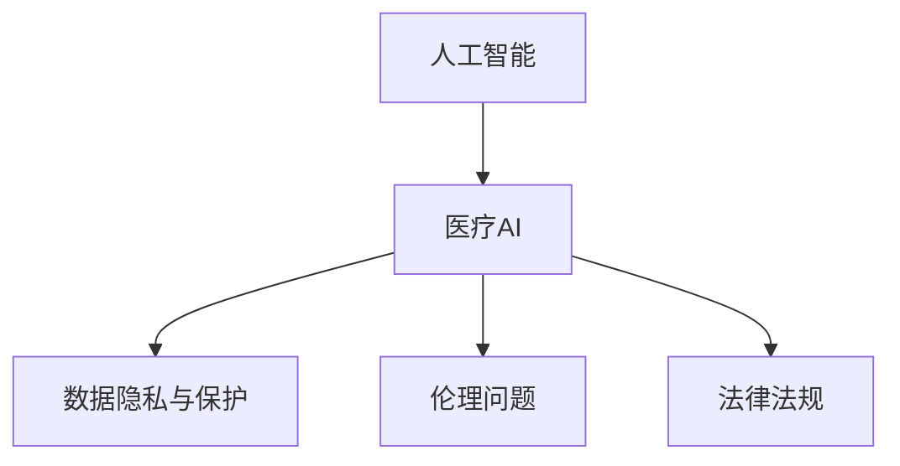

                 

# AI在医疗领域的应用挑战

## 1. 背景介绍

人工智能（AI）技术在医疗领域的应用已经展现出了巨大的潜力，从辅助诊断到个性化治疗，从药物研发到医疗管理，AI正逐步改变着传统的医疗模式。然而，AI在医疗领域的应用也面临着许多挑战，这些挑战不仅涉及到技术层面，还与伦理、法律、社会等多方面因素密切相关。本文将从这些维度出发，全面分析AI在医疗领域的应用挑战，并提出相应的解决策略。

## 2. 核心概念与联系

### 2.1 核心概念概述

- **人工智能（AI）**：通过模拟人类智能过程，使计算机系统能够执行复杂任务的技术。
- **医疗AI**：将AI技术应用于医疗领域，用于辅助医疗决策、优化医疗流程、提高医疗服务质量等。
- **数据隐私与保护**：在医疗AI中，患者数据的隐私和安全保护是至关重要的，需要确保数据在收集、存储、传输和使用过程中的安全。
- **伦理问题**：AI在医疗中的应用涉及一些伦理问题，如决策透明度、公平性、责任归属等。
- **法律法规**：AI在医疗领域的应用受到各国法律法规的约束，需要符合相关的医疗规范和标准。

### 2.2 核心概念原理和架构的 Mermaid 流程图



这个流程图展示了AI与医疗AI之间以及它们与其他关键概念的关系：

1. AI提供技术支持，帮助医疗AI实现智能化。
2. 数据隐私与保护是医疗AI中必须考虑的关键问题。
3. 伦理问题涉及AI在医疗中的决策透明度、公平性等。
4. 法律法规规范了AI在医疗中的应用范围和方式。

## 3. 核心算法原理 & 具体操作步骤

### 3.1 算法原理概述

医疗AI的核心算法包括机器学习、深度学习、自然语言处理（NLP）等。以深度学习为例，医疗AI通常使用卷积神经网络（CNN）、循环神经网络（RNN）、长短期记忆网络（LSTM）等模型进行图像、文本等数据的处理和分析。

### 3.2 算法步骤详解

以医疗图像分析为例，医疗AI的深度学习流程如下：

1. **数据准备**：收集并标注医疗图像数据，包括CT、MRI、X光等。
2. **模型选择**：选择合适的深度学习模型，如CNN、U-Net等。
3. **模型训练**：使用标注好的数据集对模型进行训练，调整超参数。
4. **模型评估**：在独立测试集上评估模型性能，如准确率、召回率等。
5. **模型部署**：将训练好的模型部署到实际医疗系统中，进行图像分析。

### 3.3 算法优缺点

**优点**：
- 能够处理大量的医疗数据，识别和分析复杂的医疗图像。
- 提供辅助诊断，帮助医生做出更准确的决策。
- 可以24小时不间断工作，提高医疗系统的效率。

**缺点**：
- 数据标注成本高，需要大量专业医生参与。
- 模型复杂度大，训练和部署要求高。
- 存在误诊风险，需医生人工审核。

### 3.4 算法应用领域

医疗AI的应用领域广泛，包括但不限于：

- **图像分析**：用于癌症、心脏病等疾病的诊断。
- **自然语言处理**：用于医学文本的自动摘要、疾病预测等。
- **药物研发**：用于分子结构预测、药物筛选等。
- **个性化治疗**：用于基因分析、治疗方案优化等。

## 4. 数学模型和公式 & 详细讲解 & 举例说明

### 4.1 数学模型构建

以医学图像分类为例，模型的输入为医疗图像，输出为图像所属的类别。常见的模型包括CNN、ResNet、VGG等。模型的损失函数通常采用交叉熵损失函数。

### 4.2 公式推导过程

设模型为$M$，输入为$x$，输出为$y$，损失函数为$\mathcal{L}$，则模型的损失函数可以表示为：

$$
\mathcal{L}(M(x), y) = -\sum_i y_i \log M(x_i)
$$

其中，$y_i$为样本的真实标签，$M(x_i)$为模型对样本$x_i$的预测结果。

### 4.3 案例分析与讲解

假设我们有一个包含1000张医疗图像的训练集，每张图像都被标注为癌症（1）或非癌症（0）。我们可以使用CNN模型对这组图像进行训练，训练过程包括：

1. 将图像输入CNN模型，计算预测结果$M(x_i)$。
2. 将真实标签$y_i$与预测结果$M(x_i)$进行比较，计算交叉熵损失$\mathcal{L}(M(x_i), y_i)$。
3. 使用梯度下降等优化算法，最小化损失函数$\mathcal{L}$，更新模型参数。
4. 在独立测试集上评估模型性能。

## 5. 项目实践：代码实例和详细解释说明

### 5.1 开发环境搭建

- **Python环境**：安装Python 3.6及以上版本，并配置好环境依赖。
- **深度学习框架**：安装TensorFlow或PyTorch等深度学习框架。
- **医疗图像数据集**：收集并准备医疗图像数据集，进行标注。

### 5.2 源代码详细实现

以下是使用TensorFlow实现医疗图像分类的代码示例：

```python
import tensorflow as tf
from tensorflow.keras import layers, models

# 构建CNN模型
model = models.Sequential([
    layers.Conv2D(32, (3,3), activation='relu', input_shape=(256,256,3)),
    layers.MaxPooling2D((2,2)),
    layers.Conv2D(64, (3,3), activation='relu'),
    layers.MaxPooling2D((2,2)),
    layers.Conv2D(128, (3,3), activation='relu'),
    layers.MaxPooling2D((2,2)),
    layers.Flatten(),
    layers.Dense(64, activation='relu'),
    layers.Dense(1, activation='sigmoid')
])

# 编译模型
model.compile(optimizer='adam', loss='binary_crossentropy', metrics=['accuracy'])

# 加载数据集
train_dataset = tf.keras.preprocessing.image_dataset_from_directory('train/', label_mode='binary')
test_dataset = tf.keras.preprocessing.image_dataset_from_directory('test/', label_mode='binary')

# 训练模型
model.fit(train_dataset, validation_data=test_dataset, epochs=10)
```

### 5.3 代码解读与分析

- **模型构建**：使用Sequential模型构建CNN，包含卷积层、池化层、全连接层等。
- **数据加载**：使用`image_dataset_from_directory`函数加载训练集和测试集。
- **模型训练**：使用`fit`函数对模型进行训练，指定优化器、损失函数和评估指标。

## 6. 实际应用场景

### 6.1 辅助诊断

AI在辅助诊断中表现出色，可以处理大量的医学图像数据，提供快速、准确的诊断结果。例如，AI在乳腺癌、肺癌等疾病的诊断中，能够识别出早期微小病灶，提高诊断效率和准确率。

### 6.2 个性化治疗

AI可以分析患者的基因组数据，结合医疗历史和当前病情，推荐个性化的治疗方案。例如，AI可以预测某些药物对特定患者的疗效，减少不必要的药物试验和副作用。

### 6.3 药物研发

AI在药物研发中的应用广泛，可以从海量的化合物库中筛选出潜在的药物候选，进行分子结构预测和药物筛选。例如，AI可以快速识别出可能的靶点蛋白，并模拟药物与靶点结合的过程，加速新药研发进程。

### 6.4 未来应用展望

未来，AI在医疗领域的应用将更加广泛和深入。随着深度学习模型的不断发展，AI将能够处理更复杂、更大规模的医疗数据，提供更精确的诊断和治疗方案。此外，AI与其他技术（如物联网、大数据等）的融合，将进一步提升医疗系统的智能化水平。

## 7. 工具和资源推荐

### 7.1 学习资源推荐

- **深度学习框架**：TensorFlow、PyTorch等。
- **医疗AI论文**：Nature、Science、IEEE Transactions on Biomedical Engineering等期刊上的相关论文。
- **在线课程**：Coursera上的《深度学习》课程，Udacity上的《医疗AI》课程等。

### 7.2 开发工具推荐

- **深度学习框架**：TensorFlow、PyTorch等。
- **数据处理工具**：Scikit-learn、Pandas等。
- **可视化工具**：TensorBoard、Kaggle等。

### 7.3 相关论文推荐

- **医学图像分析**：Kaggle上发布的医学图像分类比赛数据集及相关论文。
- **个性化治疗**：Liang L. et al. 《Deep learning for precision medicine》
- **药物研发**：Rasul S. et al. 《Deep learning in drug discovery》

## 8. 总结：未来发展趋势与挑战

### 8.1 研究成果总结

- **技术突破**：深度学习模型的不断发展，使得AI在医疗领域的应用更加高效和准确。
- **数据管理**：随着医疗数据的积累，如何高效管理和利用这些数据，成为了一个重要的研究方向。

### 8.2 未来发展趋势

- **智能诊断系统**：AI将能够进行更复杂的诊断和治疗方案制定。
- **跨模态融合**：AI将能够处理多模态数据，如医学图像、文本、基因组数据等。
- **个性化医疗**：AI将能够为每个患者提供个性化的治疗方案，提升医疗服务的质量。

### 8.3 面临的挑战

- **数据隐私**：如何保护患者数据的隐私，防止数据泄露和滥用。
- **算法透明度**：如何提高AI算法的透明度，使其决策过程更加可解释和可信。
- **法规合规**：如何符合各国的医疗法规，确保AI在医疗领域的安全和可靠性。

### 8.4 研究展望

- **数据隐私保护**：发展更加安全的医疗数据管理技术，如数据加密、差分隐私等。
- **算法透明性**：开发可解释的AI模型，提升决策的可信度。
- **法规适应性**：制定适应不同国家医疗法规的AI应用标准和指南。

## 9. 附录：常见问题与解答

**Q1: 如何确保AI在医疗领域的安全性和可靠性？**

A: 确保AI在医疗领域的安全性和可靠性，需要从以下几个方面入手：

1. **数据质量**：确保数据的质量和完整性，避免数据噪声对模型训练的影响。
2. **算法透明性**：开发可解释的AI模型，提升决策的可信度。
3. **法规合规**：确保AI应用符合各国的医疗法规，避免法律风险。
4. **伦理审查**：进行伦理审查，确保AI应用不会对患者造成伤害。

**Q2: 如何处理医疗数据隐私问题？**

A: 处理医疗数据隐私问题，可以采取以下措施：

1. **数据加密**：对医疗数据进行加密，防止数据泄露。
2. **差分隐私**：在数据分析过程中，加入噪声，保护个人隐私。
3. **数据脱敏**：对数据进行匿名化处理，去除个人标识信息。

**Q3: 如何提升AI在医疗领域的算法透明度？**

A: 提升AI在医疗领域的算法透明度，可以采取以下措施：

1. **可解释性模型**：开发可解释性强的AI模型，如LIME、SHAP等。
2. **特征解释**：提供特征重要性解释，帮助医生理解模型决策过程。
3. **透明度报告**：定期发布AI算法的透明度报告，公开算法决策依据。

**Q4: 如何应对AI在医疗领域的法规挑战？**

A: 应对AI在医疗领域的法规挑战，可以采取以下措施：

1. **法规合规性审核**：进行法规合规性审核，确保AI应用符合各国的医疗法规。
2. **伦理审查**：进行伦理审查，确保AI应用不会对患者造成伤害。
3. **法规更新**：密切关注法规更新，及时调整AI应用策略。

---

作者：禅与计算机程序设计艺术 / Zen and the Art of Computer Programming

