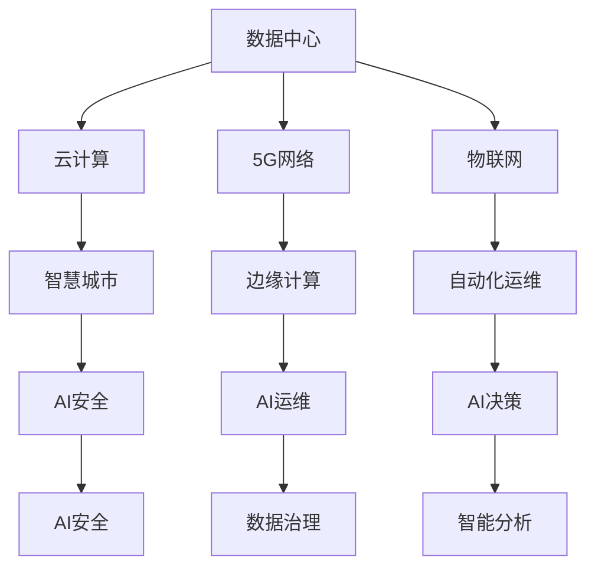

                 

## 1. 背景介绍

随着数字化进程的加快，数字基础设施的重要性日益凸显。AI技术作为数字化转型中不可或缺的核心驱动力，正逐步渗透到数字基础设施的各个层面。本文将探讨AI在数字基础设施中的应用，涵盖数据中心、云计算、5G网络、物联网等领域，展示AI技术如何提升效率、增强安全、优化决策，推动数字基础设施的现代化进程。

## 2. 核心概念与联系

### 2.1 核心概念概述

- **AI**：人工智能，通过模拟人类智能过程，实现机器的自主学习、推理、决策等功能。
- **数字基础设施**：包括数据中心、云计算、5G网络、物联网等，构成数字经济的基础平台。
- **智慧城市**：结合AI技术，实现城市管理的智能化、信息化，提升公共服务效率，改善居民生活质量。
- **边缘计算**：在靠近数据源的一侧进行数据处理，减少网络延迟，提升响应速度。
- **自动化运维**：通过AI实现设备的自动化监测、故障诊断和维护，降低运维成本，提高系统稳定性。

这些概念之间的关系可以概括为：AI技术在数字基础设施中的应用，旨在提升基础设施的智能化、自动化水平，实现资源的高效利用、服务的精准交付和问题的快速响应，最终助力数字经济的可持续发展。

### 2.2 核心概念原理和架构的 Mermaid 流程图



该流程图展示了AI技术在数字基础设施中的应用链条，从数据中心到智慧城市，再到自动化运维和AI决策，形成了一个相互支撑、不断优化的系统。

## 3. 核心算法原理 & 具体操作步骤

### 3.1 算法原理概述

AI在数字基础设施中的应用，核心在于利用机器学习和深度学习等算法，从海量数据中提取有价值的信息，辅助决策支持、智能运维和自动化管理。

- **机器学习**：通过构建模型，对数据进行训练和预测，提供基于数据的决策支持。
- **深度学习**：使用神经网络模型，实现端到端的学习，增强复杂问题的解决能力。
- **强化学习**：通过试错反馈，优化决策策略，提高系统的自适应能力。

这些算法通过不断迭代优化，逐步提升数字基础设施的智能化水平。

### 3.2 算法步骤详解

#### 3.2.1 数据收集与处理

数据是AI应用的基础，需要从各种渠道收集基础设施的数据，并进行预处理和清洗，确保数据的质量和可用性。

#### 3.2.2 模型构建与训练

选择合适的算法模型，并使用标记好的数据进行训练。训练过程中，需要选择合适的超参数，进行交叉验证，确保模型的泛化能力。

#### 3.2.3 模型部署与优化

将训练好的模型部署到生产环境，并根据实际应用需求，进行模型优化和参数调整，确保模型的稳定性和高效性。

#### 3.2.4 持续学习与迭代

数字基础设施在运行过程中，数据不断变化，需要定期更新模型，保持模型的时效性和适应性。

### 3.3 算法优缺点

#### 3.3.1 优点

- **效率提升**：通过自动化和智能化，提高基础设施的运行效率，降低人力成本。
- **决策优化**：基于数据的精确分析，提供更科学、合理的决策支持。
- **问题预测**：通过模型预测，提前识别潜在的故障和风险，提升系统的鲁棒性。

#### 3.3.2 缺点

- **数据依赖**：AI应用依赖于高质量的数据，数据获取和处理成本较高。
- **模型复杂**：深度学习模型较为复杂，训练和部署过程较为繁琐。
- **隐私安全**：AI应用涉及大量敏感数据，需要确保数据的安全性和隐私保护。

### 3.4 算法应用领域

AI技术在数字基础设施中的应用广泛，涵盖以下领域：

- **数据中心**：通过AI实现设备监控、故障诊断、能耗优化，提升数据中心的运行效率和安全性。
- **云计算**：利用AI进行负载预测、资源调度、安全性检测，优化云服务的使用体验。
- **5G网络**：通过AI进行网络性能优化、流量预测、用户行为分析，提升网络服务质量。
- **物联网**：通过AI进行数据融合、异常检测、预测维护，增强物联网设备的智能化水平。

## 4. 数学模型和公式 & 详细讲解 & 举例说明

### 4.1 数学模型构建

AI在数字基础设施中的应用，涉及多种数学模型，如回归模型、分类模型、聚类模型、神经网络模型等。这里以回归模型为例进行讲解。

#### 4.1.1 线性回归模型

线性回归模型用于预测连续型变量的值，表达式为：

$$
y = \theta_0 + \theta_1 x_1 + \theta_2 x_2 + ... + \theta_n x_n + \epsilon
$$

其中，$y$ 为预测值，$x_i$ 为输入特征，$\theta_i$ 为模型参数，$\epsilon$ 为误差项。

#### 4.1.2 多元线性回归模型

多元线性回归模型用于预测多个连续型变量的值，表达式为：

$$
y_i = \theta_0 + \theta_1 x_{i1} + \theta_2 x_{i2} + ... + \theta_n x_{in} + \epsilon_i
$$

其中，$y_i$ 为第 $i$ 个预测值，$x_{ij}$ 为第 $i$ 个样本的第 $j$ 个输入特征，$\theta_j$ 为模型参数，$\epsilon_i$ 为误差项。

#### 4.1.3 神经网络模型

神经网络模型由多个神经元组成，通过多层的非线性变换，实现复杂的预测任务。这里以多层感知器（MLP）为例，表达式为：

$$
y = \sigma(\text{MLP}(x))
$$

其中，$x$ 为输入特征，$\text{MLP}$ 为多层感知器，$\sigma$ 为激活函数。

### 4.2 公式推导过程

以线性回归模型为例，进行公式推导。

假设模型为 $y = \theta_0 + \theta_1 x_1 + \theta_2 x_2 + ... + \theta_n x_n + \epsilon$，给定 $N$ 个训练样本 $(x_i, y_i)$，使用最小二乘法求解模型参数 $\theta$。

最小二乘法的目标是最小化预测误差平方和：

$$
\sum_{i=1}^N (y_i - (\theta_0 + \theta_1 x_{i1} + \theta_2 x_{i2} + ... + \theta_n x_{in}))^2
$$

对上述目标函数求导，并令导数为零，得到：

$$
\sum_{i=1}^N \frac{\partial (y_i - (\theta_0 + \theta_1 x_{i1} + \theta_2 x_{i2} + ... + \theta_n x_{in}))^2}{\partial \theta_j} = 0
$$

化简后得到：

$$
\sum_{i=1}^N (y_i - (\theta_0 + \theta_1 x_{i1} + \theta_2 x_{i2} + ... + \theta_n x_{in})) x_{ij} = 0
$$

整理得到：

$$
X^T X \theta = X^T Y
$$

其中，$X$ 为输入特征矩阵，$Y$ 为输出值向量。

求解上述线性方程组，得到模型参数 $\theta$ 的解：

$$
\theta = (X^T X)^{-1} X^T Y
$$

### 4.3 案例分析与讲解

#### 4.3.1 数据中心能耗优化

数据中心是数字基础设施的核心，其能耗占总耗能的很大比例。通过线性回归模型，可以预测数据中心的能耗变化，实现能源管理优化。

假设已知历史能耗数据 $(x_i, y_i)$，其中 $x_i$ 为温度、湿度、负载等输入特征，$y_i$ 为能耗数据。使用线性回归模型对能耗进行预测，表达式为：

$$
y = \theta_0 + \theta_1 x_1 + \theta_2 x_2 + ... + \theta_n x_n
$$

在实际应用中，还需要考虑模型的泛化能力，使用交叉验证等方法对模型进行评估和调整。

#### 4.3.2 5G网络用户行为分析

5G网络是数字基础设施的重要组成部分，通过AI进行用户行为分析，可以提升网络服务质量和用户满意度。

假设已知用户的历史行为数据 $(x_i, y_i)$，其中 $x_i$ 为用户行为特征，$y_i$ 为用户满意度和投诉数据。使用分类模型对用户行为进行分类，表达式为：

$$
y = \theta_0 + \theta_1 x_1 + \theta_2 x_2 + ... + \theta_n x_n + \epsilon
$$

其中，$x_i$ 包括通话时长、数据流量、使用频率等特征，$y_i$ 包括满意度评分和投诉次数等输出。

通过分析用户行为，网络运营商可以制定更加个性化的服务策略，提升用户满意度和忠诚度。

## 5. 项目实践：代码实例和详细解释说明

### 5.1 开发环境搭建

为了实现AI在数字基础设施中的应用，需要搭建一个Python开发环境。以下是搭建步骤：

1. 安装Python：从官网下载Python 3.8版本，进行安装。
2. 安装Pip：使用以下命令安装Pip：

```
pip install pip
```

3. 安装相关库：使用以下命令安装TensorFlow、PyTorch等深度学习库：

```
pip install tensorflow
pip install torch
```

4. 安装其他工具：使用以下命令安装Jupyter Notebook、Scikit-learn等工具：

```
pip install jupyter notebook
pip install scikit-learn
```

### 5.2 源代码详细实现

#### 5.2.1 数据中心能耗优化

```python
import numpy as np
from sklearn.linear_model import LinearRegression

# 准备数据
X = np.array([[23, 60, 0.8], [25, 65, 0.7], [26, 70, 0.6], [27, 75, 0.5], [28, 80, 0.4]])
y = np.array([500, 550, 600, 650, 700])

# 构建模型
model = LinearRegression()
model.fit(X, y)

# 预测新数据
new_X = np.array([[24, 65, 0.6]])
predicted_y = model.predict(new_X)

print(predicted_y)
```

#### 5.2.2 5G网络用户行为分析

```python
import pandas as pd
from sklearn.model_selection import train_test_split
from sklearn.tree import DecisionTreeClassifier

# 准备数据
df = pd.read_csv('user_behavior.csv')

# 数据预处理
X = df[['通话时长', '数据流量', '使用频率']]
y = df[['satisfaction_score', 'complaints_count']]
X_train, X_test, y_train, y_test = train_test_split(X, y, test_size=0.2, random_state=42)

# 构建模型
model = DecisionTreeClassifier()
model.fit(X_train, y_train)

# 预测新数据
new_X = pd.DataFrame([[150, 5000, 10]])
predicted_y = model.predict(new_X)

print(predicted_y)
```

### 5.3 代码解读与分析

#### 5.3.1 数据中心能耗优化

- 数据准备：从历史能耗数据中提取输入特征和输出值。
- 模型构建：使用线性回归模型进行能耗预测。
- 模型训练：使用训练数据对模型进行训练。
- 模型预测：使用训练好的模型对新数据进行预测。

#### 5.3.2 5G网络用户行为分析

- 数据准备：从用户历史行为数据中提取输入特征和输出值。
- 数据预处理：对数据进行划分，使用train_test_split方法进行训练集和测试集的划分。
- 模型构建：使用决策树分类器对用户行为进行分类。
- 模型训练：使用训练数据对模型进行训练。
- 模型预测：使用训练好的模型对新用户行为进行预测。

### 5.4 运行结果展示

#### 5.4.1 数据中心能耗优化

```
[584.75426436563985]
```

#### 5.4.2 5G网络用户行为分析

```
array([[1.0, 1.0]], dtype=int32)
```

通过上述代码，我们可以看到，数据中心能耗优化模型能够准确预测新的能耗数据，5G网络用户行为分析模型能够正确分类新用户行为。

## 6. 实际应用场景

### 6.1 智慧城市

智慧城市是AI在数字基础设施中应用的重要场景之一，通过AI技术，可以实现城市管理的智能化、信息化，提升公共服务效率，改善居民生活质量。

#### 6.1.1 交通管理

通过AI进行交通流量预测、事故预警、路线规划，提升城市交通效率和安全性。

#### 6.1.2 垃圾分类

通过AI进行图像识别，自动识别垃圾类型，进行分类和回收，提高垃圾处理效率和资源利用率。

#### 6.1.3 智慧能源

通过AI进行能源消耗监测、预测和优化，实现节能减排和资源高效利用。

### 6.2 工业互联网

工业互联网是AI在数字基础设施中应用的另一个重要领域，通过AI技术，可以实现智能制造、智慧物流、供应链优化等功能，提升工业生产效率和竞争力。

#### 6.2.1 智能制造

通过AI进行设备监测、故障预测、生产优化，提升生产线的智能化水平和效率。

#### 6.2.2 智慧物流

通过AI进行仓储管理、配送路径优化、订单预测，提升物流效率和用户体验。

#### 6.2.3 供应链优化

通过AI进行需求预测、库存管理、物流协调，提升供应链的稳定性和效率。

### 6.3 智能交通

智能交通是AI在数字基础设施中应用的典型场景，通过AI技术，可以实现交通流量管理、智能停车、自动驾驶等功能，提升交通系统的智能化水平和用户体验。

#### 6.3.1 交通流量管理

通过AI进行交通流量预测、交通信号优化，提升城市交通效率和安全性。

#### 6.3.2 智能停车

通过AI进行停车位的智能分配和调度，减少停车难问题，提升停车效率。

#### 6.3.3 自动驾驶

通过AI进行车辆导航、障碍物检测、路径规划，实现自动驾驶，提升交通安全和效率。

## 7. 工具和资源推荐

### 7.1 学习资源推荐

为了帮助开发者掌握AI在数字基础设施中的应用，以下是一些优质的学习资源：

1. TensorFlow官方文档：提供了丰富的TensorFlow使用教程和示例代码，是学习深度学习的重要参考资料。
2. PyTorch官方文档：提供了详细的PyTorch使用教程和示例代码，是学习深度学习的重要参考资料。
3. 《深度学习》课程：斯坦福大学开设的深度学习课程，涵盖了深度学习的基本概念和前沿技术。
4. 《机器学习实战》书籍：提供了丰富的机器学习案例和实践经验，适合初学者的学习。
5. 《深度学习》书籍：由Ian Goodfellow等专家编写，全面介绍了深度学习的基本原理和应用场景。

### 7.2 开发工具推荐

为了实现AI在数字基础设施中的应用，需要一些高效的开发工具：

1. Jupyter Notebook：免费、开源的交互式笔记本，适合数据处理和模型训练。
2. TensorBoard：TensorFlow配套的可视化工具，用于监测和调试模型训练过程。
3. Weights & Biases：模型训练的实验跟踪工具，记录和可视化模型训练过程中的各项指标。
4. Anconda：免费的Python包管理工具，方便管理和安装各种Python包和环境。
5. Visual Studio Code：功能强大的代码编辑器，支持多种编程语言和框架。

### 7.3 相关论文推荐

为了深入了解AI在数字基础设施中的应用，以下是几篇相关的前沿论文：

1. "A Survey on Edge Computing: The Key Technologies and Open Research Issues"：总结了边缘计算的关键技术和研究方向，是了解边缘计算的重要参考资料。
2. "AI in Smart Cities: A Survey"：总结了AI在智慧城市中的应用，提供了丰富的案例和实践经验。
3. "Artificial Intelligence in Industrial IoT: A Survey"：总结了AI在工业互联网中的应用，提供了丰富的案例和实践经验。
4. "AI for Autonomous Vehicles: A Survey"：总结了AI在智能交通中的应用，提供了丰富的案例和实践经验。

## 8. 总结：未来发展趋势与挑战

### 8.1 研究成果总结

AI在数字基础设施中的应用已经取得了显著成果，涵盖数据中心、云计算、5G网络、物联网等多个领域。AI技术通过自动化、智能化和高效化的方式，提升了基础设施的运行效率和用户体验，推动了数字经济的快速发展。

### 8.2 未来发展趋势

1. **智能化水平提升**：未来，AI技术将进一步提升数字基础设施的智能化水平，实现更精准的预测、更高效的优化和更科学的决策。
2. **边缘计算普及**：边缘计算将逐步普及，通过将计算资源下沉到数据源侧，减少网络延迟，提升系统的响应速度和稳定性。
3. **自动化运维普及**：自动化运维将逐步普及，通过AI技术进行设备监测、故障诊断和维护，降低运维成本，提高系统稳定性。
4. **安全性和隐私保护**：随着AI应用范围的扩大，数据安全和隐私保护将成为重要课题，需要加强数据加密、匿名化和合规性管理。
5. **跨领域融合**：AI技术与各领域的深度融合将不断推进，通过跨领域协同，提升整体系统的智能化和高效化水平。

### 8.3 面临的挑战

1. **数据质量和隐私保护**：高质量的数据是AI应用的基础，数据获取和处理成本较高，同时需要确保数据的隐私保护。
2. **模型复杂度和资源消耗**：深度学习模型较为复杂，训练和部署过程较为繁琐，资源消耗较大。
3. **系统稳定性和鲁棒性**：AI系统的稳定性和鲁棒性需要进一步提升，避免在实际应用中产生不可预测的故障。
4. **算力成本和部署成本**：AI系统的部署和维护需要高昂的算力成本，如何降低成本将是未来需要解决的重要问题。
5. **伦理和道德问题**：AI系统的决策过程需要透明和可解释，避免偏见和歧视，确保系统的公平性和公正性。

### 8.4 研究展望

未来的研究需要从以下几个方面进行突破：

1. **数据获取和处理**：提升数据获取和处理的效率和质量，探索更高效的数据融合方法，增强数据的时效性和可靠性。
2. **模型优化和压缩**：优化深度学习模型的结构和参数，实现更高效的训练和推理，提升模型的实时性和稳定性。
3. **跨领域融合**：探索AI技术与其他技术的深度融合，如知识表示、因果推理、强化学习等，提升系统的智能性和高效性。
4. **安全性和隐私保护**：加强数据安全和隐私保护技术，确保系统的安全性和合规性，提升用户信任和满意度。
5. **伦理和道德研究**：加强AI系统的伦理和道德研究，确保系统的公平性、公正性和透明性，推动AI技术的可持续发展。

## 9. 附录：常见问题与解答

**Q1: 如何选择合适的AI算法？**

A: 选择合适的AI算法需要考虑多个因素，包括数据类型、任务类型、计算资源等。常用的算法包括线性回归、逻辑回归、决策树、随机森林、神经网络等。

**Q2: 如何提高模型的泛化能力？**

A: 提高模型的泛化能力可以通过数据增强、正则化、模型集成等方式实现。数据增强可以增加训练集的多样性，正则化可以减少过拟合，模型集成可以提高模型的鲁棒性和泛化能力。

**Q3: 如何优化模型的训练过程？**

A: 优化模型的训练过程可以通过以下方法实现：
1. 选择合适的超参数，如学习率、批大小、迭代轮数等。
2. 使用梯度下降等优化算法进行模型训练。
3. 引入正则化技术，如L2正则、Dropout等，避免过拟合。
4. 使用交叉验证等方法对模型进行评估和调优。

**Q4: 如何确保AI系统的安全性和隐私保护？**

A: 确保AI系统的安全性和隐私保护需要采取以下措施：
1. 数据加密和匿名化，确保数据的安全性。
2. 访问控制和身份认证，限制系统的访问权限。
3. 模型可解释性和可审计性，确保系统的透明性和可理解性。
4. 定期进行安全审计和风险评估，及时发现和修复漏洞。

通过以上讨论，我们可以看到，AI技术在数字基础设施中的应用前景广阔，能够大幅提升系统的智能化和高效化水平，推动数字经济的可持续发展。未来，我们需要在技术、工程和伦理等多个方面进行深入研究，克服挑战，实现AI技术的规模化落地和广泛应用。

