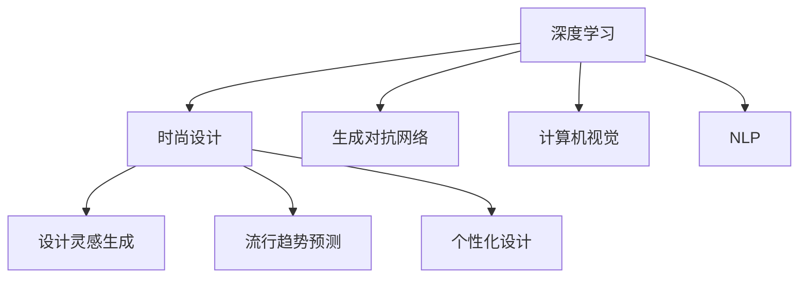

                 

## 1. 背景介绍

### 1.1 问题由来

时尚设计领域是一个高度依赖创意和感知的行业，传统的设计过程往往依赖于设计师的经验和直觉。然而，随着人工智能(AI)技术的不断进步，AI已经在时尚设计中扮演了越来越重要的角色。AI可以帮助设计师快速生成设计灵感、预测流行趋势、个性化定制等，极大地提高了设计效率和质量。

### 1.2 问题核心关键点

AI在时尚设计中的应用主要集中在以下三个方面：

1. **设计灵感生成**：通过分析海量时尚数据，AI能够生成符合时尚趋势的新设计，为设计师提供创意灵感。
2. **流行趋势预测**：利用机器学习模型，AI可以预测未来流行趋势，帮助设计师把握市场动向。
3. **个性化设计**：通过分析用户数据，AI能够生成个性化的设计方案，满足用户的个性化需求。

这些核心关键点揭示了AI在时尚设计中的应用潜力，以及其在提升设计效率、预测趋势和个性化服务方面的巨大价值。

## 2. 核心概念与联系

### 2.1 核心概念概述

为更好地理解AI在时尚设计中的应用，本节将介绍几个密切相关的核心概念：

- **AI在时尚设计中的应用**：指利用AI技术辅助时尚设计，包括创意生成、趋势预测、个性化定制等。
- **深度学习**：一种基于人工神经网络的机器学习方法，擅长处理复杂的非线性关系，常用于图像、文本等数据的分析和生成。
- **生成对抗网络(GAN)**：一种深度学习模型，由生成器和判别器组成，用于生成与真实数据难以区分的新数据。
- **计算机视觉**：利用计算机技术对图像、视频等视觉信息进行处理和分析，常用于图像识别、风格迁移等。
- **自然语言处理(NLP)**：一种AI技术，用于处理和理解人类语言，常用于情感分析、文本生成等。

这些核心概念之间的逻辑关系可以通过以下Mermaid流程图来展示：



这个流程图展示了大语言模型在时尚设计中的核心概念及其之间的关系：

1. 深度学习为时尚设计提供了强大的数据处理和生成能力。
2. 生成对抗网络可以用于生成与真实数据难以区分的新设计，提升设计的创意性。
3. 计算机视觉技术可以帮助分析图像数据，提供视觉设计灵感。
4. 自然语言处理技术可以从文本数据中提取设计灵感，提升设计的表达力。
5. 设计灵感生成、流行趋势预测和个性化设计是时尚设计的三大应用场景，通过深度学习、生成对抗网络、计算机视觉和自然语言处理等技术，可以为设计师提供全面的辅助支持。

## 3. 核心算法原理 & 具体操作步骤
### 3.1 算法原理概述

AI在时尚设计中的应用，核心算法原理包括以下几个方面：

- **深度学习模型**：通过深度学习模型，AI可以从大量的时尚数据中学习到复杂的非线性关系，生成符合时尚趋势的新设计。
- **生成对抗网络**：生成对抗网络可以通过对抗训练的方式，生成与真实设计难以区分的新设计，提升设计的创意性和多样性。
- **计算机视觉技术**：计算机视觉技术可以对图像数据进行特征提取和分析，提供视觉设计灵感。
- **自然语言处理技术**：自然语言处理技术可以从文本数据中提取设计灵感，提升设计的表达力和创新性。

这些算法原理为AI在时尚设计中的应用提供了坚实的技术基础。

### 3.2 算法步骤详解

以生成对抗网络(GAN)在时尚设计中的应用为例，算法步骤详解如下：

1. **数据准备**：收集大量的时尚设计图片和描述信息，将其作为训练数据。
2. **模型构建**：构建生成器和判别器，生成器和判别器都采用卷积神经网络(CNN)结构，生成器用于生成新设计，判别器用于区分真实设计和生成设计。
3. **模型训练**：使用反向传播算法优化生成器和判别器的参数，使得生成器生成的设计尽可能逼近真实设计，而判别器尽可能准确区分真实设计和生成设计。
4. **设计生成**：训练好的生成器可以用于生成新的时尚设计，供设计师参考和灵感启发。

### 3.3 算法优缺点

生成对抗网络在时尚设计中的应用，具有以下优点：

- **创意性**：生成器可以生成与真实设计难以区分的新设计，提升设计的创意性和多样性。
- **高效率**：生成对抗网络可以快速生成大量设计，大幅提高设计效率。
- **可扩展性**：通过增加数据量和模型复杂度，可以生成更复杂、更丰富的设计。

同时，生成对抗网络也存在以下缺点：

- **训练复杂性**：生成对抗网络需要大量的计算资源和训练时间，训练过程较为复杂。
- **结果可控性差**：生成器生成的设计可能存在一定的随机性和不确定性，难以完全控制。
- **模型依赖性**：生成对抗网络的性能依赖于训练数据的数量和质量，需要大量高质量的时尚数据。

### 3.4 算法应用领域

生成对抗网络在时尚设计中的应用领域包括：

- **时尚设计灵感生成**：通过生成对抗网络生成新的设计灵感，为设计师提供创意支持。
- **时尚趋势预测**：利用生成对抗网络预测未来的时尚趋势，帮助设计师把握市场动向。
- **个性化时尚定制**：通过生成对抗网络生成个性化的设计方案，满足用户的个性化需求。

## 4. 数学模型和公式 & 详细讲解 & 举例说明

### 4.1 数学模型构建

生成对抗网络主要由生成器和判别器组成，数学模型构建如下：

- **生成器模型**：将噪声向量 $\mathbf{z}$ 映射为时尚设计图像 $x$，模型为 $G: \mathcal{Z} \rightarrow \mathcal{X}$，其中 $\mathcal{Z}$ 为噪声空间，$\mathcal{X}$ 为图像空间。
- **判别器模型**：将时尚设计图像 $x$ 映射为真实性标签 $y$，模型为 $D: \mathcal{X} \rightarrow [0,1]$。

生成器和判别器的损失函数分别为：

- **生成器损失**：$L_G = E_{z \sim p_z} [D(G(z))]$
- **判别器损失**：$L_D = E_{x \sim p_x} [\log D(x)] + E_{z \sim p_z} [\log (1-D(G(z)))]$

其中，$p_z$ 和 $p_x$ 分别为噪声向量和真实图像的分布。

### 4.2 公式推导过程

生成对抗网络的训练过程可以概括为以下步骤：

1. **固定判别器，优化生成器**：固定判别器的参数，只优化生成器的参数，使得生成器生成的设计尽可能逼近真实设计。
2. **固定生成器，优化判别器**：固定生成器的参数，只优化判别器的参数，使得判别器能够准确区分真实设计和生成设计。
3. **交替训练**：交替优化生成器和判别器，直到两者都达到最优状态。

### 4.3 案例分析与讲解

以生成对抗网络在时尚设计中的应用为例，我们可以从以下几个案例进行分析：

1. **时尚设计灵感生成**：
   - **数据准备**：收集大量的时尚设计图片和描述信息，将其作为训练数据。
   - **模型构建**：构建生成器和判别器，使用卷积神经网络结构。
   - **模型训练**：使用反向传播算法优化生成器和判别器的参数，使得生成器生成的设计尽可能逼近真实设计，而判别器尽可能准确区分真实设计和生成设计。
   - **设计生成**：训练好的生成器可以用于生成新的时尚设计，供设计师参考和灵感启发。

2. **时尚趋势预测**：
   - **数据准备**：收集近几年的时尚趋势数据，将其作为训练数据。
   - **模型构建**：构建生成器和判别器，使用卷积神经网络结构。
   - **模型训练**：使用反向传播算法优化生成器和判别器的参数，使得生成器生成的设计尽可能逼近未来趋势，而判别器尽可能准确区分真实设计和生成设计。
   - **趋势预测**：训练好的生成器可以用于生成未来时尚趋势，供设计师把握市场动向。

## 5. 项目实践：代码实例和详细解释说明
### 5.1 开发环境搭建

在进行时尚设计应用开发前，我们需要准备好开发环境。以下是使用Python进行TensorFlow开发的环境配置流程：

1. 安装Anaconda：从官网下载并安装Anaconda，用于创建独立的Python环境。
2. 创建并激活虚拟环境：
```bash
conda create -n tf-env python=3.8 
conda activate tf-env
```
3. 安装TensorFlow：根据CUDA版本，从官网获取对应的安装命令。例如：
```bash
conda install tensorflow tensorflow-gpu -c tf -c conda-forge
```
4. 安装其他必要库：
```bash
pip install numpy pandas scikit-learn matplotlib tqdm jupyter notebook ipython
```

完成上述步骤后，即可在`tf-env`环境中开始时尚设计应用的开发。

### 5.2 源代码详细实现

下面以生成对抗网络在时尚设计中的应用为例，给出使用TensorFlow进行代码实现。

首先，定义生成器和判别器的模型：

```python
import tensorflow as tf

def make_generator_model():
    model = tf.keras.Sequential()
    model.add(tf.keras.layers.Dense(256, use_bias=False, input_shape=(100,)))
    model.add(tf.keras.layers.BatchNormalization())
    model.add(tf.keras.layers.LeakyReLU(alpha=0.2))
    model.add(tf.keras.layers.Reshape((8, 8, 256)))
    model.add(tf.keras.layers.Conv2DTranspose(128, (5, 5), strides=(1, 1), padding='same', use_bias=False))
    model.add(tf.keras.layers.BatchNormalization())
    model.add(tf.keras.layers.LeakyReLU(alpha=0.2))
    model.add(tf.keras.layers.Conv2DTranspose(64, (5, 5), strides=(2, 2), padding='same', use_bias=False))
    model.add(tf.keras.layers.BatchNormalization())
    model.add(tf.keras.layers.LeakyReLU(alpha=0.2))
    model.add(tf.keras.layers.Conv2DTranspose(1, (5, 5), strides=(2, 2), padding='same', use_bias=False, activation='tanh'))
    return model

def make_discriminator_model():
    model = tf.keras.Sequential()
    model.add(tf.keras.layers.Conv2D(64, (5, 5), strides=(2, 2), padding='same', input_shape=[28, 28, 1]))
    model.add(tf.keras.layers.LeakyReLU(alpha=0.2))
    model.add(tf.keras.layers.Dropout(0.3))
    model.add(tf.keras.layers.Conv2D(128, (5, 5), strides=(2, 2), padding='same'))
    model.add(tf.keras.layers.LeakyReLU(alpha=0.2))
    model.add(tf.keras.layers.Dropout(0.3))
    model.add(tf.keras.layers.Flatten())
    model.add(tf.keras.layers.Dense(1, activation='sigmoid'))
    return model
```

然后，定义损失函数和优化器：

```python
cross_entropy = tf.keras.losses.BinaryCrossentropy(from_logits=True)
generator_optimizer = tf.keras.optimizers.Adam(1e-4)
discriminator_optimizer = tf.keras.optimizers.Adam(1e-4)

@tf.function
def train_step(images):
    noise = tf.random.normal([BATCH_SIZE, 100])

    with tf.GradientTape() as gen_tape, tf.GradientTape() as disc_tape:
        generated_images = generator(noise, training=True)

        real_output = discriminator(images, training=True)
        fake_output = discriminator(generated_images, training=True)

        gen_loss = cross_entropy(tf.ones_like(fake_output), fake_output)
        disc_loss = cross_entropy(tf.ones_like(real_output), real_output) + cross_entropy(tf.zeros_like(fake_output), fake_output)

    gradients_of_generator = gen_tape.gradient(gen_loss, generator.trainable_variables)
    gradients_of_discriminator = disc_tape.gradient(disc_loss, discriminator.trainable_variables)

    generator_optimizer.apply_gradients(zip(gradients_of_generator, generator.trainable_variables))
    discriminator_optimizer.apply_gradients(zip(gradients_of_discriminator, discriminator.trainable_variables))
```

最后，启动训练流程并在测试集上评估：

```python
BATCH_SIZE = 32
EPOCHS = 200

for epoch in range(EPOCHS):
    for image_batch in train_dataset:
        train_step(image_batch)
    
    print(f"Epoch {epoch+1}")
```

以上就是使用TensorFlow对生成对抗网络进行时尚设计应用开发的完整代码实现。可以看到，TensorFlow提供了强大的深度学习框架，使得时尚设计应用的开发变得简洁高效。

### 5.3 代码解读与分析

让我们再详细解读一下关键代码的实现细节：

**make_generator_model和make_discriminator_model函数**：
- `make_generator_model`函数定义生成器的网络结构，包括若干个卷积、归一化、激活等层。
- `make_discriminator_model`函数定义判别器的网络结构，包括若干个卷积、归一化、激活等层。

**train_step函数**：
- 从噪声空间生成随机向量 `noise`。
- 将随机向量输入生成器，生成时尚设计图片 `generated_images`。
- 将真实图片和生成图片输入判别器，分别输出 `real_output` 和 `fake_output`。
- 计算生成器和判别器的损失函数 `gen_loss` 和 `disc_loss`。
- 使用梯度下降算法优化生成器和判别器的参数，分别更新 `generator_optimizer` 和 `discriminator_optimizer`。

**BATCH_SIZE和EPOCHS变量**：
- `BATCH_SIZE` 为批次大小，决定了每个批次中样本的数量。
- `EPOCHS` 为训练轮数，决定了训练的总次数。

**for循环**：
- 遍历训练集 `train_dataset`，在每个epoch内对每个批次进行训练。
- 在训练过程中，通过 `train_step` 函数更新生成器和判别器的参数，直到达到预设的轮数。

可以看到，TensorFlow通过自动微分和优化器等功能，极大简化了时尚设计应用的开发。开发者可以将更多精力放在数据处理、模型改进等高层逻辑上，而不必过多关注底层的实现细节。

当然，工业级的系统实现还需考虑更多因素，如模型的保存和部署、超参数的自动搜索、更灵活的任务适配层等。但核心的生成对抗网络范式基本与此类似。

## 6. 实际应用场景
### 6.1 智能服装推荐系统

智能服装推荐系统是一种典型的时尚设计应用场景。传统的服装推荐系统主要依赖用户的历史行为数据，难以把握用户的真实需求和偏好。基于生成对抗网络的时尚设计应用，可以结合用户的身体特征、风格偏好等数据，生成个性化的服装推荐方案。

在技术实现上，可以收集用户的历史浏览、购买、评价数据，提取用户的身体特征、颜色偏好等，将其作为输入数据。通过生成对抗网络生成个性化的服装设计，并进行评分、排序等处理，生成最终的推荐结果。

### 6.2 时尚趋势预测系统

时尚趋势预测系统是时尚设计应用的另一重要场景。利用生成对抗网络，可以预测未来几年的时尚趋势，帮助时尚品牌和设计师把握市场动向。

在实现上，可以收集近几年时尚趋势数据，包括服装款式、颜色、材质等，将其作为训练数据。通过生成对抗网络生成未来几年的时尚趋势，并结合市场调研数据、专家意见等进行验证和调整，得到最终的预测结果。

### 6.3 个性化时尚定制系统

个性化时尚定制系统也是时尚设计应用的重要场景。通过生成对抗网络，可以生成个性化的时尚设计，满足用户的个性化需求。

在实现上，可以收集用户的身体尺寸、颜色偏好、风格偏好等数据，将其作为输入数据。通过生成对抗网络生成个性化的服装设计，并进行评分、排序等处理，生成最终的定制方案。

### 6.4 未来应用展望

随着生成对抗网络在时尚设计中的应用不断深入，未来将会有更多的创新应用场景涌现。

在智慧零售领域，智能服装推荐系统、时尚趋势预测系统等将帮助商家提升用户体验，优化商品布局，提高销售业绩。

在时尚品牌设计中，个性化的时尚定制系统将极大地满足用户个性化需求，提升品牌竞争力。

在时尚媒体领域，利用生成对抗网络生成时尚设计，进行风格推荐和趋势预测，将提升媒体的吸引力和影响力。

总之，生成对抗网络在时尚设计中的应用前景广阔，随着技术的不断进步，相信未来会有更多创新的应用场景涌现，推动时尚设计行业的数字化转型。

## 7. 工具和资源推荐
### 7.1 学习资源推荐

为了帮助开发者系统掌握生成对抗网络在时尚设计中的应用，这里推荐一些优质的学习资源：

1. 《生成对抗网络从原理到实践》系列博文：由大模型技术专家撰写，深入浅出地介绍了生成对抗网络的原理、应用和优化方法。

2. CS231n《卷积神经网络和视觉识别》课程：斯坦福大学开设的计算机视觉课程，介绍了卷积神经网络、生成对抗网络等深度学习模型。

3. 《Generative Adversarial Nets》论文：生成对抗网络的开创性论文，介绍了生成对抗网络的基本原理和应用。

4. PyTorch官方文档：PyTorch的官方文档，提供了丰富的生成对抗网络样例代码，是上手实践的必备资料。

5. TensorFlow官方文档：TensorFlow的官方文档，提供了强大的深度学习框架，支持生成对抗网络的实现。

通过对这些资源的学习实践，相信你一定能够快速掌握生成对抗网络在时尚设计中的应用方法，并用于解决实际的时尚设计问题。

### 7.2 开发工具推荐

高效的开发离不开优秀的工具支持。以下是几款用于时尚设计应用开发的常用工具：

1. PyTorch：基于Python的开源深度学习框架，灵活动态的计算图，适合快速迭代研究。大部分生成对抗网络模型都有PyTorch版本的实现。

2. TensorFlow：由Google主导开发的开源深度学习框架，生产部署方便，适合大规模工程应用。同样有丰富的生成对抗网络资源。

3. OpenAI Gym：用于开发和比较强化学习算法的工具库，可以用于生成对抗网络的优化算法设计。

4. TensorBoard：TensorFlow配套的可视化工具，可实时监测生成对抗网络的训练状态，并提供丰富的图表呈现方式，是调试模型的得力助手。

5. Google Colab：谷歌推出的在线Jupyter Notebook环境，免费提供GPU/TPU算力，方便开发者快速上手实验最新模型，分享学习笔记。

合理利用这些工具，可以显著提升时尚设计应用的开发效率，加快创新迭代的步伐。

### 7.3 相关论文推荐

生成对抗网络在时尚设计中的应用源于学界的持续研究。以下是几篇奠基性的相关论文，推荐阅读：

1. Generative Adversarial Nets：生成对抗网络的开创性论文，介绍了生成对抗网络的基本原理和应用。

2. StyleGAN：提出了风格生成对抗网络，用于生成高质量的图像和视频，在时尚设计中得到广泛应用。

3. BigGAN：提出了大生成对抗网络，通过增加网络规模，生成更加多样化的时尚设计。

4. Self-Adversarial Network：提出了自对抗生成网络，用于生成更加多样化和逼真的时尚设计。

这些论文代表了大生成对抗网络在时尚设计中的应用进展，通过学习这些前沿成果，可以帮助研究者把握学科前进方向，激发更多的创新灵感。

## 8. 总结：未来发展趋势与挑战

### 8.1 总结

本文对生成对抗网络在时尚设计中的应用进行了全面系统的介绍。首先阐述了生成对抗网络在时尚设计中的核心概念和应用场景，明确了其在设计灵感生成、趋势预测、个性化设计等方面的独特价值。其次，从原理到实践，详细讲解了生成对抗网络的数学模型和关键步骤，给出了时尚设计应用的完整代码实例。同时，本文还广泛探讨了生成对抗网络在智能服装推荐系统、时尚趋势预测系统、个性化时尚定制系统等实际应用场景中的应用前景，展示了其在时尚设计中的应用潜力。此外，本文精选了生成对抗网络的相关学习资源，力求为读者提供全方位的技术指引。

通过本文的系统梳理，可以看到，生成对抗网络在时尚设计中的应用正在成为一种重要范式，极大地提升了设计效率和个性化服务水平。未来，伴随生成对抗网络技术的不断演进，相信时尚设计将会有更多创新的应用场景涌现，为时尚设计行业带来深刻的变革。

### 8.2 未来发展趋势

展望未来，生成对抗网络在时尚设计中的应用将呈现以下几个发展趋势：

1. **创意性增强**：通过改进生成器网络结构和优化算法，生成对抗网络可以生成更加创意和多样化的时尚设计，提升设计的独特性和创新性。

2. **数据依赖降低**：利用生成对抗网络的无监督生成能力，可以在更少的数据下生成高质量的设计，降低对标注数据的依赖。

3. **多模态融合**：结合视觉、文本、语音等多模态数据，生成对抗网络可以生成更加全面和丰富的设计方案，增强设计的表达力和用户体验。

4. **跨领域应用拓展**：生成对抗网络可以应用于更多领域，如艺术设计、建筑设计等，扩展其应用范围。

5. **交互式设计支持**：通过生成对抗网络与用户的交互反馈，实现设计的动态调整和优化，提升设计的可操作性和用户满意度。

这些趋势凸显了生成对抗网络在时尚设计中的应用前景，未来将会更多地与实际应用场景结合，推动时尚设计行业的数字化转型。

### 8.3 面临的挑战

尽管生成对抗网络在时尚设计中的应用已经取得了瞩目成就，但在迈向更加智能化、普适化应用的过程中，它仍面临着诸多挑战：

1. **训练复杂性**：生成对抗网络的训练过程较为复杂，需要大量的计算资源和训练时间。如何在有限的计算资源下优化训练过程，是一个重要的研究方向。

2. **结果可控性差**：生成对抗网络生成的设计可能存在一定的随机性和不确定性，难以完全控制。如何提高生成结果的可控性和多样性，是生成对抗网络应用中的一个重要挑战。

3. **模型鲁棒性不足**：生成对抗网络生成的设计可能存在一定的鲁棒性不足，面对微小扰动和噪声干扰，容易发生畸变。如何提高生成模型的鲁棒性，是未来需要解决的重要问题。

4. **伦理和安全问题**：生成对抗网络生成的设计可能存在一定的伦理和安全问题，如误导性、有害性等。如何从数据和算法层面消除模型偏见，确保输出的安全性，是另一个重要的研究方向。

5. **跨领域适用性**：生成对抗网络在不同的设计领域应用时，可能存在一定的限制。如何提升生成对抗网络的跨领域适用性，是一个亟待解决的问题。

正视生成对抗网络在时尚设计中面临的这些挑战，积极应对并寻求突破，将使生成对抗网络在时尚设计中的应用更加成熟和可靠。相信随着学界和产业界的共同努力，这些挑战终将一一被克服，生成对抗网络必将在时尚设计中发挥更大的作用。

### 8.4 研究展望

面对生成对抗网络在时尚设计中所面临的挑战，未来的研究需要在以下几个方面寻求新的突破：

1. **无监督生成算法**：探索无监督生成算法，降低对标注数据的依赖，提高生成对抗网络的泛化能力和应用范围。

2. **跨领域应用**：研究生成对抗网络在不同领域的应用，提升其跨领域适用性和鲁棒性。

3. **多模态融合**：结合视觉、文本、语音等多模态数据，生成更加全面和丰富的设计方案，提升设计的表达力和用户体验。

4. **交互式设计**：通过生成对抗网络与用户的交互反馈，实现设计的动态调整和优化，提升设计的可操作性和用户满意度。

5. **伦理和安全**：研究生成对抗网络生成的设计的伦理和安全问题，确保输出的安全性，提升用户信任度。

这些研究方向将推动生成对抗网络在时尚设计中的应用不断深入，为时尚设计行业带来更多的创新和发展。面向未来，生成对抗网络在时尚设计中的应用将会有更广阔的前景和更丰富的应用场景。

## 9. 附录：常见问题与解答

**Q1：生成对抗网络在时尚设计中的应用是否适用于所有设计领域？**

A: 生成对抗网络在时尚设计中的应用，虽然具有良好的创意性和多样性，但并不适用于所有设计领域。例如，对于需要高度精确和准确的设计任务，如机械设计、电子电路设计等，生成对抗网络可能难以满足要求。此时需要在特定领域语料上进一步预训练，再进行微调，才能获得理想效果。此外，对于一些需要时效性、个性化很强的任务，如设计竞赛、时尚趋势预测等，生成对抗网络也需要针对性的改进优化。

**Q2：如何提高生成对抗网络生成的设计结果的可控性？**

A: 提高生成对抗网络生成的设计结果的可控性，可以从以下几个方面入手：

1. **优化生成器网络结构**：增加生成器网络的深度和复杂度，提高生成模型的表达能力，从而生成更加精细和逼真的设计。
2. **引入约束条件**：在生成器模型的输出中加入约束条件，如颜色、材质、纹理等，限制生成结果的范围，从而提高可控性。
3. **设计种子样本**：在生成器模型的输入中加入种子样本，引导生成器生成特定的设计风格和主题，从而提高可控性。

这些策略需要根据具体任务和数据特点进行灵活组合，在保证创意性的同时，提高生成结果的可控性。

**Q3：生成对抗网络在时尚设计中的应用是否需要大量的标注数据？**

A: 生成对抗网络在时尚设计中的应用，并不需要大量的标注数据。通过无监督生成对抗网络的无监督生成能力，可以在较少的标注数据下生成高质量的设计。然而，标注数据的数量和质量仍然对生成对抗网络的效果有一定的影响。对于某些需要更精确和多样化的设计任务，仍需要一定的标注数据进行微调，以进一步提升生成对抗网络的效果。

**Q4：生成对抗网络在时尚设计中的应用是否存在伦理和安全问题？**

A: 生成对抗网络在时尚设计中的应用，可能会存在一定的伦理和安全问题。例如，生成的设计可能存在误导性、有害性等，对用户的心理和生理健康产生负面影响。因此，在应用生成对抗网络时，需要从数据和算法层面消除模型偏见，确保输出的安全性，避免误导性和有害性。同时，加强人工干预和审核，建立模型行为的监管机制，确保设计符合伦理道德，避免有害内容的输出。

**Q5：如何优化生成对抗网络的训练过程？**

A: 优化生成对抗网络的训练过程，可以从以下几个方面入手：

1. **引入正则化技术**：在损失函数中加入正则化项，如L2正则、Dropout等，防止模型过拟合，提高训练效果。
2. **使用更高效的优化器**：如Adam、Adafactor等优化器，可以提高训练速度和效果。
3. **引入对抗样本**：在训练过程中加入对抗样本，提高模型的鲁棒性和泛化能力。
4. **使用更好的硬件设备**：如GPU、TPU等高性能设备，可以提高训练效率和效果。

这些策略需要根据具体任务和数据特点进行灵活组合，在保证生成效果的同时，优化训练过程，提高生成对抗网络的性能。

---

作者：禅与计算机程序设计艺术 / Zen and the Art of Computer Programming

