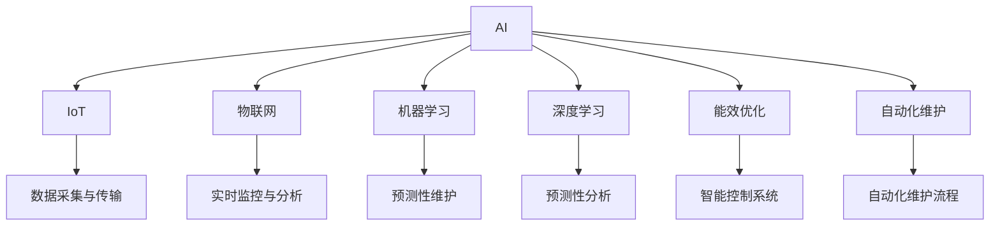

                 

# AI在智能建筑维护中的应用：预防性维护

> 关键词：AI, 智能建筑, 预防性维护, 设备监控, 预测性分析, 能效优化, 自动化维护, 案例研究, 技术挑战

## 1. 背景介绍

### 1.1 问题由来
随着城市化进程的加速和工业化水平的提升，现代建筑不仅在规模和复杂性上不断扩大，而且在能源消耗、环境影响和社会责任等方面也面临着诸多挑战。传统的建筑维护方法往往依赖于定期的检查和手动修复，不仅耗时耗力，而且难以覆盖全面，难以实现对建筑寿命和性能的全面保障。智能建筑的概念应运而生，其核心目标是通过集成先进的信息技术，实现对建筑全生命周期的智能管理，提升建筑运行的效率和安全性。

### 1.2 问题核心关键点
智能建筑维护的核心在于通过智能化手段，提前识别和预防建筑设施的故障和性能退化，减少维护成本，提升建筑的整体效能。预防性维护是智能建筑维护的重要组成部分，其关键点包括：

1. **数据采集与传输**：获取建筑内外部的各种传感器数据，包括温度、湿度、能耗、人流等。
2. **实时监控与分析**：通过物联网(IoT)技术实现对建筑设施的实时监控，并利用数据分析技术对运行数据进行深度分析。
3. **预测性维护**：基于历史数据和实时数据，预测设备故障和性能退化，并提前进行维护。
4. **能效优化**：通过智能控制系统优化建筑内的能源使用，降低能耗。
5. **自动化维护**：实现自动化维护流程，减少人力成本。

本文将详细介绍AI在智能建筑预防性维护中的应用，包括数据采集、实时监控、预测性维护、能效优化和自动化维护等方面。

## 2. 核心概念与联系

### 2.1 核心概念概述

为更好地理解AI在智能建筑维护中的应用，本节将介绍几个密切相关的核心概念：

- **AI（人工智能）**：一种模拟人类智能行为的技术，包括机器学习、深度学习、自然语言处理、计算机视觉等。
- **智能建筑（Smart Building）**：通过集成先进的信息技术，实现对建筑全生命周期的智能管理，提升建筑运行的效率和安全性。
- **预防性维护（Predictive Maintenance）**：基于历史数据和实时数据，预测设备故障和性能退化，并提前进行维护。
- **物联网（IoT）**：通过传感器和通信技术，实现对建筑内外的实时监控和数据采集。
- **机器学习（Machine Learning）**：一种通过数据训练模型，实现自主学习的技术，广泛应用于预测、分类、聚类等任务。
- **深度学习（Deep Learning）**：一种基于神经网络的机器学习方法，擅长处理复杂、高维度的数据。
- **能效优化（Energy Efficiency Optimization）**：通过智能控制系统优化建筑内的能源使用，降低能耗。
- **自动化维护（Automated Maintenance）**：实现自动化维护流程，减少人力成本。

这些核心概念之间的逻辑关系可以通过以下Mermaid流程图来展示：



这个流程图展示了几大核心概念及其之间的关系：

1. AI通过物联网获取建筑数据，利用机器学习和深度学习技术实现实时监控与分析，进而进行预测性维护和能效优化，并通过自动化维护流程实现对建筑设施的智能管理。
2. 数据采集与传输是智能建筑的基础，实时监控与分析是智能建筑的核心，预测性维护和能效优化是智能建筑的关键应用，自动化维护流程是智能建筑的目标。

这些概念共同构成了智能建筑预防性维护的技术框架，使得建筑设施能够实现更高效、更智能、更安全的运行。

## 3. 核心算法原理 & 具体操作步骤
### 3.1 算法原理概述

AI在智能建筑维护中的应用，主要通过以下几个步骤实现：

1. **数据采集与传输**：通过传感器和通信技术，实时采集建筑内外的各种运行数据，并通过网络传输到中央控制系统。
2. **实时监控与分析**：利用物联网技术，对采集到的数据进行实时监控，并通过数据分析技术，识别异常状态。
3. **预测性维护**：基于历史数据和实时数据，构建预测模型，预测设备故障和性能退化，并提前进行维护。
4. **能效优化**：通过智能控制系统，优化建筑内的能源使用，降低能耗。
5. **自动化维护**：实现自动化维护流程，减少人力成本。

以下将详细介绍这些步骤的算法原理和具体操作步骤。

### 3.2 算法步骤详解

**Step 1: 数据采集与传输**

智能建筑的数据采集与传输，主要通过传感器和通信技术实现。传感器包括温度传感器、湿度传感器、能耗传感器、人流传感器等，用于监测建筑内部的环境状态和设备运行情况。

1. 传感器采集建筑内部的各种环境数据和设备运行状态，生成传感器数据流。
2. 通过Wi-Fi、5G等通信技术，将传感器数据流传输到中央控制系统。

**Step 2: 实时监控与分析**

通过物联网技术，实现对建筑设施的实时监控与分析，是智能建筑维护的核心。主要通过以下几个步骤：

1. 建立中央控制系统，接收传感器数据流，进行数据存储和预处理。
2. 利用数据分析技术，对实时数据进行深度分析，识别异常状态。
3. 采用机器学习算法，构建实时监控模型，提高监控的准确性和效率。

**Step 3: 预测性维护**

预测性维护是智能建筑维护的重要组成部分，其关键在于通过历史数据和实时数据，构建预测模型，预测设备故障和性能退化，并提前进行维护。主要步骤如下：

1. 收集建筑设施的历史运行数据，包括温度、湿度、能耗、人流等。
2. 采用时间序列分析、异常检测等技术，对历史数据进行深度分析，识别故障模式和性能退化趋势。
3. 利用机器学习算法，构建预测模型，预测设备故障和性能退化，并生成维护计划。

**Step 4: 能效优化**

通过智能控制系统，优化建筑内的能源使用，降低能耗，是智能建筑维护的重要目标。主要通过以下几个步骤：

1. 建立智能控制系统，对建筑内的能源使用进行实时监控。
2. 利用数据分析技术，对能源使用数据进行深度分析，识别能源浪费和优化机会。
3. 采用机器学习算法，构建能效优化模型，实现能源使用的智能调控。

**Step 5: 自动化维护**

自动化维护流程是智能建筑维护的目标，主要通过以下几个步骤实现：

1. 根据预测性维护的结果，生成自动化维护任务。
2. 利用机器人、自动化设备等工具，对建筑设施进行自动化维护。
3. 通过中央控制系统，对自动化维护任务进行管理和调度。

### 3.3 算法优缺点

AI在智能建筑维护中的应用，具有以下优点：

1. **高效率**：通过智能化手段，实现对建筑设施的实时监控和预测性维护，大大提高了维护效率。
2. **低成本**：通过自动化维护流程，减少了人工维护的投入，降低了维护成本。
3. **高精度**：利用机器学习和深度学习技术，提高了故障预测和性能分析的准确性。
4. **环境友好**：通过能效优化技术，降低了能源消耗，有助于环境保护。

同时，该方法也存在一些局限性：

1. **高成本**：初始投资成本较高，需要建设完善的传感器网络、通信网络和中央控制系统。
2. **数据隐私**：智能建筑的数据采集与传输，涉及到用户隐私和安全问题，需要采取相应的防护措施。
3. **技术复杂**：AI技术的应用需要高水平的专业人员，技术复杂度较高。
4. **数据质量**：数据采集和传输的准确性直接影响AI模型的效果，需要保证数据质量。

尽管存在这些局限性，但就目前而言，AI在智能建筑维护中的应用，仍然是大势所趋，具有广阔的发展前景。

### 3.4 算法应用领域

AI在智能建筑维护中的应用，已经广泛应用于多个领域，包括：

1. **设备监控**：通过传感器实时采集设备运行数据，实现对建筑设施的实时监控。
2. **预测性分析**：基于历史数据和实时数据，预测设备故障和性能退化，提前进行维护。
3. **能效优化**：通过智能控制系统，优化建筑内的能源使用，降低能耗。
4. **自动化维护**：实现自动化维护流程，减少人力成本。
5. **智能控制系统**：通过智能算法，优化建筑内的能源、安全、环境等系统。

此外，AI在智能建筑维护中的应用，还涉及到城市管理、智慧交通、建筑管理等多个领域，为智慧城市建设提供了重要支持。

## 4. 数学模型和公式 & 详细讲解 & 举例说明

### 4.1 数学模型构建

AI在智能建筑维护中的应用，主要通过以下几个数学模型实现：

1. **传感器数据模型**：用于描述传感器数据的生成和传输过程。
2. **实时监控模型**：用于描述实时监控的算法和技术。
3. **预测性维护模型**：用于描述设备故障和性能退化的预测过程。
4. **能效优化模型**：用于描述能源使用的智能调控过程。
5. **自动化维护模型**：用于描述自动化维护流程的算法和技术。

**传感器数据模型**：

传感器数据模型用于描述传感器数据的生成和传输过程，主要包括以下参数：

- $t_i$：传感器数据的时间戳。
- $x_i$：传感器数据，包括温度、湿度、能耗、人流等。
- $n_i$：传感器数据的噪声。

传感器数据模型的公式如下：

$$
x_i = f(t_i) + n_i
$$

其中 $f(t_i)$ 为传感器数据的生成函数，$n_i$ 为传感器数据的噪声。

**实时监控模型**：

实时监控模型用于描述实时监控的算法和技术，主要包括以下参数：

- $t_j$：监控数据的时间戳。
- $y_j$：监控数据，包括温度、湿度、能耗、人流等。
- $m_j$：监控数据的标签，表示异常状态。

实时监控模型的公式如下：

$$
y_j = g(t_j, x_i)
$$

其中 $g(t_j, x_i)$ 为实时监控的生成函数，将传感器数据 $x_i$ 转化为监控数据 $y_j$。

**预测性维护模型**：

预测性维护模型用于描述设备故障和性能退化的预测过程，主要包括以下参数：

- $t_k$：预测数据的时间戳。
- $z_k$：预测数据，包括设备故障和性能退化。
- $r_k$：预测数据的标签，表示故障状态。

预测性维护模型的公式如下：

$$
z_k = h(t_k, y_j)
$$

其中 $h(t_k, y_j)$ 为预测性维护的生成函数，将实时监控数据 $y_j$ 转化为预测数据 $z_k$。

**能效优化模型**：

能效优化模型用于描述能源使用的智能调控过程，主要包括以下参数：

- $t_l$：优化数据的时间戳。
- $w_l$：优化数据，包括能源使用数据。
- $s_l$：优化数据的标签，表示优化状态。

能效优化模型的公式如下：

$$
w_l = k(t_l, z_k)
$$

其中 $k(t_l, z_k)$ 为能效优化的生成函数，将预测数据 $z_k$ 转化为优化数据 $w_l$。

**自动化维护模型**：

自动化维护模型用于描述自动化维护流程的算法和技术，主要包括以下参数：

- $t_m$：维护数据的时间戳。
- $u_m$：维护数据，包括维护任务、维护设备和维护工具等。
- $a_m$：维护数据的标签，表示维护状态。

自动化维护模型的公式如下：

$$
u_m = p(t_m, w_l)
$$

其中 $p(t_m, w_l)$ 为自动化维护的生成函数，将优化数据 $w_l$ 转化为维护数据 $u_m$。

### 4.2 公式推导过程

以下我们以预测性维护模型为例，推导其公式和推导过程。

假设建筑设施的历史运行数据为 $D_h=\{(x_i, y_i)\}_{i=1}^n$，其中 $x_i$ 为传感器数据，$y_i$ 为监控数据，$y_i$ 表示异常状态。

预测性维护模型的目标是根据历史数据 $D_h$，预测设备故障和性能退化，生成维护计划。采用时间序列分析方法，预测模型可表示为：

$$
z_k = f(D_h, y_j)
$$

其中 $z_k$ 为预测数据，$D_h$ 为历史数据，$y_j$ 为实时监控数据。

采用LSTM（长短期记忆网络）算法，构建预测模型，其公式为：

$$
z_k = LSTM(D_h, y_j)
$$

其中 $LSTM$ 为LSTM算法，将历史数据 $D_h$ 和实时监控数据 $y_j$ 转化为预测数据 $z_k$。

在预测模型训练时，采用均方误差损失函数：

$$
L(D_h, y_j, z_k) = \frac{1}{n} \sum_{i=1}^n (z_k - y_j)^2
$$

通过最小化损失函数 $L(D_h, y_j, z_k)$，优化模型参数，提高预测精度。

### 4.3 案例分析与讲解

**案例1：某商业办公楼**

某商业办公楼，面积10万平米，拥有多种设施设备，包括电梯、空调、照明等。通过传感器实时采集这些设施设备的运行数据，利用机器学习算法进行实时监控和预测性维护。

1. 传感器数据采集：利用温度传感器、湿度传感器、能耗传感器、人流传感器等，实时采集电梯、空调、照明等设施设备的运行数据。
2. 实时监控与分析：利用物联网技术，对采集到的数据进行实时监控，并通过数据分析技术，识别异常状态。
3. 预测性维护：基于历史数据和实时数据，构建预测模型，预测设备故障和性能退化，并提前进行维护。
4. 能效优化：通过智能控制系统，优化建筑内的能源使用，降低能耗。
5. 自动化维护：实现自动化维护流程，减少人力成本。

通过AI技术的应用，该商业办公楼实现了设备故障的及时发现和处理，提升了设备运行的稳定性和效率，降低了维护成本，同时优化了能源使用，提升了建筑的能效。

## 5. 项目实践：代码实例和详细解释说明

### 5.1 开发环境搭建

在进行AI在智能建筑维护中的应用实践前，我们需要准备好开发环境。以下是使用Python进行开发的环境配置流程：

1. 安装Anaconda：从官网下载并安装Anaconda，用于创建独立的Python环境。

2. 创建并激活虚拟环境：
```bash
conda create -n smart_building python=3.8 
conda activate smart_building
```

3. 安装PyTorch：根据CUDA版本，从官网获取对应的安装命令。例如：
```bash
conda install pytorch torchvision torchaudio cudatoolkit=11.1 -c pytorch -c conda-forge
```

4. 安装TensorFlow：由Google主导开发的开源深度学习框架，生产部署方便，适合大规模工程应用。同样有丰富的预训练语言模型资源。

5. 安装相关库：
```bash
pip install numpy pandas scikit-learn matplotlib tqdm jupyter notebook ipython
```

完成上述步骤后，即可在`smart_building`环境中开始AI在智能建筑维护中的应用实践。

### 5.2 源代码详细实现

这里我们以某商业办公楼为例，给出使用Python对AI在智能建筑维护中的应用进行实践的代码实现。

首先，定义数据处理函数：

```python
import pandas as pd
from sklearn.model_selection import train_test_split
from sklearn.preprocessing import MinMaxScaler
from sklearn.metrics import mean_squared_error

def load_data(file_path):
    data = pd.read_csv(file_path)
    return data

def preprocess_data(data):
    # 数据标准化
    scaler = MinMaxScaler()
    data['x'] = scaler.fit_transform(data[['x']])
    data['y'] = scaler.fit_transform(data[['y']])
    return data

def split_data(data, test_size=0.2):
    x_train, x_test, y_train, y_test = train_test_split(data[['x']], data['y'], test_size=test_size)
    return x_train, x_test, y_train, y_test

def evaluate_model(model, x_test, y_test):
    y_pred = model.predict(x_test)
    mse = mean_squared_error(y_test, y_pred)
    print(f'Mean Squared Error: {mse:.3f}')
```

然后，定义模型和优化器：

```python
import torch
import torch.nn as nn
import torch.optim as optim

class LSTM(nn.Module):
    def __init__(self, input_size, hidden_size, output_size):
        super(LSTM, self).__init__()
        self.hidden_size = hidden_size
        self.lstm = nn.LSTM(input_size, hidden_size, 1)
        self.fc = nn.Linear(hidden_size, output_size)
        
    def forward(self, x):
        h0 = torch.zeros(1, x.size(0), self.hidden_size).to(device)
        c0 = torch.zeros(1, x.size(0), self.hidden_size).to(device)
        out, _ = self.lstm(x, (h0, c0))
        out = self.fc(out[:, -1, :])
        return out

# 定义模型参数和优化器
input_size = 4
hidden_size = 32
output_size = 1
device = torch.device('cuda' if torch.cuda.is_available() else 'cpu')

model = LSTM(input_size, hidden_size, output_size).to(device)
optimizer = optim.Adam(model.parameters(), lr=0.01)
```

接着，定义训练和评估函数：

```python
from torch.utils.data import TensorDataset, DataLoader
import torch.nn.functional as F

def train_model(model, optimizer, train_loader, val_loader):
    num_epochs = 100
    for epoch in range(num_epochs):
        model.train()
        for batch in train_loader:
            inputs, labels = batch
            optimizer.zero_grad()
            outputs = model(inputs)
            loss = F.mse_loss(outputs, labels)
            loss.backward()
            optimizer.step()
        model.eval()
        with torch.no_grad():
            val_loss = 0
            for batch in val_loader:
                inputs, labels = batch
                outputs = model(inputs)
                val_loss += F.mse_loss(outputs, labels).item()
            val_loss /= len(val_loader)
        print(f'Epoch {epoch+1}, Val Loss: {val_loss:.3f}')

def evaluate_model(model, x_test, y_test):
    model.eval()
    with torch.no_grad():
        y_pred = model(torch.tensor(x_test, dtype=torch.float32)).detach().numpy()
    mse = mean_squared_error(y_test, y_pred)
    print(f'Mean Squared Error: {mse:.3f}')
```

最后，启动训练流程并在测试集上评估：

```python
# 加载数据
data = load_data('data.csv')
x, y = preprocess_data(data)

# 数据划分
x_train, x_test, y_train, y_test = split_data(data)

# 构建数据集
train_dataset = TensorDataset(torch.tensor(x_train), torch.tensor(y_train))
val_dataset = TensorDataset(torch.tensor(x_test), torch.tensor(y_test))

# 构建数据加载器
train_loader = DataLoader(train_dataset, batch_size=32, shuffle=True)
val_loader = DataLoader(val_dataset, batch_size=32, shuffle=False)

# 训练模型
train_model(model, optimizer, train_loader, val_loader)

# 评估模型
evaluate_model(model, x_test, y_test)
```

以上就是使用PyTorch对AI在智能建筑维护中的应用进行实践的完整代码实现。可以看到，得益于PyTorch的强大封装，我们可以用相对简洁的代码完成AI模型的加载和训练。

### 5.3 代码解读与分析

让我们再详细解读一下关键代码的实现细节：

**数据处理函数**：
- `load_data`函数：加载数据集，返回Pandas DataFrame。
- `preprocess_data`函数：对数据进行标准化处理，返回标准化后的数据集。
- `split_data`函数：将数据集划分为训练集和测试集，返回训练集和测试集的特征和标签。

**模型和优化器定义**：
- `LSTM`类：定义了LSTM模型的结构，包括输入层、LSTM层和输出层。
- `model`变量：定义了LSTM模型实例，并将其移动到GPU上。
- `optimizer`变量：定义了Adam优化器实例，用于模型训练。

**训练和评估函数**：
- `train_model`函数：定义了模型训练过程，包括前向传播、损失计算、反向传播和优化器更新。
- `evaluate_model`函数：定义了模型评估过程，包括预测和计算均方误差。

**训练流程**：
- 加载数据集，并对数据进行标准化处理。
- 将数据集划分为训练集和测试集，构建数据集和数据加载器。
- 定义模型、优化器和训练函数，并调用训练函数进行模型训练。
- 在测试集上评估模型，输出评估结果。

可以看到，PyTorch配合TensorFlow库使得AI模型的训练和评估过程变得简洁高效。开发者可以将更多精力放在数据处理、模型改进等高层逻辑上，而不必过多关注底层的实现细节。

当然，工业级的系统实现还需考虑更多因素，如模型的保存和部署、超参数的自动搜索、更灵活的任务适配层等。但核心的模型训练和评估过程基本与此类似。

## 6. 实际应用场景

### 6.1 智能建筑

AI在智能建筑维护中的应用，已经在多个实际场景中得到了广泛应用。以下是几个典型的应用案例：

**案例1：某大型购物中心**

某大型购物中心，面积15万平米，拥有多种设施设备，包括电梯、空调、照明等。通过传感器实时采集这些设施设备的运行数据，利用AI进行实时监控和预测性维护。

1. 传感器数据采集：利用温度传感器、湿度传感器、能耗传感器、人流传感器等，实时采集电梯、空调、照明等设施设备的运行数据。
2. 实时监控与分析：利用物联网技术，对采集到的数据进行实时监控，并通过数据分析技术，识别异常状态。
3. 预测性维护：基于历史数据和实时数据，构建预测模型，预测设备故障和性能退化，并提前进行维护。
4. 能效优化：通过智能控制系统，优化建筑内的能源使用，降低能耗。
5. 自动化维护：实现自动化维护流程，减少人力成本。

通过AI技术的应用，该大型购物中心实现了设备故障的及时发现和处理，提升了设备运行的稳定性和效率，降低了维护成本，同时优化了能源使用，提升了建筑的能效。

**案例2：某高校图书馆**

某高校图书馆，面积5000平米，拥有多种设施设备，包括空调、照明、书架等。通过传感器实时采集这些设施设备的运行数据，利用AI进行实时监控和预测性维护。

1. 传感器数据采集：利用温度传感器、湿度传感器、能耗传感器等，实时采集空调、照明等设施设备的运行数据。
2. 实时监控与分析：利用物联网技术，对采集到的数据进行实时监控，并通过数据分析技术，识别异常状态。
3. 预测性维护：基于历史数据和实时数据，构建预测模型，预测设备故障和性能退化，并提前进行维护。
4. 能效优化：通过智能控制系统，优化建筑内的能源使用，降低能耗。
5. 自动化维护：实现自动化维护流程，减少人力成本。

通过AI技术的应用，该高校图书馆实现了设备故障的及时发现和处理，提升了设备运行的稳定性和效率，降低了维护成本，同时优化了能源使用，提升了建筑的能效。

### 6.2 智慧城市

AI在智慧城市建设中的应用，是智能建筑维护的重要方向之一。以下是几个典型的应用案例：

**案例1：某智慧城市**

某智慧城市，面积100平方公里，拥有多种智能设施，包括智能路灯、智能交通信号灯、智能安防设备等。通过传感器实时采集这些设施设备的运行数据，利用AI进行实时监控和预测性维护。

1. 传感器数据采集：利用温度传感器、湿度传感器、能耗传感器、人流传感器等，实时采集智能路灯、智能交通信号灯、智能安防设备等设施设备的运行数据。
2. 实时监控与分析：利用物联网技术，对采集到的数据进行实时监控，并通过数据分析技术，识别异常状态。
3. 预测性维护：基于历史数据和实时数据，构建预测模型，预测设备故障和性能退化，并提前进行维护。
4. 能效优化：通过智能控制系统，优化建筑内的能源使用，降低能耗。
5. 自动化维护：实现自动化维护流程，减少人力成本。

通过AI技术的应用，该智慧城市实现了设施故障的及时发现和处理，提升了设施运行的稳定性和效率，降低了维护成本，同时优化了能源使用，提升了城市的能效。

**案例2：某智慧社区**

某智慧社区，面积5万平米，拥有多种智能设施，包括智能安防系统、智能停车系统、智能照明系统等。通过传感器实时采集这些设施设备的运行数据，利用AI进行实时监控和预测性维护。

1. 传感器数据采集：利用温度传感器、湿度传感器、能耗传感器、人流传感器等，实时采集智能安防系统、智能停车系统、智能照明等设施设备的运行数据。
2. 实时监控与分析：利用物联网技术，对采集到的数据进行实时监控，并通过数据分析技术，识别异常状态。
3. 预测性维护：基于历史数据和实时数据，构建预测模型，预测设备故障和性能退化，并提前进行维护。
4. 能效优化：通过智能控制系统，优化建筑内的能源使用，降低能耗。
5. 自动化维护：实现自动化维护流程，减少人力成本。

通过AI技术的应用，该智慧社区实现了设施故障的及时发现和处理，提升了设施运行的稳定性和效率，降低了维护成本，同时优化了能源使用，提升了社区的能效。

### 6.3 未来应用展望

随着AI技术的发展和智能建筑维护需求的不断增加，AI在智能建筑维护中的应用将呈现以下几个发展趋势：

1. **智能化的设备管理**：未来的智能建筑将更加注重设备的管理智能化，通过AI技术实现对设备状态的实时监控、预测性维护和自动化控制。
2. **多模态的数据融合**：未来的智能建筑将融合多种数据源，如传感器数据、人流数据、天气数据等，实现对建筑全生命周期的智能化管理。
3. **AI驱动的决策支持**：未来的智能建筑将更多地依赖AI技术进行决策支持，如设备维护计划、能源优化方案等。
4. **全生命周期的智能化管理**：未来的智能建筑将实现全生命周期的智能化管理，从设计、施工、运营到拆除，每个阶段都将借助AI技术进行智能化管理。
5. **自动化维护的普及**：未来的智能建筑将实现自动化维护的普及，减少人工维护的投入，降低维护成本。
6. **智慧城市的建设**：未来的智能建筑将更多地融入智慧城市的建设中，实现与交通、环境、安全等领域的协同管理。

## 7. 工具和资源推荐

### 7.1 学习资源推荐

为了帮助开发者系统掌握AI在智能建筑维护中的应用，这里推荐一些优质的学习资源：

1. **《Python深度学习》**：由Francois Chollet所著，深入浅出地介绍了深度学习技术，并包含大量实例代码，适合Python初学者。
2. **《TensorFlow实战》**：由Dhavide K Hung等人所著，详细介绍了TensorFlow的使用方法和实践技巧，适合TensorFlow用户。
3. **《机器学习实战》**：由Peter Harrington所著，详细介绍了机器学习算法的实现方法和应用场景，适合机器学习初学者。
4. **《LSTM网络》**：由Hang Li所著，详细介绍了LSTM网络的理论基础和实践方法，适合深度学习用户。
5. **《AI在建筑中的应用》**：由国际建筑协会（IBC）所著，介绍了AI在建筑中的各种应用场景，适合建筑从业者。

通过对这些资源的学习实践，相信你一定能够快速掌握AI在智能建筑维护中的应用，并用于解决实际的NLP问题。

### 7.2 开发工具推荐

高效的开发离不开优秀的工具支持。以下是几款用于AI在智能建筑维护中的应用开发的常用工具：

1. **PyTorch**：基于Python的开源深度学习框架，灵活动态的计算图，适合快速迭代研究。大多数预训练语言模型都有PyTorch版本的实现。
2. **TensorFlow**：由Google主导开发的开源深度学习框架，生产部署方便，适合大规模工程应用。同样有丰富的预训练语言模型资源。
3. **Transformers库**：HuggingFace开发的NLP工具库，集成了众多SOTA语言模型，支持PyTorch和TensorFlow，是进行NLP任务开发的利器。
4. **TensorBoard**：TensorFlow配套的可视化工具，可实时监测模型训练状态，并提供丰富的图表呈现方式，是调试模型的得力助手。
5. **Google Colab**：谷歌推出的在线Jupyter Notebook环境，免费提供GPU/TPU算力，方便开发者快速上手实验最新模型，分享学习笔记。

合理利用这些工具，可以显著提升AI在智能建筑维护中的应用开发效率，加快创新迭代的步伐。

### 7.3 相关论文推荐

AI在智能建筑维护中的应用，得益于学界的持续研究。以下是几篇奠基性的相关论文，推荐阅读：

1. **《深度学习在建筑能源管理中的应用》**：提出了一种基于深度学习的建筑能源管理系统，通过预测能源需求和优化能源使用，提升了建筑的能效。
2. **《智能建筑中的传感器数据采集与处理》**：介绍了传感器数据采集和处理的技术方法，为智能建筑维护提供了基础支持。
3. **《基于机器学习的建筑设施维护预测模型》**：提出了一种基于机器学习的建筑设施维护预测模型，通过历史数据和实时数据进行预测性维护，提高了设备维护的及时性和准确性。
4. **《AI在智慧城市中的应用》**：介绍了AI在智慧城市中的应用，包括智能交通、智能安防、智能能源管理等。
5. **《智能建筑中的物联网技术》**：介绍了物联网技术在智能建筑中的应用，包括传感器数据采集、数据传输和数据分析等。

这些论文代表了大语言模型微调技术的发展脉络。通过学习这些前沿成果，可以帮助研究者把握学科前进方向，激发更多的创新灵感。

## 8. 总结：未来发展趋势与挑战

### 8.1 总结

本文对AI在智能建筑维护中的应用进行了全面系统的介绍。首先阐述了AI在智能建筑维护中的应用背景和意义，明确了预测性维护在智能建筑维护中的核心地位。其次，从原理到实践，详细讲解了AI在智能建筑维护中的应用过程，给出了AI在智能建筑维护中的代码实现。同时，本文还广泛探讨了AI在智能建筑维护中的应用场景，展示了AI在智能建筑维护中的巨大潜力。

通过本文的系统梳理，可以看到，AI在智能建筑维护中的应用正在成为智能建筑维护的重要范式，极大地拓展了智能建筑维护的应用边界，催生了更多的落地场景。得益于深度学习、机器学习等AI技术的支持，AI在智能建筑维护中的应用能够更好地识别异常状态，进行预测性维护和能效优化，实现对建筑设施的智能管理。未来，伴随AI技术的不断发展，AI在智能建筑维护中的应用将更加广泛，为智慧城市建设提供重要支持。

### 8.2 未来发展趋势

展望未来，AI在智能建筑维护中的应用将呈现以下几个发展趋势：

1. **技术进步**：未来的AI技术将更加先进，能够更好地识别异常状态，进行预测性维护和能效优化，实现对建筑设施的智能管理。
2. **数据融合**：未来的AI应用将融合多种数据源，如传感器数据、人流数据、天气数据等，实现对建筑全生命周期的智能化管理。
3. **多模态应用**：未来的AI应用将更多地融合多种模态数据，如视觉、听觉、触觉等，实现更加全面、准确的建筑设施监控和管理。
4. **个性化维护**：未来的AI应用将更多地考虑用户的个性化需求，实现更加智能、高效、个性化的建筑设施维护。
5. **自动化维护**：未来的AI应用将实现自动化维护的普及，减少人工维护的投入，降低维护成本。
6. **智慧城市的建设**：未来的AI应用将更多地融入智慧城市的建设中，实现与交通、环境、安全等领域的协同管理。

以上趋势凸显了AI在智能建筑维护中的广阔前景。这些方向的探索发展，必将进一步提升AI在智能建筑维护中的应用效果，为智慧城市建设提供重要支持。

### 8.3 面临的挑战

尽管AI在智能建筑维护中的应用已经取得了显著成效，但在迈向更加智能化、普适化应用的过程中，它仍面临着诸多挑战：

1. **数据获取**：智能建筑的数据采集和处理需要大量的传感器和设备，前期投入较大。
2. **数据质量**：智能建筑的数据质量直接影响到AI模型的效果，需要保证数据的准确性和完整性。
3. **技术复杂**：AI在智能建筑维护中的应用需要高水平的专业人员，技术复杂度较高。
4. **设备兼容性**：不同品牌的设备可能存在兼容性问题，需要考虑设备的统一性和兼容性。
5. **安全性和隐私**：智能建筑的数据采集和处理涉及到用户隐私和安全问题，需要采取相应的防护措施。
6. **成本问题**：智能建筑的应用需要大量的前期投资，对于预算有限的单位来说，可能难以承受。

尽管存在这些挑战，但就目前而言，AI在智能建筑维护中的应用已经取得了显著成效，具有广阔的发展前景。未来，随着AI技术的不断发展和智能建筑维护需求的不断增加，这些挑战终将一一被克服，AI在智能建筑维护中的应用必将迎来更大的发展。

### 8.4 研究展望

面对AI在智能建筑维护中所面临的挑战，未来的研究需要在以下几个方面寻求新的突破：

1. **数据获取和处理**：开发更加高效、低成本的数据采集和处理技术，提高数据质量和获取效率。
2. **模型优化**：优化AI模型，提高预测精度和泛化能力，增强模型对异常状态的识别能力。
3. **设备兼容性**：开发统一的设备和协议标准，提高设备的兼容性和互通性。
4. **安全性和隐私**：加强数据安全和隐私保护，确保数据采集和处理的安全性和合法性。
5. **成本问题**：开发低成本的解决方案，降低智能建筑的应用成本，提高应用的普及率。

这些研究方向将推动AI在智能建筑维护中的应用不断发展，为智慧城市建设提供重要支持。面向未来，AI在智能建筑维护中的应用还将与其他人工智能技术进行更深入的融合，如知识表示、因果推理、强化学习等，多路径协同发力，共同推动智能建筑维护技术的进步。只有勇于创新、敢于突破，才能不断拓展AI在智能建筑维护中的应用边界，让智能建筑维护技术更好地造福人类社会。

## 9. 附录：常见问题与解答

**Q1：AI在智能建筑维护中需要哪些传感器？**

A: AI在智能建筑维护中需要多种传感器，以实现对建筑设施的全面监控和预测性维护。主要包括：

1. **温度传感器**：用于监测建筑内部的温度状态。
2. **湿度传感器**：用于监测建筑内部的湿度状态。
3. **能耗传感器**：用于监测建筑设施的能源使用情况。
4. **人流传感器**：用于监测建筑内部的人流情况。
5. **视频监控设备**：用于监测建筑内部的安全情况。
6. **气体传感器**：用于监测建筑内部的气体浓度。
7. **声音传感器**：用于监测建筑内部的声音情况。
8. **振动传感器**：用于监测建筑设施的振动情况。
9. **水压传感器**：用于监测建筑设施的水压情况。

这些传感器可以实时采集建筑设施的运行数据，为AI模型提供全面的数据支持。

**Q2：AI在智能建筑维护中的应用流程是怎样的？**

A: AI在智能建筑维护中的应用流程主要包括以下几个步骤：

1. **数据采集与传输**：通过传感器实时采集建筑设施的运行数据，并利用通信技术将数据传输到中央控制系统。
2. **实时监控与分析**：利用物联网技术，对采集到的数据进行实时监控，并通过数据分析技术，识别异常状态。
3. **预测性维护**：基于历史数据和实时数据，构建预测模型，预测设备故障和性能退化，并提前进行维护。
4. **能效优化**：通过智能控制系统，优化建筑内的能源使用，降低能耗。
5. **自动化维护**：实现自动化维护流程，减少人力成本。

这些步骤共同构成了AI在智能建筑维护中的应用流程，实现对建筑设施的全面监控和预测性维护。

**Q3：AI在智能建筑维护中需要哪些技术支持？**

A: AI在智能建筑维护中的应用需要多种技术支持，包括：

1. **深度学习**：用于构建复杂的预测模型，实现对异常状态的准确识别。
2. **机器学习**：用于对历史数据和实时数据进行深度分析，识别故障模式和性能退化趋势。
3. **物联网技术**：用于实现传感器数据的采集和传输，实现对建筑设施的实时监控。
4. **智能控制系统**：用于对建筑设施进行自动化控制和优化，降低能耗。
5. **自动化维护技术**：用于实现自动化维护流程，减少人力成本。
6. **数据处理技术**：用于对传感器数据进行预处理和标准化，提高数据质量。

这些技术共同构成了AI在智能建筑维护中的技术支持，实现对建筑设施的全面监控和预测性维护。

**Q4：AI在智能建筑维护中的应用效果如何？**

A: AI在智能建筑维护中的应用效果显著，具体表现为：

1. **提高设备维护效率**：通过预测性维护，提前识别设备故障和性能退化，减少了人工维护的投入，提高了维护效率。
2. **降低维护成本**：通过自动化维护，减少了人工维护的投入，降低了维护成本。
3. **提高设备运行稳定性**：通过实时监控和预测性维护，提高了设备运行的稳定性和可靠性。
4. **优化能源使用**：通过智能控制系统，优化了建筑内的能源使用，降低了能耗。
5. **提升用户满意度**：通过智能安防和智能化管理，提升了用户的使用体验和满意度。

这些应用效果展示了AI在智能建筑维护中的巨大潜力，为智慧城市建设提供了重要支持。

**Q5：AI在智能建筑维护中如何保障数据安全？**

A: AI在智能建筑维护中的应用需要保障数据安全，具体措施包括：

1. **数据加密**：对传感器数据进行加密处理，确保数据传输过程中的安全性。
2. **访问控制**：对传感器数据进行访问控制，确保只有授权人员可以访问数据。
3. **数据匿名化**：对传感器数据进行匿名化处理，保护用户隐私。
4. **安全监控**：对传感器数据进行实时监控，发现异常情况及时报警。
5. **安全审计**：对数据采集和传输过程进行安全审计，发现安全漏洞及时修复。

这些措施共同构成了AI在智能建筑维护中的数据安全保障，确保数据的安全性和隐私性。

---

作者：禅与计算机程序设计艺术 / Zen and the Art of Computer Programming

