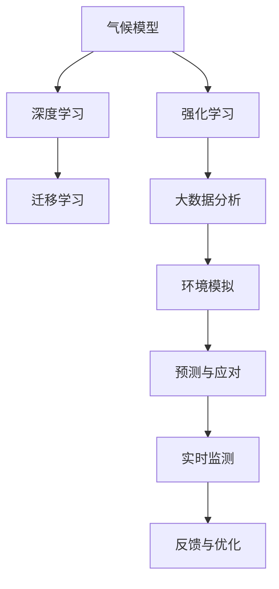

                 

## 1. 背景介绍

### 1.1 问题由来

气候变化是人类面临的全球性挑战之一，其带来的极端天气事件、生态系统变化、海平面上升等诸多问题，对人类社会的可持续发展构成了严重威胁。应对气候变化需要科学研究、政策制定、技术创新等多方面的协作。

在科学研究中，准确的气候变化预测是制定有效应对策略的前提。传统气候模型依赖于复杂的数据和计算，且难以应对不断变化的环境和参数。近年来，人工智能（AI）技术的引入，尤其是深度学习模型，为气候变化预测提供了新的可能性。

### 1.2 问题核心关键点

AI在气候变化预测与应对中的核心关键点包括：

- **大数据处理**：气候模型需要处理海量气象数据，AI技术可以高效处理并提取关键特征。
- **复杂模式识别**：气候变化涉及众多复杂因素，AI可以识别不同变量间的非线性关系。
- **实时动态预测**：AI可以实时处理动态数据，提供更精确的短期和长期预测。
- **参数优化**：AI可以自动优化模型参数，提高预测精度。
- **可解释性与可复用性**：AI模型能够提供更易于理解的预测结果，便于制定政策，且易于在不同环境中共享和复用。

## 2. 核心概念与联系

### 2.1 核心概念概述

- **气候模型（Climate Model）**：模拟地球气候系统变化过程的数学模型，包括大气、海洋、陆地等组成部分。
- **深度学习（Deep Learning）**：一种基于神经网络模型的AI技术，通过多层次的特征提取，可以从原始数据中自动学习复杂的非线性关系。
- **强化学习（Reinforcement Learning）**：一种AI技术，通过与环境互动，学习最优的策略，可用于模拟自然系统动态。
- **迁移学习（Transfer Learning）**：将在一个任务上训练得到的知识，迁移到另一个相关任务中，以提高在新任务上的性能。
- **大数据分析（Big Data Analytics）**：对大规模数据进行收集、处理、分析和可视化，为气候变化研究提供数据支持。
- **环境模拟（Environment Simulation）**：构建虚拟环境，模拟气候变化的不同情景，用于评估不同策略的效果。

这些核心概念之间相互关联，共同构成了AI在气候变化研究中的技术框架。

### 2.2 核心概念原理和架构的 Mermaid 流程图



## 3. 核心算法原理 & 具体操作步骤

### 3.1 算法原理概述

AI在气候变化研究中的应用，主要是通过深度学习和强化学习等技术，构建预测模型和优化策略。其主要步骤包括：

1. **数据收集与处理**：从各种气象站、卫星、海洋观测等平台收集气候数据，并进行清洗、归一化等预处理。
2. **特征提取**：使用深度学习模型（如卷积神经网络、循环神经网络）自动提取数据中的关键特征。
3. **模型训练**：使用收集的数据训练深度学习模型，构建气候变化预测模型。
4. **策略优化**：使用强化学习模型，优化应对气候变化的策略。
5. **实时监测与预测**：利用训练好的模型，实时处理动态数据，进行短期和长期预测。
6. **反馈与优化**：根据预测结果和实际观测结果，不断调整模型参数和策略，提高预测精度。

### 3.2 算法步骤详解

**步骤 1: 数据收集与预处理**

- **收集数据**：从不同来源收集气候数据，包括气温、降水量、风速、海平面高度等。
- **数据清洗**：去除异常值、填补缺失值，确保数据质量。
- **特征工程**：提取有意义的特征，如时间序列、空间分布、气象站位置等。

**步骤 2: 特征提取与模型训练**

- **选择模型**：选择合适的深度学习模型，如卷积神经网络（CNN）、循环神经网络（RNN）、长短时记忆网络（LSTM）等。
- **模型训练**：使用训练集数据训练模型，优化模型参数。
- **模型评估**：使用验证集数据评估模型性能，选择最优模型。

**步骤 3: 策略优化与实时预测**

- **策略设计**：根据模型预测结果，设计气候变化的应对策略，如减排、适应措施等。
- **策略优化**：使用强化学习模型，优化策略，确保最优效果。
- **实时预测**：利用训练好的模型，实时处理动态数据，进行短期和长期预测。

**步骤 4: 反馈与优化**

- **反馈机制**：建立反馈机制，根据实际观测结果和预测结果进行调整。
- **参数更新**：根据反馈结果，更新模型参数，优化模型性能。

### 3.3 算法优缺点

**优点**：

- **高效处理大数据**：深度学习模型可以高效处理海量数据，提取关键特征。
- **准确预测**：深度学习模型能够从复杂的数据中学习到非线性关系，提高预测精度。
- **实时动态**：强化学习模型可以实时处理动态数据，提供更精确的预测。
- **参数优化**：自动优化模型参数，提高预测精度。
- **可解释性**：AI模型提供更易于理解的预测结果，便于制定政策。

**缺点**：

- **模型复杂性**：深度学习模型需要大量数据和计算资源进行训练。
- **过拟合风险**：如果数据量不足，模型可能过拟合。
- **解释性不足**：AI模型通常被认为是"黑盒"，难以解释其内部机制。
- **数据偏差**：数据中可能存在偏差，影响模型预测结果。

### 3.4 算法应用领域

AI在气候变化预测与应对中的应用领域包括：

- **气象预报**：使用深度学习模型进行短期和长期气象预报。
- **海平面上升预测**：使用深度学习模型预测海平面变化趋势。
- **气候变化模拟**：使用气候模型和深度学习模型进行气候变化模拟。
- **减排策略优化**：使用强化学习模型优化减排策略。
- **灾害预警**：使用AI技术进行自然灾害预警，如洪水、干旱等。

## 4. 数学模型和公式 & 详细讲解 & 举例说明

### 4.1 数学模型构建

为了构建气候变化预测模型，我们首先需要定义一个数学模型。假设模型输入为气温、降水量、风速等气象数据，输出为未来某个时间点的气候状态。

假设模型为 $M(x)$，其中 $x$ 表示输入的气象数据向量。则模型的预测结果为 $y = M(x)$。

### 4.2 公式推导过程

**短期预测**：使用时间序列预测模型，如循环神经网络（RNN），预测未来几天的气温、降水量等。

$$
y_t = \sigma(W_hx_t + U_hx_{t-1} + b_h)
$$

其中，$x_t$ 为当前时间点的气象数据，$x_{t-1}$ 为前一时间点的气象数据，$W_h$、$U_h$ 和 $b_h$ 为模型参数。$\sigma$ 为激活函数，通常使用tanh或ReLU。

**长期预测**：使用深度学习模型，如卷积神经网络（CNN），处理空间数据，预测未来数月的气候状态。

$$
y_t = \sigma(W_cx_t + U_cx_{t-1} + b_c)
$$

其中，$x_t$ 为当前时间点的气象数据，$x_{t-1}$ 为前一时间点的气象数据，$W_c$、$U_c$ 和 $b_c$ 为模型参数。$\sigma$ 为激活函数，通常使用tanh或ReLU。

**策略优化**：使用强化学习模型，如深度确定性策略梯度（DDPG），优化减排策略。

$$
Q(s, a) = r + \gamma Q(s', a')
$$

其中，$s$ 为当前状态，$a$ 为当前策略，$r$ 为即时奖励，$s'$ 为下一状态，$a'$ 为下一策略。$\gamma$ 为折扣因子。

### 4.3 案例分析与讲解

以海平面上升预测为例，我们使用深度学习模型进行预测。

- **数据准备**：收集历史海平面高度数据，对其进行预处理。
- **模型选择**：选择适当的深度学习模型，如RNN。
- **模型训练**：使用历史数据训练模型，调整模型参数。
- **模型评估**：使用验证集数据评估模型性能。
- **预测结果**：使用训练好的模型，对未来海平面高度进行预测。

## 5. 项目实践：代码实例和详细解释说明

### 5.1 开发环境搭建

- **安装Python**：从官网下载并安装Python，选择合适的版本。
- **安装必要的库**：安装TensorFlow、Keras、Pandas等库。
- **配置环境**：使用虚拟环境管理工具，创建Python虚拟环境。

### 5.2 源代码详细实现

下面以海平面上升预测为例，给出使用TensorFlow进行模型训练的代码实现。

```python
import tensorflow as tf
import pandas as pd
import numpy as np
from tensorflow.keras.models import Sequential
from tensorflow.keras.layers import LSTM, Dense

# 数据准备
data = pd.read_csv('sea_level.csv')
data = data.dropna()
data = data[['date', 'sea_level']]
data.columns = ['date', 'sea_level']

# 数据处理
data['year'] = data['date'].dt.year
data['month'] = data['date'].dt.month
data = data.drop('date', axis=1)

# 数据分割
train_data = data.sample(frac=0.8, random_state=1)
test_data = data.drop(train_data.index)

# 特征工程
train_data['month'] = train_data['month'].astype('category')
train_data['month'] = train_data['month'].cat.codes

# 模型训练
model = Sequential()
model.add(LSTM(50, return_sequences=True, input_shape=(None, 1)))
model.add(LSTM(50))
model.add(Dense(1))
model.compile(optimizer='adam', loss='mse')
model.fit(train_data[['year', 'month', 'sea_level']].values, train_data['sea_level'].values,
          epochs=100, batch_size=64, verbose=1)

# 模型评估
test_loss = model.evaluate(test_data[['year', 'month', 'sea_level']].values, test_data['sea_level'].values)
print('Test loss:', test_loss)

# 预测结果
prediction = model.predict(test_data[['year', 'month', 'sea_level']].values)
```

### 5.3 代码解读与分析

上述代码实现了基于LSTM的短期海平面上升预测模型。主要步骤如下：

1. **数据准备**：读取历史海平面高度数据，并进行预处理。
2. **数据分割**：将数据分为训练集和测试集。
3. **特征工程**：对数据进行特征提取，包括年份、月份等。
4. **模型训练**：构建LSTM模型，进行训练。
5. **模型评估**：使用测试集评估模型性能。
6. **预测结果**：使用训练好的模型，对未来海平面高度进行预测。

## 6. 实际应用场景

### 6.1 气象预报

气象预报是AI在气候变化预测与应对中最直接的应用之一。通过深度学习模型，可以实现对温度、降水量、风速等的精确预测。

**实际应用**：气象局利用AI模型进行短期和长期气象预报，发布天气预警，帮助公众做好防护措施。

### 6.2 海平面上升预测

海平面上升对沿海城市和低洼地区构成严重威胁。通过深度学习模型，可以预测未来几年海平面上升趋势。

**实际应用**：政府部门利用AI模型进行海平面上升预测，制定相应的防御措施，保护居民和财产安全。

### 6.3 气候变化模拟

气候变化模拟可以帮助研究者理解不同政策措施的效果。通过深度学习模型，可以构建虚拟环境，模拟气候变化的不同情景。

**实际应用**：科研机构利用AI模型进行气候变化模拟，评估不同减排策略的效果，为政策制定提供科学依据。

### 6.4 灾害预警

自然灾害如洪水、干旱等对人类社会构成重大威胁。通过AI技术，可以实现灾害预警，减少灾害带来的损失。

**实际应用**：气象局和环保部门利用AI模型进行自然灾害预警，发布灾害警报，保护公众安全。

### 6.5 农业生产

气候变化对农业生产有显著影响。通过AI模型，可以预测气温、降水等气候因素的变化，优化农业生产决策。

**实际应用**：农业部门利用AI模型进行气候变化预测，指导农民进行种植和收割，提高农作物产量和质量。

## 7. 工具和资源推荐

### 7.1 学习资源推荐

- **深度学习课程**：斯坦福大学的《深度学习》课程，提供深度学习的基础知识和实践技能。
- **气候变化书籍**：《气候变化：全球视角》，提供气候变化基础知识和最新研究进展。
- **论文推荐**：《AI在气候变化中的作用》，综述了AI在气候变化研究中的应用。

### 7.2 开发工具推荐

- **TensorFlow**：Google开发的深度学习框架，支持分布式计算和自动微分。
- **Keras**：基于TensorFlow的高层API，简单易用。
- **PyTorch**：Facebook开发的深度学习框架，支持动态计算图。
- **Jupyter Notebook**：交互式编程环境，支持代码编写、数据可视化和报告生成。

### 7.3 相关论文推荐

- **《AI在气候变化中的作用》**：综述了AI在气候变化研究中的应用。
- **《深度学习在气象预报中的应用》**：介绍了深度学习在气象预报中的应用。
- **《强化学习在气候变化策略优化中的应用》**：介绍了强化学习在气候变化策略优化中的应用。

## 8. 总结：未来发展趋势与挑战

### 8.1 研究成果总结

AI在气候变化预测与应对中已经取得了显著的进展，广泛应用于气象预报、海平面上升预测、气候变化模拟等领域。深度学习模型和大数据技术为气候变化研究提供了新的可能性。

### 8.2 未来发展趋势

未来AI在气候变化预测与应对中的应用将呈现以下趋势：

- **数据驱动**：随着数据量的增加，AI模型将更加依赖数据驱动，提高预测精度。
- **模型复杂化**：深度学习模型的复杂度将不断提升，提供更准确的预测结果。
- **实时预测**：实时动态预测将得到广泛应用，及时提供准确的气象和气候信息。
- **多模态融合**：结合气象数据、卫星数据、海洋数据等多模态信息，提高预测精度。
- **分布式计算**：利用分布式计算技术，提高训练效率和模型性能。

### 8.3 面临的挑战

尽管AI在气候变化预测与应对中取得了进展，但仍面临以下挑战：

- **数据质量和数量**：高质量和多样化的数据是AI模型的基础，数据质量和数量不足将影响模型性能。
- **模型复杂性和资源消耗**：深度学习模型和强化学习模型的复杂性高，对计算资源和存储资源的需求大。
- **模型可解释性**：AI模型通常被认为是"黑盒"，难以解释其内部机制。
- **数据偏差和偏见**：数据中可能存在偏差，影响模型预测结果。

### 8.4 研究展望

未来需要在以下几个方面进行深入研究：

- **数据增强**：通过数据增强技术，提高数据的多样性和丰富度。
- **模型优化**：优化模型结构，减少资源消耗，提高训练效率。
- **模型可解释性**：提高AI模型的可解释性，增强模型的透明性和可信度。
- **跨学科融合**：结合气候科学、气象学、环境科学等领域的知识，提高AI模型的性能。

## 9. 附录：常见问题与解答

**Q1：AI在气候变化预测中的应用有哪些？**

A: AI在气候变化预测中的应用包括气象预报、海平面上升预测、气候变化模拟等。AI模型能够处理大规模数据，提取关键特征，提高预测精度。

**Q2：AI在气候变化应对中的应用有哪些？**

A: AI在气候变化应对中的应用包括灾害预警、农业生产优化等。AI模型能够实时处理动态数据，提供准确预测，优化应对策略。

**Q3：AI在气候变化研究中需要注意哪些问题？**

A: 在气候变化研究中，需要注意数据质量和数量、模型复杂性和资源消耗、模型可解释性、数据偏差和偏见等问题。

**Q4：如何提高AI在气候变化研究中的预测精度？**

A: 提高AI模型预测精度的关键在于数据质量、模型复杂度和参数优化。使用高质量和多样化的数据，优化模型结构和参数，可以提高模型预测精度。

**Q5：AI在气候变化研究中面临哪些挑战？**

A: AI在气候变化研究中面临数据质量和数量不足、模型复杂性和资源消耗、模型可解释性、数据偏差和偏见等挑战。需要结合跨学科知识，不断优化AI模型。

---

作者：禅与计算机程序设计艺术 / Zen and the Art of Computer Programming

