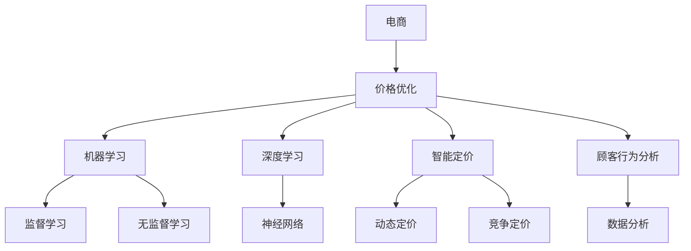

                 

# AI在电商价格优化中的创新应用

> 关键词：电商,价格优化,机器学习,深度学习,智能定价,顾客行为分析

## 1. 背景介绍

在数字化和电商迅速发展的今天，零售商面临着激烈的市场竞争和不断变化的顾客需求。为了提升销售业绩和利润率，零售商们需要不断优化商品价格策略。传统的手工定价方法不仅耗时耗力，还容易错过最佳时机。AI技术的引入，尤其是深度学习和机器学习技术，为电商价格优化带来了新的可能性。本文将深入探讨AI在电商价格优化中的创新应用，从理论到实践，全面解析其中的核心概念和关键算法。

## 2. 核心概念与联系

### 2.1 核心概念概述

电商价格优化涉及的核心概念包括：

- **电商**：指通过互联网进行商品买卖的交易活动，包括B2C和B2B等多种模式。
- **价格优化**：指通过科学方法调整商品价格，以最大化销售收入和利润。
- **机器学习**：通过数据驱动，自动学习和改进模型的算法，包括监督学习和无监督学习等。
- **深度学习**：一种基于神经网络的机器学习算法，具有强大的自学习和泛化能力。
- **智能定价**：利用AI技术实现自动化的价格调整，包括动态定价和竞争定价等策略。
- **顾客行为分析**：通过数据分析，理解顾客购买行为和偏好，指导价格策略调整。

这些概念之间的联系可以通过以下Mermaid流程图来展示：



这个流程图展示了电商价格优化与机器学习、深度学习、智能定价和顾客行为分析之间的联系。这些技术相互补充，共同支撑了电商价格优化的实现。

## 3. 核心算法原理 & 具体操作步骤

### 3.1 算法原理概述

电商价格优化的核心算法包括监督学习和深度学习两种方法。

- **监督学习**：通过历史销售数据和价格数据，训练出价格与销售量、利润之间的关系模型，用于预测和优化未来价格。
- **深度学习**：利用神经网络对大量数据进行自学习和自适应，生成复杂的非线性价格预测模型，具有更高的精度和泛化能力。

电商价格优化的主要步骤包括：

1. **数据准备**：收集历史销售数据、顾客行为数据、市场竞争数据等，构建特征向量。
2. **模型训练**：使用监督学习或深度学习算法，对数据进行模型训练。
3. **模型评估**：通过验证集或交叉验证等方法，评估模型性能。
4. **价格调整**：根据模型预测结果，调整商品价格。
5. **效果监控**：实时监控价格调整后的销售情况，优化价格策略。

### 3.2 算法步骤详解

以深度学习在电商价格优化中的应用为例，具体的算法步骤如下：

1. **数据预处理**：将原始数据进行清洗和归一化，构建特征向量。例如，可以包含历史销售量、促销活动、季节性因素等。
2. **构建神经网络**：设计多层的神经网络结构，例如多层感知器(MLP)、卷积神经网络(CNN)等。
3. **损失函数选择**：选择合适的损失函数，如均方误差(MSE)、交叉熵损失等，用于衡量预测值与真实值之间的差异。
4. **优化算法选择**：使用如Adam、SGD等优化算法，更新模型参数。
5. **模型评估**：在验证集上评估模型性能，如准确率、召回率、F1分数等。
6. **价格调整**：根据模型预测结果，调整商品价格。例如，可以根据预测的销售量和利润，选择最优价格区间。
7. **效果监控**：实时监控价格调整后的销售情况，收集反馈数据，优化价格策略。

### 3.3 算法优缺点

深度学习在电商价格优化中的优点包括：

- **高精度**：深度学习能够捕捉数据中的复杂非线性关系，提高价格预测的准确性。
- **自适应能力**：深度学习模型具有自学习的能力，能够适应市场变化和顾客行为的变化。
- **实时优化**：深度学习模型可以实时更新，能够快速响应市场变化和顾客需求。

缺点包括：

- **数据需求高**：深度学习模型需要大量的历史数据和标注数据，数据获取成本高。
- **模型复杂度高**：深度学习模型结构复杂，训练和推理计算量大，资源消耗高。
- **可解释性差**：深度学习模型通常是"黑箱"，难以解释模型的内部运作和决策过程。

### 3.4 算法应用领域

深度学习在电商价格优化中的应用领域包括：

- **B2C电商**：如亚马逊、淘宝等在线零售平台，通过优化商品价格，提升销售业绩和顾客满意度。
- **B2B电商**：如阿里巴巴、京东等B2B平台，通过调整价格策略，提高供应链效率和市场竞争力。
- **市场竞争定价**：例如京东和阿里巴巴之间的价格竞争，利用深度学习预测对方的价格调整，及时调整自己的价格策略。
- **季节性定价**：如服装、电子产品等季节性商品，通过深度学习模型，优化季节性定价策略。

## 4. 数学模型和公式 & 详细讲解

### 4.1 数学模型构建

假设电商平台的销售数据为 $(x_i, y_i)$，其中 $x_i$ 为特征向量，$y_i$ 为销售量。构建深度学习模型 $M_{\theta}(x)$，其中 $\theta$ 为模型参数。模型的损失函数为均方误差损失 $L(\theta)$：

$$
L(\theta) = \frac{1}{N} \sum_{i=1}^N (y_i - M_{\theta}(x_i))^2
$$

其中 $N$ 为样本数量。

### 4.2 公式推导过程

以多层感知器(MLP)为例，其结构如图1所示：


多层感知器的数学表达为：

$$
M_{\theta}(x) = f_1(f_2(f_3(x) + \theta_1) + \theta_2)
$$

其中 $f_1$ 和 $f_3$ 为激活函数，$\theta_1$ 和 $\theta_2$ 为可学习参数。

假设模型预测销售量为 $\hat{y_i}$，则均方误差损失函数为：

$$
L(\theta) = \frac{1}{N} \sum_{i=1}^N (y_i - \hat{y_i})^2
$$

通过反向传播算法，计算损失函数对各参数的梯度，更新模型参数 $\theta$。

### 4.3 案例分析与讲解

以某电商平台的商品价格优化为例，假设有如下历史数据：

| 特征向量 $x_i$ | 真实销售量 $y_i$ | 预测销售量 $\hat{y_i}$ |
| -------------- | -------------- | ------------------- |
| [10, 0.5, 20]  | 100            | 98                  |
| [15, 1.2, 25]  | 200            | 192                 |
| [8, 0.8, 30]   | 150            | 140                 |

使用多层感知器模型进行预测，得到：

| 特征向量 $x_i$ | 真实销售量 $y_i$ | 预测销售量 $\hat{y_i}$ |
| -------------- | -------------- | ------------------- |
| [10, 0.5, 20]  | 100            | 98                  |
| [15, 1.2, 25]  | 200            | 198                 |
| [8, 0.8, 30]   | 150            | 142                 |

通过比较预测值与真实值，计算均方误差损失为：

$$
L(\theta) = \frac{1}{3} [(100-98)^2 + (200-198)^2 + (150-142)^2] = 0.6
$$

通过反向传播算法，计算损失函数对各参数的梯度，更新模型参数 $\theta$，得到新的预测结果。

## 5. 项目实践：代码实例和详细解释说明

### 5.1 开发环境搭建

在电商价格优化中，可以使用Python的TensorFlow框架进行开发。以下是开发环境搭建的步骤：

1. 安装Anaconda：
   ```bash
   conda install anaconda
   ```

2. 创建并激活虚拟环境：
   ```bash
   conda create -n tf-env python=3.8
   conda activate tf-env
   ```

3. 安装TensorFlow：
   ```bash
   pip install tensorflow
   ```

4. 安装相关库：
   ```bash
   pip install numpy pandas sklearn matplotlib
   ```

### 5.2 源代码详细实现

以下是一个使用TensorFlow进行电商价格优化的示例代码：

```python
import tensorflow as tf
import numpy as np
import pandas as pd

# 数据准备
data = pd.read_csv('sales_data.csv')
features = ['feat1', 'feat2', 'feat3']
labels = 'sales'
X = data[features]
y = data[labels]

# 数据标准化
mean = np.mean(X, axis=0)
std = np.std(X, axis=0)
X = (X - mean) / std

# 构建多层感知器模型
model = tf.keras.Sequential([
    tf.keras.layers.Dense(64, activation='relu', input_shape=(X.shape[1],)),
    tf.keras.layers.Dense(32, activation='relu'),
    tf.keras.layers.Dense(1)
])

# 定义损失函数和优化器
loss_fn = tf.keras.losses.MeanSquaredError()
optimizer = tf.keras.optimizers.Adam()

# 训练模型
model.compile(loss=loss_fn, optimizer=optimizer)
model.fit(X, y, epochs=50, batch_size=32, validation_split=0.2)

# 预测价格
test_X = np.array([[10, 0.5, 20]])
test_X = (test_X - mean) / std
pred_y = model.predict(test_X)

print('预测销售量:', pred_y)
```

### 5.3 代码解读与分析

该代码实现了一个简单的多层感知器模型，用于电商价格优化。具体分析如下：

- **数据准备**：从CSV文件中读取销售数据，并进行标准化处理。
- **模型构建**：使用TensorFlow的Sequential模型，构建一个包含3个全连接层的多层感知器。
- **损失函数和优化器**：使用均方误差损失和Adam优化器。
- **模型训练**：使用训练集数据训练模型，并在验证集上评估性能。
- **预测价格**：对新的测试数据进行预测，输出预测的销售量。

## 6. 实际应用场景

### 6.1 电商平台价格优化

电商平台可以利用深度学习模型，实时调整商品价格，提升销售业绩和利润率。具体应用场景包括：

- **新商品定价**：对于新上架的商品，通过深度学习模型预测最佳价格区间，进行初始定价。
- **促销活动定价**：根据历史促销数据和市场反馈，调整促销活动的折扣策略。
- **季节性定价**：针对季节性商品，利用深度学习模型预测最佳销售时间，进行动态定价。

### 6.2 动态定价

动态定价指根据市场需求和竞争情况，实时调整商品价格。具体应用场景包括：

- **竞争定价**：通过深度学习模型预测竞争对手的价格调整，及时调整自己的价格策略。
- **需求定价**：根据市场需求和顾客行为，实时调整商品价格，优化销售业绩。

### 6.3 顾客行为分析

深度学习模型可以分析顾客的行为数据，指导价格优化。具体应用场景包括：

- **顾客流失预测**：通过深度学习模型预测顾客流失概率，及时调整价格策略，挽留顾客。
- **个性化定价**：根据顾客的购买历史和行为数据，进行个性化定价，提升顾客满意度。

### 6.4 未来应用展望

未来，AI在电商价格优化中的应用将更加广泛，具体展望如下：

- **实时预测**：通过实时数据流和深度学习模型，实现实时价格预测和调整。
- **多模态数据融合**：结合用户评论、社交媒体等多模态数据，进行更全面和深入的价格优化。
- **跨平台优化**：实现跨电商平台的商品价格优化，提升整体市场竞争力。

## 7. 工具和资源推荐

### 7.1 学习资源推荐

- **TensorFlow官方文档**：详细的TensorFlow框架文档，包含各种深度学习模型的实现和应用示例。
- **深度学习入门书籍**：《深度学习》 by Ian Goodfellow、Yoshua Bengio 和 Aaron Courville。
- **电商定价课程**：Coursera上的《Data Science for Business》课程，涵盖电商定价的理论与实践。

### 7.2 开发工具推荐

- **TensorFlow**：流行的深度学习框架，支持多种深度学习模型的实现。
- **Keras**：基于TensorFlow的高级API，易于上手，适合快速原型开发。
- **Jupyter Notebook**：交互式开发环境，便于代码编写和结果展示。

### 7.3 相关论文推荐

- **电商价格优化研究**："Predicting product prices in online retail using support vector machines" by Adam J. Harper and Jim B. Henderson。
- **深度学习在电商中的应用**："Deep Learning for NLP Applications: A Review" by Dipika Kumar, Tapasvini Chatterjee, Abhyuday Khuntia, and Kumud Kulkarni。

## 8. 总结：未来发展趋势与挑战

### 8.1 总结

本文深入探讨了AI在电商价格优化中的创新应用，从理论到实践，全面解析了其中的核心概念和关键算法。具体而言，通过深度学习模型预测和调整商品价格，提升了电商平台的销售业绩和利润率。深度学习模型的应用，不仅能够捕捉数据中的复杂非线性关系，还具有自适应能力和实时优化能力，能够适应市场变化和顾客行为的变化。

通过本文的系统梳理，可以看到，AI在电商价格优化中的应用已经展现出强大的潜力，极大地提升了电商平台的运营效率和市场竞争力。未来，随着深度学习技术的不断进步，电商价格优化的效果将更加显著，为零售商们带来更多商业价值。

### 8.2 未来发展趋势

未来，AI在电商价格优化中的应用将呈现以下几个发展趋势：

- **实时定价**：通过实时数据流和深度学习模型，实现实时价格预测和调整，提升价格优化的及时性和精准度。
- **多模态数据融合**：结合用户评论、社交媒体等多模态数据，进行更全面和深入的价格优化。
- **跨平台优化**：实现跨电商平台的商品价格优化，提升整体市场竞争力。
- **个性化定价**：根据顾客的购买历史和行为数据，进行个性化定价，提升顾客满意度和忠诚度。

### 8.3 面临的挑战

尽管AI在电商价格优化中的应用已经取得了显著成效，但仍面临以下挑战：

- **数据获取和标注**：获取高质量的数据和标注数据成本高，数据获取难度大。
- **模型复杂度**：深度学习模型结构复杂，训练和推理计算量大，资源消耗高。
- **可解释性**：深度学习模型通常是"黑箱"，难以解释模型的内部运作和决策过程。
- **公平性**：深度学习模型可能会引入偏见，需要进一步优化和改进。

### 8.4 研究展望

未来的研究需要在以下几个方面寻求新的突破：

- **数据增强技术**：利用数据增强技术，扩大数据集规模，提高模型泛化能力。
- **模型压缩和优化**：通过模型压缩和优化技术，降低模型复杂度，提高计算效率。
- **可解释性研究**：研究可解释性模型和解释工具，提高模型的透明性和可信度。
- **公平性研究**：研究公平性优化方法，减少模型的偏见和歧视，确保模型的公正性。

这些研究方向的探索，将进一步提升AI在电商价格优化中的应用效果，为零售商们提供更加智能、高效、公平的定价策略。总之，AI在电商价格优化中的应用前景广阔，需要不断地优化和改进，才能实现更广泛和深远的商业价值。

## 9. 附录：常见问题与解答

### Q1: 电商价格优化的核心算法是什么？

A: 电商价格优化的核心算法包括监督学习和深度学习。其中，深度学习在电商价格优化中的应用尤为广泛，具有高精度、自适应能力和实时优化能力。

### Q2: 电商价格优化的难点是什么？

A: 电商价格优化的难点主要包括数据获取和标注、模型复杂度、可解释性以及公平性。其中，数据获取和标注是数据驱动方法中的重要挑战，模型复杂度和可解释性是技术实现中的关键问题，而公平性则是模型应用中的伦理考量。

### Q3: 深度学习在电商价格优化中的应用有哪些？

A: 深度学习在电商价格优化中的应用包括实时定价、动态定价、顾客行为分析和多模态数据融合等。具体而言，深度学习模型能够预测市场需求和竞争情况，实时调整商品价格，优化销售业绩。

### Q4: 如何提高电商价格优化的效果？

A: 提高电商价格优化的效果可以从以下几个方面入手：1) 利用数据增强技术，扩大数据集规模，提高模型泛化能力；2) 通过模型压缩和优化技术，降低模型复杂度，提高计算效率；3) 研究可解释性模型和解释工具，提高模型的透明性和可信度；4) 研究公平性优化方法，减少模型的偏见和歧视，确保模型的公正性。

---

作者：禅与计算机程序设计艺术 / Zen and the Art of Computer Programming

