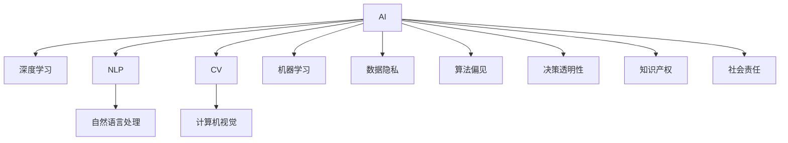

                 

## 1. 背景介绍

### 1.1 问题由来
人工智能(AI)作为一种前沿技术，正逐步渗透到社会的各个层面，从工业制造、金融服务到医疗健康、教育培训，AI的触角无处不在。近年来，深度学习、神经网络等技术的突破性进展，更是加速了AI技术的落地应用。然而，AI技术在带来便捷、高效的同时，也引发了一系列伦理、法律和社会问题。本文旨在探讨AI在社会中的角色与应用，通过分析AI技术的应用场景，揭示其对社会带来的深远影响，并为AI的规范发展提供建议。

### 1.2 问题核心关键点
AI在社会中的角色与应用是一个多维度的议题，涵盖了技术、伦理、法律和社会等多个层面。本文将从以下几个核心关键点进行探讨：

- AI技术的发展趋势及其对社会的影响。
- AI在各个行业中的具体应用案例。
- 与AI相关的伦理问题，包括数据隐私、算法偏见、决策透明性等。
- AI技术面临的法律挑战，如知识产权、责任归属等。
- AI技术的社会影响，包括就业、教育、健康、环境保护等方面。
- 对于AI技术的规范发展，提出建议与对策。

通过深入分析这些关键点，本文旨在为AI技术在社会中的应用提供更全面、系统的理解，同时探索AI技术的未来发展路径，以促进其健康、可持续的成长。

## 2. 核心概念与联系

### 2.1 核心概念概述

- **人工智能(AI)**：指通过计算机算法和数据处理，使机器具备类似人类的智能决策和行为能力。
- **深度学习**：一种基于多层神经网络的机器学习技术，能够自动学习数据特征并进行复杂决策。
- **自然语言处理(NLP)**：使计算机能够理解、处理和生成自然语言的技术。
- **计算机视觉(CV)**：使计算机能够识别、处理和分析图像和视频的技术。
- **机器学习**：通过数据训练模型，使机器能够进行预测、分类和决策。
- **数据隐私**：在处理和分析个人数据时，确保数据安全和用户隐私的保护。
- **算法偏见**：由于训练数据或模型设计不合理，导致AI系统在决策过程中产生的不公平或歧视。
- **决策透明性**：AI决策过程的公开、可解释，以便于审查和监督。
- **知识产权**：AI模型和算法的原创性及其法律保护。
- **社会责任**：AI技术开发者和使用者在应用中应承担的责任和义务。

这些核心概念之间的关系可以通过以下Mermaid流程图来展示：



这个流程图展示了几项核心概念之间的联系：

- AI技术通过深度学习、NLP、CV等子技术，实现复杂的智能决策和行为。
- AI在应用过程中面临数据隐私、算法偏见、决策透明性等伦理问题。
- 知识产权和社会责任是AI技术应用中不可忽视的法律和道德问题。

这些概念共同构成了AI技术在社会中应用的框架，为进一步分析提供了理论基础。

## 3. 核心算法原理 & 具体操作步骤
### 3.1 算法原理概述

AI技术的应用，主要依赖于其核心算法——机器学习算法。机器学习通过训练模型，使计算机能够从数据中学习规律，并进行预测、分类和决策。常用的机器学习算法包括监督学习、非监督学习和强化学习等。

以监督学习为例，其基本流程如下：

1. 数据准备：收集并预处理数据，包括数据清洗、特征工程等。
2. 模型选择：根据任务特点选择合适的模型，如线性回归、决策树、支持向量机等。
3. 模型训练：使用训练集数据，通过梯度下降等优化算法，训练模型参数。
4. 模型评估：使用验证集和测试集数据，评估模型的性能，如准确率、召回率等。
5. 模型部署：将训练好的模型部署到实际应用中，进行预测和决策。

### 3.2 算法步骤详解

以监督学习为例，其具体步骤包括：

1. 数据预处理：对原始数据进行清洗、去噪、归一化等处理，确保数据质量。
2. 特征工程：选择合适的特征，并进行特征提取和转换，以提高模型性能。
3. 模型训练：使用训练集数据，通过梯度下降等优化算法，调整模型参数，使其拟合数据规律。
4. 模型评估：使用验证集数据，评估模型性能，调整超参数，防止过拟合。
5. 模型部署：将训练好的模型部署到生产环境，进行实际应用。

### 3.3 算法优缺点

监督学习算法具有以下优点：

- 数据驱动：能够从数据中学习规律，适用于各类预测和分类任务。
- 结果可解释：通过特征和模型参数，可解释模型决策过程。
- 应用广泛：广泛应用于金融、医疗、电商等多个领域。

同时，监督学习算法也存在以下缺点：

- 数据依赖：需要大量高质量标注数据，标注成本高。
- 泛化能力有限：对训练数据分布过拟合，泛化能力差。
- 解释性不足：模型决策过程复杂，难以解释。

### 3.4 算法应用领域

监督学习算法广泛应用于金融风险评估、医疗诊断、电商推荐等多个领域。例如，在金融领域，通过监督学习算法，可以对客户信用进行评估，预测客户违约概率，从而降低坏账风险。在医疗领域，监督学习算法可以对疾病进行早期诊断，提高诊疗准确率。在电商领域，监督学习算法可以对用户行为进行预测，推荐个性化商品，提高用户满意度。

## 4. 数学模型和公式 & 详细讲解 & 举例说明

### 4.1 数学模型构建

监督学习算法基于统计学习方法，通过最小化损失函数，优化模型参数。以线性回归模型为例，其数学模型构建如下：

设训练集为 $(x_i, y_i), i=1,2,\ldots,n$，其中 $x_i \in \mathbb{R}^d$ 为输入特征，$y_i \in \mathbb{R}$ 为输出目标。线性回归模型的目标是最小化预测值与真实值之间的平方误差，即：

$$
\min_{\theta} \sum_{i=1}^n (y_i - \theta^T x_i)^2
$$

其中 $\theta \in \mathbb{R}^d$ 为模型参数。

### 4.2 公式推导过程

根据上述目标函数，可以求得线性回归模型的梯度下降算法如下：

1. 初始化模型参数 $\theta_0$。
2. 对于每个样本 $(x_i, y_i)$，计算梯度 $\nabla_{\theta} L_i = (y_i - \theta_0^T x_i)x_i$。
3. 更新模型参数：$\theta_{t+1} = \theta_t - \alpha \nabla_{\theta} L_i$，其中 $\alpha$ 为学习率。
4. 重复步骤2-3，直至收敛。

### 4.3 案例分析与讲解

以预测房价为例，假设有一组历史房价数据 $(x_i, y_i)$，其中 $x_i = (area_i, rooms_i, location_i)$ 为特征，$y_i$ 为目标房价。使用线性回归模型进行预测时，可以通过训练集数据 $(x_i, y_i)$ 拟合模型参数 $\theta$，从而对新输入数据 $x$ 进行房价预测。

## 5. 项目实践：代码实例和详细解释说明

### 5.1 开发环境搭建

在进行AI项目实践前，需要搭建好开发环境。以下是使用Python进行TensorFlow开发的示例：

1. 安装Anaconda：从官网下载并安装Anaconda，用于创建独立的Python环境。
2. 创建并激活虚拟环境：
```bash
conda create -n tf-env python=3.8 
conda activate tf-env
```
3. 安装TensorFlow：根据CUDA版本，从官网获取对应的安装命令。例如：
```bash
conda install tensorflow -c conda-forge -c pypi -c pytorch -c anaconda
```
4. 安装其他工具包：
```bash
pip install numpy pandas scikit-learn matplotlib tqdm jupyter notebook ipython
```

### 5.2 源代码详细实现

以下是一个使用TensorFlow进行线性回归的示例代码：

```python
import tensorflow as tf
import numpy as np
import matplotlib.pyplot as plt

# 生成样本数据
x = np.random.rand(100, 2)
y = x[:,0] * 2 + x[:,1] + np.random.normal(size=100) / 10

# 定义模型
model = tf.keras.Sequential([
    tf.keras.layers.Dense(1, input_shape=(2,))
])

# 编译模型
model.compile(optimizer=tf.keras.optimizers.Adam(0.01), loss='mse')

# 训练模型
model.fit(x, y, epochs=100, batch_size=32)

# 预测
x_test = np.array([[0.5, 0.5], [1.5, 1.5]])
y_pred = model.predict(x_test)

# 可视化
plt.scatter(x[:, 0], y)
plt.plot(x_test[:, 0], y_pred, color='r')
plt.show()
```

### 5.3 代码解读与分析

**样本数据生成**：
- 使用NumPy生成100个二维随机数据点，作为输入特征 $x$。
- 根据线性关系 $y = 2x_1 + x_2 + \epsilon$，生成对应的目标值 $y$，其中 $\epsilon$ 为随机噪声。

**模型定义与编译**：
- 使用TensorFlow定义一个包含1个神经元的全连接层，作为线性回归模型。
- 使用Adam优化器和均方误差损失函数编译模型。

**模型训练**：
- 使用训练集数据 $(x, y)$ 进行模型训练，设定100个epochs和32个batch size。
- 在每个epoch结束后，模型输出训练集上的损失值和精度。

**模型预测与可视化**：
- 使用测试集数据 $x_{test}$ 进行模型预测。
- 使用Matplotlib绘制预测结果，直观展示模型拟合效果。

## 6. 实际应用场景

### 6.1 金融风控

在金融领域，AI技术广泛应用于风险评估、欺诈检测和信用评分等任务。通过监督学习算法，金融机构可以对客户的信用历史、交易行为等数据进行分析，预测客户的违约风险和信用评分，从而做出更加精准的贷款决策。

### 6.2 医疗诊断

AI技术在医疗领域的应用也日益广泛。通过监督学习算法，可以对医学影像数据进行分类和分析，辅助医生进行疾病诊断和治疗决策。例如，使用卷积神经网络(CNN)对医学影像进行分类，可以准确识别出肿瘤、病变等病灶。

### 6.3 智能客服

AI技术在智能客服中的应用也极为广泛。通过自然语言处理和机器学习算法，智能客服系统能够理解和回复客户咨询，提供高效、准确的客户服务。例如，使用BERT等大模型进行微调，可以实现多轮对话理解和生成，提高客服系统的交互体验和智能化水平。

### 6.4 未来应用展望

未来，AI技术将在更多领域得到广泛应用，进一步改变人类的生活方式和社会结构。例如，在智慧城市中，AI技术可以用于交通管理、环境监测和灾害预警等任务，提升城市的智能化水平。在教育领域，AI技术可以用于个性化学习、智能答疑和教育管理等，提供更加高效、个性化的教育体验。

## 7. 工具和资源推荐

### 7.1 学习资源推荐

为了帮助开发者系统掌握AI技术，这里推荐一些优质的学习资源：

1. 《深度学习》课程：由吴恩达教授主讲的Coursera课程，涵盖深度学习的基础理论和实践技能。
2. 《动手学深度学习》书籍：由李沐等作者编写，详细介绍了深度学习的理论和实践，包括TensorFlow和PyTorch等框架的使用。
3. 《Python机器学习》书籍：由Sebastian Raschka编写，涵盖了机器学习的各种算法和技术。
4. Kaggle竞赛：Kaggle平台上有大量的机器学习和深度学习竞赛，可以实践和提高AI技术的应用能力。
5. arXiv预印本库：包含大量的AI领域的研究论文，可以及时了解最新的AI研究成果和技术进展。

### 7.2 开发工具推荐

高效的开发离不开优秀的工具支持。以下是几款用于AI开发的常用工具：

1. TensorFlow：由Google主导开发的开源深度学习框架，支持分布式计算和GPU加速，适合大规模工程应用。
2. PyTorch：Facebook开源的深度学习框架，灵活动态的计算图，适合快速迭代研究。
3. Scikit-learn：Python数据科学库，包含多种机器学习算法和工具，适合数据预处理和模型训练。
4. Keras：高层神经网络API，基于TensorFlow和Theano等底层框架，适合快速搭建和调试模型。
5. Jupyter Notebook：基于Python的交互式编程环境，支持数据可视化、代码执行和结果展示。

合理利用这些工具，可以显著提升AI开发效率，加速研究进展。

### 7.3 相关论文推荐

AI技术的发展离不开学界的持续研究。以下是几篇奠基性的相关论文，推荐阅读：

1. AlexNet: ImageNet Classification with Deep Convolutional Neural Networks：提出卷积神经网络(CNN)，用于图像分类任务。
2. Deep Residual Learning for Image Recognition：提出残差网络，解决深度网络训练过程中的梯度消失问题。
3. Using Very Large Datasets to Train Convolutional Networks：提出大规模数据训练CNN的策略，提高模型性能。
4. Attention is All You Need：提出Transformer结构，开启NLP领域的大模型时代。
5. Generative Adversarial Nets：提出生成对抗网络(GAN)，用于生成图像、文本等任务。

这些论文代表了大模型和深度学习技术的发展脉络，通过学习这些前沿成果，可以帮助研究者把握学科前进方向，激发更多的创新灵感。

## 8. 总结：未来发展趋势与挑战

### 8.1 总结

本文对AI技术在社会中的角色与应用进行了全面系统的介绍。首先阐述了AI技术的发展趋势及其对社会的影响，明确了AI技术在金融、医疗、智能客服等多个领域的应用前景。其次，通过分析AI技术在实际应用中面临的伦理、法律和社会问题，揭示了AI技术在落地过程中可能带来的一系列挑战。最后，提出了对AI技术规范发展的建议，希望通过社会各界的共同努力，推动AI技术健康、可持续的发展。

通过本文的系统梳理，可以看到，AI技术在社会中的角色已经从研究实验走向实际应用，极大地提升了各行各业的智能化水平。未来，伴随AI技术的持续演进，相信将有更多领域受益于AI的智慧光芒，人类社会也将迈向更加智能化、高效化的发展阶段。

### 8.2 未来发展趋势

展望未来，AI技术将在以下方面呈现新的发展趋势：

1. 深度学习模型的规模和复杂度将进一步提升，模型的自适应能力和泛化性能将显著提高。
2. 自然语言处理技术的成熟，将使AI在更多领域实现多模态信息的融合，提升系统的智能水平。
3. 数据驱动的AI技术将更加依赖于高质量数据，数据隐私和安全问题将更加凸显。
4. 算法偏见和决策透明性问题将引发更多关注，伦理和社会责任将成为AI技术应用的重要考量因素。
5. AI技术的应用范围将进一步扩大，涵盖更多垂直行业，带来更广泛的社会变革。

这些趋势表明，AI技术的发展将不断深化，对社会各领域的影响将更加深远和广泛。

### 8.3 面临的挑战

尽管AI技术在各行各业中取得了显著成效，但在迈向智能化社会的过程中，仍面临诸多挑战：

1. 数据隐私和安全问题。AI技术的广泛应用，使得数据隐私和安全成为重要议题。如何保护个人数据，防止数据滥用和泄露，是亟待解决的问题。
2. 算法偏见和公平性问题。AI系统在决策过程中可能产生偏见和歧视，如何确保算法的公正性和公平性，是必须面对的难题。
3. 技术透明性和可解释性问题。AI系统往往具有"黑盒"特性，难以解释其决策过程，如何在保证性能的同时，增强模型的透明性和可解释性，是研究者面临的重要挑战。
4. 伦理和社会责任问题。AI技术的广泛应用，可能带来一系列伦理和社会问题，如就业替代、社会不公等，如何规范AI技术的应用，保障社会公平，是重要议题。
5. 法律法规的滞后性问题。AI技术的快速发展，使得现有的法律法规难以跟上技术变革的步伐，如何在法律框架下规范AI技术的应用，是亟需解决的问题。

这些挑战亟需社会各界的共同努力，才能确保AI技术的健康、可持续发展。

### 8.4 研究展望

未来，AI技术的研究方向将围绕以下几个方面进行：

1. 数据隐私和安全的保护。开发更高效的数据加密和匿名化技术，确保数据隐私和安全。
2. 算法的透明性和可解释性。通过引入因果分析和对抗性学习，增强AI系统的透明性和可解释性，提高算法的公正性和可信度。
3. 伦理和社会责任的规范。制定AI技术应用规范，保障社会公平和伦理道德。
4. 多模态数据的融合和协同。研究如何融合视觉、语音、文本等多种模态数据，提升AI系统的智能水平。
5. 大规模模型的压缩和优化。开发高效压缩和优化技术，降低模型的资源消耗，提升系统的实时性和可扩展性。

通过这些研究方向的研究和实践，AI技术将不断提升其智能化水平和社会影响力，为构建更智慧、更公平、更安全的社会做出更大贡献。

## 9. 附录：常见问题与解答

**Q1: AI技术的发展趋势有哪些？**

A: AI技术的发展趋势主要包括以下几个方面：

1. 深度学习模型的规模和复杂度将进一步提升，模型的自适应能力和泛化性能将显著提高。
2. 自然语言处理技术的成熟，将使AI在更多领域实现多模态信息的融合，提升系统的智能水平。
3. 数据驱动的AI技术将更加依赖于高质量数据，数据隐私和安全问题将更加凸显。
4. 算法偏见和公平性问题将引发更多关注，伦理和社会责任将成为AI技术应用的重要考量因素。
5. AI技术的应用范围将进一步扩大，涵盖更多垂直行业，带来更广泛的社会变革。

**Q2: AI技术在实际应用中面临哪些伦理问题？**

A: AI技术在实际应用中面临的伦理问题主要包括：

1. 数据隐私问题：AI系统需要大量数据进行训练和优化，如何保护个人数据隐私，防止数据滥用和泄露，是一个重要议题。
2. 算法偏见问题：由于训练数据和算法设计的不合理，AI系统可能在决策过程中产生偏见和歧视，导致不公正的输出。
3. 决策透明性问题：AI系统的决策过程具有"黑盒"特性，难以解释其决策逻辑，这在金融、医疗等高风险领域尤为重要。
4. 社会责任问题：AI技术的应用可能带来一系列伦理和社会问题，如就业替代、社会不公等，如何规范AI技术的应用，保障社会公平，是重要议题。

**Q3: AI技术的应用前景有哪些？**

A: AI技术在各行业中的应用前景广泛，主要包括：

1. 金融领域：用于风险评估、欺诈检测和信用评分等任务，提升金融决策的准确性和效率。
2. 医疗领域：用于医学影像分类、疾病诊断和治疗决策等任务，提高医疗服务的智能化水平。
3. 智能客服：用于多轮对话理解和生成，提供高效、个性化的客户服务。
4. 智慧城市：用于交通管理、环境监测和灾害预警等任务，提升城市的智能化水平。
5. 教育领域：用于个性化学习、智能答疑和教育管理等，提供更加高效、个性化的教育体验。

**Q4: 如何进行AI技术的应用实践？**

A: AI技术的应用实践通常包括以下几个步骤：

1. 数据收集和预处理：收集并预处理数据，包括数据清洗、去噪、归一化等处理，确保数据质量。
2. 模型选择和设计：根据任务特点选择合适的模型，如线性回归、卷积神经网络(CNN)、循环神经网络(RNN)等，并进行模型设计。
3. 模型训练和评估：使用训练集数据进行模型训练，并使用验证集和测试集数据评估模型性能。
4. 模型部署和优化：将训练好的模型部署到实际应用中，并进行优化和调参，提升模型性能和可解释性。

**Q5: AI技术的发展过程中面临哪些挑战？**

A: AI技术的发展过程中面临的挑战主要包括：

1. 数据隐私和安全问题：AI系统的广泛应用，使得数据隐私和安全成为重要议题。如何保护个人数据，防止数据滥用和泄露，是亟待解决的问题。
2. 算法偏见和公平性问题：AI系统在决策过程中可能产生偏见和歧视，如何确保算法的公正性和公平性，是必须面对的难题。
3. 技术透明性和可解释性问题：AI系统往往具有"黑盒"特性，难以解释其决策过程，如何在保证性能的同时，增强模型的透明性和可解释性，是研究者面临的重要挑战。
4. 伦理和社会责任问题：AI技术的广泛应用，可能带来一系列伦理和社会问题，如就业替代、社会不公等，如何规范AI技术的应用，保障社会公平，是重要议题。
5. 法律法规的滞后性问题：AI技术的快速发展，使得现有的法律法规难以跟上技术变革的步伐，如何在法律框架下规范AI技术的应用，是亟需解决的问题。

**Q6: AI技术的未来发展方向有哪些？**

A: AI技术的未来发展方向主要包括以下几个方面：

1. 数据隐私和安全的保护：开发更高效的数据加密和匿名化技术，确保数据隐私和安全。
2. 算法的透明性和可解释性：通过引入因果分析和对抗性学习，增强AI系统的透明性和可解释性，提高算法的公正性和可信度。
3. 伦理和社会责任的规范：制定AI技术应用规范，保障社会公平和伦理道德。
4. 多模态数据的融合和协同：研究如何融合视觉、语音、文本等多种模态数据，提升AI系统的智能水平。
5. 大规模模型的压缩和优化：开发高效压缩和优化技术，降低模型的资源消耗，提升系统的实时性和可扩展性。

通过这些研究方向的研究和实践，AI技术将不断提升其智能化水平和社会影响力，为构建更智慧、更公平、更安全的社会做出更大贡献。

