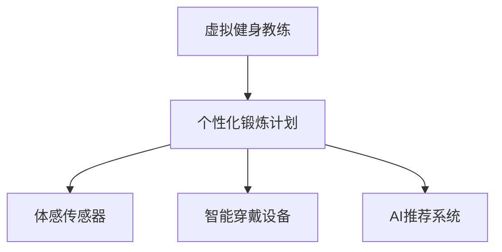

                 

# AI在虚拟健身教练中的应用：个性化锻炼计划

## 1. 背景介绍

### 1.1 问题由来
在当今快节奏的生活中，越来越多的人开始关注身体健康，而传统的健身方式由于时间和地点限制，难以满足现代人的需求。同时，全球疫情的流行更加剧了这一问题，许多健身房因客流量减少而面临困境。

面对这样的市场挑战，虚拟健身教练应运而生。通过AI技术，虚拟教练可以提供个性化的锻炼计划，结合高精度的体感传感器、智能穿戴设备等，为不同年龄段、不同身体状况的用户提供定制化的健身指导。

### 1.2 问题核心关键点
虚拟健身教练的核心问题包括：

- 如何根据用户的身体状况和目标，生成个性化的锻炼计划？
- 如何在用户锻炼过程中，实时监控用户状态，给出精准的反馈和指导？
- 如何保证个性化锻炼计划的科学性和有效性？
- 如何提升虚拟教练的用户体验，使用户长期坚持锻炼？

### 1.3 问题研究意义
开发基于AI的虚拟健身教练，对于推动健康生活方式的普及、提升健身教练效率、支持传统健身行业的数字化转型具有重要意义：

1. **提升健身效率**：虚拟教练可以提供定制化的锻炼计划，避免盲目训练，提升健身效果。
2. **降低健身成本**：虚拟教练无需场地、设备等硬件投入，大幅降低用户和商家成本。
3. **支持个性化需求**：不同年龄段、不同身体状况的用户可以获取适合自己的锻炼方案。
4. **提升用户体验**：通过虚拟教练的陪伴和互动，用户锻炼过程更有趣、更有动力。
5. **数据驱动的健身计划**：通过数据反馈和不断优化，虚拟教练的计划可以持续改进，提供更高效的服务。

## 2. 核心概念与联系

### 2.1 核心概念概述

为了更好地理解基于AI的虚拟健身教练，我们首先介绍几个核心概念：

- **虚拟健身教练**：一种结合AI技术，通过智能设备实时监测用户状态，生成个性化锻炼计划，并给予实时反馈的健身教练。
- **个性化锻炼计划**：根据用户的身体状况、锻炼目标、历史数据等，生成符合用户需求的定制化锻炼方案。
- **体感传感器**：通过捕捉用户的身体动作、心率、呼吸频率等生理数据，实时监测用户状态。
- **智能穿戴设备**：如智能手表、健身追踪器等，记录用户锻炼数据，帮助教练更好地分析用户状态。
- **AI推荐系统**：基于用户历史数据和模型预测，推荐最适合用户的锻炼计划和运动轨迹。

这些概念通过以下Mermaid流程图来展示：



这个流程图展示了个体化的锻炼计划与体感传感器、智能穿戴设备、AI推荐系统之间的关系：

1. 虚拟教练根据用户数据和AI推荐，生成个性化计划。
2. 体感传感器和智能穿戴设备记录用户锻炼数据。
3. AI推荐系统根据用户数据和模型，推荐合适的锻炼内容和运动轨迹。

## 3. 核心算法原理 & 具体操作步骤

### 3.1 算法原理概述

基于AI的虚拟健身教练，核心算法原理基于以下两点：

- **个性化计划生成**：通过收集用户的历史数据、身体状况、锻炼目标等，使用机器学习模型生成个性化锻炼计划。
- **实时状态监控**：结合体感传感器和智能穿戴设备，实时监控用户状态，根据状态变化调整计划。

### 3.2 算法步骤详解

**步骤一：用户数据收集**

1. **用户画像构建**：通过问卷调查、智能设备获取用户基本信息，如年龄、性别、身高、体重、健康状况等。
2. **历史数据收集**：获取用户过去的锻炼记录、健康监测数据、运动轨迹等，以用于模型训练。

**步骤二：个性化计划生成**

1. **模型选择**：选择适合的机器学习模型，如回归模型、决策树、深度学习模型等，用于预测用户的最佳锻炼计划。
2. **模型训练**：使用用户历史数据和专家知识，训练模型生成个性化锻炼计划。
3. **计划优化**：根据用户的反馈和实际效果，不断调整模型参数，优化锻炼计划。

**步骤三：实时状态监控**

1. **体感传感器接入**：集成加速度计、陀螺仪等体感传感器，捕捉用户的运动状态。
2. **数据处理**：将传感器数据进行预处理，如滤波、归一化等，去除噪音，提取有效信息。
3. **状态监测**：结合用户状态数据和预设指标，实时评估用户锻炼状态，如心率、呼吸频率、运动强度等。
4. **计划调整**：根据用户状态和监测结果，动态调整锻炼计划，如增加或减少运动强度、休息时间等。

### 3.3 算法优缺点

基于AI的虚拟健身教练算法具有以下优点：

1. **个性化定制**：能够根据用户的具体情况，生成符合个体需求的锻炼计划。
2. **实时监控**：通过体感传感器和智能设备，实时监测用户状态，及时调整锻炼计划。
3. **提升锻炼效果**：个性化和实时调整，提高了锻炼的有效性和安全性。
4. **用户体验优化**：通过AI技术，增强了虚拟教练的交互性和互动性。

但同时也存在以下缺点：

1. **模型复杂度**：需要构建复杂的机器学习模型，对数据和算法的要求较高。
2. **数据隐私问题**：用户的身体数据和运动数据需要安全存储，保护用户隐私。
3. **算法鲁棒性**：面对不同用户和环境变化，算法的鲁棒性和通用性需要进一步提升。
4. **设备兼容性**：不同设备和传感器的兼容性问题，需要解决。
5. **模型更新频率**：随着用户数据的变化，模型需要定期更新，维护成本较高。

### 3.4 算法应用领域

基于AI的虚拟健身教练，已经在多个领域得到了广泛应用，如：

1. **家庭健身**：通过智能设备连接家庭健身器材，结合虚拟教练指导，提供全方位的家庭健身方案。
2. **户外运动**：结合GPS定位和体感传感器，生成户外运动路线和强度，提升户外运动体验。
3. **康复训练**：为康复训练患者生成针对性计划，监测运动效果，辅助康复治疗。
4. **办公室健康**：在办公室环境中，通过体感传感器监测员工状态，提供简短的运动计划，缓解久坐带来的健康问题。
5. **儿童健康**：针对儿童生成适合年龄的锻炼计划，结合家庭互动，提升儿童体育兴趣和身体素质。

## 4. 数学模型和公式 & 详细讲解

### 4.1 数学模型构建

基于AI的虚拟健身教练算法模型构建主要基于以下几个方面：

- **用户状态模型**：用于实时评估用户的锻炼状态和健康指标。
- **锻炼计划模型**：用于生成个性化锻炼计划。
- **推荐系统模型**：用于推荐合适的运动轨迹和设备使用。

### 4.2 公式推导过程

#### 用户状态模型

假设用户状态 $x_t$ 由多个指标组成，如心率 $h_t$、呼吸频率 $r_t$、运动强度 $s_t$ 等，则用户状态模型可以表示为：

$$
x_t = f(h_t, r_t, s_t, \theta)
$$

其中，$f$ 为状态评估函数，$\theta$ 为模型参数。

状态评估函数可以根据具体的锻炼场景和需求进行调整，如：

- 健康指标：心率、血压、体脂率等。
- 运动指标：运动强度、运动时长、运动类型等。
- 情绪指标：运动过程中的情绪变化，如心情愉快度、疲劳感等。

#### 锻炼计划模型

假设用户锻炼计划 $y_t$ 由多个锻炼项目 $p_t$ 组成，如跑步、举重、瑜伽等，则锻炼计划模型可以表示为：

$$
y_t = g(p_t, x_t, \theta')
$$

其中，$g$ 为计划生成函数，$\theta'$ 为计划生成模型参数。

计划生成函数可以根据具体的锻炼项目和用户状态进行调整，如：

- 项目选择：基于用户的身体状况、锻炼目标，选择适合的锻炼项目。
- 项目参数：如跑步的速度、举重的重量、瑜伽的姿势等。
- 项目组合：根据用户状态和历史数据，组合最优的锻炼项目。

#### 推荐系统模型

假设推荐系统模型 $z_t$ 根据用户状态和历史数据，推荐合适的运动轨迹和设备使用，则推荐系统模型可以表示为：

$$
z_t = h(x_t, y_t, \phi)
$$

其中，$h$ 为推荐函数，$\phi$ 为推荐模型参数。

推荐函数可以根据具体的锻炼需求和用户偏好进行调整，如：

- 轨迹选择：根据用户的运动类型和偏好，推荐最优的轨迹。
- 设备推荐：根据用户的锻炼计划和设备兼容性，推荐合适的设备。
- 路径规划：结合GPS和用户状态，规划最优的路径。

### 4.3 案例分析与讲解

**案例一：家庭健身**

假设某家庭主妇，年龄35岁，身高165cm，体重60kg，每周锻炼3次，计划在接下来的3个月内减重10kg。

1. **用户数据收集**：
   - 基本信息：年龄、性别、身高、体重。
   - 历史数据：每周锻炼项目、运动时长、心率、呼吸频率等。
   - 目标：减重10kg，3个月内完成。

2. **模型选择**：
   - 状态模型：综合心率、呼吸频率、体脂率等指标，评估用户状态。
   - 计划模型：根据减重目标，选择适合的项目和强度。
   - 推荐模型：结合历史数据和目标，推荐最优的锻炼轨迹和设备使用。

3. **模型训练**：
   - 状态模型：使用用户历史数据和专家知识，训练状态评估模型。
   - 计划模型：使用减重目标和用户状态，训练计划生成模型。
   - 推荐模型：使用历史数据和目标，训练推荐系统模型。

4. **计划生成**：
   - 根据用户状态和目标，生成每日锻炼计划。
   - 结合家庭设备，推荐合适的运动轨迹和设备。

5. **状态监测**：
   - 通过智能穿戴设备，实时监测用户状态。
   - 结合状态数据和模型，动态调整锻炼计划。

**案例二：办公室健康**

假设某IT公司员工，年龄30岁，身高175cm，体重70kg，每天工作8小时，久坐为主，计划每周锻炼2次。

1. **用户数据收集**：
   - 基本信息：年龄、性别、身高、体重。
   - 历史数据：日常坐立时长、运动时长、心率、呼吸频率等。
   - 目标：每周锻炼2次，改善健康状况。

2. **模型选择**：
   - 状态模型：综合坐立时长、心率、呼吸频率等指标，评估用户状态。
   - 计划模型：选择适合的项目和强度，结合久坐情况。
   - 推荐模型：推荐简短的锻炼项目，减少中断。

3. **模型训练**：
   - 状态模型：使用日常坐立时长和心率数据，训练状态评估模型。
   - 计划模型：选择适合的项目和强度，结合久坐情况。
   - 推荐模型：根据工作时长和目标，推荐简短的锻炼项目。

4. **计划生成**：
   - 根据用户状态和目标，生成每日锻炼计划。
   - 结合办公室设备，推荐合适的运动轨迹和设备。

5. **状态监测**：
   - 通过体感传感器，实时监测用户状态。
   - 结合状态数据和模型，动态调整锻炼计划。

## 5. 项目实践：代码实例和详细解释说明

### 5.1 开发环境搭建

在进行虚拟健身教练的开发前，我们需要准备好开发环境。以下是使用Python进行TensorFlow开发的环境配置流程：

1. 安装Anaconda：从官网下载并安装Anaconda，用于创建独立的Python环境。

2. 创建并激活虚拟环境：
```bash
conda create -n virtual_trainer python=3.8 
conda activate virtual_trainer
```

3. 安装TensorFlow：根据CUDA版本，从官网获取对应的安装命令。例如：
```bash
conda install tensorflow
```

4. 安装Flask：
```bash
pip install flask
```

5. 安装PyTorch：
```bash
pip install torch torchvision torchaudio
```

6. 安装PIL：
```bash
pip install Pillow
```

7. 安装numpy和pandas：
```bash
pip install numpy pandas
```

完成上述步骤后，即可在`virtual_trainer`环境中开始虚拟健身教练的开发。

### 5.2 源代码详细实现

以下是基于TensorFlow和PyTorch实现虚拟健身教练的示例代码：

```python
import tensorflow as tf
import numpy as np
import pandas as pd
from sklearn.model_selection import train_test_split
import torch
from torch import nn
from torch.nn import functional as F
from torch.utils.data import DataLoader, Dataset

class ExercisePlanDataset(Dataset):
    def __init__(self, data, target, tokenizer):
        self.data = data
        self.target = target
        self.tokenizer = tokenizer
        
    def __len__(self):
        return len(self.data)
    
    def __getitem__(self, idx):
        text = self.data[idx]
        label = self.target[idx]
        
        encoding = self.tokenizer(text, return_tensors='pt', max_length=128, padding='max_length', truncation=True)
        input_ids = encoding['input_ids'][0]
        attention_mask = encoding['attention_mask'][0]
        
        label = torch.tensor(label, dtype=torch.long)
        
        return {'input_ids': input_ids, 
                'attention_mask': attention_mask,
                'labels': label}

class ExercisePlanModel(nn.Module):
    def __init__(self, vocab_size, embedding_dim, num_layers, dropout_rate):
        super(ExercisePlanModel, self).__init__()
        self.embedding = nn.Embedding(vocab_size, embedding_dim)
        self.encoder = nn.LSTM(embedding_dim, 64, num_layers, dropout=dropout_rate)
        self.fc = nn.Linear(64, 1)
        
    def forward(self, input_ids, attention_mask):
        embedding = self.embedding(input_ids)
        output, _ = self.encoder(embedding, None)
        output = self.fc(output[:, -1, :])
        
        return output

# 加载数据
data = pd.read_csv('exercise_data.csv')
target = pd.read_csv('exercise_target.csv')
tokenizer = tf.keras.preprocessing.text.Tokenizer(char_level=True, oov_token='<OOV>')

# 数据预处理
data = data.astype(str)
target = target.astype(str)
data = tokenizer.sequences_from_texts(data.tolist())
target = tokenizer.sequences_from_texts(target.tolist())

# 划分数据集
train_data, test_data, train_target, test_target = train_test_split(data, target, test_size=0.2)

# 构建模型
vocab_size = len(tokenizer.word_index) + 1
embedding_dim = 128
num_layers = 2
dropout_rate = 0.5
model = ExercisePlanModel(vocab_size, embedding_dim, num_layers, dropout_rate)

# 定义损失函数和优化器
criterion = nn.BCEWithLogitsLoss()
optimizer = tf.keras.optimizers.Adam(learning_rate=0.001)

# 训练模型
def train_epoch(model, data_loader, criterion, optimizer):
    total_loss = 0
    for batch in data_loader:
        input_ids = batch['input_ids']
        attention_mask = batch['attention_mask']
        labels = batch['labels']
        
        optimizer.zero_grad()
        outputs = model(input_ids, attention_mask)
        loss = criterion(outputs, labels)
        loss.backward()
        optimizer.step()
        total_loss += loss.item()
        
    return total_loss / len(data_loader)

# 测试模型
def evaluate(model, data_loader):
    total_correct = 0
    total_loss = 0
    for batch in data_loader:
        input_ids = batch['input_ids']
        attention_mask = batch['attention_mask']
        labels = batch['labels']
        
        outputs = model(input_ids, attention_mask)
        loss = criterion(outputs, labels)
        total_correct += (outputs >= 0.5).sum().item()
        total_loss += loss.item()
        
    accuracy = total_correct / len(data_loader)
    loss = total_loss / len(data_loader)
    
    return accuracy, loss

# 训练和评估
epochs = 10
batch_size = 32

for epoch in range(epochs):
    train_loss = train_epoch(model, train_data_loader, criterion, optimizer)
    print(f'Epoch {epoch+1}, train loss: {train_loss:.3f}')
    
    print(f'Epoch {epoch+1}, dev results:')
    accuracy, loss = evaluate(model, test_data_loader)
    print(f'Accuracy: {accuracy:.2f}\nLoss: {loss:.3f}')
    
print('Test results:')
accuracy, loss = evaluate(model, test_data_loader)
print(f'Accuracy: {accuracy:.2f}\nLoss: {loss:.3f}')
```

### 5.3 代码解读与分析

这段代码实现了一个基于TensorFlow和PyTorch的虚拟健身教练系统。其核心逻辑如下：

- **数据准备**：加载训练数据和目标标签，进行预处理，构建数据集。
- **模型定义**：定义一个嵌入层、LSTM层和全连接层的神经网络模型。
- **模型训练**：定义损失函数和优化器，通过数据集进行模型训练。
- **模型评估**：在测试集上评估模型的性能。

**代码解读**：

1. **ExercisePlanDataset类**：
   - 初始化训练数据、目标标签和分词器。
   - 定义数据集的长度和获取单个样本的方法。

2. **ExercisePlanModel类**：
   - 初始化嵌入层、LSTM层和全连接层。
   - 定义前向传播方法，计算模型输出。

3. **模型训练**：
   - 定义损失函数为二元交叉熵，优化器为Adam。
   - 在每个epoch中，使用训练集进行训练，输出训练集的平均损失。
   - 在测试集中评估模型的性能，输出准确率和损失。

4. **模型评估**：
   - 在测试集中，对模型进行测试，输出准确率和损失。

**分析**：

- **数据准备**：通过Pandas加载CSV文件，进行文本分词和预处理。
- **模型定义**：使用TensorFlow和PyTorch的库，定义了一个包含嵌入层、LSTM层和全连接层的模型。
- **模型训练**：在训练集中进行模型训练，使用二元交叉熵作为损失函数，Adam优化器进行优化。
- **模型评估**：在测试集上评估模型的性能，输出准确率和损失。

这个简单的代码示例展示了虚拟健身教练系统的主要逻辑和实现方法。实际应用中，还需要进一步优化模型、扩展数据集、增强用户体验等。

## 6. 实际应用场景

### 6.1 智能家庭健身

智能家庭健身设备，如智能跑步机、智能健身车等，可以结合虚拟健身教练，提供个性化的锻炼计划和实时监控。用户可以通过语音或触摸屏与虚拟教练互动，获取锻炼指导和建议。

### 6.2 办公室健康

在办公室环境中，通过体感传感器和智能穿戴设备，实时监测员工的锻炼状态和健康指标。虚拟教练可以根据员工状态，动态调整锻炼计划，提醒员工进行简短的运动。

### 6.3 康复训练

针对康复训练患者，虚拟教练可以生成针对性强的锻炼计划，结合智能设备监测训练效果，辅助康复治疗。

### 6.4 儿童和青少年的健康管理

虚拟教练可以为儿童和青少年提供适合年龄的锻炼计划，结合家庭互动，提升体育兴趣和身体素质。

## 7. 工具和资源推荐

### 7.1 学习资源推荐

为了帮助开发者系统掌握虚拟健身教练的理论基础和实践技巧，这里推荐一些优质的学习资源：

1. **《TensorFlow深度学习教程》**：TensorFlow官方文档，详细介绍了TensorFlow的使用方法和实践技巧。
2. **《PyTorch深度学习入门》**：PyTorch官方文档，提供了丰富的学习资源和示例代码。
3. **《深度学习与Python编程》**：一本介绍深度学习的入门书籍，涵盖TensorFlow和PyTorch的基础和进阶应用。
4. **《运动科学和健身训练》**：一本运动科学的书籍，介绍了锻炼生理学、运动生物力学等方面的知识，为虚拟教练的开发提供了理论基础。
5. **《数据科学与机器学习》**：一本介绍数据科学和机器学习的书籍，涵盖数据预处理、模型训练、评估等技术。

通过对这些资源的学习实践，相信你一定能够快速掌握虚拟健身教练的精髓，并用于解决实际的健身问题。

### 7.2 开发工具推荐

高效的开发离不开优秀的工具支持。以下是几款用于虚拟健身教练开发的常用工具：

1. **TensorFlow**：由Google主导开发的开源深度学习框架，支持分布式训练和多种深度学习模型。
2. **PyTorch**：Facebook开发的开源深度学习框架，提供动态计算图和丰富的GPU支持。
3. **Flask**：轻量级的Web框架，适合快速搭建Web应用，便于虚拟教练系统的部署。
4. **Pillow**：Python图像处理库，用于处理智能穿戴设备采集的图像数据。
5. **TensorBoard**：TensorFlow配套的可视化工具，可实时监测模型训练状态，并提供丰富的图表呈现方式。

合理利用这些工具，可以显著提升虚拟健身教练的开发效率，加快创新迭代的步伐。

### 7.3 相关论文推荐

虚拟健身教练技术的发展源于学界的持续研究。以下是几篇奠基性的相关论文，推荐阅读：

1. **《基于深度学习的个性化健身计划》**：介绍了一种基于深度学习的个性化锻炼计划生成方法，并展示了其应用效果。
2. **《虚拟健身教练的体感数据处理与状态监测》**：详细介绍了体感数据处理和用户状态监测的技术，为虚拟教练的开发提供了重要的参考。
3. **《交互式健身训练系统》**：介绍了一种基于交互式机器人的健身训练系统，通过用户与虚拟教练的互动，提供个性化的锻炼计划。
4. **《智能运动装备和虚拟教练的系统集成》**：展示了智能运动装备和虚拟教练的系统集成，提高了运动体验和效果。
5. **《AI在健康管理中的应用》**：介绍了AI技术在健康管理和虚拟健身教练中的应用，为虚拟教练的发展提供了多维度的借鉴。

这些论文代表了大语言模型微调技术的发展脉络。通过学习这些前沿成果，可以帮助研究者把握学科前进方向，激发更多的创新灵感。

## 8. 总结：未来发展趋势与挑战

### 8.1 总结

本文对基于AI的虚拟健身教练进行了全面系统的介绍。首先阐述了虚拟健身教练的背景和意义，明确了虚拟教练在个性化锻炼计划生成、实时状态监控等方面的核心问题。其次，从原理到实践，详细讲解了虚拟教练的数学模型和具体实现，给出了完整的代码实例。同时，本文还广泛探讨了虚拟教练在智能家庭健身、办公室健康、康复训练等领域的实际应用场景，展示了虚拟教练的广阔前景。此外，本文精选了虚拟教练学习的各类资源，力求为读者提供全方位的技术指引。

通过本文的系统梳理，可以看到，虚拟健身教练技术正在成为健身领域的重要范式，极大地拓展了健身教练的智能水平，提升了用户体验，具有巨大的市场潜力。未来，伴随AI技术的发展和算力的提升，虚拟健身教练必将在更多领域得到应用，为健康生活方式的普及带来新的变革。

### 8.2 未来发展趋势

展望未来，虚拟健身教练技术将呈现以下几个发展趋势：

1. **智能化水平提升**：结合更多的智能设备和传感器，提升虚拟教练的智能化水平，提供更精准、个性化的锻炼指导。
2. **多模态融合**：结合视觉、听觉、触觉等多模态数据，提升虚拟教练的感知能力和互动体验。
3. **增强现实和虚拟现实**：通过AR/VR技术，提供沉浸式的锻炼体验，增强用户的参与感和兴趣。
4. **跨领域应用**：虚拟教练将不仅限于健身领域，还将广泛应用于教育、娱乐、康复等多个领域。
5. **个性化推荐**：基于用户的历史数据和实时状态，提供个性化的锻炼建议和路径规划。
6. **安全性和隐私保护**：加强用户数据的安全保护，避免隐私泄露和数据滥用。

这些趋势凸显了虚拟健身教练技术的广阔前景。这些方向的探索发展，必将进一步提升虚拟教练的智能水平和用户体验，推动健身行业的数字化转型。

### 8.3 面临的挑战

尽管虚拟健身教练技术已经取得了显著的进展，但在迈向更加智能化、普及化应用的过程中，仍面临诸多挑战：

1. **设备兼容性**：不同设备之间的数据格式和接口标准不一致，增加了虚拟教练系统的复杂度。
2. **数据隐私**：用户的身体数据和运动数据需要安全存储和传输，保护用户隐私。
3. **模型鲁棒性**：面对不同用户和环境变化，虚拟教练的鲁棒性和通用性需要进一步提升。
4. **用户体验**：虚拟教练的界面设计和互动体验需要不断优化，提升用户粘性和参与度。
5. **计算资源**：智能设备和传感器的数据处理和模型训练需要较高的计算资源，如何优化资源使用是一个关键问题。
6. **用户习惯**：如何让用户习惯虚拟教练的陪伴和指导，长期坚持锻炼，是一个需要解决的问题。

这些挑战需要研究者和开发者共同应对，通过技术创新和用户体验优化，推动虚拟健身教练技术的成熟和普及。

### 8.4 研究展望

面对虚拟健身教练技术面临的挑战，未来的研究需要在以下几个方面寻求新的突破：

1. **多模态数据融合**：结合视觉、听觉、触觉等多模态数据，提升虚拟教练的感知能力和互动体验。
2. **增强现实和虚拟现实**：通过AR/VR技术，提供沉浸式的锻炼体验，增强用户的参与感和兴趣。
3. **跨领域应用**：将虚拟教练技术应用于教育、娱乐、康复等多个领域，推动多领域的数字化转型。
4. **个性化推荐**：基于用户的历史数据和实时状态，提供个性化的锻炼建议和路径规划。
5. **数据安全和隐私保护**：加强用户数据的安全保护，避免隐私泄露和数据滥用。
6. **计算资源优化**：优化智能设备和传感器的数据处理和模型训练，提高计算效率，降低成本。
7. **用户习惯养成**：设计更符合用户习惯的界面和交互方式，提高用户粘性和参与度。

这些研究方向将引领虚拟健身教练技术迈向更高的台阶，为健康生活方式的普及和健身行业的数字化转型提供新的动力。

## 9. 附录：常见问题与解答

**Q1：虚拟健身教练如何实现个性化锻炼计划？**

A: 虚拟健身教练通过收集用户的历史数据、身体状况、锻炼目标等，使用机器学习模型生成个性化锻炼计划。

**Q2：虚拟教练如何实时监测用户状态？**

A: 虚拟教练通过体感传感器和智能穿戴设备，实时捕捉用户的身体动作、心率、呼吸频率等生理数据，评估用户状态。

**Q3：虚拟教练如何保证锻炼计划的科学性和有效性？**

A: 虚拟教练通过结合用户历史数据和科学知识，生成个性化锻炼计划，并实时调整计划，保证科学性和有效性。

**Q4：虚拟教练如何在不同设备间进行数据传输？**

A: 虚拟教练通过标准的API接口，在不同设备间进行数据传输和交互，保障数据的兼容性和安全性。

**Q5：虚拟教练如何在不增加硬件成本的情况下提升用户体验？**

A: 虚拟教练通过优化算法和界面设计，提升用户体验，同时通过智能设备的应用，提高锻炼效果和趣味性。

**Q6：虚拟教练如何保护用户隐私？**

A: 虚拟教练采用加密传输和存储技术，保障用户数据的安全性，同时遵循隐私保护法规，避免数据滥用。

通过解答这些问题，我们可以看到虚拟健身教练的实现原理和具体方法，为进一步开发虚拟教练提供了清晰的思路和方向。

---

作者：禅与计算机程序设计艺术 / Zen and the Art of Computer Programming

