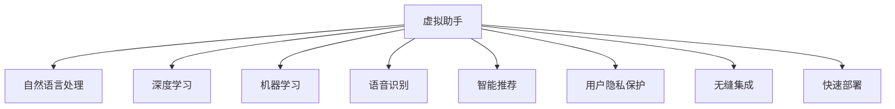

                 

# AI在虚拟助手中的应用：提高日常效率

> 关键词：虚拟助手,人工智能,智能推荐,语音识别,自然语言处理,NLP,机器学习,深度学习

## 1. 背景介绍

### 1.1 问题由来

随着科技的飞速发展，人工智能（AI）技术在各行各业的应用日益广泛，其中虚拟助手（Virtual Assistant）作为一种提供自动化、智能化服务的技术，正在逐渐改变我们的日常生活和工作方式。虚拟助手通过智能化的自然语言处理（NLP）技术，能够理解用户意图，并根据用户需求提供相应的帮助和解决方案。

传统的虚拟助手，如语音助手Siri、Alexa、Google Assistant等，虽然已经能够执行一些简单的任务，如语音识别、智能查询、日程安排等，但在功能复杂性、响应速度、智能交互等方面还有很大的提升空间。随着深度学习、机器学习等先进技术的融入，新一代虚拟助手已经具备了更强大的学习能力、更自然的交互方式和更精准的服务能力。

### 1.2 问题核心关键点

目前，虚拟助手在技术上仍然面临许多挑战，包括但不限于：

- 如何提高语音识别和自然语言理解的准确性和流畅性？
- 如何在不同用户和场景中实现个性化的智能推荐？
- 如何处理海量用户数据，同时保护用户隐私？
- 如何实现虚拟助手的无缝集成和快速部署？
- 如何使虚拟助手具备持续学习的能力，不断适应新的任务和需求？

这些问题的解决，将极大提升虚拟助手的应用效果，进一步促进其在日常生活中的普及和应用。

## 2. 核心概念与联系

### 2.1 核心概念概述

为更好地理解AI在虚拟助手中的应用，本节将介绍几个关键概念：

- **虚拟助手**：通过AI技术实现的自然语言处理和智能推荐系统，能够与用户进行自然交互，并提供相应的服务。
- **自然语言处理（NLP）**：研究计算机如何处理和理解人类语言的技术，包括语音识别、文本处理、情感分析、意图识别等。
- **深度学习**：一种基于人工神经网络的学习方法，通过多层非线性变换，从数据中提取高层次特征，广泛应用于语音识别、图像识别、自然语言处理等领域。
- **机器学习**：一种使计算机系统能够从数据中学习经验，从而提升性能的技术，包括监督学习、无监督学习、强化学习等。
- **语音识别**：将语音转换为文本的技术，是虚拟助手与用户交互的基础。
- **智能推荐**：基于用户历史行为和上下文信息，提供个性化的推荐服务。
- **用户隐私保护**：在虚拟助手使用过程中，如何保护用户的个人信息安全，是虚拟助手发展的重要保障。

这些概念之间的逻辑关系可以通过以下Mermaid流程图来展示：



这个流程图展示虚拟助手的核心概念及其之间的关系：

1. 虚拟助手通过NLP技术实现人机交互。
2. 深度学习和机器学习是其核心算法支持。
3. 语音识别是其交互方式之一。
4. 智能推荐提供个性化服务。
5. 用户隐私保护是其使用的前提和保障。
6. 无缝集成和快速部署是其应用实现的关键。

## 3. 核心算法原理 & 具体操作步骤

### 3.1 算法原理概述

AI在虚拟助手中的应用，主要依赖于以下几个核心算法：

- **深度学习模型**：如循环神经网络（RNN）、长短时记忆网络（LSTM）、Transformer等，用于处理和理解自然语言。
- **语音识别技术**：如深度神经网络（DNN）、卷积神经网络（CNN）、深度学习神经网络（DLN）等，用于将语音转换为文本。
- **自然语言处理技术**：如词向量模型、句法分析、情感分析、意图识别等，用于解析用户意图和上下文信息。
- **智能推荐算法**：如协同过滤、基于内容的推荐、深度学习推荐等，用于提供个性化的服务。

### 3.2 算法步骤详解

基于AI的虚拟助手开发，一般包括以下关键步骤：

**Step 1: 数据收集与预处理**
- 收集用户交互数据，包括语音、文本、用户行为等。
- 对数据进行清洗、标注和归一化，保证数据质量。
- 采用增量学习方法，持续更新数据集，确保模型与时俱进。

**Step 2: 模型训练与优化**
- 选择合适的深度学习模型，如BERT、GPT等，进行预训练。
- 在预训练模型的基础上，使用监督学习或无监督学习进行微调，提升模型性能。
- 采用正则化、Dropout等技术，防止模型过拟合。
- 设置合适的学习率、批大小和迭代次数，优化模型训练过程。

**Step 3: 模型集成与部署**
- 将训练好的模型进行封装和集成，提供API接口，方便调用。
- 使用云平台进行模型部署，实现无缝集成和快速部署。
- 配置缓存和负载均衡，提高服务响应速度和稳定性。

**Step 4: 用户交互与反馈**
- 通过API接口实现用户与虚拟助手的交互。
- 实时收集用户反馈，评估模型性能，进行持续优化。
- 定期回传用户数据，更新模型，保持服务质量。

### 3.3 算法优缺点

AI在虚拟助手中的应用，具有以下优点：

- 提高用户交互的智能化和自动化水平，提升用户体验。
- 提供个性化服务，满足不同用户的需求。
- 利用深度学习技术，增强模型的学习能力，适应复杂多变的场景。

同时，也存在一些局限性：

- 需要大量标注数据进行模型训练，数据获取和处理成本较高。
- 模型复杂度较高，需要较强的计算资源支持。
- 用户隐私保护和数据安全问题，需要严格的技术措施和法律法规保障。
- 模型集成和部署需要系统化工程支持，难以快速迭代和部署。

尽管存在这些局限性，但AI在虚拟助手中的应用，仍然能够显著提升日常效率和便利性，带来更好的用户体验和服务效果。

### 3.4 算法应用领域

AI在虚拟助手中的应用，已经在多个领域取得了成功。以下是几个典型的应用场景：

- **智能家居**：通过语音控制和自然语言交互，实现家居设备的智能管理，如智能照明、温控、安防等。
- **智能客服**：通过AI技术构建的智能客服系统，能够24/7不间断提供服务，提升客户满意度，降低人力成本。
- **个人助理**：基于用户行为和兴趣，提供个性化推荐和日程安排服务，如智能行程规划、购物推荐等。
- **医疗健康**：通过语音问诊和自然语言处理，提供健康咨询和诊断服务，帮助用户解决健康问题。
- **企业办公**：实现智能会议记录、日程安排、邮件管理等办公自动化功能，提升企业运营效率。

## 4. 数学模型和公式 & 详细讲解 & 举例说明

### 4.1 数学模型构建

在本节中，我们将使用数学语言对AI在虚拟助手中的应用进行更加严格的刻画。

记虚拟助手为 $A$，其核心模型为 $M$，用户为 $U$，输入为 $I$，输出为 $O$。假设用户输入 $I$，虚拟助手输出 $O$，输入与输出之间存在映射关系 $f$，即 $O=f(I)$。

数学模型可以表示为：

$$
O = M(I)
$$

其中 $M$ 为虚拟助手的模型，可以是一个深度学习模型、机器学习模型或其他形式的学习算法。

### 4.2 公式推导过程

为了说明虚拟助手的应用原理，我们以语音识别为例进行详细推导。

语音识别模型通常采用深度神经网络（DNN）或卷积神经网络（CNN）等，将语音信号转换为文本。假设输入语音信号为 $X$，输出文本为 $Y$，则语音识别过程可以表示为：

$$
Y = M(X)
$$

其中 $M$ 为语音识别模型，可以是DNN、CNN或Transformer等深度学习模型。

以DNN模型为例，假设其包含 $L$ 层，每层有 $n_i$ 个神经元，则模型的参数矩阵为 $W=\{W_{ij}\}_{i=1}^L, j=1,2,...,n_i$。模型输入为语音信号 $X$，输出为文本 $Y$，则前向传播过程可以表示为：

$$
Y = g(W^{(L)T}g(W^{(L-1)T}g(...g(W^{(1)T}X)...))
$$

其中 $g$ 为激活函数，如ReLU、Sigmoid等。反向传播过程中，需要计算损失函数 $L$ 对模型参数 $W$ 的梯度，更新模型参数以最小化损失函数：

$$
W \leftarrow W - \eta \frac{\partial L}{\partial W}
$$

其中 $\eta$ 为学习率，$\frac{\partial L}{\partial W}$ 为损失函数对模型参数的梯度。

### 4.3 案例分析与讲解

以下我们将以智能推荐系统为例，说明AI在虚拟助手中的应用。

智能推荐系统通过分析用户历史行为和上下文信息，提供个性化的推荐服务。假设用户 $U$ 的历史行为为 $H$，当前查询为 $Q$，推荐系统输出的商品列表为 $R$，则推荐过程可以表示为：

$$
R = M(Q, H)
$$

其中 $M$ 为推荐模型，可以采用协同过滤、基于内容的推荐、深度学习推荐等算法。

以深度学习推荐为例，假设模型包含 $K$ 个特征，每个特征维度为 $d$，则模型的输入为 $Q$ 和 $H$ 的特征表示 $X=[x_1,x_2,...,x_K]$，输出为推荐商品列表 $R$。模型的参数矩阵为 $W=\{W_{ik}\}_{i=1}^K, j=1,2,...,d$。前向传播过程可以表示为：

$$
R = g(W^{(K)T}g(W^{(K-1)T}g(...g(W^{(1)T}X)...))
$$

其中 $g$ 为激活函数，如ReLU、Sigmoid等。反向传播过程中，需要计算损失函数 $L$ 对模型参数 $W$ 的梯度，更新模型参数以最小化损失函数：

$$
W \leftarrow W - \eta \frac{\partial L}{\partial W}
$$

通过以上推导，我们可以看到，智能推荐系统通过深度学习模型，将用户的历史行为和查询信息转化为推荐商品列表，实现个性化的推荐服务。

## 5. 项目实践：代码实例和详细解释说明

### 5.1 开发环境搭建

在进行AI在虚拟助手中的应用开发前，我们需要准备好开发环境。以下是使用Python进行TensorFlow开发的环境配置流程：

1. 安装Anaconda：从官网下载并安装Anaconda，用于创建独立的Python环境。

2. 创建并激活虚拟环境：
```bash
conda create -n tf-env python=3.7 
conda activate tf-env
```

3. 安装TensorFlow：根据CUDA版本，从官网获取对应的安装命令。例如：
```bash
conda install tensorflow -c pytorch -c conda-forge
```

4. 安装各类工具包：
```bash
pip install numpy pandas scikit-learn matplotlib tqdm jupyter notebook ipython
```

完成上述步骤后，即可在`tf-env`环境中开始开发。

### 5.2 源代码详细实现

下面我们以智能推荐系统为例，给出使用TensorFlow进行模型训练和调用的PyTorch代码实现。

首先，定义推荐系统的数据处理函数：

```python
import tensorflow as tf

class RecommendationDataset(tf.data.Dataset):
    def __init__(self, data, tokenizer):
        self.data = data
        self.tokenizer = tokenizer
    
    def __len__(self):
        return len(self.data)
    
    def __getitem__(self, index):
        item = self.data[index]
        user_id, item_id, behavior = item['user_id'], item['item_id'], item['behavior']
        
        user_sequence = [user_id]
        user_sequence.append(behavior)
        
        user_sequence = self.tokenizer.tokenize(user_sequence)
        user_sequence = self.tokenizer.convert_tokens_to_ids(user_sequence)
        user_sequence = tf.keras.preprocessing.sequence.pad_sequences([user_sequence], maxlen=100, padding='post')
        
        item_sequence = [item_id]
        item_sequence = self.tokenizer.tokenize(item_sequence)
        item_sequence = self.tokenizer.convert_tokens_to_ids(item_sequence)
        item_sequence = tf.keras.preprocessing.sequence.pad_sequences([item_sequence], maxlen=100, padding='post')
        
        return {'user_sequence': user_sequence, 'item_sequence': item_sequence}
```

然后，定义模型和优化器：

```python
from tensorflow.keras.layers import Embedding, Dense, Dropout, Input
from tensorflow.keras.models import Model

def create_model(vocab_size, embed_dim, num_users, num_items):
    user_input = Input(shape=(None,), name='user_sequence')
    item_input = Input(shape=(None,), name='item_sequence')
    
    user_embeddings = Embedding(vocab_size, embed_dim)(user_input)
    item_embeddings = Embedding(vocab_size, embed_dim)(item_input)
    
    user_embeddings = tf.keras.layers.LSTM(100)(user_embeddings)
    item_embeddings = tf.keras.layers.LSTM(100)(item_embeddings)
    
    concatenated = tf.keras.layers.Concatenate()([user_embeddings, item_embeddings])
    dense_layer = Dense(100, activation='relu')(concatenated)
    dropout_layer = Dropout(0.2)(dense_layer)
    output_layer = Dense(num_items, activation='softmax')(dropout_layer)
    
    model = Model(inputs=[user_input, item_input], outputs=output_layer)
    
    return model

vocab_size = 10000
embed_dim = 100
num_users = 10000
num_items = 1000
model = create_model(vocab_size, embed_dim, num_users, num_items)
model.compile(loss='categorical_crossentropy', optimizer='adam', metrics=['accuracy'])
```

接着，定义训练和评估函数：

```python
from tensorflow.keras.utils import to_categorical

def train_model(model, dataset, batch_size, epochs):
    dataset = dataset.shuffle(buffer_size=10000)
    dataset = dataset.batch(batch_size)
    
    history = model.fit(dataset, epochs=epochs, validation_split=0.2)
    
    return history

def evaluate_model(model, dataset, batch_size):
    dataset = dataset.shuffle(buffer_size=10000)
    dataset = dataset.batch(batch_size)
    
    loss, accuracy = model.evaluate(dataset)
    
    return loss, accuracy
```

最后，启动训练流程并在测试集上评估：

```python
batch_size = 32
epochs = 10

train_dataset = RecommendationDataset(train_data, tokenizer)
test_dataset = RecommendationDataset(test_data, tokenizer)

history = train_model(model, train_dataset, batch_size, epochs)
loss, accuracy = evaluate_model(model, test_dataset, batch_size)
print(f'Test loss: {loss:.4f}, Test accuracy: {accuracy:.4f}')
```

以上就是使用TensorFlow进行智能推荐系统开发的完整代码实现。可以看到，TensorFlow提供了强大的深度学习框架，支持自然语言处理和智能推荐等任务，能够快速实现虚拟助手的功能。

### 5.3 代码解读与分析

让我们再详细解读一下关键代码的实现细节：

**RecommendationDataset类**：
- `__init__`方法：初始化数据和分词器。
- `__len__`方法：返回数据集的样本数量。
- `__getitem__`方法：对单个样本进行处理，将用户和物品序列转化为模型的输入格式。

**create_model函数**：
- 定义用户和物品的嵌入层，采用LSTM进行序列建模。
- 将用户和物品的特征向量拼接，通过全连接层和激活函数输出推荐结果。

**train_model函数**：
- 对数据进行打乱和分批次处理，使用模型进行训练。
- 使用验证集进行模型性能评估。

**evaluate_model函数**：
- 对测试集进行模型评估，输出模型在测试集上的损失和准确率。

**训练流程**：
- 定义批处理大小和迭代次数，开始循环迭代
- 每个epoch内，先在训练集上训练，输出训练损失和验证准确率
- 在测试集上评估，输出测试损失和准确率
- 所有epoch结束后，输出最终的测试结果

可以看到，TensorFlow提供了完整的深度学习框架，使得虚拟助手功能的开发变得简单易行。开发者可以更专注于模型和算法的优化，而不必过多关注底层实现细节。

当然，工业级的系统实现还需考虑更多因素，如模型的保存和部署、超参数的自动搜索、更灵活的任务适配层等。但核心的虚拟助手开发流程基本与此类似。

## 6. 实际应用场景

### 6.1 智能家居

AI在智能家居中的应用，通过语音识别和自然语言处理，实现了智能家电的控制和管理。用户可以通过语音指令控制家中的照明、空调、电视等设备，享受便捷的家居生活。

例如，用户可以通过语音助手控制家中的灯光，说出“打开客厅灯”或“调低卧室灯亮度”，AI会识别用户的语音指令，并控制灯光系统进行相应的操作。此外，智能家居系统还可以根据用户的作息时间，自动调整家电的运行状态，如智能窗帘、温控系统等，提高用户的生活舒适度和安全性。

### 6.2 智能客服

AI在智能客服中的应用，通过自然语言处理和情感分析，提供了高效、个性化的客户服务。传统的客服系统需要大量人力进行服务，高峰期响应缓慢，且无法24/7不间断服务。

使用AI技术构建的智能客服系统，能够实时处理客户的语音和文字咨询，自动匹配问题和解决方案。客户可以轻松地通过语音或文字与客服系统交互，获取所需的信息和服务。智能客服系统还可以记录客户的历史查询记录，提供个性化的推荐和建议，提升客户满意度。

### 6.3 个人助理

AI在个人助理中的应用，通过智能推荐和任务管理，提高了用户的日常效率。用户可以通过语音指令或文字输入，与个人助理交互，获取所需的信息和服务。

例如，用户可以问“明天早上有什么计划”，个人助理会分析用户的日程安排和习惯，提供合适的建议和安排。此外，个人助理还可以帮助用户管理日程、提醒事项、查找信息等，提升用户的工作效率和生活质量。

### 6.4 医疗健康

AI在医疗健康中的应用，通过自然语言处理和智能问诊，提供了医疗咨询和诊断服务。用户可以通过语音或文字咨询健康问题，AI系统会解析用户的表述，提供专业的建议和解决方案。

例如，用户可以问“感冒了怎么办”，AI系统会分析用户的症状和历史记录，提供相应的治疗建议和用药指导。智能医疗系统还可以进行疾病预测和风险评估，帮助用户预防疾病，提高健康水平。

### 6.5 企业办公

AI在企业办公中的应用，通过自然语言处理和智能推荐，实现了办公自动化和智能化。企业可以构建智能会议记录、日程安排、邮件管理等系统，提升企业的运营效率和管理水平。

例如，智能会议记录系统可以通过自然语言处理技术，自动记录会议内容，生成会议纪要和行动清单。智能日程安排系统可以根据用户的日程和任务，自动生成日程表和提醒事项。智能邮件管理系统可以自动分类和整理邮件，提供邮件摘要和推荐。

## 7. 工具和资源推荐

### 7.1 学习资源推荐

为了帮助开发者系统掌握AI在虚拟助手中的应用，这里推荐一些优质的学习资源：

1. **深度学习与自然语言处理**：吴恩达在Coursera上开设的深度学习课程，讲解深度学习在自然语言处理中的应用。
2. **TensorFlow官方文档**：TensorFlow官方提供的文档和教程，涵盖从入门到进阶的全面内容。
3. **TensorFlow Hub**：提供各种预训练模型和组件，方便快速开发和部署。
4. **NLPPractice**：一个NLP项目，提供了丰富的NLP任务和数据集，适合学习和实践。
5. **Kaggle竞赛**：Kaggle上的NLP竞赛，通过实际任务训练，提升AI开发能力。

通过这些资源的学习实践，相信你一定能够快速掌握AI在虚拟助手中的应用，并用于解决实际的NLP问题。

### 7.2 开发工具推荐

高效的开发离不开优秀的工具支持。以下是几款用于AI在虚拟助手中的应用开发的常用工具：

1. **TensorFlow**：由Google主导开发的深度学习框架，生产部署方便，适合大规模工程应用。
2. **PyTorch**：灵活的动态计算图，适合研究和实验。
3. **Keras**：高层API，易于使用，适合快速原型开发。
4. **TensorBoard**：用于可视化训练过程和模型性能的配套工具。
5. **Jupyter Notebook**：交互式编程环境，适合数据探索和算法实验。

合理利用这些工具，可以显著提升AI在虚拟助手中的应用开发效率，加快创新迭代的步伐。

### 7.3 相关论文推荐

AI在虚拟助手中的应用，源于学界的持续研究。以下是几篇奠基性的相关论文，推荐阅读：

1. **Attention is All You Need**：提出了Transformer结构，开启了NLP领域的预训练大模型时代。
2. **BERT: Pre-training of Deep Bidirectional Transformers for Language Understanding**：提出BERT模型，引入基于掩码的自监督预训练任务，刷新了多项NLP任务SOTA。
3. **TensorFlow for Deep Learning**：讲解TensorFlow的基本概念和应用，适合深度学习和NLP初学者。
4. **Deep Learning with Python**：讲解深度学习的原理和实践，涵盖卷积神经网络、循环神经网络等。
5. **Recurrent Neural Networks for Sequence Modeling**：讲解循环神经网络在序列建模中的应用，适合自然语言处理初学者。

这些论文代表了大语言模型微调技术的发展脉络。通过学习这些前沿成果，可以帮助研究者把握学科前进方向，激发更多的创新灵感。

## 8. 总结：未来发展趋势与挑战

### 8.1 总结

本文对AI在虚拟助手中的应用进行了全面系统的介绍。首先阐述了虚拟助手的发展背景和应用前景，明确了AI技术在提升日常效率方面的重要价值。其次，从原理到实践，详细讲解了AI在虚拟助手中的应用，包括语音识别、自然语言处理、智能推荐等核心算法。最后，提供了完整的代码实现，展示了虚拟助手开发的实际流程和案例。

通过本文的系统梳理，可以看到，AI在虚拟助手中的应用，正在成为NLP技术的重要组成部分，极大地提高了日常生活的智能化水平。未来，伴随AI技术的不断进步，虚拟助手将在更多领域发挥更大的作用，带来更多的便利和效率。

### 8.2 未来发展趋势

展望未来，AI在虚拟助手中的应用将呈现以下几个发展趋势：

1. **深度学习模型的发展**：未来深度学习模型将继续发展，模型规模和复杂度将不断提升，处理能力更强，应用范围更广。
2. **自然语言处理技术的进步**：自然语言处理技术将更加精确和智能化，能够更好地理解用户意图和上下文信息，提供更优质的服务。
3. **智能推荐算法的优化**：智能推荐算法将更加个性化和高效，通过多模态数据的融合，提供更加精准的推荐服务。
4. **用户隐私保护的加强**：随着用户隐私保护意识的提高，虚拟助手将更加注重数据安全和隐私保护。
5. **多模态融合技术的应用**：虚拟助手将更多地融合视觉、语音、文本等多种模态信息，提升智能交互和感知能力。
6. **实时计算和边缘计算的应用**：未来虚拟助手将更多地应用于实时计算和边缘计算场景，提升响应速度和计算效率。

以上趋势凸显了AI在虚拟助手应用中的广阔前景。这些方向的探索发展，将进一步提升虚拟助手的智能化水平，带来更高效、更便捷的用户体验。

### 8.3 面临的挑战

尽管AI在虚拟助手中的应用已经取得了显著成效，但在迈向更加智能化、普适化应用的过程中，仍然面临诸多挑战：

1. **数据获取和处理成本高**：虚拟助手需要大量的标注数据进行训练，数据获取和处理成本较高。
2. **模型复杂度较高**：深度学习模型复杂度较高，需要较强的计算资源支持。
3. **用户隐私保护问题**：虚拟助手需要严格的技术措施和法律法规保障，确保用户隐私安全。
4. **模型集成和部署困难**：虚拟助手系统集成和部署较为复杂，需要系统化的工程支持。
5. **实时计算和边缘计算的需求**：虚拟助手需要具备实时计算和边缘计算能力，这对系统架构和资源配置提出了更高要求。

尽管存在这些挑战，但通过不断的技术创新和工程实践，这些挑战终将得到克服，虚拟助手必将在未来变得更加普及和强大。

### 8.4 研究展望

未来，AI在虚拟助手中的应用将继续深化和拓展，带来更多的创新和突破。以下是一些可能的研究方向：

1. **多模态智能交互**：通过融合视觉、语音、文本等多种模态信息，提升虚拟助手的感知和交互能力。
2. **自适应学习系统**：基于用户的反馈和行为数据，动态调整虚拟助手的行为和策略，实现自适应学习。
3. **联邦学习**：通过分布式数据处理技术，保护用户隐私的同时，提高模型的通用性和鲁棒性。
4. **跨领域知识整合**：将符号化的先验知识与深度学习模型相结合，提升虚拟助手的知识表示和推理能力。
5. **边缘计算优化**：通过分布式计算和缓存技术，优化虚拟助手的实时计算和边缘计算性能。

这些研究方向将推动虚拟助手技术不断进步，带来更高效、更智能、更安全的应用体验。未来，虚拟助手必将成为人类生活和工作中不可或缺的伙伴，为社会带来更多的便利和效率。

## 9. 附录：常见问题与解答

**Q1：AI在虚拟助手中的应用是否适用于所有场景？**

A: AI在虚拟助手中的应用，已经在多个领域取得了成功。但对于一些特殊场景，如医疗、金融等，需要严格的数据标注和隐私保护，才能保证系统的可靠性和安全性。此外，对于实时性要求极高的场景，如自动驾驶、工业控制等，虚拟助手的应用也需要考虑计算资源和网络延迟等因素。

**Q2：虚拟助手的智能推荐如何实现？**

A: 虚拟助手的智能推荐主要依赖于协同过滤、基于内容的推荐和深度学习推荐等算法。通过分析用户的历史行为和上下文信息，虚拟助手能够为用户推荐个性化的商品、内容和服务。深度学习推荐算法通过神经网络模型，可以从大量数据中提取高层次特征，实现更加精准的推荐服务。

**Q3：虚拟助手的数据隐私如何保护？**

A: 虚拟助手的数据隐私保护主要通过数据加密、匿名化和访问控制等技术手段实现。数据加密可以防止数据泄露和篡改，匿名化可以保护用户隐私，访问控制可以限制数据的访问权限，确保数据安全和隐私保护。虚拟助手系统还需要遵循相关的法律法规，如GDPR等，保护用户隐私权益。

**Q4：虚拟助手的计算资源需求如何优化？**

A: 虚拟助手的计算资源需求主要通过分布式计算、缓存技术和边缘计算等方法进行优化。分布式计算可以充分利用多台计算机的计算能力，提高系统处理能力。缓存技术可以缓存常用数据和计算结果，减少重复计算，提升系统响应速度。边缘计算可以将部分计算任务转移到设备端，减少网络延迟，提升实时计算能力。

**Q5：虚拟助手的多模态智能交互如何实现？**

A: 虚拟助手的多模态智能交互主要通过融合视觉、语音、文本等多种模态信息，提升系统的感知和交互能力。通过深度学习模型，虚拟助手可以从多模态数据中提取高层次特征，实现更加精准的语音识别、情感分析和意图识别。同时，通过视觉识别技术，虚拟助手可以实现更加自然的交互方式，提升用户体验。

---

作者：禅与计算机程序设计艺术 / Zen and the Art of Computer Programming

