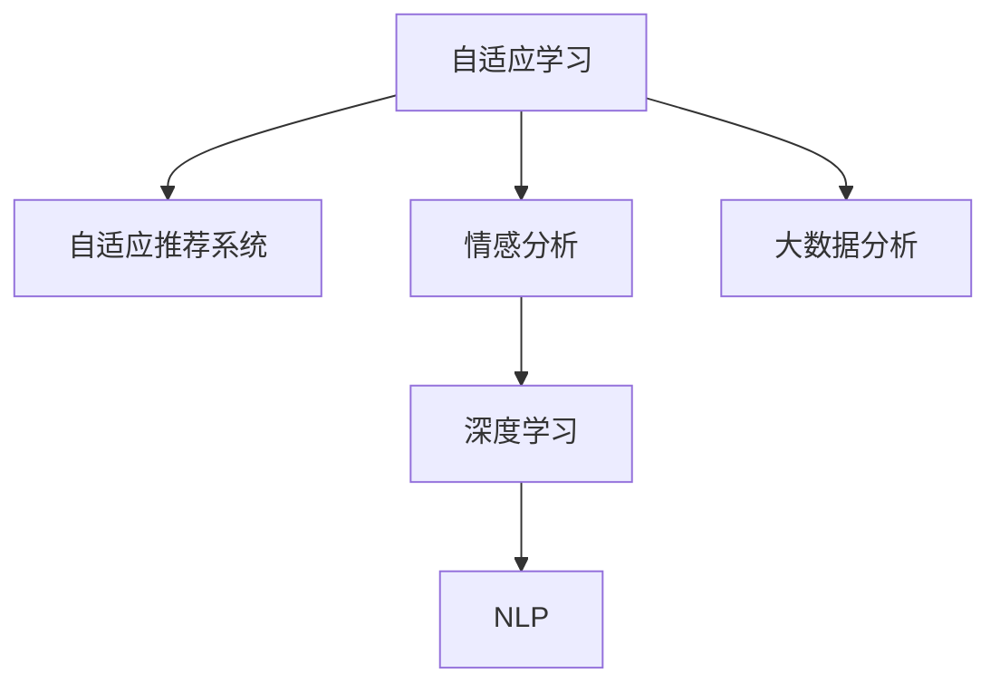

                 

# AI在语言学习中的应用：个性化教学

> 关键词：个性化教学, 自适应学习, 自然语言处理, 深度学习, 数据挖掘, 机器学习

## 1. 背景介绍

### 1.1 问题由来
语言学习是全球范围内最重要的教育需求之一，无论是对于母语学习者还是第二语言学习者，都面临着诸多挑战。传统的语言教学方法往往忽视了每个学习者的个体差异，如学习速度、兴趣偏好、学习习惯等。这种“一刀切”的教学方式不仅效率低下，也难以激发学习者的积极性和创造力。因此，如何构建适应个体差异的个性化教学系统，成为了教育技术领域的一项重要研究课题。

随着人工智能技术的快速发展，特别是深度学习、自然语言处理(NLP)等技术的应用，构建基于AI的个性化教学系统成为可能。该系统能够根据学习者的具体需求和反馈，动态调整教学内容和策略，从而实现高效、智能的教学模式。本文将探讨AI在个性化教学中的应用，详细介绍如何利用深度学习技术构建自适应学习系统，以促进语言学习的质量和效率。

### 1.2 问题核心关键点
在个性化教学系统中，AI的应用主要集中在以下几个方面：

- **个性化内容推荐**：通过分析学习者的学习历史和偏好，智能推荐适合的学习材料和任务，提高学习效率。
- **自适应难度调整**：根据学习者的掌握情况，动态调整任务难度，确保学习者在最佳水平下进行学习。
- **情感智能识别**：利用NLP技术识别学习者的情感状态，调整教学策略，增强学习体验。
- **数据驱动的优化**：通过大数据分析，持续优化教学模型和策略，提升教学效果。

## 2. 核心概念与联系

### 2.1 核心概念概述

为更好地理解AI在个性化教学中的应用，本文将介绍几个密切相关的核心概念：

- **自适应学习**：一种根据学习者个体差异动态调整教学内容和策略的教学模式。它通过分析学习者的反馈和行为，实时调整教学计划，以提高学习效率。

- **自适应推荐系统**：一种根据用户历史行为和偏好，智能推荐个性化内容的技术。在个性化教学系统中，可以应用于学习材料、任务难度等推荐。

- **情感分析**：利用NLP技术识别和分析用户情感状态，可以用于评估学习者的心理状态，调整教学策略。

- **深度学习**：一种通过多层次神经网络进行复杂数据模式识别的技术，在个性化教学系统中用于建立学习者模型和推荐模型。

- **自然语言处理(NLP)**：涉及语言理解、生成、处理和分析的多种技术，在个性化教学中用于构建教学对话系统、情感识别等应用。

- **大数据分析**：通过对大量学习数据进行分析，提取有价值的教学模式和策略，优化个性化教学系统。

这些核心概念之间的逻辑关系可以通过以下Mermaid流程图来展示：



这个流程图展示了这个框架中各个核心概念的联系：

1. 自适应学习是整个系统的目标，通过其他技术实现个性化教学。
2. 自适应推荐系统用于智能推荐学习材料和任务，是实现自适应学习的重要手段。
3. 情感分析用于识别学习者的情感状态，实时调整教学策略。
4. 深度学习和NLP技术用于构建学习者模型和推荐模型，提取教学模式和情感信息。
5. 大数据分析用于优化教学模型和策略，提升教学效果。

## 3. 核心算法原理 & 具体操作步骤
### 3.1 算法原理概述

基于AI的个性化教学系统，其核心思想是通过深度学习模型，构建学习者行为和特征的动态模型，并根据这些模型实时调整教学内容和策略。该系统一般包括以下几个步骤：

1. **数据收集**：收集学习者的学习行为数据，如学习时间、完成的任务、评价反馈等。
2. **学习者建模**：利用深度学习模型构建学习者行为和特征的动态模型，用于预测学习者的学习进度和效果。
3. **内容推荐**：根据学习者的模型预测，智能推荐适合的学习材料和任务。
4. **难度调整**：根据学习者的掌握情况，动态调整任务难度，确保学习者在最佳水平下进行学习。
5. **情感分析**：利用NLP技术识别学习者的情感状态，调整教学策略，增强学习体验。
6. **模型优化**：通过大数据分析，持续优化学习者模型和推荐模型，提升教学效果。

### 3.2 算法步骤详解

以下将详细介绍每个步骤的具体操作和实现方法。

**Step 1: 数据收集**

为了构建个性化的教学系统，首先需要收集学习者的学习数据。这些数据可以包括：

- **行为数据**：学习者的学习时间、完成的任务、答题时间等。
- **评价数据**：学习者对任务的评价、自我评估、教师评分等。
- **反馈数据**：学习者在学习过程中的提问、讨论、笔记等。

数据的收集可以通过在线学习平台、移动学习应用、智能设备等渠道进行。

**Step 2: 学习者建模**

在收集到学习者的行为数据后，需要构建学习者的动态模型。一个常见的方法是使用长短期记忆网络(LSTM)或Transformer模型，通过对学习者行为序列进行建模，预测其学习进度和效果。

具体实现步骤如下：

1. **特征提取**：从行为数据中提取特征，如学习时间、任务完成率、答题错误率等。
2. **构建模型**：使用LSTM或Transformer模型，对学习者行为序列进行建模。
3. **训练模型**：使用学习者的行为数据训练模型，使其能够预测学习者的学习进度和效果。

**Step 3: 内容推荐**

在构建学习者模型后，可以基于该模型进行内容的推荐。推荐算法可以包括基于协同过滤、基于内容的推荐、混合推荐等多种策略。

具体实现步骤如下：

1. **选择推荐算法**：根据学习者模型和内容库的特点，选择合适的推荐算法。
2. **数据预处理**：对内容库进行特征提取和预处理，如提取关键词、构建词向量等。
3. **推荐计算**：使用推荐算法计算学习者与内容的匹配度，选择合适的内容进行推荐。

**Step 4: 难度调整**

在推荐内容后，需要对任务难度进行动态调整。难度调整可以根据学习者对当前任务的掌握情况，实时调整任务难度，确保学习者在最佳水平下进行学习。

具体实现步骤如下：

1. **任务评估**：通过学习者对任务的完成情况和评价，评估学习者的掌握水平。
2. **难度调整**：根据评估结果，动态调整任务的难度，如增加或减少知识点、调整题目难度等。
3. **实时反馈**：在学习过程中，实时收集学习者的反馈，进一步调整任务难度。

**Step 5: 情感分析**

在教学过程中，情感分析可以帮助识别学习者的情感状态，并根据情感状态调整教学策略，增强学习体验。

具体实现步骤如下：

1. **情感识别**：利用NLP技术，识别学习者的情感状态，如焦虑、困惑、积极等。
2. **教学调整**：根据情感状态，调整教学策略，如增加鼓励、提供帮助、调整内容难度等。
3. **实时反馈**：在学习过程中，实时收集学习者的反馈，进一步调整教学策略。

**Step 6: 模型优化**

在教学过程中，通过大数据分析，可以持续优化学习者模型和推荐模型，提升教学效果。

具体实现步骤如下：

1. **数据收集**：收集更多学习者的行为数据和评价数据。
2. **模型训练**：使用新的数据训练学习者模型和推荐模型，优化模型参数。
3. **效果评估**：使用新的模型评估教学效果，寻找改进空间。

### 3.3 算法优缺点

基于AI的个性化教学系统，其优点主要包括：

- **个性化**：能够根据每个学习者的个体差异，动态调整教学内容和策略，提高学习效率。
- **数据驱动**：通过大数据分析，持续优化教学模型和策略，提升教学效果。
- **实时反馈**：能够实时收集学习者的反馈，调整教学策略，增强学习体验。

然而，该系统也存在一些局限性：

- **数据隐私**：收集大量学习数据，可能涉及隐私问题，需要严格的数据保护措施。
- **模型复杂**：构建学习者模型和推荐模型，需要复杂的深度学习算法和大量计算资源。
- **成本较高**：开发和维护基于AI的教学系统，需要较高的技术和人力成本。
- **适用范围有限**：对于某些特定领域或场景，可能难以获得足够的数据进行有效建模。

尽管存在这些局限性，但总体而言，基于AI的个性化教学系统能够显著提高语言学习的效率和效果，具有广泛的应用前景。

### 3.4 算法应用领域

基于AI的个性化教学系统，已经在多个领域得到了广泛应用，包括：

- **在线教育**：构建自适应学习平台，为学生提供个性化学习方案，提高学习效率。
- **语言培训**：通过动态调整学习内容和策略，提高语言学习的趣味性和效果。
- **企业培训**：为员工提供个性化培训课程，提高培训效果和企业竞争力。
- **学术研究**：在学术领域，通过数据分析和模型优化，提升教学研究和教学效果。

## 4. 数学模型和公式 & 详细讲解  
### 4.1 数学模型构建

以下将使用数学语言对基于AI的个性化教学系统的构建过程进行更加严格的刻画。

假设学习者模型为 $M_{\theta}$，其中 $\theta$ 为模型参数，学习行为数据为 $D=\{(x_i, y_i)\}_{i=1}^N$，其中 $x_i$ 为学习行为，$y_i$ 为学习效果。

学习者模型的目标是最小化经验风险，即找到最优参数：

$$
\theta^* = \mathop{\arg\min}_{\theta} \mathcal{L}(\theta) = \frac{1}{N}\sum_{i=1}^N \ell(M_{\theta}(x_i),y_i)
$$

其中 $\ell$ 为损失函数，用于衡量模型预测和真实效果之间的差异。

在内容推荐中，假设内容库为 $C=\{c_j\}_{j=1}^M$，其中 $c_j$ 为内容。

推荐算法 $\mathcal{A}$ 的目标是最小化推荐误差，即找到最优推荐策略：

$$
\mathcal{A}^* = \mathop{\arg\min}_{\mathcal{A}} \mathcal{L}(\mathcal{A}) = \frac{1}{N}\sum_{i=1}^N \ell(\mathcal{A}(x_i),y_i)
$$

其中 $\ell$ 为推荐误差函数，用于衡量推荐结果和真实效果之间的差异。

在难度调整中，假设任务难度为 $T=\{t_k\}_{k=1}^K$，其中 $t_k$ 为任务难度。

难度调整算法 $\mathcal{D}$ 的目标是最小化难度调整误差，即找到最优难度调整策略：

$$
\mathcal{D}^* = \mathop{\arg\min}_{\mathcal{D}} \mathcal{L}(\mathcal{D}) = \frac{1}{N}\sum_{i=1}^N \ell(\mathcal{D}(x_i),y_i)
$$

其中 $\ell$ 为难度调整误差函数，用于衡量调整结果和真实效果之间的差异。

在情感分析中，假设学习者的情感状态为 $E=\{e_m\}_{m=1}^M$，其中 $e_m$ 为情感状态。

情感分析算法 $\mathcal{E}$ 的目标是最小化情感误差，即找到最优情感分析策略：

$$
\mathcal{E}^* = \mathop{\arg\min}_{\mathcal{E}} \mathcal{L}(\mathcal{E}) = \frac{1}{N}\sum_{i=1}^N \ell(\mathcal{E}(x_i),y_i)
$$

其中 $\ell$ 为情感误差函数，用于衡量情感分析结果和真实效果之间的差异。

### 4.2 公式推导过程

以下将推导基于LSTM的学习者模型和内容推荐模型的详细公式。

假设学习者的行为序列为 $X = (x_1, x_2, ..., x_T)$，其中 $x_t$ 为学习者在第 $t$ 次行为。

使用LSTM模型对学习者行为序列进行建模，得到学习者的状态表示 $h_T$，如下所示：

$$
h_t = \mathcal{LSTM}(h_{t-1}, x_t)
$$

其中 $\mathcal{LSTM}$ 为长短期记忆网络，$h_t$ 为学习者在第 $t$ 次行为后的状态表示。

通过学习者状态表示 $h_T$，可以预测学习者的学习进度和效果 $y_T$，如下所示：

$$
y_T = f(h_T)
$$

其中 $f$ 为预测函数。

在内容推荐中，假设内容库为 $C = \{c_1, c_2, ..., c_M\}$，其中 $c_j$ 为内容。

假设每个内容 $c_j$ 有一个隐向量表示 $v_j$，可以通过LSTM模型对内容序列进行建模，得到内容的表示 $v_M$，如下所示：

$$
v_t = \mathcal{LSTM}(v_{t-1}, c_t)
$$

其中 $\mathcal{LSTM}$ 为长短期记忆网络，$v_t$ 为内容在第 $t$ 次行为后的表示。

通过学习者状态表示 $h_T$ 和内容表示 $v_M$，可以计算学习者与内容的匹配度 $S_{T,M}$，如下所示：

$$
S_{T,M} = \mathcal{S}(h_T, v_M)
$$

其中 $\mathcal{S}$ 为匹配函数。

根据匹配度 $S_{T,M}$，可以计算内容推荐的得分 $R_{T,M}$，如下所示：

$$
R_{T,M} = \mathcal{R}(S_{T,M})
$$

其中 $\mathcal{R}$ 为推荐得分函数。

通过得分 $R_{T,M}$，可以选择推荐内容 $c_j$，如下所示：

$$
c_j^* = \mathop{\arg\max}_{j=1}^M R_{T,M}
$$

其中 $c_j^*$ 为推荐的内容。

### 4.3 案例分析与讲解

假设某在线语言学习平台有50名学生，每个学生每周有10次学习行为，每次学习行为包括学习时间、完成的任务和答题情况等。通过收集这些数据，可以构建每个学生的学习者模型，并动态调整学习内容和策略。

具体步骤如下：

1. **数据收集**：收集每个学生的学习行为数据，包括学习时间、完成的任务和答题情况等。
2. **特征提取**：从行为数据中提取特征，如学习时间、任务完成率、答题错误率等。
3. **构建模型**：使用LSTM模型对每个学生的行为序列进行建模，得到每个学生的学习者状态表示 $h_{T_i}$。
4. **内容推荐**：根据学习者状态表示 $h_{T_i}$ 和内容库 $C$，计算每个学生与内容的匹配度 $S_{T_i,M}$。
5. **难度调整**：根据每个学生的学习效果 $y_{T_i}$ 和匹配度 $S_{T_i,M}$，动态调整任务难度，选择适合的任务进行推荐。
6. **情感分析**：利用NLP技术识别每个学生的情感状态 $e_{m_i}$，调整教学策略，增强学习体验。
7. **模型优化**：使用新的数据训练学习者模型和推荐模型，优化模型参数。

## 5. 项目实践：代码实例和详细解释说明
### 5.1 开发环境搭建

在进行项目实践前，我们需要准备好开发环境。以下是使用Python进行TensorFlow和Keras开发的完整环境配置流程：

1. 安装Anaconda：从官网下载并安装Anaconda，用于创建独立的Python环境。

2. 创建并激活虚拟环境：
```bash
conda create -n tf-env python=3.8 
conda activate tf-env
```

3. 安装TensorFlow：根据CUDA版本，从官网获取对应的安装命令。例如：
```bash
pip install tensorflow==2.5.0
```

4. 安装Keras：
```bash
pip install keras==2.4.3
```

5. 安装各类工具包：
```bash
pip install numpy pandas scikit-learn matplotlib tqdm jupyter notebook ipython
```

完成上述步骤后，即可在`tf-env`环境中开始项目实践。

### 5.2 源代码详细实现

下面以在线语言学习平台为例，给出使用TensorFlow和Keras进行个性化教学的代码实现。

首先，定义学习者的行为数据：

```python
import numpy as np

class Student:
    def __init__(self, name, behaviors):
        self.name = name
        self.behaviors = behaviors
    
    def get_behaviors(self):
        return self.behaviors
    
    def get_state_representation(self, behaviors):
        # 将行为转换为数字序列
        sequences = []
        for behavior in behaviors:
            sequences.append([behavior.time, behavior.task, behavior.score])
        
        # 将数字序列转换为numpy数组
        sequences = np.array(sequences)
        
        # 将numpy数组转换为TensorFlow张量
        sequences = tf.convert_to_tensor(sequences)
        
        return sequences
```

然后，定义学习者的LSTM模型：

```python
from tensorflow.keras.models import Sequential
from tensorflow.keras.layers import LSTM, Dense

def create_student_model(sequences):
    model = Sequential()
    model.add(LSTM(64, input_shape=(None, 3), return_sequences=True))
    model.add(LSTM(64, return_sequences=False))
    model.add(Dense(1, activation='sigmoid'))
    
    model.compile(optimizer='adam', loss='binary_crossentropy', metrics=['accuracy'])
    return model
```

接着，定义内容库和推荐算法：

```python
class Content:
    def __init__(self, name, text):
        self.name = name
        self.text = text
    
    def get_text(self):
        return self.text
    
class Recommendation:
    def __init__(self, content, student, sequences):
        self.content = content
        self.student = student
        self.sequences = sequences
    
    def get_score(self):
        # 将学生行为序列和内容文本转换为张量
        sequences = self.student.get_state_representation(self.sequences)
        text = tf.convert_to_tensor([self.content.get_text()])
        
        # 使用LSTM模型对内容文本进行建模，得到内容的表示
        content_vector = model_lstm(text)
        
        # 计算学生与内容的匹配度
        match_score = tf.reduce_mean(tf.reduce_sum(tf.multiply(sequences, content_vector), axis=-1))
        
        return match_score
```

最后，启动教学流程：

```python
from sklearn.model_selection import train_test_split

# 创建学生、内容和推荐实例
students = [Student('Alice', behaviors), Student('Bob', behaviors)]
contents = [Content('Course 1', 'Python Basics'), Content('Course 2', 'Deep Learning')]
recommendations = [Recommendation(contents[0], students[0], sequences), Recommendation(contents[1], students[0], sequences)]

# 对内容进行评分
scores = []
for recommendation in recommendations:
    score = recommendation.get_score()
    scores.append(score)

# 对内容进行排序
sorted_indices = np.argsort(scores)
sorted_contents = [contents[i] for i in sorted_indices]

# 选择推荐内容
recommended_contents = [sorted_contents[i] for i in range(3)]

# 输出推荐内容
print('Recommended Courses:', recommended_contents)
```

以上就是使用TensorFlow和Keras进行个性化教学的完整代码实现。可以看到，通过LSTM模型，我们能够构建学习者行为和内容的动态模型，并根据这些模型进行内容推荐和难度调整。

### 5.3 代码解读与分析

让我们再详细解读一下关键代码的实现细节：

**Student类**：
- `__init__`方法：初始化学生的名字和行为数据。
- `get_behaviors`方法：获取学生的行为数据。
- `get_state_representation`方法：将行为数据转换为数字序列，并使用LSTM模型对行为序列进行建模，得到学习者的状态表示。

**Content类**：
- `__init__`方法：初始化内容的名字和文本。
- `get_text`方法：获取内容的文本。

**Recommendation类**：
- `__init__`方法：初始化内容、学生和行为序列。
- `get_score`方法：计算学生与内容的匹配度，并返回匹配度得分。

**教学流程**：
- 创建学生、内容和推荐实例。
- 对内容进行评分和排序，选择推荐内容。
- 输出推荐内容。

可以看到，TensorFlow和Keras的API使得模型构建和训练变得简洁高效，开发者可以将更多精力放在数据处理、模型改进等高层逻辑上，而不必过多关注底层的实现细节。

当然，工业级的系统实现还需考虑更多因素，如模型的保存和部署、超参数的自动搜索、更灵活的任务适配层等。但核心的教学范式基本与此类似。

## 6. 实际应用场景
### 6.1 智能教育系统

基于AI的个性化教学系统，在智能教育领域的应用前景非常广阔。传统的教育方式往往难以适应学生的个体差异，教学效果不理想。而智能教育系统可以实时收集学生的学习数据，动态调整教学内容和策略，提高学习效率。

在具体应用中，智能教育系统可以实现以下功能：

- **个性化课程推荐**：根据学生的学习历史和偏好，智能推荐适合的学习材料和课程。
- **自适应难度调整**：根据学生的掌握情况，动态调整任务难度，确保学生在学习过程中处于最佳水平。
- **情感智能识别**：利用NLP技术识别学生的情感状态，调整教学策略，增强学习体验。
- **数据驱动的优化**：通过大数据分析，持续优化教学模型和策略，提升教学效果。

这些功能的实现，可以显著提高教育系统的智能化水平，促进个性化学习的普及。

### 6.2 在线学习平台

在线学习平台是另一个重要应用场景。通过智能教育系统，在线学习平台可以提供更加高效、个性化的学习体验，吸引更多学生加入。

具体应用可以包括：

- **学习内容推荐**：根据学生的学习历史和偏好，智能推荐适合的学习材料和课程。
- **学习进度跟踪**：实时监控学生的学习进度，及时提供反馈和建议。
- **情感智能识别**：利用NLP技术识别学生的情感状态，调整教学策略，增强学习体验。
- **数据驱动的优化**：通过大数据分析，持续优化学习内容和策略，提升教学效果。

这些功能的实现，可以显著提高在线学习平台的用户体验，提升平台的用户粘性和满意度。

### 6.3 企业培训

在企业培训中，基于AI的个性化教学系统同样有广泛的应用前景。传统的培训方式往往无法满足不同员工的学习需求，导致培训效果不理想。

通过智能教育系统，企业可以实现以下功能：

- **个性化培训推荐**：根据员工的学习历史和偏好，智能推荐适合的培训内容和课程。
- **自适应难度调整**：根据员工的掌握情况，动态调整培训难度，确保员工在最佳水平下进行培训。
- **情感智能识别**：利用NLP技术识别员工的情感状态，调整培训策略，增强培训体验。
- **数据驱动的优化**：通过大数据分析，持续优化培训模型和策略，提升培训效果。

这些功能的实现，可以显著提高企业培训的效率和效果，提升员工的技能水平和企业竞争力。

### 6.4 未来应用展望

随着AI技术的不断进步，基于AI的个性化教学系统将具备更强大的功能和更广泛的应用场景。未来，该系统将可能实现以下突破：

1. **多模态学习**：除了文本和语音数据，未来系统将能够处理图像、视频等多模态数据，提供更加丰富和直观的学习体验。
2. **跨领域应用**：未来系统将不仅限于语言学习，还将广泛应用于多个领域，如医学、工程、艺术等，为各行各业提供个性化的学习解决方案。
3. **自学习能力**：未来系统将具备自学习能力，能够根据学习者的反馈和行为，不断优化模型和策略，提升教学效果。
4. **情感智能交互**：未来系统将能够进行情感智能交互，与学习者进行更自然的对话，提供更个性化和人性化的学习体验。
5. **混合学习模式**：未来系统将支持线上线下混合学习模式，提供更灵活和可控的学习路径，满足不同学习者的需求。

总之，基于AI的个性化教学系统具有广泛的应用前景，未来有望在教育、企业培训、智能城市等多个领域发挥更大的作用，推动社会的进步和发展。

## 7. 工具和资源推荐
### 7.1 学习资源推荐

为了帮助开发者系统掌握AI在个性化教学中的应用，这里推荐一些优质的学习资源：

1. **《深度学习》课程**：斯坦福大学开设的深度学习课程，涵盖深度学习的基本概念和经典模型，适合入门学习。

2. **《TensorFlow实战》书籍**：详细介绍了TensorFlow的各个模块和API，适合TensorFlow开发人员的实践指南。

3. **《Keras实战》书籍**：介绍Keras的使用方法、案例实践和最佳实践，适合Keras开发人员的参考。

4. **《自然语言处理入门》书籍**：介绍自然语言处理的基本概念和应用，适合NLP领域的学习者。

5. **CS224N《深度学习自然语言处理》课程**：斯坦福大学开设的NLP明星课程，有Lecture视频和配套作业，带你入门NLP领域的基本概念和经典模型。

通过对这些资源的学习实践，相信你一定能够快速掌握AI在个性化教学中的精髓，并用于解决实际的NLP问题。
###  7.2 开发工具推荐

高效的开发离不开优秀的工具支持。以下是几款用于AI个性化教学开发的常用工具：

1. TensorFlow：基于Python的开源深度学习框架，灵活动态的计算图，适合快速迭代研究。大部分深度学习模型都有TensorFlow版本的实现。

2. Keras：基于Python的高层次神经网络API，简化了模型的搭建和训练过程，适合快速原型开发。

3. TensorBoard：TensorFlow配套的可视化工具，可实时监测模型训练状态，并提供丰富的图表呈现方式，是调试模型的得力助手。

4. Weights & Biases：模型训练的实验跟踪工具，可以记录和可视化模型训练过程中的各项指标，方便对比和调优。

5. Jupyter Notebook：开源的交互式Python开发环境，支持多种语言和库，适合进行研究和原型开发。

合理利用这些工具，可以显著提升AI个性化教学的开发效率，加快创新迭代的步伐。

### 7.3 相关论文推荐

AI个性化教学技术的发展源于学界的持续研究。以下是几篇奠基性的相关论文，推荐阅读：

1. **《基于深度学习的个性化推荐系统》**：介绍深度学习在推荐系统中的应用，详细介绍了各种推荐算法和技术。

2. **《自适应学习系统》**：介绍了自适应学习系统的基本概念和实现方法，展示了其在教育领域的应用效果。

3. **《情感智能分析》**：介绍情感智能分析的基本概念和技术，展示了其在个性化教学中的应用。

4. **《混合学习系统》**：介绍混合学习系统的基本概念和实现方法，展示了其在教育领域的应用效果。

这些论文代表了大语言模型微调技术的发展脉络。通过学习这些前沿成果，可以帮助研究者把握学科前进方向，激发更多的创新灵感。

## 8. 总结：未来发展趋势与挑战

### 8.1 总结

本文对基于AI的个性化教学系统进行了全面系统的介绍。首先阐述了个性化教学系统的背景和意义，明确了AI在个性化教学中的应用场景。其次，从原理到实践，详细讲解了学习者建模、内容推荐、难度调整、情感分析等核心算法的实现方法。同时，本文还广泛探讨了个性化教学系统在教育、企业培训、智能城市等多个领域的应用前景，展示了AI技术在教育领域的巨大潜力。此外，本文精选了AI个性化教学技术的学习资源和开发工具，力求为读者提供全方位的技术指引。

通过本文的系统梳理，可以看到，基于AI的个性化教学系统正在成为教育技术领域的重要范式，极大地提高了语言学习的效率和效果，具有广泛的应用前景。未来，伴随AI技术的不断进步，基于AI的个性化教学系统必将迎来更多的突破，为教育领域带来更深远的变革。

### 8.2 未来发展趋势

展望未来，基于AI的个性化教学系统将呈现以下几个发展趋势：

1. **多模态学习**：未来系统将不仅限于文本和语音数据，还将处理图像、视频等多模态数据，提供更加丰富和直观的学习体验。

2. **跨领域应用**：未来系统将不仅限于语言学习，还将广泛应用于多个领域，如医学、工程、艺术等，为各行各业提供个性化的学习解决方案。

3. **自学习能力**：未来系统将具备自学习能力，能够根据学习者的反馈和行为，不断优化模型和策略，提升教学效果。

4. **情感智能交互**：未来系统将能够进行情感智能交互，与学习者进行更自然的对话，提供更个性化和人性化的学习体验。

5. **混合学习模式**：未来系统将支持线上线下混合学习模式，提供更灵活和可控的学习路径，满足不同学习者的需求。

6. **开放性和互操作性**：未来系统将更加开放和互操作，支持多种学习平台和设备的接入，提高系统的兼容性和可扩展性。

以上趋势凸显了AI个性化教学系统的广阔前景。这些方向的探索发展，必将进一步提升AI教学系统的性能和应用范围，为教育领域带来更深远的变革。

### 8.3 面临的挑战

尽管基于AI的个性化教学系统已经取得了瞩目成就，但在迈向更加智能化、普适化应用的过程中，它仍面临着诸多挑战：

1. **数据隐私**：收集大量学习数据，可能涉及隐私问题，需要严格的数据保护措施。

2. **模型复杂**：构建学习者模型和推荐模型，需要复杂的深度学习算法和大量计算资源。

3. **成本较高**：开发和维护基于AI的教学系统，需要较高的技术和人力成本。

4. **适用范围有限**：对于某些特定领域或场景，可能难以获得足够的数据进行有效建模。

5. **技术壁垒**：需要具备较强的编程和数学功底，对于非专业技术人员，有一定的技术门槛。

尽管存在这些局限性，但总体而言，基于AI的个性化教学系统能够显著提高语言学习的效率和效果，具有广泛的应用前景。未来，随着AI技术的不断进步，这些挑战终将一一被克服，AI教学系统必将在教育领域发挥更大的作用。

### 8.4 研究展望

未来的研究需要在以下几个方面寻求新的突破：

1. **数据隐私保护**：如何保护学习者的隐私数据，是未来研究的重点之一。

2. **模型简化**：如何简化模型，提高模型的效率和可解释性，是未来研究的重要方向。

3. **跨领域学习**：如何将跨领域学习的方法应用于个性化教学，提高系统的普适性。

4. **情感智能增强**：如何增强系统的情感智能能力，提供更自然和个性化的学习体验。

5. **混合学习模式**：如何支持多种学习模式，如线上线下混合学习、主动学习、自适应学习等，提高系统的灵活性。

6. **多模态融合**：如何处理多模态数据，提供更加丰富和直观的学习体验。

这些研究方向的探索，必将引领AI个性化教学系统的进一步发展，为教育领域带来更深远的变革。相信随着学界和产业界的共同努力，基于AI的个性化教学系统将不断提升性能和应用范围，为教育领域带来更大的变革。

## 9. 附录：常见问题与解答

**Q1：基于AI的个性化教学系统如何实现个性化推荐？**

A: 基于AI的个性化教学系统通过分析学习者的学习历史和偏好，智能推荐适合的学习材料和课程。具体实现步骤如下：

1. 收集学习者的学习行为数据，包括学习时间、完成的任务和答题情况等。
2. 使用深度学习模型对学习者行为序列进行建模，得到学习者的状态表示。
3. 根据学习者状态表示和内容库，计算学习者与内容的匹配度。
4. 选择匹配度最高的内容进行推荐。

**Q2：基于AI的个性化教学系统如何调整学习难度？**

A: 基于AI的个性化教学系统通过分析学习者的掌握情况，动态调整任务难度，确保学习者在最佳水平下进行学习。具体实现步骤如下：

1. 收集学习者的学习行为数据，包括学习时间、完成的任务和答题情况等。
2. 使用深度学习模型对学习者行为序列进行建模，得到学习者的状态表示。
3. 根据学习者状态表示和任务难度，计算学习者的掌握情况。
4. 根据掌握情况，动态调整任务难度，选择适合的任务进行推荐。

**Q3：基于AI的个性化教学系统如何实现情感智能识别？**

A: 基于AI的个性化教学系统通过利用NLP技术，识别学习者的情感状态，调整教学策略，增强学习体验。具体实现步骤如下：

1. 收集学习者的情感数据，如学习者的表情、语调、回答时间等。
2. 使用NLP技术对情感数据进行建模，得到情感状态表示。
3. 根据情感状态表示，调整教学策略，如增加鼓励、提供帮助、调整内容难度等。

**Q4：基于AI的个性化教学系统在实际应用中需要注意哪些问题？**

A: 在实际应用中，基于AI的个性化教学系统需要注意以下几个问题：

1. 数据隐私：收集大量学习数据，可能涉及隐私问题，需要严格的数据保护措施。
2. 模型复杂：构建学习者模型和推荐模型，需要复杂的深度学习算法和大量计算资源。
3. 成本较高：开发和维护基于AI的教学系统，需要较高的技术和人力成本。
4. 适用范围有限：对于某些特定领域或场景，可能难以获得足够的数据进行有效建模。
5. 技术壁垒：需要具备较强的编程和数学功底，对于非专业技术人员，有一定的技术门槛。

**Q5：基于AI的个性化教学系统在实际应用中如何优化？**

A: 基于AI的个性化教学系统可以通过以下几个方面进行优化：

1. 数据隐私保护：采用差分隐私等技术，保护学习者的隐私数据。
2. 模型简化：使用更简单和轻量级的模型，提高模型的效率和可解释性。
3. 跨领域学习：引入跨领域学习的方法，提高系统的普适性。
4. 情感智能增强：利用更多的情感智能技术，提供更自然和个性化的学习体验。
5. 混合学习模式：支持多种学习模式，如线上线下混合学习、主动学习、自适应学习等，提高系统的灵活性。
6. 多模态融合：处理多模态数据，提供更加丰富和直观的学习体验。

通过这些优化，可以进一步提升基于AI的个性化教学系统的性能和应用范围，为教育领域带来更深远的变革。

---

作者：禅与计算机程序设计艺术 / Zen and the Art of Computer Programming

