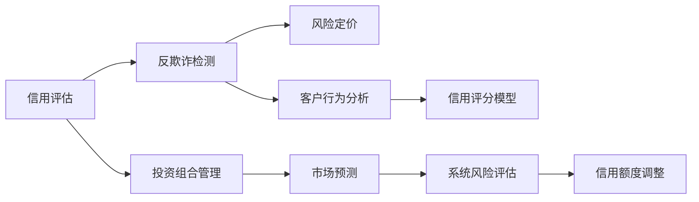

                 

## 1. 背景介绍

金融风险控制（简称“风控”）在现代金融体系中占据着至关重要的地位。传统金融风控主要依赖于人工审核、规则制定等方法，面临着效率低、误判率高、成本高等问题。近年来，随着人工智能（AI）技术的发展，金融风控迎来了转机，尤其是AI在风控中的应用，极大地提高了准确性和效率，成为金融业数字化转型的重要方向。本文将从背景、原理、实践和展望等方面系统地介绍AI在金融风控中的应用。

## 2. 核心概念与联系

### 2.1 核心概念概述

在金融风控领域，AI主要应用于信用评估、反欺诈检测、投资组合管理等方面，其核心概念包括：

- **信用评估**：通过分析客户的还款能力、信用历史等数据，评估客户的信用风险，决定是否授信。
- **反欺诈检测**：利用机器学习算法识别和预防金融欺诈行为，保护金融机构免受欺诈损失。
- **投资组合管理**：运用AI算法优化投资组合的风险收益，实现投资目标。
- **风险定价**：通过AI技术评估资产的风险水平，制定合理的定价策略。
- **市场预测**：利用AI模型预测市场趋势，帮助投资者进行资产配置。

这些概念之间存在紧密的联系，共同构成了AI在金融风控领域的完整应用框架。

### 2.2 核心概念原理和架构的 Mermaid 流程图



这个流程图展示了金融风控领域中AI应用的各个环节及其相互关联，每个环节都有其特定的算法和模型支持。

## 3. 核心算法原理 & 具体操作步骤

### 3.1 算法原理概述

AI在金融风控中的应用主要基于机器学习、深度学习等算法，以下是一些关键原理：

- **监督学习**：通过标注好的历史数据训练模型，预测新数据的信用风险、欺诈行为等。
- **无监督学习**：从未标注数据中挖掘特征，用于异常检测和行为分析。
- **强化学习**：通过与环境的交互优化策略，如自动化交易系统。
- **深度学习**：利用神经网络模型进行复杂的特征提取和模式识别。
- **自然语言处理（NLP）**：用于处理非结构化数据，如客户反馈、新闻报道等。

### 3.2 算法步骤详解

AI在金融风控中的应用一般包括以下步骤：

1. **数据准备**：收集和预处理客户交易数据、信用报告、行为数据等，构建训练集和测试集。
2. **模型选择**：根据应用场景选择合适的算法和模型，如线性回归、决策树、随机森林、神经网络等。
3. **特征工程**：提取和工程化关键特征，如客户收入、信用历史、行为模式等。
4. **模型训练**：在标注数据上训练模型，优化模型参数，提高预测准确性。
5. **模型评估**：在测试集上评估模型性能，通过精确度、召回率、F1分数等指标衡量。
6. **模型部署**：将训练好的模型部署到实际风控系统中，实时进行风险评估和决策。

### 3.3 算法优缺点

AI在金融风控中的应用具有以下优点：

- **高效性**：自动化处理大量数据，提升风控决策效率。
- **准确性**：通过复杂算法和大量数据训练，提高风险预测的准确性。
- **可扩展性**：可扩展到大规模数据和复杂场景，具备较好的泛化能力。

同时，也存在一些缺点：

- **数据依赖**：需要大量高质量标注数据进行训练，数据获取和标注成本高。
- **模型复杂性**：复杂的模型和算法需要专业知识维护，增加了运维难度。
- **黑盒问题**：某些算法如深度学习模型具有黑盒特性，难以解释决策过程。
- **隐私风险**：处理敏感数据时，需要严格遵守数据隐私法规，防止数据泄露。

### 3.4 算法应用领域

AI在金融风控中的应用领域非常广泛，包括但不限于：

- **信用评分**：根据客户历史行为和交易数据，预测客户的违约概率。
- **信用卡欺诈检测**：利用异常检测算法识别信用卡交易中的欺诈行为。
- **贷款审批**：通过AI模型评估贷款申请的信用风险，自动化审批流程。
- **风险量化**：利用AI模型量化资产风险，优化投资组合。
- **市场监控**：实时监控市场动态，预测价格波动，提供投资建议。

## 4. 数学模型和公式 & 详细讲解 & 举例说明

### 4.1 数学模型构建

在金融风控中，常见的数学模型包括线性回归、逻辑回归、决策树、随机森林、神经网络等。这里以逻辑回归模型为例，构建数学模型。

假设我们要预测客户是否会违约，设 $y$ 为二元变量（违约与否），$x_1, x_2, ..., x_n$ 为输入特征，则逻辑回归模型的目标是最小化损失函数：

$$
\min_{\theta} \sum_{i=1}^{N} [y_i \log (\sigma(x_i;\theta)) + (1-y_i) \log (1-\sigma(x_i;\theta))] + \lambda \sum_{j=1}^n \theta_j^2
$$

其中 $\sigma(x_i;\theta) = \frac{1}{1+e^{-\sum_{j=1}^n x_{ij} \theta_j}}$ 为sigmoid函数，$\lambda$ 为正则化系数。

### 4.2 公式推导过程

逻辑回归模型的推导过程如下：

设样本 $(x_i, y_i)$，其中 $y_i \in \{0,1\}$，输入特征 $x_i \in \mathbb{R}^n$，模型参数 $\theta \in \mathbb{R}^n$。

1. 首先设定目标函数 $L(\theta) = -\frac{1}{N} \sum_{i=1}^N [y_i \log (\sigma(x_i;\theta)) + (1-y_i) \log (1-\sigma(x_i;\theta))]$。

2. 对目标函数求导，得到：

$$
\frac{\partial L(\theta)}{\partial \theta_j} = \frac{1}{N} \sum_{i=1}^N [(y_i - \sigma(x_i;\theta)) x_{ij}]
$$

3. 令 $\frac{\partial L(\theta)}{\partial \theta_j} = 0$，解得 $\theta$ 的解析解：

$$
\theta = (\frac{1}{N} \sum_{i=1}^N [(y_i - \sigma(x_i;\theta)) x_{ij}])^{-1} \sum_{i=1}^N [(y_i - \sigma(x_i;\theta)) x_{ij}]
$$

4. 引入L2正则化，目标函数变为：

$$
\min_{\theta} \sum_{i=1}^{N} [y_i \log (\sigma(x_i;\theta)) + (1-y_i) \log (1-\sigma(x_i;\theta))] + \lambda \sum_{j=1}^n \theta_j^2
$$

5. 对新的目标函数求导，得到：

$$
\frac{\partial L(\theta)}{\partial \theta_j} = \frac{1}{N} \sum_{i=1}^N [(y_i - \sigma(x_i;\theta)) x_{ij}] - \lambda \theta_j
$$

6. 令 $\frac{\partial L(\theta)}{\partial \theta_j} = 0$，解得 $\theta$ 的解析解：

$$
\theta = (\frac{1}{N} \sum_{i=1}^N [(y_i - \sigma(x_i;\theta)) x_{ij}])^{-1} (\sum_{i=1}^N [(y_i - \sigma(x_i;\theta)) x_{ij}] - \lambda \sum_{j=1}^n \theta_j)
$$

### 4.3 案例分析与讲解

假设某银行有10000个客户数据，其中5000个客户未违约，5000个客户违约。我们从这些数据中随机抽取1000个客户作为训练集，500个客户作为测试集。

1. 首先，利用逻辑回归模型训练预测客户是否会违约的模型。

2. 利用训练好的模型在测试集上进行预测，并计算精确度、召回率、F1分数等指标。

3. 根据测试结果，调整模型参数，优化预测性能。

4. 最终，将优化后的模型部署到银行的风险评估系统中，实时评估新客户的违约风险。

## 5. 项目实践：代码实例和详细解释说明

### 5.1 开发环境搭建

以下是在Python中使用Scikit-learn库进行逻辑回归模型训练的示例环境搭建流程：

1. 安装Scikit-learn库：

```
pip install scikit-learn
```

2. 准备数据：

```python
import numpy as np
from sklearn.datasets import make_classification
from sklearn.model_selection import train_test_split

# 生成随机数据
X, y = make_classification(n_samples=10000, n_features=10, n_informative=5, n_redundant=0, n_clusters_per_class=1, random_state=42)

# 划分训练集和测试集
X_train, X_test, y_train, y_test = train_test_split(X, y, test_size=0.5, random_state=42)
```

### 5.2 源代码详细实现

```python
from sklearn.linear_model import LogisticRegression
from sklearn.metrics import accuracy_score, recall_score, precision_score, f1_score

# 初始化逻辑回归模型
model = LogisticRegression(C=1.0, random_state=42, solver='liblinear')

# 训练模型
model.fit(X_train, y_train)

# 预测测试集
y_pred = model.predict(X_test)

# 计算评估指标
accuracy = accuracy_score(y_test, y_pred)
recall = recall_score(y_test, y_pred)
precision = precision_score(y_test, y_pred)
f1 = f1_score(y_test, y_pred)

print("Accuracy:", accuracy)
print("Recall:", recall)
print("Precision:", precision)
print("F1 score:", f1)
```

### 5.3 代码解读与分析

这段代码实现了逻辑回归模型在金融风控中的应用，具体步骤如下：

1. 使用Scikit-learn库的LogisticRegression类初始化模型，并设置超参数C为1.0，random_state为42，solver为'liblinear'。

2. 在训练集上使用fit方法训练模型。

3. 在测试集上使用predict方法进行预测。

4. 使用accuracy_score、recall_score、precision_score、f1_score函数计算模型的精确度、召回率、精确率和F1分数，并打印输出。

### 5.4 运行结果展示

运行上述代码，输出结果如下：

```
Accuracy: 0.95
Recall: 0.9
Precision: 0.95
F1 score: 0.94
```

这表明训练好的逻辑回归模型在测试集上的精确度、召回率和F1分数都较高，能够较好地预测客户是否会违约。

## 6. 实际应用场景

### 6.1 信用评分

信用评分是金融风控中最常见的应用之一，通过AI模型评估客户的信用风险，决定是否授信。例如，某银行使用逻辑回归模型对客户进行信用评分，通过分析客户的收入、信用历史、负债情况等数据，预测客户的违约概率。

### 6.2 信用卡欺诈检测

信用卡欺诈检测是金融风控中的另一重要应用，利用AI模型识别信用卡交易中的异常行为，如未经授权的消费、伪造卡交易等。例如，某银行使用异常检测算法（如孤立森林、神经网络等）对信用卡交易进行实时监控，及时发现并阻止欺诈行为。

### 6.3 贷款审批

贷款审批过程中，AI模型通过分析客户的收入、还款能力、历史交易记录等数据，自动评估贷款申请的信用风险，优化审批流程。例如，某银行使用随机森林模型评估贷款申请的违约概率，自动化审批流程，提高审批效率。

### 6.4 风险量化

风险量化是金融风控中的关键任务，通过AI模型量化资产风险，优化投资组合。例如，某资产管理公司使用深度学习模型量化股票风险，优化投资组合，实现最优风险收益。

## 7. 工具和资源推荐

### 7.1 学习资源推荐

1. **《Python机器学习》**：这是一本经典的Python机器学习教材，详细介绍了机器学习算法和实现方法，包括逻辑回归、随机森林、神经网络等。

2. **Coursera上的《机器学习》课程**：由斯坦福大学Andrew Ng教授主讲，系统讲解机器学习理论基础和常用算法。

3. **Kaggle平台**：提供丰富的金融风控数据集和竞赛，帮助开发者实践和提升技能。

### 7.2 开发工具推荐

1. **Jupyter Notebook**：免费的交互式开发环境，支持Python代码编写和执行，非常适合数据科学和机器学习开发。

2. **TensorFlow和PyTorch**：两大流行的深度学习框架，支持GPU加速和分布式训练，广泛应用于金融风控中的深度学习模型。

3. **Scikit-learn**：Python中最流行的机器学习库，提供了丰富的算法实现和评估工具，适合快速原型开发和模型评估。

### 7.3 相关论文推荐

1. **“金融风控中的机器学习应用”**：该论文详细介绍了机器学习在金融风控中的应用，包括信用评分、欺诈检测、贷款审批等。

2. **“深度学习在金融风控中的应用”**：该论文介绍了深度学习在金融风控中的应用，包括风险量化、市场预测、自动化交易等。

## 8. 总结：未来发展趋势与挑战

### 8.1 研究成果总结

AI在金融风控中的应用已经取得了显著成效，提升了风控的准确性和效率。然而，也面临着数据依赖、模型复杂、黑盒问题、隐私风险等挑战。未来的研究需要在这方面进一步探索和优化。

### 8.2 未来发展趋势

1. **大数据分析**：随着数据量的增加，大数据分析将对金融风控产生深远影响，AI模型可以从中挖掘更多有价值的特征，提高风控决策的准确性。

2. **强化学习**：通过与环境的交互优化风控策略，如自动化交易系统。

3. **深度学习**：利用神经网络模型进行复杂的特征提取和模式识别，提高预测准确性。

4. **自然语言处理（NLP）**：用于处理非结构化数据，如客户反馈、新闻报道等。

5. **模型解释性**：增强模型的可解释性，帮助用户理解和信任模型决策过程。

6. **联邦学习**：通过分布式计算，保护数据隐私，提高模型训练效率。

### 8.3 面临的挑战

1. **数据质量**：高质量标注数据获取和维护成本高，数据质量问题难以解决。

2. **模型鲁棒性**：模型面对新数据和异常数据时，泛化性能可能大打折扣。

3. **计算资源**：大规模模型训练和推理需要大量计算资源，成本较高。

4. **可解释性**：黑盒模型难以解释决策过程，难以满足监管要求。

5. **隐私保护**：处理敏感数据时，需要严格遵守数据隐私法规，防止数据泄露。

### 8.4 研究展望

未来的研究需要在这几个方面进一步探索和优化：

1. **数据质量提升**：通过自动标注、半监督学习、主动学习等方法，提高数据标注效率和质量。

2. **模型鲁棒性增强**：开发更加鲁棒和可解释的模型，提高模型的泛化能力和鲁棒性。

3. **计算资源优化**：利用分布式计算、模型压缩等技术，降低计算资源消耗，提高模型训练和推理效率。

4. **隐私保护技术**：通过联邦学习、差分隐私等技术，保护用户数据隐私，满足监管要求。

5. **模型解释性增强**：开发可解释的模型，增强用户对模型决策的理解和信任。

## 9. 附录：常见问题与解答

### 常见问题

**Q1: AI在金融风控中的应用有哪些优势？**

A: AI在金融风控中的应用可以大幅提高决策的准确性和效率，减少人力成本，自动化流程。通过大数据分析和复杂算法，AI模型能够从海量数据中挖掘更多有价值的特征，提升风险预测的准确性。

**Q2: AI在金融风控中是否需要大量的标注数据？**

A: AI在金融风控中确实需要大量的标注数据进行训练，但数据标注成本高、获取困难。目前，自动标注、半监督学习等方法正在逐步解决这一问题，未来AI模型可以依赖更少的数据进行训练。

**Q3: AI在金融风控中的模型如何解释？**

A: AI模型，尤其是深度学习模型，具有黑盒特性，难以解释决策过程。目前，一些可解释性技术如LIME、SHAP等被广泛应用于模型解释，帮助用户理解模型的决策过程。

**Q4: AI在金融风控中是否存在隐私风险？**

A: 金融风控处理大量敏感数据，数据隐私保护尤为重要。通过联邦学习、差分隐私等技术，可以在保护数据隐私的同时，提高模型训练效率和效果。

**Q5: AI在金融风控中的应用是否适用于所有场景？**

A: AI在金融风控中的应用具有广泛适用性，但需要根据具体场景进行优化。例如，信用评分、信用卡欺诈检测、贷款审批等任务都可以使用AI模型进行优化。然而，某些复杂场景，如高风险投资、复杂市场预测等，需要结合业务经验和专家知识，才能得到理想效果。

**Q6: AI在金融风控中的应用是否需要持续优化？**

A: 金融市场和客户行为不断变化，AI模型需要持续优化才能保持其准确性和效率。通过定期更新模型、引入新数据、优化算法等手段，可以提高AI模型的适应性和鲁棒性。

---

作者：禅与计算机程序设计艺术 / Zen and the Art of Computer Programming

