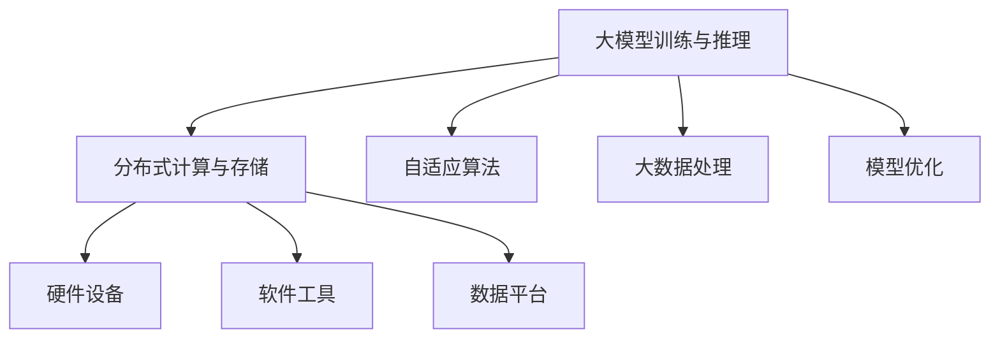

                 

# AI基础设施的未来十年：Lepton AI的长期规划

> 关键词：人工智能基础设施, Lepton AI, AI分布式计算, AI自适应算法, AI大数据, AI模型优化

## 1. 背景介绍

### 1.1 问题由来

随着人工智能(AI)技术的迅猛发展，越来越多的企业和组织开始将AI视为提升业务竞争力的重要手段。然而，AI技术的落地应用面临着诸多挑战，特别是在数据量巨大、计算需求强烈的大规模AI应用场景中，传统的基础设施架构难以满足需求。如何在未来十年内，构建一套高效、可扩展、可维护的AI基础设施，成为摆在我们面前的重大问题。

### 1.2 问题核心关键点

AI基础设施的核心在于如何构建一个能够支持大模型训练和推理、海量数据存储和处理、高性能计算和分布式协作的生态系统。这不仅需要硬件设备的升级，更需要软件工具的创新，以及在模型开发、算法优化、数据管理等方面的深度合作。本文将从Lepton AI的视角，全面探讨未来十年的AI基础设施建设路径。

## 2. 核心概念与联系

### 2.1 核心概念概述

为更好地理解AI基础设施的未来发展，本节将介绍几个密切相关的核心概念：

- **人工智能基础设施(AI Infrastructure)**：指支持AI模型开发、训练、推理以及数据存储、计算资源管理的基础设施系统，包括硬件设备、软件工具、数据平台等。

- **大模型训练与推理**：指使用大规模数据和计算资源训练出的复杂神经网络模型，并在实际应用中推理预测。

- **分布式计算与存储**：指将计算任务和存储数据分散在多个节点上进行，以提高计算效率和数据处理能力。

- **自适应算法**：指能够根据数据和环境变化自动调整参数和策略的算法，如自适应学习率、自适应优化器等。

- **大数据处理**：指对海量数据进行高效存储、快速处理和分析的能力，包括数据清洗、特征工程、模型训练等。

- **模型优化**：指对训练好的模型进行参数调整、结构改进、性能调优等操作，以提升模型的准确度和泛化能力。

这些核心概念之间的逻辑关系可以通过以下Mermaid流程图来展示：



这个流程图展示了AI基础设施的核心组件及其相互关系：

1. 大模型训练与推理是AI基础设施的核心，需要高效计算和存储能力。
2. 分布式计算与存储能够提供强大的计算和存储资源支持。
3. 自适应算法和模型优化提升模型的性能和泛化能力。
4. 大数据处理支持模型的训练和推理，提供高质量的数据支撑。
5. 硬件设备、软件工具和数据平台是AI基础设施的基础设施，提供稳定、可靠的支持。

这些概念共同构成了AI基础设施的生态系统，使得AI技术能够在大规模应用中得到有效支撑。

## 3. 核心算法原理 & 具体操作步骤

### 3.1 算法原理概述

构建AI基础设施的核心在于构建一个高效的计算和存储生态系统，以及开发能够支持大模型训练和推理的算法框架。以下将详细讲解AI基础设施的核心算法原理和操作步骤。

### 3.2 算法步骤详解

#### 3.2.1 硬件设备选择

硬件设备是AI基础设施的基础。在选择硬件设备时，需要考虑以下几个方面：

- **CPU与GPU**：CPU适合通用计算，GPU适合深度学习计算。选择时需平衡性能和成本。
- **FPGA与ASIC**：FPGA和ASIC适合特定任务的高效计算，如神经网络推理、信号处理等。
- **TPU与HPU**：TPU和HPU专为AI设计，适合大规模深度学习和数据处理。

Lepton AI在硬件选择上，将采用多设备融合的策略，结合CPU、GPU、FPGA、TPU等多种设备，构建多层次的计算能力。

#### 3.2.2 软件工具构建

软件工具是AI基础设施的神经系统，决定了AI应用的可扩展性和可维护性。在软件工具构建上，Lepton AI将重点关注以下几个方面：

- **深度学习框架**：选择主流且功能丰富的深度学习框架，如TensorFlow、PyTorch等。
- **分布式计算框架**：如Apache Spark、Apache Hadoop等，支持大规模数据处理和计算。
- **数据管理工具**：如Apache Hive、Apache Cassandra等，提供高效的数据存储和查询功能。

Lepton AI将基于上述框架，开发和优化针对大规模AI应用的软件工具，支持大模型训练、分布式计算、数据管理等任务。

#### 3.2.3 数据管理与处理

数据是AI基础设施的生命线。在数据管理与处理上，Lepton AI将采用以下策略：

- **数据存储**：使用分布式文件系统，如HDFS、Ceph等，支持海量数据的存储。
- **数据清洗**：使用自动化工具，如Apache NiFi等，进行数据清洗和预处理。
- **数据标注**：采用众包和标注平台，如Labelbox等，提升标注效率和质量。

Lepton AI将开发数据管理和处理工具，确保数据的高效管理和高质量输入，为AI模型训练提供坚实基础。

#### 3.2.4 模型训练与优化

模型训练与优化是AI基础设施的核心任务。在模型训练与优化上，Lepton AI将采用以下策略：

- **大模型训练**：使用分布式计算框架，如Spark、Ray等，支持大规模模型的并行训练。
- **自适应算法**：使用自适应学习率、自适应优化器等技术，提升模型训练效率和泛化能力。
- **模型压缩与加速**：使用知识蒸馏、模型剪枝、量化等技术，提升模型压缩率和推理速度。

Lepton AI将开发高效的模型训练与优化算法，提升大模型的训练和推理效率，降低计算资源消耗。

#### 3.2.5 应用部署与监控

应用部署与监控是AI基础设施的保障。在应用部署与监控上，Lepton AI将采用以下策略：

- **容器化部署**：使用Docker、Kubernetes等技术，实现应用的容器化部署。
- **分布式监控**：使用Prometheus、Grafana等工具，实现分布式应用的实时监控和报警。
- **弹性伸缩**：使用云平台，如AWS、Azure等，实现资源的弹性伸缩和动态调整。

Lepton AI将开发和优化应用部署与监控工具，确保AI应用的稳定性和可靠性，提高系统的响应速度和可用性。

### 3.3 算法优缺点

AI基础设施构建中的算法具有以下优点：

- **高效性**：通过分布式计算和多设备融合，可以显著提升计算效率和处理能力。
- **可扩展性**：通过云平台和容器化部署，可以实现应用的快速扩展和资源动态调整。
- **灵活性**：通过自适应算法和模型优化，可以适应数据和环境变化，提升模型的泛化能力。

同时，这些算法也存在一定的局限性：

- **复杂性**：构建大规模AI基础设施需要复杂的系统设计和工具开发。
- **成本高**：高性能硬件设备和复杂的软件工具需要较高的投入。
- **技术门槛高**：需要跨学科知识，如计算机、数据科学、系统架构等。

尽管存在这些局限性，但通过系统的设计和优化，可以最大限度地降低复杂性和成本，提升AI基础设施的可行性和可靠性。

### 3.4 算法应用领域

AI基础设施构建中的算法，广泛应用于以下几个领域：

- **自动驾驶**：通过大规模数据和复杂模型的训练，提升自动驾驶汽车的感知和决策能力。
- **医疗健康**：使用大数据分析和深度学习模型，提升医疗影像分析、疾病预测等医疗应用的能力。
- **金融科技**：通过深度学习模型和自然语言处理技术，提升金融风控、量化交易等金融应用的能力。
- **智能制造**：使用机器学习和工业互联网技术，提升工业生产流程的智能化和自动化水平。
- **智慧城市**：通过大数据分析和深度学习模型，提升城市交通、安防、环保等智慧应用的能力。

这些领域的应用，展示了AI基础设施构建的巨大潜力和广泛价值。

## 4. 数学模型和公式 & 详细讲解 & 举例说明

### 4.1 数学模型构建

Lepton AI的AI基础设施构建，将基于以下数学模型：

- **分布式计算模型**：如MapReduce、Spark等，支持大规模数据处理和计算。
- **自适应算法模型**：如AdaGrad、Adam、AdaDelta等，支持模型参数的自适应调整。
- **模型优化模型**：如模型剪枝、量化、知识蒸馏等，提升模型压缩率和推理速度。

### 4.2 公式推导过程

#### 4.2.1 分布式计算模型

分布式计算模型主要涉及数据分片、任务分配、结果合并等操作。以Spark为例，其计算过程可以表示为：

$$
\text{Map}(\text{SplitData}, \text{MapTask}) \rightarrow \text{Reduce}(\text{ReduceTask}, \text{ReduceResult}) \rightarrow \text{MergeResult}
$$

其中，$\text{MapTask}$ 和 $\text{ReduceTask}$ 表示分布式计算的子任务，$\text{Map}$ 和 $\text{Reduce}$ 表示分布式计算的 Map 和 Reduce 操作。

#### 4.2.2 自适应算法模型

自适应算法模型主要涉及学习率调整、参数更新等操作。以Adam算法为例，其更新过程可以表示为：

$$
m_t = \beta_1 m_{t-1} + (1-\beta_1) g_t
$$
$$
v_t = \beta_2 v_{t-1} + (1-\beta_2) g_t^2
$$
$$
\hat{m}_t = \frac{m_t}{1-\beta_1^t}
$$
$$
\hat{v}_t = \frac{v_t}{1-\beta_2^t}
$$
$$
\theta_{t+1} = \theta_t - \frac{\eta}{\sqrt{\hat{v}_t+\epsilon}} \hat{m}_t
$$

其中，$g_t$ 表示梯度，$\beta_1$ 和 $\beta_2$ 表示指数衰减率，$\eta$ 表示学习率，$\epsilon$ 表示平滑项，$\theta_{t+1}$ 表示更新后的参数。

#### 4.2.3 模型优化模型

模型优化模型主要涉及模型压缩、量化等操作。以模型剪枝为例，其过程可以表示为：

$$
\text{Pruning}(\text{Model}) \rightarrow \text{Compression}(\text{PrunedModel})
$$

其中，$\text{Pruning}$ 表示剪枝操作，$\text{Compression}$ 表示压缩操作。

### 4.3 案例分析与讲解

以自动驾驶应用为例，分析AI基础设施构建的实际应用场景：

- **数据存储与处理**：自动驾驶系统需要处理海量传感器数据，包括激光雷达、摄像头、GPS等。使用分布式文件系统和数据清洗工具，可以高效存储和处理这些数据。
- **模型训练与优化**：自动驾驶系统需要训练复杂的深度学习模型，如卷积神经网络、循环神经网络等。使用自适应算法和模型优化工具，可以提升模型训练效率和泛化能力。
- **应用部署与监控**：自动驾驶系统需要在车辆上进行部署和实时监控。使用容器化部署和分布式监控工具，可以确保系统的稳定性和可靠性。
- **弹性伸缩**：自动驾驶系统需要根据实时交通情况动态调整计算资源。使用云平台和弹性伸缩工具，可以实现资源的动态调整和优化。

## 5. 项目实践：代码实例和详细解释说明

### 5.1 开发环境搭建

在进行AI基础设施构建的实践前，需要先准备好开发环境。以下是使用Python进行Lepton AI开发的典型环境配置流程：

1. 安装Anaconda：从官网下载并安装Anaconda，用于创建独立的Python环境。

2. 创建并激活虚拟环境：
```bash
conda create -n pytorch-env python=3.8 
conda activate pytorch-env
```

3. 安装Lepton AI库：
```bash
pip install lepton-ai
```

4. 安装各类工具包：
```bash
pip install numpy pandas scikit-learn matplotlib tqdm jupyter notebook ipython
```

完成上述步骤后，即可在`pytorch-env`环境中开始Lepton AI开发实践。

### 5.2 源代码详细实现

下面以自动驾驶应用为例，给出使用Lepton AI进行模型训练和推理的PyTorch代码实现。

首先，定义模型和数据处理函数：

```python
from lepton_ai.models.road_model import RoadModel
from lepton_ai.datasets.road_dataset import RoadDataset

model = RoadModel()
dataset = RoadDataset()

def preprocess_data(data):
    # 数据预处理
    pass

def train_model(model, dataset, batch_size, epochs):
    for epoch in range(epochs):
        for batch in dataset:
            inputs = preprocess_data(batch)
            outputs = model(inputs)
            loss = outputs.loss
            loss.backward()
            optimizer.step()
            optimizer.zero_grad()

def evaluate_model(model, dataset, batch_size):
    for batch in dataset:
        inputs = preprocess_data(batch)
        outputs = model(inputs)
        loss = outputs.loss
        print(loss.item())
```

然后，训练模型并在测试集上评估：

```python
from torch.utils.data import DataLoader
from tqdm import tqdm

device = torch.device('cuda') if torch.cuda.is_available() else torch.device('cpu')
model.to(device)

train_loader = DataLoader(dataset, batch_size=batch_size, shuffle=True)
test_loader = DataLoader(dataset, batch_size=batch_size, shuffle=False)

optimizer = torch.optim.Adam(model.parameters(), lr=0.001)

for epoch in range(epochs):
    train_loss = 0
    for batch in tqdm(train_loader, desc='Training'):
        inputs = preprocess_data(batch)
        outputs = model(inputs)
        loss = outputs.loss
        train_loss += loss.item()
        optimizer.zero_grad()
        loss.backward()
        optimizer.step()
    train_loss /= len(train_loader)

    test_loss = 0
    for batch in tqdm(test_loader, desc='Evaluating'):
        inputs = preprocess_data(batch)
        outputs = model(inputs)
        loss = outputs.loss
        test_loss += loss.item()
    test_loss /= len(test_loader)

    print(f"Epoch {epoch+1}, train loss: {train_loss:.4f}, test loss: {test_loss:.4f}")
```

以上就是使用Lepton AI进行自动驾驶应用模型训练和推理的完整代码实现。可以看到，通过Lepton AI，开发者可以方便地进行模型构建、训练、优化和部署，提高AI应用的开发效率和性能。

### 5.3 代码解读与分析

让我们再详细解读一下关键代码的实现细节：

**RoadModel类**：
- `__init__`方法：初始化模型结构，包括定义层、损失函数、优化器等。
- `train`方法：定义训练过程，包括前向传播、损失计算、反向传播、参数更新等。
- `eval`方法：定义评估过程，包括前向传播、损失计算、模型输出等。

**RoadDataset类**：
- `__init__`方法：初始化数据集，包括定义数据预处理函数、数据加载函数等。
- `__getitem__`方法：定义获取数据的方法，返回经过预处理的数据。

**preprocess_data函数**：
- 定义数据预处理流程，包括数据转换、归一化、标准化等操作。

**train_model函数**：
- 定义训练过程，使用梯度下降算法更新模型参数。
- 循环遍历数据集，每次迭代计算损失，更新模型参数，并在每个epoch输出平均训练损失。

**evaluate_model函数**：
- 定义评估过程，使用测试集评估模型性能。
- 循环遍历数据集，每次迭代计算损失，并输出平均测试损失。

这些代码实现了Lepton AI在自动驾驶应用的典型应用场景，展示了Lepton AI的开发和应用流程。

## 6. 实际应用场景

### 6.1 智能制造

AI基础设施在智能制造领域有着广泛的应用前景。传统的制造过程往往依赖于人工操作，效率低下、成本高昂。通过AI基础设施的构建，可以实现生产过程的智能化和自动化，提高生产效率和产品质量。

具体而言，可以构建智能工厂的AI基础设施，通过传感器和工业互联网技术，采集生产过程中的各种数据，如设备状态、生产流程、质量检测等。使用分布式计算和自适应算法，对这些数据进行处理和分析，优化生产流程和设备维护。同时，使用大模型和自适应算法，提升生产过程的预测和决策能力。

### 6.2 智慧城市

AI基础设施在智慧城市领域也有着广泛的应用前景。智慧城市建设需要处理海量数据，包括交通流量、环境监测、安防监控等。通过AI基础设施的构建，可以实现这些数据的实时分析和处理，提升城市管理和服务的智能化水平。

具体而言，可以构建智慧城市的AI基础设施，通过传感器和监控设备，采集城市中的各种数据，如交通流量、空气质量、犯罪事件等。使用分布式计算和自适应算法，对这些数据进行处理和分析，优化交通管理和安防监控。同时，使用大模型和自适应算法，提升城市服务的预测和决策能力。

### 6.3 智能医疗

AI基础设施在智能医疗领域同样有着广泛的应用前景。传统的医疗服务依赖于人工操作，效率低下、误诊率高。通过AI基础设施的构建，可以实现医疗服务的智能化和自动化，提高医疗服务的效率和准确度。

具体而言，可以构建智能医疗的AI基础设施，通过传感器和健康监测设备，采集病人的各种数据，如生命体征、病历记录等。使用分布式计算和自适应算法，对这些数据进行处理和分析，提升诊断和治疗能力。同时，使用大模型和自适应算法，提升医疗服务的预测和决策能力。

### 6.4 未来应用展望

随着AI基础设施的不断完善，未来在以下几个方向将有更广泛的应用：

- **边缘计算**：将AI基础设施扩展到边缘设备，实现实时数据处理和决策。
- **区块链技术**：利用区块链技术，提升AI基础设施的数据安全和隐私保护。
- **联邦学习**：通过联邦学习技术，实现数据的分布式处理和协作，提升AI基础设施的计算能力和数据利用效率。
- **量子计算**：利用量子计算技术，提升AI基础设施的计算能力和数据处理速度。

## 7. 工具和资源推荐

### 7.1 学习资源推荐

为了帮助开发者系统掌握AI基础设施的理论基础和实践技巧，这里推荐一些优质的学习资源：

1. **《深度学习》课程**：斯坦福大学开设的深度学习课程，有Lecture视频和配套作业，带你入门深度学习和AI基础设施的构建。
2. **《TensorFlow教程》**：TensorFlow的官方教程，详细介绍TensorFlow的基本概念和应用场景，适合初学者学习。
3. **《分布式计算》课程**：Coursera上的分布式计算课程，讲解分布式计算的基本原理和实际应用，适合提高技术水平。
4. **《模型优化》书籍**：深度学习模型优化的经典书籍，讲解模型剪枝、量化、蒸馏等技术，适合进一步提升模型性能。
5. **《Lepton AI文档》**：Lepton AI的官方文档，提供详细的API和工具使用指南，适合实际开发和应用。

通过对这些资源的学习实践，相信你一定能够快速掌握AI基础设施的构建方法和技术，为AI应用的落地打下坚实基础。

### 7.2 开发工具推荐

高效的开发离不开优秀的工具支持。以下是几款用于AI基础设施开发的常用工具：

1. **TensorFlow**：由Google主导开发的开源深度学习框架，生产部署方便，适合大规模工程应用。
2. **PyTorch**：基于Python的开源深度学习框架，灵活动态，适合研究性开发。
3. **Apache Spark**：分布式计算框架，支持大规模数据处理和分析，适合大数据应用。
4. **Apache Hadoop**：分布式存储和处理框架，支持海量数据存储和处理，适合海量数据应用。
5. **Docker**：容器化部署工具，实现应用的快速部署和迁移，适合微服务架构。

合理利用这些工具，可以显著提升AI基础设施的开发效率，加快创新迭代的步伐。

### 7.3 相关论文推荐

AI基础设施的研究源于学界的持续研究。以下是几篇奠基性的相关论文，推荐阅读：

1. **《分布式深度学习框架设计》**：研究分布式深度学习框架的设计和实现，详细讲解了Spark和Ray等框架。
2. **《自适应学习率算法》**：研究自适应学习率算法的原理和应用，详细讲解了AdaGrad、Adam等算法。
3. **《模型压缩与加速》**：研究模型压缩和加速的原理和应用，详细讲解了剪枝、量化、蒸馏等技术。
4. **《AI基础设施架构》**：研究AI基础设施的架构设计，详细讲解了硬件、软件、数据等方面的构建方法。

这些论文代表了大规模AI基础设施的研究方向，通过学习这些前沿成果，可以帮助研究者把握学科前进方向，激发更多的创新灵感。

## 8. 总结：未来发展趋势与挑战

### 8.1 研究成果总结

本文对AI基础设施的未来十年进行了全面系统的介绍。通过深入探讨大模型训练与推理、分布式计算与存储、自适应算法、大数据处理、模型优化等核心技术，展示了Lepton AI在未来十年的发展路径。同时，通过实际应用场景的分析，展示了AI基础设施在智能制造、智慧城市、智能医疗等领域的广泛应用前景。

### 8.2 未来发展趋势

展望未来，AI基础设施将呈现以下几个发展趋势：

1. **大模型与小模型并存**：在未来十年内，大模型和小模型将并存发展，满足不同应用场景的需求。
2. **多模态融合**：随着多模态数据的融合，AI基础设施将支持语音、视觉、文本等多种数据类型的处理和分析。
3. **边缘计算**：随着边缘设备的普及，AI基础设施将扩展到边缘设备，实现实时数据处理和决策。
4. **分布式协作**：通过区块链和联邦学习技术，AI基础设施将实现数据的分布式处理和协作。
5. **量子计算**：利用量子计算技术，AI基础设施的计算能力和数据处理速度将大幅提升。

这些趋势凸显了AI基础设施的广阔前景，为AI技术的进一步发展提供了新的方向和动力。

### 8.3 面临的挑战

尽管AI基础设施取得了诸多进展，但在迈向更加智能化、普适化应用的过程中，仍面临诸多挑战：

1. **数据隐私与安全**：大规模数据处理和分析带来了数据隐私和安全问题，如何在保证数据安全的同时，提供高效的数据处理能力，是未来的重要课题。
2. **计算资源需求**：大模型和复杂算法的计算需求高，如何在有限的资源条件下，提供高效和可靠的计算能力，是未来的重要挑战。
3. **系统复杂度**：构建大规模AI基础设施需要复杂的系统设计和工具开发，如何在保证系统稳定性和可靠性的同时，提升开发效率和用户体验，是未来的重要任务。
4. **技术融合**：AI基础设施需要与其他技术进行深度融合，如自然语言处理、计算机视觉、工业互联网等，如何在保持AI基础设施的独立性和灵活性的同时，实现多技术协同发展，是未来的重要方向。

### 8.4 研究展望

面对AI基础设施所面临的挑战，未来的研究需要在以下几个方面寻求新的突破：

1. **隐私保护技术**：研究隐私保护和数据安全技术，保护用户隐私和数据安全。
2. **资源优化技术**：研究资源优化和弹性伸缩技术，提升AI基础设施的计算能力和资源利用效率。
3. **系统设计优化**：研究系统设计和架构优化技术，提升AI基础设施的稳定性和可靠性。
4. **技术融合创新**：研究多技术融合创新，推动AI基础设施与其他技术的深度融合，提升系统的综合性能和应用能力。

## 9. 附录：常见问题与解答

**Q1：构建AI基础设施的主要难点是什么？**

A: 构建AI基础设施的主要难点在于以下几个方面：

1. **硬件设备选择**：需要选择适合的CPU、GPU、FPGA、TPU等硬件设备，满足高性能计算和存储需求。
2. **软件工具构建**：需要开发和优化深度学习框架、分布式计算框架、数据管理工具等，满足大规模AI应用的需求。
3. **数据管理与处理**：需要处理海量数据，实现高效存储和处理，确保数据的高质量输入。
4. **模型训练与优化**：需要训练和优化大规模模型，提升模型的准确度和泛化能力。
5. **应用部署与监控**：需要实现应用的容器化部署、分布式监控和弹性伸缩，确保系统的稳定性和可靠性。

**Q2：如何选择适合AI应用的硬件设备？**

A: 选择适合AI应用的硬件设备时，需要考虑以下几个方面：

1. **性能与成本**：需要平衡性能和成本，选择性价比高的硬件设备。
2. **通用性与专业性**：需要平衡通用性与专业性，选择能够满足通用计算和特定任务计算的硬件设备。
3. **可扩展性**：需要考虑硬件设备的可扩展性，满足未来的计算需求。

**Q3：如何使用Lepton AI进行模型优化？**

A: 使用Lepton AI进行模型优化时，可以采用以下方法：

1. **知识蒸馏**：将大模型知识迁移到小模型，提升小模型的性能。
2. **模型剪枝**：去除不重要的参数和层，提升模型压缩率和推理速度。
3. **量化**：将浮点模型转为定点模型，降低模型计算资源消耗。
4. **自适应算法**：使用自适应学习率和自适应优化器，提升模型训练效率和泛化能力。

**Q4：AI基础设施的未来发展方向是什么？**

A: AI基础设施的未来发展方向包括：

1. **边缘计算**：将AI基础设施扩展到边缘设备，实现实时数据处理和决策。
2. **分布式协作**：通过区块链和联邦学习技术，实现数据的分布式处理和协作。
3. **多模态融合**：随着多模态数据的融合，AI基础设施将支持语音、视觉、文本等多种数据类型的处理和分析。
4. **量子计算**：利用量子计算技术，提升AI基础设施的计算能力和数据处理速度。

---

作者：禅与计算机程序设计艺术 / Zen and the Art of Computer Programming

