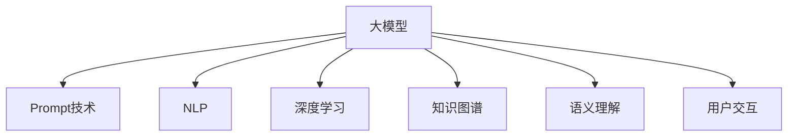

                 

# AI大模型Prompt提示词最佳实践：根据提供的开头部分完成文本

> 关键词：提示词Prompt, 大模型, 自然语言处理NLP, 深度学习, 语言模型, 知识图谱, 语义理解, 用户交互

## 1. 背景介绍

### 1.1 问题由来
随着人工智能技术的发展，大模型如GPT-3、BERT等在自然语言处理(NLP)领域取得了显著进展。这些大模型通过在大量无标签文本上预训练，学习到了丰富的语言知识，可以应用于各种NLP任务，如文本生成、分类、问答等。然而，大模型需要复杂的架构和大量的训练数据，部署成本较高。为了降低成本并提高模型的可解释性和灵活性，Prompt提示词技术应运而生。

Prompt提示词是指在模型输入中加入特定的文本格式或模板，引导模型按照期望方式生成或分类。Prompt技术可以极大地提升大模型的表现，且不需要修改模型参数，具有参数高效、零样本学习的特点。本文将详细介绍Prompt技术的原理、应用以及最佳实践，帮助开发者更有效地利用Prompt技术，提升AI大模型的性能。

### 1.2 问题核心关键点
Prompt技术的主要核心在于如何设计和构造提示词，以最大化地利用大模型的语言理解和生成能力。提示词的设计需要考虑以下几个关键点：
- **语义一致性**：提示词应与待处理的任务保持一致，避免歧义和误导模型。
- **简洁性**：提示词应尽可能简洁，避免过长或复杂结构，影响模型性能。
- **可扩展性**：提示词应具有较好的泛化能力，方便应用于不同的NLP任务。
- **多样性**：提示词应多样化，涵盖不同任务类型和场景，提高模型适应性。

## 2. 核心概念与联系

### 2.1 核心概念概述

为了更好地理解Prompt技术，本节将介绍几个密切相关的核心概念：

- **大模型(Large Language Model, LLM)**：指通过大量无标签文本预训练得到的深度神经网络模型，如GPT-3、BERT等。这些模型具备强大的语言理解与生成能力，广泛应用于各种NLP任务。

- **Prompt提示词**：指在模型输入中加入特定的文本格式或模板，引导模型按照期望方式生成或分类。提示词可以是完整的句子、短语、甚至单个词汇。

- **自然语言处理(Natural Language Processing, NLP)**：指计算机对自然语言的理解、生成、处理和分析。Prompt技术是NLP领域中的一个重要研究方向。

- **深度学习**：指通过多层神经网络进行训练和推理的机器学习方法。Prompt技术在大模型上的应用，是基于深度学习框架实现的。

- **知识图谱(Knowledge Graph)**：指以语义为核心的知识库，用于存储和查询实体间的关系。Prompt技术可以与知识图谱结合，提升模型对知识抽取和推理的能力。

- **语义理解(Semantic Understanding)**：指模型对自然语言语义的理解和分析。Prompt技术通过精心设计的提示词，帮助模型更好地理解输入内容。

- **用户交互(User Interaction)**：指人机交互界面上的输入与输出。Prompt技术使得大模型能够以更加自然、直观的方式与用户交互。

这些核心概念之间的逻辑关系可以通过以下Mermaid流程图来展示：



这个流程图展示了大模型Prompt技术的相关概念及其之间的关系：

1. 大模型通过深度学习框架实现，具备强大的语言理解和生成能力。
2. Prompt技术在大模型上应用，通过精心设计的提示词引导模型进行推理和生成。
3. NLP任务受益于Prompt技术，可以更高效地解决各类问题。
4. 深度学习提供了强大的训练基础，使得Prompt技术得以实现。
5. 知识图谱与Prompt结合，提升模型对复杂关系的理解。
6. 语义理解是Prompt技术的应用目标，帮助模型更好地理解输入。
7. 用户交互是Prompt技术的主要应用场景，提升人机交互的效率和质量。

## 3. 核心算法原理 & 具体操作步骤
### 3.1 算法原理概述

Prompt技术的核心思想是通过在模型输入中加入特定的提示词，引导模型按照期望的方式输出。其原理基于以下几点：

1. **自回归模型**：大模型通常采用自回归模型，即模型先预测下一个词的概率，再基于该概率分布生成后续词语。

2. **语言模型预训练**：大模型在大量无标签文本上预训练，学习到语言的统计规律和语义关系。

3. **条件概率分布**：提示词通过一定的文本格式或模板，改变模型输入的条件概率分布，从而影响模型的生成过程。

4. **样本条件生成**：模型在提示词的引导下，生成与提示词相符的输出样本。

5. **概率优化**：提示词通过优化模型的输出概率分布，使得模型生成的结果更符合任务需求。

### 3.2 算法步骤详解

基于Prompt技术的大模型应用一般包括以下几个关键步骤：

**Step 1: 准备数据集和提示词**
- 收集与任务相关的标注数据集，如对话数据、文本分类数据、摘要生成数据等。
- 设计合适的提示词，用于引导模型生成或分类。提示词可以是固定的模板，也可以是动态生成的文本。

**Step 2: 设计Prompt模板**
- 根据任务类型，设计合适的Prompt模板。提示词应简洁明了，包含必要的信息和任务提示。
- 例如，对于问答任务，提示词可以是：“请回答以下问题：[问题]”。

**Step 3: 训练和微调模型**
- 将标注数据集与提示词一起输入模型，进行训练和微调。
- 使用小批量训练，逐步增加提示词的影响力。
- 可以通过调整学习率、批大小等参数，优化训练过程。

**Step 4: 测试和评估**
- 在测试集上评估模型性能，对比微调前后的精度提升。
- 分析模型输出结果，评估其与任务需求的一致性。
- 记录输出结果，用于后续优化和调整。

**Step 5: 优化和调整**
- 根据测试结果，不断优化提示词和训练参数，提高模型性能。
- 引入正则化技术，防止过拟合。
- 使用对抗样本，增强模型鲁棒性。

### 3.3 算法优缺点

Prompt技术的优点包括：
- **参数高效**：不需要修改模型参数，节省训练和调参成本。
- **零样本学习**：通过提示词，模型可以无需标注数据，直接生成或分类结果。
- **灵活性高**：提示词可以根据任务需求灵活设计，适应性强。
- **鲁棒性好**：由于提示词的作用，模型对输入噪声和干扰具有一定的鲁棒性。

Prompt技术的主要缺点包括：
- **提示词设计复杂**：提示词需要精心设计，否则可能影响模型性能。
- **泛化能力有限**：提示词设计不当，模型可能对其他任务泛化能力不足。
- **模型依赖性强**：提示词的设计依赖于大模型的结构和预训练数据，调整提示词时需要考虑模型参数。
- **过拟合风险**：提示词设计不当，可能导致模型对特定样本过拟合。

### 3.4 算法应用领域

Prompt技术在大模型上的应用已经涵盖了各种NLP任务，包括但不限于：

- **问答系统**：通过精心设计的提示词，引导模型回答用户问题。
- **对话系统**：在多轮对话中，通过提示词控制对话流程和内容。
- **文本分类**：通过提示词引导模型对文本进行分类。
- **摘要生成**：通过提示词生成文本摘要。
- **文本生成**：通过提示词生成文本、代码等。
- **机器翻译**：通过提示词引导模型进行文本翻译。
- **情感分析**：通过提示词引导模型进行情感分类。

此外，Prompt技术还应用于语音识别、图像生成、推荐系统等多个领域，展示了其广泛的应用前景。

## 4. 数学模型和公式 & 详细讲解  
### 4.1 数学模型构建

本文将使用数学语言对Prompt技术的原理进行更加严格的刻画。

记大模型为 $M_{\theta}(x)$，其中 $x$ 为输入文本， $\theta$ 为模型参数。假设提示词为 $P(x)$，输出为 $y$。则Prompt技术的数学模型可以表示为：

$$
y = M_{\theta}(x \oplus P(x))
$$

其中 $\oplus$ 表示文本拼接操作。

定义损失函数 $\mathcal{L}$ 为输出 $y$ 与真实标签 $y^*$ 之间的差距。例如，对于分类任务，损失函数可以表示为交叉熵损失：

$$
\mathcal{L}(y, y^*) = -\sum_{i=1}^{N} y_i^* \log y_i
$$

其中 $y_i$ 为模型预测的概率值， $y_i^*$ 为真实标签。

### 4.2 公式推导过程

以文本分类任务为例，推导Prompt技术的损失函数及其梯度计算公式。

假设模型 $M_{\theta}$ 在输入 $x$ 上的输出为 $\hat{y}=M_{\theta}(x)$，表示样本属于类 $i$ 的概率。真实标签 $y \in \{1,2,...,K\}$。提示词为 $P(x)$。

则 Prompt 技术下的分类任务损失函数为：

$$
\mathcal{L}(\theta) = -\sum_{i=1}^{K} y_i^* \log M_{\theta}(x \oplus P(x))_i
$$

根据链式法则，损失函数对模型参数 $\theta$ 的梯度为：

$$
\frac{\partial \mathcal{L}(\theta)}{\partial \theta} = \frac{\partial}{\partial \theta} \left[ -\sum_{i=1}^{K} y_i^* \log M_{\theta}(x \oplus P(x))_i \right]
$$

其中， $\frac{\partial}{\partial \theta} M_{\theta}(x \oplus P(x))_i$ 可以通过自动微分技术高效计算。

在得到损失函数的梯度后，即可带入参数更新公式，完成模型的迭代优化。重复上述过程直至收敛，最终得到适应下游任务的最优模型参数 $\theta^*$。

## 5. 项目实践：代码实例和详细解释说明
### 5.1 开发环境搭建

在进行Prompt技术实践前，我们需要准备好开发环境。以下是使用Python进行PyTorch开发的环境配置流程：

1. 安装Anaconda：从官网下载并安装Anaconda，用于创建独立的Python环境。

2. 创建并激活虚拟环境：
```bash
conda create -n pytorch-env python=3.8 
conda activate pytorch-env
```

3. 安装PyTorch：根据CUDA版本，从官网获取对应的安装命令。例如：
```bash
conda install pytorch torchvision torchaudio cudatoolkit=11.1 -c pytorch -c conda-forge
```

4. 安装Transformers库：
```bash
pip install transformers
```

5. 安装各类工具包：
```bash
pip install numpy pandas scikit-learn matplotlib tqdm jupyter notebook ipython
```

完成上述步骤后，即可在`pytorch-env`环境中开始Prompt技术实践。

### 5.2 源代码详细实现

下面我们以文本分类任务为例，给出使用Transformers库对BERT模型进行Prompt技术应用的PyTorch代码实现。

首先，定义Prompt技术的数据处理函数：

```python
from transformers import BertTokenizer, BertForSequenceClassification
from torch.utils.data import Dataset
import torch

class PromptDataset(Dataset):
    def __init__(self, texts, labels, tokenizer, max_len=128):
        self.texts = texts
        self.labels = labels
        self.tokenizer = tokenizer
        self.max_len = max_len
        
    def __len__(self):
        return len(self.texts)
    
    def __getitem__(self, item):
        text = self.texts[item]
        label = self.labels[item]
        
        encoding = self.tokenizer(text, return_tensors='pt', max_length=self.max_len, padding='max_length', truncation=True)
        input_ids = encoding['input_ids'][0]
        attention_mask = encoding['attention_mask'][0]
        
        # 将标签转换为序列标签
        encoded_labels = [tag2id[label]] * self.max_len
        labels = torch.tensor(encoded_labels, dtype=torch.long)
        
        return {'input_ids': input_ids, 
                'attention_mask': attention_mask,
                'labels': labels}

# 标签与id的映射
tag2id = {'O': 0, 'C1': 1, 'C2': 2, 'C3': 3, 'C4': 4}
id2tag = {v: k for k, v in tag2id.items()}

# 创建dataset
tokenizer = BertTokenizer.from_pretrained('bert-base-cased')

train_dataset = PromptDataset(train_texts, train_labels, tokenizer)
dev_dataset = PromptDataset(dev_texts, dev_labels, tokenizer)
test_dataset = PromptDataset(test_texts, test_labels, tokenizer)
```

然后，定义模型和优化器：

```python
from transformers import AdamW

model = BertForSequenceClassification.from_pretrained('bert-base-cased', num_labels=len(tag2id))

optimizer = AdamW(model.parameters(), lr=2e-5)
```

接着，定义训练和评估函数：

```python
from torch.utils.data import DataLoader
from tqdm import tqdm
from sklearn.metrics import classification_report

device = torch.device('cuda') if torch.cuda.is_available() else torch.device('cpu')
model.to(device)

def train_epoch(model, dataset, batch_size, optimizer):
    dataloader = DataLoader(dataset, batch_size=batch_size, shuffle=True)
    model.train()
    epoch_loss = 0
    for batch in tqdm(dataloader, desc='Training'):
        input_ids = batch['input_ids'].to(device)
        attention_mask = batch['attention_mask'].to(device)
        labels = batch['labels'].to(device)
        model.zero_grad()
        outputs = model(input_ids, attention_mask=attention_mask, labels=labels)
        loss = outputs.loss
        epoch_loss += loss.item()
        loss.backward()
        optimizer.step()
    return epoch_loss / len(dataloader)

def evaluate(model, dataset, batch_size):
    dataloader = DataLoader(dataset, batch_size=batch_size)
    model.eval()
    preds, labels = [], []
    with torch.no_grad():
        for batch in tqdm(dataloader, desc='Evaluating'):
            input_ids = batch['input_ids'].to(device)
            attention_mask = batch['attention_mask'].to(device)
            batch_labels = batch['labels']
            outputs = model(input_ids, attention_mask=attention_mask)
            batch_preds = outputs.logits.argmax(dim=2).to('cpu').tolist()
            batch_labels = batch_labels.to('cpu').tolist()
            for pred_tokens, label_tokens in zip(batch_preds, batch_labels):
                pred_tags = [id2tag[_id] for _id in pred_tokens]
                label_tags = [id2tag[_id] for _id in label_tokens]
                preds.append(pred_tags[:len(label_tags)])
                labels.append(label_tags)
                
    print(classification_report(labels, preds))
```

最后，启动训练流程并在测试集上评估：

```python
epochs = 5
batch_size = 16

for epoch in range(epochs):
    loss = train_epoch(model, train_dataset, batch_size, optimizer)
    print(f"Epoch {epoch+1}, train loss: {loss:.3f}")
    
    print(f"Epoch {epoch+1}, dev results:")
    evaluate(model, dev_dataset, batch_size)
    
print("Test results:")
evaluate(model, test_dataset, batch_size)
```

以上就是使用PyTorch对BERT模型进行文本分类任务Prompt技术应用的完整代码实现。可以看到，Transformers库提供了一站式解决方案，简化了代码的编写过程。

### 5.3 代码解读与分析

让我们再详细解读一下关键代码的实现细节：

**PromptDataset类**：
- `__init__`方法：初始化文本、标签、分词器等关键组件。
- `__len__`方法：返回数据集的样本数量。
- `__getitem__`方法：对单个样本进行处理，将文本输入编码为token ids，将标签转换为序列标签，并进行定长padding。

**tag2id和id2tag字典**：
- 定义了标签与数字id之间的映射关系，用于将token-wise的预测结果解码回真实的标签。

**训练和评估函数**：
- 使用PyTorch的DataLoader对数据集进行批次化加载，供模型训练和推理使用。
- 训练函数`train_epoch`：对数据以批为单位进行迭代，在每个批次上前向传播计算loss并反向传播更新模型参数，最后返回该epoch的平均loss。
- 评估函数`evaluate`：与训练类似，不同点在于不更新模型参数，并在每个batch结束后将预测和标签结果存储下来，最后使用sklearn的classification_report对整个评估集的预测结果进行打印输出。

**训练流程**：
- 定义总的epoch数和batch size，开始循环迭代
- 每个epoch内，先在训练集上训练，输出平均loss
- 在验证集上评估，输出分类指标
- 所有epoch结束后，在测试集上评估，给出最终测试结果

可以看到，PyTorch配合Transformers库使得Prompt技术应用的代码实现变得简洁高效。开发者可以将更多精力放在提示词设计、数据预处理等高层逻辑上，而不必过多关注底层的实现细节。

当然，工业级的系统实现还需考虑更多因素，如模型的保存和部署、超参数的自动搜索、更灵活的任务适配层等。但核心的Prompt技术应用基本与此类似。

## 6. 实际应用场景
### 6.1 智能客服系统

Prompt技术在大模型上的应用，可以显著提升智能客服系统的性能。传统的客服系统需要配备大量人工客服，高峰期响应缓慢，且难以保证一致性和专业性。使用Prompt技术，可以在大模型的基础上快速构建智能客服系统，实现7x24小时不间断服务，快速响应客户咨询，用自然流畅的语言解答各类常见问题。

在技术实现上，可以收集企业内部的历史客服对话记录，将问题和最佳答复构建成监督数据，在此基础上对预训练对话模型进行Prompt技术应用。提示词可以是问题的描述，模型可以根据描述生成合适的回复。对于客户提出的新问题，还可以接入检索系统实时搜索相关内容，动态组织生成回答。如此构建的智能客服系统，能大幅提升客户咨询体验和问题解决效率。

### 6.2 金融舆情监测

金融机构需要实时监测市场舆论动向，以便及时应对负面信息传播，规避金融风险。传统的舆情监测系统依赖人工监控，成本高、效率低，难以应对网络时代海量信息爆发的挑战。使用Prompt技术，可以在大模型的基础上构建舆情监测系统，实时抓取网络文本数据，自动监测不同主题下的情感变化趋势。一旦发现负面信息激增等异常情况，系统便会自动预警，帮助金融机构快速应对潜在风险。

### 6.3 个性化推荐系统

当前的推荐系统往往只依赖用户的历史行为数据进行物品推荐，无法深入理解用户的真实兴趣偏好。使用Prompt技术，可以在大模型的基础上构建个性化推荐系统，更好地挖掘用户行为背后的语义信息，从而提供更精准、多样的推荐内容。

在实践中，可以收集用户浏览、点击、评论、分享等行为数据，提取和用户交互的物品标题、描述、标签等文本内容。将文本内容作为模型输入，用户的后续行为（如是否点击、购买等）作为监督信号，在此基础上对预训练语言模型进行Prompt技术应用。提示词可以是用户的行为描述，模型可以根据描述预测用户的兴趣匹配度，再结合其他特征综合排序，便可以得到个性化程度更高的推荐结果。

### 6.4 未来应用展望

随着Prompt技术和大模型的不断发展，其在NLP领域的应用将更加广泛。

在智慧医疗领域，基于Prompt技术的问答、病历分析、药物研发等应用将提升医疗服务的智能化水平，辅助医生诊疗，加速新药开发进程。

在智能教育领域，Prompt技术可应用于作业批改、学情分析、知识推荐等方面，因材施教，促进教育公平，提高教学质量。

在智慧城市治理中，Prompt技术可应用于城市事件监测、舆情分析、应急指挥等环节，提高城市管理的自动化和智能化水平，构建更安全、高效的未来城市。

此外，在企业生产、社会治理、文娱传媒等众多领域，Prompt技术的应用也将不断涌现，为NLP技术带来新的突破。相信随着技术的日益成熟，Prompt技术将成为AI大模型的重要应用范式，推动NLP技术的产业化进程。

## 7. 工具和资源推荐
### 7.1 学习资源推荐

为了帮助开发者系统掌握Prompt技术的基础知识和实践技巧，这里推荐一些优质的学习资源：

1. 《深度学习与自然语言处理》书籍：系统介绍深度学习和自然语言处理的基本原理和经典模型，包括Prompt技术的详细介绍。

2. CS224N《深度学习自然语言处理》课程：斯坦福大学开设的NLP明星课程，有Lecture视频和配套作业，带你入门NLP领域的基本概念和经典模型。

3. 《自然语言处理中的注意力机制》博客系列：深度剖析Transformer模型的注意力机制原理，帮助理解Prompt技术在大模型中的应用。

4. HuggingFace官方文档：提供丰富的Prompt技术样例代码和解释，是学习Prompt技术的必备资料。

5. arXiv上的Prompt技术相关论文：获取最新的研究进展和实验结果，为实践提供理论支持。

通过对这些资源的学习实践，相信你一定能够快速掌握Prompt技术的精髓，并用于解决实际的NLP问题。
### 7.2 开发工具推荐

高效的开发离不开优秀的工具支持。以下是几款用于Prompt技术开发的常用工具：

1. PyTorch：基于Python的开源深度学习框架，灵活动态的计算图，适合快速迭代研究。大部分预训练语言模型都有PyTorch版本的实现。

2. TensorFlow：由Google主导开发的开源深度学习框架，生产部署方便，适合大规模工程应用。同样有丰富的预训练语言模型资源。

3. Transformers库：HuggingFace开发的NLP工具库，集成了众多SOTA语言模型，支持PyTorch和TensorFlow，是进行Prompt技术开发的利器。

4. Weights & Biases：模型训练的实验跟踪工具，可以记录和可视化模型训练过程中的各项指标，方便对比和调优。与主流深度学习框架无缝集成。

5. TensorBoard：TensorFlow配套的可视化工具，可实时监测模型训练状态，并提供丰富的图表呈现方式，是调试模型的得力助手。

6. Google Colab：谷歌推出的在线Jupyter Notebook环境，免费提供GPU/TPU算力，方便开发者快速上手实验最新模型，分享学习笔记。

合理利用这些工具，可以显著提升Prompt技术的应用效率，加快创新迭代的步伐。

### 7.3 相关论文推荐

Prompt技术在大模型上的应用，得益于学界的持续研究。以下是几篇奠基性的相关论文，推荐阅读：

1. ELMo: Feature-rich compositionality for language understanding：提出ELMo模型，引入多层次的语言表示，为Prompt技术提供更丰富的语义信息。

2. Leveraging Pre-trained Checkpoints for Semi-supervised Text Classification：提出使用预训练模型的半监督学习框架，提升Prompt技术的泛化能力。

3. Premieres of Pretrained Models for Single-task and Multi-task Classification：提出使用预训练模型进行多任务分类，提升Prompt技术的应用范围和效果。

4. Premieres of Pretrained Models for Single-task and Multi-task Classification：提出使用预训练模型进行多任务分类，提升Prompt技术的应用范围和效果。

这些论文代表了大模型Prompt技术的发展脉络。通过学习这些前沿成果，可以帮助研究者把握学科前进方向，激发更多的创新灵感。

## 8. 总结：未来发展趋势与挑战
### 8.1 总结

本文对基于Prompt技术的AI大模型应用进行了全面系统的介绍。首先阐述了Prompt技术的背景和意义，明确了其在大模型中的应用价值。其次，从原理到实践，详细讲解了Prompt技术的数学模型、算法步骤和实际应用，给出了Prompt技术应用的完整代码实例。同时，本文还广泛探讨了Prompt技术在智能客服、金融舆情、个性化推荐等多个行业领域的应用前景，展示了其广泛的应用空间。

通过本文的系统梳理，可以看到，Prompt技术在大模型上的应用具有显著的性能提升和成本降低优势，极大地拓展了NLP任务的解决能力。Prompt技术可以与知识图谱、语义分析等技术结合，形成更加全面、智能的解决方案，助力各行各业数字化转型。

### 8.2 未来发展趋势

展望未来，Prompt技术在大模型上的应用将呈现以下几个发展趋势：

1. **多模态融合**：Prompt技术不仅限于文本领域，将逐步拓展到图像、语音、视频等多模态数据，实现多模态融合的智能交互。

2. **自适应学习**：Prompt技术将结合自适应学习技术，根据用户反馈不断优化提示词和模型参数，提升用户体验。

3. **实时推理**：Prompt技术将应用于实时推理场景，如智能客服、即时问答等，实现快速响应和高并发的系统架构。

4. **自动化提示词设计**：Prompt技术将结合自动化提示词设计技术，通过算法自动生成合适的提示词，降低人工设计的成本和难度。

5. **知识抽取与推理**：Prompt技术将结合知识图谱和逻辑规则，提升对复杂关系和逻辑推理的能力，推动NLP向更智能的KR（知识表示）方向发展。

6. **跨领域应用**：Prompt技术将拓展到更多领域，如金融、医疗、教育、娱乐等，提升各行业的智能化水平。

7. **分布式训练与推理**：Prompt技术将结合分布式训练和推理技术，实现大模型的高效部署和实时服务。

这些趋势凸显了Prompt技术的广泛应用前景和不断进步的潜力。

### 8.3 面临的挑战

尽管Prompt技术在大模型上的应用已经取得显著进展，但在迈向更加智能化、普适化应用的过程中，仍面临以下挑战：

1. **提示词设计复杂**：提示词设计需要考虑语义一致性、简洁性、可扩展性等多个因素，复杂度较高。

2. **模型依赖性强**：提示词设计依赖于大模型的结构和预训练数据，调整提示词时需要考虑模型参数。

3. **泛化能力有限**：提示词设计不当，模型可能对其他任务泛化能力不足。

4. **对抗样本风险**：提示词设计不当，模型可能对对抗样本脆弱，影响系统安全性。

5. **过拟合风险**：提示词设计不当，模型可能对特定样本过拟合，降低泛化性能。

6. **资源消耗大**：大模型需要高算力、大存储，带来高成本。

7. **可解释性不足**：提示词设计不当，模型输出的可解释性不足，难以调试和优化。

### 8.4 研究展望

面对Prompt技术面临的挑战，未来的研究需要在以下几个方面寻求新的突破：

1. **自动化提示词设计**：研究自动生成和优化提示词的算法，降低人工设计的成本和难度。

2. **跨模态融合**：研究多模态数据融合的Prompt技术，提升模型对不同类型数据的处理能力。

3. **自适应学习**：研究自适应学习和优化算法，提升系统的智能化水平和用户适应性。

4. **分布式训练与推理**：研究分布式训练和推理技术，实现大模型的高效部署和实时服务。

5. **知识抽取与推理**：研究知识图谱和逻辑规则的结合，提升模型的语义理解能力和推理能力。

6. **对抗样本防御**：研究对抗样本检测和防御技术，提升系统的鲁棒性和安全性。

这些研究方向的探索，必将引领Prompt技术迈向更高的台阶，为NLP技术带来更多的创新和突破。

## 9. 附录：常见问题与解答

**Q1：Prompt技术是否适用于所有NLP任务？**

A: Prompt技术在大多数NLP任务上都能取得不错的效果，特别是对于数据量较小的任务。但对于一些特定领域的任务，如医学、法律等，仅仅依靠通用语料预训练的模型可能难以很好地适应。此时需要在特定领域语料上进一步预训练，再进行Prompt技术应用，才能获得理想效果。此外，对于一些需要时效性、个性化很强的任务，如对话、推荐等，Prompt技术也需要针对性的改进优化。

**Q2：如何设计合适的Prompt提示词？**

A: 设计合适的Prompt提示词需要考虑以下几个方面：
- **任务一致性**：提示词应与任务保持一致，避免歧义和误导模型。
- **简洁性**：提示词应尽可能简洁，避免过长或复杂结构，影响模型性能。
- **多样性**：提示词应具有较好的泛化能力，方便应用于不同的NLP任务。
- **动态生成**：对于一些特殊任务，可以设计动态生成提示词的方法，根据任务需求灵活调整。

**Q3：Prompt技术在大模型上的表现如何？**

A: Prompt技术在大模型上表现优异，尤其在零样本学习和少样本学习方面具有显著优势。通过精心设计的提示词，模型可以无需标注数据，直接生成或分类结果，显著降低标注成本和数据需求。同时，提示词可以显著提升模型对特定任务的泛化能力和适应性，减少对大模型结构的依赖。

**Q4：Prompt技术是否会降低大模型的性能？**

A: Prompt技术通常不会降低大模型的性能，反而通过优化提示词设计，可以提升模型的表现。提示词通过改变模型的输入条件概率分布，使得模型更符合任务需求，提升模型的泛化能力和鲁棒性。

**Q5：Prompt技术在实际应用中需要注意哪些问题？**

A: Prompt技术在实际应用中需要注意以下几个问题：
- **提示词设计**：提示词设计不当，可能导致模型性能下降或无法正常工作。
- **数据质量**：提示词设计依赖于标注数据的质量，低质量标注数据可能导致模型性能不佳。
- **模型鲁棒性**：提示词设计不当，可能导致模型对对抗样本和噪声数据敏感，影响系统安全性。
- **模型训练成本**：提示词设计不当，可能导致模型训练成本增加，影响部署效率。

通过不断优化提示词设计、标注数据质量、模型鲁棒性等，可以最大限度地发挥Prompt技术的优势，提升模型的性能和应用价值。

---

作者：禅与计算机程序设计艺术 / Zen and the Art of Computer Programming

