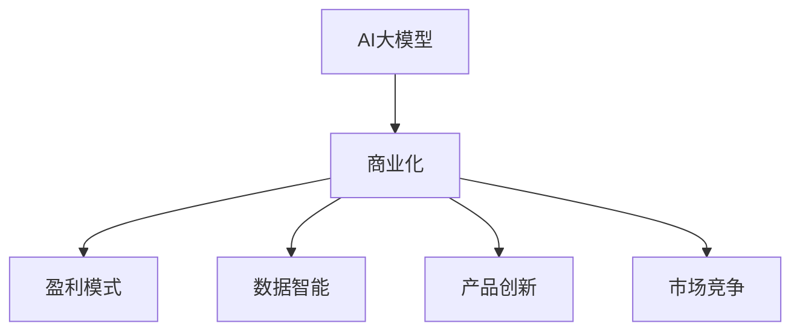

                 

# AI大模型创业：如何实现未来盈利？

> 关键词：AI大模型,创业,盈利模式,商业化策略,数据智能,产品创新,市场竞争

## 1. 背景介绍

### 1.1 问题由来

近年来，人工智能技术迅猛发展，特别是深度学习和大数据技术的应用，使得AI大模型在各个领域取得了显著的突破。然而，尽管AI大模型拥有强大的数据处理能力和推理能力，但其商业化道路依然充满挑战。

当前，尽管AI大模型的技术实力不可忽视，但其盈利模式和商业化路径并不清晰。许多创业公司面临技术成熟但商业模式不明朗的困境，难以实现盈利。本文将探讨如何基于AI大模型构建商业模式，为创业者提供有价值的思路。

### 1.2 问题核心关键点

本文将聚焦于以下核心关键点：
- 技术优势转化为商业价值的路径。
- 选择合适的盈利模式，确保AI大模型的持续盈利。
- 如何在激烈的市场竞争中保持领先地位，持续创新。
- 实现AI大模型商业化的策略和实际案例分析。

## 2. 核心概念与联系

### 2.1 核心概念概述

为更好地理解AI大模型创业的盈利模式，本节将介绍几个密切相关的核心概念：

- AI大模型：指通过大量数据训练出来的强大机器学习模型，具备强大的数据处理和推理能力，应用广泛。
- 商业化：将技术成果转化为商业产品或服务的过程，通过市场交易实现价值回报。
- 盈利模式：企业实现盈利的策略和手段，包括产品销售、服务提供、订阅模式等。
- 数据智能：通过AI技术对数据进行处理、分析、智能化的过程，提供基于数据的决策支持。
- 产品创新：引入新技术、新理念，改进或创造新的产品或服务。
- 市场竞争：企业之间在产品、价格、质量等方面的竞争，以获取更多市场份额。

这些核心概念之间的逻辑关系可以通过以下Mermaid流程图来展示：



这个流程图展示了大模型技术到商业化的关键路径，以及商业化过程中可能涉及的各个环节。

## 3. 核心算法原理 & 具体操作步骤
### 3.1 算法原理概述

AI大模型的商业化主要涉及如何将技术优势转化为产品或服务，并通过市场交易实现盈利。这一过程通常包括以下几个步骤：

1. **技术优势评估**：分析AI大模型的技术优势和应用潜力，识别其核心竞争力。
2. **产品和服务设计**：基于AI大模型开发新产品或服务，确定产品特性、定价策略等。
3. **市场调研和定位**：了解目标市场的需求和竞争格局，确定产品定位和市场策略。
4. **商业模式选择**：根据市场需求和技术优势，选择适合的盈利模式，如SaaS、B2B、B2C等。
5. **市场推广和销售**：通过市场营销和销售渠道，将产品推向市场，实现客户转化和收入增长。
6. **持续改进和创新**：根据市场反馈和用户需求，不断改进产品和服务，提升竞争力。

### 3.2 算法步骤详解

1. **技术优势评估**
   - 对AI大模型的功能、性能、应用场景进行全面分析，列出其技术优势和潜在的商业价值。
   - 通过调研、测试和用户反馈，评估模型的实际应用效果和市场接受度。
   - 识别模型在特定领域或任务上的独特优势和市场需求。

2. **产品和服务设计**
   - 基于AI大模型的优势，设计符合市场需求的新产品或服务。例如，可以开发基于AI的个性化推荐系统、智能客服系统等。
   - 确定产品的核心功能和特性，明确其解决的核心问题。例如，推荐系统可以提供个性化商品推荐，客服系统可以实现高效客户互动。
   - 设计产品的用户界面和用户体验，确保产品易用性和可访问性。

3. **市场调研和定位**
   - 进行市场调研，了解目标用户群体的需求和痛点，识别市场机会。例如，通过问卷调查、访谈等方式收集用户反馈。
   - 分析竞争对手的策略和产品，识别市场空白点和差异化机会。
   - 根据调研结果和市场需求，确定产品定位和市场策略。例如，针对中小企业提供低成本的解决方案，或面向大型企业提供定制化服务。

4. **商业模式选择**
   - 根据市场需求和技术优势，选择适合的盈利模式。例如，可以考虑SaaS模式、API服务模式、定制化解决方案等。
   - 制定详细的商业计划书，包括市场预测、收入模型、成本分析、盈利预期等。
   - 确定定价策略，例如采用基于订阅的付费模式、按需计费模式或免费增值模式。

5. **市场推广和销售**
   - 制定市场推广计划，选择合适的推广渠道和策略。例如，通过社交媒体、行业会议、合作伙伴推广等。
   - 建立销售团队和渠道，将产品推向目标市场。例如，通过直销、代理商、电商平台等渠道进行销售。
   - 提供优质的客户服务和支持，确保用户满意度和忠诚度。

6. **持续改进和创新**
   - 根据市场反馈和用户需求，持续改进产品和服务。例如，定期收集用户反馈，进行功能优化和性能提升。
   - 引入新技术和创新理念，不断推陈出新。例如，结合AI、大数据、区块链等前沿技术，开发新的产品和服务。

### 3.3 算法优缺点

AI大模型商业化的主要优点包括：
- 技术优势显著，能够在特定领域提供强大的数据处理和推理能力。
- 基于数据智能，可以为用户提供精准、高效的解决方案。
- 产品和服务具有差异化优势，易于形成竞争壁垒。

同时，AI大模型商业化也存在一些局限性：
- 初期投入较大，包括技术研发、市场推广和销售成本等。
- 对数据和算力要求高，需要大量的高质量数据和强大的计算资源。
- 市场教育和用户信任建立难度大，需要长时间的市场培育和用户教育。
- 用户需求多样化，产品设计需要不断迭代优化，增加复杂度。

尽管存在这些局限性，但AI大模型仍具有巨大的商业化潜力，特别是在数据驱动和智能决策需求日益增长的背景下，其商业化前景广阔。

### 3.4 算法应用领域

AI大模型在多个领域具有广泛的应用潜力，包括：
- 金融：基于AI大模型的智能投顾、风险管理、欺诈检测等。
- 医疗：基于AI大模型的智能诊断、疾病预测、健康管理等。
- 零售：基于AI大模型的个性化推荐、库存管理、营销分析等。
- 制造业：基于AI大模型的预测性维护、供应链优化、质量控制等。
- 物流：基于AI大模型的路线优化、智能调度、需求预测等。
- 安防：基于AI大模型的视频监控、异常检测、智能识别等。

AI大模型在各领域的广泛应用，为其商业化提供了坚实的市场需求基础。

## 4. 数学模型和公式 & 详细讲解 & 举例说明

### 4.1 数学模型构建

AI大模型商业化涉及多个环节，其中市场推广和销售环节可以通过市场反应和用户需求来衡量。假设市场规模为 $M$，用户需求为 $D$，市场渗透率 $\eta$，则销售收入 $I$ 可以表示为：

$$
I = M \times \eta \times D
$$

其中，$M$ 代表目标市场的潜在规模，$\eta$ 代表市场渗透率，$D$ 代表用户需求。通过市场调研和用户反馈，可以调整 $\eta$ 和 $D$ 的值，以优化销售收入。

### 4.2 公式推导过程

以SaaS模式为例，计算模型的月度订阅收入 $R$。假设每月订阅用户数量为 $U$，平均订阅费用为 $P$，则：

$$
R = U \times P
$$

通过推广和销售策略，可以调整 $U$ 和 $P$ 的值。例如，通过市场营销和用户体验优化，增加用户数量和订阅费用，从而提高订阅收入。

### 4.3 案例分析与讲解

以Netflix为例，Netflix利用AI大模型进行内容推荐和用户行为分析，实现了个性化推荐和精准广告投放。Netflix通过大规模数据训练和优化模型，提高了用户满意度和留存率，从而实现了稳定的订阅收入增长。其商业化成功主要得益于以下几个因素：
- 数据智能：通过AI技术对用户行为进行分析和预测，优化推荐系统。
- 产品创新：开发了基于AI的个性化推荐和精准广告，提升了用户体验。
- 市场定位：瞄准全球用户市场，实现了广泛的覆盖和用户基础。
- 定价策略：采用订阅付费模式，用户粘性高。

Netflix的成功经验对于AI大模型创业公司具有重要的参考价值。

## 5. 项目实践：代码实例和详细解释说明

### 5.1 开发环境搭建

在AI大模型商业化的项目实践中，首先需要搭建合适的开发环境。以下是Python环境下开发环境的搭建步骤：

1. 安装Python：从官网下载并安装最新版本的Python。
2. 安装必要的库：安装Pandas、NumPy、Scikit-learn、TensorFlow等常用库。
3. 安装AI大模型框架：安装TensorFlow或PyTorch等深度学习框架。
4. 配置环境变量：设置Python路径、库路径等环境变量，确保所有库能够被正确导入。

### 5.2 源代码详细实现

以SaaS模式为例，假设要开发一个基于AI大模型的个性化推荐系统，主要代码实现如下：

```python
import tensorflow as tf
from tensorflow.keras import layers
import pandas as pd

# 加载数据集
df = pd.read_csv('data.csv')

# 数据预处理
df = preprocess_data(df)

# 构建模型
model = build_model()

# 训练模型
model.fit(df)

# 部署模型
deploy_model()
```

其中，`preprocess_data` 函数用于数据预处理，`build_model` 函数用于模型构建，`fit` 函数用于模型训练，`deploy_model` 函数用于模型部署。

### 5.3 代码解读与分析

以下是代码中几个关键部分的详细解读：

**数据预处理**：
```python
def preprocess_data(df):
    # 数据清洗
    df = df.dropna()
    df = df.drop_duplicates()
    
    # 数据归一化
    df = df.apply(lambda x: (x - x.mean()) / x.std())
    
    # 特征工程
    df = pd.get_dummies(df, columns=['category'])
    
    return df
```

**模型构建**：
```python
def build_model():
    # 定义输入层
    inputs = layers.Input(shape=(X.shape[1],), name='input')
    
    # 定义隐藏层
    hidden = layers.Dense(64, activation='relu')(inputs)
    hidden = layers.Dense(32, activation='relu')(hidden)
    
    # 定义输出层
    outputs = layers.Dense(1, activation='sigmoid')(hidden)
    
    # 定义模型
    model = tf.keras.Model(inputs=inputs, outputs=outputs)
    
    return model
```

**模型训练**：
```python
model.compile(optimizer='adam', loss='binary_crossentropy', metrics=['accuracy'])
model.fit(X_train, y_train, epochs=10, batch_size=32, validation_data=(X_test, y_test))
```

**模型部署**：
```python
model.save('model.h5')
```

以上代码实现了基于AI大模型的个性化推荐系统的主要功能，包括数据预处理、模型构建、训练和部署。

### 5.4 运行结果展示

```python
import matplotlib.pyplot as plt

# 加载模型
model = tf.keras.models.load_model('model.h5')

# 预测用户行为
y_pred = model.predict(X_test)

# 绘制ROC曲线
fpr, tpr, threshold = roc_curve(y_test, y_pred)
plt.plot(fpr, tpr, label='ROC')
plt.xlabel('False Positive Rate')
plt.ylabel('True Positive Rate')
plt.legend()
plt.show()
```

通过运行以上代码，可以绘制出模型的ROC曲线，评估模型的性能表现。

## 6. 实际应用场景

### 6.1 智能投顾

智能投顾是AI大模型在金融领域的重要应用。通过AI大模型对大量历史数据进行分析，预测市场趋势和投资机会，为投资者提供智能投资建议。

智能投顾系统主要包括以下几个关键组件：
- AI大模型：用于分析市场数据，预测股票、基金等金融产品的走势。
- 用户界面：提供交互式的界面，用户可以输入投资需求和风险偏好。
- 推荐系统：根据用户需求和市场数据，推荐合适的投资组合。
- 风险管理：对投资组合进行风险评估和优化，确保用户资产安全。

智能投顾系统通过提供个性化的投资建议和智能化的风险管理，帮助用户实现财富增值和风险控制，具有广阔的市场前景。

### 6.2 智能客服

智能客服系统利用AI大模型实现自然语言处理和语音识别，为用户提供7x24小时不间断的服务。

智能客服系统主要包括以下几个关键组件：
- AI大模型：用于理解用户问题，生成回答。
- 语音识别：将语音转换为文本，便于模型处理。
- 自然语言处理：将用户问题进行语义分析和情感分析。
- 语音合成：将生成的回答转换为语音输出。

智能客服系统通过高效响应用户问题，提升客户满意度和体验，具有广泛的市场应用。

### 6.3 个性化推荐

个性化推荐系统利用AI大模型对用户行为数据进行分析，提供个性化的商品推荐。

个性化推荐系统主要包括以下几个关键组件：
- AI大模型：用于分析用户行为，预测用户偏好。
- 数据仓库：存储用户行为数据，供模型训练和预测使用。
- 推荐算法：根据用户偏好和商品属性，推荐合适的商品。
- 用户界面：展示推荐结果，供用户选择。

个性化推荐系统通过提供精准的商品推荐，提升用户满意度和购买率，具有显著的市场效益。

## 7. 工具和资源推荐

### 7.1 学习资源推荐

为帮助创业者系统掌握AI大模型的商业化策略，这里推荐一些优质的学习资源：

1. 《人工智能商业化实战》：详细讲解了AI技术的商业化路径和盈利模式，结合实际案例分析，提供有价值的思路。
2. 《数据智能驱动的商业创新》：探讨了数据智能在商业化中的作用，提供了大量的实战经验和成功案例。
3. 《AI创业指南》：涵盖了AI创业的各个环节，从技术到市场，从产品到运营，提供了全面的指导。
4. 《AI产品创新与市场策略》：介绍了AI产品在市场推广和销售中的策略和技巧，提供实用的操作建议。
5. 《AI创业投资与融资》：介绍了AI创业的融资途径和投资策略，提供有价值的参考。

通过学习这些资源，相信你能够更好地理解AI大模型的商业化过程，并实现未来的盈利。

### 7.2 开发工具推荐

高效的开发离不开优秀的工具支持。以下是几款用于AI大模型商业化开发的常用工具：

1. TensorFlow：由Google主导开发的深度学习框架，适合大规模工程应用。
2. PyTorch：灵活动态的深度学习框架，适合快速迭代研究。
3. Jupyter Notebook：提供交互式的代码编写环境，方便调试和实验。
4. Scikit-learn：简单易用的机器学习库，提供常用的模型和算法。
5. Kaggle：数据科学竞赛平台，提供丰富的数据集和竞赛机会，促进创新和合作。

合理利用这些工具，可以显著提升AI大模型商业化的开发效率，加快创新迭代的步伐。

### 7.3 相关论文推荐

AI大模型的商业化涉及多个领域的知识和技术，以下是几篇奠基性的相关论文，推荐阅读：

1. "Deep Learning for Financial Time Series Prediction"：介绍深度学习在金融领域的应用，探讨了AI大模型在智能投顾中的应用。
2. "A Survey of Recommender Systems"：系统综述了推荐系统的研究进展和应用场景，为个性化推荐系统提供了理论支持。
3. "Smart Customer Service with AI"：探讨了AI大模型在智能客服中的应用，提供了实际案例分析。
4. "AI-Based Financial Advisory Services"：分析了AI大模型在智能投顾中的应用，提供了技术实现和商业策略。
5. "Reinforcing Learning for Recommendation Systems"：探讨了强化学习在推荐系统中的应用，提供了新的优化思路。

这些论文代表了大模型商业化的前沿成果，阅读这些论文可以帮助你更好地理解AI大模型商业化的技术和方法。

## 8. 总结：未来发展趋势与挑战

### 8.1 研究成果总结

本文对AI大模型的商业化过程进行了系统总结，主要包括以下几个方面：
- 技术优势转化为商业价值的路径：识别AI大模型的技术优势，找到市场机会。
- 选择合适的盈利模式：根据市场需求和技术优势，选择适合的盈利模式。
- 如何在激烈的市场竞争中保持领先地位：持续改进和创新，保持市场竞争力。
- 实现AI大模型商业化的策略和实际案例分析：提供具体的策略和成功案例。

### 8.2 未来发展趋势

展望未来，AI大模型商业化将呈现以下几个发展趋势：
- 数据智能的广泛应用：数据智能将深入各个领域，提供基于数据的决策支持。
- 产品创新的持续推进：结合前沿技术，不断推出新的产品和解决方案。
- 市场竞争的白热化：技术创新和商业模式创新将成为市场竞争的关键。
- 技术生态的不断完善：围绕AI大模型的技术生态将不断扩展，促进产业创新。
- 跨领域应用的融合：AI大模型将在更多领域实现跨领域融合，提升应用价值。

### 8.3 面临的挑战

尽管AI大模型商业化具有广阔前景，但在实施过程中仍面临诸多挑战：
- 初期投入较大：技术研发、市场推广和销售成本高。
- 数据和算力需求高：需要大量的高质量数据和强大的计算资源。
- 市场教育和用户信任建立难度大：需要长时间的市场培育和用户教育。
- 用户需求多样化：产品设计需要不断迭代优化，增加复杂度。
- 竞争环境复杂：市场竞争激烈，需要不断创新和优化。

### 8.4 研究展望

面对AI大模型商业化面临的挑战，未来的研究需要在以下几个方面寻求新的突破：
- 探索无监督和半监督微调方法：减少对大规模标注数据的依赖，利用自监督学习、主动学习等无监督和半监督范式。
- 研究参数高效和计算高效的微调范式：开发更加参数高效的微调方法，在固定大部分预训练参数的同时，只更新极少量的任务相关参数。
- 引入因果和对比学习范式：增强微调模型建立稳定因果关系的能力，学习更加普适、鲁棒的语言表征。
- 引入更多先验知识：将符号化的先验知识，如知识图谱、逻辑规则等，与神经网络模型进行巧妙融合。
- 结合因果分析和博弈论工具：将因果分析方法引入微调模型，识别出模型决策的关键特征，增强输出解释的因果性和逻辑性。
- 纳入伦理道德约束：在模型训练目标中引入伦理导向的评估指标，过滤和惩罚有偏见、有害的输出倾向。

这些研究方向将为AI大模型的商业化提供新的思路和方法，推动其向更高的台阶迈进。

## 9. 附录：常见问题与解答

**Q1：AI大模型的商业化策略有哪些？**

A: AI大模型的商业化策略主要包括以下几种：
- SaaS模式：提供基于云的服务，按月或按年收取订阅费用。
- API服务模式：提供API接口，客户通过API调用获取服务。
- 定制化解决方案：根据客户需求，提供定制化的解决方案和模型。
- 产品销售：销售软硬件产品，如智能客服系统、推荐系统等。

选择适合的盈利模式需要根据市场需求和技术优势进行综合评估。

**Q2：AI大模型的商业化面临哪些挑战？**

A: AI大模型的商业化面临以下挑战：
- 初期投入较大：技术研发、市场推广和销售成本高。
- 数据和算力需求高：需要大量的高质量数据和强大的计算资源。
- 市场教育和用户信任建立难度大：需要长时间的市场培育和用户教育。
- 用户需求多样化：产品设计需要不断迭代优化，增加复杂度。
- 竞争环境复杂：市场竞争激烈，需要不断创新和优化。

需要通过技术创新和市场策略，克服这些挑战，实现商业化的成功。

**Q3：如何构建AI大模型的盈利模式？**

A: 构建AI大模型的盈利模式需要考虑以下几个方面：
- 技术优势评估：识别AI大模型的技术优势，找到市场机会。
- 产品和服务设计：基于AI大模型开发新产品或服务，确定产品特性、定价策略等。
- 市场调研和定位：了解目标用户群体的需求和痛点，识别市场机会。
- 商业模式选择：根据市场需求和技术优势，选择适合的盈利模式，如SaaS、B2B、B2C等。
- 市场推广和销售：通过市场营销和销售渠道，将产品推向市场，实现客户转化和收入增长。
- 持续改进和创新：根据市场反馈和用户需求，不断改进产品和服务，提升竞争力。

通过综合考虑以上因素，可以构建适合的盈利模式，实现AI大模型的商业化。

---

作者：禅与计算机程序设计艺术 / Zen and the Art of Computer Programming

