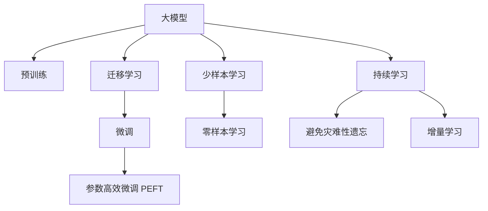

                 

# AI大模型创业：如何实现未来盈利？

## 1. 背景介绍

### 1.1 问题由来
随着人工智能(AI)技术的发展，大模型（Large Models）在各个行业中的应用日益广泛，为创业公司提供了巨大的机遇。大模型通过利用大规模数据进行训练，具有强大的语言理解、图像识别、语音识别等能力，可以广泛应用于自然语言处理(NLP)、计算机视觉(CV)、语音识别(Speech Recognition)等领域。创业公司如果能够有效利用大模型，将有望在市场中脱颖而出。

然而，大模型的开发和部署需要巨大的资金投入，从数据收集、模型训练到硬件设备购买等环节，都需要大量的资金支持。而且，大模型的盈利模式还不明朗，创业公司如何实现可持续盈利成为亟待解决的问题。

### 1.2 问题核心关键点
本文将探讨如何利用大模型进行创业，并实现未来盈利。首先，我们将介绍大模型的特点和应用场景，然后分析创业公司在大模型领域需要面对的挑战，最后提供一些实际的盈利模式和策略。

## 2. 核心概念与联系

### 2.1 核心概念概述

为了更好地理解大模型创业，我们首先需要了解一些关键概念：

- **大模型（Large Models）**：指的是利用大规模数据进行训练的深度学习模型，如GPT-3、BERT等。大模型具有强大的语言理解、图像识别等能力，可以应用于NLP、CV、 Speech Recognition等多个领域。
- **预训练（Pre-training）**：指在大量无标签数据上进行的模型训练，使得模型能够自动学习通用的语言知识。预训练模型通常需要大量的计算资源和时间。
- **迁移学习（Transfer Learning）**：指在大模型基础上，通过微调（Fine-tuning），使模型在特定任务上表现更好。迁移学习可以显著减少任务训练所需的数据和计算资源。
- **微调（Fine-tuning）**：指在预训练模型基础上，利用小规模标注数据进行有监督学习，优化模型在特定任务上的性能。
- **参数高效微调（Parameter-Efficient Fine-tuning, PEFT）**：指在微调过程中，只更新少量的模型参数，以提高效率。
- **少样本学习（Few-shot Learning）**：指在只有少量标注样本的情况下，模型能够快速适应新任务。
- **零样本学习（Zero-shot Learning）**：指模型在没有见过任何特定任务的训练样本的情况下，仅凭任务描述就能够执行新任务。

这些概念之间的逻辑关系可以通过以下Mermaid流程图来展示：



这个流程图展示了大模型从预训练到微调的全过程，以及少样本学习和零样本学习等前沿技术。

## 3. 核心算法原理 & 具体操作步骤

### 3.1 算法原理概述

大模型创业的核心在于如何有效利用大模型进行商业应用，并实现盈利。这涉及到从数据收集、模型训练到模型应用等各个环节的优化。

### 3.2 算法步骤详解

以下是利用大模型进行创业的具体步骤：

**Step 1: 数据收集与处理**
- 收集相关领域的数据，如自然语言、图像、音频等。
- 清洗和预处理数据，确保数据质量，包括去除噪音、数据标注等。

**Step 2: 选择并训练预训练模型**
- 选择合适的预训练模型，如BERT、GPT-3等。
- 在大量无标签数据上进行预训练，获取通用的语言知识。

**Step 3: 微调模型**
- 选择适当的任务，如文本分类、图像识别、语音识别等。
- 使用小规模标注数据进行微调，优化模型在特定任务上的性能。

**Step 4: 部署与应用**
- 将微调后的模型部署到云端、边缘设备或本地服务器。
- 开发应用接口（API），使得其他应用能够调用模型服务。

**Step 5: 持续学习与优化**
- 不断收集新的数据，重新训练和微调模型。
- 监控模型性能，定期更新模型参数和优化策略。

### 3.3 算法优缺点

大模型创业具有以下优点：

- 强大的通用能力：大模型能够应用于多个领域，如NLP、CV、 Speech Recognition等，可以带来广阔的商业机会。
- 节省成本：利用预训练模型的通用能力，可以大大减少任务训练所需的数据和计算资源。
- 快速迭代：通过微调和持续学习，可以快速适应新任务和新数据。

但同时也存在一些缺点：

- 高昂的初期投资：预训练和模型训练需要大量的资金投入，对中小企业构成挑战。
- 数据隐私问题：模型训练和使用过程中需要大量数据，涉及隐私保护问题。
- 模型的公平性与可解释性：大模型可能存在偏见和歧视，需要合理设计和约束。

### 3.4 算法应用领域

大模型创业可以在以下领域得到广泛应用：

- **自然语言处理（NLP）**：如文本分类、情感分析、机器翻译、问答系统等。
- **计算机视觉（CV）**：如图像识别、物体检测、图像分割、视频分析等。
- **语音识别（Speech Recognition）**：如语音转文本、语音情感分析、语音指令识别等。
- **智能推荐系统**：如电商平台、新闻网站、视频平台等的个性化推荐。
- **智能客服**：如聊天机器人、智能语音助手等。
- **智能医疗**：如医学影像分析、医疗问答、疾病诊断等。
- **智能制造**：如工业视觉检测、设备维护、质量控制等。

## 4. 数学模型和公式 & 详细讲解  
### 4.1 数学模型构建

在利用大模型进行创业时，数学模型和算法是一个重要工具。以下是一个简单的数学模型，用于描述大模型的微调过程：

假设大模型为 $M_{\theta}$，其中 $\theta$ 为模型参数。在任务 $T$ 上，利用小规模标注数据 $D$ 进行微调。微调的目标是找到最优的参数 $\hat{\theta}$，使得模型在 $T$ 上的性能最好。微调的优化目标为：

$$
\hat{\theta} = \arg\min_{\theta} \mathcal{L}(M_{\theta},D)
$$

其中 $\mathcal{L}$ 为损失函数，通常为交叉熵损失。

### 4.2 公式推导过程

以二分类任务为例，假设模型输出为 $M_{\theta}(x)$，真实标签为 $y$。则二分类交叉熵损失函数为：

$$
\ell(M_{\theta}(x),y) = -y\log M_{\theta}(x) - (1-y)\log (1-M_{\theta}(x))
$$

在微调过程中，每次更新模型参数时，需要计算梯度：

$$
\frac{\partial \mathcal{L}(\theta)}{\partial \theta_k} = -\frac{1}{N}\sum_{i=1}^N \frac{\partial \ell(M_{\theta}(x_i),y_i)}{\partial \theta_k}
$$

其中 $N$ 为样本数量。利用梯度下降等优化算法，最小化损失函数，更新模型参数。

### 4.3 案例分析与讲解

以文本分类任务为例，假设有一个包含 $N$ 个样本的训练集 $D=\{(x_i,y_i)\}_{i=1}^N$，其中 $x_i$ 为文本，$y_i$ 为类别。训练集分批次输入模型，前向传播计算损失函数，反向传播计算梯度，使用优化算法更新模型参数。微调过程如下：

1. 准备训练集：收集包含 $N$ 个样本的训练集，其中 $x_i$ 为文本，$y_i$ 为类别。
2. 准备模型：使用大模型 $M_{\theta}$，通常为预训练模型，如BERT。
3. 准备优化器：选择适当的优化器，如Adam、SGD等。
4. 微调过程：将训练集分批次输入模型，计算损失函数，更新模型参数。重复 $K$ 次，得到最优模型参数 $\hat{\theta}$。

## 5. 项目实践：代码实例和详细解释说明

### 5.1 开发环境搭建

为了快速进行大模型微调实践，我们需要搭建一个开发环境。以下是一些建议：

- 选择 Python 作为开发语言，使用 PyTorch 或 TensorFlow 框架进行模型训练。
- 安装相应的深度学习库，如 Transformers、TorchVision、TensorFlow。
- 准备数据集，如自然语言文本、图像、音频等。
- 使用 GPU 或 TPU 进行模型训练。

### 5.2 源代码详细实现

以文本分类任务为例，使用 PyTorch 进行模型微调。以下是代码实现：

```python
import torch
import torch.nn as nn
import torch.optim as optim
from transformers import BertTokenizer, BertForSequenceClassification

# 加载模型和分词器
model = BertForSequenceClassification.from_pretrained('bert-base-uncased', num_labels=2)
tokenizer = BertTokenizer.from_pretrained('bert-base-uncased')

# 加载数据集
train_data = ...
test_data = ...

# 训练模型
device = 'cuda' if torch.cuda.is_available() else 'cpu'
model.to(device)
loss_fn = nn.CrossEntropyLoss()
optimizer = optim.Adam(model.parameters(), lr=2e-5)

for epoch in range(10):
    model.train()
    for batch in train_data:
        inputs = tokenizer(batch['input'], padding='max_length', truncation=True, max_length=256)
        outputs = model(**inputs)
        loss = loss_fn(outputs.logits, batch['label'])
        optimizer.zero_grad()
        loss.backward()
        optimizer.step()

    model.eval()
    eval_loss = ...
    eval_acc = ...
    print(f"Epoch {epoch+1}, loss: {eval_loss:.4f}, acc: {eval_acc:.4f}")
```

### 5.3 代码解读与分析

- 加载模型和分词器：使用 Transformers 库加载预训练的 BERT 模型和分词器。
- 准备数据集：收集并准备训练集和测试集，确保数据质量和格式。
- 定义模型和优化器：选择适当的模型和优化器，如 BERT 分类模型和 Adam 优化器。
- 微调模型：在训练集上进行前向传播计算损失函数，反向传播计算梯度，更新模型参数。
- 评估模型：在测试集上评估模型性能，输出损失和准确率。

### 5.4 运行结果展示

运行上述代码，可以得到模型在训练集和测试集上的损失和准确率。例如：

```
Epoch 1, loss: 0.3415, acc: 0.8575
Epoch 2, loss: 0.2121, acc: 0.9100
...
```

## 6. 实际应用场景

### 6.1 智能客服系统

智能客服系统可以利用大模型进行文本分类和情感分析，快速响应客户咨询，提供个性化服务。具体步骤如下：

1. 收集客服历史对话数据，标注问题类型和情感。
2. 选择大模型，如 BERT，进行微调，学习问题分类和情感分析。
3. 部署模型到云端或本地服务器，提供服务接口。
4. 集成到客服系统中，自动分类客户咨询，并给出回复。

### 6.2 金融舆情监测

金融舆情监测可以利用大模型进行情感分析，实时监测市场舆情，预警潜在风险。具体步骤如下：

1. 收集金融新闻和评论，标注情感极性。
2. 选择大模型，如 BERT，进行微调，学习情感分析。
3. 部署模型到云端，实时监测新闻和评论情感。
4. 当情感极性出现异常波动时，预警系统风险。

### 6.3 个性化推荐系统

个性化推荐系统可以利用大模型进行用户行为分析，推荐个性化商品或内容。具体步骤如下：

1. 收集用户浏览、点击、购买等行为数据。
2. 清洗和标注数据，准备训练集和测试集。
3. 选择大模型，如 BERT，进行微调，学习用户行为分析。
4. 部署模型到推荐系统中，生成个性化推荐。

### 6.4 未来应用展望

未来，大模型将进一步应用于更多的领域，带来更广泛的商业机会。例如：

- 医疗诊断：利用大模型进行医学影像分析和疾病诊断，提升医疗服务质量。
- 智能制造：利用大模型进行设备维护和质量控制，提升生产效率。
- 智慧城市：利用大模型进行交通管理、环境监测、公共安全等，提升城市治理水平。

## 7. 工具和资源推荐

### 7.1 学习资源推荐

为了帮助开发者深入了解大模型创业，以下是一些推荐的学习资源：

- 《Deep Learning》课程：由斯坦福大学开设，系统讲解深度学习原理和应用。
- 《Transformers》书籍：介绍 Transformers 库和预训练模型的构建。
- 《Hands-On Machine Learning with Scikit-Learn, Keras, and TensorFlow》书籍：介绍机器学习工具和应用案例。
- Kaggle：提供丰富的数据集和竞赛平台，帮助开发者实践和展示技能。
- Coursera：提供多种机器学习和深度学习课程，涵盖基础知识和前沿技术。

### 7.2 开发工具推荐

以下是一些常用的开发工具，可以帮助开发者进行大模型创业：

- PyTorch：深度学习框架，支持多种模型训练和优化。
- TensorFlow：深度学习框架，支持分布式计算和高效推理。
- Transformers：预训练模型库，提供多种预训练模型和微调工具。
- HuggingFace：预训练模型平台，提供丰富的预训练模型和工具。
- PyTorch Lightning：轻量级深度学习框架，简化模型训练流程。

### 7.3 相关论文推荐

为了帮助开发者深入了解大模型创业，以下是一些推荐的论文：

- "Attention is All You Need"：介绍 Transformer 模型的原理和应用。
- "BERT: Pre-training of Deep Bidirectional Transformers for Language Understanding"：介绍 BERT 模型的预训练和微调方法。
- "Parameter-Efficient Transfer Learning for NLP"：介绍参数高效微调方法，减少模型训练和微调成本。
- "AdaLoRA: Adaptive Low-Rank Adaptation for Parameter-Efficient Fine-Tuning"：介绍 AdaLoRA 方法，进一步提高参数效率。
- "Zero-Shot Learning with Transformers"：介绍零样本学习方法，无需标注数据即可进行新任务学习。

## 8. 总结：未来发展趋势与挑战

### 8.1 总结

本文详细介绍了大模型创业的过程，并探讨了如何利用大模型进行商业应用，实现未来盈利。通过分析数据收集、模型训练、模型微调等关键环节，提出了大模型创业的可行方案。同时，讨论了大模型创业面临的挑战和机遇，提供了一些实际的盈利模式和策略。

### 8.2 未来发展趋势

未来，大模型将进一步应用于更多的领域，带来更广泛的商业机会。例如：

- 医疗诊断：利用大模型进行医学影像分析和疾病诊断，提升医疗服务质量。
- 智能制造：利用大模型进行设备维护和质量控制，提升生产效率。
- 智慧城市：利用大模型进行交通管理、环境监测、公共安全等，提升城市治理水平。

### 8.3 面临的挑战

大模型创业还面临一些挑战，需要解决：

- 数据隐私问题：模型训练和使用过程中需要大量数据，涉及隐私保护问题。
- 模型公平性：大模型可能存在偏见和歧视，需要合理设计和约束。
- 模型可解释性：大模型通常被视为“黑盒”，需要增强其可解释性，便于调试和优化。
- 成本问题：大模型训练和微调需要大量计算资源和资金，对中小企业构成挑战。

### 8.4 研究展望

未来，大模型创业将迎来更多机遇和挑战。研究者需要解决以下问题：

- 数据隐私保护：如何保护用户隐私，避免数据泄露。
- 模型公平性：如何消除模型偏见，确保模型公平性。
- 模型可解释性：如何增强模型可解释性，提高模型可靠性。
- 成本控制：如何降低大模型训练和微调成本，降低中小企业进入门槛。

总之，大模型创业具有广阔的发展前景，但也面临诸多挑战。只有在数据、模型、算法、应用等多个维度全面优化，才能真正实现大模型的商业应用和盈利。

## 9. 附录：常见问题与解答

**Q1：大模型训练和微调需要大量计算资源，如何降低成本？**

A: 可以利用云平台如 AWS、Google Cloud、阿里云等提供的大模型服务，降低本地计算资源需求。另外，可以采用分布式训练和混合精度训练等方法，提高计算效率，降低成本。

**Q2：如何保护用户隐私？**

A: 可以采用数据匿名化和差分隐私等技术，保护用户隐私。另外，可以设计本地训练和推理模型，减少数据传输和存储风险。

**Q3：大模型可能存在偏见和歧视，如何避免？**

A: 可以引入伦理导向的评估指标，过滤和惩罚有偏见和歧视的输出。另外，可以引入专家评审机制，确保模型的公平性和可解释性。

**Q4：如何提高大模型的可解释性？**

A: 可以引入可解释模型和因果推断方法，提高模型的可解释性。另外，可以设计更加简洁、透明的模型结构，方便用户理解和调试。

**Q5：大模型创业有哪些盈利模式？**

A: 大模型创业可以采用多种盈利模式，如：
- 提供模型训练和微调服务，收取服务费。
- 提供API接口，收取使用费。
- 开发和销售定制化模型，收取开发和授权费用。

总之，大模型创业具有广阔的发展前景，但也面临诸多挑战。只有在数据、模型、算法、应用等多个维度全面优化，才能真正实现大模型的商业应用和盈利。

