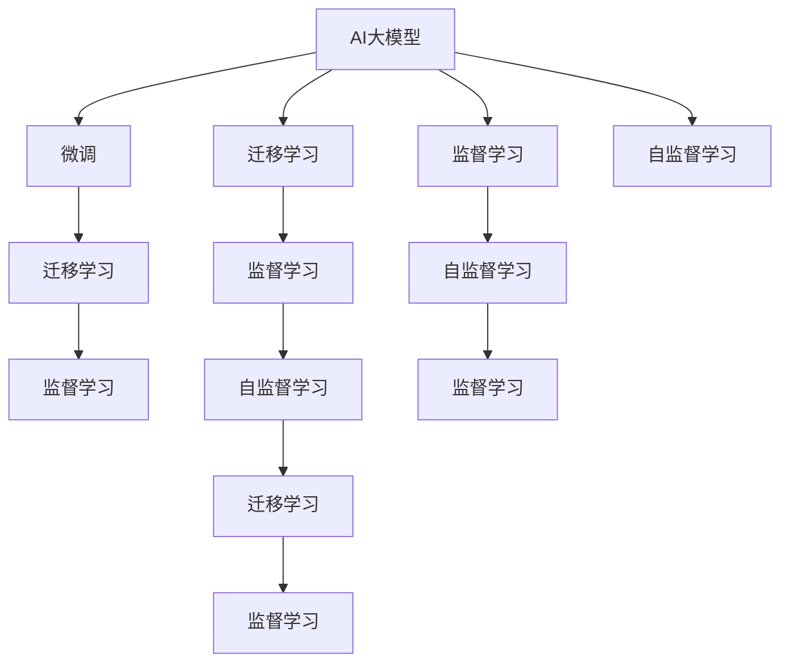

                 

## 1. 背景介绍

### 1.1 问题由来

随着人工智能技术的快速发展，AI大模型成为了创业公司竞相追逐的焦点。无论是自然语言处理、计算机视觉，还是智能决策系统，AI大模型在各领域中的应用已经展现出了颠覆性的创新潜力。然而，尽管大模型技术带来了巨大的商业价值，创业公司面临的市场挑战也是前所未有的。从技术研发、数据准备，到市场推广和客户服务，每一个环节都需要精心规划和处理。

### 1.2 问题核心关键点

AI大模型的创业过程涉及多个关键点，主要包括：
- **技术挑战**：如何构建高效、准确的大模型，并确保其在实际应用中的性能表现。
- **数据挑战**：如何获取高质量的数据，并进行有效的数据标注。
- **市场挑战**：如何理解市场需求，并构建具有竞争力的产品策略。
- **运营挑战**：如何高效地管理客户服务、市场推广和产品迭代。
- **商业化挑战**：如何将AI大模型成功商业化，实现盈利模式。

本文将从技术、市场和运营三个维度出发，探讨AI大模型创业过程中可能面临的挑战，并提供解决方案和建议。

## 2. 核心概念与联系

### 2.1 核心概念概述

为了更好地理解AI大模型创业的过程，我们需要先梳理一些核心概念：

- **AI大模型**：指在深度学习的基础上，使用大规模数据和强大计算资源训练得到的复杂模型，如BERT、GPT-3、ViT等。这些模型通常具备极高的精度和泛化能力。
- **微调(Fine-tuning)**：指在大模型基础上，通过特定任务的少量标注数据，调整模型参数，使其在特定任务上表现更佳。
- **迁移学习(Transfer Learning)**：指将一个领域学到的知识迁移到另一个相关领域，以加速模型的训练和提高性能。
- **监督学习(Supervised Learning)**：指使用标注数据训练模型，使其能够根据输入数据预测输出结果。
- **自监督学习(Self-Supervised Learning)**：指使用无标签数据训练模型，使其能够从数据自身中学习到特征和规律。

这些概念之间的关系通过以下Mermaid流程图展示：



从上图可以看出，AI大模型可以通过多种学习方式进行优化，包括微调、迁移学习、监督学习和自监督学习。这些方法相互补充，共同提升模型的性能和应用范围。

## 3. 核心算法原理 & 具体操作步骤

### 3.1 算法原理概述

AI大模型的创业过程中，核心算法原理主要是基于深度学习的迁移学习和微调方法。这些方法通过在大规模数据上预训练模型，然后针对特定任务进行微调，最终得到性能优秀的模型。

### 3.2 算法步骤详解

AI大模型的创业流程大致分为以下几个步骤：

**Step 1: 数据准备**
- 收集并处理大规模的标注数据，用于训练和微调模型。
- 数据清洗和预处理，确保数据质量和一致性。
- 数据增强和扩充，以提高模型的泛化能力。

**Step 2: 模型选择与训练**
- 选择合适的预训练模型作为初始化参数。
- 设计并训练模型，确保模型在特定任务上的性能。
- 使用迁移学习或微调方法，调整模型参数以适应任务需求。

**Step 3: 模型评估与优化**
- 在验证集上评估模型性能，判断是否需要进一步优化。
- 通过超参数调优、正则化、数据增强等方法提升模型效果。
- 在测试集上进行最终评估，确定模型性能。

**Step 4: 产品部署与迭代**
- 将训练好的模型部署到生产环境，进行实际应用。
- 收集用户反馈，持续优化模型和产品功能。
- 持续收集新数据，重新训练和微调模型，以保持模型性能。

### 3.3 算法优缺点

**优点**：
- 提升模型性能：通过微调和迁移学习，模型能够快速适应新任务，提升性能。
- 节省资源：只需少量标注数据，即可达到不错的效果。
- 通用性强：适用于各种NLP、CV等领域，具有广泛的应用前景。

**缺点**：
- 数据依赖：微调效果受数据质量影响较大。
- 过拟合风险：模型在特定数据上可能过拟合，影响泛化能力。
- 模型复杂：大模型参数众多，训练和推理需要高性能设备。

### 3.4 算法应用领域

AI大模型在多个领域都有广泛的应用，包括但不限于：
- **自然语言处理(NLP)**：机器翻译、情感分析、文本分类等。
- **计算机视觉(CV)**：图像识别、目标检测、图像生成等。
- **推荐系统**：个性化推荐、广告投放等。
- **金融科技**：信用评分、欺诈检测、投资分析等。
- **智能制造**：质量检测、设备监控、生产调度等。

这些应用领域都是AI大模型的重要落地场景，对提升效率、优化决策和增强用户体验都有显著效果。

## 4. 数学模型和公式 & 详细讲解  
### 4.1 数学模型构建

在AI大模型的创业过程中，数学模型主要涉及深度学习中的神经网络架构和优化算法。

以卷积神经网络(CNN)为例，其数学模型可以表示为：
$$
y = \sigma(Wx + b)
$$
其中，$y$ 为输出结果，$x$ 为输入数据，$W$ 和 $b$ 为模型参数，$\sigma$ 为激活函数。

### 4.2 公式推导过程

以反向传播算法为例，其推导过程如下：
1. 计算损失函数对输出层的导数。
2. 通过链式法则，计算损失函数对中间层的导数。
3. 反向传播，更新模型参数。

具体来说，假设输出层为 $y$，损失函数为 $L(y,\hat{y})$，则有：
$$
\frac{\partial L}{\partial y} = \frac{\partial L}{\partial \hat{y}}
$$
通过链式法则，可以得到：
$$
\frac{\partial L}{\partial x} = \frac{\partial L}{\partial y} \frac{\partial y}{\partial x}
$$
其中，$\frac{\partial L}{\partial y}$ 为损失函数对输出层的导数，$\frac{\partial y}{\partial x}$ 为输出层对输入层的导数。

### 4.3 案例分析与讲解

以图像识别为例，假设输入图片为 $x$，输出为 $y$，则模型可以表示为：
$$
y = \sigma(Wx + b)
$$
其中，$W$ 和 $b$ 为卷积核和偏置项，$\sigma$ 为激活函数。

通过反向传播算法，我们可以不断更新模型参数，以提高模型在图像识别任务上的性能。

## 5. 项目实践：代码实例和详细解释说明

### 5.1 开发环境搭建

要搭建AI大模型的开发环境，需要以下步骤：

1. 安装Python：从官网下载安装Python。
2. 安装PyTorch：`pip install torch`。
3. 安装TensorFlow：`pip install tensorflow`。
4. 安装Keras：`pip install keras`。
5. 安装GPU驱动：确保计算机有合适的GPU驱动。

### 5.2 源代码详细实现

以下是一个简单的图像识别模型实现，用于演示AI大模型的训练过程：

```python
import tensorflow as tf
from tensorflow.keras import layers, models

# 定义模型结构
model = models.Sequential([
    layers.Conv2D(32, (3,3), activation='relu', input_shape=(28, 28, 1)),
    layers.MaxPooling2D((2, 2)),
    layers.Flatten(),
    layers.Dense(10, activation='softmax')
])

# 编译模型
model.compile(optimizer='adam',
              loss='categorical_crossentropy',
              metrics=['accuracy'])

# 加载数据
(x_train, y_train), (x_test, y_test) = tf.keras.datasets.mnist.load_data()

# 数据预处理
x_train = x_train / 255.0
x_test = x_test / 255.0

# 训练模型
model.fit(x_train, y_train, epochs=10, validation_data=(x_test, y_test))
```

### 5.3 代码解读与分析

在上述代码中，我们使用了Keras库定义了一个简单的卷积神经网络模型。模型包含卷积层、池化层和全连接层，用于对MNIST数据集进行图像识别。

通过编译模型，我们选择了Adam优化器和交叉熵损失函数，以最小化模型在训练集和验证集上的损失。

### 5.4 运行结果展示

训练完成后，我们可以使用测试集评估模型的性能：

```python
test_loss, test_acc = model.evaluate(x_test, y_test)
print('Test accuracy:', test_acc)
```

## 6. 实际应用场景

### 6.1 智能客服系统

AI大模型在智能客服系统中具有广泛的应用，能够实时回答用户咨询，提高客户满意度。例如，阿里巴巴的智能客服系统就是基于BERT模型进行微调的，能够处理复杂的多轮对话，提供精准的解决方案。

### 6.2 金融科技

在金融领域，AI大模型可以用于信用评分、欺诈检测、投资分析等任务。例如，JP摩根的AI大模型“Alloy”就是一个基于BERT的信用评分系统，能够根据用户的交易记录和社交网络数据，预测其违约概率，帮助银行做出更好的贷款决策。

### 6.3 医疗诊断

在医疗领域，AI大模型可以用于疾病诊断、药物研发等任务。例如，IBM的Watson Health就是一个基于深度学习的医疗诊断系统，能够分析患者的历史数据，提出个性化的治疗方案。

### 6.4 未来应用展望

未来，AI大模型将在更多领域得到应用，如智慧城市、智能制造、智慧农业等。通过AI大模型的辅助，可以实现更高效、更精准的决策和优化，提升各行各业的运营效率。

## 7. 工具和资源推荐

### 7.1 学习资源推荐

- **Deep Learning Specialization by Andrew Ng**：该课程由斯坦福大学教授Andrew Ng主讲，涵盖深度学习的基本概念和实践技巧。
- **CS231n: Convolutional Neural Networks for Visual Recognition**：斯坦福大学的计算机视觉课程，涵盖CNN等深度学习模型在计算机视觉中的应用。
- **TensorFlow官方文档**：详细介绍了TensorFlow的使用方法和API，是TensorFlow学习者的必备资源。
- **Keras官方文档**：详细介绍了Keras的使用方法和API，是Keras学习者的必备资源。

### 7.2 开发工具推荐

- **Google Colab**：免费的在线Jupyter Notebook环境，支持GPU和TPU资源。
- **TensorBoard**：可视化工具，用于监测模型训练和推理过程。
- **Weights & Biases**：实验跟踪工具，用于记录和分析模型训练结果。

### 7.3 相关论文推荐

- **ImageNet Classification with Deep Convolutional Neural Networks**：AlexNet论文，提出了卷积神经网络在图像识别中的应用。
- **Google's Guided Attention Neural Network**：Google提出的视觉注意力机制，用于图像识别和图像生成。
- **AlphaGo Zero**：DeepMind提出的自我对弈AI，用于围棋游戏。

## 8. 总结：未来发展趋势与挑战

### 8.1 研究成果总结

AI大模型已经在多个领域取得了显著成果，提升了各行业的运营效率和决策能力。然而，尽管取得了这些成就，AI大模型的应用仍面临诸多挑战，如数据质量、模型复杂度、运营成本等。

### 8.2 未来发展趋势

未来，AI大模型将继续在各个领域发挥重要作用，成为推动社会进步的重要力量。以下是一些未来发展趋势：

1. **自动化训练**：AI大模型将具备自动调参和模型优化的能力，减少人工干预。
2. **跨领域迁移学习**：AI大模型将具备跨领域迁移能力，能够从多个领域中学习知识和技能。
3. **自监督学习**：AI大模型将越来越多地采用自监督学习，减少对标注数据的需求。
4. **联邦学习**：AI大模型将采用联邦学习，保护数据隐私，提高模型泛化能力。
5. **边缘计算**：AI大模型将越来越多地部署在边缘设备上，提高实时性和响应速度。

### 8.3 面临的挑战

AI大模型在应用过程中，仍面临以下挑战：

1. **数据质量**：如何获取高质量的数据，并确保数据的一致性和完整性。
2. **模型复杂度**：如何处理复杂模型，确保模型能够高效训练和推理。
3. **运营成本**：如何降低AI大模型的运营成本，提高经济效益。
4. **隐私保护**：如何在保证数据隐私的前提下，利用AI大模型进行训练和推理。
5. **伦理道德**：如何确保AI大模型的使用符合伦理道德标准，避免歧视和不公平现象。

### 8.4 研究展望

未来的研究需要从以下几个方面进行突破：

1. **自动化训练**：研究自动化调参和模型优化方法，提高训练效率。
2. **跨领域迁移学习**：研究跨领域迁移方法，提高模型的泛化能力。
3. **自监督学习**：研究自监督学习方法，减少对标注数据的需求。
4. **联邦学习**：研究联邦学习算法，保护数据隐私。
5. **边缘计算**：研究边缘计算技术，提高实时性和响应速度。
6. **隐私保护**：研究隐私保护技术，确保数据安全和隐私保护。
7. **伦理道德**：研究伦理道德规范，确保AI大模型的公平性和透明性。

通过上述研究方向的探索，相信AI大模型将能够更好地应用于各个领域，为社会带来更多的好处和价值。

## 9. 附录：常见问题与解答

### Q1: 如何选择合适的AI大模型？

A: 选择合适的AI大模型需要考虑多个因素，如任务的复杂度、数据量、计算资源等。一般而言，可以选择预训练效果较好、参数量适中的大模型。

### Q2: 如何处理数据不平衡问题？

A: 数据不平衡问题可以通过以下方法解决：
1. 重采样方法，如过采样和欠采样。
2. 类别权重调整，如调整损失函数的类别权重。
3. 生成对抗性样本，如SMOTE。

### Q3: 如何确保模型的可解释性？

A: 确保模型的可解释性可以从以下几个方面入手：
1. 使用可解释性模型，如决策树、线性模型等。
2. 使用模型解释工具，如LIME、SHAP等。
3. 记录和分析模型的训练过程，确保模型决策的透明性和可理解性。

### Q4: 如何确保模型的公平性？

A: 确保模型的公平性可以从以下几个方面入手：
1. 使用公平性指标，如FPR、FNR等。
2. 使用公平性算法，如Adversarial De-biasing。
3. 进行公平性评估和测试，确保模型在各个群体上的表现一致。

通过这些方法和工具，可以更好地应对AI大模型创业过程中可能面临的各种挑战，推动AI大模型的应用和普及。相信未来，AI大模型将成为各行各业的重要工具，为社会的进步和发展注入新的动力。

