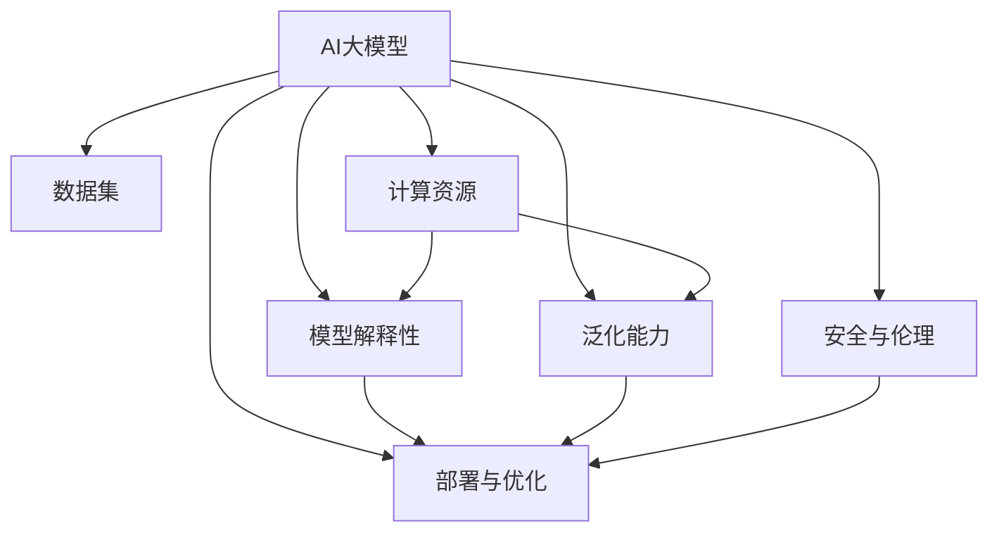

                 

# AI大模型创业：如何应对未来技术挑战？

## 1. 背景介绍

### 1.1 问题由来

近年来，人工智能(AI)技术迅速发展，尤其是大模型（Large Models）的兴起，为各行各业带来了革命性的变化。大模型，如GPT-3、BERT、T5等，通过大规模无监督学习在自然语言处理（NLP）、计算机视觉（CV）、语音识别（ASR）等领域取得了突破性的成果。这些大模型凭借其巨大的参数量和海量的数据训练，成为了解决复杂问题的利器。

然而，随着大模型的不断发展和应用，也暴露出了一些亟待解决的问题。这些挑战不仅关系到技术的可持续性，也直接影响到未来AI大模型创业的成功与否。因此，本文将详细探讨如何应对这些技术挑战，助力AI大模型创业项目取得成功。

### 1.2 问题核心关键点

AI大模型创业面临的技术挑战包括但不限于以下几个方面：

- **模型复杂度**：大模型具有数亿乃至数十亿的参数量，训练和推理过程需要强大的计算资源。
- **数据获取**：高质量的数据对于训练大模型至关重要，但数据获取成本高，且隐私保护问题不容忽视。
- **模型解释性**：大模型通常被视为"黑箱"，难以解释其决策过程，影响其在实际应用中的可信度。
- **泛化能力**：大模型在特定数据集上的表现通常较好，但在不同分布下的泛化能力较弱，存在一定的鲁棒性问题。
- **安全与伦理**：大模型可能存在偏见、有害信息等，如何确保其输出结果的公平性和安全性是一个重要问题。
- **部署与优化**：大模型通常需要优化部署方案，以实现高效推理和资源利用。

本文将从上述关键点出发，系统地介绍如何应对这些挑战，从而为AI大模型创业项目提供实用的建议。

## 2. 核心概念与联系

### 2.1 核心概念概述

为更好地理解AI大模型创业面临的技术挑战，本节将介绍几个关键概念及其之间的联系：

- **AI大模型（Large Models）**：指具有数亿甚至数十亿参数的深度学习模型，如GPT-3、BERT、T5等。这些模型通过大规模无监督学习获得了强大的特征提取和表示能力。

- **数据集（Dataset）**：用于训练大模型的数据集，包括图像、文本、音频等各类数据。数据集的质量直接影响模型的性能。

- **计算资源（Computational Resources）**：包括高性能GPU/TPU、分布式训练框架等，是训练和推理大模型的基础设施。

- **模型解释性（Model Interpretability）**：指模型输出的可解释性，即如何解释模型的决策过程，确保其输出的可信度。

- **泛化能力（Generalization）**：指模型在不同数据分布下的表现，即模型在新数据上的泛化性能。

- **安全与伦理（Security & Ethics）**：涉及模型输出结果的公平性、隐私保护、避免有害信息等，是确保模型可信和合规的重要因素。

- **部署与优化（Deployment & Optimization）**：指将大模型部署到生产环境，并进行优化以实现高效推理的过程。

这些核心概念之间的联系可以通过以下Mermaid流程图来展示：



这个流程图展示了大模型的关键组成部分及其相互关系：

1. 大模型通过数据集进行训练，获得表示能力。
2. 计算资源支撑大模型的训练和推理过程。
3. 模型解释性、泛化能力、安全与伦理都是模型性能的重要方面。
4. 部署与优化是模型在实际应用中的重要环节。

## 3. 核心算法原理 & 具体操作步骤

### 3.1 算法原理概述

AI大模型创业的核心在于如何将大模型有效地应用于实际业务，并在其中取得商业价值。这涉及到从模型训练到模型部署的整个流程。以下将详细介绍该流程中的关键算法原理和具体操作步骤。

### 3.2 算法步骤详解

AI大模型创业的算法步骤主要包括以下几个方面：

**Step 1: 数据集准备与预处理**
- 选择合适的数据集，确保数据质量，并进行必要的预处理，如数据清洗、归一化等。

**Step 2: 模型选择与架构设计**
- 根据业务需求选择合适的模型，并进行架构设计，如添加任务相关的头或层。

**Step 3: 模型训练与优化**
- 使用分布式训练框架进行模型训练，选择合适的优化器（如Adam、SGD等）和损失函数。
- 应用正则化技术（如L2正则、Dropout等）避免过拟合。

**Step 4: 模型评估与微调**
- 在验证集上评估模型性能，根据评估结果进行微调。
- 微调时使用更小的学习率，避免破坏预训练权重。

**Step 5: 模型部署与优化**
- 将训练好的模型部署到生产环境中，如使用AWS、GCP等云平台。
- 对模型进行优化，如剪枝、量化等，以提升推理速度和资源利用效率。

**Step 6: 模型监控与迭代**
- 监控模型在生产环境中的性能，根据反馈进行模型迭代和优化。

### 3.3 算法优缺点

AI大模型创业算法具有以下优点：

- **高效性**：大模型通过大规模数据训练，具备强大的特征提取能力，能够在某些任务上取得优异性能。
- **灵活性**：模型可以针对具体任务进行微调，适应不同业务场景。
- **泛化能力强**：经过大规模数据训练的模型具有较强的泛化能力，能够在不同数据分布上表现良好。

然而，这些算法也存在一些缺点：

- **计算资源需求高**：大模型需要大量的计算资源进行训练和推理。
- **数据需求大**：高质量的数据对于训练大模型至关重要，但数据获取成本较高。
- **模型解释性差**：大模型通常被视为"黑箱"，难以解释其决策过程。
- **鲁棒性问题**：大模型在特定数据集上的表现较好，但在不同分布下的泛化能力较弱。

### 3.4 算法应用领域

AI大模型创业算法可以应用于多个领域，包括但不限于：

- **自然语言处理（NLP）**：如文本分类、情感分析、机器翻译等。
- **计算机视觉（CV）**：如图像分类、目标检测、图像生成等。
- **语音识别（ASR）**：如语音转文本、说话人识别等。
- **推荐系统**：如商品推荐、音乐推荐等。
- **医疗诊断**：如医学影像分析、疾病诊断等。

## 4. 数学模型和公式 & 详细讲解 & 举例说明（备注：数学公式请使用latex格式，latex嵌入文中独立段落使用 $$，段落内使用 $)
### 4.1 数学模型构建

本节将使用数学语言对AI大模型创业中的核心算法进行更加严格的刻画。

假设我们选择了一个深度神经网络作为AI大模型，其参数为 $\theta$。模型输入为 $x$，输出为 $y$，损失函数为 $\mathcal{L}$。模型的训练目标是最小化损失函数：

$$
\theta^* = \mathop{\arg\min}_{\theta} \mathcal{L}(\theta, x, y)
$$

其中，$\mathcal{L}(\theta, x, y)$ 表示在输入 $x$ 和输出 $y$ 下的损失函数。

### 4.2 公式推导过程

以简单的线性回归为例，介绍损失函数和梯度计算过程。

假设模型的输入为 $x$，输出为 $y$，其中 $y = \theta x + b$，$\theta$ 和 $b$ 为模型的参数。我们选择均方误差作为损失函数：

$$
\mathcal{L}(\theta, x, y) = \frac{1}{2} (y - \theta x - b)^2
$$

损失函数对 $\theta$ 的梯度为：

$$
\frac{\partial \mathcal{L}}{\partial \theta} = -\theta x + \theta^2 x
$$

通过梯度下降算法，可以更新模型的参数 $\theta$：

$$
\theta = \theta - \eta \frac{\partial \mathcal{L}}{\partial \theta}
$$

其中，$\eta$ 为学习率。

### 4.3 案例分析与讲解

假设我们使用大模型进行文本分类任务。我们可以将大模型作为特征提取器，在分类器上进行微调。具体步骤如下：

1. **数据准备**：选择一组文本数据，进行标注，将数据划分为训练集、验证集和测试集。
2. **模型选择**：选择BERT、GPT等预训练模型作为特征提取器，并添加一个全连接层作为分类器。
3. **模型训练**：使用训练集对模型进行微调，最小化损失函数。
4. **模型评估**：在验证集上评估模型性能，根据评估结果进行微调。
5. **模型部署**：将训练好的模型部署到生产环境中，如AWS Sagemaker等平台。

## 5. 项目实践：代码实例和详细解释说明

### 5.1 开发环境搭建

在进行AI大模型创业实践前，我们需要准备好开发环境。以下是使用Python进行TensorFlow开发的环境配置流程：

1. 安装Anaconda：从官网下载并安装Anaconda，用于创建独立的Python环境。

2. 创建并激活虚拟环境：
```bash
conda create -n tf-env python=3.8 
conda activate tf-env
```

3. 安装TensorFlow：根据CUDA版本，从官网获取对应的安装命令。例如：
```bash
conda install tensorflow -c conda-forge
```

4. 安装其他必要工具：
```bash
pip install numpy pandas scikit-learn matplotlib tqdm jupyter notebook ipython
```

完成上述步骤后，即可在`tf-env`环境中开始AI大模型创业实践。

### 5.2 源代码详细实现

下面以推荐系统为例，给出使用TensorFlow进行AI大模型创业的PyTorch代码实现。

首先，定义推荐系统的数据处理函数：

```python
import tensorflow as tf
import numpy as np

class RecommendationSystem:
    def __init__(self, num_users, num_items, embed_size):
        self.num_users = num_users
        self.num_items = num_items
        self.embed_size = embed_size
        self.user_embeddings = tf.Variable(tf.random.normal([num_users, embed_size]))
        self.item_embeddings = tf.Variable(tf.random.normal([num_items, embed_size]))
        self.bias = tf.Variable(tf.zeros([num_items]))
        self.w = tf.Variable(tf.zeros([num_items]))
        self.b = tf.Variable(tf.zeros([]))
    
    def predict(self, user_ids, item_ids):
        user_embeddings = tf.nn.embedding_lookup(self.user_embeddings, user_ids)
        item_embeddings = tf.nn.embedding_lookup(self.item_embeddings, item_ids)
        scores = tf.matmul(user_embeddings, item_embeddings, transpose_b=True) + self.bias
        return scores
```

然后，定义训练和评估函数：

```python
@tf.function
def train_step(model, user_ids, item_ids, labels):
    with tf.GradientTape() as tape:
        scores = model.predict(user_ids, item_ids)
        loss = tf.reduce_mean(tf.nn.sigmoid_cross_entropy_with_logits(labels=labels, logits=scores))
    grads = tape.gradient(loss, model.trainable_variables)
    optimizer.apply_gradients(zip(grads, model.trainable_variables))
    return loss.numpy()

@tf.function
def evaluate(model, user_ids, item_ids, labels):
    scores = model.predict(user_ids, item_ids)
    predictions = tf.round(tf.sigmoid(scores))
    accuracy = tf.reduce_mean(tf.cast(tf.equal(predictions, labels), tf.float32))
    return accuracy.numpy()
```

最后，启动训练流程并在测试集上评估：

```python
epochs = 10
batch_size = 64

for epoch in range(epochs):
    for user_ids, item_ids, labels in train_dataset:
        loss = train_step(model, user_ids, item_ids, labels)
        print(f"Epoch {epoch+1}, loss: {loss}")
    
    accuracy = evaluate(model, user_ids, item_ids, labels)
    print(f"Epoch {epoch+1}, accuracy: {accuracy}")
    
print("Test results:")
accuracy = evaluate(model, user_ids, item_ids, labels)
print(f"Test accuracy: {accuracy}")
```

以上就是使用TensorFlow对推荐系统进行AI大模型创业实践的完整代码实现。可以看到，TensorFlow提供了强大的工具支持，可以方便地构建、训练和部署大模型。

### 5.3 代码解读与分析

让我们再详细解读一下关键代码的实现细节：

**RecommendationSystem类**：
- `__init__`方法：初始化模型参数。
- `predict`方法：计算用户对物品的评分。

**train_step和evaluate函数**：
- 定义训练和评估函数，使用TensorFlow的自动微分功能计算梯度，并使用优化器更新模型参数。
- 训练函数在每个epoch内对数据进行批处理训练，并在每个batch后输出损失。
- 评估函数在测试集上计算模型的准确率。

**训练流程**：
- 定义总的epoch数和batch size，开始循环迭代。
- 每个epoch内，对数据集进行迭代，在每个batch上前向传播计算损失，并反向传播更新模型参数。
- 重复上述步骤直至满足预设的迭代轮数或Early Stopping条件。
- 在测试集上评估模型性能，对比训练前后的准确率提升。

可以看到，TensorFlow提供了简单易用的API，使得AI大模型创业的代码实现变得便捷高效。开发者可以将更多精力放在数据处理、模型改进等高层逻辑上，而不必过多关注底层的实现细节。

## 6. 实际应用场景

### 6.1 推荐系统

AI大模型创业在推荐系统中的应用非常广泛。推荐系统通过分析用户行为和物品属性，为用户推荐感兴趣的物品，从而提高用户满意度、增加用户粘性。大模型在推荐系统中可以用于用户和物品的表示学习，以及召回和排序。

在技术实现上，可以收集用户的历史行为数据（如浏览、购买、评分等），并结合物品的标题、描述、标签等文本信息，在预训练模型上进行微调。微调后的模型能够从文本信息中准确把握用户兴趣点，并在生成推荐列表时，先通过物品描述生成物品表示，再结合用户表示进行匹配排序，生成推荐结果。

### 6.2 医疗诊断

AI大模型创业在医疗领域的应用也逐渐兴起。大模型可以用于医疗影像分析、疾病诊断、药物研发等方面，极大地提升了医疗服务的智能化水平。

在医疗影像分析中，大模型可以用于分析X光片、CT扫描等影像数据，自动检测病灶、分析病理等。在疾病诊断中，大模型可以分析临床数据，辅助医生进行诊断。在药物研发中，大模型可以分析分子结构、基因数据等，预测药物效果、筛选候选药物等。

### 6.3 金融风险管理

AI大模型创业在金融领域的应用主要集中在风险管理方面。大模型可以用于市场情绪分析、信用评估、欺诈检测等，提高金融机构的运营效率和风险控制能力。

在市场情绪分析中，大模型可以分析新闻、评论、社交媒体等海量数据，预测市场走势，提供投资建议。在信用评估中，大模型可以分析用户的信用记录、社交行为等，评估其信用风险。在欺诈检测中，大模型可以分析交易数据，识别异常行为，防范欺诈风险。

### 6.4 未来应用展望

随着AI大模型的不断发展，未来的应用场景将更加广阔。以下是一些可能的发展方向：

1. **多模态融合**：AI大模型将不仅仅局限于文本数据，还将在图像、音频、视频等多模态数据上进行训练，提升其在现实世界中的理解和建模能力。

2. **自适应学习**：AI大模型将能够根据用户行为、环境变化等动态调整模型参数，实现自适应学习，提高模型的实时性和灵活性。

3. **跨领域迁移**：AI大模型将在不同的领域和任务上进行迁移学习，如从自然语言处理迁移到计算机视觉、从推荐系统迁移到医疗诊断等，拓展模型的应用范围。

4. **联邦学习**：AI大模型将在联邦学习框架下进行分布式训练，保护数据隐私，同时提高模型性能。

5. **边缘计算**：AI大模型将在边缘计算环境中进行推理，实现实时性和低延迟，提升用户体验。

6. **伦理与公平**：AI大模型将在模型训练和部署中引入伦理和公平性评估，确保模型的输出结果符合人类的价值观和社会规范。

这些未来趋势将推动AI大模型创业项目的持续创新和发展，为社会带来更多的价值和福利。

## 7. 工具和资源推荐

### 7.1 学习资源推荐

为了帮助开发者系统掌握AI大模型创业的理论基础和实践技巧，这里推荐一些优质的学习资源：

1. 《深度学习》系列教材：深度学习领域的经典教材，涵盖深度学习的基础理论、算法实现和应用案例。
2. Coursera《深度学习》课程：斯坦福大学开设的深度学习课程，涵盖深度学习的理论和实践，适合初学者和进阶者。
3. Udacity《深度学习》纳米学位课程：提供深度学习的系统培训，涵盖深度学习的基础、模型训练和部署等。
4. Google AI博客：提供最新的AI技术进展、案例分享和工具介绍，是了解前沿技术的绝佳资源。
5. HuggingFace官方文档：提供丰富的预训练模型和微调样例代码，是实践AI大模型创业的重要参考。

通过对这些资源的学习实践，相信你一定能够快速掌握AI大模型创业的精髓，并用于解决实际的AI应用问题。

### 7.2 开发工具推荐

高效的开发离不开优秀的工具支持。以下是几款用于AI大模型创业开发的常用工具：

1. PyTorch：基于Python的开源深度学习框架，灵活且易于使用，适合快速迭代研究。
2. TensorFlow：由Google主导开发的开源深度学习框架，适合大规模工程应用，提供丰富的工具和资源。
3. Keras：提供高层次API，便于快速搭建和训练深度学习模型。
4. Scikit-learn：提供机器学习算法的实现，适合数据预处理和特征工程。
5. Jupyter Notebook：提供交互式的代码编写和执行环境，便于快速实验和分享。

合理利用这些工具，可以显著提升AI大模型创业的开发效率，加快创新迭代的步伐。

### 7.3 相关论文推荐

AI大模型创业的快速发展离不开学界的持续研究。以下是几篇奠基性的相关论文，推荐阅读：

1. "Deep Learning" by Ian Goodfellow, Yoshua Bengio, and Aaron Courville：介绍深度学习的基本原理和算法，是深度学习领域的经典教材。
2. "Convolutional Neural Networks for Visual Recognition" by Alex Krizhevsky, Ilya Sutskever, and Geoffrey Hinton：介绍卷积神经网络在图像识别中的应用，推动了计算机视觉的发展。
3. "Attention is All You Need" by Ashish Vaswani et al.：提出Transformer结构，奠定了现代NLP大模型的基础。
4. "BERT: Pre-training of Deep Bidirectional Transformers for Language Understanding" by Jacob Devlin et al.：提出BERT模型，引入自监督学习任务，提升了NLP任务的性能。
5. "GPT-3: Language Models are Unsupervised Multitask Learners" by OpenAI：展示GPT-3模型在零样本、少样本学习方面的能力，引发了对通用人工智能的思考。

这些论文代表了大模型创业的发展脉络，通过学习这些前沿成果，可以帮助研究者把握学科前进方向，激发更多的创新灵感。

## 8. 总结：未来发展趋势与挑战

### 8.1 总结

本文对AI大模型创业中面临的技术挑战进行了系统梳理，并提出了应对策略。首先，我们从数据集准备、模型选择、训练优化、模型评估等多个环节详细介绍了AI大模型创业的算法步骤。其次，我们通过具体案例分析，展示了如何使用AI大模型进行推荐系统、医疗诊断、金融风险管理等实际应用场景的开发。最后，我们展望了AI大模型创业的未来发展趋势，并总结了面临的挑战。

通过本文的系统梳理，可以看到，AI大模型创业虽然面临诸多挑战，但在正确的策略指导下，可以取得显著的进展和突破。未来，AI大模型创业将继续推动人工智能技术在各领域的落地应用，为经济社会发展带来深远影响。

### 8.2 未来发展趋势

展望未来，AI大模型创业将呈现以下几个发展趋势：

1. **技术迭代加速**：AI大模型和算法将持续演进，推动技术不断突破。从简单的线性回归到复杂的深度学习，技术不断迭代升级，带来更多创新点。

2. **产业应用广泛**：AI大模型创业将渗透到更多行业，如医疗、金融、教育、交通等，推动各行各业数字化转型。

3. **数据资源丰富**：随着互联网的普及和数据采集技术的进步，数据的获取和处理变得更加便捷高效。大数据、云计算等技术的快速发展，也为AI大模型创业提供了强大的数据支撑。

4. **伦理与社会责任**：AI大模型创业需要在技术创新的同时，考虑伦理与社会责任，确保模型的公平性、透明性和安全性，避免对社会产生负面影响。

5. **跨领域融合**：AI大模型创业将与物联网、区块链、5G等技术进行跨领域融合，推动技术创新和应用场景拓展。

6. **教育与培训**：AI大模型创业的发展需要大量的技术人才，教育和培训成为推动AI创业的重要环节。

以上趋势凸显了AI大模型创业的广阔前景，未来AI大模型创业将持续推动人工智能技术的发展，为各行各业带来新的价值和机遇。

### 8.3 面临的挑战

尽管AI大模型创业前景广阔，但在实现过程中仍面临诸多挑战：

1. **数据获取与隐私保护**：高质量的数据对于AI大模型创业至关重要，但数据获取成本高，且隐私保护问题不容忽视。如何在确保数据隐私的同时，获取足够的训练数据，是亟待解决的问题。

2. **计算资源需求高**：AI大模型创业需要大量的计算资源进行训练和推理，如何优化资源利用效率，降低计算成本，是技术突破的重要方向。

3. **模型解释性差**：AI大模型创业中的模型通常被视为"黑箱"，难以解释其决策过程。如何提升模型的可解释性，增强用户信任，是重要的研究课题。

4. **鲁棒性问题**：AI大模型创业中的模型在特定数据集上的表现较好，但在不同分布下的泛化能力较弱。如何提高模型的鲁棒性，避免过拟合，是提高模型性能的重要手段。

5. **安全与伦理问题**：AI大模型创业中的模型可能存在偏见、有害信息等，如何确保其输出结果的公平性和安全性，是确保模型可信和合规的重要因素。

6. **知识整合能力不足**：AI大模型创业中的模型往往局限于任务内数据，难以灵活吸收和运用更广泛的先验知识。如何让模型更好地整合知识，提高模型的适应能力，是重要的研究方向。

正视AI大模型创业面临的这些挑战，积极应对并寻求突破，将是大模型创业项目取得成功的关键。

### 8.4 研究展望

面对AI大模型创业所面临的挑战，未来的研究需要在以下几个方面寻求新的突破：

1. **数据获取与隐私保护**：探索无监督学习、半监督学习等技术，降低对大规模标注数据的依赖，提高数据获取效率。同时，加强数据隐私保护技术的研究，确保数据安全。

2. **计算资源优化**：开发更加高效的计算模型和算法，如剪枝、量化、模型并行等，减少计算资源消耗。同时，探索边缘计算、联邦学习等分布式计算技术，提高模型的实时性和资源利用效率。

3. **模型解释性增强**：引入因果分析、知识图谱等技术，增强模型的可解释性和透明性。同时，开发更加直观的可视化工具，帮助用户理解模型的决策过程。

4. **鲁棒性提升**：引入对抗训练、迁移学习等技术，提升模型的泛化能力和鲁棒性。同时，加强数据增强、数据扩充等技术的应用，提高模型的鲁棒性。

5. **安全与伦理保障**：引入伦理评估、公平性测试等技术，确保模型的输出结果符合人类价值观和社会规范。同时，开发模型监控工具，及时发现和修正模型的偏见和错误。

6. **知识整合能力**：引入知识图谱、逻辑规则等外部知识，与神经网络模型进行融合，提高模型的适应能力和整合能力。同时，开发跨模态学习技术，实现视觉、语音等多模态信息的协同建模。

这些研究方向将推动AI大模型创业项目的持续创新和发展，为社会带来更多的价值和福利。

## 9. 附录：常见问题与解答

**Q1：AI大模型创业是否适用于所有应用场景？**

A: AI大模型创业不适用于所有应用场景，但其适用性非常广泛。大模型在数据量较少的任务上表现优异，但面对数据量大的任务，如自然语言处理、计算机视觉等领域，仍然具有显著优势。然而，对于需要高度个性化、即时响应的场景，如即时通信、在线客服等，大模型仍需针对性地优化，以提高响应速度和准确率。

**Q2：AI大模型创业的计算资源需求高，如何优化资源利用效率？**

A: 优化AI大模型创业的计算资源利用效率可以从以下几个方面入手：

1. **模型剪枝**：通过剪枝去除冗余参数，减少计算量和存储空间。

2. **量化加速**：将浮点模型转为定点模型，压缩存储空间，提高计算效率。

3. **混合精度训练**：采用混合精度训练，减少内存占用，提高训练速度。

4. **分布式训练**：利用分布式训练框架，加速模型训练过程，提高资源利用效率。

5. **边缘计算**：在边缘计算环境中进行推理，减少网络传输，提高实时性。

6. **联邦学习**：采用联邦学习技术，分布式训练模型，减少数据传输成本，提高隐私保护。

**Q3：AI大模型创业中的模型解释性差，如何提升可解释性？**

A: 提升AI大模型创业中的模型解释性可以从以下几个方面入手：

1. **可视化工具**：开发更加直观的可视化工具，帮助用户理解模型的决策过程。

2. **可解释模型**：选择可解释性强的模型，如线性模型、决策树等，降低模型的复杂度。

3. **因果分析**：引入因果分析技术，分析模型的决策依据，提高模型的透明性。

4. **知识图谱**：结合知识图谱技术，将外部知识与模型进行融合，增强模型的可解释性。

5. **反例分析**：通过反例分析，找出模型的错误决策，提高模型的鲁棒性。

6. **模型监控**：开发模型监控工具，及时发现和修正模型的偏见和错误，提高模型的可信度。

通过以上方法，可以显著提升AI大模型创业中模型的可解释性，增强用户信任。

**Q4：AI大模型创业中的模型鲁棒性问题，如何解决？**

A: 提升AI大模型创业中模型的鲁棒性可以从以下几个方面入手：

1. **数据增强**：通过数据增强技术，扩充训练集，提高模型的泛化能力。

2. **正则化技术**：应用L2正则、Dropout等正则化技术，避免过拟合。

3. **对抗训练**：引入对抗样本，提高模型的鲁棒性，避免模型对输入数据的微小变化过于敏感。

4. **模型融合**：采用模型融合技术，结合多个模型的预测结果，提高模型的泛化能力。

5. **迁移学习**：在新的任务上进行迁移学习，利用已有模型的知识，加速新任务的训练。

6. **模型优化**：通过优化模型的结构和参数，提高模型的泛化能力和鲁棒性。

通过以上方法，可以显著提升AI大模型创业中模型的鲁棒性，确保模型在实际应用中的稳定性和可靠性。

**Q5：AI大模型创业中的模型安全与伦理问题，如何解决？**

A: 解决AI大模型创业中模型的安全与伦理问题可以从以下几个方面入手：

1. **数据隐私保护**：采用差分隐私、联邦学习等技术，保护数据隐私，确保数据安全。

2. **模型公平性**：引入公平性评估指标，如消除模型中的偏见、确保模型对不同群体的公平性。

3. **模型透明性**：开发透明的模型解释工具，帮助用户理解模型的决策过程。

4. **伦理约束**：在模型训练和部署中引入伦理导向的评估指标，确保模型的输出结果符合人类价值观和社会规范。

5. **用户监控**：开发用户监控工具，及时发现和修正模型的偏见和错误，确保模型的公平性和透明性。

通过以上方法，可以显著提升AI大模型创业中模型的安全性和伦理性，确保模型在实际应用中的公平性和透明性。

---

作者：禅与计算机程序设计艺术 / Zen and the Art of Computer Programming

