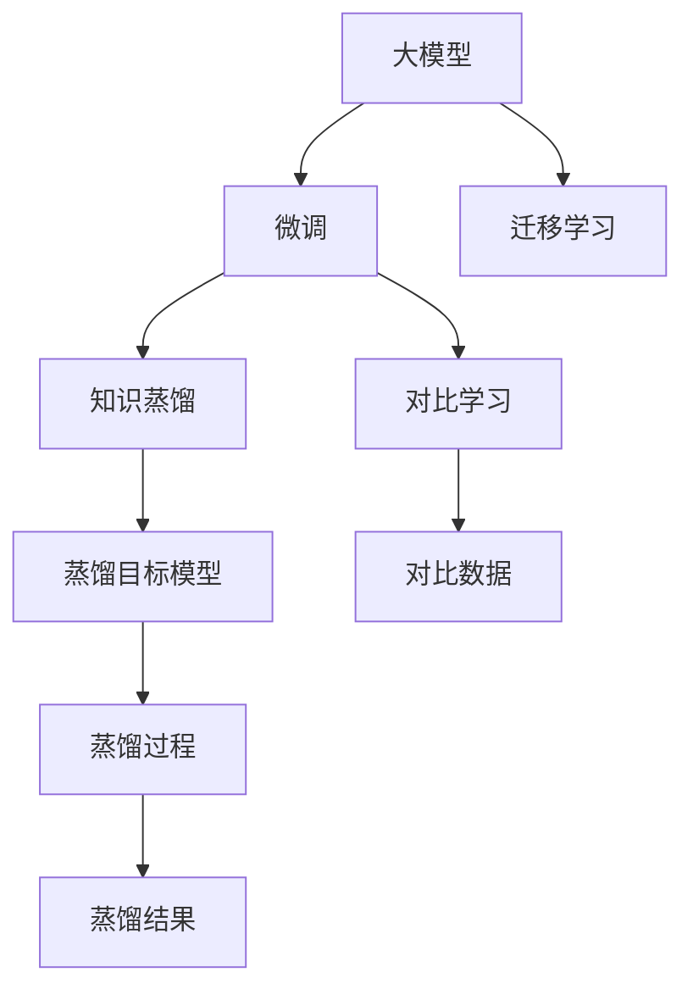

                 

## 1. 背景介绍

### 1.1 问题由来

近年来，随着人工智能(AI)技术的飞速发展，尤其是深度学习模型的不断进步，大模型(如BERT、GPT-3等)在自然语言处理(NLP)、计算机视觉(CV)、语音识别等领域取得了令人瞩目的成绩。这些大模型通过在大量无标签数据上预训练，学习到了广泛的语义和知识，并在下游任务中进行微调，实现了高效的迁移学习和任务适配。

然而，大模型和微调技术在商业化落地过程中，仍然面临诸多挑战。尤其是在AI创业公司中，如何合理应用大模型、优化微调过程、提升模型性能、降低成本、提高效率，是大模型创业团队必须要解决的核心问题。本文将全面探讨这些问题，并给出相应的解决方案。

### 1.2 问题核心关键点

大模型创业的核心在于充分利用预训练模型的通用能力，通过微调技术快速适应不同应用场景，实现高效、低成本的AI应用开发。以下是创业团队在构建大模型应用时需重点关注的关键点：

- **数据和模型选择**：选择适合应用场景的预训练模型和数据集，确保模型具有良好的迁移学习能力。
- **微调策略**：设计合理的微调步骤和参数，确保模型在新任务上的高精度和鲁棒性。
- **性能优化**：优化模型结构和超参数，提高模型的推理速度和内存占用效率。
- **资源管理**：有效管理计算资源，包括GPU、TPU等高性能设备，确保高吞吐量的模型训练和推理。
- **应用部署**：将模型封装为服务接口，实现API化部署，便于应用集成和调用。
- **监控与维护**：实时监控模型性能，及时发现和修复潜在问题，确保系统的稳定性和可靠性。

## 2. 核心概念与联系

### 2.1 核心概念概述

要应对大模型创业中的各种挑战，首先需要理解以下核心概念及其相互联系：

- **大模型(大规模预训练模型)**：如BERT、GPT-3等，通过在大规模无标签数据上预训练，学习到广泛的语义和知识，适用于多种下游任务。
- **微调(Fine-tuning)**：指在大模型基础上，通过有监督的数据，对模型进行优化，适应特定任务。
- **迁移学习(Transfer Learning)**：指将模型在一个任务上的知识，迁移到另一个相关任务上，以降低新任务的学习成本。
- **预训练模型(Pre-trained Model)**：指在大规模无标签数据上预训练得到的模型，具备较强的通用表示能力。
- **参数高效微调(Parameter-Efficient Fine-Tuning, PEFT)**：指仅更新模型的一小部分参数，以提高微调效率，避免过拟合。
- **知识蒸馏(Knowledge Distillation)**：通过将大型模型的知识蒸馏到小型模型，提升小型模型的性能。
- **对比学习(Contrastive Learning)**：通过对比数据对模型的不同表示进行约束，提升模型的泛化能力。

这些核心概念构成了大模型创业的基础框架，帮助创业团队设计、实现和优化AI应用。

### 2.2 核心概念原理和架构的 Mermaid 流程图(Mermaid 流程节点中不要有括号、逗号等特殊字符)



## 3. 核心算法原理 & 具体操作步骤

### 3.1 算法原理概述

大模型创业的核心算法原理是基于迁移学习的微调策略，即在预训练模型的基础上，通过下游任务的少量标注数据进行微调，快速适应新任务。微调的目标是通过优化模型的参数，使其在新任务上的表现优于从头训练，同时尽可能保留预训练模型的通用表示能力。

### 3.2 算法步骤详解

1. **数据准备**：收集和准备下游任务的标注数据，并划分为训练集、验证集和测试集。
2. **选择模型和任务适配层**：选择适合任务的预训练模型，并在模型顶层添加任务适配层，如全连接层、Attention机制等。
3. **设计损失函数**：根据任务类型，设计合适的损失函数，如交叉熵损失、均方误差损失等。
4. **优化器选择**：选择适合模型的优化器及其参数，如AdamW、SGD等，设置学习率、批大小、迭代轮数等。
5. **微调训练**：在训练集上执行梯度下降算法，不断更新模型参数，最小化损失函数，直至模型收敛。
6. **性能评估**：在验证集上评估模型性能，调整超参数和模型结构，确保模型在新任务上具有较好的泛化能力。
7. **部署和维护**：将微调后的模型封装为服务接口，实时监控模型性能，定期更新模型，确保系统的稳定性和可靠性。

### 3.3 算法优缺点

#### 优点：

1. **快速适应**：微调方法能够在少量标注数据下快速适应新任务，大幅降低开发成本和周期。
2. **高效迁移**：利用预训练模型的通用表示能力，微调方法能较好地跨领域迁移，提高模型泛化能力。
3. **参数高效**：通过参数高效微调技术，在固定大部分预训练参数的情况下，微调方法仍能有效提升模型性能。
4. **可解释性强**：微调模型通常比从头训练模型更容易理解和解释，便于调试和优化。

#### 缺点：

1. **依赖标注数据**：微调方法的效果很大程度上取决于标注数据的质量和数量，高质量标注数据的获取成本较高。
2. **泛化能力有限**：当目标任务与预训练数据的分布差异较大时，微调的性能提升有限。
3. **易过拟合**：微调过程中，模型参数更新频率较高，容易出现过拟合现象。
4. **资源消耗大**：大规模模型训练和推理对计算资源的需求较高，对企业的资源投入要求较大。
5. **模型更新难度高**：新任务的微调可能需要调整模型结构和参数，增加模型更新难度。

### 3.4 算法应用领域

大模型微调技术在多个领域得到了广泛应用，包括但不限于：

- **自然语言处理(NLP)**：文本分类、情感分析、命名实体识别、机器翻译、文本生成等。
- **计算机视觉(CV)**：图像分类、目标检测、语义分割、图像生成等。
- **语音识别**：语音转文本、语音合成、情感识别等。
- **推荐系统**：个性化推荐、用户行为分析等。
- **医疗健康**：疾病诊断、基因分析、医学图像识别等。
- **金融科技**：信用评估、风险控制、舆情分析等。
- **智能制造**：设备故障诊断、质量控制、生产调度等。

## 4. 数学模型和公式 & 详细讲解 & 举例说明

### 4.1 数学模型构建

假设预训练模型为 $M_{\theta}$，下游任务为 $T$，标注数据集为 $D=\{(x_i, y_i)\}_{i=1}^N$，其中 $x_i$ 为输入，$y_i$ 为标签。微调的目标是最小化损失函数 $\mathcal{L}(\theta)$：

$$
\mathcal{L}(\theta) = \frac{1}{N}\sum_{i=1}^N \ell(M_{\theta}(x_i), y_i)
$$

其中 $\ell$ 为损失函数，如交叉熵损失 $\ell(x_i, y_i) = -y_i \log M_{\theta}(x_i) - (1-y_i) \log (1 - M_{\theta}(x_i))$。

### 4.2 公式推导过程

微调的优化目标是通过梯度下降算法，不断更新模型参数 $\theta$，最小化损失函数 $\mathcal{L}(\theta)$：

$$
\theta \leftarrow \theta - \eta \nabla_{\theta}\mathcal{L}(\theta)
$$

其中 $\eta$ 为学习率，$\nabla_{\theta}\mathcal{L}(\theta)$ 为损失函数对参数 $\theta$ 的梯度，可以通过反向传播算法计算得到。

### 4.3 案例分析与讲解

以情感分析任务为例，假设输入为文本 $x$，输出为情感标签 $y$，模型 $M_{\theta}$ 的输出为 $M_{\theta}(x)$。则交叉熵损失函数为：

$$
\ell(x_i, y_i) = -y_i \log M_{\theta}(x_i) - (1-y_i) \log (1 - M_{\theta}(x_i))
$$

在微调过程中，模型参数 $\theta$ 的更新公式为：

$$
\theta \leftarrow \theta - \eta \nabla_{\theta} \frac{1}{N}\sum_{i=1}^N \ell(x_i, y_i)
$$

在实际应用中，可以根据任务需求调整损失函数和优化器，以提高微调效果。

## 5. 项目实践：代码实例和详细解释说明

### 5.1 开发环境搭建

1. **安装依赖包**：
   ```bash
   pip install torch torchvision transformers
   ```

2. **创建虚拟环境**：
   ```bash
   conda create -n my_env python=3.8
   conda activate my_env
   ```

3. **下载预训练模型**：
   ```bash
   wget https://huggingface.co/models/bert-base-uncased -P models/
   ```

### 5.2 源代码详细实现

以情感分析任务为例，代码如下：

```python
import torch
import torch.nn as nn
from transformers import BertTokenizer, BertForSequenceClassification
from torch.utils.data import DataLoader
from sklearn.model_selection import train_test_split
from tqdm import tqdm

# 加载数据集和预训练模型
def load_data(path):
    with open(path, 'r', encoding='utf-8') as f:
        data = f.readlines()
    tokens = [d.strip() for d in data]
    labels = [1 if 'positive' in d else 0 for d in data]
    tokenizer = BertTokenizer.from_pretrained('bert-base-uncased')
    inputs = tokenizer(tokens, padding='max_length', truncation=True, max_length=128, return_tensors='pt')
    return inputs['input_ids'], labels

# 构建模型
class Model(nn.Module):
    def __init__(self):
        super(Model, self).__init__()
        self.bert = BertForSequenceClassification.from_pretrained('bert-base-uncased', num_labels=2)
        self.dropout = nn.Dropout(0.1)
        self.fc = nn.Linear(768, 2)
        self.activation = nn.Softmax(dim=1)

    def forward(self, input_ids, attention_mask):
        outputs = self.bert(input_ids, attention_mask=attention_mask)
        pooled_output = outputs.pooler_output
        x = self.dropout(pooled_output)
        x = self.fc(x)
        x = self.activation(x)
        return x

# 微调训练
def train_epoch(model, inputs, labels, optimizer):
    model.train()
    total_loss = 0
    for batch in tqdm(inputs, total=len(inputs)):
        input_ids = batch['input_ids'].to(device)
        attention_mask = batch['attention_mask'].to(device)
        labels = labels.to(device)
        optimizer.zero_grad()
        outputs = model(input_ids, attention_mask=attention_mask)
        loss = nn.CrossEntropyLoss()(outputs, labels)
        loss.backward()
        optimizer.step()
        total_loss += loss.item()
    return total_loss / len(inputs)

# 训练模型
def train(model, inputs, labels, epochs=3, batch_size=16, learning_rate=2e-5):
    device = torch.device('cuda' if torch.cuda.is_available() else 'cpu')
    model.to(device)
    optimizer = torch.optim.Adam(model.parameters(), lr=learning_rate)

    for epoch in range(epochs):
        loss = train_epoch(model, inputs, labels, optimizer)
        print(f'Epoch {epoch+1}, train loss: {loss:.3f}')
```

### 5.3 代码解读与分析

**数据加载函数**：
- 从文件中读取文本和标签，分词并进行padding。

**模型定义**：
- 加载预训练的BERT模型，添加线性层和softmax激活函数。

**微调训练函数**：
- 在每个epoch上前向传播计算损失函数，反向传播更新模型参数。

**模型训练函数**：
- 循环迭代epoch，在每个epoch开始前进行训练，输出平均损失。

### 5.4 运行结果展示

在训练完成后，可以将微调后的模型用于测试和推理：

```python
# 加载测试集
test_inputs, test_labels = load_data('test.txt')

# 评估模型
model.eval()
total_loss = 0
for batch in test_inputs:
    input_ids = batch['input_ids'].to(device)
    attention_mask = batch['attention_mask'].to(device)
    labels = test_labels.to(device)
    with torch.no_grad():
        outputs = model(input_ids, attention_mask=attention_mask)
        loss = nn.CrossEntropyLoss()(outputs, labels)
        total_loss += loss.item()

print(f'Test loss: {total_loss / len(test_inputs)}')
```

## 6. 实际应用场景

### 6.1 智能客服系统

大模型微调技术可以应用于智能客服系统的构建。传统客服往往需要大量人力，高峰期响应速度慢，且一致性和专业性难以保证。使用微调后的对话模型，可以7x24小时不间断服务，快速响应客户咨询，用自然流畅的语言解答各类常见问题。

### 6.2 金融舆情监测

金融机构需要实时监测市场舆论动向，以便及时应对负面信息传播，规避金融风险。微调后的文本分类和情感分析模型，可自动判断文本属于何种主题，情感倾向是正面、中性还是负面。将微调后的模型应用到实时抓取的网络文本数据，能够自动监测不同主题下的情感变化趋势，及时预警异常情况，帮助金融机构快速应对潜在风险。

### 6.3 个性化推荐系统

当前的推荐系统往往只依赖用户的历史行为数据进行物品推荐，无法深入理解用户的真实兴趣偏好。利用微调技术，推荐系统可以更好地挖掘用户行为背后的语义信息，从而提供更精准、多样的推荐内容。

### 6.4 未来应用展望

随着大模型和微调技术的不断发展，基于微调范式将在更多领域得到应用，为传统行业带来变革性影响。

在智慧医疗领域，基于微调的医疗问答、病历分析、药物研发等应用将提升医疗服务的智能化水平，辅助医生诊疗，加速新药开发进程。

在智能教育领域，微调技术可应用于作业批改、学情分析、知识推荐等方面，因材施教，促进教育公平，提高教学质量。

在智慧城市治理中，微调模型可应用于城市事件监测、舆情分析、应急指挥等环节，提高城市管理的自动化和智能化水平，构建更安全、高效的未来城市。

## 7. 工具和资源推荐

### 7.1 学习资源推荐

1. **《Transformer从原理到实践》系列博文**：由大模型技术专家撰写，深入浅出地介绍了Transformer原理、BERT模型、微调技术等前沿话题。
2. **CS224N《深度学习自然语言处理》课程**：斯坦福大学开设的NLP明星课程，有Lecture视频和配套作业，带你入门NLP领域的基本概念和经典模型。
3. **《Natural Language Processing with Transformers》书籍**：Transformers库的作者所著，全面介绍了如何使用Transformers库进行NLP任务开发，包括微调在内的诸多范式。
4. **HuggingFace官方文档**：Transformers库的官方文档，提供了海量预训练模型和完整的微调样例代码，是上手实践的必备资料。
5. **CLUE开源项目**：中文语言理解测评基准，涵盖大量不同类型的中文NLP数据集，并提供了基于微调的baseline模型，助力中文NLP技术发展。

### 7.2 开发工具推荐

1. **PyTorch**：基于Python的开源深度学习框架，灵活动态的计算图，适合快速迭代研究。
2. **TensorFlow**：由Google主导开发的开源深度学习框架，生产部署方便，适合大规模工程应用。
3. **Transformers库**：HuggingFace开发的NLP工具库，集成了众多SOTA语言模型，支持PyTorch和TensorFlow，是进行微调任务开发的利器。
4. **Weights & Biases**：模型训练的实验跟踪工具，可以记录和可视化模型训练过程中的各项指标，方便对比和调优。
5. **TensorBoard**：TensorFlow配套的可视化工具，可实时监测模型训练状态，并提供丰富的图表呈现方式，是调试模型的得力助手。
6. **Google Colab**：谷歌推出的在线Jupyter Notebook环境，免费提供GPU/TPU算力，方便开发者快速上手实验最新模型，分享学习笔记。

### 7.3 相关论文推荐

1. **Attention is All You Need**：提出了Transformer结构，开启了NLP领域的预训练大模型时代。
2. **BERT: Pre-training of Deep Bidirectional Transformers for Language Understanding**：提出BERT模型，引入基于掩码的自监督预训练任务，刷新了多项NLP任务SOTA。
3. **Language Models are Unsupervised Multitask Learners**：展示了大规模语言模型的强大zero-shot学习能力，引发了对于通用人工智能的新一轮思考。
4. **Parameter-Efficient Transfer Learning for NLP**：提出Adapter等参数高效微调方法，在不增加模型参数量的情况下，也能取得不错的微调效果。
5. **Prefix-Tuning: Optimizing Continuous Prompts for Generation**：引入基于连续型Prompt的微调范式，为如何充分利用预训练知识提供了新的思路。
6. **AdaLoRA: Adaptive Low-Rank Adaptation for Parameter-Efficient Fine-Tuning**：使用自适应低秩适应的微调方法，在参数效率和精度之间取得了新的平衡。

## 8. 总结：未来发展趋势与挑战

### 8.1 总结

本文对大模型创业中的微调技术进行了全面系统的介绍，帮助创业者理解和掌握微调方法的原理、步骤和应用。通过系统梳理微调技术的核心概念和关键步骤，结合实际应用场景和代码实例，力求为读者提供全方位的技术指引。

### 8.2 未来发展趋势

展望未来，大模型微调技术将呈现以下几个发展趋势：

1. **模型规模持续增大**：随着算力成本的下降和数据规模的扩张，预训练语言模型的参数量还将持续增长。超大规模语言模型蕴含的丰富语言知识，有望支撑更加复杂多变的下游任务微调。
2. **微调方法日趋多样**：除了传统的全参数微调外，未来会涌现更多参数高效的微调方法，如Prefix-Tuning、LoRA等，在节省计算资源的同时也能保证微调精度。
3. **持续学习成为常态**：随着数据分布的不断变化，微调模型也需要持续学习新知识以保持性能。如何在不遗忘原有知识的同时，高效吸收新样本信息，将成为重要的研究课题。
4. **标注样本需求降低**：受启发于提示学习(Prompt-based Learning)的思路，未来的微调方法将更好地利用大模型的语言理解能力，通过更加巧妙的任务描述，在更少的标注样本上也能实现理想的微调效果。
5. **多模态微调崛起**：当前的微调主要聚焦于纯文本数据，未来会进一步拓展到图像、视频、语音等多模态数据微调。多模态信息的融合，将显著提升语言模型对现实世界的理解和建模能力。
6. **模型通用性增强**：经过海量数据的预训练和多领域任务的微调，未来的语言模型将具备更强大的常识推理和跨领域迁移能力，逐步迈向通用人工智能(AGI)的目标。

### 8.3 面临的挑战

尽管大模型微调技术已经取得了瞩目成就，但在迈向更加智能化、普适化应用的过程中，它仍面临着诸多挑战：

1. **标注成本瓶颈**：微调方法的效果很大程度上取决于标注数据的质量和数量，获取高质量标注数据的成本较高。如何进一步降低微调对标注样本的依赖，将是一大难题。
2. **模型鲁棒性不足**：当前微调模型面对域外数据时，泛化性能往往大打折扣。对于测试样本的微小扰动，微调模型的预测也容易发生波动。如何提高微调模型的鲁棒性，避免灾难性遗忘，还需要更多理论和实践的积累。
3. **推理效率有待提高**：大规模语言模型虽然精度高，但在实际部署时往往面临推理速度慢、内存占用大等效率问题。如何在保证性能的同时，简化模型结构，提升推理速度，优化资源占用，将是重要的优化方向。
4. **可解释性亟需加强**：当前微调模型更像是"黑盒"系统，难以解释其内部工作机制和决策逻辑。对于医疗、金融等高风险应用，算法的可解释性和可审计性尤为重要。如何赋予微调模型更强的可解释性，将是亟待攻克的难题。
5. **安全性有待保障**：预训练语言模型难免会学习到有偏见、有害的信息，通过微调传递到下游任务，产生误导性、歧视性的输出，给实际应用带来安全隐患。如何从数据和算法层面消除模型偏见，避免恶意用途，确保输出的安全性，也将是重要的研究课题。
6. **知识整合能力不足**：现有的微调模型往往局限于任务内数据，难以灵活吸收和运用更广泛的先验知识。如何让微调过程更好地与外部知识库、规则库等专家知识结合，形成更加全面、准确的信息整合能力，还有很大的想象空间。

### 8.4 研究展望

面对大模型微调面临的这些挑战，未来的研究需要在以下几个方面寻求新的突破：

1. **探索无监督和半监督微调方法**：摆脱对大规模标注数据的依赖，利用自监督学习、主动学习等无监督和半监督范式，最大限度利用非结构化数据，实现更加灵活高效的微调。
2. **研究参数高效和计算高效的微调范式**：开发更加参数高效的微调方法，在固定大部分预训练参数的情况下，微调方法仍能有效提升模型性能。同时优化微调模型的计算图，减少前向传播和反向传播的资源消耗，实现更加轻量级、实时性的部署。
3. **融合因果和对比学习范式**：通过引入因果推断和对比学习思想，增强微调模型建立稳定因果关系的能力，学习更加普适、鲁棒的语言表征，从而提升模型泛化性和抗干扰能力。
4. **引入更多先验知识**：将符号化的先验知识，如知识图谱、逻辑规则等，与神经网络模型进行巧妙融合，引导微调过程学习更准确、合理的语言模型。同时加强不同模态数据的整合，实现视觉、语音等多模态信息与文本信息的协同建模。
5. **结合因果分析和博弈论工具**：将因果分析方法引入微调模型，识别出模型决策的关键特征，增强输出解释的因果性和逻辑性。借助博弈论工具刻画人机交互过程，主动探索并规避模型的脆弱点，提高系统稳定性。
6. **纳入伦理道德约束**：在模型训练目标中引入伦理导向的评估指标，过滤和惩罚有偏见、有害的输出倾向。同时加强人工干预和审核，建立模型行为的监管机制，确保输出符合人类价值观和伦理道德。

## 9. 附录：常见问题与解答

**Q1: 大模型微调是否适用于所有NLP任务？**

A: 大模型微调在大多数NLP任务上都能取得不错的效果，特别是对于数据量较小的任务。但对于一些特定领域的任务，如医学、法律等，仅仅依靠通用语料预训练的模型可能难以很好地适应。此时需要在特定领域语料上进一步预训练，再进行微调，才能获得理想效果。此外，对于一些需要时效性、个性化很强的任务，如对话、推荐等，微调方法也需要针对性的改进优化。

**Q2: 微调过程中如何选择合适的学习率？**

A: 微调的学习率一般要比预训练时小1-2个数量级，如果使用过大的学习率，容易破坏预训练权重，导致过拟合。一般建议从1e-5开始调参，逐步减小学习率，直至收敛。也可以使用warmup策略，在开始阶段使用较小的学习率，再逐渐过渡到预设值。需要注意的是，不同的优化器(如AdamW、Adafactor等)以及不同的学习率调度策略，可能需要设置不同的学习率阈值。

**Q3: 采用大模型微调时会面临哪些资源瓶颈？**

A: 目前主流的预训练大模型动辄以亿计的参数规模，对算力、内存、存储都提出了很高的要求。GPU/TPU等高性能设备是必不可少的，但即便如此，超大批次的训练和推理也可能遇到显存不足的问题。因此需要采用一些资源优化技术，如梯度积累、混合精度训练、模型并行等，来突破硬件瓶颈。同时，模型的存储和读取也可能占用大量时间和空间，需要采用模型压缩、稀疏化存储等方法进行优化。

**Q4: 如何缓解微调过程中的过拟合问题？**

A: 过拟合是微调面临的主要挑战，尤其是在标注数据不足的情况下。常见的缓解策略包括：

1. 数据增强：通过回译、近义替换等方式扩充训练集
2. 正则化：使用L2正则、Dropout、Early Stopping等避免过拟合
3. 对抗训练：引入对抗样本，提高模型鲁棒性
4. 参数高效微调：只调整模型的一小部分参数(如Adapter、Prefix等)，减小过拟合风险
5. 多模型集成：训练多个微调模型，取平均输出，抑制过拟合

这些策略往往需要根据具体任务和数据特点进行灵活组合。只有在数据、模型、训练、推理等各环节进行全面优化，才能最大限度地发挥大模型微调的威力。

**Q5: 微调模型在落地部署时需要注意哪些问题？**

A: 将微调模型转化为实际应用，还需要考虑以下因素：

1. 模型裁剪：去除不必要的层和参数，减小模型尺寸，加快推理速度
2. 量化加速：将浮点模型转为定点模型，压缩存储空间，提高计算效率
3. 服务化封装：将模型封装为标准化服务接口，实现API化部署，便于应用集成和调用
4. 弹性伸缩：根据请求流量动态调整资源配置，平衡服务质量和成本
5. 监控与维护：实时监控模型性能，及时发现和修复潜在问题，确保系统的稳定性和可靠性

大模型微调为NLP应用开启了广阔的想象空间，但如何将强大的性能转化为稳定、高效、安全的业务价值，还需要工程实践的不断打磨。唯有从数据、算法、工程、业务等多个维度协同发力，才能真正实现人工智能技术在垂直行业的规模化落地。总之，微调需要开发者根据具体任务，不断迭代和优化模型、数据和算法，方能得到理想的效果。

---

作者：禅与计算机程序设计艺术 / Zen and the Art of Computer Programming

