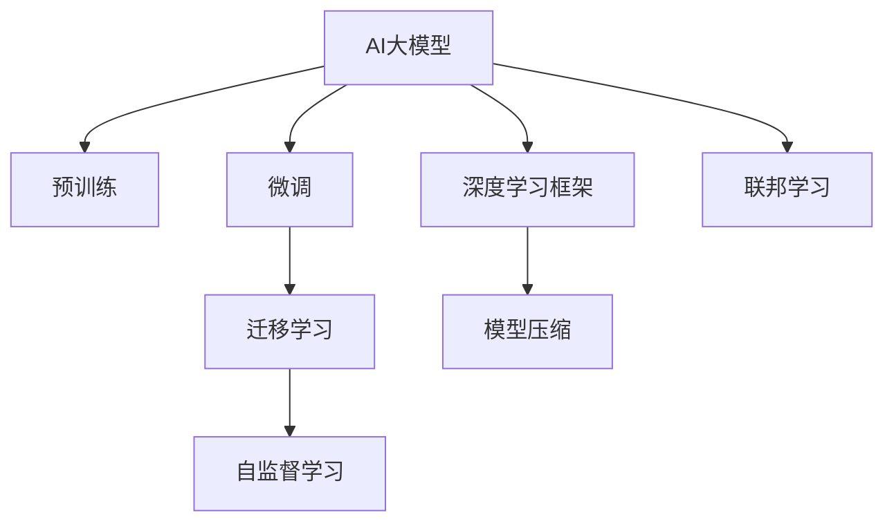

                 

# AI大模型创业：如何应对未来挑战？

> 关键词：AI大模型,创业,未来挑战,深度学习,自然语言处理,NLP

## 1. 背景介绍

### 1.1 问题由来
近年来，人工智能(AI)技术的发展势头迅猛，尤其是深度学习在大规模数据上的训练能力，使得AI大模型在各个领域内取得了卓越的成绩。诸如OpenAI的GPT、Google的BERT等通用大模型，已经在自然语言处理(NLP)、计算机视觉、语音识别等诸多领域展示了强大的通用泛化能力。这些大模型通过预训练学习到丰富的知识，再通过微调适应特定任务，推动了各行各业的智能化进程。

然而，随着AI大模型的不断演进，创业企业在利用大模型开展应用时，也面临着一系列挑战。从数据标注成本、算法实现难度，到模型训练资源和部署问题，这些挑战都可能影响创业项目的发展速度和成功概率。因此，如何有效地利用AI大模型，应对未来可能遇到的挑战，成为创业企业必须认真对待的问题。

### 1.2 问题核心关键点
为了更好地理解这些挑战，我们需要先明确AI大模型创业的核心问题：

1. **数据标注成本**：构建和训练AI大模型，尤其是针对特定任务的微调，通常需要大量标注数据，成本高昂。
2. **算法实现复杂度**：AI大模型的训练和微调涉及复杂的深度学习框架和算法，实现难度较大。
3. **计算资源需求**：大模型训练和推理需要强大的计算资源，尤其是GPU或TPU等硬件支持。
4. **模型可解释性**：AI大模型的决策过程往往难以解释，可能影响应用的可信度和合规性。
5. **隐私和安全问题**：大模型处理大量数据时可能涉及隐私泄露和数据安全问题。
6. **用户接受度**：用户对AI大模型的认知度不高，可能存在一定的市场教育难度。

这些问题相互关联，共同构成AI大模型创业的挑战。本文将系统性地探讨这些挑战，并提供可行的解决策略。

## 2. 核心概念与联系

### 2.1 核心概念概述

在深入讨论如何解决AI大模型创业的挑战前，我们需要对相关核心概念进行简要概述：

- **AI大模型**：指通过大规模数据预训练，具备通用泛化能力的大型神经网络模型。
- **预训练**：在大规模无标注数据上训练模型，学习到通用的语言或视觉表示。
- **微调**：在大模型基础上，使用少量标注数据训练模型，适应特定任务。
- **迁移学习**：将预训练模型中的知识迁移到新任务中，减少从头训练的需求。
- **自监督学习**：利用数据中隐含的监督信息进行训练，无需显式标签。
- **深度学习框架**：如TensorFlow、PyTorch等，用于高效实现复杂神经网络模型。
- **模型压缩**：通过剪枝、量化等方法减小模型尺寸，提高计算效率。
- **联邦学习**：在分布式数据源上共同训练模型，保护隐私。

这些概念构成AI大模型创业的基石，帮助企业构建高效、安全、可解释的人工智能系统。

### 2.2 核心概念原理和架构的 Mermaid 流程图



这个流程图展示了AI大模型创业中涉及的关键概念及其相互关系。预训练提供通用表示，微调和迁移学习帮助适应特定任务，自监督学习减少对标注数据的依赖，深度学习框架提供高效实现，模型压缩和联邦学习则关注计算资源和隐私保护。

## 3. 核心算法原理 & 具体操作步骤

### 3.1 算法原理概述

AI大模型创业的核心算法原理主要是基于深度学习和迁移学习的。以下我们将详细介绍这些原理，并探讨实际操作过程中的关键步骤。

**深度学习算法原理**：
深度学习通过多层神经网络，学习数据的复杂表示。大模型通过大规模预训练，学习到丰富的语言或视觉表示，然后通过微调适应特定任务。

**迁移学习原理**：
迁移学习利用预训练模型的知识，通过少量标注数据微调，适应特定任务。这样可以大大减少从头训练的时间和成本。

### 3.2 算法步骤详解

AI大模型创业的算法步骤主要包括数据准备、模型训练、模型微调、模型部署和监控等环节。以下详细介绍每个步骤的详细内容：

**数据准备**：
1. **数据收集与标注**：收集与特定任务相关的数据，并准备相应的标注信息。
2. **数据预处理**：对数据进行清洗、归一化、分割等处理，确保模型训练的效率和质量。
3. **数据划分**：将数据划分为训练集、验证集和测试集，用于模型的训练、验证和评估。

**模型训练**：
1. **选择模型架构**：根据任务特点选择合适的深度学习模型架构，如BERT、GPT等。
2. **模型初始化**：使用预训练模型或从头开始训练模型。
3. **训练参数设置**：设置学习率、批大小、迭代轮数等训练参数。

**模型微调**：
1. **模型加载**：加载预训练模型或训练后的模型。
2. **模型适配**：设计任务适配层，如全连接层、分类器等。
3. **模型训练**：使用微调数据集，通过梯度下降等优化算法训练模型。

**模型部署**：
1. **模型导出与保存**：导出训练好的模型，并进行保存。
2. **模型部署**：将模型部署到生产环境，进行服务化封装。
3. **API接口开发**：开发API接口，实现模型与外界的交互。

**模型监控**：
1. **性能评估**：使用测试集评估模型性能。
2. **模型监控**：实时监控模型性能，及时发现和解决模型问题。

### 3.3 算法优缺点

AI大模型创业的算法具有以下优点：
1. **高泛化能力**：大模型在预训练阶段学习到丰富的知识，具备良好的泛化能力。
2. **快速部署**：通过微调和迁移学习，可以快速适应特定任务，缩短开发周期。
3. **高精度**：大模型经过充分训练，通常具备较高的预测精度。

但同时也存在一些缺点：
1. **高成本**：大模型训练和微调需要大量的计算资源和标注数据。
2. **复杂性**：深度学习和迁移学习涉及复杂的算法和实现过程，对开发者要求较高。
3. **可解释性不足**：大模型的决策过程难以解释，可能影响应用的信任度。

### 3.4 算法应用领域

AI大模型创业的算法在多个领域内都有广泛应用：

- **NLP领域**：文本分类、情感分析、机器翻译、问答系统等。
- **计算机视觉**：图像识别、物体检测、人脸识别等。
- **语音识别**：语音转文本、语音情感识别、语音指令执行等。
- **推荐系统**：个性化推荐、广告投放等。

## 4. 数学模型和公式 & 详细讲解 & 举例说明

### 4.1 数学模型构建

为了更好地理解AI大模型的创业流程，以下我们将介绍一个简化的数学模型。这里我们将以文本分类任务为例，构建一个基于BERT的微调模型。

假设我们有一个二分类任务，标签为1和0。输入为文本句子，输出为该文本属于类1的概率。

设输入文本为$x$，输出为$y$，预训练模型为$M_{\theta}$，则文本分类的损失函数可以定义为：
$$
\mathcal{L}(y, \hat{y}) = -\log(\hat{y}) \quad \text{if } y = 1
$$
$$
\mathcal{L}(y, \hat{y}) = -\log(1 - \hat{y}) \quad \text{if } y = 0
$$

其中，$\hat{y} = M_{\theta}(x)$。

### 4.2 公式推导过程

以下是文本分类任务中BERT模型的详细推导过程。

设$x$为输入文本，$y$为文本标签。预训练模型$M_{\theta}$的输出为$z = M_{\theta}(x)$，其中$z$表示模型对输入文本$x$的表示。

假设我们使用线性分类器，其输出为$y = w^Tz + b$，其中$w$为分类器的权重向量，$b$为偏置。分类器的损失函数为：
$$
\mathcal{L}_{\text{classifier}} = -\sum_{i=1}^N(y_i\log(y_i) + (1-y_i)\log(1-y_i))
$$

结合预训练模型的输出$z$，微调模型的总损失函数可以表示为：
$$
\mathcal{L}_{\text{total}} = \mathcal{L}_{\text{classifier}} + \mathcal{L}_{\text{pretrain}}(\theta)
$$

其中$\mathcal{L}_{\text{pretrain}}(\theta)$为预训练模型的损失函数。

### 4.3 案例分析与讲解

假设我们有一个包含1000个样本的文本分类任务，其中500个样本属于类1，500个样本属于类0。我们使用BERT模型进行微调，并设计了一个3层全连接网络作为分类器。

我们选择了AdamW优化器，学习率为0.001，训练轮数为10。在训练过程中，每轮使用100个样本进行训练，并保存验证集上的性能。

训练完成后，我们在测试集上进行测试，输出分类准确率：
$$
\text{Accuracy} = \frac{\text{TP}}{\text{TP} + \text{FP} + \text{FN} + \text{TN}}
$$

其中，TP表示真阳性，FP表示假阳性，FN表示假阴性，TN表示真阴性。

通过不断优化训练参数和模型结构，我们能够得到最优的分类性能。

## 5. 项目实践：代码实例和详细解释说明

### 5.1 开发环境搭建

在进行AI大模型创业的实践前，我们需要准备好开发环境。以下是使用Python进行TensorFlow开发的环境配置流程：

1. 安装Anaconda：从官网下载并安装Anaconda，用于创建独立的Python环境。

2. 创建并激活虚拟环境：
```bash
conda create -n tensorflow-env python=3.8 
conda activate tensorflow-env
```

3. 安装TensorFlow：根据CUDA版本，从官网获取对应的安装命令。例如：
```bash
conda install tensorflow -c pytorch -c conda-forge
```

4. 安装各类工具包：
```bash
pip install numpy pandas scikit-learn matplotlib tqdm jupyter notebook ipython
```

完成上述步骤后，即可在`tensorflow-env`环境中开始创业实践。

### 5.2 源代码详细实现

以下是使用TensorFlow对BERT模型进行微调的Python代码实现。

首先，定义文本分类任务的数据处理函数：

```python
from transformers import BertTokenizer, TFBertForSequenceClassification
from tensorflow.keras.preprocessing.sequence import pad_sequences
import tensorflow as tf
import numpy as np

class TextClassificationDataset(tf.data.Dataset):
    def __init__(self, texts, labels, tokenizer):
        self.texts = texts
        self.labels = labels
        self.tokenizer = tokenizer
        
    def __len__(self):
        return len(self.texts)
    
    def __getitem__(self, item):
        text = self.texts[item]
        label = self.labels[item]
        
        encoding = self.tokenizer(text, return_tensors='tf', max_length=128, padding='max_length', truncation=True)
        input_ids = encoding['input_ids']
        attention_mask = encoding['attention_mask']
        
        # 对token-wise的标签进行编码
        encoded_labels = [label2id[label] for label in self.labels] 
        encoded_labels.extend([label2id['O']] * (128 - len(encoded_labels)))
        labels = tf.convert_to_tensor(encoded_labels, dtype=tf.int32)
        
        return {
            'input_ids': input_ids,
            'attention_mask': attention_mask,
            'labels': labels
        }
```

然后，定义模型和优化器：

```python
from transformers import BertTokenizer
from tensorflow.keras.layers import Dense
from tensorflow.keras.models import Model

tokenizer = BertTokenizer.from_pretrained('bert-base-cased')
model = TFBertForSequenceClassification.from_pretrained('bert-base-cased', num_labels=2)

optimizer = tf.keras.optimizers.AdamW(learning_rate=2e-5)
```

接着，定义训练和评估函数：

```python
from tensorflow.keras.callbacks import EarlyStopping
from sklearn.metrics import accuracy_score

device = tf.device('cuda') if tf.cuda.is_available() else tf.device('cpu')
model.to(device)

def train_epoch(model, dataset, batch_size, optimizer):
    dataloader = tf.data.Dataset.from_generator(
        lambda: dataset.batch(batch_size),
        output_signature={
            'input_ids': tf.TensorSpec(shape=[None, 128], dtype=tf.int32),
            'attention_mask': tf.TensorSpec(shape=[None, 128], dtype=tf.int32),
            'labels': tf.TensorSpec(shape=[None], dtype=tf.int32)
        }
    )
    model.train()
    epoch_loss = 0
    for batch in dataloader:
        input_ids = batch['input_ids'].to(device)
        attention_mask = batch['attention_mask'].to(device)
        labels = batch['labels'].to(device)
        model.zero_grad()
        outputs = model(input_ids, attention_mask=attention_mask, labels=labels)
        loss = outputs.loss
        epoch_loss += loss.item()
        loss.backward()
        optimizer.step()
    return epoch_loss / len(dataloader)

def evaluate(model, dataset, batch_size):
    dataloader = tf.data.Dataset.from_generator(
        lambda: dataset.batch(batch_size),
        output_signature={
            'input_ids': tf.TensorSpec(shape=[None, 128], dtype=tf.int32),
            'attention_mask': tf.TensorSpec(shape=[None, 128], dtype=tf.int32),
            'labels': tf.TensorSpec(shape=[None], dtype=tf.int32)
        }
    )
    model.eval()
    preds, labels = [], []
    with tf.no_grad():
        for batch in dataloader:
            input_ids = batch['input_ids'].to(device)
            attention_mask = batch['attention_mask'].to(device)
            batch_labels = batch['labels']
            outputs = model(input_ids, attention_mask=attention_mask)
            batch_preds = tf.argmax(outputs.logits, axis=1).to('cpu').numpy()
            batch_labels = batch_labels.to('cpu').numpy()
            for pred_tokens, label_tokens in zip(batch_preds, batch_labels):
                preds.append(pred_tokens[:len(label_tokens)])
                labels.append(label_tokens)
                
    print(accuracy_score(labels, preds))
```

最后，启动训练流程并在测试集上评估：

```python
epochs = 5
batch_size = 16

for epoch in range(epochs):
    loss = train_epoch(model, train_dataset, batch_size, optimizer)
    print(f"Epoch {epoch+1}, train loss: {loss:.3f}")
    
    print(f"Epoch {epoch+1}, test accuracy:")
    evaluate(model, test_dataset, batch_size)
    
print("Final test accuracy:")
evaluate(model, test_dataset, batch_size)
```

以上就是使用TensorFlow对BERT进行文本分类任务微调的完整代码实现。可以看到，通过TensorFlow和Transformer库的配合，微调过程的代码实现变得简洁高效。

### 5.3 代码解读与分析

让我们再详细解读一下关键代码的实现细节：

**TextClassificationDataset类**：
- `__init__`方法：初始化文本、标签、分词器等关键组件。
- `__len__`方法：返回数据集的样本数量。
- `__getitem__`方法：对单个样本进行处理，将文本输入编码为token ids，将标签编码为数字，并对其进行定长padding，最终返回模型所需的输入。

**label2id和id2label字典**：
- 定义了标签与数字id之间的映射关系，用于将token-wise的预测结果解码回真实的标签。

**训练和评估函数**：
- 使用TensorFlow的DataLoader对数据集进行批次化加载，供模型训练和推理使用。
- 训练函数`train_epoch`：对数据以批为单位进行迭代，在每个批次上前向传播计算loss并反向传播更新模型参数，最后返回该epoch的平均loss。
- 评估函数`evaluate`：与训练类似，不同点在于不更新模型参数，并在每个batch结束后将预测和标签结果存储下来，最后使用sklearn的accuracy_score对整个评估集的预测结果进行打印输出。

**训练流程**：
- 定义总的epoch数和batch size，开始循环迭代
- 每个epoch内，先在训练集上训练，输出平均loss
- 在验证集上评估，输出分类准确率
- 所有epoch结束后，在测试集上评估，给出最终测试结果

可以看到，TensorFlow配合Transformer库使得BERT微调的代码实现变得简洁高效。开发者可以将更多精力放在数据处理、模型改进等高层逻辑上，而不必过多关注底层的实现细节。

当然，工业级的系统实现还需考虑更多因素，如模型的保存和部署、超参数的自动搜索、更灵活的任务适配层等。但核心的微调范式基本与此类似。

## 6. 实际应用场景

### 6.1 智能客服系统

基于AI大模型微调的对话技术，可以广泛应用于智能客服系统的构建。传统客服往往需要配备大量人力，高峰期响应缓慢，且一致性和专业性难以保证。而使用微调后的对话模型，可以7x24小时不间断服务，快速响应客户咨询，用自然流畅的语言解答各类常见问题。

在技术实现上，可以收集企业内部的历史客服对话记录，将问题和最佳答复构建成监督数据，在此基础上对预训练对话模型进行微调。微调后的对话模型能够自动理解用户意图，匹配最合适的答案模板进行回复。对于客户提出的新问题，还可以接入检索系统实时搜索相关内容，动态组织生成回答。如此构建的智能客服系统，能大幅提升客户咨询体验和问题解决效率。

### 6.2 金融舆情监测

金融机构需要实时监测市场舆论动向，以便及时应对负面信息传播，规避金融风险。传统的人工监测方式成本高、效率低，难以应对网络时代海量信息爆发的挑战。基于AI大模型微调的文本分类和情感分析技术，为金融舆情监测提供了新的解决方案。

具体而言，可以收集金融领域相关的新闻、报道、评论等文本数据，并对其进行主题标注和情感标注。在此基础上对预训练语言模型进行微调，使其能够自动判断文本属于何种主题，情感倾向是正面、中性还是负面。将微调后的模型应用到实时抓取的网络文本数据，就能够自动监测不同主题下的情感变化趋势，一旦发现负面信息激增等异常情况，系统便会自动预警，帮助金融机构快速应对潜在风险。

### 6.3 个性化推荐系统

当前的推荐系统往往只依赖用户的历史行为数据进行物品推荐，无法深入理解用户的真实兴趣偏好。基于AI大模型微调技术，个性化推荐系统可以更好地挖掘用户行为背后的语义信息，从而提供更精准、多样的推荐内容。

在实践中，可以收集用户浏览、点击、评论、分享等行为数据，提取和用户交互的物品标题、描述、标签等文本内容。将文本内容作为模型输入，用户的后续行为（如是否点击、购买等）作为监督信号，在此基础上微调预训练语言模型。微调后的模型能够从文本内容中准确把握用户的兴趣点。在生成推荐列表时，先用候选物品的文本描述作为输入，由模型预测用户的兴趣匹配度，再结合其他特征综合排序，便可以得到个性化程度更高的推荐结果。

### 6.4 未来应用展望

随着AI大模型微调技术的发展，其在更多领域内将展现出广阔的应用前景。

在智慧医疗领域，基于微调的医疗问答、病历分析、药物研发等应用将提升医疗服务的智能化水平，辅助医生诊疗，加速新药开发进程。

在智能教育领域，微调技术可应用于作业批改、学情分析、知识推荐等方面，因材施教，促进教育公平，提高教学质量。

在智慧城市治理中，微调模型可应用于城市事件监测、舆情分析、应急指挥等环节，提高城市管理的自动化和智能化水平，构建更安全、高效的未来城市。

此外，在企业生产、社会治理、文娱传媒等众多领域，基于大模型微调的人工智能应用也将不断涌现，为NLP技术带来全新的突破。相信随着预训练语言模型和微调方法的持续演进，AI大模型微调必将在构建人机协同的智能时代中扮演越来越重要的角色。

## 7. 工具和资源推荐

### 7.1 学习资源推荐

为了帮助开发者系统掌握AI大模型微调的理论基础和实践技巧，这里推荐一些优质的学习资源：

1. **《深度学习》** （Ian Goodfellow著）：全面介绍深度学习原理，涵盖从神经网络基础到深度学习应用的广泛内容。
2. **《TensorFlow官方文档》**：详细介绍了TensorFlow的框架结构和API使用，适合深度学习初学者。
3. **《Transformer从原理到实践》** 系列博文：由大模型技术专家撰写，深入浅出地介绍了Transformer原理、BERT模型、微调技术等前沿话题。
4. **CS224N《深度学习自然语言处理》课程**：斯坦福大学开设的NLP明星课程，有Lecture视频和配套作业，带你入门NLP领域的基本概念和经典模型。
5. **《Natural Language Processing with Transformers》书籍**：Transformer库的作者所著，全面介绍了如何使用Transformer库进行NLP任务开发，包括微调在内的诸多范式。

通过对这些资源的学习实践，相信你一定能够快速掌握AI大模型微调的精髓，并用于解决实际的NLP问题。

### 7.2 开发工具推荐

高效的开发离不开优秀的工具支持。以下是几款用于AI大模型微调开发的常用工具：

1. **TensorFlow**：由Google主导开发的开源深度学习框架，生产部署方便，适合大规模工程应用。
2. **PyTorch**：基于Python的开源深度学习框架，灵活动态的计算图，适合快速迭代研究。
3. **Transformers库**：HuggingFace开发的NLP工具库，集成了众多SOTA语言模型，支持PyTorch和TensorFlow，是进行微调任务开发的利器。
4. **Weights & Biases**：模型训练的实验跟踪工具，可以记录和可视化模型训练过程中的各项指标，方便对比和调优。
5. **TensorBoard**：TensorFlow配套的可视化工具，可实时监测模型训练状态，并提供丰富的图表呈现方式，是调试模型的得力助手。

合理利用这些工具，可以显著提升AI大模型微调任务的开发效率，加快创新迭代的步伐。

### 7.3 相关论文推荐

AI大模型微调技术的发展源于学界的持续研究。以下是几篇奠基性的相关论文，推荐阅读：

1. **Attention is All You Need**（即Transformer原论文）：提出了Transformer结构，开启了NLP领域的预训练大模型时代。
2. **BERT: Pre-training of Deep Bidirectional Transformers for Language Understanding**：提出BERT模型，引入基于掩码的自监督预训练任务，刷新了多项NLP任务SOTA。
3. **Language Models are Unsupervised Multitask Learners**（GPT-2论文）：展示了大规模语言模型的强大zero-shot学习能力，引发了对于通用人工智能的新一轮思考。
4. **Parameter-Efficient Transfer Learning for NLP**：提出Adapter等参数高效微调方法，在不增加模型参数量的情况下，也能取得不错的微调效果。
5. **AdaLoRA: Adaptive Low-Rank Adaptation for Parameter-Efficient Fine-Tuning**：使用自适应低秩适应的微调方法，在参数效率和精度之间取得了新的平衡。
6. **Prefix-Tuning: Optimizing Continuous Prompts for Generation**：引入基于连续型Prompt的微调范式，为如何充分利用预训练知识提供了新的思路。

这些论文代表了大模型微调技术的发展脉络。通过学习这些前沿成果，可以帮助研究者把握学科前进方向，激发更多的创新灵感。

## 8. 总结：未来发展趋势与挑战

### 8.1 研究成果总结

本文对AI大模型创业中如何应对未来挑战进行了全面系统的探讨。首先，我们分析了数据标注成本、算法实现复杂度、计算资源需求、模型可解释性、隐私和安全问题、用户接受度等关键挑战。其次，我们介绍了深度学习、迁移学习等算法原理，并详细讲解了项目实践的代码实现。最后，我们展望了AI大模型在各个领域内的应用前景，并推荐了学习资源、开发工具和相关论文。

通过本文的系统梳理，可以看到，AI大模型微调技术在创业项目中具有巨大的潜力，但同时也不可避免地面临诸多挑战。

### 8.2 未来发展趋势

展望未来，AI大模型微调技术将呈现以下几个发展趋势：

1. **模型规模持续增大**：随着算力成本的下降和数据规模的扩张，预训练大模型参数量将继续增大，学习到更丰富的知识，提高微调性能。
2. **微调方法日趋多样**：除了传统的全参数微调外，未来将涌现更多参数高效的微调方法，如Adapter、LoRA等，提高计算效率和模型泛化能力。
3. **持续学习成为常态**：微调模型需要持续学习新知识以保持性能，避免灾难性遗忘。
4. **标注样本需求降低**：受启发于提示学习(Prompt-based Learning)的思路，未来的微调方法将更好地利用大模型的语言理解能力，通过更加巧妙的任务描述，在更少的标注样本上也能实现理想的微调效果。
5. **多模态微调崛起**：未来的微调模型将融合视觉、语音等多模态数据，增强对现实世界的建模能力。
6. **通用性和鲁棒性提升**：模型将具备更强的跨领域迁移能力和鲁棒性，逐步迈向通用人工智能(AGI)的目标。

以上趋势凸显了AI大模型微调技术的广阔前景。这些方向的探索发展，必将进一步提升NLP系统的性能和应用范围，为人类认知智能的进化带来深远影响。

### 8.3 面临的挑战

尽管AI大模型微调技术已经取得了瞩目成就，但在迈向更加智能化、普适化应用的过程中，仍面临诸多挑战：

1. **标注成本瓶颈**：尽管微调技术显著降低了标注需求，但对于一些特定领域的任务，获取高质量标注数据仍然成本高昂。
2. **模型鲁棒性不足**：微调模型面对新任务时，泛化性能可能较差，存在鲁棒性不足的问题。
3. **计算资源需求大**：大模型训练和推理需要强大的计算资源，如何高效利用这些资源，是一个重要挑战。
4. **模型可解释性不足**：AI大模型的决策过程难以解释，可能影响应用的信任度。
5. **隐私和安全问题**：预训练大模型处理大量数据时可能涉及隐私泄露和数据安全问题。
6. **用户接受度**：用户对AI大模型的认知度不高，可能存在一定的市场教育难度。

### 8.4 研究展望

面对AI大模型微调面临的挑战，未来的研究需要在以下几个方面寻求新的突破：

1. **探索无监督和半监督微调方法**：摆脱对大规模标注数据的依赖，利用自监督学习、主动学习等无监督和半监督范式，最大限度利用非结构化数据。
2. **研究参数高效和计算高效的微调范式**：开发更加参数高效的微调方法，在固定大部分预训练参数的同时，只更新极少量的任务相关参数。同时优化微调模型的计算图，减少前向传播和反向传播的资源消耗。
3. **引入因果和对比学习范式**：增强微调模型建立稳定因果关系的能力，学习更加普适、鲁棒的语言表征。
4. **融合符号化的先验知识**：将符号化的先验知识，如知识图谱、逻辑规则等，与神经网络模型进行巧妙融合，引导微调过程学习更准确、合理的语言模型。
5. **结合因果分析和博弈论工具**：将因果分析方法引入微调模型，识别出模型决策的关键特征，增强输出解释的因果性和逻辑性。借助博弈论工具刻画人机交互过程，主动探索并规避模型的脆弱点，提高系统稳定性。
6. **纳入伦理道德约束**：在模型训练目标中引入伦理导向的评估指标，过滤和惩罚有偏见、有害的输出倾向。同时加强人工干预和审核，建立模型行为的监管机制，确保输出符合人类价值观和伦理道德。

这些研究方向的探索，必将引领AI大模型微调技术迈向更高的台阶，为构建安全、可靠、可解释、可控的智能系统铺平道路。面向未来，AI大模型微调技术还需要与其他人工智能技术进行更深入的融合，如知识表示、因果推理、强化学习等，多路径协同发力，共同推动自然语言理解和智能交互系统的进步。只有勇于创新、敢于突破，才能不断拓展语言模型的边界，让智能技术更好地造福人类社会。

## 9. 附录：常见问题与解答

**Q1：AI大模型微调是否适用于所有NLP任务？**

A: AI大模型微调在大多数NLP任务上都能取得不错的效果，特别是对于数据量较小的任务。但对于一些特定领域的任务，如医学、法律等，仅仅依靠通用语料预训练的模型可能难以很好地适应。此时需要在特定领域语料上进一步预训练，再进行微调，才能获得理想效果。此外，对于一些需要时效性、个性化很强的任务，如对话、推荐等，微调方法也需要针对性的改进优化。

**Q2：如何选择合适的学习率？**

A: AI大模型微调的学习率一般要比预训练时小1-2个数量级，如果使用过大的学习率，容易破坏预训练权重，导致过拟合。一般建议从1e-5开始调参，逐步减小学习率，直至收敛。也可以使用warmup策略，在开始阶段使用较小的学习率，再逐渐过渡到预设值。需要注意的是，不同的优化器(如AdamW、Adafactor等)以及不同的学习率调度策略，可能需要设置不同的学习率阈值。

**Q3：如何缓解微调过程中的过拟合问题？**

A: 过拟合是微调面临的主要挑战，尤其是在标注数据不足的情况下。常见的缓解策略包括：
1. **数据增强**：通过回译、近义替换等方式扩充训练集。
2. **正则化**：使用L2正则、Dropout、Early Stopping等避免过拟合。
3. **对抗训练**：引入对抗样本，提高模型鲁棒性。
4. **参数高效微调**：只调整少量参数(如Adapter、Prefix等)，减小过拟合风险。
5. **多模型集成**：训练多个微调模型，取平均输出，抑制过拟合。

这些策略往往需要根据具体任务和数据特点进行灵活组合。只有在数据、模型、训练、推理等各环节进行全面优化，才能最大限度地发挥AI大模型微调的威力。

**Q4：AI大模型在落地部署时需要注意哪些问题？**

A: 将AI大模型微调模型转化为实际应用，还需要考虑以下因素：
1. **模型裁剪**：去除不必要的层和参数，减小模型尺寸，加快推理速度。
2. **量化加速**：将浮点模型转为定点模型，压缩存储空间，提高计算效率。
3. **服务化封装**：将模型封装为标准化服务接口，便于集成调用。
4. **弹性伸缩**：根据请求流量动态调整资源配置，平衡服务质量和成本。
5. **监控告警**：实时采集系统指标，设置异常告警阈值，确保服务稳定性。
6. **安全防护**：采用访问鉴权、数据脱敏等措施，保障数据和模型安全。

AI大模型微调为NLP应用开启了广阔的想象空间，但如何将强大的性能转化为稳定、高效、安全的业务价值，还需要工程实践的不断打磨。

**Q5：如何降低AI大模型的标注成本？**

A: 降低AI大模型标注成本的关键在于：
1. **自动标注**：利用预训练模型和半监督学习技术，自动标注部分数据，减少人工标注需求。
2. **主动学习**：通过主动选择标注数据，最大化利用标注样本的信息增益。
3. **弱监督学习**：利用弱标注数据进行训练，提高模型的泛化能力。
4. **数据生成**：通过数据生成技术，生成更多的训练数据，扩大训练集规模。
5. **迁移学习**：利用已有预训练模型的知识，减少新任务上的标注需求。

通过这些方法，可以在一定程度上降低AI大模型的标注成本，提高训练效率。

---

作者：禅与计算机程序设计艺术 / Zen and the Art of Computer Programming

