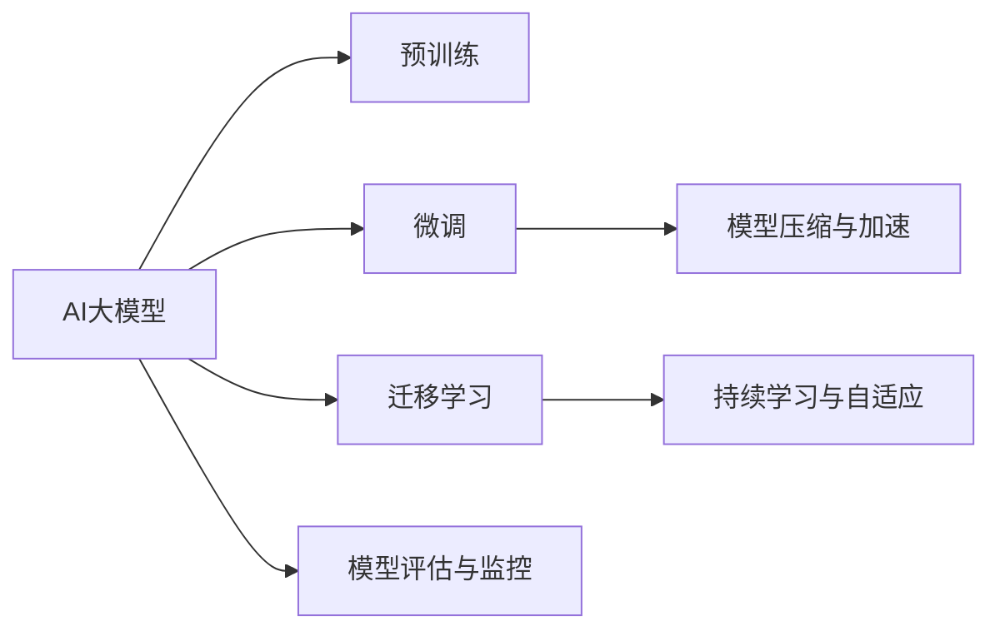

                 

# AI大模型创业：如何抓住未来机遇？

## 1. 背景介绍

### 1.1 问题由来

在过去的几年里，人工智能（AI）和大数据技术迅猛发展，深刻改变了我们的生产和生活方式。特别是随着深度学习模型的应用日渐成熟，AI大模型（如GPT-3、BERT等）成为了行业和企业关注的焦点。大模型的通用性强、学习能力强大，被广泛用于自然语言处理（NLP）、计算机视觉（CV）、推荐系统、医疗诊断等多个领域。然而，尽管大模型的能力强大，但在实际应用中，尤其是在创业企业中，如何有效地利用这些模型，并且成功将其转化为商业价值，仍然是一个巨大的挑战。

### 1.2 问题核心关键点

1. **模型选择与适配**：不同的AI大模型在特定任务上的表现不同，企业需要根据自身需求选择合适的模型。此外，模型的预训练架构、训练数据和训练策略也需要进行适配，以提高性能。
2. **数据与标注**：高质量的数据和标注是训练AI大模型的基础。创业企业往往面临数据获取难、标注成本高的问题。
3. **开发效率与成本控制**：大模型的训练和优化需要大量资源，创业企业需要高效开发流程和成本控制策略。
4. **模型部署与优化**：将训练好的模型部署到实际应用中，需要进行模型压缩、推理加速等优化，以适应不同的应用场景。
5. **业务场景适配**：AI大模型需要适配具体的业务场景，包括需求分析、系统架构设计等。

### 1.3 问题研究意义

AI大模型的商业应用前景广阔，但创业企业需要面临众多挑战。如果能够有效解决这些问题，不仅能够提升AI模型的商业价值，还能推动AI技术的普及和应用。以下将通过详细讨论AI大模型创业中的一些关键问题，提供解决方案和建议，帮助创业企业抓住未来机遇。

## 2. 核心概念与联系

### 2.1 核心概念概述

要理解AI大模型创业，首先需要了解以下几个核心概念：

1. **AI大模型**：指基于深度学习模型（如Transformer、BERT等）构建的大规模、高性能的通用模型。这些模型通常基于大规模无标注数据预训练，能够处理各种复杂的NLP和CV任务。
2. **微调与迁移学习**：微调是指在预训练模型基础上，通过有监督数据进行微调，以适应特定任务；迁移学习是指将模型在不同任务之间的知识迁移，提高模型在新任务上的性能。
3. **模型压缩与加速**：由于大模型的参数量庞大，为了提高推理速度和减少内存占用，需要对模型进行压缩和加速。
4. **模型评估与监控**：在模型部署到实际应用中后，需要对模型进行持续评估和监控，以确保其性能和稳定性。
5. **持续学习与自适应**：AI大模型需要具备持续学习能力，能够适应数据分布的变化，避免过拟合和遗忘。

这些概念通过以下Mermaid流程图进行了可视化：



## 3. 核心算法原理 & 具体操作步骤

### 3.1 算法原理概述

AI大模型创业的核心在于如何有效地利用预训练模型的能力，结合特定任务需求，构建高效的应用模型。基于监督学习的微调方法是当前主流的方式，其核心原理是通过有监督数据对预训练模型进行微调，使其适应特定任务。以下是详细的算法原理：

1. **预训练模型**：在无标注大规模数据上预训练一个通用的AI大模型。
2. **微调**：在有标注数据上微调模型，使其适应特定任务。微调过程通常包括选择合适的损失函数、优化器、学习率等超参数。
3. **迁移学习**：将预训练模型在不同任务之间进行迁移，以提高模型在新任务上的性能。

### 3.2 算法步骤详解

基于监督学习的AI大模型微调步骤如下：

1. **数据准备**：收集标注数据集，并划分训练集、验证集和测试集。
2. **模型选择与适配**：选择适合的AI大模型，并根据任务需求进行适配，如添加任务特定的输出层和损失函数。
3. **设置超参数**：选择合适的优化器、学习率、批大小等超参数。
4. **模型训练**：在训练集上训练模型，并在验证集上进行验证。
5. **模型评估与优化**：在测试集上评估模型性能，并根据评估结果进行优化。

### 3.3 算法优缺点

AI大模型微调具有以下优点：

1. **高效性**：预训练模型能够快速适应新任务，提升模型性能。
2. **泛化能力**：通过迁移学习，模型可以在不同任务之间进行知识迁移，提高模型泛化能力。

但同时，也存在一些缺点：

1. **数据依赖**：微调需要高质量的标注数据，数据获取和标注成本较高。
2. **过拟合风险**：模型容易在特定任务上过度拟合，导致性能下降。
3. **计算资源需求高**：大模型的训练和优化需要大量计算资源。

### 3.4 算法应用领域

AI大模型微调技术在多个领域得到了广泛应用：

1. **自然语言处理（NLP）**：用于文本分类、情感分析、机器翻译、对话系统等。
2. **计算机视觉（CV）**：用于图像分类、目标检测、图像生成等。
3. **推荐系统**：用于商品推荐、个性化内容推荐等。
4. **医疗诊断**：用于疾病诊断、医学图像分析等。
5. **金融分析**：用于股票预测、信用评估等。

## 4. 数学模型和公式 & 详细讲解

### 4.1 数学模型构建

假设AI大模型的预训练架构为Transformer，其参数为$\theta$。在特定任务上，模型需要输出$\hat{y}$，并满足损失函数$\mathcal{L}$。模型在训练集上的损失函数可以表示为：

$$
\mathcal{L}(\theta) = \frac{1}{N}\sum_{i=1}^{N} \ell(y_i, \hat{y}_i)
$$

其中，$y_i$为真实标签，$\hat{y}_i$为模型预测标签，$\ell$为损失函数，如交叉熵损失。

### 4.2 公式推导过程

以文本分类任务为例，假设模型的输出为$\hat{y}=\sigma(z)$，其中$z$为模型的中间表示，$\sigma$为激活函数。则损失函数可以表示为：

$$
\mathcal{L}(\theta) = \frac{1}{N}\sum_{i=1}^{N} \ell(y_i, \sigma(z_i))
$$

对于交叉熵损失，有：

$$
\ell(y_i, \sigma(z_i)) = -y_i\log\sigma(z_i) - (1-y_i)\log(1-\sigma(z_i))
$$

通过反向传播算法，可以计算模型参数$\theta$的梯度，并更新模型参数：

$$
\theta \leftarrow \theta - \eta \nabla_{\theta}\mathcal{L}(\theta)
$$

其中，$\eta$为学习率，$\nabla_{\theta}\mathcal{L}(\theta)$为模型损失对参数的梯度。

### 4.3 案例分析与讲解

以下以图像分类为例，展示模型训练的过程。假设模型使用卷积神经网络（CNN），其输出为$z$，输入为$x$，则损失函数可以表示为：

$$
\mathcal{L}(\theta) = \frac{1}{N}\sum_{i=1}^{N} \ell(y_i, \sigma(z_i))
$$

其中，$y_i$为真实标签，$\sigma$为激活函数。模型在训练集上的损失函数可以表示为：

$$
\mathcal{L}(\theta) = \frac{1}{N}\sum_{i=1}^{N} -y_i\log\sigma(z_i)
$$

通过反向传播算法，可以计算模型参数$\theta$的梯度，并更新模型参数：

$$
\theta \leftarrow \theta - \eta \nabla_{\theta}\mathcal{L}(\theta)
$$

## 5. 项目实践：代码实例和详细解释说明

### 5.1 开发环境搭建

在进行AI大模型创业项目开发前，需要先搭建好开发环境。以下是基于Python和PyTorch的开发环境配置流程：

1. 安装Anaconda：从官网下载并安装Anaconda，用于创建独立的Python环境。
2. 创建并激活虚拟环境：
```bash
conda create -n pytorch-env python=3.8 
conda activate pytorch-env
```

3. 安装PyTorch：根据CUDA版本，从官网获取对应的安装命令。例如：
```bash
conda install pytorch torchvision torchaudio cudatoolkit=11.1 -c pytorch -c conda-forge
```

4. 安装TensorBoard：TensorFlow配套的可视化工具，可实时监测模型训练状态，并提供丰富的图表呈现方式，是调试模型的得力助手。
```bash
pip install tensorboard
```

5. 安装模型库：安装HuggingFace的Transformers库，以及TensorFlow等辅助库。
```bash
pip install transformers tensorflow
```

完成上述步骤后，即可在`pytorch-env`环境中开始AI大模型创业项目的开发。

### 5.2 源代码详细实现

以下是使用HuggingFace的Transformers库进行图像分类任务的代码实现：

```python
from transformers import AutoModelForImageClassification
from transformers import AdamW
from transformers import DataCollatorWithPadding

# 加载预训练模型
model = AutoModelForImageClassification.from_pretrained('resnet50')

# 加载优化器
optimizer = AdamW(model.parameters(), lr=2e-5)

# 加载数据集
train_dataset = ...
val_dataset = ...

# 数据增强
train_dataset = DataCollatorWithPadding(train_dataset)

# 模型训练
for epoch in range(num_epochs):
    train_loss = train(model, optimizer, train_dataset)
    val_loss = evaluate(model, val_dataset)

    if val_loss < best_loss:
        best_loss = val_loss
        best_model = model

# 模型保存
torch.save(best_model.state_dict(), 'best_model.pth')

def train(model, optimizer, dataset):
    # 训练代码
    ...

def evaluate(model, dataset):
    # 评估代码
    ...
```

### 5.3 代码解读与分析

**模型加载与优化器设置**：使用HuggingFace提供的`AutoModelForImageClassification`加载预训练模型，并使用AdamW优化器进行模型参数的更新。

**数据集加载与增强**：使用`DataCollatorWithPadding`对数据进行批量处理和增强，确保数据的多样性和丰富性。

**模型训练与评估**：在每个epoch结束后，计算训练集和验证集的损失，并进行模型保存和性能评估。训练函数和评估函数的具体实现需要根据具体任务进行调整。

### 5.4 运行结果展示

在训练过程中，可以使用TensorBoard可视化模型的训练进度和性能指标。例如，可以使用TensorBoard绘制训练集和验证集的损失曲线、精度曲线等，以评估模型的训练效果和优化策略的合理性。

## 6. 实际应用场景

### 6.1 智能安防

AI大模型在智能安防领域具有广泛应用前景。通过智能摄像头和视频监控设备，AI大模型可以实时分析视频流中的异常行为，及时发现并预警潜在的安全威胁。例如，可以对视频中的行人行为进行实时识别和分类，自动识别出潜在的暴力、盗窃等行为，并及时向安保人员发出警报。

### 6.2 零售商超

在零售商超领域，AI大模型可以用于商品推荐、库存管理、顾客行为分析等。例如，通过对顾客的购物行为进行分析，模型可以推荐顾客可能感兴趣的商品，提高顾客的购买转化率。同时，通过预测商品库存，可以有效避免断货和积压，提高供应链管理效率。

### 6.3 金融投资

在金融投资领域，AI大模型可以用于股票预测、风险评估、信用评分等。例如，通过分析市场数据和新闻，模型可以预测股票价格的走势，帮助投资者做出明智的投资决策。同时，通过对企业财务数据进行分析，模型可以对企业的信用风险进行评估，提供更为准确的信用评分。

### 6.4 未来应用展望

未来，AI大模型将在更多领域得到应用，为各行各业带来变革性影响。随着技术的不断进步，AI大模型的应用场景将更加多样化，推动智能技术的普及和应用。

## 7. 工具和资源推荐

### 7.1 学习资源推荐

以下是一些优质的AI大模型创业学习资源：

1. **深度学习课程**：如斯坦福大学的CS231n《卷积神经网络》课程，提供了丰富的图像分类和物体检测课程资源。
2. **模型库和框架**：如TensorFlow、PyTorch、HuggingFace等，提供了丰富的模型和框架资源。
3. **论文和报告**：如arXiv上的最新研究论文，提供了最新的AI大模型研究进展和应用案例。
4. **在线课程**：如Coursera上的深度学习课程，提供了系统的深度学习课程资源。

### 7.2 开发工具推荐

以下是一些常用的AI大模型创业开发工具：

1. **深度学习框架**：如TensorFlow、PyTorch、MXNet等，提供了丰富的深度学习框架资源。
2. **模型压缩与加速**：如Quantization Toolkit、TensorFlow Lite等，提供了模型压缩和加速工具。
3. **可视化工具**：如TensorBoard、Weights & Biases等，提供了模型训练和调试的可视化工具。
4. **容器化与自动化**：如Docker、Kubernetes等，提供了模型部署和管理的容器化与自动化工具。

### 7.3 相关论文推荐

以下是几篇AI大模型创业的经典论文：

1. **《ImageNet Classification with Deep Convolutional Neural Networks》**：AlexNet模型在ImageNet数据集上取得了巨大的成功，推动了深度学习的发展。
2. **《Google's Neural Machine Translation System: Bridging the Gap Between Human and Machine Translation》**：Google的神经机器翻译系统，展示了深度学习在机器翻译中的应用潜力。
3. **《BERT: Pre-training of Deep Bidirectional Transformers for Language Understanding》**：BERT模型在自然语言处理任务中取得了优异的性能，推动了预训练模型的研究。

## 8. 总结：未来发展趋势与挑战

### 8.1 研究成果总结

AI大模型创业的不断发展，为AI技术在各个领域的落地应用提供了强大的支持。通过深入研究和探索，AI大模型创业项目有望在多个领域取得突破性进展。

### 8.2 未来发展趋势

未来，AI大模型创业将呈现以下几个发展趋势：

1. **多模态融合**：AI大模型将融合多种模态信息，如视觉、语音、文本等，提升模型在复杂场景下的应用能力。
2. **自适应与可解释**：AI大模型将具备自适应和可解释能力，能够根据环境变化进行自我优化，并提供模型推理的详细解释。
3. **模型集成与融合**：AI大模型将通过模型集成和融合技术，实现多模型协同工作，提升模型的整体性能。
4. **跨领域知识迁移**：AI大模型将具备跨领域知识迁移能力，能够在不同领域之间进行知识迁移，提升模型的泛化能力。
5. **联邦学习与隐私保护**：AI大模型将采用联邦学习等隐私保护技术，实现数据分布式存储和模型分布式训练，提升模型的安全性和隐私保护水平。

### 8.3 面临的挑战

尽管AI大模型创业发展迅速，但也面临诸多挑战：

1. **数据获取与标注**：高质量数据和标注成本高，是创业企业面临的最大挑战之一。
2. **模型训练与优化**：模型训练和优化需要大量计算资源，创业企业需要优化资源使用和成本控制。
3. **模型部署与维护**：模型部署到实际应用中，需要进行模型压缩、推理加速等优化，以适应不同的应用场景。
4. **模型鲁棒性与公平性**：模型在实际应用中需要具备鲁棒性和公平性，避免过拟合和偏见。
5. **用户隐私与安全**：AI大模型需要保证用户隐私和安全，避免数据泄露和滥用。

### 8.4 研究展望

未来，AI大模型创业的研究需要进一步解决以下问题：

1. **模型压缩与优化**：进一步优化模型压缩和推理加速技术，提升模型在实际应用中的效率。
2. **数据隐私保护**：采用联邦学习等隐私保护技术，保护用户隐私和数据安全。
3. **模型公平性与鲁棒性**：进一步研究模型公平性与鲁棒性，避免过拟合和偏见。
4. **跨领域知识迁移**：研究跨领域知识迁移方法，提升模型在多个领域的应用能力。
5. **自适应与可解释**：研究自适应与可解释技术，提升模型的自我优化能力和推理解释能力。

## 9. 附录：常见问题与解答

### Q1：AI大模型创业项目需要哪些关键资源？

A：AI大模型创业项目需要以下关键资源：

1. **高质量数据与标注**：高质量数据和标注是训练AI大模型的基础。
2. **高性能计算资源**：AI大模型的训练和优化需要大量计算资源。
3. **技术团队与人才**：AI大模型创业项目需要具有丰富技术经验的技术团队和人才。
4. **业务场景理解**：创业项目需要深入理解目标业务场景，并根据实际需求进行模型优化。
5. **模型部署与维护**：模型部署到实际应用中，需要进行模型压缩、推理加速等优化，以适应不同的应用场景。

### Q2：AI大模型创业项目如何进行有效的资源利用？

A：AI大模型创业项目可以通过以下方式进行有效的资源利用：

1. **数据增强与预处理**：使用数据增强和预处理技术，提高数据的多样性和丰富性，减少数据获取和标注成本。
2. **模型压缩与优化**：采用模型压缩和优化技术，提高模型的推理速度和效率，减少计算资源消耗。
3. **分布式计算**：采用分布式计算技术，提高计算资源的利用效率，降低计算成本。
4. **自适应学习**：采用自适应学习技术，提高模型的泛化能力和鲁棒性，减少计算资源消耗。
5. **模型集成与融合**：采用模型集成和融合技术，提升模型的整体性能，减少计算资源消耗。

### Q3：AI大模型创业项目如何进行持续学习和模型优化？

A：AI大模型创业项目可以通过以下方式进行持续学习和模型优化：

1. **在线学习与迁移学习**：采用在线学习与迁移学习技术，利用新的数据和知识进行持续学习，提高模型的泛化能力和鲁棒性。
2. **自适应与动态调整**：采用自适应与动态调整技术，根据环境变化和业务需求进行模型优化和调整，提升模型的适应能力。
3. **模型评估与监控**：采用模型评估与监控技术，实时监测模型性能和状态，及时发现和解决模型问题。
4. **反馈与迭代优化**：采用反馈与迭代优化技术，根据实际应用中的反馈信息，进行模型优化和调整，提升模型性能。
5. **多模态融合与协同学习**：采用多模态融合与协同学习技术，将不同模态的信息进行融合，提升模型的综合应用能力。

### Q4：AI大模型创业项目如何实现跨领域知识迁移？

A：AI大模型创业项目可以通过以下方式实现跨领域知识迁移：

1. **领域知识抽取与融合**：通过领域知识抽取与融合技术，将不同领域的知识进行整合，提升模型的泛化能力。
2. **多模态融合与协同学习**：采用多模态融合与协同学习技术，将不同模态的信息进行融合，提升模型的综合应用能力。
3. **模型微调与适配**：采用模型微调与适配技术，将预训练模型进行微调，适应不同领域的特定任务。
4. **知识图谱与规则库**：采用知识图谱与规则库，将先验知识与神经网络模型进行融合，提升模型的知识整合能力。
5. **数据增强与预处理**：采用数据增强与预处理技术，提高数据的多样性和丰富性，减少数据获取和标注成本。

---

作者：禅与计算机程序设计艺术 / Zen and the Art of Computer Programming

