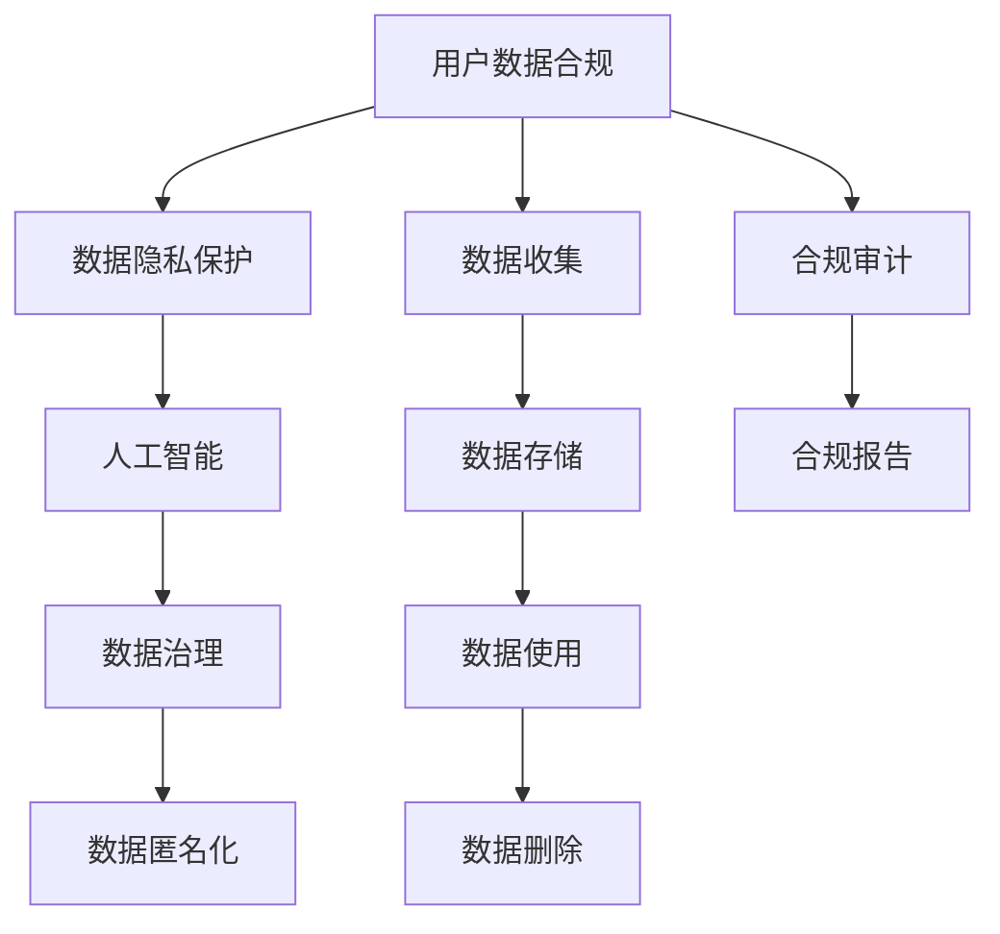

                 

## 1. 背景介绍

近年来，随着电子商务的飞速发展，用户数据的安全合规管理已经成为电商企业必须面对的重大挑战。在国家法律法规的监管日益严格的背景下，如何合规、高效地管理用户数据，不仅关系到企业的业务运营，更是关乎企业的生存与发展。AI技术在这一领域提供了全新的解决方案，通过智能分析和自动化处理，不仅降低了合规管理的成本，还提高了数据的利用效率，让企业在享受数据红利的同时，能够从容应对合规挑战。

## 2. 核心概念与联系

### 2.1 核心概念概述

在探讨AI如何帮助电商企业进行用户数据合规管理时，我们需要了解以下核心概念：

- **用户数据合规**：指的是企业在收集、使用和存储用户数据时，必须遵循相关法律法规，保护用户隐私，避免数据滥用。
- **数据隐私保护**：通过技术手段，保护用户数据不被未授权访问和使用，防止数据泄露和滥用。
- **人工智能**：利用算法和模型，自动分析、处理和应用大量数据，提供智能化的决策支持。
- **数据治理**：通过制定数据管理策略和流程，确保数据的完整性、一致性和安全性。
- **数据匿名化**：将个人标识信息从数据中移除，保护个人隐私。

这些概念之间的联系可以通过以下Mermaid流程图来展示：



这个流程图展示了一个完整的数据流，从数据收集到使用，再到删除和审计，AI在其中扮演了重要角色。

## 3. 核心算法原理 & 具体操作步骤

### 3.1 算法原理概述

AI在用户数据合规管理中的应用，主要基于以下算法原理：

- **数据分类与标签化**：使用AI算法对用户数据进行分类，并打上标签，以便后续管理和合规审查。
- **异常检测**：通过机器学习模型，检测数据集中的异常行为或模式，及时发现数据泄露或滥用风险。
- **数据匿名化**：利用AI技术，对数据进行去标识化处理，保障数据隐私。
- **数据加密**：使用AI算法对敏感数据进行加密处理，防止未授权访问。
- **合规审计**：通过AI对数据使用情况进行审计，确保符合法律法规要求。

### 3.2 算法步骤详解

以数据分类与标签化为示例，以下是具体的算法步骤：

1. **数据收集与预处理**：收集用户数据，并进行清洗、去重等预处理工作。
2. **特征提取**：使用特征提取算法，将数据转换为可用于分类的向量。
3. **分类模型训练**：选择适合的分类算法（如决策树、随机森林、神经网络等），并在标注数据上训练模型。
4. **模型评估与调优**：使用交叉验证等方法评估模型性能，并进行调优。
5. **数据分类与标签化**：将新的数据输入训练好的模型，得到分类结果和对应的标签。

### 3.3 算法优缺点

- **优点**：
  - **自动化**：AI算法可以自动化地处理大量数据，节省人力成本。
  - **高效性**：AI算法处理数据速度快，能够实时监控和分析数据。
  - **精准性**：AI算法能够精确识别数据中的异常和模式。
  - **适应性强**：AI算法可以动态调整，适应数据的变化和新增。

- **缺点**：
  - **依赖数据质量**：AI算法的性能高度依赖于数据的质量和量，数据不完整或噪声过多会导致模型失效。
  - **黑箱性质**：AI算法的决策过程复杂，难以解释，不利于合规审查。
  - **技术门槛高**：AI算法的开发和维护需要专业的知识和技能。

### 3.4 算法应用领域

AI在用户数据合规管理中的应用领域包括但不限于：

- **用户行为分析**：分析用户行为模式，发现潜在的滥用行为。
- **数据安全监控**：监控数据访问和使用情况，防止未授权访问。
- **隐私保护**：对敏感数据进行去标识化和加密，保障用户隐私。
- **合规审查**：自动化合规审计，生成合规报告，减少人工审查工作量。
- **客户服务**：通过AI分析客户反馈，改进服务质量，同时保护用户隐私。

## 4. 数学模型和公式 & 详细讲解

### 4.1 数学模型构建

假设我们有一组用户数据 $D = \{(x_i, y_i)\}_{i=1}^N$，其中 $x_i$ 是用户行为特征向量，$y_i$ 是相应的分类标签（如合法或非法使用）。我们的目标是构建一个分类器 $f(x)$，使得对于新数据 $x'$，可以预测其标签 $y'$。

形式化地，构建一个二分类器的目标是最小化损失函数 $L$：

$$
L(f) = \frac{1}{N} \sum_{i=1}^N \ell(f(x_i), y_i)
$$

其中 $\ell$ 是损失函数，如交叉熵损失。

### 4.2 公式推导过程

以随机森林为例，其基本原理如下：

1. **数据分割**：将数据集 $D$ 分成 $K$ 个子集 $D_k$，其中每个子集包含 $N_k$ 个样本。
2. **特征选择**：从 $D_k$ 中随机选择 $m$ 个特征，构成特征集合 $F_k$。
3. **决策树训练**：在 $F_k$ 上构建一棵决策树 $T_k$。
4. **模型集成**：通过投票或平均等方法，将所有 $K$ 棵树的预测结果集成为最终的分类结果。

### 4.3 案例分析与讲解

假设我们有一组用户的购物记录，目标是判断哪些记录可能是非法使用的。我们可以使用随机森林算法进行分类，步骤如下：

1. **数据预处理**：将购物记录转换为特征向量，如购买金额、购买时间、购买频率等。
2. **特征选择**：从中选择对分类有帮助的特征，如购买金额、购买频率等。
3. **模型训练**：在标注数据上训练随机森林模型。
4. **模型评估**：使用交叉验证评估模型性能。
5. **分类预测**：将新的购物记录输入训练好的模型，得到分类结果。

## 5. 项目实践：代码实例和详细解释说明

### 5.1 开发环境搭建

以下是使用Python进行PyTorch开发的环境配置流程：

1. 安装Anaconda：从官网下载并安装Anaconda，用于创建独立的Python环境。
2. 创建并激活虚拟环境：
```bash
conda create -n pytorch-env python=3.8 
conda activate pytorch-env
```

3. 安装PyTorch：根据CUDA版本，从官网获取对应的安装命令。例如：
```bash
conda install pytorch torchvision torchaudio cudatoolkit=11.1 -c pytorch -c conda-forge
```

4. 安装TensorFlow：
```bash
pip install tensorflow
```

5. 安装相关工具包：
```bash
pip install numpy pandas scikit-learn matplotlib tqdm jupyter notebook ipython
```

完成上述步骤后，即可在`pytorch-env`环境中开始项目实践。

### 5.2 源代码详细实现

以下是使用PyTorch实现数据分类与标签化的代码：

```python
import torch
from sklearn.model_selection import train_test_split
from sklearn.ensemble import RandomForestClassifier
from sklearn.metrics import accuracy_score
from sklearn.preprocessing import StandardScaler

# 假设数据集已加载，并分为训练集和测试集
train_data, test_data = train_test_split(data, test_size=0.2, random_state=42)

# 特征提取
X_train = train_data.drop('label', axis=1)
y_train = train_data['label']
X_test = test_data.drop('label', axis=1)
y_test = test_data['label']

# 标准化处理
scaler = StandardScaler()
X_train = scaler.fit_transform(X_train)
X_test = scaler.transform(X_test)

# 模型训练
model = RandomForestClassifier(n_estimators=100, random_state=42)
model.fit(X_train, y_train)

# 模型评估
y_pred = model.predict(X_test)
accuracy = accuracy_score(y_test, y_pred)
print(f"Accuracy: {accuracy}")

# 数据分类与标签化
X_new = [[1, 2, 3], [4, 5, 6]]
X_new = scaler.transform(X_new)
y_pred_new = model.predict(X_new)
print(f"Predicted labels: {y_pred_new}")
```

### 5.3 代码解读与分析

以上代码实现了随机森林模型对数据集 $D$ 的分类与标签化。具体步骤如下：

1. **数据分割**：使用 `train_test_split` 方法将数据集分为训练集和测试集。
2. **特征提取**：从数据中提取特征向量 $X$，并使用 `StandardScaler` 对特征进行标准化处理。
3. **模型训练**：在训练集上训练随机森林模型。
4. **模型评估**：使用测试集评估模型性能，输出准确率。
5. **数据分类与标签化**：对新数据进行特征提取和标准化处理，再输入模型进行分类预测。

## 6. 实际应用场景

### 6.1 智能客服系统

智能客服系统可以通过AI技术对用户的行为数据进行分析，识别出潜在的非法使用行为，及时采取措施。例如，如果发现用户在短时间内频繁发起不合法请求，系统可以自动拦截或提醒客服人员注意。

### 6.2 数据安全监控

电商平台需要实时监控数据访问和使用情况，防止未授权访问和数据泄露。AI技术可以自动化地检测异常行为，如频繁的登录尝试、数据文件访问等，及时发现并报警。

### 6.3 用户隐私保护

在收集用户数据时，可以使用AI技术对数据进行去标识化处理，防止用户个人信息被滥用。例如，将用户ID替换为匿名标识符，保障用户隐私。

### 6.4 合规审查

通过AI自动化地进行合规审计，生成合规报告，定期对数据使用情况进行审查，确保符合法律法规要求。

### 6.5 客户服务优化

AI技术可以分析客户反馈和行为数据，优化客户服务流程，同时保障用户隐私。例如，自动回复常见问题，减少人工客服工作量。

## 7. 工具和资源推荐

### 7.1 学习资源推荐

以下是几款推荐的AI学习资源：

1. **TensorFlow官网**：提供丰富的教程、文档和代码示例，适合初学者和进阶学习者。
2. **PyTorch官网**：最新的深度学习框架，拥有活跃的社区支持。
3. **Kaggle**：数据科学竞赛平台，提供大量公开数据集和代码示例，适合实战练习。
4. **Coursera**：提供AI相关的在线课程，由全球顶尖大学和公司提供。
5. **Google AI Lab**：Google AI的研究机构，提供大量AI研究论文和开源代码。

通过这些资源的学习实践，相信你能系统掌握AI技术，并应用于电商企业的数据合规管理。

### 7.2 开发工具推荐

以下是几款推荐的AI开发工具：

1. **Jupyter Notebook**：Python代码的交互式开发环境，适合数据探索和模型验证。
2. **TensorBoard**：TensorFlow配套的可视化工具，实时监测模型训练状态，提供丰富的图表展示。
3. **Weights & Biases**：模型训练的实验跟踪工具，记录和可视化模型训练过程中的各项指标。
4. **Hugging Face Transformers库**：提供了众多预训练模型和微调样例代码，适合快速迭代研究。

这些工具能够显著提升AI开发效率，加速模型迭代和验证。

### 7.3 相关论文推荐

以下是几篇AI技术在用户数据合规管理应用的奠基性论文：

1. **Anomaly Detection in Network Intrusion Using Deep Learning**：提出深度学习模型在网络入侵检测中的应用，提高异常检测的准确率。
2. **Data Privacy and Statistical Disclosure**：探讨数据隐私保护的理论和方法，如差分隐私等。
3. **Secure Computation and Homomorphic Encryption**：介绍安全计算和同态加密技术，保障数据在计算过程中的隐私。
4. **Robust and Privacy-Preserving Data Analysis**：研究如何在数据分析过程中保护隐私，如联邦学习等。
5. **A Survey on Privacy Preserving Machine Learning Techniques**：综述隐私保护机器学习的最新进展，提供多种方法和技术。

这些论文代表了大数据隐私保护和AI应用的最新发展，有助于深入理解相关技术。

## 8. 总结：未来发展趋势与挑战

### 8.1 研究成果总结

本文对AI如何帮助电商企业进行用户数据合规管理进行了全面系统的介绍。具体包括以下几个方面：

- **算法原理**：介绍了数据分类与标签化、异常检测、数据匿名化和加密等核心算法。
- **操作步骤**：详细讲解了数据收集、预处理、模型训练、评估和预测等步骤。
- **工具资源**：推荐了Python、TensorFlow、PyTorch等开发工具和学习资源，帮助读者快速上手。

通过本文的系统梳理，可以看到，AI在电商企业数据合规管理中的应用前景广阔，不仅能够自动化处理数据，还能保障用户隐私，提高合规审计的效率。

### 8.2 未来发展趋势

展望未来，AI在用户数据合规管理中的应用将呈现以下几个发展趋势：

1. **自动化程度提升**：AI算法将更加智能和自动化，能够更高效地处理和分析数据，降低人工干预。
2. **多模态数据融合**：AI技术将能够处理多种类型的数据，如图像、语音、文本等，实现多模态数据融合，提供更全面的分析能力。
3. **隐私保护技术创新**：AI将结合差分隐私、同态加密等技术，进一步提升数据隐私保护能力。
4. **联邦学习普及**：联邦学习等技术将使得数据隐私保护和模型训练能够在不共享数据的情况下进行，提高数据利用效率。
5. **合规审查智能化**：AI将能够自动进行合规审计，生成合规报告，帮助企业及时发现和纠正违规行为。

### 8.3 面临的挑战

尽管AI在电商企业数据合规管理中展现出巨大的潜力，但仍面临以下挑战：

1. **数据质量问题**：AI算法的性能高度依赖于数据质量，数据不完整或不一致会导致模型失效。
2. **模型可解释性**：AI模型的决策过程复杂，难以解释，不利于合规审查。
3. **技术门槛高**：AI技术的开发和维护需要专业知识和技能，一般企业难以自行实现。
4. **法律法规复杂**：各国法律法规各异，AI模型需要适应不同地区的要求，增加了复杂性。
5. **隐私保护风险**：在提升数据利用效率的同时，可能增加隐私泄露风险。

### 8.4 研究展望

未来，AI在电商企业数据合规管理中的应用还需进一步突破：

1. **数据质量提升**：开发更高效的数据清洗和预处理方法，保障数据质量。
2. **模型可解释性增强**：研究更可解释的AI模型，如透明模型、公平模型等。
3. **技术普及和标准化**：推广AI技术的普及应用，制定标准化的合规指南和规范。
4. **法律法规合规性**：加强AI技术在法律法规中的应用，确保合规审查的准确性和可靠性。
5. **隐私保护技术创新**：研究新的隐私保护技术，如隐私增强学习、联邦学习等。

这些方向的研究将推动AI在电商企业数据合规管理中的应用更加广泛和深入，为企业的可持续发展提供强有力的技术支持。

## 9. 附录：常见问题与解答

### Q1: AI在电商企业数据合规管理中主要解决哪些问题？

A: AI在电商企业数据合规管理中主要解决以下问题：
- **数据分类与标签化**：自动对数据进行分类和标注，提高数据管理的效率和准确性。
- **异常检测**：自动检测数据中的异常行为，及时发现和防止数据滥用。
- **数据匿名化**：对敏感数据进行去标识化处理，保障用户隐私。
- **数据加密**：对敏感数据进行加密处理，防止未授权访问。
- **合规审计**：自动生成合规报告，定期审查数据使用情况，确保符合法律法规要求。

### Q2: 电商企业在使用AI进行数据合规管理时，需要注意哪些技术问题？

A: 电商企业在使用AI进行数据合规管理时，需要注意以下技术问题：
- **数据质量**：保障数据的完整性、一致性和准确性，避免模型失效。
- **模型可解释性**：确保AI模型的决策过程透明，便于合规审查。
- **技术门槛**：选择合适的技术和工具，确保技术团队具备相应的知识和技能。
- **法律法规合规性**：遵循不同地区的法律法规，确保数据使用符合法律要求。
- **隐私保护**：在提升数据利用效率的同时，保障用户隐私。

### Q3: AI在电商企业数据合规管理中的优势和局限性是什么？

A: AI在电商企业数据合规管理中的优势和局限性如下：
- **优势**：
  - **自动化**：AI算法能够自动化处理大量数据，节省人力成本。
  - **高效性**：AI算法处理数据速度快，能够实时监测和分析数据。
  - **精准性**：AI算法能够精确识别数据中的异常和模式。
- **局限性**：
  - **依赖数据质量**：AI算法的性能高度依赖于数据的质量和量，数据不完整或噪声过多会导致模型失效。
  - **黑箱性质**：AI算法的决策过程复杂，难以解释，不利于合规审查。
  - **技术门槛高**：AI算法的开发和维护需要专业的知识和技能。

### Q4: 如何应对AI在电商企业数据合规管理中面临的挑战？

A: 应对AI在电商企业数据合规管理中面临的挑战，可以采取以下措施：
- **数据质量控制**：开发更高效的数据清洗和预处理方法，保障数据质量。
- **模型可解释性增强**：研究更可解释的AI模型，如透明模型、公平模型等。
- **技术普及和标准化**：推广AI技术的普及应用，制定标准化的合规指南和规范。
- **法律法规合规性**：加强AI技术在法律法规中的应用，确保合规审查的准确性和可靠性。
- **隐私保护技术创新**：研究新的隐私保护技术，如隐私增强学习、联邦学习等。

### Q5: AI在电商企业数据合规管理中的应用前景是什么？

A: AI在电商企业数据合规管理中的应用前景广阔，主要体现在以下几个方面：
- **自动化和高效性**：AI能够自动化处理大量数据，提升合规管理的效率。
- **精准和智能性**：AI算法能够精准识别异常行为，保障数据安全。
- **隐私保护和合规审查**：AI技术能够保护用户隐私，自动生成合规报告，提高合规审查的效率。
- **技术普及和标准化**：AI技术的普及将推动数据合规管理的标准化和规范化，提升企业的竞争力。

### Q6: 未来AI在电商企业数据合规管理中的应用方向是什么？

A: 未来AI在电商企业数据合规管理中的应用方向如下：
- **多模态数据融合**：AI技术能够处理多种类型的数据，如图像、语音、文本等，实现多模态数据融合，提供更全面的分析能力。
- **隐私保护技术创新**：AI将结合差分隐私、同态加密等技术，进一步提升数据隐私保护能力。
- **联邦学习普及**：联邦学习等技术将使得数据隐私保护和模型训练能够在不共享数据的情况下进行，提高数据利用效率。
- **合规审查智能化**：AI将能够自动进行合规审计，生成合规报告，帮助企业及时发现和纠正违规行为。

### Q7: 电商企业如何利用AI技术提升数据合规管理水平？

A: 电商企业可以采取以下措施利用AI技术提升数据合规管理水平：
- **数据收集和预处理**：使用AI技术对数据进行清洗和预处理，确保数据质量。
- **异常检测和监控**：使用AI算法检测异常行为和数据泄露，及时发现并报警。
- **隐私保护和匿名化**：利用AI技术对敏感数据进行去标识化和加密处理，保障用户隐私。
- **合规审查和审计**：使用AI自动化进行合规审计，生成合规报告，确保数据使用符合法律法规要求。
- **自动化流程**：将AI技术嵌入到数据管理流程中，提高数据管理的自动化水平。

通过以上措施，电商企业能够更好地利用AI技术进行数据合规管理，保障用户隐私和数据安全，提升业务运营效率，实现可持续发展。

---

作者：禅与计算机程序设计艺术 / Zen and the Art of Computer Programming

