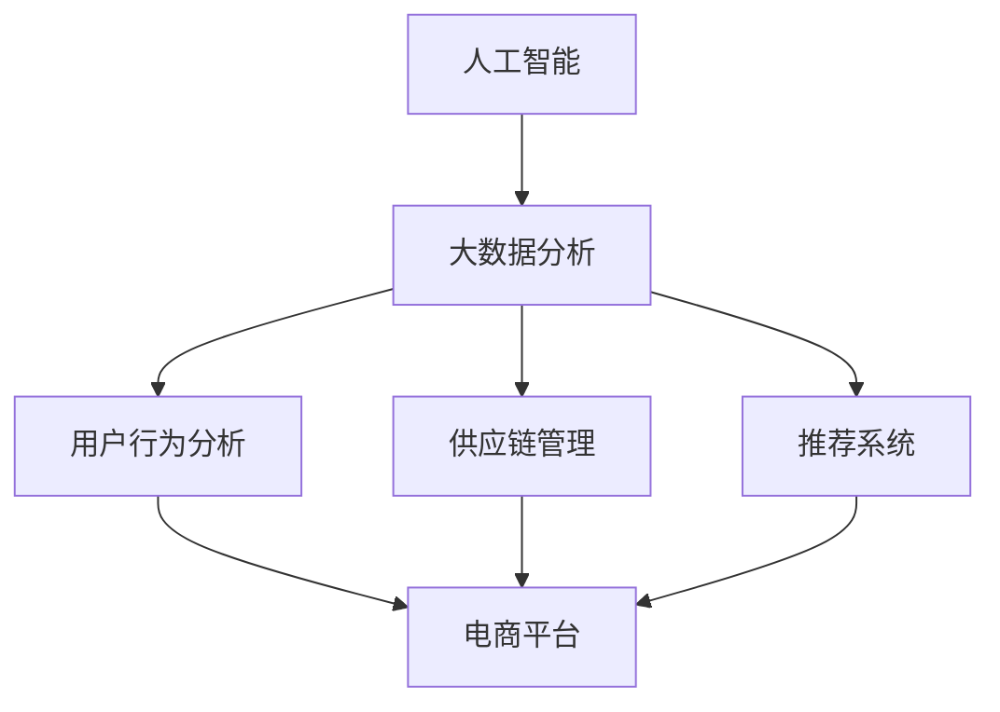

                 

# AI如何通过大数据分析优化电商运营

## 1. 背景介绍

随着互联网和电子商务的飞速发展，电商企业面临的市场竞争愈发激烈，如何在激烈的市场竞争中脱颖而出，提高用户体验和运营效率，成为了各大电商企业的首要任务。人工智能(AI)和大数据技术的崛起，为电商企业提供了强大的助力。通过AI和大数据分析，电商企业能够深度挖掘用户行为、优化供应链管理、提升客户服务等各个环节，从而在激烈的市场竞争中占据优势。

## 2. 核心概念与联系

### 2.1 核心概念概述

为更好地理解AI和大数据技术如何优化电商运营，本节将介绍几个密切相关的核心概念：

- **人工智能(AI)**：以数据和算法为基础，通过模拟人类智能行为，实现智能化决策和优化的一系列技术和应用。
- **大数据分析**：对大规模数据集进行分析和挖掘，从中提取有价值的信息和知识，用于决策支持。
- **电商运营**：指电子商务平台的操作和运营管理，包括商品管理、库存管理、订单处理、客户服务、营销推广等各个环节。
- **用户行为分析**：通过对用户的行为数据进行分析，了解用户需求和偏好，优化用户体验，提高转化率。
- **供应链管理**：通过大数据分析优化库存、物流、采购等环节，提升运营效率，降低成本。
- **推荐系统**：根据用户的历史行为和兴趣，推荐相关商品，提升用户体验和销售额。

这些核心概念之间的逻辑关系可以通过以下Mermaid流程图来展示：



这个流程图展示了大数据、人工智能和电商运营之间的关系：

1. 电商运营中涉及大量数据，通过大数据分析可以提取有价值的信息。
2. 人工智能技术通过对数据的深入学习，实现自动化和智能化的决策。
3. 用户行为分析、供应链管理和推荐系统等都是大数据分析和人工智能应用的重要场景。
4. 这些技术相互配合，共同支撑电商平台的运营效率和用户体验。

## 3. 核心算法原理 & 具体操作步骤
### 3.1 算法原理概述

AI和大数据分析在电商运营中的应用，主要通过以下几个关键算法实现：

- **机器学习算法**：通过历史数据训练模型，预测用户行为和商品需求，优化库存和广告投放策略。
- **深度学习算法**：如神经网络、卷积神经网络(CNN)、循环神经网络(RNN)等，用于处理复杂的数据特征，提升推荐系统的精准度。
- **自然语言处理(NLP)**：处理和分析用户评论、搜索词等文本数据，理解用户需求，优化营销策略。
- **强化学习算法**：通过与环境的互动，学习最优策略，优化供应链管理和库存管理。
- **时序预测算法**：如ARIMA、LSTM等，用于预测销售趋势，优化采购和库存管理。

### 3.2 算法步骤详解

AI和大数据分析在电商运营中的应用一般包括以下几个关键步骤：

**Step 1: 数据收集与预处理**

- 收集电商平台的交易数据、用户行为数据、供应链数据等，用于分析。
- 对数据进行清洗、去重、归一化等预处理，保证数据质量。

**Step 2: 特征工程**

- 从原始数据中提取有意义的特征，如用户购买历史、浏览行为、评价情感等。
- 使用PCA、LDA等降维技术，减少特征维度，提升计算效率。

**Step 3: 模型训练与优化**

- 选择合适的机器学习、深度学习或强化学习算法，如随机森林、深度神经网络、LSTM等。
- 在训练数据集上进行模型训练，调整超参数，选择最优模型。
- 使用交叉验证等方法评估模型性能，进行模型调优。

**Step 4: 模型部署与应用**

- 将训练好的模型部署到电商平台的各个环节，如推荐系统、库存管理、营销广告等。
- 实时监测模型效果，收集反馈，持续优化模型。

### 3.3 算法优缺点

AI和大数据分析在电商运营中的应用，具有以下优点：

- **效率提升**：通过自动化和智能化决策，大大提高了运营效率，减少了人工干预。
- **精准度提升**：深度学习等算法可以处理复杂数据特征，提升推荐系统和预测模型的精准度。
- **用户体验优化**：通过用户行为分析和个性化推荐，提升用户体验和满意度。

同时，这些算法也存在一定的局限性：

- **数据依赖**：模型训练和优化依赖于数据质量，数据收集和清洗成本较高。
- **模型复杂性**：深度学习等算法模型结构复杂，计算资源消耗较大。
- **解释性不足**：黑盒模型难以解释其内部决策逻辑，可能导致决策缺乏透明性。
- **安全风险**：模型可能学习到有害或偏见的信息，影响用户决策。

尽管存在这些局限性，但AI和大数据分析在电商运营中的应用已经取得了显著成效，成为电商企业提高竞争力的重要手段。

### 3.4 算法应用领域

AI和大数据分析技术在电商运营中的应用，涵盖以下几个重要领域：

- **用户行为分析**：通过对用户行为数据的分析，了解用户需求和偏好，优化商品推荐和广告投放策略。
- **推荐系统**：根据用户的历史行为和兴趣，推荐相关商品，提升用户体验和销售额。
- **库存管理**：通过预测销售趋势和需求，优化库存管理，减少库存积压和缺货风险。
- **供应链优化**：通过大数据分析，优化物流和采购策略，提升供应链效率，降低成本。
- **智能客服**：利用NLP技术，自动处理用户咨询，提升客户服务效率和满意度。
- **营销广告**：通过用户画像和行为分析，优化广告投放策略，提高广告转化率。

以上应用场景展示了AI和大数据分析在电商运营中的广泛应用，为电商企业带来了显著的效率提升和运营优化。

## 4. 数学模型和公式 & 详细讲解 & 举例说明

### 4.1 数学模型构建

本节将使用数学语言对AI和大数据分析在电商运营中的应用进行更加严格的刻画。

假设电商平台的日均订单量为 $N$，日均用户访问量为 $M$。用户的行为数据 $X$ 包括浏览时间、浏览次数、购买次数、购买金额等。库存量 $S$ 表示商品可供购买的数量。物流成本 $C$ 和销售成本 $R$ 分别为物流和销售的固定成本。模型目标为最大化日均利润 $P$。

定义模型为：

$$
P = \sum_{i=1}^N (\text{销售价格}_i \times \text{销售数量}_i - \text{销售成本}_i) - \text{物流成本} - \text{销售成本}
$$

其中 $\text{销售价格}_i$ 和 $\text{销售数量}_i$ 分别为第 $i$ 个订单的销售价格和销售数量。

### 4.2 公式推导过程

为了优化电商平台的利润，我们需要建立收入和成本的数学模型。首先，我们可以将日均订单量 $N$ 和日均用户访问量 $M$ 之间的关系建模为：

$$
N = f(M)
$$

其中 $f$ 为订单量与访问量的映射函数。然后，我们可以将每个订单的收入和成本建模为：

$$
\text{收入}_i = \text{销售价格}_i \times \text{销售数量}_i
$$

$$
\text{成本}_i = \text{物流成本}_i + \text{销售成本}_i
$$

其中 $\text{销售价格}_i$ 和 $\text{销售数量}_i$ 分别为第 $i$ 个订单的销售价格和销售数量。通过求解最大化日均利润的优化问题：

$$
\max_{P} P = \sum_{i=1}^N (\text{销售价格}_i \times \text{销售数量}_i - \text{销售成本}_i) - \text{物流成本} - \text{销售成本}
$$

可以求得最优的销售价格和销售数量，从而实现电商平台的利润最大化。

### 4.3 案例分析与讲解

以某电商平台的智能推荐系统为例，分析其基于大数据和机器学习算法的应用。假设平台的用户行为数据 $X$ 包括用户浏览时间、浏览次数、购买次数、购买金额等。通过对这些数据的分析和建模，可以训练一个预测用户购买意愿的模型。

首先，我们构建用户行为特征向量 $x$，包含用户浏览时间 $t$、浏览次数 $c$、购买次数 $b$、购买金额 $p$ 等特征。然后，我们可以利用随机森林等机器学习算法，训练一个分类模型 $y = f(x)$，预测用户是否会购买商品。

在训练完成后，平台可以使用该模型进行实时推荐。对于每个用户，系统根据其历史行为数据 $x$ 预测其购买意愿 $y$，然后选择最相关的商品进行推荐。通过这种方式，平台可以显著提升用户购买转化率，增加销售额。

## 5. 项目实践：代码实例和详细解释说明
### 5.1 开发环境搭建

在进行AI和大数据分析实践前，我们需要准备好开发环境。以下是使用Python进行TensorFlow开发的环境配置流程：

1. 安装Anaconda：从官网下载并安装Anaconda，用于创建独立的Python环境。

2. 创建并激活虚拟环境：
```bash
conda create -n tf-env python=3.8 
conda activate tf-env
```

3. 安装TensorFlow：根据CUDA版本，从官网获取对应的安装命令。例如：
```bash
conda install tensorflow -c tf -c conda-forge
```

4. 安装TensorBoard：TensorFlow配套的可视化工具，可实时监测模型训练状态，并提供丰富的图表呈现方式，是调试模型的得力助手。

5. 安装scikit-learn：用于数据预处理和特征工程等任务。

6. 安装pandas：用于数据处理和分析。

7. 安装Matplotlib：用于绘制图表。

完成上述步骤后，即可在`tf-env`环境中开始AI和大数据分析实践。

### 5.2 源代码详细实现

下面我们以某电商平台的智能推荐系统为例，给出使用TensorFlow进行用户行为分析的PyTorch代码实现。

首先，定义用户行为数据类：

```python
import pandas as pd

class UserBehavior:
    def __init__(self, file_path):
        self.data = pd.read_csv(file_path)

    def preprocess_data(self):
        # 数据预处理，包括去重、归一化等
        pass

    def feature_engineering(self):
        # 特征工程，包括特征选择、降维等
        pass

    def train_model(self):
        # 模型训练
        pass

    def predict(self, user_id):
        # 预测用户是否会购买商品
        pass
```

然后，构建训练模型：

```python
import tensorflow as tf
from tensorflow.keras.models import Sequential
from tensorflow.keras.layers import Dense, Dropout, Embedding

def build_model():
    model = Sequential()
    model.add(Embedding(input_dim=10000, output_dim=64, input_length=128))
    model.add(Dense(64, activation='relu'))
    model.add(Dropout(0.5))
    model.add(Dense(1, activation='sigmoid'))
    model.compile(loss='binary_crossentropy', optimizer='adam', metrics=['accuracy'])
    return model
```

接着，训练模型并进行预测：

```python
def train_model(user_behavior_data, model):
    # 将用户行为数据分为训练集和测试集
    train_data, test_data = train_test_split(user_behavior_data, test_size=0.2)
    # 训练模型
    model.fit(train_data, epochs=10, batch_size=32, validation_data=test_data)
    # 预测用户是否会购买商品
    predictions = model.predict(user_behavior_data)
    return predictions

# 使用模型预测用户是否会购买商品
user_id = '12345'
predictions = train_model(user_behavior_data, model)
print('预测结果：', predictions)
```

以上就是使用TensorFlow对用户行为分析模型进行训练和预测的完整代码实现。可以看到，通过TensorFlow可以轻松搭建并训练机器学习模型，进行用户行为分析和智能推荐。

### 5.3 代码解读与分析

让我们再详细解读一下关键代码的实现细节：

**UserBehavior类**：
- `__init__`方法：初始化用户行为数据，使用Pandas读取CSV文件。
- `preprocess_data`方法：数据预处理，包括去重、归一化等。
- `feature_engineering`方法：特征工程，包括特征选择、降维等。
- `train_model`方法：模型训练。
- `predict`方法：预测用户是否会购买商品。

**build_model函数**：
- 定义了一个简单的神经网络模型，包含Embedding层、Dense层、Dropout层和输出层。
- Embedding层将用户ID映射到高维向量空间，Dense层进行特征提取，Dropout层防止过拟合，输出层进行二分类预测。

**train_model函数**：
- 将用户行为数据分为训练集和测试集，使用交叉验证进行模型训练。
- 通过模型预测用户是否会购买商品，输出预测结果。

## 6. 实际应用场景

### 6.1 智能推荐系统

智能推荐系统是AI和大数据分析在电商运营中最具代表性的应用。通过分析用户历史行为数据，智能推荐系统可以自动为用户推荐最相关的商品，提升用户体验和转化率。

具体而言，智能推荐系统通常由以下几个模块组成：

- **用户画像构建**：通过分析用户历史行为数据，构建用户画像，了解用户偏好和需求。
- **物品画像构建**：通过分析商品属性、销量、评论等数据，构建物品画像，了解商品特征和市场表现。
- **推荐模型训练**：利用协同过滤、深度学习等算法，训练推荐模型，预测用户对不同商品的可能购买意愿。
- **实时推荐**：将训练好的模型应用于实时数据，根据用户实时行为进行动态推荐。

智能推荐系统已经在各大电商平台上广泛应用，显著提升了用户购买转化率和平台销售额。

### 6.2 库存管理优化

库存管理是电商运营中的重要环节，通过AI和大数据分析，可以优化库存管理，减少库存积压和缺货风险，提升运营效率。

具体而言，库存管理优化通常由以下几个步骤组成：

- **销售预测**：利用时序预测算法，如ARIMA、LSTM等，预测未来一段时间内的销售趋势。
- **需求预测**：通过分析用户行为数据和历史销售数据，预测用户对不同商品的未来需求。
- **库存优化**：根据销售预测和需求预测结果，调整库存策略，优化库存配置。

通过优化库存管理，电商企业可以显著降低运营成本，提高运营效率。

### 6.3 智能客服系统

智能客服系统是电商运营中的重要支持环节，通过AI和大数据分析，可以大幅提升客户服务效率和满意度。

具体而言，智能客服系统通常由以下几个模块组成：

- **问题分类**：通过NLP技术，自动将用户咨询问题分类，分配到相应的客服人员。
- **问题回答**：通过预训练的语言模型，自动生成问题的答案，提升回答效率。
- **对话记录分析**：分析客服对话记录，了解用户反馈和问题，持续优化客服系统。

通过智能客服系统，电商企业可以显著降低客服成本，提高客户满意度。

## 7. 工具和资源推荐

### 7.1 学习资源推荐

为了帮助开发者系统掌握AI和大数据分析的应用，这里推荐一些优质的学习资源：

1. **《深度学习》课程**：斯坦福大学开设的深度学习课程，涵盖深度学习的基础理论和实践技巧。

2. **《Python数据科学手册》**：使用Python进行数据科学和机器学习的基础教程，包括数据处理、模型训练等。

3. **《TensorFlow官方文档》**：TensorFlow的官方文档，提供了丰富的示例和API文档，是学习和实践TensorFlow的重要资源。

4. **《数据科学与机器学习实战》**：面向实战的数据科学和机器学习项目案例，帮助读者通过项目实践提升技能。

5. **Kaggle平台**：提供各种数据科学和机器学习竞赛，读者可以通过参与竞赛提升实战能力，并了解最新的技术趋势。

通过学习这些资源，相信你一定能够快速掌握AI和大数据分析的应用，并将其应用于实际项目中。

### 7.2 开发工具推荐

高效的开发离不开优秀的工具支持。以下是几款用于AI和大数据分析开发的常用工具：

1. **TensorFlow**：Google开发的深度学习框架，支持分布式计算和GPU加速，适合大规模深度学习应用。

2. **PyTorch**：Facebook开发的深度学习框架，易于使用，支持动态计算图，适合研究和实验。

3. **Jupyter Notebook**：Python交互式开发环境，支持代码实时运行和展示，是学习和实验AI和大数据分析的必备工具。

4. **Scikit-learn**：Python的机器学习库，提供了丰富的机器学习算法和工具，适合数据预处理和模型训练。

5. **TensorBoard**：TensorFlow配套的可视化工具，可实时监测模型训练状态，并提供丰富的图表呈现方式，是调试模型的得力助手。

合理利用这些工具，可以显著提升AI和大数据分析的开发效率，加快创新迭代的步伐。

### 7.3 相关论文推荐

AI和大数据分析的发展源于学界的持续研究。以下是几篇奠基性的相关论文，推荐阅读：

1. **《Deep Neural Networks for Natural Language Processing》**：Yoshua Bengio等人的论文，介绍了深度学习在自然语言处理中的应用，奠定了深度学习在NLP领域的基础。

2. **《A Survey on Deep Learning for Retail》**：Lars Herbst等人综述了深度学习在零售领域的应用，涵盖了智能推荐、库存管理、智能客服等多个方面。

3. **《Multitask Learning with Adaptive Task Assignment》**：Yoshua Bengio等人提出的多任务学习框架，通过自适应任务分配，提升模型的泛化能力。

4. **《Scaling Up Multi-Task Learning: A Comprehensive Review and Analysis》**：Jeremy Wei等人的论文，全面综述了多任务学习的发展历程和最新进展，为深入理解多任务学习提供了重要参考。

这些论文代表了大数据和AI技术的发展脉络，通过学习这些前沿成果，可以帮助研究者把握学科前进方向，激发更多的创新灵感。

## 8. 总结：未来发展趋势与挑战

### 8.1 总结

本文对AI和大数据分析在电商运营中的应用进行了全面系统的介绍。首先阐述了AI和大数据分析在电商运营中的应用背景和重要性，明确了AI和大数据分析在电商运营中的广泛应用和显著成效。其次，从原理到实践，详细讲解了AI和大数据分析在电商运营中的应用方法，给出了AI和大数据分析任务开发的完整代码实例。同时，本文还广泛探讨了AI和大数据分析在智能推荐、库存管理、智能客服等多个行业领域的应用前景，展示了AI和大数据分析技术的巨大潜力。此外，本文精选了AI和大数据分析的学习资源，力求为读者提供全方位的技术指引。

通过本文的系统梳理，可以看到，AI和大数据分析在电商运营中的应用已经取得了显著成效，成为电商企业提高竞争力的重要手段。未来，伴随AI和大数据分析技术的持续演进，电商运营将迎来更多的智能化、高效化和个性化的提升，为电商企业带来更大的发展机遇。

### 8.2 未来发展趋势

展望未来，AI和大数据分析在电商运营中的应用将呈现以下几个发展趋势：

1. **深度学习模型优化**：随着深度学习算法的不断发展，AI和大数据分析在电商运营中的应用将更加智能化和精准化，提升推荐系统、库存管理等环节的效率和效果。

2. **多模态数据融合**：电商运营中涉及多种数据类型，包括文本、图像、语音等，未来AI和大数据分析将更多地利用多模态数据，提升信息获取和处理的全面性。

3. **个性化推荐**：基于深度学习模型的个性化推荐系统将更加精准，通过用户画像和行为分析，实现动态推荐，提升用户体验和购买转化率。

4. **实时数据分析**：AI和大数据分析将更多地应用于实时数据分析，通过实时监测用户行为和市场变化，及时调整运营策略，提升运营效率和市场竞争力。

5. **自动化决策支持**：AI和大数据分析将更多地应用于自动化决策支持，通过智能化决策，提升运营效率和效益。

6. **跨领域应用**：AI和大数据分析将更多地应用于电商之外的领域，如金融、医疗、教育等，推动各行业的数字化转型升级。

这些趋势凸显了AI和大数据分析技术的广泛应用前景，为电商企业带来更多的创新机会和竞争优势。

### 8.3 面临的挑战

尽管AI和大数据分析在电商运营中的应用已经取得了显著成效，但在迈向更加智能化、普适化应用的过程中，它仍面临诸多挑战：

1. **数据质量问题**：数据收集和预处理成本较高，数据质量不稳定，可能影响模型的训练和预测效果。

2. **模型复杂性**：深度学习模型结构复杂，计算资源消耗较大，需要高效的硬件设备和算法优化。

3. **模型解释性**：黑盒模型难以解释其内部决策逻辑，可能导致决策缺乏透明性和可信度。

4. **安全风险**：模型可能学习到有害或偏见的信息，影响用户决策，甚至产生误导性输出。

5. **模型泛化能力**：模型在特定场景下的泛化能力不足，可能难以适应新的市场环境和变化。

6. **运营成本**：AI和大数据分析的应用需要大量的计算资源和数据存储，运营成本较高。

这些挑战需要各方的共同努力，通过技术创新和资源整合，克服困难，实现AI和大数据分析技术的广泛应用。

### 8.4 研究展望

面对AI和大数据分析在电商运营中的应用面临的诸多挑战，未来的研究需要在以下几个方面寻求新的突破：

1. **数据质量提升**：提升数据收集和预处理的质量，确保数据质量稳定和可靠。

2. **模型解释性增强**：开发更加可解释的AI模型，提升模型的透明性和可信度，帮助用户理解模型决策过程。

3. **安全保障机制**：建立模型的安全保障机制，确保模型的输出安全和合规性，避免有害信息的输出。

4. **模型泛化能力增强**：通过多模态数据融合、迁移学习等技术，提升模型的泛化能力和适应性。

5. **低成本解决方案**：探索低成本的AI和大数据分析解决方案，降低运营成本，推动技术的广泛应用。

这些研究方向的探索，必将引领AI和大数据分析技术在电商运营中的应用不断进步，为电商企业带来更多的智能化和高效化的提升，推动电商行业的数字化转型升级。总之，AI和大数据分析技术在电商运营中的应用，将在未来的智能化、高效化和个性化方向上继续深化，带来更多的商业价值和发展机遇。

## 9. 附录：常见问题与解答

**Q1：AI和大数据分析在电商运营中的应用有哪些？**

A: AI和大数据分析在电商运营中的应用非常广泛，包括智能推荐、库存管理、智能客服、用户行为分析等多个方面。通过深度学习等技术，电商企业可以显著提升运营效率和用户体验，提高市场竞争力。

**Q2：如何选择合适的AI和大数据分析模型？**

A: 选择合适的AI和大数据分析模型需要考虑以下几个因素：
1. 数据特征：选择适合数据特征的模型，如深度学习模型适合处理复杂数据特征，协同过滤适合处理稀疏数据。
2. 任务需求：根据任务需求选择模型，如推荐系统适合使用深度学习模型，库存管理适合使用时序预测模型。
3. 模型复杂度：考虑模型的计算资源和内存资源，选择适合的模型。
4. 模型效果：通过实验对比不同模型的效果，选择最优的模型。

**Q3：AI和大数据分析在电商运营中面临哪些挑战？**

A: AI和大数据分析在电商运营中面临以下挑战：
1. 数据质量问题：数据收集和预处理成本较高，数据质量不稳定，可能影响模型的训练和预测效果。
2. 模型复杂性：深度学习模型结构复杂，计算资源消耗较大，需要高效的硬件设备和算法优化。
3. 模型解释性：黑盒模型难以解释其内部决策逻辑，可能导致决策缺乏透明性和可信度。
4. 安全风险：模型可能学习到有害或偏见的信息，影响用户决策，甚至产生误导性输出。
5. 模型泛化能力：模型在特定场景下的泛化能力不足，可能难以适应新的市场环境和变化。
6. 运营成本：AI和大数据分析的应用需要大量的计算资源和数据存储，运营成本较高。

这些挑战需要各方的共同努力，通过技术创新和资源整合，克服困难，实现AI和大数据分析技术的广泛应用。

**Q4：如何提升AI和大数据分析模型的泛化能力？**

A: 提升AI和大数据分析模型的泛化能力可以从以下几个方面入手：
1. 多模态数据融合：利用多模态数据，提升模型的全面性。
2. 迁移学习：将模型在源任务上训练的知识迁移到新任务上，提升泛化能力。
3. 正则化技术：使用正则化技术，防止模型过拟合。
4. 对抗训练：使用对抗样本，提升模型的鲁棒性和泛化能力。
5. 模型集成：通过模型集成技术，提升模型的泛化能力和鲁棒性。

这些方法可以帮助提升AI和大数据分析模型的泛化能力和适应性，适应新的市场环境和变化。

**Q5：如何提升AI和大数据分析模型的解释性？**

A: 提升AI和大数据分析模型的解释性可以从以下几个方面入手：
1. 模型选择：选择可解释性更强的模型，如线性模型、决策树等。
2. 特征解释：对模型特征进行解释，了解模型对不同特征的依赖关系。
3. 模型可视化：利用可视化工具，直观展示模型内部结构和决策过程。
4. 模型调试：通过调试工具，发现模型中的问题和漏洞，进行优化。

这些方法可以帮助提升AI和大数据分析模型的解释性，提升模型的透明性和可信度，帮助用户理解模型决策过程。

作者：禅与计算机程序设计艺术 / Zen and the Art of Computer Programming

