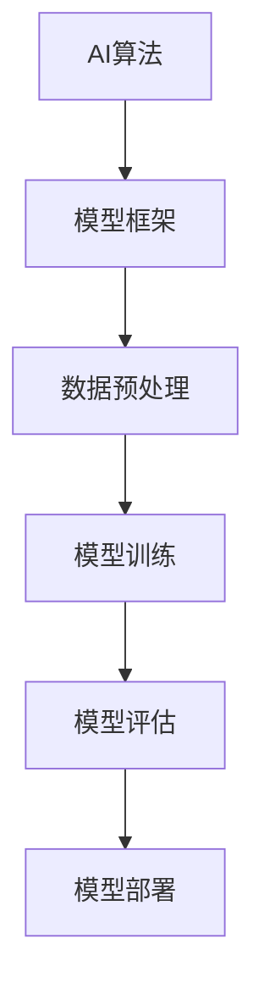

                 

## 1. 背景介绍

### 1.1 问题由来

人工智能(AI)技术的发展，从早期的专家系统到机器学习，再到深度学习，经过了数十年的探索和实践。现代AI技术的发展已经超越了传统算法和理论的范畴，进入了工程实践的新阶段。AI工程学（AI Engineering）成为连接理论研究和实际应用的重要桥梁。它将AI技术转化为可部署、可维护、可扩展的工程系统，为各行业数字化转型提供了强有力的技术支撑。

AI工程学的核心任务是将AI技术从科研实验室推向实际生产环境。这一过程不仅需要深入理解AI算法的理论基础，还需要掌握系统设计、模型部署、性能调优、工程实践等各个环节的实际操作方法。AI工程学关注从理论到实践的全流程，涵盖了从数据预处理、模型构建、模型训练到模型部署的各个阶段。

### 1.2 问题核心关键点

AI工程学从理论到实践的全流程可以分为以下几个关键步骤：

1. **数据预处理**：获取、清洗、标注高质量的数据，是构建有效AI模型的基础。
2. **模型构建**：选择合适的算法和架构，搭建AI模型框架。
3. **模型训练**：使用大量数据训练模型，优化模型参数，提升模型性能。
4. **模型评估与调优**：通过各种评估指标，不断调整模型架构和参数，提升模型效果。
5. **模型部署与维护**：将训练好的模型部署到生产环境，进行持续监控和优化，确保模型在实际场景中稳定运行。

AI工程学的关键在于如何将复杂的AI算法和理论转化为可执行的工程系统，同时兼顾模型性能和工程效益。

### 1.3 问题研究意义

AI工程学对于推动AI技术的产业化进程，提升AI应用的质量和效率具有重要意义：

1. **降低应用开发成本**：AI工程学通过将复杂算法和理论封装为工程工具和框架，大大降低了AI技术的开发门槛和成本。
2. **提升模型效果**：通过系统化的工程方法，AI工程学能够提升模型的性能，使其更好地适应实际应用场景。
3. **加速开发进度**：AI工程学通过提供统一的接口和工具，使得开发者可以快速迭代AI模型，缩短开发周期。
4. **保障模型质量**：通过严格的数据治理、模型训练和评估流程，AI工程学确保模型的可解释性、鲁棒性和安全性。
5. **推动产业升级**：AI工程学为各行业引入AI技术提供了标准化、可操作的指南，促进了产业的数字化转型。

## 2. 核心概念与联系

### 2.1 核心概念概述

为更好地理解AI工程学，本节将介绍几个关键核心概念及其相互联系：

1. **AI算法**：指用于解决特定问题的数学和计算方法，包括机器学习、深度学习、强化学习等。
2. **模型框架**：用于封装AI算法，提供统一的接口和工具，便于开发者使用。
3. **数据预处理**：指对原始数据进行清洗、标注、分治等操作，使其适合用于模型训练。
4. **模型训练**：通过数据输入模型，不断调整模型参数，使模型逐步逼近最优解。
5. **模型评估**：通过各类指标评估模型性能，选择最优模型进行应用。
6. **模型部署**：将训练好的模型部署到实际生产环境，进行持续监控和优化。

这些核心概念通过以下Mermaid流程图展示其相互关系：



这个流程图展示了AI工程学中的关键流程及其相互关系：

1. AI算法通过模型框架封装，提供统一的接口。
2. 数据预处理后的数据用于模型训练。
3. 通过模型训练，不断优化模型参数。
4. 模型评估选择最优模型。
5. 最优模型通过模型部署应用到实际生产环境。

## 3. 核心算法原理 & 具体操作步骤
### 3.1 算法原理概述

AI工程学的核心在于将AI算法转化为可执行的工程系统，这一过程包括算法选择、模型构建、数据处理、模型训练、模型评估和模型部署等多个环节。其中，模型训练和模型评估是整个流程中的关键步骤，决定了模型的最终性能。

AI工程学主要基于以下算法原理：

1. **监督学习**：通过标注数据训练模型，使其能够对新数据进行预测。
2. **无监督学习**：从未标注数据中自动发现数据结构和模式。
3. **强化学习**：通过与环境的交互，优化模型行为策略。
4. **迁移学习**：通过已有模型的知识迁移，提升新模型的性能。

### 3.2 算法步骤详解

AI工程学从理论到实践的完整流程可以概括为以下几个步骤：

**Step 1: 数据准备**
- 收集和清洗原始数据，去除噪声和异常值。
- 对数据进行标注，使其适合用于模型训练。
- 将数据分治为训练集、验证集和测试集。

**Step 2: 模型构建**
- 选择合适的算法和框架，搭建模型架构。
- 设计模型的输入输出接口，使其与业务需求对应。
- 设置模型超参数，如学习率、批大小、迭代次数等。

**Step 3: 模型训练**
- 将训练集数据分批次输入模型，进行前向传播计算损失函数。
- 反向传播计算参数梯度，根据优化算法更新模型参数。
- 周期性在验证集上评估模型性能，防止过拟合。
- 重复上述步骤直至模型收敛或达到预设迭代轮数。

**Step 4: 模型评估**
- 使用测试集评估模型性能，计算各类评估指标如准确率、召回率、F1值等。
- 分析模型在不同数据分布下的表现，评估模型的泛化能力。
- 调整模型架构和超参数，进一步提升模型性能。

**Step 5: 模型部署**
- 将训练好的模型封装为可执行模块，如TensorFlow、PyTorch等模型。
- 部署模型到生产环境，进行持续监控和性能优化。
- 针对模型在生产环境中的问题进行调优，确保模型稳定运行。

### 3.3 算法优缺点

AI工程学的优点包括：

1. **系统性**：通过系统化的工程方法，降低了AI技术应用的复杂度。
2. **可复用性**：模型框架和工具可以重复应用于多个AI项目，减少了重复开发工作量。
3. **可维护性**：工程化的AI模型易于维护和升级，保证了长期稳定运行。
4. **可扩展性**：模型框架和工具支持多种算法和数据源，可以灵活扩展。
5. **可解释性**：工程化的AI模型通常具备较好的可解释性，便于理解和调试。

AI工程学的缺点包括：

1. **开发周期长**：搭建和优化模型框架需要耗费大量时间和资源。
2. **性能优化复杂**：模型在生产环境中的性能调优需要深入分析和实验。
3. **数据依赖高**：模型性能高度依赖于高质量数据，数据获取和标注成本较高。
4. **工程瓶颈**：工程实践中的细节问题，如数据一致性、模型部署等，可能成为瓶颈。
5. **技术复杂性**：AI工程学的复杂度，要求开发者具备较高的技术水平和经验。

### 3.4 算法应用领域

AI工程学在各个领域都有广泛的应用，主要包括以下几个方面：

1. **自然语言处理(NLP)**：如文本分类、情感分析、机器翻译等任务。
2. **计算机视觉(CV)**：如图像识别、目标检测、图像生成等任务。
3. **智能推荐系统**：如电商推荐、新闻推荐、视频推荐等。
4. **金融风控**：如信用评分、欺诈检测、股票预测等。
5. **智能医疗**：如疾病诊断、个性化治疗、医学影像分析等。
6. **智能制造**：如设备预测性维护、生产流程优化等。

## 4. 数学模型和公式 & 详细讲解 & 举例说明

### 4.1 数学模型构建

AI工程学的数学模型构建涉及多个领域，如线性回归、决策树、神经网络等。以下以线性回归为例，展示其数学模型的构建过程。

假设有一个线性回归问题，已知训练集为 $(x_i, y_i)$，其中 $x_i \in \mathbb{R}^n$ 为输入向量，$y_i \in \mathbb{R}$ 为输出向量。线性回归的目标是找到最优的权重向量 $\theta \in \mathbb{R}^n$，使得模型能够准确预测输出。

定义模型为 $y = \theta^T x + b$，其中 $b \in \mathbb{R}$ 为偏置项。通过最小化损失函数，可以得到最优的权重向量 $\theta$：

$$
\theta^* = \mathop{\arg\min}_{\theta} \sum_{i=1}^N (y_i - \theta^T x_i - b)^2
$$

在实际计算中，通常采用梯度下降等优化算法来求解上述最优化问题。

### 4.2 公式推导过程

线性回归的损失函数为：

$$
L(\theta) = \frac{1}{2N} \sum_{i=1}^N (y_i - \theta^T x_i - b)^2
$$

其中，$N$ 为样本数量。对损失函数求导，得到梯度：

$$
\nabla_{\theta} L(\theta) = \frac{1}{N} \sum_{i=1}^N (-2x_i)(y_i - \theta^T x_i - b)
$$

将梯度代入梯度下降算法，更新参数：

$$
\theta \leftarrow \theta - \eta \nabla_{\theta} L(\theta)
$$

其中 $\eta$ 为学习率，控制参数更新的步长。

通过多次迭代，最终得到最优的权重向量 $\theta^*$。

### 4.3 案例分析与讲解

假设有一个房价预测任务，已知训练集数据 $(x_i, y_i)$，其中 $x_i$ 为房屋面积、房间数、位置等特征，$y_i$ 为房屋价格。可以通过线性回归模型来预测新房屋的价格。

**数据预处理**：
- 收集历史房屋交易数据，提取特征。
- 清洗数据，去除噪声和异常值。
- 将数据分为训练集和测试集，分别用于模型训练和性能评估。

**模型构建**：
- 选择线性回归模型，设计模型接口和参数。
- 设置学习率为0.01，批大小为100，迭代轮数为1000。

**模型训练**：
- 使用训练集数据进行模型训练，计算损失函数。
- 反向传播计算梯度，更新模型参数。
- 周期性在验证集上评估模型性能，防止过拟合。

**模型评估**：
- 使用测试集评估模型性能，计算均方误差。
- 分析模型在不同特征组合下的表现，选择最优特征。

**模型部署**：
- 将训练好的模型封装为可执行模型，如TensorFlow模型。
- 部署模型到生产环境，进行持续监控和性能优化。
- 针对模型在生产环境中的问题进行调优，确保模型稳定运行。

## 5. 项目实践：代码实例和详细解释说明

### 5.1 开发环境搭建

在进行AI工程学实践前，我们需要准备好开发环境。以下是使用Python进行TensorFlow开发的环境配置流程：

1. 安装Anaconda：从官网下载并安装Anaconda，用于创建独立的Python环境。

2. 创建并激活虚拟环境：
```bash
conda create -n tf-env python=3.8 
conda activate tf-env
```

3. 安装TensorFlow：根据CUDA版本，从官网获取对应的安装命令。例如：
```bash
conda install tensorflow tensorflow==2.6 -c conda-forge
```

4. 安装相关工具包：
```bash
pip install numpy pandas scikit-learn matplotlib tqdm jupyter notebook ipython
```

完成上述步骤后，即可在`tf-env`环境中开始AI工程学实践。

### 5.2 源代码详细实现

下面以线性回归为例，展示使用TensorFlow进行模型训练和评估的PyTorch代码实现。

首先，定义模型和优化器：

```python
import tensorflow as tf
from tensorflow.keras.models import Sequential
from tensorflow.keras.layers import Dense
from tensorflow.keras.optimizers import SGD

# 定义模型
model = Sequential([
    Dense(1, input_dim=1)
])

# 定义损失函数
loss_fn = tf.keras.losses.MeanSquaredError()

# 定义优化器
optimizer = SGD(learning_rate=0.01)
```

然后，定义训练和评估函数：

```python
# 定义训练函数
def train_model(model, train_data, epochs):
    model.compile(optimizer=optimizer, loss=loss_fn)
    model.fit(train_data, epochs=epochs)

# 定义评估函数
def evaluate_model(model, test_data):
    loss = loss_fn(model.predict(test_data), test_data)
    return loss
```

接着，加载数据并进行模型训练和评估：

```python
# 加载数据
train_data = [1.0, 2.0, 3.0, 4.0, 5.0]
train_labels = [1.0, 2.0, 3.0, 4.0, 5.0]
test_data = [6.0, 7.0, 8.0, 9.0, 10.0]
test_labels = [6.0, 7.0, 8.0, 9.0, 10.0]

# 训练模型
train_model(model, (train_data, train_labels), epochs=1000)

# 评估模型
loss = evaluate_model(model, (test_data, test_labels))
print(f"均方误差为: {loss:.3f}")
```

以上就是使用TensorFlow进行线性回归模型训练和评估的完整代码实现。可以看到，TensorFlow提供了丰富的API和工具，使得模型构建、训练和评估变得简单易行。

### 5.3 代码解读与分析

让我们再详细解读一下关键代码的实现细节：

**模型定义**：
- `Sequential`：使用序列模型，可以按顺序添加层。
- `Dense`：添加全连接层，用于线性回归模型的权重计算。
- `MeanSquaredError`：使用均方误差作为损失函数。

**训练函数**：
- `model.compile`：编译模型，设置优化器和损失函数。
- `model.fit`：训练模型，输入训练数据和标签，设置迭代轮数。

**评估函数**：
- `model.predict`：使用模型对测试数据进行预测。
- `loss_fn`：计算均方误差，评估模型预测的准确性。

**加载数据**：
- 使用Python列表存储数据和标签。
- 在模型训练和评估中，将数据转换为TensorFlow张量。

**模型训练和评估**：
- 使用`train_model`函数进行模型训练。
- 使用`evaluate_model`函数计算均方误差。
- 输出训练和评估结果。

通过上述代码实现，我们展示了TensorFlow如何便捷地实现线性回归模型的训练和评估。在实际应用中，还需要考虑数据预处理、模型调参、模型优化等更多细节，但核心的流程与上述示例类似。

## 6. 实际应用场景

### 6.1 智能推荐系统

智能推荐系统在电商、新闻、视频等多个领域都有广泛应用。基于AI工程学，可以通过以下步骤构建智能推荐系统：

1. **数据预处理**：收集用户行为数据，提取用户和物品的特征，清洗和标注数据。
2. **模型构建**：选择协同过滤、基于内容的推荐模型，搭建推荐系统架构。
3. **模型训练**：使用用户行为数据训练推荐模型，优化模型参数。
4. **模型评估**：在测试集上评估推荐模型的效果，选择最优模型。
5. **模型部署**：将训练好的模型部署到推荐系统，进行实时推荐。

### 6.2 智能客服系统

智能客服系统在金融、电信、电商等行业有广泛应用。基于AI工程学，可以通过以下步骤构建智能客服系统：

1. **数据预处理**：收集历史客服对话数据，提取问题和回答文本，清洗和标注数据。
2. **模型构建**：选择对话生成模型，搭建智能客服架构。
3. **模型训练**：使用对话数据训练模型，优化模型参数。
4. **模型评估**：在测试集上评估智能客服的对话效果，选择最优模型。
5. **模型部署**：将训练好的模型部署到智能客服系统，进行实时客服。

### 6.3 金融风险预测

金融风险预测在信用评分、欺诈检测、股票预测等方面有广泛应用。基于AI工程学，可以通过以下步骤构建金融风险预测系统：

1. **数据预处理**：收集金融数据，提取特征，清洗和标注数据。
2. **模型构建**：选择分类或回归模型，搭建风险预测系统架构。
3. **模型训练**：使用金融数据训练模型，优化模型参数。
4. **模型评估**：在测试集上评估模型的预测效果，选择最优模型。
5. **模型部署**：将训练好的模型部署到金融系统，进行实时风险预测。

### 6.4 未来应用展望

随着AI工程学的不断发展，未来将有更多AI技术得到广泛应用，为各行各业带来变革性影响：

1. **智慧医疗**：基于AI的疾病诊断、个性化治疗、医学影像分析等应用，将提升医疗服务的智能化水平。
2. **智能教育**：基于AI的作业批改、学情分析、知识推荐等应用，将促进教育公平，提高教学质量。
3. **智慧城市**：基于AI的城市事件监测、舆情分析、应急指挥等应用，将提高城市管理的自动化和智能化水平。
4. **智能制造**：基于AI的设备预测性维护、生产流程优化等应用，将提升制造业的自动化和智能化水平。
5. **智能交通**：基于AI的交通流量预测、智能导航等应用，将提升交通系统的效率和安全性。

## 7. 工具和资源推荐

### 7.1 学习资源推荐

为帮助开发者系统掌握AI工程学的理论基础和实践技巧，这里推荐一些优质的学习资源：

1. 《深度学习》系列书籍：由Ian Goodfellow等知名学者编写，系统介绍了深度学习的基本理论和算法。
2. 《TensorFlow官方文档》：TensorFlow官方提供的详细文档，包含丰富的API和示例代码。
3. 《PyTorch官方文档》：PyTorch官方提供的详细文档，包含丰富的API和示例代码。
4. 《Keras官方文档》：Keras官方提供的详细文档，包含丰富的API和示例代码。
5. 《PyTorch Lightning》：基于PyTorch的轻量级框架，简化了模型训练和调优流程。
6. 《TensorFlow Extended》：基于TensorFlow的机器学习工具集，提供了一站式的模型构建、训练和评估功能。

通过对这些资源的学习实践，相信你一定能够快速掌握AI工程学的精髓，并用于解决实际的AI问题。

### 7.2 开发工具推荐

高效的开发离不开优秀的工具支持。以下是几款用于AI工程学开发的常用工具：

1. TensorFlow：由Google主导开发的开源深度学习框架，生产部署方便，适合大规模工程应用。
2. PyTorch：由Facebook开发的开源深度学习框架，灵活易用，适合科研和工程应用。
3. Keras：基于TensorFlow和Theano的高级神经网络API，提供了简单易用的接口，适合快速原型开发。
4. Jupyter Notebook：开源的交互式笔记本，支持多种语言和库，适合数据探索和模型开发。
5. Git和GitHub：版本控制工具和代码托管平台，支持协作开发和代码管理。
6. Docker和Kubernetes：容器化和容器编排工具，支持模型和应用的无缝部署和扩展。

合理利用这些工具，可以显著提升AI工程学项目的开发效率，加快创新迭代的步伐。

### 7.3 相关论文推荐

AI工程学的不断演进得益于学界的持续研究。以下是几篇奠基性的相关论文，推荐阅读：

1. TensorFlow: A System for Large-Scale Machine Learning：介绍TensorFlow框架的设计和实现，奠定了深度学习在工程化应用的基础。
2. PyTorch: Tensors and Dynamic neural networks in Python with strong GPU acceleration：介绍PyTorch框架的设计和实现，展示了深度学习的灵活性和易用性。
3. Keras: Deep Learning for Humans：介绍Keras框架的设计和实现，展示了深度学习的简单易用性和工程化能力。
4. Scikit-learn：介绍机器学习库的设计和实现，展示了机器学习在工程化应用中的广泛应用。
5. Deep Learning with PyTorch and TensorFlow：介绍深度学习在工程化应用中的实践方法，展示了深度学习的工程化能力。

这些论文代表了大模型工程化的发展脉络，通过学习这些前沿成果，可以帮助研究者把握学科前进方向，激发更多的创新灵感。

## 8. 总结：未来发展趋势与挑战

### 8.1 总结

本文对AI工程学从理论到实践的全流程进行了全面系统的介绍。首先阐述了AI工程学的背景和核心任务，明确了从数据预处理到模型部署的各个关键步骤。接着，详细讲解了线性回归模型的构建和优化过程，提供了完整的代码实现和分析。同时，本文还探讨了AI工程学在智能推荐系统、智能客服系统、金融风险预测等多个领域的实际应用，展示了AI工程学的广泛影响。此外，本文精选了AI工程学的各类学习资源和工具，力求为读者提供全方位的技术指引。

通过本文的系统梳理，可以看到，AI工程学将复杂的AI算法和理论转化为可执行的工程系统，显著降低了AI技术的开发门槛和成本，提升了模型性能和工程效益。未来，伴随AI技术的不断发展，AI工程学将在更多领域得到应用，为各行各业带来变革性影响。

### 8.2 未来发展趋势

展望未来，AI工程学的发展趋势包括以下几个方面：

1. **模型自动化**：通过自动化模型选择和超参数优化，加速AI模型的构建和调优。
2. **数据增强**：通过数据增强和生成对抗网络(GANs)等技术，提高数据质量和多样性。
3. **模型压缩**：通过模型压缩和量化等技术，优化模型大小和性能。
4. **联邦学习**：通过联邦学习等技术，保护数据隐私，提升模型泛化能力。
5. **跨模态学习**：通过跨模态学习等技术，整合不同模态的数据，提升模型的全面性。
6. **自适应学习**：通过自适应学习等技术，提升模型对环境变化的适应能力。

这些发展趋势将进一步推动AI工程学的进步，使AI技术在更多领域得到实际应用。

### 8.3 面临的挑战

尽管AI工程学已经取得了瞩目成就，但在迈向更加智能化、普适化应用的过程中，它仍面临诸多挑战：

1. **数据获取成本高**：高质量数据获取成本高昂，数据标注和预处理复杂。
2. **模型训练耗时长**：大规模数据和复杂模型训练耗时长，需要高效并行计算资源。
3. **模型可解释性不足**：AI模型往往缺乏可解释性，难以理解模型内部工作机制。
4. **模型泛化能力弱**：模型在不同环境下的泛化能力不足，容易过拟合。
5. **模型安全性问题**：AI模型可能学习到有害信息，产生误导性或歧视性输出。

这些挑战需要研究者不断探索新的方法和技术，以提升AI模型的性能和安全性。

### 8.4 研究展望

面对AI工程学面临的诸多挑战，未来的研究需要在以下几个方面寻求新的突破：

1. **高效数据获取和标注技术**：探索无监督学习和半监督学习等技术，降低数据获取和标注成本。
2. **模型压缩和优化技术**：开发模型压缩、量化和蒸馏等技术，优化模型大小和性能。
3. **模型解释和可解释性技术**：引入可解释性工具和框架，提高模型的可解释性。
4. **联邦学习和跨模态学习技术**：探索联邦学习和跨模态学习等技术，提升模型的泛化能力和安全性。
5. **自适应学习技术**：开发自适应学习等技术，提升模型对环境变化的适应能力。

这些研究方向将引领AI工程学的进步，推动AI技术在更多领域得到实际应用。

## 9. 附录：常见问题与解答

**Q1：AI工程学与AI算法有何不同？**

A: AI工程学和AI算法都属于人工智能领域，但关注点不同。AI算法主要关注算法的理论设计和实现，而AI工程学更关注如何将算法转化为可执行的工程系统。AI工程学关注从数据预处理到模型部署的全流程，是连接理论研究和实际应用的重要桥梁。

**Q2：AI工程学开发中常用的数据预处理技术有哪些？**

A: AI工程学中常用的数据预处理技术包括：

1. **数据清洗**：去除数据中的噪声和异常值。
2. **特征提取**：提取对模型有用的特征。
3. **特征工程**：对特征进行变换和组合，提升模型性能。
4. **数据标注**：为模型提供标注数据，使其能够学习任务特定知识。
5. **数据增强**：通过数据增强技术，提升数据多样性和质量。

**Q3：AI工程学中的模型评估技术有哪些？**

A: AI工程学中的模型评估技术包括：

1. **准确率**：评估模型预测的正确率。
2. **召回率**：评估模型预测的正样本数量。
3. **F1值**：综合评估模型预测的准确率和召回率。
4. **ROC曲线**：评估模型在不同阈值下的分类性能。
5. **混淆矩阵**：可视化模型的预测结果和真实标签。

**Q4：AI工程学中常用的模型优化技术有哪些？**

A: AI工程学中常用的模型优化技术包括：

1. **梯度下降**：通过反向传播计算梯度，更新模型参数。
2. **正则化**：通过L1正则、L2正则等技术，防止模型过拟合。
3. **Dropout**：通过随机失活技术，防止模型过拟合。
4. **批标准化**：通过批标准化技术，加速模型训练和提升泛化能力。
5. **参数高效微调**：通过微调部分参数，减少过拟合风险。

**Q5：AI工程学中常用的模型部署技术有哪些？**

A: AI工程学中常用的模型部署技术包括：

1. TensorFlow Serving：使用TensorFlow Serving部署模型，支持高效的模型推理。
2. PyTorch Serving：使用PyTorch Serving部署模型，支持灵活的模型管理。
3. Kubernetes：使用Kubernetes容器编排技术，支持模型的分布式部署和扩展。
4. Docker：使用Docker容器技术，支持模型的轻量级部署和迁移。
5. AWS SageMaker：使用AWS SageMaker云平台，支持高效的模型训练和部署。

通过本文的系统梳理，可以看到，AI工程学将复杂的AI算法和理论转化为可执行的工程系统，显著降低了AI技术的开发门槛和成本，提升了模型性能和工程效益。未来，伴随AI技术的不断发展，AI工程学将在更多领域得到应用，为各行各业带来变革性影响。

