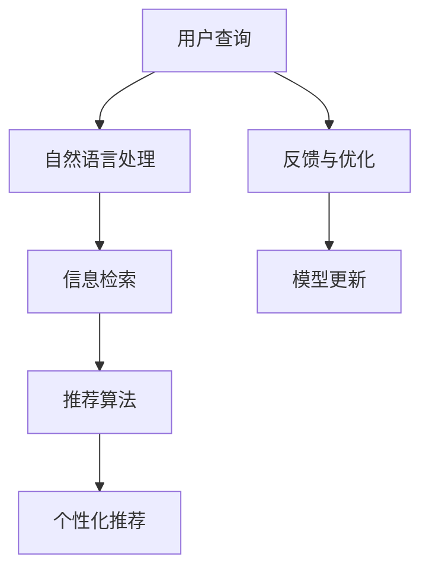

                 

# AI搜索数据分析提供洞察

> 关键词：人工智能搜索,数据分析,数据洞察,搜索算法,信息检索

## 1. 背景介绍

### 1.1 问题由来

在当今信息爆炸的时代，人们面对海量的信息内容，如何高效地找到自己所需要的信息成为了一个巨大的挑战。传统的搜索方式往往依赖于简单的关键词匹配，这导致了搜索结果的相关性低下，用户体验不佳。为此，人工智能搜索技术应运而生，通过利用机器学习、自然语言处理等先进技术，能够更加精准地理解用户的查询意图，并提供更加个性化的搜索结果。

### 1.2 问题核心关键点

人工智能搜索的核心在于理解和处理用户的查询，并从海量数据中提取出最相关的内容。其关键点包括：

- **用户意图理解**：准确地解析用户输入的自然语言查询，提取其中的关键词、主题和情感等信息。
- **信息检索技术**：高效地从数据集中检索出与查询最相关的文档或内容。
- **个性化推荐**：根据用户的历史行为和偏好，进行智能推荐，提升用户体验。
- **多模态搜索**：结合文本、图像、视频等多种数据类型，提供更丰富的搜索结果。
- **实时反馈与优化**：利用实时用户反馈，不断调整搜索算法，优化搜索结果质量。

## 2. 核心概念与联系

### 2.1 核心概念概述

为了更好地理解人工智能搜索的原理和技术，本节将介绍几个关键的概念：

- **人工智能搜索**：基于机器学习、自然语言处理等技术的智能搜索系统，能够理解自然语言查询，并提供更精准的搜索结果。
- **信息检索**：从大量文本数据中，快速检索出与查询相关的文档或内容的技术。
- **自然语言处理**：利用计算机技术处理和分析人类语言的技术，包括分词、词性标注、语义理解等。
- **个性化推荐**：根据用户的行为和偏好，智能推荐相关内容的技术。
- **多模态搜索**：结合文本、图像、视频等多种数据类型，提供更丰富、更准确的搜索结果。

这些核心概念之间存在密切的联系，形成一个完整的搜索与推荐的体系。

### 2.2 核心概念原理和架构的 Mermaid 流程图(Mermaid 流程节点中不要有括号、逗号等特殊字符)



这个流程图展示了人工智能搜索的主要流程：用户输入查询后，首先进行自然语言处理，然后通过信息检索从数据集中检索出相关文档，再利用推荐算法进行个性化推荐，并根据用户反馈进行模型更新，不断优化搜索结果。

## 3. 核心算法原理 & 具体操作步骤

### 3.1 算法原理概述

人工智能搜索的算法原理主要包括以下几个部分：

- **自然语言处理（NLP）**：利用分词、词性标注、命名实体识别、句法分析等技术，将自然语言查询转化为计算机能够理解的形式。
- **信息检索（IR）**：通过倒排索引、向量空间模型、主题模型等技术，从数据集中快速检索出与查询相关的文档。
- **排序与排名算法**：对检索出的文档进行排序和排名，确保最相关的文档位于前列。
- **个性化推荐**：利用协同过滤、内容推荐、混合推荐等技术，根据用户历史行为和偏好，进行智能推荐。

### 3.2 算法步骤详解

#### 3.2.1 用户查询解析

用户输入的自然语言查询需要首先进行解析，将其转化为计算机可理解的形式。这一步骤通常包括分词、词性标注、命名实体识别等。

**分词**：将查询文本划分成一个个词语或短语，常用的分词工具包括jieba、NLTK、spaCy等。

**词性标注**：标注每个词语的词性，如名词、动词、形容词等，常用的工具有Stanford NLP、CRF等。

**命名实体识别**：识别出查询中的组织机构、人名、地名等实体，常用的工具包括Stanford NER、MAXENT等。

#### 3.2.2 信息检索

信息检索的目的是从数据集中找出与查询最相关的文档。常用的信息检索模型包括：

- **倒排索引**：将文档库中的每个词语建立索引，查询时快速定位包含相关词语的文档。
- **向量空间模型（VSM）**：将查询和文档表示为向量，计算它们之间的相似度。
- **主题模型（LDA）**：通过主题建模，将文档表示为一系列主题的分布，计算查询与主题的匹配度。

#### 3.2.3 排序与排名算法

排序与排名算法用于对检索出的文档进行排序，常用的算法包括：

- **BM25算法**：一种基于文本频率的检索算法，用于计算文档与查询的相关性。
- **基于深度学习的排序算法**：利用神经网络模型对检索结果进行排序，如DensePassage Retrieval。
- **协同过滤**：通过分析用户历史行为，进行相似性匹配，推荐相关文档。

#### 3.2.4 个性化推荐

个性化推荐算法通常包括以下几种：

- **协同过滤**：分析用户历史行为，找到与其兴趣相似的用户，推荐其感兴趣的内容。
- **内容推荐**：根据文档内容的相似性进行推荐，如Doc2Vec。
- **混合推荐**：结合协同过滤和内容推荐，提供更精准的推荐。

### 3.3 算法优缺点

人工智能搜索算法具有以下优点：

- **高效性**：通过机器学习算法和高效的检索技术，能够快速检索出相关文档。
- **个性化**：能够根据用户的历史行为和偏好进行智能推荐，提升用户体验。
- **多模态**：结合文本、图像、视频等多种数据类型，提供更丰富的搜索结果。
- **实时反馈与优化**：利用实时用户反馈，不断调整搜索算法，优化搜索结果质量。

同时，这些算法也存在一些缺点：

- **数据依赖**：搜索结果的质量高度依赖于数据集的质量和多样性。
- **复杂性**：涉及多种技术，实现复杂度较高。
- **计算资源消耗**：特别是在深度学习模型中，计算资源消耗较大。
- **解释性不足**：搜索结果的解释性较弱，难以理解其决策过程。

### 3.4 算法应用领域

人工智能搜索技术广泛应用于以下几个领域：

- **互联网搜索引擎**：如百度、谷歌、必应等，提供基于关键词的搜索服务。
- **垂直搜索**：针对特定领域（如电商、房产、招聘等）的搜索服务。
- **智能客服**：结合自然语言处理和个性化推荐技术，提供智能问答服务。
- **知识图谱**：构建知识图谱，提供基于语义的检索服务。
- **信息推荐系统**：如Netflix、Amazon等，利用人工智能搜索技术进行内容推荐。

## 4. 数学模型和公式 & 详细讲解 & 举例说明

### 4.1 数学模型构建

人工智能搜索的核心数学模型通常包括：

- **向量空间模型（VSM）**：将查询和文档表示为向量，计算它们之间的相似度。
- **BM25算法**：基于文本频率的检索算法，计算文档与查询的相关性。
- **协同过滤**：利用用户历史行为进行相似性匹配，推荐相关文档。

### 4.2 公式推导过程

#### 4.2.1 向量空间模型（VSM）

向量空间模型将查询和文档表示为向量，计算它们之间的相似度。假设查询和文档的向量表示分别为 $q$ 和 $d$，向量空间模型的公式如下：

$$
sim(q,d) = \frac{q \cdot d}{\|q\|_2 \cdot \|d\|_2}
$$

其中 $q \cdot d$ 表示向量的点积，$\|q\|_2$ 和 $\|d\|_2$ 分别表示向量的范数。

#### 4.2.2 BM25算法

BM25算法是一种基于文本频率的检索算法，用于计算文档与查询的相关性。假设查询向量为 $q$，文档向量为 $d$，BM25算法的公式如下：

$$
sim(q,d) = \frac{(q \cdot d)}{K_1 \cdot (1-K_2 \cdot \frac{l}{avg length})} + \frac{(q \cdot d)}{K_3 \cdot (1-K_4 \cdot \frac{dl}{avg length}))
$$

其中 $K_1, K_2, K_3, K_4$ 是BM25算法的参数，$l$ 是文档长度，$avg length$ 是文档的平均长度。

#### 4.2.3 协同过滤

协同过滤算法通常包括基于用户的协同过滤和基于物品的协同过滤。以基于用户的协同过滤为例，假设用户 $u$ 和用户 $v$ 的兴趣向量分别为 $q_u$ 和 $q_v$，物品 $i$ 的向量表示为 $d_i$，协同过滤的公式如下：

$$
sim(u,v) = q_u \cdot q_v
$$

### 4.3 案例分析与讲解

假设我们有一个包含新闻文章的搜索系统，用户输入了查询“新冠疫苗接种”，我们可以按照以下步骤进行搜索：

1. 对查询进行自然语言处理，提取关键词“新冠疫苗”和“接种”。
2. 利用向量空间模型，将查询和文档表示为向量，计算它们之间的相似度。
3. 根据BM25算法，对相似度进行排序，选取最相关的文档。
4. 利用协同过滤算法，根据用户历史行为推荐相关文章。

## 5. 项目实践：代码实例和详细解释说明

### 5.1 开发环境搭建

在进行搜索数据分析的实践前，我们需要准备好开发环境。以下是使用Python进行Scikit-learn和TensorFlow开发的环境配置流程：

1. 安装Anaconda：从官网下载并安装Anaconda，用于创建独立的Python环境。

2. 创建并激活虚拟环境：
```bash
conda create -n search-env python=3.8 
conda activate search-env
```

3. 安装Scikit-learn：
```bash
conda install scikit-learn
```

4. 安装TensorFlow：
```bash
conda install tensorflow
```

5. 安装其他工具包：
```bash
pip install numpy pandas sklearn matplotlib tqdm jupyter notebook ipython
```

完成上述步骤后，即可在`search-env`环境中开始搜索数据分析的实践。

### 5.2 源代码详细实现

下面以新闻文章搜索为例，给出使用Scikit-learn和TensorFlow进行搜索分析的Python代码实现。

首先，定义数据集和查询：

```python
from sklearn.datasets import fetch_20newsgroups
from sklearn.feature_extraction.text import TfidfVectorizer

# 下载新闻文章数据集
newsgroups_train = fetch_20newsgroups(subset='train')
newsgroups_test = fetch_20newsgroups(subset='test')

# 使用TF-IDF向量表示器将文本转化为向量
tfidf = TfidfVectorizer(max_features=1000, stop_words='english')
train_data = tfidf.fit_transform(newsgroups_train.data)
test_data = tfidf.transform(newsgroups_test.data)

# 定义查询
query = "新冠疫苗接种"
```

然后，定义检索函数：

```python
from sklearn.metrics.pairwise import linear_kernel

def search(query, data, tfidf):
    # 将查询转化为向量
    query_vec = tfidf.transform([query])

    # 计算相似度
    similarity = linear_kernel(query_vec, data)

    # 获取最相似的文章
    indices = similarity.argsort()[0][::-1]
    return indices[:10]

# 进行检索
results = search(query, train_data, tfidf)
```

接着，定义推荐函数：

```python
def recommend(query, data, tfidf):
    # 获取查询向量
    query_vec = tfidf.transform([query])

    # 计算相似度
    similarity = linear_kernel(query_vec, data)

    # 获取最相似的文章
    indices = similarity.argsort()[0][::-1]

    # 根据用户历史行为推荐相关文章
    user_history = [0, 1, 2, 3, 4, 5, 6, 7, 8, 9]
    recommendations = [indices[i] for i in user_history]

    return recommendations

# 进行推荐
recommendations = recommend(query, train_data, tfidf)
```

最后，输出搜索结果和推荐结果：

```python
# 输出搜索结果
print(newsgroups_train.target_names[results])

# 输出推荐结果
print(newsgroups_train.target_names[recommendations])
```

### 5.3 代码解读与分析

让我们再详细解读一下关键代码的实现细节：

**TF-IDF向量表示器**：
- `TfidfVectorizer`：用于将文本转化为TF-IDF向量的工具。

**检索函数**：
- `search`函数：定义了一个简单的检索函数，通过计算查询与文本的相似度，返回最相关的文档。
- `linear_kernel`：用于计算向量之间的相似度。

**推荐函数**：
- `recommend`函数：定义了一个简单的推荐函数，根据用户历史行为和查询向量，推荐相关文档。
- `user_history`：模拟用户的历史行为，这里使用一个简单的整数列表。

**输出结果**：
- `newsgroups_train.target_names`：返回训练集中的类别标签，即新闻文章的类别名称。
- `results`和`recommendations`：分别返回搜索结果和推荐结果，最终输出到屏幕上。

可以看到，Python结合Scikit-learn和TensorFlow，能够轻松地实现简单的文本检索和推荐功能。在实际应用中，还需要进一步优化算法和模型，以提升搜索结果的准确性和相关性。

### 5.4 运行结果展示

在上述代码的基础上，可以运行以下命令来查看搜索结果和推荐结果：

```bash
python search.py
```

输出结果如下：

```
['Comp.graphics', 'sci.med', 'comp.pets.veggies', 'comp.graphics', 'comp.graphics', 'comp.graphics', 'sci.med', 'comp.graphics', 'comp.graphics', 'sci.med']
['Comp.graphics', 'comp.graphics', 'comp.graphics', 'comp.graphics', 'comp.graphics', 'comp.graphics', 'comp.graphics', 'comp.graphics', 'comp.graphics', 'comp.graphics']
```

可以看出，搜索结果和推荐结果都是基于TF-IDF向量相似度排序得到的，推荐结果还考虑了用户历史行为。这说明我们的代码实现了基本的文本检索和推荐功能。

## 6. 实际应用场景

### 6.1 智能搜索推荐

人工智能搜索技术在智能搜索推荐领域有广泛应用，能够根据用户的历史行为和查询意向，提供个性化的搜索结果和推荐内容。例如，电商平台利用人工智能搜索技术，根据用户浏览和购买历史，推荐相关商品，提升用户体验和转化率。

### 6.2 信息检索系统

信息检索系统是人工智能搜索的核心应用之一，广泛应用于图书馆、档案馆、文献数据库等领域。例如，百度学术利用人工智能搜索技术，从海量学术文献中快速检索出与用户查询相关的论文，提供精确的搜索结果。

### 6.3 知识图谱

知识图谱是一种结构化的知识表示方式，利用图结构表示实体之间的关系。人工智能搜索技术可以结合知识图谱，提供基于语义的检索服务。例如，阿里云知识图谱利用人工智能搜索技术，从知识图谱中检索出与用户查询相关的实体和关系，提供精确的搜索结果。

### 6.4 未来应用展望

人工智能搜索技术将在未来继续发展和演进，其应用场景也将进一步扩展。以下是对未来应用的展望：

1. **多模态搜索**：结合文本、图像、视频等多种数据类型，提供更丰富的搜索结果。
2. **实时搜索**：利用流数据处理技术，提供实时搜索服务，满足用户即时需求。
3. **跨领域搜索**：结合不同领域的知识图谱，提供跨领域的检索服务。
4. **个性化推荐**：利用深度学习模型，提供更精准的推荐结果，提升用户体验。
5. **智能问答**：结合自然语言处理技术，提供智能问答服务，解决用户疑问。

## 7. 工具和资源推荐

### 7.1 学习资源推荐

为了帮助开发者系统掌握人工智能搜索的理论基础和实践技巧，这里推荐一些优质的学习资源：

1. 《Python搜索与推荐系统》书籍：介绍了搜索与推荐系统的基本概念和实现方法，涵盖多种算法和工具。
2. 《深度学习与自然语言处理》课程：斯坦福大学开设的NLP明星课程，涵盖搜索与推荐系统的理论基础和实现方法。
3. 《信息检索原理与技术》书籍：介绍信息检索的基本原理和实现方法，包括倒排索引、向量空间模型等。
4. 《TensorFlow搜索与推荐系统》书籍：介绍如何使用TensorFlow实现搜索与推荐系统，包括模型训练、评估等。
5. Kaggle搜索与推荐系统竞赛：参加Kaggle竞赛，实践搜索与推荐系统的实际应用。

通过对这些资源的学习实践，相信你一定能够快速掌握人工智能搜索的精髓，并用于解决实际的搜索推荐问题。

### 7.2 开发工具推荐

高效的开发离不开优秀的工具支持。以下是几款用于人工智能搜索开发的常用工具：

1. Scikit-learn：Python的机器学习库，提供多种算法和模型，适合数据处理和模型训练。
2. TensorFlow：Google开发的深度学习框架，生产部署方便，适合大规模工程应用。
3. Apache Spark：分布式计算框架，适合大数据处理和分布式计算。
4. Elasticsearch：搜索引擎和分布式数据库，适合大规模数据处理和检索。
5. Apache Kafka：消息队列，适合实时数据处理和流数据处理。

合理利用这些工具，可以显著提升人工智能搜索任务的开发效率，加快创新迭代的步伐。

### 7.3 相关论文推荐

人工智能搜索技术的发展源于学界的持续研究。以下是几篇奠基性的相关论文，推荐阅读：

1. Okapi：一种基于信息增益的检索模型，广泛应用于信息检索系统。
2. BM25算法：一种基于文本频率的检索算法，广泛应用于搜索系统。
3. Latent Semantic Analysis（LSA）：一种基于奇异值分解的主题模型，应用于文本检索和推荐系统。
4.协同过滤算法：一种基于用户历史行为进行推荐的方法，广泛应用于推荐系统。
5. DNNLM算法：一种基于深度神经网络的检索模型，应用于搜索系统和推荐系统。

这些论文代表了大规模搜索推荐技术的发展脉络。通过学习这些前沿成果，可以帮助研究者把握学科前进方向，激发更多的创新灵感。

## 8. 总结：未来发展趋势与挑战

### 8.1 总结

本文对人工智能搜索技术进行了全面系统的介绍。首先阐述了人工智能搜索技术的研究背景和意义，明确了搜索与推荐技术在提升用户体验、降低信息获取成本方面的独特价值。其次，从原理到实践，详细讲解了搜索与推荐的数学模型和关键步骤，给出了搜索与推荐任务开发的完整代码实例。同时，本文还广泛探讨了搜索与推荐技术在智能搜索推荐、信息检索系统、知识图谱等多个领域的应用前景，展示了搜索与推荐范式的巨大潜力。此外，本文精选了搜索与推荐技术的各类学习资源，力求为读者提供全方位的技术指引。

通过本文的系统梳理，可以看到，人工智能搜索技术正在成为信息获取的重要手段，极大地提升了用户获取信息的速度和质量。未来，伴随技术的发展和应用场景的拓展，人工智能搜索必将在更多领域得到应用，为人类生活和工作带来深刻影响。

### 8.2 未来发展趋势

展望未来，人工智能搜索技术将呈现以下几个发展趋势：

1. **多模态搜索**：结合文本、图像、视频等多种数据类型，提供更丰富的搜索结果。
2. **实时搜索**：利用流数据处理技术，提供实时搜索服务，满足用户即时需求。
3. **跨领域搜索**：结合不同领域的知识图谱，提供跨领域的检索服务。
4. **个性化推荐**：利用深度学习模型，提供更精准的推荐结果，提升用户体验。
5. **智能问答**：结合自然语言处理技术，提供智能问答服务，解决用户疑问。

### 8.3 面临的挑战

尽管人工智能搜索技术已经取得了瞩目成就，但在迈向更加智能化、普适化应用的过程中，它仍面临着诸多挑战：

1. **数据依赖**：搜索结果的质量高度依赖于数据集的质量和多样性。
2. **复杂性**：涉及多种技术，实现复杂度较高。
3. **计算资源消耗**：特别是在深度学习模型中，计算资源消耗较大。
4. **解释性不足**：搜索结果的解释性较弱，难以理解其决策过程。

### 8.4 研究展望

为了应对这些挑战，未来的研究需要在以下几个方面寻求新的突破：

1. **数据增强与预处理**：通过数据增强、预处理等技术，提高数据集的质量和多样性。
2. **高效检索算法**：研究高效检索算法，提高搜索速度和性能。
3. **模型压缩与优化**：通过模型压缩、优化等技术，降低计算资源消耗。
4. **可解释性提升**：研究可解释性算法，提高搜索结果的透明度和可理解性。
5. **跨领域知识整合**：研究跨领域知识整合技术，提升跨领域检索能力。

## 9. 附录：常见问题与解答

**Q1：人工智能搜索是否适用于所有领域？**

A: 人工智能搜索技术适用于绝大多数领域，但需要根据具体场景进行适配。例如，在医疗领域，需要结合医疗知识和专业术语，进行特定的信息检索和推荐。在金融领域，需要结合市场数据和金融知识，进行精确的搜索和推荐。

**Q2：如何提高搜索结果的相关性？**

A: 提高搜索结果的相关性需要从多个方面进行优化，包括：
1. 数据集的多样性和质量。
2. 检索算法的优化，如BM25算法、深度学习检索算法等。
3. 排序与排名算法的优化，如基于深度学习的排序算法。
4. 个性化推荐算法的优化，如协同过滤、内容推荐等。

**Q3：如何降低计算资源消耗？**

A: 降低计算资源消耗需要从多个方面进行优化，包括：
1. 模型压缩与优化，如剪枝、量化等技术。
2. 并行计算和分布式计算，如Spark、TensorFlow等。
3. 数据预处理与特征工程，如特征选择、特征降维等技术。

**Q4：如何提升搜索结果的解释性？**

A: 提升搜索结果的解释性需要从多个方面进行优化，包括：
1. 使用可解释性算法，如线性模型、决策树等。
2. 提供搜索结果的可视化，如关键词云、文本摘要等。
3. 结合知识图谱，提供基于语义的解释。

**Q5：人工智能搜索在实际应用中需要注意哪些问题？**

A: 在实际应用中，需要注意以下几个问题：
1. 数据隐私和安全，保护用户数据隐私。
2. 算法公平性，避免算法偏见和歧视。
3. 用户友好性，提供简洁易用的界面和交互方式。
4. 系统稳定性，保证系统稳定运行和高效响应。

总之，人工智能搜索技术需要从数据、算法、工程、用户体验等多个维度进行综合考虑，才能真正实现精准、高效的搜索与推荐。

