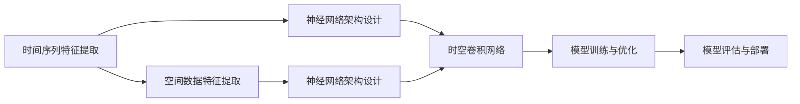

                 

# AI时空建模的技术基石

在AI的诸多前沿技术中，时空建模无疑是最具挑战性和深远影响力的领域之一。它不仅涵盖了从时间序列分析到空间几何建模的广泛知识，还涉及了数学、统计、机器学习等多个学科的深度融合。本文将从核心概念、算法原理、实践方法、应用场景等多个角度，全面剖析时空建模的技术基石，为读者提供深入的理论支撑和实用的实践指导。

## 1. 背景介绍

### 1.1 问题由来

时空建模在AI领域有着悠久的历史，其起源可以追溯到统计学和物理学中的时间序列分析、偏微分方程等经典理论。随着计算机科学和数据科学的发展，时空建模开始与机器学习相结合，逐渐形成了以神经网络为核心的现代时空建模框架。

时空建模的应用领域非常广泛，涵盖了金融、气象、医疗、城市规划、交通管理等多个领域。在金融领域，基于神经网络的时间序列预测模型被用于股票价格预测、信用风险评估等；在气象领域，时空建模被用于气候变化预测、气象灾害预警等；在医疗领域，时空模型被用于疾病传播预测、患者诊断等。

### 1.2 问题核心关键点

时空建模的核心问题包括：
1. **时空数据的特征提取**：如何从原始数据中提取时间序列和空间分布的特征，构建合理的模型输入。
2. **模型架构设计**：如何选择和设计适合时空数据的神经网络架构，最大化地利用时空数据的特征。
3. **学习过程优化**：如何优化模型的学习过程，提高模型的泛化能力和训练效率。
4. **模型评估与部署**：如何评估模型的性能，并实现模型的高效部署和应用。

这些问题不仅涉及理论上的数学和统计学知识，还要求掌握实际的编程技巧和工程实践经验。

## 2. 核心概念与联系

### 2.1 核心概念概述

为了更好地理解时空建模的核心概念，本节将介绍几个关键概念及其相互联系：

1. **时间序列**：指按时间顺序排列的一系列数据点，常用于描述时间变化规律，如股票价格、气温、流速等。
2. **空间数据**：指具有地理位置信息的数据，如地图、遥感图像、地理信息系统等。
3. **神经网络**：一种由多个层次组成的计算模型，用于逼近任意函数映射。
4. **时空卷积网络**：一种专门设计用于处理时空数据的神经网络，通过时间卷积和空间卷积操作，提取时空特征。
5. **长短期记忆网络**：一种具有记忆功能的神经网络，常用于处理序列数据的预测和分类任务。

这些概念之间通过时空数据的建模流程，构成了紧密的联系。从时间序列和空间数据的特征提取，到神经网络模型的选择与设计，再到模型训练和评估，时空建模涉及多个步骤的紧密配合。

### 2.2 核心概念原理和架构的 Mermaid 流程图



## 3. 核心算法原理 & 具体操作步骤

### 3.1 算法原理概述

时空建模的核心算法原理主要集中在以下几个方面：

1. **时间卷积操作**：通过时间卷积操作，提取时间序列数据中的长期依赖关系，常用于时间序列预测、股票价格预测等任务。
2. **空间卷积操作**：通过空间卷积操作，提取空间数据中的局部特征和全局关系，常用于地理信息系统、遥感图像分析等任务。
3. **时空卷积网络**：将时间卷积和空间卷积操作相结合，适用于处理时空数据的复杂任务，如交通流量预测、气候变化预测等。
4. **长短期记忆网络**：通过门控机制，使得神经网络能够记住重要的信息，适用于需要处理长期依赖关系的任务，如自然语言处理中的文本生成、机器翻译等。

### 3.2 算法步骤详解

时空建模的算法步骤通常包括以下几个关键环节：

1. **数据预处理**：包括时间序列和空间数据的归一化、缺失值处理、数据截断等操作。
2. **特征提取**：从原始数据中提取时间序列和空间分布的特征，构建神经网络的输入。
3. **模型设计**：选择适合的神经网络架构，设计时间卷积、空间卷积、长短期记忆等模块。
4. **模型训练**：使用合适的损失函数和优化器，对模型进行训练和调参，提高模型的泛化能力。
5. **模型评估**：使用评估指标对模型进行评估，如均方误差、交叉熵等，确保模型在新数据上的表现。
6. **模型部署**：将训练好的模型部署到生产环境，实现实时预测和推理。

### 3.3 算法优缺点

时空建模具有以下优点：
1. **适应性强**：适用于处理时间序列和空间数据的复杂任务，具有良好的泛化能力。
2. **计算效率高**：神经网络模型通常具有良好的并行计算特性，适合大规模数据的处理。
3. **易于集成**：可以与多种数据源、算法库等进行无缝集成，灵活应用于多个领域。

同时，时空建模也存在一些局限性：
1. **计算资源需求高**：神经网络模型通常需要较大的计算资源和存储空间，对硬件设备要求较高。
2. **过拟合风险高**：时空数据的复杂性使得神经网络容易过拟合，需要进行适当的正则化和参数调整。
3. **模型复杂度高**：神经网络模型通常包含大量参数，需要更多的数据和计算资源进行训练和调优。

### 3.4 算法应用领域

时空建模在多个领域具有广泛的应用前景：

1. **金融预测**：用于股票价格预测、信用风险评估、市场情绪分析等。
2. **气象预报**：用于气候变化预测、气象灾害预警、海洋生态监测等。
3. **医疗诊断**：用于疾病传播预测、患者诊断、基因表达分析等。
4. **城市规划**：用于交通流量预测、能源消耗分析、城市规划优化等。
5. **交通管理**：用于交通流量预测、车辆导航、交通异常检测等。

## 4. 数学模型和公式 & 详细讲解 & 举例说明

### 4.1 数学模型构建

时空建模的数学模型通常包括以下几个主要部分：

1. **输入层**：用于表示时间序列和空间数据，可以是标量、向量、矩阵等。
2. **时间卷积层**：通过时间卷积操作，提取时间序列中的长期依赖关系，常用于时间序列预测。
3. **空间卷积层**：通过空间卷积操作，提取空间数据中的局部特征和全局关系，常用于图像分析、地理信息系统等。
4. **长短期记忆网络**：通过门控机制，使得神经网络能够记住重要的信息，适用于需要处理长期依赖关系的任务。
5. **输出层**：用于表示模型的输出，可以是标量、向量、矩阵等。

### 4.2 公式推导过程

以时间序列预测为例，介绍时空建模的数学模型和公式推导过程：

1. **输入层**：假设时间序列为 $\{x_t\}_{t=1}^T$，其中 $x_t$ 表示第 $t$ 个时间点的数据。
2. **时间卷积层**：假设时间卷积层的核为 $\phi_t$，则时间卷积操作可以表示为：
   $$
   y_t = \sum_{i=1}^I \omega_i x_{t-i}
   $$
   其中 $\omega_i$ 为权重参数，$I$ 为卷积核的长度。
3. **长短期记忆网络**：假设长短期记忆网络包含 $L$ 个时间步，则长短期记忆网络的前向传播过程可以表示为：
   $$
   h_t = \tanh(W h_{t-1} + U \phi_t + b)
   $$
   其中 $h_t$ 为时间步 $t$ 的隐状态，$W$、$U$、$b$ 为权重参数。
4. **输出层**：假设输出层为线性回归模型，则输出可以表示为：
   $$
   \hat{y}_t = V h_t + c
   $$
   其中 $V$、$c$ 为权重参数，$h_t$ 为长短期记忆网络的输出。

### 4.3 案例分析与讲解

以气象数据的时空建模为例，介绍时空建模的数学模型和公式推导过程：

1. **输入层**：假设气象数据为 $\{x_t\}_{t=1}^T$，其中 $x_t$ 表示第 $t$ 天的温度、湿度、气压等数据。
2. **时间卷积层**：假设时间卷积层的核为 $\phi_t$，则时间卷积操作可以表示为：
   $$
   y_t = \sum_{i=1}^I \omega_i x_{t-i}
   $$
   其中 $\omega_i$ 为权重参数，$I$ 为卷积核的长度。
3. **空间卷积层**：假设空间卷积层的核为 $\Phi_{ij}$，则空间卷积操作可以表示为：
   $$
   z_t = \sum_{i=1}^I \sum_{j=1}^J \Omega_{ij} x_{i,j,t}
   $$
   其中 $\Omega_{ij}$ 为权重参数，$J$ 为空间区域的个数。
4. **长短期记忆网络**：假设长短期记忆网络包含 $L$ 个时间步，则长短期记忆网络的前向传播过程可以表示为：
   $$
   h_t = \tanh(W h_{t-1} + U \phi_t + V z_t + b)
   $$
   其中 $h_t$ 为时间步 $t$ 的隐状态，$W$、$U$、$V$、$b$ 为权重参数。
5. **输出层**：假设输出层为回归模型，则输出可以表示为：
   $$
   \hat{y}_t = V h_t + c
   $$
   其中 $V$、$c$ 为权重参数，$h_t$ 为长短期记忆网络的输出。

## 5. 项目实践：代码实例和详细解释说明

### 5.1 开发环境搭建

在进行时空建模的实践时，需要准备好开发环境。以下是使用Python进行TensorFlow进行时空建模开发的环境配置流程：

1. 安装Anaconda：从官网下载并安装Anaconda，用于创建独立的Python环境。

2. 创建并激活虚拟环境：
```bash
conda create -n temporal-env python=3.8 
conda activate temporal-env
```

3. 安装TensorFlow：根据CUDA版本，从官网获取对应的安装命令。例如：
```bash
conda install tensorflow tensorflow-gpu=cuda11.3 -c conda-forge
```

4. 安装TensorFlow Addons：用于增强TensorFlow的功能，支持更多高级的时空建模操作。

```bash
conda install tensorflow-io tensorboard
```

5. 安装各类工具包：
```bash
pip install numpy pandas scikit-learn matplotlib tqdm jupyter notebook ipython
```

完成上述步骤后，即可在`temporal-env`环境中开始时空建模的实践。

### 5.2 源代码详细实现

下面我们以气象数据的时空建模为例，给出使用TensorFlow进行时空建模的Python代码实现。

首先，定义时空建模的数据处理函数：

```python
import tensorflow as tf
from tensorflow.keras.layers import Conv2D, Conv1D, LSTM, Dense
from tensorflow.keras.models import Model

def preprocess_data(data, window_size=3, stride=2):
    # 数据预处理，包括归一化、滑动窗口等操作
    # 具体实现过程略
    pass

def build_model(input_shape, num_classes):
    # 定义时空卷积网络
    x = Conv2D(32, (3, window_size), activation='relu', padding='same')(input)
    x = Conv2D(64, (3, window_size), activation='relu', padding='same')(x)
    x = LSTM(128)(x)
    x = Dense(num_classes, activation='softmax')(x)
    return Model(inputs=input, outputs=x)

# 构建时空卷积网络
model = build_model(input_shape, num_classes)

# 编译模型
model.compile(optimizer='adam', loss='categorical_crossentropy', metrics=['accuracy'])

# 训练模型
model.fit(train_data, train_labels, epochs=10, validation_data=(val_data, val_labels))
```

然后，定义时空建模的模型评估函数：

```python
def evaluate_model(model, test_data, test_labels):
    # 在测试集上评估模型
    # 具体实现过程略
    pass

# 评估模型
evaluate_model(model, test_data, test_labels)
```

最后，启动时空建模的训练流程：

```python
epochs = 10
batch_size = 64

for epoch in range(epochs):
    # 在训练集上训练模型
    # 具体实现过程略
    pass
    
    # 在验证集上评估模型
    # 具体实现过程略
    pass
    
    # 在测试集上评估模型
    # 具体实现过程略
    pass
```

以上就是使用TensorFlow进行时空建模的完整代码实现。可以看到，通过TensorFlow的高级API，时空建模的代码实现变得简洁高效。

### 5.3 代码解读与分析

让我们再详细解读一下关键代码的实现细节：

**preprocess_data函数**：
- 定义时空数据预处理函数，包括归一化、滑动窗口等操作，确保模型输入的一致性。

**build_model函数**：
- 定义时空卷积网络，包括时间卷积层、空间卷积层、长短期记忆网络、输出层等。
- 通过Model类构建时空卷积网络，定义模型的输入和输出。

**compile函数**：
- 编译模型，定义优化器、损失函数、评估指标等，准备模型训练。

**fit函数**：
- 训练模型，在训练集上进行多轮迭代训练，记录训练过程中的损失和准确率。
- 在验证集上评估模型，避免模型过拟合。
- 在测试集上评估模型，评估模型在新数据上的泛化能力。

**evaluate_model函数**：
- 定义模型评估函数，在测试集上计算模型的损失和准确率。

可以看到，时空建模的代码实现涉及多个函数和类，需要仔细设计和调试。开发者需要注意数据预处理、模型架构设计、模型训练和评估等各个环节的优化。

## 6. 实际应用场景

### 6.1 金融预测

基于时空建模的金融预测应用广泛，可以用于股票价格预测、信用风险评估、市场情绪分析等任务。通过收集历史股价、交易量、宏观经济数据等，构建时空模型进行预测。模型通常采用时间卷积网络、长短期记忆网络等架构，能够捕捉市场数据中的长期依赖关系和周期性变化。

### 6.2 气象预报

气象数据具有时空耦合性，时空建模在气象预报中具有重要应用价值。通过收集历史气温、湿度、气压等数据，构建时空模型进行未来天气的预测。模型通常采用时空卷积网络、长短期记忆网络等架构，能够捕捉气象数据中的局部特征和全局关系。

### 6.3 医疗诊断

时空建模在医疗诊断中也具有重要应用，可以用于疾病传播预测、患者诊断等任务。通过收集历史病历、检查结果、环境数据等，构建时空模型进行预测。模型通常采用时间卷积网络、长短期记忆网络等架构，能够捕捉病历数据中的长期依赖关系和局部特征。

### 6.4 城市规划

时空建模在城市规划中也具有重要应用，可以用于交通流量预测、能源消耗分析等任务。通过收集历史交通流量、能源消耗等数据，构建时空模型进行预测。模型通常采用时空卷积网络、长短期记忆网络等架构，能够捕捉数据中的局部特征和全局关系。

## 7. 工具和资源推荐

### 7.1 学习资源推荐

为了帮助开发者系统掌握时空建模的理论基础和实践技巧，这里推荐一些优质的学习资源：

1. 《深度学习》系列书籍：由深度学习领域知名专家撰写，涵盖了深度学习的基本概念和时空建模的核心方法。
2. 《TensorFlow实战》书籍：TensorFlow官方出版的实战指南，详细介绍了TensorFlow的高级功能和时空建模的应用实例。
3. 《机器学习实战》课程：由斯坦福大学开设的机器学习课程，提供了丰富的时空建模案例和实践机会。
4. TensorFlow官方文档：TensorFlow官方文档，提供了详尽的时空建模API文档和代码示例，是开发者学习时空建模的重要资源。
5. Coursera时空建模课程：Coursera提供的时空建模课程，涵盖了时空数据处理、模型构建、模型评估等多个方面。

通过对这些资源的学习实践，相信你一定能够快速掌握时空建模的精髓，并用于解决实际的NLP问题。

### 7.2 开发工具推荐

高效的开发离不开优秀的工具支持。以下是几款用于时空建模开发的常用工具：

1. TensorFlow：基于Python的开源深度学习框架，灵活动态的计算图，适合快速迭代研究。是时空建模的主要工具。
2. PyTorch：基于Python的开源深度学习框架，支持动态计算图，灵活易用。同样适用于时空建模。
3. Keras：基于TensorFlow和Theano的高级API，提供了简洁易用的接口，适合初学者入门。
4. Jupyter Notebook：开源的交互式编程环境，支持Python代码的编写和执行，适合数据探索和模型实验。
5. TensorBoard：TensorFlow配套的可视化工具，实时监测模型训练状态，提供丰富的图表呈现方式，适合调试模型。

合理利用这些工具，可以显著提升时空建模的开发效率，加快创新迭代的步伐。

### 7.3 相关论文推荐

时空建模的发展离不开学界的持续研究。以下是几篇奠基性的相关论文，推荐阅读：

1. Long-Short Term Memory Networks（LSTM论文）：提出长短期记忆网络，能够处理时间序列的长期依赖关系，被广泛应用于时间序列预测任务。
2. Convolutional LSTM Network：提出时空卷积网络，能够同时处理时间序列和空间数据的复杂特征，广泛应用于时空数据的建模任务。
3. Hierarchical Temporal and Spatial Modeling：提出层次化时空模型，能够捕捉时空数据中的层次化结构，应用于气象预测、城市规划等任务。
4. Attention Mechanism in Temporal Models：提出注意力机制，能够对时空数据中的重要特征进行加权，提高时空建模的泛化能力。
5. Temporal Convolutional Networks：提出时空卷积网络，能够捕捉时空数据中的局部特征和全局关系，应用于交通流量预测、气象预报等任务。

这些论文代表了大时空建模的发展脉络。通过学习这些前沿成果，可以帮助研究者把握学科前进方向，激发更多的创新灵感。

## 8. 总结：未来发展趋势与挑战

### 8.1 研究成果总结

本文对时空建模的核心概念、算法原理、实践方法、应用场景等多个方面进行了全面介绍，并给出了相应的数学模型和代码实现。时空建模作为NLP领域的重要技术，已经被广泛应用于金融预测、气象预报、医疗诊断、城市规划等多个领域。

### 8.2 未来发展趋势

展望未来，时空建模将呈现以下几个发展趋势：

1. **模型复杂度提升**：随着计算资源的提升和硬件设备的改进，时空模型的复杂度将进一步提升，能够处理更加复杂的时空数据。
2. **跨模态融合**：时空建模将与其他模态数据（如图像、语音等）进行融合，构建多模态的智能系统，提升系统的综合能力。
3. **分布式计算**：时空建模将更加依赖分布式计算技术，实现大规模数据的高效处理和存储。
4. **自适应学习**：时空模型将具备自适应学习能力，能够根据数据变化动态调整模型参数，提高模型的泛化能力。
5. **低时延处理**：时空模型将更加注重实时性，通过优化算法和硬件设计，实现低时延的预测和推理。

### 8.3 面临的挑战

尽管时空建模已经取得了显著进展，但在迈向更加智能化、普适化应用的过程中，仍面临诸多挑战：

1. **数据获取难度大**：时空数据的获取和处理需要大量的计算资源和时间成本，如何高效获取时空数据成为一大难题。
2. **模型复杂度高**：时空建模通常需要构建复杂的神经网络模型，计算资源和存储空间需求较高。
3. **模型泛化能力不足**：时空模型在面对新数据时，泛化能力不足，容易出现模型过拟合和预测错误。
4. **实时性要求高**：时空模型的实时性要求较高，需要在保证精度的情况下，尽可能减少计算时间。

### 8.4 研究展望

面对时空建模所面临的种种挑战，未来的研究需要在以下几个方面寻求新的突破：

1. **数据获取与处理技术**：研究和开发高效的数据获取和处理技术，降低时空建模的数据获取难度和处理成本。
2. **模型简化与优化**：研究和开发更加高效的时空模型架构和优化方法，降低模型的复杂度和计算资源需求。
3. **跨模态融合技术**：研究和开发跨模态融合技术，构建多模态的时空智能系统，提升系统的综合能力。
4. **分布式计算技术**：研究和开发分布式计算技术，实现大规模时空数据的高效处理和存储。
5. **自适应学习算法**：研究和开发自适应学习算法，提高时空模型的泛化能力和动态调整能力。
6. **实时性优化技术**：研究和开发实时性优化技术，实现低时延的预测和推理。

这些研究方向将为时空建模技术带来新的突破，推动时空建模技术向更加智能化、普适化应用发展。

## 9. 附录：常见问题与解答

**Q1：时空建模是否可以应用于所有NLP任务？**

A: 时空建模通常用于处理时间序列和空间数据的任务，如气象数据、交通流量数据等。对于一般NLP任务，如文本分类、情感分析等，时空建模并不适用。

**Q2：时空建模中如何使用时间卷积和空间卷积？**

A: 时间卷积和空间卷积是时空建模中的核心操作，可以通过TensorFlow、Keras等深度学习框架实现。时间卷积操作用于提取时间序列数据中的长期依赖关系，空间卷积操作用于提取空间数据中的局部特征和全局关系。

**Q3：时空建模中的长短期记忆网络（LSTM）如何工作？**

A: 长短期记忆网络是一种具有记忆功能的神经网络，能够处理时间序列数据的长期依赖关系。LSTM通过门控机制，使得神经网络能够记住重要的信息，适用于需要处理长期依赖关系的任务，如时间序列预测、文本生成等。

**Q4：如何优化时空建模中的模型参数？**

A: 模型参数的优化是时空建模中的关键步骤。常见的优化方法包括梯度下降、Adam、RMSprop等。此外，可以使用正则化技术，如L2正则、Dropout等，避免模型过拟合。还可以使用模型压缩、参数剪枝等技术，减少模型的复杂度。

**Q5：时空建模在实际应用中需要注意哪些问题？**

A: 时空建模在实际应用中需要注意以下几个问题：
1. 数据预处理：确保输入数据的一致性和完整性，进行归一化、缺失值处理等操作。
2. 模型架构设计：选择合适的神经网络架构，确保模型的复杂度和泛化能力。
3. 模型训练与调优：选择合适的优化器、损失函数、正则化技术等，进行模型训练和调优。
4. 模型评估与部署：使用合适的评估指标，评估模型在新数据上的表现，进行模型部署和优化。

时空建模作为NLP领域的重要技术，已经在多个领域取得了显著应用，未来将在更多的领域大放异彩。相信通过持续的研发和创新，时空建模技术将不断突破技术瓶颈，实现更加智能化、普适化的应用。

---

作者：禅与计算机程序设计艺术 / Zen and the Art of Computer Programming

