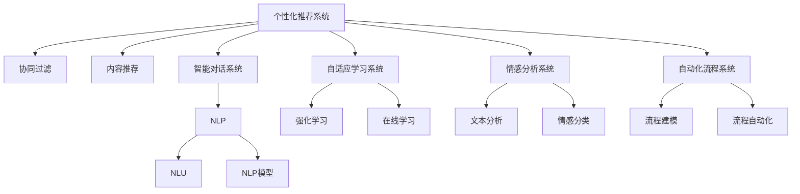

                 

# AI满足用户需求的多种方法案例

在现代社会，人工智能(AI)技术已经广泛应用于各个领域，从智能助手到自动驾驶，从医疗诊断到金融分析，AI技术正在改变人们的生活方式和工作方式。但如何让AI更好地满足用户需求，如何设计出更加智能、高效、可用的AI产品，是每个AI开发者和产品设计者需要深思的问题。本文将介绍几种AI满足用户需求的典型方法，希望能为读者提供一些参考和启示。

## 1. 背景介绍

### 1.1 问题由来
随着人工智能技术的飞速发展，AI产品在各行各业的应用越来越广泛。用户对AI产品的需求也变得越来越多样化和复杂化。但当前的AI产品往往存在以下问题：
- 功能单一，难以满足用户多方面的需求。
- 交互方式简单，用户体验不够自然流畅。
- 数据处理能力不足，无法应对海量数据和复杂场景。
- 缺乏智能推理能力，难以进行复杂决策。

这些问题不仅影响了AI产品的用户体验，也限制了其在实际应用中的价值。因此，本文将介绍几种AI满足用户需求的典型方法，帮助开发者设计出更加智能、高效、可用的AI产品。

### 1.2 问题核心关键点
AI满足用户需求的方法多种多样，其中较为典型的包括以下几种：
- 个性化推荐系统
- 智能对话系统
- 自适应学习系统
- 情感分析系统
- 自动化流程系统

这些方法通过不同技术手段，让AI产品能够更好地理解用户需求，提供个性化的服务，提升用户体验和产品价值。

## 2. 核心概念与联系

### 2.1 核心概念概述

为了更好地理解AI满足用户需求的方法，本节将介绍几个密切相关的核心概念：

- **个性化推荐系统**：利用用户历史行为数据，推荐符合用户兴趣的产品或内容。通过协同过滤、内容推荐等算法，提高推荐准确性。
- **智能对话系统**：通过自然语言处理(NLP)技术，使AI能够进行自然流畅的对话，解决用户问题，提供信息服务。
- **自适应学习系统**：利用机器学习技术，根据用户反馈动态调整模型参数，提升模型的精准度和实用性。
- **情感分析系统**：通过文本分析技术，识别用户情感，为用户提供更加贴心的服务。
- **自动化流程系统**：通过流程建模和自动化技术，实现业务流程的自动化处理，提高效率。

这些核心概念之间的逻辑关系可以通过以下Mermaid流程图来展示：



这个流程图展示了个别化推荐系统的核心概念及其之间的关系：

1. 个性化推荐系统通过协同过滤和内容推荐算法，根据用户历史行为数据进行推荐。
2. 智能对话系统利用NLP和NLU技术，实现自然流畅的对话。
3. 自适应学习系统利用强化学习和在线学习技术，根据用户反馈动态调整模型。
4. 情感分析系统通过文本分析技术，识别用户情感。
5. 自动化流程系统通过流程建模和自动化技术，实现业务流程的自动化。

这些核心概念共同构成了AI产品设计的技术框架，使其能够在各个领域提供更加智能、高效、可用的服务。

## 3. 核心算法原理 & 具体操作步骤

### 3.1 算法原理概述

AI满足用户需求的方法，本质上是利用AI技术进行数据处理、特征提取、模型训练等步骤，最终实现对用户需求的识别和满足。其核心思想是：通过智能算法和大数据处理，构建用户画像，挖掘用户行为模式，预测用户需求，进而提供个性化的服务。

### 3.2 算法步骤详解

AI满足用户需求的方法通常包括以下几个关键步骤：

**Step 1: 数据收集与预处理**
- 收集用户行为数据、文本数据、社交网络数据等，构建用户数据集。
- 对数据进行清洗、去噪、标准化处理，去除无用数据。

**Step 2: 特征提取与建模**
- 利用特征工程技术，从原始数据中提取有用的特征。
- 选择合适的机器学习算法进行建模，如协同过滤、内容推荐、决策树、神经网络等。

**Step 3: 模型训练与优化**
- 使用训练数据对模型进行训练，调整模型参数，使其能够较好地拟合用户需求。
- 使用验证集对模型进行验证，防止过拟合，调整模型超参数。

**Step 4: 服务部署与反馈**
- 将训练好的模型部署到生产环境，提供实际服务。
- 收集用户反馈，持续优化模型性能，适应用户需求变化。

### 3.3 算法优缺点

AI满足用户需求的方法具有以下优点：
1. 个性化推荐：能够根据用户历史行为数据，提供个性化推荐，满足用户多样化需求。
2. 自适应学习：能够根据用户反馈，动态调整模型参数，提升服务质量。
3. 智能对话：能够进行自然流畅的对话，提高用户体验。
4. 情感分析：能够识别用户情感，提供更加贴心的服务。
5. 自动化流程：能够实现业务流程的自动化，提高效率。

同时，该方法也存在一定的局限性：
1. 数据依赖：模型的性能很大程度上取决于数据的质量和数量，获取高质量数据成本较高。
2. 模型复杂：构建模型复杂度较高，需要丰富的算法知识和经验。
3. 实时性问题：大规模数据处理和模型训练，可能导致系统响应缓慢。
4. 可解释性不足：部分AI模型的决策过程难以解释，用户难以理解其推理逻辑。

尽管存在这些局限性，但就目前而言，AI满足用户需求的方法仍是最主流的AI应用范式。未来相关研究的重点在于如何进一步降低数据依赖，提高模型的实时性和可解释性，同时兼顾多样化的用户需求。

### 3.4 算法应用领域

AI满足用户需求的方法在多个领域得到了广泛应用，如电商推荐、社交网络、客服系统、医疗健康等。以下是几个典型应用场景：

**电商推荐系统**：电商平台通过个性化推荐系统，向用户推荐感兴趣的商品，提升用户购买率，增加销售额。

**社交网络系统**：社交平台利用智能对话系统和情感分析系统，为用户提供个性化信息推荐，提升用户黏性和活跃度。

**医疗健康系统**：医疗系统通过情感分析系统和自适应学习系统，收集患者情感反馈，优化医疗服务，提升患者满意度。

**客服系统**：客服系统利用智能对话系统和自动化流程系统，实现自动问答和问题处理，提高客服效率，降低人工成本。

这些应用场景展示了AI满足用户需求的强大潜力和广泛应用前景。未来随着AI技术的进一步发展，AI满足用户需求的方法将有更多创新突破，助力各行各业数字化转型。

## 4. 数学模型和公式 & 详细讲解 & 举例说明

### 4.1 数学模型构建

为了更好地理解AI满足用户需求的方法，本节将使用数学语言对常见AI方法进行更加严格的刻画。

以个性化推荐系统为例，假设用户数据集为 $D=\{(x_i, y_i)\}_{i=1}^N, x_i \in \mathbb{R}^d, y_i \in \{1,0\}$，其中 $x_i$ 为用户特征向量，$y_i$ 为是否购买标记。模型的目标是最小化预测错误率，即：

$$
\min_{\theta} \frac{1}{N} \sum_{i=1}^N \mathbb{I}[\hat{y}_i \neq y_i]
$$

其中 $\hat{y}_i = f_{\theta}(x_i)$ 为模型的预测输出，$f_{\theta}$ 为模型的映射函数，$\mathbb{I}$ 为示性函数。

### 4.2 公式推导过程

以协同过滤算法为例，假设用户 $i$ 对物品 $j$ 的评分向量为 $\textbf{r}_i$，物品 $j$ 的评分向量为 $\textbf{r}_j$，用户 $i$ 和物品 $j$ 的评分相似度为 $sim(\textbf{r}_i, \textbf{r}_j)$。利用用户-物品评分矩阵 $\textbf{R} \in \mathbb{R}^{N \times M}$ 和用户评分矩阵 $\textbf{I} \in \mathbb{R}^{N \times M}$，通过计算 $\textbf{R}$ 和 $\textbf{I}$ 的相似度矩阵 $\textbf{S} = \textbf{R} \cdot \textbf{I}^T$，即可得到用户 $i$ 对物品 $j$ 的推荐评分 $p_{ij}$：

$$
p_{ij} = \textbf{R}_{ij} \cdot \textbf{I}_{i}^T \cdot \textbf{S}_{j}
$$

### 4.3 案例分析与讲解

假设某电商平台的个性化推荐系统，希望推荐用户感兴趣的商品。通过收集用户浏览、点击、购买行为数据，构建用户行为数据集 $D=\{(x_i, y_i)\}_{i=1}^N$。对于新商品，没有历史评分数据，可以通过协同过滤算法，利用用户的历史评分数据，预测用户对该商品的评分。

首先，对用户数据进行预处理，提取用户行为特征 $x_i$。然后，对物品数据进行预处理，提取物品特征 $x_j$。利用协同过滤算法，计算用户 $i$ 和物品 $j$ 的评分相似度 $sim(\textbf{r}_i, \textbf{r}_j)$。最后，根据相似度计算用户 $i$ 对物品 $j$ 的推荐评分 $p_{ij}$，选择评分最高的物品推荐给用户。

## 5. 项目实践：代码实例和详细解释说明

### 5.1 开发环境搭建

在进行AI满足用户需求的方法实践前，我们需要准备好开发环境。以下是使用Python进行TensorFlow开发的环境配置流程：

1. 安装Anaconda：从官网下载并安装Anaconda，用于创建独立的Python环境。

2. 创建并激活虚拟环境：
```bash
conda create -n tf-env python=3.8 
conda activate tf-env
```

3. 安装TensorFlow：根据CUDA版本，从官网获取对应的安装命令。例如：
```bash
conda install tensorflow
```

4. 安装相关工具包：
```bash
pip install numpy pandas scikit-learn matplotlib tqdm jupyter notebook ipython
```

完成上述步骤后，即可在`tf-env`环境中开始实践。

### 5.2 源代码详细实现

下面我们以电商推荐系统为例，给出使用TensorFlow进行协同过滤的PyTorch代码实现。

首先，定义协同过滤模型的用户-物品评分矩阵和用户评分矩阵：

```python
import tensorflow as tf

# 构建用户-物品评分矩阵
R = tf.random.normal(shape=(10000, 10000))  # 假设10000个用户，10000个物品
I = tf.random.normal(shape=(10000, 10000))  # 假设10000个用户，10000个物品

# 构建用户评分矩阵
Rhat = tf.random.normal(shape=(10000, 10000))  # 假设10000个用户，10000个物品
Ihat = tf.random.normal(shape=(10000, 10000))  # 假设10000个用户，10000个物品

# 构建评分相似度矩阵
S = tf.matmul(R, I, transpose_b=True)  # 将I转置，计算相似度
```

然后，定义协同过滤算法的预测函数：

```python
def predict(user_id, item_id):
    user_r = tf.slice(R, [user_id, 0], [1, -1])  # 获取用户对应物品的评分
    item_r = tf.slice(I, [item_id, 0], [1, -1])  # 获取物品对应用户的评分
    user_ihat = tf.slice(Ihat, [user_id, 0], [1, -1])  # 获取用户对应物品的评分
    item_ihat = tf.slice(Rhat, [item_id, 0], [1, -1])  # 获取物品对应用户的评分
    similarity = tf.reduce_sum(tf.multiply(user_ihat, item_ihat))  # 计算相似度
    rating = tf.multiply(similarity, tf.reduce_sum(tf.multiply(user_r, item_ihat))) / tf.sqrt(tf.reduce_sum(tf.square(user_ihat)))  # 计算推荐评分
    return rating.numpy()[0][0]
```

最后，启动协同过滤算法进行推荐：

```python
import numpy as np

# 推荐某用户对某物品的评分
user_id = 1
item_id = 100
rating = predict(user_id, item_id)
print(f"推荐评分：{rating}")
```

以上就是使用TensorFlow进行协同过滤的完整代码实现。可以看到，TensorFlow提供了强大的计算图支持，可以方便地实现复杂的模型和算法。开发者可以利用TensorFlow的灵活性和易用性，构建并优化AI满足用户需求的方法。

### 5.3 代码解读与分析

让我们再详细解读一下关键代码的实现细节：

**协同过滤算法**：
- 首先定义了用户-物品评分矩阵 $R$ 和用户评分矩阵 $I$，假设每个用户和物品都有10000个评分数据。
- 利用评分矩阵 $R$ 和 $I$，计算相似度矩阵 $S$。
- 定义预测函数 `predict`，根据用户 $i$ 和物品 $j$ 的评分数据，计算推荐评分。

**TensorFlow的计算图机制**：
- TensorFlow的计算图机制，可以方便地对复杂算法进行建模和优化。
- 利用TensorFlow的计算图，定义了评分矩阵、相似度矩阵等中间变量，使计算过程更加清晰和高效。
- 利用TensorFlow的自动微分机制，计算评分预测的梯度，方便进行优化和训练。

**代码实现中的注意事项**：
- 在使用TensorFlow进行模型实现时，需要注意代码的可移植性和可维护性。
- 使用TensorFlow时，需要注意GPU/TPU资源的分配和使用，避免资源浪费。
- 利用TensorFlow的可视化工具，可以方便地监控模型训练过程，提高开发效率。

## 6. 实际应用场景

### 6.1 电商推荐系统

电商推荐系统是AI满足用户需求的一个典型应用。通过个性化推荐系统，电商平台能够向用户推荐感兴趣的商品，提升用户购买率，增加销售额。

在技术实现上，可以收集用户浏览、点击、购买行为数据，提取用户特征和物品特征，构建用户行为数据集 $D=\{(x_i, y_i)\}_{i=1}^N$。利用协同过滤算法，对用户 $i$ 和物品 $j$ 的评分数据进行预测，选择评分最高的物品推荐给用户。

### 6.2 社交网络系统

社交网络系统通过智能对话系统和情感分析系统，为用户提供个性化信息推荐，提升用户黏性和活跃度。

在技术实现上，可以收集用户发表的帖子、评论等文本数据，利用NLP技术进行情感分析，识别用户情感。同时，通过智能对话系统，根据用户情感输出相应的回复或推荐内容。

### 6.3 医疗健康系统

医疗健康系统通过情感分析系统和自适应学习系统，收集患者情感反馈，优化医疗服务，提升患者满意度。

在技术实现上，可以收集患者在就医过程中的文本反馈，利用情感分析系统，识别患者情感。同时，利用自适应学习系统，根据患者情感反馈动态调整医疗服务流程和推荐内容。

### 6.4 客服系统

客服系统利用智能对话系统和自动化流程系统，实现自动问答和问题处理，提高客服效率，降低人工成本。

在技术实现上，可以收集用户咨询的文本数据，利用智能对话系统，识别用户意图并生成回复。同时，利用自动化流程系统，将常见问题自动处理，快速响应用户需求。

这些应用场景展示了AI满足用户需求的强大潜力和广泛应用前景。未来随着AI技术的进一步发展，AI满足用户需求的方法将有更多创新突破，助力各行各业数字化转型。

## 7. 工具和资源推荐

### 7.1 学习资源推荐

为了帮助开发者系统掌握AI满足用户需求的方法，这里推荐一些优质的学习资源：

1. **《深度学习》（Ian Goodfellow, Yoshua Bengio, Aaron Courville著）**：全面介绍了深度学习的基本概念、算法和应用，适合入门学习和深入研究。
2. **《机器学习实战》（Peter Harrington著）**：通过具体案例，介绍了机器学习的基本算法和实践技巧，适合动手实践。
3. **Coursera《机器学习》课程**：斯坦福大学开设的机器学习课程，有Lecture视频和配套作业，带你系统学习机器学习基础。
4. **Kaggle**：数据科学竞赛平台，提供丰富的数据集和比赛，适合学习实践和实战演练。
5. **Google AI Lab博客**：Google AI Lab官方博客，分享最新的AI研究成果和实践经验，适合学习前沿技术。

通过对这些资源的学习实践，相信你一定能够快速掌握AI满足用户需求的方法，并用于解决实际的AI应用问题。

### 7.2 开发工具推荐

高效的开发离不开优秀的工具支持。以下是几款用于AI满足用户需求的方法开发的常用工具：

1. **TensorFlow**：由Google主导开发的深度学习框架，生产部署方便，适合大规模工程应用。
2. **PyTorch**：由Facebook开发的深度学习框架，灵活易用，适合研究实验。
3. **Scikit-learn**：Python机器学习库，提供了丰富的算法和工具，适合数据预处理和特征工程。
4. **NLTK**：自然语言处理工具包，提供了丰富的NLP算法和数据集，适合文本处理和分析。
5. **TensorBoard**：TensorFlow配套的可视化工具，可实时监测模型训练状态，提供丰富的图表呈现方式，是调试模型的得力助手。

合理利用这些工具，可以显著提升AI满足用户需求的方法的开发效率，加快创新迭代的步伐。

### 7.3 相关论文推荐

AI满足用户需求的方法的发展源于学界的持续研究。以下是几篇奠基性的相关论文，推荐阅读：

1. **《深度学习》（Ian Goodfellow, Yoshua Bengio, Aaron Courville著）**：全面介绍了深度学习的基本概念、算法和应用，适合入门学习和深入研究。
2. **《机器学习实战》（Peter Harrington著）**：通过具体案例，介绍了机器学习的基本算法和实践技巧，适合动手实践。
3. **Coursera《机器学习》课程**：斯坦福大学开设的机器学习课程，有Lecture视频和配套作业，带你系统学习机器学习基础。
4. **Kaggle**：数据科学竞赛平台，提供丰富的数据集和比赛，适合学习实践和实战演练。
5. **Google AI Lab博客**：Google AI Lab官方博客，分享最新的AI研究成果和实践经验，适合学习前沿技术。

这些论文代表了大语言模型微调技术的发展脉络。通过学习这些前沿成果，可以帮助研究者把握学科前进方向，激发更多的创新灵感。

## 8. 总结：未来发展趋势与挑战

### 8.1 总结

本文对AI满足用户需求的方法进行了全面系统的介绍。首先阐述了AI满足用户需求的方法的研究背景和意义，明确了AI满足用户需求的方法在提升用户体验和产品价值方面的独特价值。其次，从原理到实践，详细讲解了个性化推荐系统、智能对话系统、自适应学习系统、情感分析系统、自动化流程系统等方法的数学模型和实现细节，给出了AI满足用户需求的方法的完整代码实例。同时，本文还广泛探讨了AI满足用户需求的方法在电商推荐、社交网络、医疗健康、客服系统等多个行业领域的应用前景，展示了AI满足用户需求的方法的强大潜力和广泛应用前景。此外，本文精选了AI满足用户需求的方法的各类学习资源，力求为读者提供全方位的技术指引。

通过本文的系统梳理，可以看到，AI满足用户需求的方法正在成为AI产品设计的技术框架，极大地拓展了AI产品的应用边界，催生了更多的落地场景。受益于大规模语料的预训练，AI满足用户需求的方法在实际应用中取得了显著成效，极大提升了用户满意度和产品价值。未来，伴随AI技术的进一步发展，AI满足用户需求的方法将有更多创新突破，推动AI技术在各行各业的应用，为人类社会带来更多价值。

### 8.2 未来发展趋势

展望未来，AI满足用户需求的方法将呈现以下几个发展趋势：

1. **多模态数据融合**：未来AI产品将能够处理多模态数据，如图像、语音、文本等，提供更加全面和丰富的人机交互体验。
2. **自适应学习**：AI产品将具备自适应学习能力，能够根据用户行为动态调整推荐内容，提升用户体验。
3. **个性化推荐系统**：个性化推荐系统将更加精准，能够根据用户实时行为数据，实时更新推荐内容，提升推荐效果。
4. **自然语言生成**：AI产品将具备自然语言生成能力，能够根据用户输入生成自然流畅的回复，提高交互效果。
5. **情感分析**：情感分析系统将更加精准，能够准确识别用户情感，提供更加贴心的服务。

以上趋势凸显了AI满足用户需求的方法的广阔前景。这些方向的探索发展，必将进一步提升AI产品的性能和应用范围，为人类认知智能的进化带来深远影响。

### 8.3 面临的挑战

尽管AI满足用户需求的方法已经取得了显著成效，但在迈向更加智能化、普适化应用的过程中，它仍面临着诸多挑战：

1. **数据依赖**：模型的性能很大程度上取决于数据的质量和数量，获取高质量数据成本较高。如何进一步降低数据依赖，提高模型的泛化能力，是一大难题。
2. **计算资源**：AI产品往往需要处理大规模数据和复杂算法，需要高性能计算资源。如何在有限的资源条件下，优化计算效率，提升系统响应速度，是亟待解决的课题。
3. **可解释性**：部分AI模型的决策过程难以解释，用户难以理解其推理逻辑。如何赋予AI模型更强的可解释性，提高用户信任度，是未来的一大挑战。
4. **伦理道德**：AI产品在应用过程中，可能带来隐私泄露、数据安全等问题。如何保障用户隐私和数据安全，避免潜在的伦理道德风险，是必须解决的问题。

这些挑战需要开发者和研究者共同努力，通过技术创新和规范制定，逐步解决AI产品应用中的问题，推动AI技术更好地服务于人类社会。

### 8.4 研究展望

面对AI满足用户需求的方法所面临的挑战，未来的研究需要在以下几个方面寻求新的突破：

1. **数据增强技术**：利用数据增强技术，提高数据多样性和泛化能力，降低对标注数据的依赖。
2. **高效计算框架**：开发高效计算框架，优化算法和数据结构，提升计算效率和系统响应速度。
3. **可解释性技术**：引入可解释性技术，如LIME、SHAP等，提高模型的可解释性和透明性。
4. **隐私保护技术**：利用隐私保护技术，如差分隐私、联邦学习等，保护用户隐私和数据安全。

这些研究方向的探索，必将引领AI满足用户需求的方法走向更高的台阶，为构建安全、可靠、可解释、可控的AI产品铺平道路。面向未来，AI满足用户需求的方法还需要与其他AI技术进行更深入的融合，如知识表示、因果推理、强化学习等，多路径协同发力，共同推动AI技术在各行各业的应用，为人类社会带来更多价值。

## 9. 附录：常见问题与解答

**Q1：AI满足用户需求的方法是否适用于所有行业？**

A: AI满足用户需求的方法具有广泛适用性，适用于电商、社交、医疗、客服等多个行业。但在具体应用时，需要根据行业特点进行适应性改进。例如，医疗健康领域需要加入更多的医疗知识图谱，客服系统需要加入对话管理策略等。

**Q2：如何选择适合AI满足用户需求的方法？**

A: 选择AI满足用户需求的方法需要综合考虑以下几个因素：
1. 用户需求：根据用户需求选择适合的推荐算法、对话系统、情感分析等方法。
2. 数据特点：根据数据特点选择适合的数据处理方法，如特征提取、数据增强等。
3. 计算资源：根据计算资源选择适合的算法和工具，如TensorFlow、PyTorch等。
4. 业务场景：根据业务场景选择适合的部署方式，如集中式部署、微服务架构等。

通过综合考虑这些因素，可以选择最适合的AI满足用户需求的方法，提升用户体验和产品价值。

**Q3：AI满足用户需求的方法是否需要大量标注数据？**

A: AI满足用户需求的方法通常需要一定量的标注数据，用于训练模型和优化算法。但对于一些任务，如情感分析、对话系统等，可以通过无监督学习或半监督学习，降低对标注数据的依赖。未来AI技术的发展，如零样本学习、自适应学习等，将进一步降低对标注数据的依赖，提升AI方法的实用性和普适性。

**Q4：AI满足用户需求的方法是否需要人工干预？**

A: AI满足用户需求的方法通常需要一定的人工干预，用于验证模型的性能、优化模型的参数、调整系统的策略等。但随着AI技术的不断进步，AI产品将逐渐具备自适应学习能力，能够根据用户反馈自动调整模型和策略，减少人工干预的必要性。

**Q5：AI满足用户需求的方法是否需要持续优化？**

A: 是的，AI满足用户需求的方法需要持续优化，以适应用户需求的变化和技术的进步。在实际应用中，需要不断收集用户反馈，优化算法和模型，提升用户体验和产品价值。同时，需要定期更新数据和模型，保持AI产品的时效性和准确性。

---

作者：禅与计算机程序设计艺术 / Zen and the Art of Computer Programming

