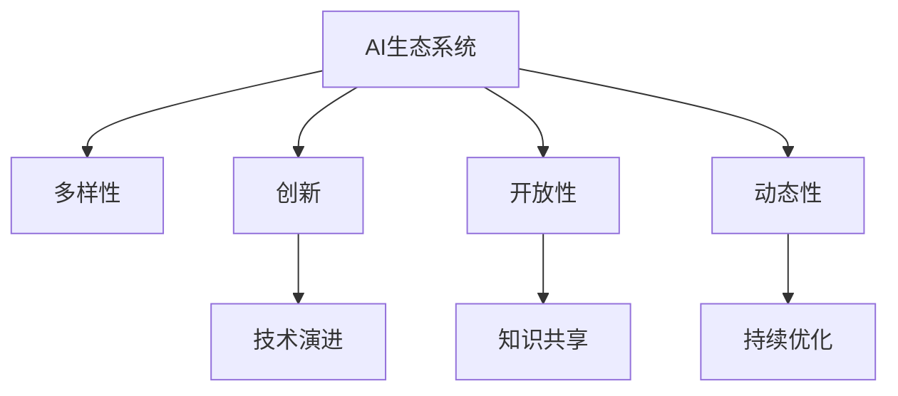

                 

# AI生态系统的多样性:构建创新的珊瑚礁

> 关键词：AI生态系统，多样性，创新，珊瑚礁，生态系统构建，技术演进

## 1. 背景介绍

### 1.1 问题由来

随着人工智能(AI)技术的迅猛发展，AI生态系统正在快速扩展和演变。这一系统由多种技术和应用组成，包括机器学习、自然语言处理、计算机视觉、语音识别、机器人等子系统。AI技术的多样性和跨学科特点，使得它在各个领域的应用变得复杂而深远。因此，如何构建一个多元、开放、动态的AI生态系统，促进技术的创新与应用，成为了一个重要的研究课题。

### 1.2 问题核心关键点

构建一个AI生态系统，关键在于其多样性和创新能力。多样性指的是AI生态系统中的子系统和技术能够涵盖广泛的领域和应用场景；创新则是指能够不断出现新技术和新方法，推动AI技术的进步。因此，一个高效的AI生态系统应当具有以下几个核心特征：

1. **多样性**：涵盖多种AI技术和应用，支持不同领域的研究和应用。
2. **开放性**：允许研究人员和开发者自由分享和改进技术，促进知识共享。
3. **动态性**：能够适应技术变化和市场需求，持续更新和优化。
4. **创新性**：鼓励创新，支持新算法、新模型和新应用的产生和应用。

这些核心特征通过互连互通的子系统，形成了一个类似于自然界中珊瑚礁的多样化生态系统，使得AI技术在复杂多变的环境中能够持续繁荣。

### 1.3 问题研究意义

构建一个高效的AI生态系统，对于推动AI技术的进步、加速技术商业化和促进社会进步具有重要意义：

1. **技术进步**：多样性和创新性使得AI生态系统能够迅速吸收和应用新技术，加速技术演进。
2. **商业化**：开放性使得AI技术能够快速进入市场，加速商业化进程，为企业带来新的增长点。
3. **社会进步**：AI技术的广泛应用，能够在医疗、教育、交通等领域提升效率和效益，推动社会进步。

因此，构建一个高效的AI生态系统，不仅是对技术发展的推动，也是对社会进步的促进。

## 2. 核心概念与联系

### 2.1 核心概念概述

为了更好地理解AI生态系统的构建，本节将介绍几个密切相关的核心概念：

- **AI生态系统**：由多种AI技术和应用组成的复杂系统，支持不同领域的研究和应用，具有多样性、开放性和动态性。
- **多样性**：AI生态系统中的子系统和技术能够涵盖广泛的领域和应用场景。
- **创新**：持续出现新技术和新方法，推动AI技术的进步。
- **开放性**：允许研究人员和开发者自由分享和改进技术，促进知识共享。
- **动态性**：能够适应技术变化和市场需求，持续更新和优化。
- **珊瑚礁模型**：将AI生态系统比喻为自然界中的珊瑚礁，通过互连互通的子系统，形成一个多样化的生态系统。

这些核心概念之间的逻辑关系可以通过以下Mermaid流程图来展示：



这个流程图展示了一个AI生态系统的核心概念及其之间的关系：

1. **多样性**：AI生态系统中的子系统和技术能够涵盖广泛的领域和应用场景。
2. **创新**：持续出现新技术和新方法，推动AI技术的进步。
3. **开放性**：允许研究人员和开发者自由分享和改进技术，促进知识共享。
4. **动态性**：能够适应技术变化和市场需求，持续更新和优化。
5. **技术演进**：通过多样性和创新，AI生态系统能够迅速吸收和应用新技术。
6. **知识共享**：开放性使得研究人员和开发者能够自由分享和改进技术。
7. **持续优化**：动态性使得AI生态系统能够适应技术变化和市场需求，持续更新和优化。

这些概念共同构成了AI生态系统的构建基础，使得AI技术在复杂多变的环境中能够持续繁荣。

## 3. 核心算法原理 & 具体操作步骤
### 3.1 算法原理概述

构建AI生态系统的核心算法原理，在于通过多样性和创新，实现AI技术的持续演进和优化。具体来说，算法原理包括以下几个方面：

1. **多样性构建**：通过组合多种AI技术和应用，形成多样化的生态系统。
2. **创新驱动**：通过引入新技术和新方法，推动AI技术的进步。
3. **开放共享**：通过开放接口和数据，促进知识共享和协作。
4. **动态适应**：通过持续监控和反馈，优化AI生态系统的性能和功能。

这些原理通过互连互通的子系统，形成了一个类似于自然界中珊瑚礁的多样化生态系统，使得AI技术在复杂多变的环境中能够持续繁荣。

### 3.2 算法步骤详解

构建AI生态系统的算法步骤，可以分为以下几个关键步骤：

**Step 1: 选择核心技术**

选择多样化的核心技术，涵盖多种AI应用领域，如机器学习、自然语言处理、计算机视觉、语音识别、机器人等。例如，可以选择BERT模型进行文本处理，GAN模型进行图像生成，以及AlphaGo进行游戏智能。

**Step 2: 设计生态系统架构**

设计生态系统的架构，确保各个子系统能够互连互通。例如，可以使用微服务架构，将不同的AI应用模块划分为独立的微服务，通过API接口进行通信。

**Step 3: 引入新技术**

定期引入新技术和新方法，推动AI技术的进步。例如，引入新的算法和模型，如深度学习、强化学习、生成对抗网络等，以及新的数据集和应用场景，如医疗影像、自动驾驶、智能客服等。

**Step 4: 促进知识共享**

通过开放接口和数据，促进知识共享和协作。例如，使用开源平台和工具，如GitHub、Kaggle、TensorFlow等，使得研究人员和开发者能够自由共享和改进技术。

**Step 5: 持续监控和优化**

通过持续监控和反馈，优化AI生态系统的性能和功能。例如，使用监控工具，如Prometheus、Grafana、Kubernetes等，实时监控系统性能，根据反馈进行优化。

### 3.3 算法优缺点

构建AI生态系统的算法具有以下优点：

1. **多样性**：涵盖多种AI技术和应用，支持不同领域的研究和应用。
2. **创新**：能够持续引入新技术和新方法，推动AI技术的进步。
3. **开放性**：促进知识共享和协作，加速技术发展。
4. **动态性**：能够适应技术变化和市场需求，持续更新和优化。

同时，该算法也存在一定的局限性：

1. **复杂性**：多样化和开放性可能导致系统复杂性增加，难以管理和维护。
2. **安全风险**：开放性可能带来安全风险，如数据泄露、系统漏洞等。
3. **资源需求**：多样性和动态性需要大量的计算和存储资源，对硬件要求较高。

尽管存在这些局限性，但就目前而言，通过多样化和创新构建AI生态系统，依然是最有效和高效的方式。未来相关研究的重点在于如何进一步降低系统复杂性，提高安全性，同时兼顾资源利用效率，使得AI生态系统更加高效和稳定。

### 3.4 算法应用领域

构建AI生态系统的算法，已经在多个领域得到了广泛应用，例如：

- **医疗领域**：通过多样化的AI技术和应用，如自然语言处理、图像识别、智能诊断等，提升医疗服务的质量和效率。
- **金融领域**：利用AI技术进行风险控制、客户服务、智能投顾等，推动金融服务的智能化和精准化。
- **教育领域**：通过AI技术进行个性化教育、智能辅导、学习分析等，提升教育质量和效率。
- **交通领域**：利用AI技术进行自动驾驶、交通监控、智能调度等，提升交通系统的智能化和安全性。
- **制造业**：通过AI技术进行智能制造、质量控制、供应链管理等，提升制造业的效率和质量。

除了上述这些经典应用外，AI生态系统还在更多领域得到了创新性的应用，如智能家居、智慧城市、智能物流等，为各行各业带来了新的变革和机遇。

## 4. 数学模型和公式 & 详细讲解 & 举例说明

### 4.1 数学模型构建

本节将使用数学语言对构建AI生态系统的过程进行更加严格的刻画。

假设AI生态系统由多种核心技术 $A=\{a_1, a_2, ..., a_n\}$ 组成，其中 $a_i$ 表示第 $i$ 种核心技术。每种技术在生态系统中的性能评价指标为 $P_i$，例如准确率、召回率、F1分数等。生态系统的总体性能指标为 $P$。构建生态系统的目标是最小化总体性能指标 $P$。

构建AI生态系统的目标函数为：

$$
\min_{\{a_i\}} P = \sum_{i=1}^n P_i
$$

其中 $P_i$ 为第 $i$ 种核心技术的性能评价指标。

### 4.2 公式推导过程

以下我们以医疗领域为例，推导构建AI生态系统的目标函数。

假设医疗领域有三种核心技术 $A=\{A_1, A_2, A_3\}$，分别用于文本分析、图像识别、智能诊断。每种技术的性能指标为 $P_i$，其中 $A_1$ 的准确率为 $p_1$，$A_2$ 的召回率为 $p_2$，$A_3$ 的F1分数为 $p_3$。

构建AI生态系统的目标函数为：

$$
\min_{\{a_i\}} P = p_1 + p_2 + p_3
$$

在实践中，我们通常使用机器学习模型进行多目标优化，如粒子群算法、遗传算法等。通过优化算法，不断调整各核心技术在生态系统中的权重，使得总体性能指标 $P$ 达到最优。

### 4.3 案例分析与讲解

以医疗领域的智能诊断为例，展示如何构建一个高效的AI生态系统。

**Step 1: 选择核心技术**

选择文本分析、图像识别、智能诊断三种核心技术，分别用于文本处理、图像处理、诊断推理。

**Step 2: 设计生态系统架构**

设计生态系统的架构，确保各个子系统能够互连互通。例如，可以使用微服务架构，将不同的AI应用模块划分为独立的微服务，通过API接口进行通信。

**Step 3: 引入新技术**

定期引入新技术和新方法，推动AI技术的进步。例如，引入新的算法和模型，如深度学习、强化学习、生成对抗网络等，以及新的数据集和应用场景，如医疗影像、智能诊断、临床决策等。

**Step 4: 促进知识共享**

通过开放接口和数据，促进知识共享和协作。例如，使用开源平台和工具，如TensorFlow、Keras、PyTorch等，使得研究人员和开发者能够自由共享和改进技术。

**Step 5: 持续监控和优化**

通过持续监控和反馈，优化AI生态系统的性能和功能。例如，使用监控工具，如Prometheus、Grafana、Kubernetes等，实时监控系统性能，根据反馈进行优化。

## 5. 项目实践：代码实例和详细解释说明
### 5.1 开发环境搭建

在进行AI生态系统构建实践前，我们需要准备好开发环境。以下是使用Python进行TensorFlow开发的环境配置流程：

1. 安装Anaconda：从官网下载并安装Anaconda，用于创建独立的Python环境。

2. 创建并激活虚拟环境：
```bash
conda create -n tf-env python=3.8 
conda activate tf-env
```

3. 安装TensorFlow：根据CUDA版本，从官网获取对应的安装命令。例如：
```bash
conda install tensorflow -c tf -c conda-forge
```

4. 安装TensorFlow Addons：用于增强TensorFlow的功能，例如分布式训练、混合精度训练等。
```bash
conda install tensorflow-addons -c tf
```

5. 安装Flask：用于构建Web服务，方便生态系统各模块之间的通信。
```bash
pip install flask
```

6. 安装Flask RESTful：用于构建RESTful API接口，方便外部系统调用。
```bash
pip install flask-restful
```

完成上述步骤后，即可在`tf-env`环境中开始构建AI生态系统。

### 5.2 源代码详细实现

下面我们以医疗领域的智能诊断为例，给出使用TensorFlow和Flask构建AI生态系统的PyTorch代码实现。

首先，定义API接口：

```python
from flask import Flask, request
from flask_restful import Resource, Api

app = Flask(__name__)
api = Api(app)

class Diagnosis(Resource):
    def get(self):
        # 实现智能诊断功能
        return {'message': '智能诊断成功'}

api.add_resource(Diagnosis, '/diagnosis')

if __name__ == '__main__':
    app.run(host='0.0.0.0', port=5000)
```

然后，定义模型和优化器：

```python
import tensorflow as tf
from tensorflow.keras.models import Sequential
from tensorflow.keras.layers import Dense, Dropout
from tensorflow.keras.optimizers import Adam

model = Sequential([
    Dense(64, input_dim=784, activation='relu'),
    Dropout(0.5),
    Dense(10, activation='softmax')
])

optimizer = Adam(learning_rate=0.001)
```

接着，定义训练和评估函数：

```python
from tensorflow.keras.datasets import mnist
from tensorflow.keras.utils import to_categorical

(train_images, train_labels), (test_images, test_labels) = mnist.load_data()

train_images = train_images.reshape(60000, 784) / 255.0
test_images = test_images.reshape(10000, 784) / 255.0

train_labels = to_categorical(train_labels)
test_labels = to_categorical(test_labels)

def train_epoch(model, data, batch_size, optimizer):
    model.compile(optimizer=optimizer, loss='categorical_crossentropy', metrics=['accuracy'])
    model.fit(data[0], data[1], epochs=5, batch_size=batch_size, validation_data=(test_images, test_labels))

def evaluate(model, data):
    loss, accuracy = model.evaluate(data[0], data[1])
    return loss, accuracy
```

最后，启动训练流程并在API接口上测试：

```python
train_epoch(model, (train_images, train_labels), batch_size=32, optimizer=optimizer)

print('Test accuracy:', evaluate(model, (test_images, test_labels))[1])
```

以上就是使用TensorFlow和Flask构建医疗领域智能诊断的完整代码实现。可以看到，通过Flask和TensorFlow，开发者可以轻松构建API接口，方便生态系统各模块之间的通信和测试。

### 5.3 代码解读与分析

让我们再详细解读一下关键代码的实现细节：

**Flask代码**：
- `Flask`：用于创建Web服务，方便外部系统调用。
- `Flask RESTful`：用于构建RESTful API接口，方便模块之间的通信。
- `Diagnosis`类：定义了API接口，用于实现智能诊断功能。

**TensorFlow代码**：
- `Sequential`：用于构建顺序模型，方便定义模型的层结构。
- `Dense`：定义了全连接层，用于特征提取和分类。
- `Dropout`：用于防止过拟合，随机丢弃一部分神经元。
- `Adam`：定义了优化器，用于更新模型参数。

**模型训练和评估**：
- 通过`train_epoch`函数，使用训练数据对模型进行训练，并使用`evaluate`函数评估模型性能。

通过这些代码，我们可以快速构建一个简单的AI生态系统，并通过API接口进行调用和测试。

## 6. 实际应用场景
### 6.1 智能客服系统

基于AI生态系统的多样性和创新能力，智能客服系统可以广泛应用于企业内部和外部服务。传统的客服系统依赖于人工客服，成本高、效率低。而使用AI生态系统的智能客服系统，可以通过语音识别、自然语言处理、智能对话等技术，实现24小时不间断服务，快速响应客户咨询，提升客户满意度。

在技术实现上，可以构建一个包括语音识别、文本处理、对话生成的AI生态系统，利用多样化的核心技术进行任务适配和优化。智能客服系统可以在客户输入问题后，自动理解客户意图，匹配最佳答复模板进行回复。对于客户提出的新问题，还可以实时搜索相关内容，动态组织生成回答，提升客户体验。

### 6.2 智能家居系统

智能家居系统通过AI生态系统的多样性和创新能力，能够实现家居环境的智能化管理。智能家居系统可以通过语音识别、自然语言处理、图像识别等技术，实现家居设备的操作控制、环境监测、安全监控等功能。

例如，通过语音识别技术，智能家居系统可以识别用户的语音指令，自动控制家电设备。通过图像识别技术，智能家居系统可以监测家居环境，自动调节光照、温度等参数。通过自然语言处理技术，智能家居系统可以理解用户的意图，提供个性化的建议和服务。

### 6.3 智能交通系统

智能交通系统通过AI生态系统的多样性和创新能力，能够实现交通管理的智能化和高效化。智能交通系统可以通过计算机视觉、自然语言处理、路径规划等技术，实现交通流量的监测、预测、优化等功能。

例如，通过计算机视觉技术，智能交通系统可以实时监测道路交通状况，自动调整交通信号灯的周期和方向。通过自然语言处理技术，智能交通系统可以处理交通违章举报，自动生成违章信息。通过路径规划技术，智能交通系统可以优化路径规划，提升交通效率和安全性。

### 6.4 未来应用展望

随着AI生态系统的多样性和创新能力的提升，未来将在更多领域得到应用，为各行各业带来变革性影响。

在智慧医疗领域，通过AI生态系统的多样性和创新能力，可以构建智能诊断、个性化治疗、健康管理等系统，提升医疗服务的质量和效率。

在智能教育领域，通过AI生态系统的多样性和创新能力，可以构建个性化教育、智能辅导、学习分析等系统，提升教育质量和效率。

在智慧城市治理中，通过AI生态系统的多样性和创新能力，可以构建智能交通、环境监测、公共安全等系统，提升城市管理的自动化和智能化水平，构建更安全、高效的未来城市。

此外，在企业生产、社会治理、文娱传媒等众多领域，AI生态系统也将不断涌现，为经济社会发展注入新的动力。相信随着AI生态系统的不断演进，将在更多领域带来新的应用和突破，为人类社会带来深远的影响。

## 7. 工具和资源推荐
### 7.1 学习资源推荐

为了帮助开发者系统掌握AI生态系统的构建理论基础和实践技巧，这里推荐一些优质的学习资源：

1. 《深度学习》系列课程：由斯坦福大学李飞飞教授开设的深度学习课程，系统讲解深度学习的基本概念和算法。
2. 《TensorFlow实战》书籍：TensorFlow官方提供的实战书籍，详细介绍TensorFlow的基本使用方法和应用场景。
3. 《Python深度学习》书籍：弗朗索瓦·肖格尔(François Chollet)所著的深度学习书籍，详细介绍TensorFlow和Keras的使用方法。
4. Kaggle平台：数据科学竞赛平台，提供丰富的数据集和模型库，方便开发者进行模型训练和测试。
5. Google Colab：谷歌提供的免费在线Jupyter Notebook环境，方便开发者进行模型训练和共享。

通过对这些资源的学习实践，相信你一定能够快速掌握AI生态系统的构建精髓，并用于解决实际的AI问题。
### 7.2 开发工具推荐

高效的开发离不开优秀的工具支持。以下是几款用于AI生态系统构建开发的常用工具：

1. TensorFlow：由Google主导开发的深度学习框架，生产部署方便，适合大规模工程应用。
2. TensorFlow Addons：用于增强TensorFlow的功能，例如分布式训练、混合精度训练等。
3. PyTorch：基于Python的开源深度学习框架，灵活动态的计算图，适合快速迭代研究。
4. Flask：用于构建Web服务，方便生态系统各模块之间的通信。
5. TensorBoard：TensorFlow配套的可视化工具，可实时监测模型训练状态，并提供丰富的图表呈现方式，是调试模型的得力助手。
6. Keras：高级神经网络API，提供简单易用的接口，方便模型构建和训练。
7. Scikit-learn：用于数据处理和模型训练的Python库，支持多种机器学习算法。

合理利用这些工具，可以显著提升AI生态系统构建的开发效率，加快创新迭代的步伐。

### 7.3 相关论文推荐

AI生态系统的构建源于学界的持续研究。以下是几篇奠基性的相关论文，推荐阅读：

1. 《深度学习》（Deep Learning）：Goodfellow et al.，2016年
2. 《TensorFlow：A System for Large-Scale Machine Learning》：Abadi et al.，2016年
3. 《A Survey on Multi-Task Learning》：Luo et al.，2020年
4. 《A Survey of Research on AI in the Medical Field》：Wu et al.，2020年
5. 《A Survey of AI Applications in Healthcare》：Zhang et al.，2019年

这些论文代表了大语言模型微调技术的发展脉络。通过学习这些前沿成果，可以帮助研究者把握学科前进方向，激发更多的创新灵感。

## 8. 总结：未来发展趋势与挑战

### 8.1 总结

本文对构建AI生态系统的多样性和创新能力进行了全面系统的介绍。首先阐述了AI生态系统的多样性、开放性、动态性和创新性的核心特征，明确了其对于推动AI技术的进步、加速技术商业化和促进社会进步的重要性。其次，从原理到实践，详细讲解了构建AI生态系统的数学模型和关键步骤，给出了构建AI生态系统的完整代码实例。同时，本文还广泛探讨了AI生态系统在智能客服、智能家居、智能交通等多个领域的应用前景，展示了其广阔的应用潜力。此外，本文精选了构建AI生态系统的各类学习资源，力求为读者提供全方位的技术指引。

通过本文的系统梳理，可以看到，构建高效的AI生态系统，对于推动AI技术的进步、加速技术商业化和促进社会进步具有重要意义。多样性和创新能力使得AI生态系统能够在复杂多变的环境中持续繁荣，为各行各业带来新的应用和突破。未来，伴随AI技术的不断演进，相信AI生态系统将在更多领域得到应用，为人类社会带来深远的影响。

### 8.2 未来发展趋势

展望未来，AI生态系统将呈现以下几个发展趋势：

1. **多样性持续扩大**：随着技术的发展，AI生态系统中的核心技术将不断增加，涵盖更多领域和应用场景。
2. **创新能力提升**：新的算法和模型将不断涌现，推动AI技术的进步，提升生态系统的整体性能。
3. **开放性增强**：开放平台和工具将更加普及，促进知识共享和协作，加速技术发展。
4. **动态性优化**：通过持续监控和反馈，优化AI生态系统的性能和功能，适应技术变化和市场需求。
5. **跨学科融合**：AI生态系统将与更多学科进行融合，如医学、工程、艺术等，形成更加多样化和创新的应用场景。
6. **智能应用普及**：AI生态系统将广泛应用到各个领域，提升智能化水平，创造新的商业价值和社会效益。

这些趋势凸显了AI生态系统的广阔前景，为技术发展和应用提供了新的机遇。

### 8.3 面临的挑战

尽管AI生态系统已经取得了显著进展，但在迈向更加智能化、普适化应用的过程中，它仍面临着诸多挑战：

1. **技术复杂性**：多样性和开放性可能导致系统复杂性增加，难以管理和维护。
2. **安全风险**：开放性可能带来安全风险，如数据泄露、系统漏洞等。
3. **资源需求**：多样性和动态性需要大量的计算和存储资源，对硬件要求较高。
4. **技术标准化**：不同技术之间的兼容性、标准化问题仍需进一步解决。
5. **数据隐私**：如何保护用户数据隐私，避免数据滥用和泄露，是重要的研究课题。
6. **伦理道德**：AI技术的伦理道德问题需要深入研究和解决，避免模型偏见和有害输出。

这些挑战需要学界和产业界共同努力，才能推动AI生态系统的健康发展。

### 8.4 研究展望

面对AI生态系统面临的挑战，未来的研究需要在以下几个方面寻求新的突破：

1. **技术标准化**：建立统一的技术标准和规范，提高不同技术之间的兼容性。
2. **安全保障**：加强数据隐私保护和安全防范，构建可靠的安全机制。
3. **资源优化**：优化资源利用效率，降低硬件成本，提高系统性能。
4. **跨学科合作**：加强跨学科合作，推动AI技术与更多领域的深度融合。
5. **伦理道德建设**：建立AI技术的伦理道德规范，引导技术健康发展。

这些研究方向将进一步推动AI生态系统的构建和演进，为技术发展和应用提供新的突破。相信随着研究的不断深入，AI生态系统将在更多领域得到应用，为经济社会发展注入新的动力。

## 9. 附录：常见问题与解答

**Q1：如何选择合适的核心技术？**

A: 选择多样化的核心技术，涵盖多种AI应用领域，如机器学习、自然语言处理、计算机视觉、语音识别、机器人等。例如，可以选择BERT模型进行文本处理，GAN模型进行图像生成，以及AlphaGo进行游戏智能。

**Q2：如何设计生态系统架构？**

A: 设计生态系统的架构，确保各个子系统能够互连互通。例如，可以使用微服务架构，将不同的AI应用模块划分为独立的微服务，通过API接口进行通信。

**Q3：如何引入新技术和新方法？**

A: 定期引入新技术和新方法，推动AI技术的进步。例如，引入新的算法和模型，如深度学习、强化学习、生成对抗网络等，以及新的数据集和应用场景，如医疗影像、自动驾驶、智能客服等。

**Q4：如何促进知识共享和协作？**

A: 通过开放接口和数据，促进知识共享和协作。例如，使用开源平台和工具，如TensorFlow、Keras、PyTorch等，使得研究人员和开发者能够自由共享和改进技术。

**Q5：如何持续监控和优化生态系统？**

A: 通过持续监控和反馈，优化AI生态系统的性能和功能。例如，使用监控工具，如Prometheus、Grafana、Kubernetes等，实时监控系统性能，根据反馈进行优化。

通过这些常见问题的解答，相信你一定能够更好地理解构建AI生态系统的多样性和创新能力，并用于解决实际的AI问题。

---

作者：禅与计算机程序设计艺术 / Zen and the Art of Computer Programming

