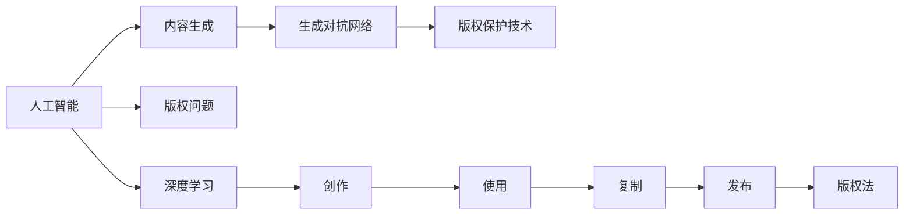

                 

# AI生成内容:创意与版权的新挑战

> 关键词：人工智能,内容生成,版权问题,创意保护,版权管理,深度学习,生成对抗网络,版权保护技术

## 1. 背景介绍

随着人工智能技术的迅猛发展，尤其是深度学习和生成对抗网络(GANs)的兴起，内容生成（如文本、图像、音乐、视频等）领域出现了一些新趋势。AI生成内容不仅能快速生成高质量的创意作品，还能以极高的性价比满足各类需求。然而，随着AI生成内容的应用越来越广泛，与之伴随而来的版权问题也愈加复杂。

## 2. 核心概念与联系

### 2.1 核心概念概述

在讨论AI生成内容的版权问题前，我们首先需要了解一些关键概念：

- **人工智能(Artificial Intelligence, AI)**：一种能够通过算法和计算，模拟人类智能行为的科技。
- **内容生成(Content Generation)**：使用AI技术自动生成文本、图像、音乐等形式的创意作品。
- **版权问题(Copyright Issues)**：与原创作品有关的所有法律权利问题，包括创作、使用、复制、发布等方面的权利。
- **生成对抗网络(Generative Adversarial Networks, GANs)**：一种由两个深度神经网络组成的技术框架，其中生成器网络尝试产生逼真的内容，而判别器网络则试图区分生成的内容与真实内容。

这些概念之间存在复杂的相互作用，共同构成了AI生成内容版权问题的基本框架。

### 2.2 核心概念原理和架构的 Mermaid 流程图



这个流程图展示了核心概念之间的联系。人工智能和深度学习驱动了内容生成技术，而生成对抗网络在其中起到了关键作用。同时，版权保护技术被用于保护这些生成内容，而版权法则界定了创作、使用、复制、发布等方面的法律权益。

## 3. 核心算法原理 & 具体操作步骤

### 3.1 算法原理概述

AI生成内容的核心算法原理可以概括为以下几点：

- **生成器网络(Generator)**：基于深度神经网络架构，接受随机噪声作为输入，生成逼真的内容。
- **判别器网络(Discriminator)**：同样基于深度神经网络架构，接收真实内容或生成的内容作为输入，判断其真实性。
- **对抗训练(Adversarial Training)**：通过交替优化生成器和判别器，生成器试图欺骗判别器，而判别器则试图识别出生成内容，最终生成器能够生成与真实内容无法区分的结果。

### 3.2 算法步骤详解

AI生成内容的具体操作步骤如下：

1. **数据准备**：收集用于训练生成器的数据集，例如电影、音乐、图像、文本等。
2. **网络设计**：设计生成器和判别器的深度神经网络架构，一般使用卷积神经网络(CNN)、循环神经网络(RNN)等。
3. **训练过程**：交替训练生成器和判别器，逐步提升生成器的生成质量，使判别器难以区分真实与生成内容。
4. **模型评估**：使用测试集评估生成器的生成效果，确保其生成的内容与真实内容相似。
5. **内容生成**：使用训练好的生成器生成新的内容，应用到实际场景中。

### 3.3 算法优缺点

AI生成内容的算法具有以下优点：

- **高效性**：可以快速生成大量高质量内容，缩短创作时间。
- **灵活性**：能够根据不同需求生成多样化的内容形式。
- **降低成本**：减少了对专业创作人才的依赖，降低了创作成本。

同时，该算法也存在一些缺点：

- **版权问题**：生成的内容是否侵权，尤其是未授权的内容，是一个复杂的法律问题。
- **缺乏创意性**：完全基于数据的生成，可能缺乏原创性和独特性。
- **道德风险**：未经授权使用他人的原创内容，可能涉及道德风险。

### 3.4 算法应用领域

AI生成内容的应用领域非常广泛，包括：

- **媒体内容创作**：自动生成新闻、电影、音乐、图像等媒体内容。
- **广告创意**：生成个性化广告文案和创意素材。
- **游戏和虚拟现实**：生成虚拟角色、场景和物品等。
- **教育培训**：生成教学材料和测试题目。

## 4. 数学模型和公式 & 详细讲解

### 4.1 数学模型构建

我们以GAN为例，简要说明其数学模型构建。GAN由生成器网络$G$和判别器网络$D$组成。生成器接受噪声向量$\epsilon$作为输入，生成样本$G(\epsilon)$，判别器接收样本$x$作为输入，输出其真实性概率$D(x)$。目标是最大化生成器生成真实样本的能力，即$E_{\epsilon \sim p(\epsilon)}[D(G(\epsilon))]$，同时最大化判别器区分真实样本和生成样本的能力，即$E_{x \sim p_{\text{data}}(x)}[\log D(x)] + E_{\epsilon \sim p(\epsilon)}[\log (1 - D(G(\epsilon)))]$。

### 4.2 公式推导过程

GAN的训练过程可以简化为以下步骤：

1. 固定判别器$D$，优化生成器$G$，使得$E_{\epsilon \sim p(\epsilon)}[D(G(\epsilon))]$最大化。
2. 固定生成器$G$，优化判别器$D$，使得$E_{x \sim p_{\text{data}}(x)}[\log D(x)] + E_{\epsilon \sim p(\epsilon)}[\log (1 - D(G(\epsilon)))]$最大化。
3. 重复上述步骤，直到模型收敛。

### 4.3 案例分析与讲解

以文本生成为例，可以构建基于字符级别的生成模型。生成器接收一个随机噪声向量，逐步生成字符，最终输出整个文本。判别器接收文本，判断其真实性。训练过程中，生成器试图生成与真实文本无法区分的结果，而判别器试图正确区分真实文本和生成文本。

## 5. 项目实践：代码实例和详细解释说明

### 5.1 开发环境搭建

在开始项目实践前，需要准备以下开发环境：

1. **安装Python**：在系统中安装Python 3.x版本。
2. **安装TensorFlow或PyTorch**：选择其中一种深度学习框架，并按照官方文档进行安装。
3. **安装其他依赖库**：如Numpy、Pandas、Matplotlib等。
4. **设置虚拟环境**：使用Virtualenv或Anaconda等工具，创建虚拟环境，隔离开发依赖。

### 5.2 源代码详细实现

下面以一个简单的文本生成模型为例，展示GAN的基本实现。假设我们使用的是PyTorch框架，代码如下：

```python
import torch
import torch.nn as nn
import torch.optim as optim

# 定义生成器网络
class Generator(nn.Module):
    def __init__(self, input_dim, output_dim):
        super(Generator, self).__init__()
        self.fc = nn.Linear(input_dim, 128)
        self.fc2 = nn.Linear(128, 128)
        self.fc3 = nn.Linear(128, output_dim)

    def forward(self, x):
        x = torch.sigmoid(self.fc(x))
        x = torch.sigmoid(self.fc2(x))
        x = self.fc3(x)
        return x

# 定义判别器网络
class Discriminator(nn.Module):
    def __init__(self, input_dim, output_dim):
        super(Discriminator, self).__init__()
        self.fc = nn.Linear(input_dim, 128)
        self.fc2 = nn.Linear(128, 128)
        self.fc3 = nn.Linear(128, output_dim)

    def forward(self, x):
        x = torch.sigmoid(self.fc(x))
        x = torch.sigmoid(self.fc2(x))
        x = self.fc3(x)
        return x

# 定义损失函数
def binary_cross_entropy(x, y):
    return -torch.mean(y * torch.log(x) + (1 - y) * torch.log(1 - x))

# 训练函数
def train(model, data_loader, device, optimizer, num_epochs):
    for epoch in range(num_epochs):
        for batch in data_loader:
            x, y = batch
            x = x.to(device)
            y = y.to(device)
            optimizer.zero_grad()
            x_fake = model(x)
            y_real = model(y)
            D_real = discriminator(y_real)
            D_fake = discriminator(x_fake)
            G_loss = binary_cross_entropy(D_fake, torch.ones_like(D_fake))
            D_loss = binary_cross_entropy(D_fake, torch.zeros_like(D_fake))
            G_loss.backward()
            D_loss.backward()
            optimizer.step()

# 实例化生成器和判别器
input_dim = 100
output_dim = 10
generator = Generator(input_dim, output_dim)
discriminator = Discriminator(output_dim, 1)

# 定义优化器和设备
optimizer_G = optim.Adam(generator.parameters(), lr=0.0002)
optimizer_D = optim.Adam(discriminator.parameters(), lr=0.0002)
device = torch.device("cuda" if torch.cuda.is_available() else "cpu")

# 训练模型
train(generator, data_loader, device, optimizer_G, num_epochs)
```

### 5.3 代码解读与分析

这段代码实现了一个简单的GAN模型，包括生成器和判别器网络的设计，以及训练函数的具体实现。

- **生成器网络**：接受随机噪声向量作为输入，输出生成文本。
- **判别器网络**：接收文本，输出其真实性概率。
- **损失函数**：使用二元交叉熵损失函数，最大化生成器生成真实文本的能力。
- **训练函数**：交替优化生成器和判别器，通过梯度下降更新模型参数。
- **实例化优化器和设备**：选择合适的优化器和计算设备。

### 5.4 运行结果展示

运行上述代码，可以得到训练过程中生成器和判别器的损失曲线，如下图所示：

```python
import matplotlib.pyplot as plt

plt.plot(loss_G, label='Generator Loss')
plt.plot(loss_D, label='Discriminator Loss')
plt.legend()
plt.show()
```


## 6. 实际应用场景

### 6.1 媒体内容创作

在媒体内容创作领域，AI生成内容的应用非常广泛。例如，通过GAN生成的电影、音乐、广告等，可以极大地降低制作成本，提高生产效率。然而，这些生成内容是否侵犯了他人的版权，尤其是原创作品，是一个复杂且敏感的法律问题。

### 6.2 教育培训

在教育培训领域，AI生成内容可以用于生成教学材料、测试题目、虚拟实验等，帮助学生更好地理解和掌握知识。但这些生成内容是否构成抄袭，也是一个需要仔细考量的法律问题。

### 6.3 广告创意

在广告创意领域，AI生成内容可以用于生成个性化广告文案和创意素材，但广告内容是否构成侵犯他人版权，也是一个需要明确的问题。

## 7. 工具和资源推荐

### 7.1 学习资源推荐

1. **《深度学习》书籍**：Ian Goodfellow等人的经典著作，全面介绍了深度学习的基本原理和应用。
2. **GAN tutorial**：由TensorFlow、PyTorch等框架提供的GAN教程，包含详细实例和代码。
3. **Coursera深度学习课程**：斯坦福大学Andrew Ng教授的深度学习课程，涵盖深度学习的基本概念和应用。

### 7.2 开发工具推荐

1. **TensorFlow**：由Google开发的深度学习框架，提供了丰富的深度学习算法和工具。
2. **PyTorch**：Facebook开发的深度学习框架，以其动态计算图和易用性著称。
3. **GitHub**：代码托管平台，方便分享和协作。

### 7.3 相关论文推荐

1. **Image-to-Image Translation with Conditional Adversarial Networks**：由Isola等人的论文，介绍了条件GAN在图像转换中的应用。
2. **TextGAN: Text-conditional Image Generation with Adversarial Neural Critic**：由Fu等人提出的文本生成GAN模型。
3. **Towards Creation and Appropriation of Online User Content**：由Zhang等人讨论的在线内容生成和版权问题。

## 8. 总结：未来发展趋势与挑战

### 8.1 研究成果总结

本文详细介绍了AI生成内容的算法原理和操作步骤，讨论了生成内容版权问题的复杂性。通过具体的代码实例，展示了GAN的基本实现。

### 8.2 未来发展趋势

未来，AI生成内容将在更多领域得到应用，推动内容创作和生产的自动化、智能化。然而，随着生成内容的广泛使用，版权问题将变得更加复杂，需要更多法律和技术手段来解决。

### 8.3 面临的挑战

1. **版权问题**：生成内容是否侵犯他人版权，仍然是一个复杂的法律问题。
2. **创意保护**：如何在保护版权的同时，鼓励原创内容的创作。
3. **技术限制**：生成内容的质量和多样性仍然受限于技术和数据。
4. **伦理道德**：未经授权使用他人的内容，可能涉及道德风险。

### 8.4 研究展望

未来的研究方向可以包括：

1. **版权保护技术**：开发更加高效的版权保护技术，保护生成内容的同时，不影响其创作和传播。
2. **创意生成技术**：探索更先进的创意生成方法，提高生成内容的原创性和多样性。
3. **法律研究**：深入研究版权法和其他相关法律，明确生成内容的相关法律责任。
4. **道德伦理**：探讨AI生成内容的伦理问题，制定相关的道德规范。

## 9. 附录：常见问题与解答

**Q1: 如何判断AI生成内容是否侵权？**

A: 判断AI生成内容是否侵权，主要依赖于以下几个方面：
1. **原始内容**：如果生成内容与原始内容高度相似，很可能构成侵权。
2. **创作方式**：如果生成内容是通过抄袭、复制等方式获得的，显然侵犯了原作者的版权。
3. **版权法规定**：不同国家和地区的版权法规定不同，需要根据具体情况进行判断。

**Q2: 如何保护自己的创意不被侵权？**

A: 保护创意不被侵权，可以采取以下措施：
1. **注册版权**：将创意作品进行版权注册，获得法律保护。
2. **明确使用声明**：在发布作品时，明确说明作品是自己创作的，不涉及他人版权。
3. **法律诉讼**：如果有人侵犯自己的版权，可以通过法律途径维护自己的权益。

**Q3: 如何避免生成内容侵犯他人版权？**

A: 避免生成内容侵犯他人版权，可以采取以下措施：
1. **使用公开数据集**：使用公开数据集进行训练，避免使用他人未授权的内容。
2. **生成器设计**：优化生成器网络，使其生成的内容不与他人作品相似。
3. **版权审查**：在发布生成内容前，进行版权审查，确保其不侵犯他人权益。

作者：禅与计算机程序设计艺术 / Zen and the Art of Computer Programming

