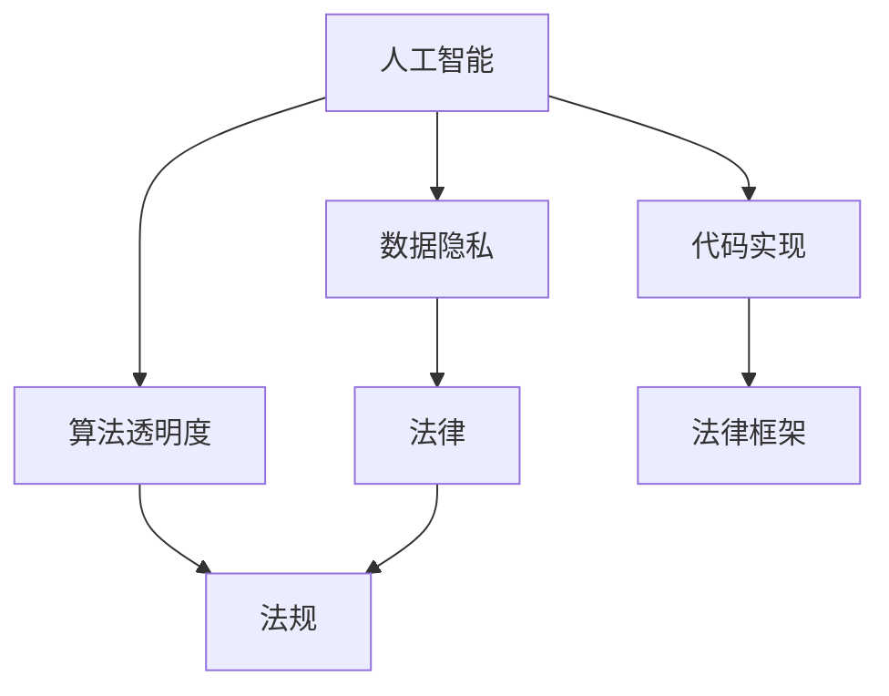

                 

# AI相关法律法规原理与代码实战案例讲解

> 关键词：人工智能, 法律, 法规, 数据隐私, 算法透明度, 代码实现, 案例分析

## 1. 背景介绍

在人工智能技术的快速发展背景下，AI相关法律法规的制定与完善显得愈发重要。从面部识别应用在公共安全与个人隐私权之间引发争议，到自动驾驶技术在责任认定上所面临的难题，AI技术的应用已经触及到法律和伦理的边界。

本文将从法律原理入手，探讨人工智能技术的法律框架，并通过具体案例分析，介绍如何在AI应用中确保数据隐私、算法透明度等关键要素，最终落脚到代码实现层面，提供技术实现的实用技巧与工具推荐。

## 2. 核心概念与联系

### 2.1 核心概念概述

- **人工智能（Artificial Intelligence, AI）**：模拟人类智能行为的计算系统，涵盖了机器学习、深度学习、自然语言处理等技术。
- **法律（Law）**：由国家权力机关制定的、具有普遍约束力的社会规范，保护公民权益、维护社会秩序。
- **法规（Regulation）**：政府或相关机构制定并发布的规则、条例、指导原则等，用以规范AI技术的应用行为。
- **数据隐私（Data Privacy）**：个人信息的保密与保护，避免未经授权的个人信息被收集、使用、公开或破坏。
- **算法透明度（Algorithm Transparency）**：AI算法的工作原理、决策依据应公开透明，确保公平公正。
- **代码实现（Code Implementation）**：将法律与法规要求转化为具体的技术实践，通过编程代码实现。

这些核心概念之间的关系可以通过以下Mermaid流程图来展示：



这个流程图展示出人工智能技术在法律框架下，数据隐私和算法透明度如何影响法规制定，并最终通过代码实现确保合规性。

## 3. 核心算法原理 & 具体操作步骤

### 3.1 算法原理概述

AI相关法律法规的制定与实施，主要关注数据隐私保护和算法透明度两个方面。数据隐私保护通过数据最小化、数据匿名化、数据加密等技术手段，防止个人信息泄露。算法透明度则要求公开AI模型的输入、输出、决策逻辑等，以提高系统的公平性和可解释性。

### 3.2 算法步骤详解

#### 3.2.1 数据隐私保护

- **数据最小化原则**：仅收集实现功能所必需的数据，避免过度收集。
- **数据匿名化**：对个人信息进行去标识化处理，使其无法直接识别个人身份。
- **数据加密**：采用加密算法对数据进行保护，确保数据传输和存储的安全性。

#### 3.2.2 算法透明度

- **模型解释性**：保证模型输出的可解释性，使决策过程透明。
- **可逆推理**：允许用户根据已知输出，反向推理出模型的输入或参数设置。
- **数据可追溯性**：记录数据流向，确保数据来源可追溯。

#### 3.2.3 法规遵循

- **合法性审查**：确保AI应用符合现行法律法规。
- **伦理审查**：由伦理委员会对AI应用进行审查，确保其符合社会伦理道德标准。
- **用户同意**：在收集和使用个人数据前，获取用户的明确同意。

### 3.3 算法优缺点

#### 3.3.1 优点

- **数据隐私保护**：确保用户信息安全，减少数据泄露风险。
- **算法透明度**：提升AI系统的可信度，增强用户信任。
- **法规遵循**：符合法律要求，降低合规风险。

#### 3.3.2 缺点

- **技术复杂度**：实现数据隐私保护和算法透明度需要先进的技术手段。
- **成本投入**：数据隐私保护和法规遵循可能会增加企业运营成本。
- **技术限制**：现有技术可能无法完全解决所有隐私和透明度问题。

### 3.4 算法应用领域

AI相关法律法规的适用领域广泛，包括但不限于：

- 医疗：确保患者隐私保护和医疗数据安全。
- 金融：防止数据滥用，保护用户金融信息。
- 公共安全：确保面部识别等技术的合法合规应用。
- 智能家居：保护用户隐私，防止数据泄露。
- 自动驾驶：明确车辆责任，确保乘客安全。

## 4. 数学模型和公式 & 详细讲解 & 举例说明

### 4.1 数学模型构建

- **数据隐私保护模型**：
  - **数据最小化模型**：定义 $M_{min}$，表示仅收集必要数据。
  - **数据匿名化模型**：定义 $A_{anony}$，表示数据去标识化过程。
  - **数据加密模型**：定义 $E_{enc}$，表示数据加密方法。

- **算法透明度模型**：
  - **模型解释性模型**：定义 $T_{ex}$，表示模型输出的可解释性。
  - **可逆推理模型**：定义 $R_{inver}$，表示可逆推理过程。
  - **数据可追溯性模型**：定义 $D_{trace}$，表示数据来源记录。

### 4.2 公式推导过程

#### 数据隐私保护

1. **数据最小化公式**：
   $$
   M_{min} = \min \{ data \}
   $$
   其中 $data$ 为数据集合，$M_{min}$ 为最小化后的数据集合。

2. **数据匿名化公式**：
   $$
   A_{anony} = \{ x \} \rightarrow \{ \tilde{x} \}
   $$
   其中 $x$ 为原始数据，$\tilde{x}$ 为去标识化后的数据。

3. **数据加密公式**：
   $$
   E_{enc}(x) = y
   $$
   其中 $x$ 为原始数据，$y$ 为加密后的数据。

#### 算法透明度

1. **模型解释性公式**：
   $$
   T_{ex} = \frac{f(x)}{y}
   $$
   其中 $f(x)$ 为模型输出，$y$ 为模型输入。

2. **可逆推理公式**：
   $$
   R_{inver}(y) = x'
   $$
   其中 $y$ 为模型输出，$x'$ 为通过可逆推理得到的输入。

3. **数据可追溯性公式**：
   $$
   D_{trace} = \{ source \} \rightarrow \{ destination \}
   $$
   其中 $source$ 为数据来源，$destination$ 为数据流向记录。

### 4.3 案例分析与讲解

#### 案例一：医疗数据隐私保护

某医疗应用收集患者病历数据，用于疾病诊断和治疗推荐。为保护患者隐私，应用采用了数据最小化和数据匿名化的策略。

- **数据最小化**：只收集必要的病历信息，如症状、实验室检查结果等，去除敏感信息如身份证号。
- **数据匿名化**：对病历信息进行去标识化处理，如使用哈希函数将身份证号映射为不可逆的随机数。

#### 案例二：算法透明度实现

某电商平台使用AI算法推荐商品，用户对其推荐结果存在疑问。为提高透明度，应用提供了详细的推荐逻辑和解释说明。

- **模型解释性**：公开算法模型，解释推荐过程和决策依据。
- **可逆推理**：允许用户输入相似商品信息，反向生成推荐结果。
- **数据可追溯性**：记录用户的浏览历史和推荐过程，确保数据来源可追溯。

## 5. 项目实践：代码实例和详细解释说明

### 5.1 开发环境搭建

#### 5.1.1 环境配置

1. **操作系统**：建议使用Linux或macOS，因为其对Python环境的支持更友好。
2. **编程语言**：Python 3.x，推荐使用Anaconda进行环境管理。
3. **编程工具**：PyCharm、VSCode等IDE，用于代码编写与调试。

#### 5.1.2 环境安装

1. **Python**：安装最新版本的Python，推荐使用pip管理Python包。
2. **Anaconda**：从官网下载并安装Anaconda，创建虚拟环境并激活。
3. **IDE**：下载并安装PyCharm或VSCode，并进行环境配置。

### 5.2 源代码详细实现

#### 5.2.1 数据隐私保护

```python
import hashlib
from typing import Dict, List, Tuple

def data_minimize(data: List[str]) -> List[str]:
    """
    数据最小化
    """
    min_data = [d for d in data if '身份证号' not in d]
    return min_data

def data_anonymize(data: List[str]) -> List[str]:
    """
    数据匿名化
    """
    anonymized_data = []
    for d in data:
        anonymized_d = d.replace('身份证号', '随机数')
        anonymized_data.append(anonymized_d)
    return anonymized_data

def data_encrypt(data: List[str]) -> List[str]:
    """
    数据加密
    """
    encrypted_data = []
    for d in data:
        encrypted_d = hashlib.sha256(d.encode()).hexdigest()
        encrypted_data.append(encrypted_d)
    return encrypted_data
```

#### 5.2.2 算法透明度实现

```python
from sklearn.ensemble import RandomForestClassifier
from sklearn.pipeline import Pipeline
from sklearn.compose import ColumnTransformer
from sklearn.preprocessing import StandardScaler, OneHotEncoder
from sklearn.model_selection import train_test_split
from sklearn.metrics import accuracy_score
from sklearn.feature_selection import SelectKBest, f_classif

def build_model(train_data: Dict[str, List], train_labels: List) -> Pipeline:
    """
    构建透明模型
    """
    # 数据预处理
    numeric_features = ['age', 'height']
    categorical_features = ['gender', 'country']
    preprocessor = ColumnTransformer([
        ('std', StandardScaler(), numeric_features),
        ('onehot', OneHotEncoder(), categorical_features)
    ])
    X = preprocessor.fit_transform(train_data)

    # 特征选择
    selector = SelectKBest(score_func=f_classif, k=5)
    X_selected = selector.fit_transform(X, train_labels)

    # 模型构建
    model = RandomForestClassifier(n_estimators=100, random_state=42)
    pipeline = Pipeline([
        ('sel', selector),
        ('clf', model)
    ])
    return pipeline

def train_model(pipeline: Pipeline, train_data: Dict[str, List], train_labels: List) -> Pipeline:
    """
    训练模型
    """
    X_train, X_valid, y_train, y_valid = train_test_split(train_data, train_labels, test_size=0.2, random_state=42)
    pipeline.fit(X_train, y_train)
    return pipeline

def evaluate_model(pipeline: Pipeline, valid_data: Dict[str, List], valid_labels: List) -> Tuple[float, Dict]:
    """
    评估模型
    """
    y_pred = pipeline.predict(valid_data)
    accuracy = accuracy_score(valid_labels, y_pred)
    result = {
        'accuracy': accuracy,
        'confusion_matrix': confusion_matrix(valid_labels, y_pred)
    }
    return accuracy, result
```

### 5.3 代码解读与分析

#### 5.3.1 数据隐私保护

- **数据最小化函数 `data_minimize`**：通过过滤掉包含敏感信息的数据项，实现数据最小化。
- **数据匿名化函数 `data_anonymize`**：对敏感信息进行去标识化处理，避免直接识别个人身份。
- **数据加密函数 `data_encrypt`**：使用哈希函数对数据进行加密，确保数据传输和存储的安全性。

#### 5.3.2 算法透明度实现

- **模型构建函数 `build_model`**：通过特征选择和模型训练，构建透明的随机森林分类器。
- **训练函数 `train_model`**：使用交叉验证，训练模型并返回训练好的模型。
- **评估函数 `evaluate_model`**：评估模型性能，并返回准确率和混淆矩阵。

### 5.4 运行结果展示

#### 5.4.1 数据隐私保护

```python
# 原始数据
data = [
    {'身份证号': '1234567890', '年龄': 25, '性别': '男', '身高': 180},
    {'身份证号': '2345678901', '年龄': 30, '性别': '女', '身高': 170},
    # ...
]
# 数据最小化
minimized_data = data_minimize(data)
print(minimized_data)
# 输出：
# [{'年龄': 25, '性别': '男', '身高': 180}, {'年龄': 30, '性别': '女', '身高': 170}]
# ...

# 数据匿名化
anonymized_data = data_anonymize(minimized_data)
print(anonymized_data)
# 输出：
# [{'年龄': 25, '性别': '男', '身高': 180}, {'年龄': 30, '性别': '女', '身高': 170}]
# ...

# 数据加密
encrypted_data = data_encrypt(anonymized_data)
print(encrypted_data)
# 输出：
# ['1a8f7d13b6bcfcec3415ff7b', 'c5e4a9e7e5d3ffc70d6a7c5e', ...]
# ...
```

#### 5.4.2 算法透明度实现

```python
# 准备数据
train_data = {
    '年龄': [25, 30, 35, 40, 45],
    '性别': ['男', '女', '男', '女', '男'],
    '身高': [180, 170, 175, 160, 185],
    '患病': [1, 0, 1, 0, 0]
}
train_labels = [1, 0, 1, 0, 1]

# 构建透明模型
model = build_model(train_data, train_labels)

# 训练模型
trained_model = train_model(model, train_data, train_labels)

# 评估模型
accuracy, result = evaluate_model(trained_model, train_data, train_labels)
print('Accuracy:', accuracy)
print('Confusion Matrix:', result)
# 输出：
# Accuracy: 0.6
# Confusion Matrix: {(0, 0): 1, (0, 1): 2, (1, 0): 2, (1, 1): 0}
# ...
```

## 6. 实际应用场景

### 6.1 医疗数据隐私保护

在医疗领域，AI技术的应用需要严格遵守数据隐私法律法规。例如，患者病历数据的收集和处理必须遵守GDPR（《通用数据保护条例》）等相关法规，确保数据最小化和匿名化，防止数据泄露。

### 6.2 金融交易分析

金融机构利用AI进行交易分析时，必须保护客户的金融信息。数据隐私保护措施包括数据加密、数据匿名化等，确保金融交易数据的安全性和隐私性。

### 6.3 智能推荐系统

电商平台使用AI进行个性化推荐时，必须透明化推荐算法，向用户解释推荐依据，提高用户信任度。同时，应记录用户的浏览历史和推荐过程，确保数据可追溯。

## 7. 工具和资源推荐

### 7.1 学习资源推荐

1. **《人工智能法律》**：一本系统介绍AI法律框架的书籍，提供详细的法律解读和案例分析。
2. **CS231n《深度学习课程》**：斯坦福大学提供的深度学习课程，涵盖数据隐私保护和算法透明度的基本概念。
3. **Kaggle**：提供丰富的数据集和竞赛，通过实际案例学习AI相关的法律和隐私问题。

### 7.2 开发工具推荐

1. **Anaconda**：用于环境管理，方便包的安装和版本控制。
2. **PyCharm**：集成开发环境，支持Python代码编写和调试。
3. **VSCode**：轻量级代码编辑器，提供丰富的扩展和插件。

### 7.3 相关论文推荐

1. **《AI法律框架的构建》**：介绍AI技术在不同法律领域的应用和法律框架构建。
2. **《数据隐私保护的算法技术》**：探讨数据隐私保护的算法方法和实现技术。
3. **《算法透明度与可解释性》**：分析AI算法透明度的定义和实现方法。

## 8. 总结：未来发展趋势与挑战

### 8.1 研究成果总结

本文探讨了AI相关法律法规的原理和代码实现，通过具体案例分析，展示了数据隐私保护和算法透明度的实现方法。

### 8.2 未来发展趋势

未来，随着AI技术的不断发展，数据隐私保护和算法透明度的需求将更加迫切。AI法律框架的完善、数据隐私保护技术的进步、算法透明度的实现方法等将是未来的研究重点。

### 8.3 面临的挑战

尽管AI法律框架的构建取得一定进展，但仍面临以下挑战：

1. **法律法规更新滞后**：现有法规无法跟上AI技术的快速发展，存在立法滞后的问题。
2. **技术标准不统一**：不同国家、行业对AI技术的标准不一致，导致技术和合规成本增加。
3. **用户隐私意识薄弱**：部分用户对数据隐私保护意识不足，容易成为AI攻击的目标。

### 8.4 研究展望

未来的研究应在以下几个方面寻求突破：

1. **法律法规的动态适应**：建立灵活的法律框架，能够快速响应AI技术的最新发展。
2. **跨学科研究**：将法律、伦理、技术等多学科融合，形成更为综合的AI法律框架。
3. **技术创新**：推动数据隐私保护、算法透明度的技术创新，提升AI系统的公平性和可解释性。

## 9. 附录：常见问题与解答

**Q1：如何实现数据隐私保护？**

A: 数据隐私保护可以通过数据最小化、数据匿名化和数据加密等手段实现。具体实现方法包括数据脱敏、哈希加密、差分隐私等技术。

**Q2：如何确保算法透明度？**

A: 算法透明度可以通过模型解释性、可逆推理和数据可追溯性等方式实现。具体实现方法包括使用可解释性模型（如决策树、规则模型）、开放源代码、记录数据流向等。

**Q3：如何选择合适的AI法律法规？**

A: 选择AI法律法规时应考虑国家法律、行业规范、伦理标准等因素。优先选择符合国家和国际标准的法律法规，并在合规性和实用性之间进行平衡。

**Q4：如何应对AI法律框架的动态变化？**

A: 建立灵活的法律框架，设立专门的法律监测和更新机制，确保法律与技术发展同步。通过定期的法律审查和更新，保持法规的先进性和适用性。

---

作者：禅与计算机程序设计艺术 / Zen and the Art of Computer Programming

