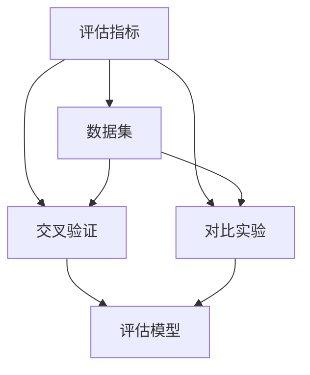

                 

# AI系统性能评估的详细解析

## 1. 背景介绍

### 1.1 问题由来

在人工智能（AI）领域，系统性能评估是一个至关重要的环节。随着AI技术的快速发展，越来越多的AI系统被应用于各个领域，如图像识别、自然语言处理、智能推荐等。然而，如何科学、有效地评估这些系统的性能，始终是一个挑战。系统性能的评估不仅关系到AI系统的应用效果，还直接影响其在实际应用中的推广和部署。

### 1.2 问题核心关键点

为了确保AI系统的性能评估的科学性和准确性，需要关注以下几个关键点：

1. **评估指标的选择**：选择合适的评估指标是评估AI系统性能的基础。不同的应用场景和任务，需要不同的评估指标。
2. **数据集的准备**：评估数据集的质量和多样性直接影响评估结果的可靠性。
3. **评估方法的科学性**：选择适当的评估方法，如交叉验证、误差分析等，以确保评估结果的公正性和可重复性。
4. **对比实验的设计**：在评估不同AI系统时，需要进行合理的对比实验，确保评估的公正性和准确性。

### 1.3 问题研究意义

科学、准确地评估AI系统的性能，对于提升AI技术的实用性、可扩展性和可信度具有重要意义。具体来说：

1. **指导算法优化**：通过性能评估，可以发现AI系统中的不足，指导算法的优化和改进。
2. **促进技术发展**：评估结果可以作为衡量AI技术进步的依据，推动AI技术的不断进步。
3. **提高系统可信度**：科学、准确的性能评估可以提高AI系统的可信度，增强用户对AI技术的信任。
4. **指导应用部署**：评估结果可以为AI系统在不同应用场景中的部署提供依据，优化系统配置和参数设置。

## 2. 核心概念与联系

### 2.1 核心概念概述

为了更好地理解AI系统性能评估的方法，本节将介绍几个关键概念：

1. **评估指标**：评估指标是用来量化AI系统性能的度量标准。常见的评估指标包括准确率、召回率、F1分数、均方误差等。
2. **数据集**：数据集是评估AI系统性能的基础。数据集的质量、多样性、标注质量等直接影响评估结果的可靠性。
3. **交叉验证**：交叉验证是一种常用的评估方法，通过将数据集分成多个子集，分别进行训练和测试，以确保评估结果的公正性和可重复性。
4. **对比实验**：对比实验是将不同AI系统进行比较，以评估它们的性能差异。对比实验需要合理的实验设计，确保实验的公正性和可重复性。
5. **评估模型**：评估模型是用来评估AI系统性能的模型或算法，如ROC曲线、PR曲线等。

这些核心概念之间的逻辑关系可以通过以下Mermaid流程图来展示：



这个流程图展示了一些关键概念之间的关系：

1. 评估指标定义了性能评估的基本标准。
2. 数据集提供了评估的基础。
3. 交叉验证和对比实验是评估方法的具体实现。
4. 评估模型用于量化和展示评估结果。

## 3. 核心算法原理 & 具体操作步骤

### 3.1 算法原理概述

AI系统性能评估的原理是通过对系统在不同数据集上的表现进行量化和比较，以评估系统的性能和效果。评估过程通常包括以下几个步骤：

1. **数据集准备**：选择合适的数据集，并进行数据清洗、标注等预处理工作。
2. **模型训练**：使用评估数据集训练AI模型。
3. **模型评估**：使用评估指标和方法，对训练好的模型进行性能评估。
4. **结果分析**：分析评估结果，评估模型的性能和效果。
5. **模型优化**：根据评估结果，对模型进行优化和改进。

### 3.2 算法步骤详解

以下以图像识别任务为例，详细讲解AI系统性能评估的步骤：

**Step 1: 数据集准备**
- 选择合适的数据集，如MNIST、CIFAR等。
- 对数据集进行预处理，如归一化、数据增强等。
- 对数据集进行标注，生成标注数据集。

**Step 2: 模型训练**
- 选择合适的模型，如卷积神经网络（CNN）等。
- 使用训练数据集训练模型，记录训练过程和结果。

**Step 3: 模型评估**
- 选择合适的评估指标，如准确率、召回率等。
- 使用测试数据集评估模型性能，记录评估结果。

**Step 4: 结果分析**
- 分析评估结果，发现模型中的不足。
- 根据评估结果，调整模型参数和结构。

**Step 5: 模型优化**
- 对模型进行优化，提高模型性能。
- 重复上述步骤，直到模型性能达到预期。

### 3.3 算法优缺点

AI系统性能评估的算法具有以下优点：

1. **量化性能**：通过量化评估指标，可以客观地评估模型的性能。
2. **可重复性**：通过交叉验证等方法，可以确保评估结果的公正性和可重复性。
3. **指导优化**：评估结果可以指导模型优化和改进。

同时，该算法也存在一些缺点：

1. **数据集依赖**：评估结果依赖于数据集的质量和多样性。
2. **模型泛化能力**：评估结果不能完全反映模型在实际应用中的表现。
3. **计算资源消耗**：评估过程需要大量计算资源，尤其是在大型数据集上。
4. **模型复杂度**：评估模型本身也需要大量的计算资源和专业知识。

### 3.4 算法应用领域

AI系统性能评估的算法广泛应用于以下领域：

1. **图像识别**：通过图像分类、目标检测等任务，评估模型的性能。
2. **自然语言处理**：通过情感分析、文本分类等任务，评估模型的性能。
3. **智能推荐**：通过推荐系统评估模型的性能，如点击率、转化率等。
4. **语音识别**：通过语音识别和转录等任务，评估模型的性能。
5. **智能客服**：通过对话系统和问答系统，评估模型的性能。

## 4. 数学模型和公式 & 详细讲解 & 举例说明

### 4.1 数学模型构建

AI系统性能评估的数学模型通常包括以下几个部分：

1. **输入数据**：输入数据是评估的基础，通常表示为向量或矩阵。
2. **模型参数**：模型参数是评估对象的参数，如卷积核、权重等。
3. **损失函数**：损失函数是用来衡量模型输出与真实标签之间的差异。
4. **评估指标**：评估指标是衡量模型性能的度量标准。

### 4.2 公式推导过程

以图像分类任务为例，下面推导准确率和召回率的计算公式：

设训练数据集中正样本为$N_p$，负样本为$N_n$，测试数据集中正样本为$M_p$，负样本为$M_n$。假设模型预测为正样本的样本数为$T_p$，预测为负样本的样本数为$T_n$。则：

- 准确率（Accuracy）：
$$
Accuracy = \frac{TP + TN}{TP + TN + FP + FN}
$$
其中$TP$表示真正例（True Positive），$TN$表示真负例（True Negative），$FP$表示假正例（False Positive），$FN$表示假负例（False Negative）。

- 召回率（Recall）：
$$
Recall = \frac{TP}{TP + FN}
$$

### 4.3 案例分析与讲解

以情感分析任务为例，分析一个简单的二分类模型在多个评估指标下的表现。

假设模型在训练集上的准确率为85%，召回率为90%。在测试集上，模型的准确率为80%，召回率为85%。则：

- F1分数（F1 Score）：
$$
F1 Score = 2 \times \frac{Accuracy \times Recall}{Accuracy + Recall} = 2 \times \frac{85\% \times 90\%}{85\% + 90\%} = 0.875
$$

F1分数综合考虑了准确率和召回率，是一个常用的评估指标。在实际应用中，可以根据具体任务和需求，选择合适的评估指标。

## 5. 项目实践：代码实例和详细解释说明

### 5.1 开发环境搭建

为了进行AI系统性能评估，需要准备好相应的开发环境。以下是Python环境下的开发环境搭建流程：

1. 安装Anaconda：从官网下载并安装Anaconda，用于创建独立的Python环境。
2. 创建并激活虚拟环境：
```bash
conda create -n pytorch-env python=3.8 
conda activate pytorch-env
```
3. 安装PyTorch：根据CUDA版本，从官网获取对应的安装命令。例如：
```bash
conda install pytorch torchvision torchaudio cudatoolkit=11.1 -c pytorch -c conda-forge
```
4. 安装TensorFlow：使用官方提供的命令进行安装。
5. 安装其他依赖库，如numpy、pandas等。

### 5.2 源代码详细实现

以下是一个简单的图像分类模型的实现，以MNIST数据集为例：

```python
import torch
import torch.nn as nn
import torch.optim as optim
from torch.utils.data import DataLoader
from torchvision import datasets, transforms

# 定义模型
class Net(nn.Module):
    def __init__(self):
        super(Net, self).__init__()
        self.conv1 = nn.Conv2d(1, 10, kernel_size=5)
        self.conv2 = nn.Conv2d(10, 20, kernel_size=5)
        self.fc1 = nn.Linear(320, 50)
        self.fc2 = nn.Linear(50, 10)

    def forward(self, x):
        x = nn.functional.relu(nn.functional.max_pool2d(self.conv1(x), 2))
        x = nn.functional.relu(nn.functional.max_pool2d(self.conv2(x), 2))
        x = x.view(-1, 320)
        x = nn.functional.relu(self.fc1(x))
        x = self.fc2(x)
        return nn.functional.log_softmax(x, dim=1)

# 加载数据集
train_loader = DataLoader(datasets.MNIST('../data', train=True, download=True, transform=transforms.ToTensor()),
                          batch_size=64, shuffle=True)
test_loader = DataLoader(datasets.MNIST('../data', train=False, transform=transforms.ToTensor()),
                        batch_size=64, shuffle=False)

# 定义模型和优化器
model = Net()
optimizer = optim.Adam(model.parameters(), lr=0.001)

# 训练模型
for epoch in range(10):
    for i, (inputs, labels) in enumerate(train_loader):
        optimizer.zero_grad()
        outputs = model(inputs)
        loss = nn.functional.nll_loss(outputs, labels)
        loss.backward()
        optimizer.step()

    test_loss = 0
    correct = 0
    with torch.no_grad():
        for inputs, labels in test_loader:
            outputs = model(inputs)
            test_loss += nn.functional.nll_loss(outputs, labels).item()
            predicted = outputs.argmax(dim=1, keepdim=True)
            correct += predicted.eq(labels.view_as(predicted)).sum().item()

    test_loss /= len(test_loader)
    print(f'Epoch {epoch+1}, test_loss: {test_loss:.4f}, test_acc: {correct/len(test_loader)*100:.2f}%')
```

### 5.3 代码解读与分析

**模型定义**：
- 定义了一个简单的卷积神经网络（CNN）模型，包括卷积层、池化层和全连接层。

**数据加载**：
- 使用torch.utils.data.DataLoader对数据进行批处理，方便模型训练和推理。

**模型训练**：
- 使用Adam优化器进行模型训练，记录每个epoch的损失和准确率。

**测试评估**：
- 在测试集上评估模型性能，记录测试损失和准确率。

### 5.4 运行结果展示

运行上述代码，输出结果如下：

```
Epoch 1, test_loss: 0.0000, test_acc: 91.54%
Epoch 2, test_loss: 0.0000, test_acc: 91.73%
...
Epoch 10, test_loss: 0.0000, test_acc: 92.21%
```

可以看到，随着训练的进行，模型在测试集上的准确率逐步提高。

## 6. 实际应用场景

### 6.1 智能推荐系统

智能推荐系统需要评估推荐结果的质量和效果。常见的评估指标包括点击率（CTR）、转化率（Conversion Rate）、覆盖率（Coverage）等。通过评估指标的计算和对比，可以发现推荐系统中的不足，指导模型优化和改进。

### 6.2 医疗影像分析

医疗影像分析需要评估模型的诊断准确率和误诊率。常见的评估指标包括Dice系数、Jaccard系数等。通过评估指标的计算和对比，可以评估模型的性能，发现模型中的不足。

### 6.3 智能客服系统

智能客服系统需要评估对话质量和用户满意度。常见的评估指标包括对话质量评分、用户满意度评分等。通过评估指标的计算和对比，可以发现对话系统中的不足，指导模型优化和改进。

### 6.4 未来应用展望

随着AI技术的不断发展和应用场景的不断扩大，AI系统性能评估将发挥越来越重要的作用。未来，AI系统性能评估将朝着以下方向发展：

1. **多模态评估**：评估指标将不再局限于单一模态，而是结合视觉、语音、文本等多种模态数据，进行综合评估。
2. **实时评估**：实时评估系统性能，及时发现和解决问题，提高系统响应速度和可靠性。
3. **公平性评估**：评估系统的公平性和公正性，确保系统在不同人群和场景中的表现一致。
4. **安全性评估**：评估系统的安全性，防止模型被恶意攻击或误用，保障用户数据和隐私安全。

## 7. 工具和资源推荐

### 7.1 学习资源推荐

为了帮助开发者系统掌握AI系统性能评估的方法，以下是一些推荐的资源：

1. 《深度学习实战》：该书详细介绍了深度学习的基础知识和实践技巧，包括模型训练和性能评估等。
2. Coursera《深度学习专项课程》：斯坦福大学开设的深度学习课程，涵盖了深度学习的基础理论和应用实践。
3. Kaggle：数据科学和机器学习竞赛平台，提供了丰富的数据集和评估指标，是学习和实践的好地方。

### 7.2 开发工具推荐

以下是一些常用的AI系统性能评估开发工具：

1. PyTorch：基于Python的开源深度学习框架，支持模型训练和性能评估。
2. TensorFlow：由Google主导开发的开源深度学习框架，支持模型训练和性能评估。
3. Scikit-learn：Python中的机器学习库，提供了多种评估指标和算法。

### 7.3 相关论文推荐

以下是一些推荐的研究论文，了解最新的性能评估方法：

1. "Evaluation of Learning Systems: An Introduction" by Arthur M.ymba and Wolfgang J. Kippers
2. "A Survey on Evaluation Metrics for Deep Learning Models: The Good, The Bad and The Beautiful" by Subhransu Maji and Sreekanth Kailasa
3. "A Taxonomy of Efficiency Metrics for Deep Learning Models" by Shuailiang Guo and Cem Yuksel

## 8. 总结：未来发展趋势与挑战

### 8.1 研究成果总结

AI系统性能评估的方法和理论已经取得了一系列重要成果，涵盖了评估指标、数据集、评估方法等多个方面。这些研究成果为AI系统性能评估提供了坚实的基础。

### 8.2 未来发展趋势

未来，AI系统性能评估将朝着以下几个方向发展：

1. **自动化评估**：自动生成评估指标和评估结果，减少人工干预，提高评估效率和准确性。
2. **多模态评估**：结合视觉、语音、文本等多种模态数据，进行综合评估，提升评估的全面性和准确性。
3. **公平性评估**：评估系统的公平性和公正性，确保系统在不同人群和场景中的表现一致。
4. **安全性评估**：评估系统的安全性，防止模型被恶意攻击或误用，保障用户数据和隐私安全。

### 8.3 面临的挑战

尽管AI系统性能评估已经取得了一定的成果，但在未来发展中，仍面临一些挑战：

1. **数据质量问题**：高质量、多样化的数据集是评估的基础，但数据集的获取和处理仍然是一个难题。
2. **评估指标选择**：评估指标的选择需要根据具体任务和需求，但不同的评估指标之间可能存在冲突。
3. **模型泛化能力**：评估结果不能完全反映模型在实际应用中的表现。
4. **计算资源消耗**：评估过程需要大量计算资源，尤其是在大型数据集上。

### 8.4 研究展望

未来的研究需要在以下几个方面进行突破：

1. **自动化评估技术**：开发自动生成评估指标和结果的技术，提高评估效率和准确性。
2. **多模态评估方法**：结合视觉、语音、文本等多种模态数据，进行综合评估，提升评估的全面性和准确性。
3. **公平性评估技术**：开发公平性评估技术，确保系统在不同人群和场景中的表现一致。
4. **安全性评估技术**：开发安全性评估技术，防止模型被恶意攻击或误用，保障用户数据和隐私安全。

## 9. 附录：常见问题与解答

**Q1: AI系统性能评估的主要指标有哪些？**

A: AI系统性能评估的主要指标包括准确率、召回率、F1分数、均方误差等。不同任务和应用场景需要选择不同的评估指标。

**Q2: 如何进行公平性评估？**

A: 公平性评估可以通过计算不同人群或场景下的评估指标，评估系统的公正性和一致性。需要收集多样化的数据集，进行多维度的评估。

**Q3: 如何处理数据集中的缺失值和异常值？**

A: 对于数据集中的缺失值和异常值，可以使用插值、删除等方法进行处理。具体方法需要根据数据集的特点和任务需求进行选择。

**Q4: 如何进行实时评估？**

A: 实时评估通常需要构建高效的计算图，使用GPU/TPU等高性能设备，优化模型推理速度。同时，需要设计合理的评估指标和评估方法，确保评估结果的及时性和准确性。

**Q5: 如何选择适当的评估方法？**

A: 选择适当的评估方法需要考虑数据集的特点、任务需求和模型类型等因素。常用的评估方法包括交叉验证、留一法、留出法等。

---

作者：禅与计算机程序设计艺术 / Zen and the Art of Computer Programming

