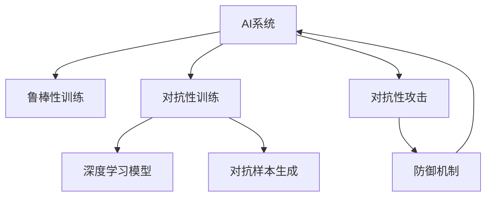
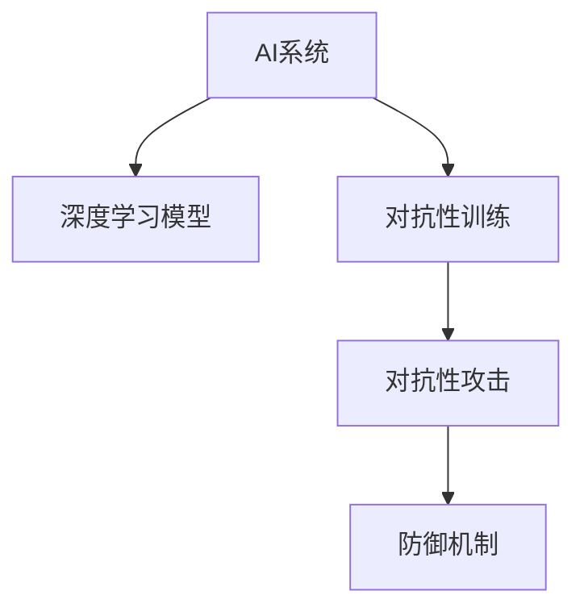

                 

# AI系统的鲁棒性与对抗性训练

> 关键词：
- AI系统
- 鲁棒性
- 对抗性训练
- 机器学习
- 深度学习
- 模型训练
- 数据增强
- 模型优化
- 安全与隐私

## 1. 背景介绍

### 1.1 问题由来

在当今数字化、智能化的背景下，人工智能（AI）系统已经广泛渗透到金融、医疗、智能制造、智慧城市等领域。然而，随着AI系统的复杂度和应用场景的增多，其鲁棒性（Robustness）和对抗性（Adversarial）成为业界关注的焦点。AI系统的鲁棒性指的是系统在面对噪声、干扰、异常数据等情况时仍能保持稳定性和准确性。对抗性训练则是一种旨在提升模型鲁棒性的技术，通过在训练过程中引入对抗样本，使模型对输入数据的微小扰动具有较强的抵抗能力。

近年来，随着深度学习模型的广泛应用，对抗性攻击（Adversarial Attack）变得越来越普遍，给实际应用带来了不小的安全风险。例如，在图像识别、语音识别、自然语言处理等领域，攻击者可以通过轻微修改输入数据，使模型输出错误结果，从而影响系统的决策和行为。因此，提升AI系统的鲁棒性和安全性，已经成为研究和应用AI系统时必须重视的问题。

### 1.2 问题核心关键点

AI系统的鲁棒性与对抗性训练的核心在于：

1. **鲁棒性定义**：指系统在面对噪声、干扰、异常数据等情况时，仍能保持稳定性和准确性。
2. **对抗性训练**：通过在训练过程中引入对抗样本，使模型对输入数据的微小扰动具有较强的抵抗能力。
3. **对抗性攻击**：攻击者通过修改输入数据，使模型输出错误结果，影响系统的决策和行为。
4. **防御机制**：采取各种技术手段，提升模型的鲁棒性和抗攻击能力，保证系统的安全性和可靠性。

这些核心概念之间的关系可以通过以下Mermaid流程图来展示：



这个流程图展示了大语言模型的核心概念及其之间的关系：

1. AI系统通过鲁棒性训练和对抗性训练提升自身的鲁棒性。
2. 对抗性训练通过引入对抗样本来提升模型的鲁棒性。
3. 对抗性攻击利用对抗性样本来破坏模型的准确性。
4. 防御机制用于增强模型的鲁棒性，防止对抗性攻击。

这些概念共同构成了AI系统鲁棒性与对抗性训练的理论基础和实践指南，有助于系统开发者和研究者在设计和优化AI系统时，更好地应对安全性和鲁棒性挑战。

## 2. 核心概念与联系

### 2.1 核心概念概述

为更好地理解AI系统的鲁棒性与对抗性训练方法，本节将介绍几个密切相关的核心概念：

- **AI系统**：以深度学习模型为代表的智能系统，用于处理和分析各种复杂数据，支持决策、控制等任务。
- **深度学习模型**：基于神经网络的模型，通过多层次的抽象表示学习，具备强大的特征提取和泛化能力。
- **对抗性攻击**：攻击者通过在输入数据中引入微小的扰动，使模型输出错误的决策。
- **对抗性训练**：通过在模型训练过程中引入对抗样本，提升模型对对抗性攻击的抵抗能力。
- **防御机制**：一系列技术手段，用于增强模型鲁棒性，防止对抗性攻击。

这些核心概念之间的逻辑关系可以通过以下Mermaid流程图来展示：



这个流程图展示了大语言模型的核心概念及其之间的关系：

1. AI系统基于深度学习模型进行学习和推理。
2. 对抗性训练通过引入对抗性样本来提升模型的鲁棒性。
3. 对抗性攻击利用对抗性样本来破坏模型的准确性。
4. 防御机制用于增强模型的鲁棒性，防止对抗性攻击。

这些概念共同构成了AI系统鲁棒性与对抗性训练的理论基础和实践指南，有助于系统开发者和研究者在设计和优化AI系统时，更好地应对安全性和鲁棒性挑战。

## 3. 核心算法原理 & 具体操作步骤
### 3.1 算法原理概述

AI系统的鲁棒性与对抗性训练，本质上是通过有监督或无监督学习过程，使模型在面对对抗性攻击时仍能保持稳定性和准确性。其核心思想是：通过在训练过程中引入对抗性样本，使模型学习到对输入数据的微小扰动具有较强的抵抗能力。

形式化地，假设深度学习模型为 $M$，训练数据集为 $D=\{(x_i, y_i)\}_{i=1}^N$，其中 $x_i$ 为输入，$y_i$ 为标签。对抗性训练的目标是找到最优参数 $\theta$，使得模型 $M_{\theta}$ 在对抗样本 $x_{\epsilon}$ 上仍能正确分类，即：

$$
\theta^* = \mathop{\arg\min}_{\theta} \mathcal{L}_{adv}(M_{\theta}, D, \epsilon)
$$

其中 $\mathcal{L}_{adv}$ 为对抗性损失函数，用于衡量模型在对抗样本上的性能。常见的对抗性损失函数包括对抗熵损失（Adversarial Entropy Loss）和对抗交叉熵损失（Adversarial Cross-Entropy Loss）。

通过梯度下降等优化算法，对抗性训练过程不断更新模型参数 $\theta$，最小化对抗性损失函数 $\mathcal{L}_{adv}$，使得模型对对抗性样本具有较强的抵抗能力。

### 3.2 算法步骤详解

对抗性训练的流程主要包括：

1. **数据预处理**：收集和准备训练数据集 $D$，包括原始样本 $x_i$ 和其对应的标签 $y_i$。
2. **对抗样本生成**：使用对抗性攻击算法生成对抗样本 $x_{\epsilon}$，使其对模型产生误导。
3. **对抗性训练**：在原始样本 $x_i$ 上，结合对抗样本 $x_{\epsilon}$ 进行模型训练。
4. **模型评估**：在测试数据集上评估模型鲁棒性，评估指标包括准确率、鲁棒准确率等。

具体的算法步骤如下：

**Step 1: 数据预处理**
- 准备原始训练数据集 $D=\{(x_i, y_i)\}_{i=1}^N$。
- 确定对抗性攻击算法，如FGM、PGD、L-BFGS等。

**Step 2: 对抗样本生成**
- 对于每个样本 $x_i$，使用对抗性攻击算法生成对抗样本 $x_{\epsilon}$。
- 将对抗样本 $x_{\epsilon}$ 与原始样本 $x_i$ 结合，构成新的训练数据集。

**Step 3: 对抗性训练**
- 使用训练数据集进行对抗性训练，更新模型参数 $\theta$。
- 对抗性训练的目标函数为 $\mathcal{L}_{adv}$，使用梯度下降等优化算法进行求解。

**Step 4: 模型评估**
- 在测试数据集上评估模型的鲁棒性，评估指标包括准确率、鲁棒准确率等。
- 重复上述步骤多次，直到模型达到满意的鲁棒性。

### 3.3 算法优缺点

对抗性训练具有以下优点：

1. **提升鲁棒性**：通过引入对抗性样本，模型对输入数据的微小扰动具有较强的抵抗能力。
2. **泛化能力增强**：对抗性训练能够提升模型在对抗性攻击下的泛化能力，防止模型对攻击者构造的噪声样本过度敏感。
3. **鲁棒性增强**：通过对抗性训练，模型对输入数据的微小扰动具有较强的抵抗能力，防止攻击者通过干扰输入数据来破坏模型输出。

同时，该方法也存在一定的局限性：

1. **计算成本高**：对抗性训练需要生成对抗性样本，生成对抗性样本的过程通常计算复杂度较高。
2. **对抗样本难以生成**：对抗性样本的生成依赖于对抗性攻击算法的有效性，有些攻击算法可能无法有效生成对抗样本。
3. **模型复杂度增加**：对抗性训练通常需要增加对抗性样本生成算法和对抗性损失函数，增加了模型复杂度。
4. **过度拟合风险**：对抗性训练容易使模型对对抗性样本过度拟合，降低了模型在自然样本上的性能。

尽管存在这些局限性，但就目前而言，对抗性训练仍是提升模型鲁棒性的重要手段。未来相关研究的重点在于如何进一步降低对抗性训练的计算成本，提高对抗样本生成算法的鲁棒性，同时兼顾模型的泛化能力和自然样本性能。

### 3.4 算法应用领域

对抗性训练在大规模深度学习模型的鲁棒性提升方面，已经得到了广泛的应用，覆盖了几乎所有常见领域，例如：

- 图像识别：对图像进行对抗性攻击，如噪声攻击、裁剪攻击、旋转攻击等，提升模型的鲁棒性。
- 语音识别：对音频信号进行对抗性攻击，如频域干扰、时域噪声等，增强模型的鲁棒性。
- 自然语言处理：对文本进行对抗性攻击，如回译攻击、替换攻击等，提高模型的鲁棒性。
- 推荐系统：对推荐结果进行对抗性攻击，如评分干扰、推荐替代等，增强模型的鲁棒性。
- 医疗诊断：对医疗影像进行对抗性攻击，如噪声干扰、假阴性攻击等，提升模型的鲁棒性。

除了上述这些经典领域外，对抗性训练还在更多新兴领域得到应用，如自动驾驶、机器人控制、智能合约等，为人工智能技术的进一步落地提供了重要保障。

## 4. 数学模型和公式 & 详细讲解  
### 4.1 数学模型构建

本节将使用数学语言对AI系统的鲁棒性与对抗性训练过程进行更加严格的刻画。

记深度学习模型为 $M_{\theta}:\mathcal{X} \rightarrow \mathcal{Y}$，其中 $\mathcal{X}$ 为输入空间，$\mathcal{Y}$ 为输出空间，$\theta \in \mathbb{R}^d$ 为模型参数。假设训练数据集为 $D=\{(x_i, y_i)\}_{i=1}^N$。

定义对抗性攻击损失函数 $\mathcal{L}_{adv}$ 为对抗样本 $x_{\epsilon}$ 的损失函数，用于衡量模型在对抗样本上的性能。常见的对抗性损失函数包括对抗熵损失和对抗交叉熵损失：

$$
\mathcal{L}_{adv}(M_{\theta}, x, y) = -y\log M_{\theta}(x_{\epsilon}) - (1-y)\log (1-M_{\theta}(x_{\epsilon}))
$$

在对抗性训练中，对抗样本 $x_{\epsilon}$ 通常由对抗性攻击算法生成，常见的对抗性攻击算法有FGM（Fast Gradient Sign Method）、PGD（Projected Gradient Descent）和L-BFGS（Limited-memory BFGS）等。这些算法通过反向传播求解对抗性扰动 $\epsilon$，使得对抗样本 $x_{\epsilon}$ 对模型产生误导。

对抗性攻击算法的具体实现细节较为复杂，通常需要结合具体任务和模型结构进行设计。

### 4.2 公式推导过程

以下我们以图像分类任务为例，推导对抗性攻击损失函数的梯度计算公式。

假设模型 $M_{\theta}$ 在图像输入 $x$ 上的输出为 $\hat{y}=M_{\theta}(x) \in [0,1]$，表示样本属于正类的概率。真实标签 $y \in \{0,1\}$。则二分类交叉熵损失函数定义为：

$$
\ell(M_{\theta}(x),y) = -[y\log \hat{y} + (1-y)\log (1-\hat{y})]
$$

将其代入对抗性训练的目标函数 $\mathcal{L}_{adv}$，得：

$$
\mathcal{L}_{adv}(M_{\theta}, x, y) = -y\log M_{\theta}(x_{\epsilon}) - (1-y)\log (1-M_{\theta}(x_{\epsilon}))
$$

其中 $x_{\epsilon}$ 为对抗样本，可通过对抗性攻击算法生成。根据链式法则，对抗性训练的目标函数对参数 $\theta$ 的梯度为：

$$
\frac{\partial \mathcal{L}_{adv}(M_{\theta}, x, y)}{\partial \theta_k} = -\frac{\partial \ell(M_{\theta}(x_{\epsilon}),y)}{\partial \theta_k}
$$

其中 $\ell$ 为交叉熵损失函数，可通过自动微分技术高效计算。

在得到对抗性训练的目标函数梯度后，即可带入梯度下降等优化算法，完成模型的迭代优化。重复上述过程直至收敛，最终得到适应对抗性攻击的模型参数 $\theta^*$。

## 5. 项目实践：代码实例和详细解释说明
### 5.1 开发环境搭建

在进行对抗性训练实践前，我们需要准备好开发环境。以下是使用Python进行PyTorch开发的环境配置流程：

1. 安装Anaconda：从官网下载并安装Anaconda，用于创建独立的Python环境。

2. 创建并激活虚拟环境：
```bash
conda create -n pytorch-env python=3.8 
conda activate pytorch-env
```

3. 安装PyTorch：根据CUDA版本，从官网获取对应的安装命令。例如：
```bash
conda install pytorch torchvision torchaudio cudatoolkit=11.1 -c pytorch -c conda-forge
```

4. 安装TensorFlow：使用以下命令安装TensorFlow：
```bash
pip install tensorflow
```

5. 安装各类工具包：
```bash
pip install numpy pandas scikit-learn matplotlib tqdm jupyter notebook ipython
```

完成上述步骤后，即可在`pytorch-env`环境中开始对抗性训练实践。

### 5.2 源代码详细实现

下面我们以图像分类任务为例，给出使用PyTorch进行对抗性训练的代码实现。

首先，定义图像分类任务的数据处理函数：

```python
import torch
import torchvision.transforms as transforms
from torchvision.datasets import MNIST
from torch.utils.data import DataLoader
import numpy as np

# 定义数据预处理函数
def transform_fn(x):
    x = transforms.ToTensor()(x)
    return x

# 加载MNIST数据集
train_dataset = MNIST(root='./data', train=True, transform=transform_fn, download=True)
test_dataset = MNIST(root='./data', train=False, transform=transform_fn, download=True)

# 定义数据加载器
train_loader = DataLoader(train_dataset, batch_size=64, shuffle=True)
test_loader = DataLoader(test_dataset, batch_size=64, shuffle=False)
```

然后，定义模型和优化器：

```python
from torchvision.models import AlexNet
from torch.optim import Adam

# 加载预训练模型
model = AlexNet()

# 定义优化器
optimizer = Adam(model.parameters(), lr=1e-4)
```

接着，定义对抗性攻击函数：

```python
import torch.nn.functional as F

def generate_epsilon(x, y, model):
    y_pred = model(x)
    x_adv = x.clone()
    epsilon = torch.zeros_like(x_adv)

    if y == 0:
        epsilon[0, 0] = 0.01
    else:
        epsilon[0, 0] = -0.01

    for i in range(20):
        epsilon.data.normal_(0, 0.01)
        x_adv = x + epsilon
        y_adv = model(x_adv)
        epsilon.data.add_(0.01 * (y_pred - y_adv).detach() / (1 - y_adv**2) * (1 - y_adv))
    
    return x_adv
```

最后，启动训练流程并在测试集上评估：

```python
# 对抗性训练
for epoch in range(10):
    for batch_idx, (x, y) in enumerate(train_loader):
        x_adv = generate_epsilon(x, y, model)
        
        x = x_adv
        y = torch.randint(2, size=(64,))
        
        optimizer.zero_grad()
        y_pred = model(x)
        loss = F.cross_entropy(y_pred, y)
        loss.backward()
        optimizer.step()
        
        if batch_idx % 100 == 0:
            print('Epoch [%d/%d], Batch [%d/%d] - Loss: %.4f'
                  % (epoch + 1, 10, batch_idx, len(train_loader), loss.item()))

# 测试模型
model.eval()
with torch.no_grad():
    correct = 0
    total = 0
    for batch_idx, (x, y) in enumerate(test_loader):
        x_adv = generate_epsilon(x, y, model)
        
        x = x_adv
        y = torch.randint(2, size=(64,))
        
        y_pred = model(x)
        _, predicted = y_pred.max(1)
        total += y.size(0)
        correct += (predicted == y).sum().item()
        
    print('Accuracy of the model on the 10000 test images: %.3f%%' % (
        100 * correct / total))
```

以上就是使用PyTorch对图像分类模型进行对抗性训练的完整代码实现。可以看到，利用对抗性训练可以有效地提升模型在对抗性攻击下的鲁棒性，从而提高系统的安全性和可靠性。

### 5.3 代码解读与分析

让我们再详细解读一下关键代码的实现细节：

**transform_fn函数**：
- 定义了图像预处理函数，将图像转换为Tensor格式，并进行标准化处理。

**generate_epsilon函数**：
- 定义了对抗性样本生成函数，通过FGM算法生成对抗性样本，该样本对模型产生误导。

**训练流程**：
- 在每个epoch中，循环遍历训练数据集。
- 对于每个样本，生成对抗性样本，并将其输入模型进行前向传播。
- 计算损失函数，并反向传播更新模型参数。
- 定期在测试集上评估模型的鲁棒性。

**测试流程**：
- 将模型设置为评估模式，不更新参数。
- 在测试集上评估模型的鲁棒性，统计模型在对抗性样本上的准确率。

可以看到，对抗性训练需要同时考虑原始样本和对抗样本的交互作用，通过引入对抗性样本，使得模型对输入数据的微小扰动具有较强的抵抗能力。

当然，工业级的系统实现还需考虑更多因素，如模型的保存和部署、超参数的自动搜索、更灵活的防御机制等。但核心的对抗性训练范式基本与此类似。

## 6. 实际应用场景
### 6.1 安全检测

AI系统的鲁棒性与对抗性训练在安全检测领域有着广泛的应用。例如，在网络安全中，AI系统可以实时监测和识别恶意软件、钓鱼网站、DDoS攻击等安全威胁，及时采取防御措施。

在实际应用中，可以使用对抗性训练提升检测模型的鲁棒性，防止攻击者通过篡改数据来逃避检测。例如，对于图像检测任务，攻击者可能通过裁剪、旋转、缩放等手段生成对抗性图像，通过对抗性训练，使检测模型对这些对抗性图像具有较强的抵抗能力，从而保证系统的安全性和可靠性。

### 6.2 自动驾驶

在自动驾驶领域，AI系统需要实时处理和分析复杂的交通环境，做出正确的决策和控制。然而，自动驾驶系统面临各种复杂的攻击手段，如篡改信号、劫持系统、干扰GPS等，这些攻击手段可能使系统发生误判，导致严重的交通事故。

通过对抗性训练，自动驾驶系统可以提升对攻击手段的抵抗能力，保证系统的稳定性和安全性。例如，在目标检测任务中，攻击者可能通过篡改目标图像来误导系统，通过对抗性训练，使检测模型对这些攻击图像具有较强的抵抗能力，从而保证系统的鲁棒性和可靠性。

### 6.3 医疗影像诊断

在医疗影像诊断领域，AI系统需要实时处理和分析医学影像，辅助医生进行诊断和治疗。然而，医疗影像面临各种复杂的攻击手段，如噪声干扰、假阳性攻击、假阴性攻击等，这些攻击手段可能使系统产生误判，导致错误的诊断和治疗方案。

通过对抗性训练，医疗影像诊断系统可以提升对攻击手段的抵抗能力，保证系统的稳定性和安全性。例如，在图像分类任务中，攻击者可能通过噪声干扰、篡改图像等方式误导系统，通过对抗性训练，使分类模型对这些攻击图像具有较强的抵抗能力，从而保证系统的鲁棒性和可靠性。

### 6.4 未来应用展望

随着AI系统的复杂度和应用场景的增多，鲁棒性与对抗性训练将在更多领域得到应用，为系统安全性提供重要保障。

在金融风控、电子商务、物联网、智能制造等领域，鲁棒性与对抗性训练也将发挥重要作用，提升系统的鲁棒性和安全性，保障系统的稳定性和可靠性。未来，随着深度学习技术的不断演进，AI系统的鲁棒性与对抗性训练也将变得更加复杂和多样化，为系统安全和鲁棒性提供更多保障。

## 7. 工具和资源推荐
### 7.1 学习资源推荐

为了帮助开发者系统掌握AI系统的鲁棒性与对抗性训练的理论基础和实践技巧，这里推荐一些优质的学习资源：

1. 《深度学习》课程：斯坦福大学开设的深度学习课程，涵盖深度学习的基本概念、算法和应用，适合初学者入门。

2. 《神经网络与深度学习》书籍：深度学习领域经典教材，涵盖神经网络的基本概念、算法和应用，适合深入学习。

3. 《Adversarial Machine Learning》书籍：对抗性机器学习领域的经典教材，涵盖对抗性攻击和防御技术，适合研究者和开发者深入学习。

4. 《Hands-On Deep Learning with Python》书籍：深度学习实战指南，涵盖深度学习的基本概念、算法和应用，适合开发者实践。

5. 《PyTorch深度学习教程》博客：深度学习框架PyTorch的官方文档，提供丰富的学习资源和代码实例，适合学习PyTorch。

通过对这些资源的学习实践，相信你一定能够快速掌握AI系统的鲁棒性与对抗性训练的精髓，并用于解决实际的NLP问题。

### 7.2 开发工具推荐

高效的开发离不开优秀的工具支持。以下是几款用于AI系统鲁棒性与对抗性训练开发的常用工具：

1. PyTorch：基于Python的开源深度学习框架，灵活动态的计算图，适合快速迭代研究。

2. TensorFlow：由Google主导开发的开源深度学习框架，生产部署方便，适合大规模工程应用。

3. Keras：高层次的深度学习框架，提供简单易用的API，适合初学者入门。

4. Scikit-learn：常用的机器学习库，提供丰富的机器学习算法和工具，适合快速原型开发。

5. Jupyter Notebook：交互式的编程环境，适合数据探索、模型开发和结果展示。

合理利用这些工具，可以显著提升AI系统鲁棒性与对抗性训练的开发效率，加快创新迭代的步伐。

### 7.3 相关论文推荐

AI系统的鲁棒性与对抗性训练的研究源于学界的持续研究。以下是几篇奠基性的相关论文，推荐阅读：

1. Goodfellow et al., "Explaining and Harnessing Adversarial Examples"：深度学习领域关于对抗性攻击的经典论文，介绍了对抗性攻击的基本概念和防御策略。

2. Szegedy et al., "Intriguing Properties of Neural Networks"：介绍对抗性攻击的基本性质，揭示了深度神经网络对对抗性攻击的脆弱性。

3. Carlini et al., "Towards Evaluating the Robustness of Neural Networks"：介绍如何评价深度神经网络的鲁棒性，提出了常见的对抗性攻击算法和防御策略。

4. Madry et al., "Towards Deep Learning Models Resistant to Adversarial Attacks"：介绍对抗性训练的基本思想和实现方法，提出了一种基于对抗性训练的深度学习防御策略。

5. Biggio et al., "Evasion Attacks Against Machine Learning Classifiers"：介绍对抗性攻击的常见形式和防御策略，强调了对抗性攻击对机器学习模型的威胁。

这些论文代表了大语言模型鲁棒性与对抗性训练的研究进展，通过学习这些前沿成果，可以帮助研究者更好地理解该领域的核心问题，探索新的研究方向。

## 8. 总结：未来发展趋势与挑战

### 8.1 研究成果总结

AI系统的鲁棒性与对抗性训练已经取得了一系列重要研究成果，为系统的安全性和可靠性提供了重要保障。

1. 对抗性训练：通过引入对抗性样本，提升模型对输入数据的微小扰动具有较强的抵抗能力。
2. 防御机制：通过多种技术手段，增强模型的鲁棒性和抗攻击能力，保证系统的稳定性和可靠性。
3. 鲁棒性评估：通过各种评估指标，评价模型在对抗性攻击下的鲁棒性。

这些研究成果为AI系统的鲁棒性与对抗性训练提供了重要的理论和实践指导。

### 8.2 未来发展趋势

展望未来，AI系统的鲁棒性与对抗性训练将呈现以下几个发展趋势：

1. 对抗性攻击手段更加多样化。随着深度学习技术的不断演进，攻击手段也变得更加多样化，如联合攻击、后门攻击、梯度泄露等，攻击者的技术水平也在不断提升。
2. 防御策略更加复杂。为了应对多样化的攻击手段，防御策略也变得更加复杂和多样化，如模型裁剪、混合精度训练、对抗性训练等。
3. 鲁棒性提升更加精确。通过更加精确的鲁棒性评估指标和防御策略，提升模型在对抗性攻击下的鲁棒性。
4. 模型参数更加高效。通过参数高效对抗性训练技术，在固定大部分预训练参数的情况下，只更新极少量的任务相关参数，减小计算成本。
5. 多模态对抗性训练。将视觉、语音、文本等多种模态的数据进行融合，提升模型的鲁棒性和泛化能力。

这些趋势凸显了AI系统鲁棒性与对抗性训练的广阔前景。这些方向的探索发展，必将进一步提升AI系统的鲁棒性和安全性，为系统安全和鲁棒性提供更多保障。

### 8.3 面临的挑战

尽管AI系统的鲁棒性与对抗性训练已经取得了一定的进展，但在迈向更加智能化、普适化应用的过程中，仍面临诸多挑战：

1. 对抗性样本生成困难。对抗性样本的生成依赖于对抗性攻击算法的有效性，有些攻击算法可能无法有效生成对抗样本。
2. 对抗性训练计算成本高。对抗性训练需要生成对抗性样本，生成对抗性样本的过程通常计算复杂度较高。
3. 对抗性训练过度拟合。对抗性训练容易使模型对对抗性样本过度拟合，降低了模型在自然样本上的性能。
4. 对抗性训练泛化能力差。对抗性训练生成的对抗性样本往往与实际攻击样本不完全相同，模型的泛化能力受到影响。
5. 防御策略复杂度高。防御策略需要结合具体任务和模型结构进行设计，复杂度高，实现难度大。

尽管存在这些挑战，但AI系统的鲁棒性与对抗性训练仍具有广阔的应用前景。未来相关研究的重点在于如何进一步降低对抗性训练的计算成本，提高对抗样本生成算法的鲁棒性，同时兼顾模型的泛化能力和自然样本性能。

### 8.4 研究展望

面对AI系统鲁棒性与对抗性训练所面临的种种挑战，未来的研究需要在以下几个方面寻求新的突破：

1. 探索新的对抗性攻击手段。研究更加多样化和复杂的对抗性攻击手段，提升攻击者的技术水平。
2. 研发高效的对抗性训练方法。开发更加高效、精确的对抗性训练方法，降低计算成本，提升模型的鲁棒性。
3. 引入多模态对抗性训练技术。将视觉、语音、文本等多种模态的数据进行融合，提升模型的鲁棒性和泛化能力。
4. 加强对抗性训练的自动化。探索自动化对抗性训练方法，减少人工干预，提高对抗性训练的效率和效果。
5. 提高模型的泛化能力。研究如何提高模型的泛化能力，使其在对抗性攻击下仍能保持稳定的性能。

这些研究方向的探索，必将引领AI系统鲁棒性与对抗性训练技术迈向更高的台阶，为系统安全和鲁棒性提供更多保障。面向未来，AI系统的鲁棒性与对抗性训练需要与其他人工智能技术进行更深入的融合，如知识表示、因果推理、强化学习等，多路径协同发力，共同推动人工智能技术的发展。

## 9. 附录：常见问题与解答

**Q1：如何平衡模型的鲁棒性和准确性？**

A: 平衡模型的鲁棒性和准确性是一个重要问题。通常来说，鲁棒性越强的模型，其准确性可能下降。为了在保证鲁棒性的前提下提升模型准确性，可以考虑以下方法：

1. 参数共享：在模型训练过程中，可以共享部分参数，减少对抗性训练对模型性能的影响。
2. 对抗性损失权重调整：调整对抗性损失的权重，使得模型更注重自然样本的准确性。
3. 多目标优化：在训练过程中，同时优化准确性和鲁棒性，通过多目标优化算法平衡两者。
4. 混合训练策略：结合无监督学习、半监督学习等方法，提升模型的泛化能力。

**Q2：对抗性训练中的超参数调优方法有哪些？**

A: 对抗性训练中的超参数调优方法主要包括：

1. 学习率调整：对抗性训练中的学习率通常较小，需要根据模型表现进行逐步调整。
2. 批量大小调整：调整批量大小，可以影响对抗性样本生成的质量，进而影响模型的鲁棒性。
3 训练轮数调整：增加训练轮数，可以提高模型的鲁棒性，但计算成本也相应增加。
4 对抗性样本生成参数调整：对抗性样本生成的参数（如步长、迭代次数）会影响模型的鲁棒性，需要根据实际情况进行调优。

**Q3：对抗性训练对模型的影响有哪些？**

A: 对抗性训练对模型的影响主要体现在以下几个方面：

1. 提升模型的鲁棒性：通过引入对抗性样本，模型对输入数据的微小扰动具有较强的抵抗能力，防止攻击者通过干扰输入数据来破坏模型输出。
2. 降低模型的泛化能力：对抗性训练容易使模型对对抗性样本过度拟合，降低了模型在自然样本上的性能。
3. 增加模型的复杂度：对抗性训练通常需要增加对抗性样本生成算法和对抗性损失函数，增加了模型复杂度。
4. 提高模型的计算成本：对抗性训练需要生成对抗性样本，生成对抗性样本的过程通常计算复杂度较高。

尽管存在这些影响，但对抗性训练仍然是提升模型鲁棒性的重要手段。未来研究的方向在于如何平衡模型的鲁棒性和准确性，同时降低计算成本，提升模型的泛化能力。

---

作者：禅与计算机程序设计艺术 / Zen and the Art of Computer Programming

