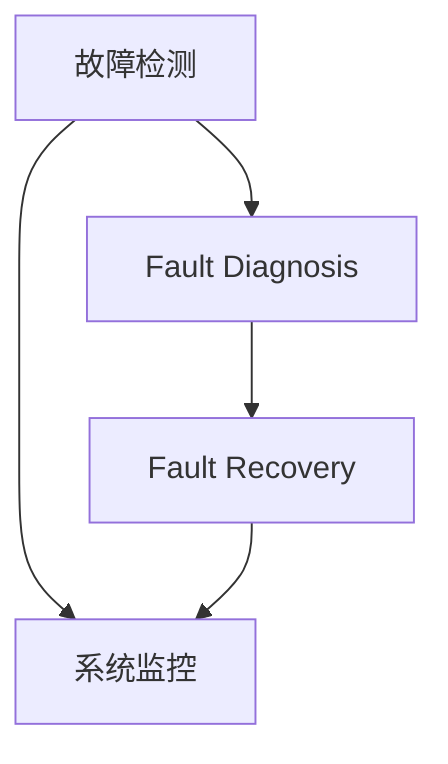

                 

# AI训练中的故障容错:保证大规模系统稳定性

## 1. 背景介绍

### 1.1 问题由来
在AI训练过程中，大规模系统的稳定性与故障容错性是至关重要的考量因素。随着深度学习模型参数量级和训练规模的持续增长，训练任务变得越来越复杂和资源密集，如何保证训练过程的稳定性和可控性，成为许多研究者关注的核心问题。特别是对于深度学习训练，常会遇到内存溢出、计算资源耗尽、网络故障等故障，这些故障不仅会影响训练进度，还会造成数据和模型的损失。

这些问题在实际工程中极为常见。例如，在GPT-3的训练中，据报道其训练需要数十亿个计算核心，并连续运行数月，即使技术成熟，也难以避免故障的发生。因此，研究故障容错技术，以确保在各种故障场景下，系统依然能够继续训练或迅速恢复，是当前AI训练与大规模系统运维中的重要研究方向。

### 1.2 问题核心关键点
为了有效应对AI训练中的故障，本文将重点关注以下几个关键点：
1. 如何检测并诊断训练中的故障？
2. 如何在故障发生时进行有效恢复？
3. 如何设计健壮的算法和系统架构，保证系统的持续稳定？

解决这些问题，对于保障大规模AI训练系统的稳定性和容错性，具有重要意义。

## 2. 核心概念与联系

### 2.1 核心概念概述

为更好地理解故障容错技术，本节将介绍几个关键概念，并解释它们之间的联系。

- 故障(Fault)：AI训练过程中任何可能导致训练中断的异常情况。
- 容错性(Fault Tolerance)：系统在故障发生时，仍能保持正常运行的性能。
- 故障检测与诊断(Fault Detection and Diagnosis)：识别系统中发生的故障，并对其进行分类。
- 故障恢复(Fault Recovery)：在系统发生故障后，尽快恢复正常运行状态。
- 系统监控(System Monitoring)：实时监测系统的状态，及时发现异常。

这些概念之间的逻辑关系可以通过以下Mermaid流程图来展示：



这个流程图展示了大规模系统故障容错的主要流程：
1. 故障检测和系统监控实时发现异常。
2. 故障诊断对检测到的故障进行分类。
3. 故障恢复针对故障类型采取相应的恢复措施。
4. 系统监控持续监控系统状态，保障整个故障恢复过程的顺利进行。

## 3. 核心算法原理 & 具体操作步骤
### 3.1 算法原理概述

故障容错算法的基本思想是在系统发生故障时，自动检测和诊断故障，并执行相应的恢复操作，使系统尽快恢复正常运行状态。其核心算法包括故障检测算法、故障诊断算法和故障恢复算法。

- 故障检测算法：用于识别系统中的异常情况，如内存溢出、计算资源耗尽、网络故障等。
- 故障诊断算法：根据检测到的故障特征，对故障进行分类和分析，确定故障的性质和原因。
- 故障恢复算法：根据诊断结果，采取相应的恢复措施，如重启、数据迁移、算法优化等。

故障容错算法通常结合系统监控机制使用，以实现实时故障检测和诊断，确保系统的持续稳定运行。

### 3.2 算法步骤详解

故障容错算法大致可分为以下几个步骤：

**Step 1: 准备系统监控工具**
- 安装和配置系统监控工具，如Prometheus、Grafana、ELK Stack等。
- 设定监控指标，如CPU利用率、内存使用、网络流量等。

**Step 2: 配置故障检测规则**
- 定义故障检测规则，包括阈值、时间窗口、报警方式等。
- 设置关键业务的监控规则，如模型训练任务、分布式计算集群等。

**Step 3: 实施故障检测**
- 实时监测系统运行状态，检查是否触发任何异常规则。
- 将异常情况记录到日志或数据库中，作为故障诊断的依据。

**Step 4: 实施故障诊断**
- 根据故障检测的结果，使用故障诊断算法对故障进行分类。
- 确定故障类型和影响范围，并输出诊断报告。

**Step 5: 实施故障恢复**
- 根据故障诊断结果，使用故障恢复算法进行相应的恢复操作。
- 重启、迁移数据、优化算法等，使系统恢复正常运行。

**Step 6: 反馈与学习**
- 故障恢复后，持续监控系统状态，确保故障不再发生。
- 收集和分析故障数据，用于优化故障检测和诊断规则。

### 3.3 算法优缺点

故障容错算法具有以下优点：
1. 实时监控：通过实时监控系统状态，及时发现故障，减小影响范围。
2. 自动恢复：自动执行故障恢复操作，减少人工干预和手动操作。
3. 经验积累：从每次故障中学习和改进，提升系统的容错能力。

同时，该算法也存在以下局限性：
1. 监控难度大：对于高度分布式和大规模的系统，监控难度较大。
2. 误报率高：特别是对于复杂系统，由于各种噪声和干扰，误报率可能较高。
3. 恢复耗时：复杂的恢复操作可能需要较长时间，影响训练进度。

尽管存在这些局限性，但故障容错算法仍然是提高大规模AI训练系统稳定性的重要手段。

### 3.4 算法应用领域

故障容错算法广泛应用于各种大规模分布式系统，如云计算平台、数据中心、深度学习训练系统等。其关键应用场景包括：

1. 深度学习训练系统：如Google的TPU集群，需要实时监控训练任务状态，保证模型参数安全。
2. 大数据处理平台：如Hadoop、Spark，需要监控作业进度和资源使用，防止任务超时或资源耗尽。
3. 分布式存储系统：如HDFS、Ceph，需要监控数据读写性能，避免单点故障。
4. 实时搜索系统：如Elasticsearch，需要实时监控系统状态，保障服务可用性。

## 4. 数学模型和公式 & 详细讲解 & 举例说明
### 4.1 数学模型构建

本节将使用数学语言对故障容错算法进行详细阐述。

假设系统状态由状态向量 $x$ 表示，其中 $x_t = (x_{t1}, x_{t2}, ..., x_{tn})$ 为在时间 $t$ 的各个监控指标值。定义故障检测函数 $f(x)$，若 $x$ 在一定阈值范围内，则认为系统运行正常，否则认为发生异常。

故障检测的数学模型可以表示为：
$$
D_t = f(x_t)
$$
其中 $D_t$ 为故障检测结果，$1$ 表示系统正常，$0$ 表示系统异常。

### 4.2 公式推导过程

以内存使用监控为例，推导故障检测和诊断的公式。

假设系统内存使用量为 $x_1$，正常值范围为 $[low, high]$，则内存使用监控的故障检测公式为：
$$
D_1 = \begin{cases}
1, & \text{if } low \leq x_1 \leq high \\
0, & \text{otherwise}
\end{cases}
$$

故障诊断过程通常使用统计分析和机器学习模型。例如，定义一个分类器 $C(x)$ 用于对故障类型进行分类，输出为：
$$
L = C(x)
$$
其中 $L$ 为故障类型标签。

### 4.3 案例分析与讲解

以深度学习模型训练为例，假设训练任务在训练集上经过 $T$ 个epoch后，模型损失和验证损失分别为 $L_{train}$ 和 $L_{val}$，训练时间超过阈值 $T_{max}$，则认为训练任务出现异常。此时，可以使用故障恢复算法，如重启训练任务或迁移训练数据。

**Step 1: 故障检测**
- 检测训练时间是否超过 $T_{max}$。
- 如果超过，则进行故障诊断。

**Step 2: 故障诊断**
- 使用分类器 $C(x)$ 对训练状态进行分类，判断是哪类故障。

**Step 3: 故障恢复**
- 根据诊断结果，重启训练任务或迁移数据，恢复训练状态。

## 5. 项目实践：代码实例和详细解释说明
### 5.1 开发环境搭建

在进行故障容错实践前，我们需要准备好开发环境。以下是使用Python进行Prometheus和Grafana的开发环境配置流程：

1. 安装Anaconda：从官网下载并安装Anaconda，用于创建独立的Python环境。

2. 创建并激活虚拟环境：
```bash
conda create -n prometheus-env python=3.8 
conda activate prometheus-env
```

3. 安装Prometheus和Grafana：
```bash
pip install prometheus-client[async]
pip install grafana
```

4. 安装各类工具包：
```bash
pip install numpy pandas scikit-learn matplotlib tqdm jupyter notebook ipython
```

完成上述步骤后，即可在`prometheus-env`环境中开始故障容错实践。

### 5.2 源代码详细实现

下面我们以内存使用监控为例，给出使用Prometheus和Grafana实现故障容错监控的Python代码实现。

首先，定义监控指标的度量对象：

```python
from prometheus_client import Gauge

memory = Gauge('memory_usage', 'Memory usage in MB', ['name'])
```

接着，编写监控脚本，在每个epoch结束时更新内存使用度量对象：

```python
import os
import time

memory.add_metric('name', os.popen('free -m').read().split()[2] or 0)
time.sleep(1)
```

然后，将脚本部署到Kubernetes集群，确保在每个epoch结束时自动更新内存使用度量对象。

最后，使用Grafana进行实时监控和告警配置。

**注意：**

- Prometheus和Grafana均为开源软件，具有丰富的文档和社区支持，需按官方文档配置和使用。
- 在实际部署时，需要考虑监控指标的选择、告警策略的设定，以及系统的可扩展性。

### 5.3 代码解读与分析

让我们再详细解读一下关键代码的实现细节：

**Prometheus Exporter**：
- `Gauge` 对象用于定义度量对象，指定名称、描述和标签。
- 通过 `add_metric` 方法在监控指标上添加度量值。
- 使用 `os.popen('free -m').read().split()[2]` 获取系统内存使用量。

**Grafana Dashboard**：
- 使用 Grafana 创建监控仪表盘，设置查询条件和告警阈值。
- 通过 alerting 功能，根据监控指标的变化触发告警。

**Kubernetes Deployment**：
- 将监控脚本部署为 Kubernetes Pod，设置资源和重启策略。
- 使用 service account 和 secrets，确保脚本可执行。

可以看到，Prometheus和Grafana结合使用，可以实现实时监控和告警，自动检测和诊断故障，迅速恢复系统正常运行。

## 6. 实际应用场景
### 6.1 云计算平台

在云计算平台中，故障容错技术可以保障多个深度学习模型的持续训练，同时确保平台服务的高可用性和稳定性。

**应用场景**：
- 监控大规模训练任务的运行状态，如资源使用、任务进度等。
- 实时检测内存溢出、计算资源耗尽、网络故障等异常情况。
- 自动执行故障恢复操作，如重启任务、迁移数据、优化算法等。

**实际应用**：
- Google的TPU集群使用故障容错技术，保障大规模模型训练的稳定性和效率。
- AWS和Azure等云平台，提供实时的系统监控和告警服务，确保训练任务在发生故障后能迅速恢复。

### 6.2 数据中心

数据中心需要处理海量数据和计算任务，保证数据存储和处理的高可靠性和高效性。故障容错技术在数据中心中尤为重要。

**应用场景**：
- 实时监控存储系统的性能指标，如磁盘读写速度、存储容量等。
- 检测磁盘故障、网络延迟等异常情况。
- 自动恢复存储系统故障，保障数据一致性和完整性。

**实际应用**：
- Facebook使用故障容错技术，保障其数据中心的稳定运行。
- 数据备份和恢复系统，如CDW（ClearDataWay），通过实时监控和故障恢复，确保数据安全。

### 6.3 深度学习训练

深度学习模型训练需要处理大规模数据和计算任务，一旦发生故障，往往会造成数据和模型损失。故障容错技术可以保证训练任务的连续性和可靠性。

**应用场景**：
- 实时监控训练任务的状态，如训练进度、模型参数、计算资源等。
- 检测内存溢出、计算资源耗尽等异常情况。
- 自动恢复训练任务，保障模型参数和训练数据的完整性。

**实际应用**：
- 大型科研机构使用故障容错技术，保障深度学习模型的持续训练和优化。
- 商业公司如IBM、Google，使用故障容错技术，确保深度学习模型的训练效率和精度。

### 6.4 未来应用展望

随着AI技术的进一步发展，故障容错技术将在更多领域得到应用，带来新的创新和突破：

1. 边缘计算：在移动端、嵌入式设备等边缘计算场景中，故障容错技术可保障计算任务在离线或弱网络环境下的稳定运行。
2. 自动驾驶：在自动驾驶系统中，故障容错技术可保障系统在感知、决策等关键环节的可靠性和安全性。
3. 物联网（IoT）：在物联网设备中，故障容错技术可保障数据采集、传输和处理任务的稳定性和高效性。
4. 遥感监测：在遥感监测系统中，故障容错技术可保障数据采集和分析任务的连续性和可靠性。

未来，故障容错技术将与更多前沿技术融合，如边缘计算、物联网、自动驾驶等，共同推动AI技术的发展和应用。

## 7. 工具和资源推荐
### 7.1 学习资源推荐

为了帮助开发者系统掌握故障容错理论基础和实践技巧，这里推荐一些优质的学习资源：

1. 《系统可靠性与故障容错》系列书籍：深入讲解系统可靠性理论、故障检测、诊断和恢复等技术。
2. 《Principles of Distributed Systems》课程：麻省理工学院开设的分布式系统课程，涵盖系统可靠性、容错机制等内容。
3. 《Fault Tolerance》书籍：讲解各种故障容错技术，包括分布式系统、软件系统等。
4. 《Fault-Tolerant Systems》课程：由John Ansty教授讲授，讲解分布式系统的可靠性与容错技术。
5. 《Prometheus》官方文档：详细说明Prometheus的架构和使用方法，是故障监控的开源工具。
6. 《Grafana》官方文档：详细介绍Grafana的仪表盘设计和告警配置，是实时监控的开源工具。

通过对这些资源的学习实践，相信你一定能够快速掌握故障容错技术的精髓，并用于解决实际的系统问题。

### 7.2 开发工具推荐

高效的开发离不开优秀的工具支持。以下是几款用于故障容错开发的常用工具：

1. Prometheus：开源系统监控工具，提供实时数据收集和查询功能，支持各种数据源。
2. Grafana：开源可视化工具，可与Prometheus集成，提供丰富的仪表盘和告警功能。
3. ELK Stack：日志收集、存储和分析工具，支持各种日志格式和存储介质。
4. Weights & Biases：模型训练的实验跟踪工具，记录和可视化训练过程中的各项指标。
5. TensorBoard：TensorFlow配套的可视化工具，实时监测模型训练状态，提供丰富的图表呈现方式。

合理利用这些工具，可以显著提升故障容错任务的开发效率，加快创新迭代的步伐。

### 7.3 相关论文推荐

故障容错技术的发展源于学界的持续研究。以下是几篇奠基性的相关论文，推荐阅读：

1. "A Survey of Fault Tolerance Techniques for Cloud Computing"：一篇综述论文，介绍了云平台中的故障容错技术。
2. "Fault Tolerance in Data Centers: Architectural Approaches"：介绍了数据中心的故障容错技术，包括冗余设计、容错通信等。
3. "Fault Tolerant Machine Learning"：介绍了机器学习中的故障容错技术，包括数据备份、模型冗余等。
4. "Fault Tolerant Deep Learning"：介绍深度学习中的故障容错技术，包括模型重启、数据迁移等。
5. "Fault Tolerance in Distributed Systems"：介绍了分布式系统中的故障容错技术，包括一致性协议、冗余设计等。

这些论文代表了大规模系统容错技术的最新进展，通过学习这些前沿成果，可以帮助研究者把握学科前进方向，激发更多的创新灵感。

## 8. 总结：未来发展趋势与挑战
### 8.1 总结

本文对故障容错技术进行了全面系统的介绍。首先阐述了故障容错在AI训练中的重要性，明确了故障检测、诊断和恢复的关键步骤。其次，从原理到实践，详细讲解了故障容错算法的数学模型和详细步骤，给出了故障容错任务开发的完整代码实例。同时，本文还广泛探讨了故障容错技术在多个领域的应用前景，展示了容错范式的巨大潜力。最后，本文精选了故障容错技术的各类学习资源，力求为读者提供全方位的技术指引。

通过本文的系统梳理，可以看到，故障容错技术在保证大规模AI训练系统稳定性和容错性方面，具有重要意义。这些技术的不断进步和优化，必将进一步保障AI系统的可靠性和高效性，推动AI技术在更多场景中的应用。

### 8.2 未来发展趋势

展望未来，故障容错技术将呈现以下几个发展趋势：

1. 实时化、自动化：通过实时监控和自动化操作，进一步提高故障检测和诊断的效率，减少人工干预。
2. 智能化、自适应：引入智能算法和自适应机制，提升故障检测和诊断的准确性和鲁棒性。
3. 分布式化、边缘化：将故障容错技术扩展到边缘计算和分布式系统，提升系统的可扩展性和灵活性。
4. 多模态化、融合化：结合多模态数据，如传感器数据、图像数据等，提升故障检测和诊断的全面性和准确性。
5. 自学习、自优化：引入自学习机制，不断从故障数据中学习和优化故障检测和诊断算法。

以上趋势凸显了大规模系统容错技术的广阔前景。这些方向的探索发展，必将进一步提升AI系统的稳定性和可靠性，为各行各业带来更多的创新和应用价值。

### 8.3 面临的挑战

尽管故障容错技术已经取得了一定的进展，但在迈向更加智能化、自适应化应用的过程中，仍面临诸多挑战：

1. 监控复杂性：对于分布式、异构的系统，监控难度较大，需要处理大量异构数据和复杂流程。
2. 误报率高：由于各种噪声和干扰，误报率可能较高，需要引入更精确的算法和更严格的阈值控制。
3. 资源消耗大：实时监控和故障恢复需要大量计算资源，影响系统性能。
4. 恢复耗时长：复杂的恢复操作可能需要较长时间，影响系统运行效率。
5. 跨系统协同：跨系统协同和数据共享难度大，需要设计统一的标准和接口。

这些挑战需要结合技术、管理和组织等多方面因素进行综合解决。唯有从数据、算法、工程、组织等多个维度协同发力，才能真正实现大规模系统的故障容错。

### 8.4 研究展望

面对故障容错面临的种种挑战，未来的研究需要在以下几个方面寻求新的突破：

1. 引入高级算法：如神经网络、深度学习等，提升故障检测和诊断的准确性和鲁棒性。
2. 设计跨系统协议：通过统一的接口和协议，实现跨系统的协同和数据共享。
3. 优化恢复算法：引入高效的数据迁移和算法优化技术，缩短故障恢复时间。
4. 引入自适应机制：根据系统的运行状态和历史故障记录，动态调整监控和恢复策略。
5. 引入自学习机制：通过自学习算法，不断从故障数据中学习和优化故障检测和诊断算法。

这些研究方向的探索，必将引领故障容错技术迈向更高的台阶，为构建安全、可靠、高效的大规模系统提供新的思路和方法。只有勇于创新、敢于突破，才能真正实现人工智能技术在各种场景中的应用价值。

## 9. 附录：常见问题与解答

**Q1：什么是故障容错技术？**

A: 故障容错技术是一种保障系统在故障发生时，仍能保持正常运行的技术手段。其核心在于故障检测、诊断和恢复。

**Q2：如何检测系统中的故障？**

A: 通过实时监控系统状态，使用故障检测算法，如阈值检测、统计分析等，识别系统中的异常情况。

**Q3：如何诊断故障？**

A: 使用故障诊断算法，如分类器、决策树等，对故障进行分类和分析，确定故障的性质和原因。

**Q4：如何恢复系统？**

A: 根据故障诊断结果，使用故障恢复算法，如重启任务、迁移数据、优化算法等，使系统恢复正常运行。

**Q5：如何提升故障容错性？**

A: 引入先进的算法和系统架构，如神经网络、分布式系统、自适应机制等，提升故障检测和诊断的准确性和鲁棒性。

**Q6：如何降低误报率？**

A: 设计更精确的故障检测算法，使用严格的阈值控制，结合自学习机制，不断优化故障检测算法。

通过本文的系统梳理，可以看到，故障容错技术在保证大规模AI训练系统稳定性和容错性方面，具有重要意义。这些技术的不断进步和优化，必将进一步保障AI系统的可靠性和高效性，推动AI技术在更多场景中的应用。

---

作者：禅与计算机程序设计艺术 / Zen and the Art of Computer Programming

