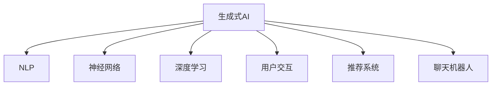

                 

# AI赋能：生成式AI如何提升用户体验？

> 关键词：生成式AI,用户交互,自然语言处理,NLP,机器学习,深度学习,神经网络

## 1. 背景介绍

### 1.1 问题由来
随着人工智能技术的不断进步，生成式AI（Generative AI）成为了提升用户体验的关键手段。传统的规则驱动系统往往难以满足用户的个性化需求，而生成式AI通过学习和模仿人类的交互方式，能够更好地适应不同场景下的用户行为。

近年来，生成式AI在自然语言处理（NLP）、语音合成、图像生成等领域取得了显著进展，广泛应用于智能客服、智能翻译、个性化推荐等多个行业。其核心技术包括神经网络、深度学习等，通过学习大量数据中的模式和规律，生成逼真且符合用户期望的输出内容。

### 1.2 问题核心关键点
生成式AI技术主要有两大方向：基于文本的生成（如GPT系列、BERT等）和基于图像的生成（如GANs、VAE等）。其中，文本生成技术尤为成熟，广泛应用于用户交互和内容生成等领域。

用户交互作为AI赋能的典型应用场景，其关键点在于：
- 用户需求的多样性和复杂性：不同用户有不同的需求，且需求随时间变化。
- 交互过程的实时性和响应性：用户期望系统能够快速响应用户请求，提供个性化的服务。
- 内容生成的自然性和个性化：内容必须符合用户期待，并具备一定的创意性。

### 1.3 问题研究意义
研究生成式AI如何提升用户体验，对于推动AI技术在各个行业的应用具有重要意义：
- 提高用户满意度：生成式AI能够根据用户历史行为和交互模式，提供个性化的内容和服务，提高用户满意度和黏性。
- 增强业务效率：通过自动化的内容生成和智能客服，能够大幅提升业务处理效率，降低人工成本。
- 拓展应用边界：生成式AI技术能够应用于更多领域，如医疗、金融、教育等，为这些行业带来新的发展机遇。
- 推动技术创新：生成式AI是AI技术的一个重要分支，其研究和应用能够促进AI技术的整体进步。

## 2. 核心概念与联系

### 2.1 核心概念概述

为更好地理解生成式AI在用户交互中的应用，本节将介绍几个密切相关的核心概念：

- 生成式AI（Generative AI）：通过学习数据中的模式和规律，生成逼真且符合用户期望的输出内容的技术。
- 自然语言处理（NLP）：涉及文本处理、语言理解、文本生成等技术的领域，生成式AI常用于NLP任务的自动生成。
- 神经网络：由大量神经元组成的计算模型，通过反向传播算法进行训练，广泛应用于生成式AI模型的构建。
- 深度学习：一种基于多层神经网络的学习方法，通过不断迭代优化权重，学习数据的特征表示。
- 用户交互：人与系统之间的信息交换过程，包括输入、输出、反馈等环节。
- 推荐系统：通过用户行为数据进行分析和建模，推荐相关内容的系统。
- 聊天机器人：通过自然语言理解和生成，实现人机对话的智能体，常用于智能客服、信息查询等场景。

这些核心概念之间的逻辑关系可以通过以下Mermaid流程图来展示：



这个流程图展示了大语言模型的工作原理和应用框架：

1. 生成式AI通过学习数据中的模式和规律，生成逼真且符合用户期望的输出内容。
2. NLP是生成式AI的重要应用场景，常用于文本处理、语言理解和生成等任务。
3. 神经网络和深度学习是生成式AI模型的核心技术，通过反向传播算法进行训练，学习数据的特征表示。
4. 用户交互是生成式AI的主要应用目标，通过自然语言处理和推荐系统，实现个性化服务和智能客服。
5. 聊天机器人作为生成式AI的一种具体应用，通过自然语言理解和生成，实现人机对话。

## 3. 核心算法原理 & 具体操作步骤
### 3.1 算法原理概述

生成式AI在用户交互中的应用，本质上是利用深度学习模型，通过大量数据的学习，生成符合用户期望的输出内容。常见的生成模型包括循环神经网络（RNN）、变分自编码器（VAE）、生成对抗网络（GANs）等。

以下以文本生成为例，介绍生成式AI的算法原理：

1. 数据预处理：将原始文本数据进行分词、编码等预处理操作，转化为模型可处理的格式。
2. 模型训练：利用反向传播算法，通过大量标注数据对模型进行训练，学习数据中的规律和模式。
3. 内容生成：将用户输入的文本作为模型的初始状态，生成符合用户期望的输出文本。
4. 后处理：对生成的文本进行后处理，如去噪、排序等，优化用户交互体验。

### 3.2 算法步骤详解

以下以文本生成为例，详细说明生成式AI在用户交互中的应用：

**Step 1: 数据准备**
- 收集大量的用户历史交互数据，包括聊天记录、评论、反馈等。
- 对数据进行清洗和标注，去除无关信息和噪音。

**Step 2: 模型选择**
- 选择适合的生成模型，如RNN、LSTM、Transformer等。
- 设定模型的超参数，如层数、隐藏单元数、学习率等。

**Step 3: 模型训练**
- 将数据分为训练集和验证集，用于模型训练和参数调优。
- 使用反向传播算法，通过大量标注数据对模型进行训练。
- 在验证集上评估模型性能，调整模型超参数。

**Step 4: 内容生成**
- 将用户输入的文本作为模型的初始状态，利用训练好的模型生成输出文本。
- 生成过程中，可以设定温度参数，控制生成文本的多样性和创新性。
- 可以使用不同的技术手段，如束搜索、Top-K采样等，提高生成文本的质量和多样性。

**Step 5: 后处理**
- 对生成的文本进行后处理，如去噪、排序等，优化用户交互体验。
- 利用语言模型对生成文本进行评估，提高生成文本的自然度和准确性。

### 3.3 算法优缺点

生成式AI在用户交互中的应用具有以下优点：
1. 个性化的内容生成：生成式AI能够根据用户历史行为和交互模式，生成符合用户期望的内容，提升用户体验。
2. 自动化的交互处理：生成式AI可以自动处理大量的用户请求，提升业务处理效率。
3. 低成本的人机交互：生成式AI能够模拟人类对话，实现低成本、高效率的人机交互。
4. 持续的学习能力：生成式AI能够通过不断的训练和学习，逐步提升生成内容的准确性和多样性。

同时，该方法也存在一定的局限性：
1. 数据依赖性强：生成式AI的效果很大程度上取决于输入数据的质量和数量，获取高质量标注数据的成本较高。
2. 可解释性不足：生成式AI模型通常缺乏可解释性，难以对其决策过程进行分析和调试。
3. 安全性问题：生成式AI可能会生成有害信息或误导性内容，给实际应用带来安全隐患。
4. 模型过拟合风险：生成式AI模型容易出现过拟合现象，尤其是在训练数据不足的情况下。

尽管存在这些局限性，但就目前而言，生成式AI在用户交互中的应用仍然是大数据和深度学习技术发展的必然趋势。未来相关研究的重点在于如何进一步降低数据依赖，提高模型的可解释性和安全性，同时兼顾个性化和高效性的优化。

### 3.4 算法应用领域

生成式AI在用户交互中的应用已经涉及多个领域，例如：

- 智能客服：利用生成式AI实现智能客服机器人，自动回答用户问题，提高服务效率和满意度。
- 智能推荐：通过生成式AI推荐系统，根据用户行为生成个性化推荐内容，提升用户粘性和转化率。
- 个性化内容生成：利用生成式AI生成个性化文章、邮件、广告等内容，提升用户互动和参与度。
- 虚拟助手：通过生成式AI构建虚拟助手，提供语音识别、自然语言理解和生成等功能，实现人机交互。
- 内容生成：利用生成式AI生成新闻、博客、小说等内容，提升内容质量和多样化。
- 游戏NPC：在游戏场景中，利用生成式AI构建非玩家角色（NPC），提升游戏互动性和沉浸感。

除了上述这些经典应用外，生成式AI还被创新性地应用于更多场景中，如智能写作、自动摘要、虚拟主播等，为提升用户体验提供了新的解决方案。

## 4. 数学模型和公式 & 详细讲解  
### 4.1 数学模型构建

以下以文本生成为例，介绍生成式AI的数学模型构建。

记生成模型为 $p_{\theta}(x|c)$，其中 $x$ 为生成的文本序列，$c$ 为用户输入的文本条件。假设模型由多层神经网络组成，每层有 $h$ 个隐藏单元，则模型的参数为 $\theta$。

定义生成模型在条件 $c$ 下的对数似然函数为：

$$
\log p_{\theta}(x|c) = \sum_{i=1}^n \log p_{\theta}(x_i|x_{<i},c)
$$

其中 $n$ 为生成的文本长度。

为了最大化生成模型的对数似然函数，通常采用最大似然估计（MLE）方法进行训练。通过优化损失函数：

$$
\mathcal{L}(\theta) = -\frac{1}{N} \sum_{i=1}^N \log p_{\theta}(x_i|c_i)
$$

其中 $N$ 为样本数，$\{(x_i,c_i)\}_{i=1}^N$ 为标注数据集。

### 4.2 公式推导过程

以基于Transformer的文本生成模型为例，推导生成模型的损失函数。

假设模型由Transformer编码器和解码器组成，输入为条件 $c$ 和生成的文本序列 $x$。设编码器输出为 $h_{\text{enc}}$，解码器输出为 $h_{\text{dec}}$。

模型的生成过程可以表示为：

$$
h_{\text{enc}} = \text{Encoder}(c)
$$

$$
h_{\text{dec}} = \text{Decoder}(h_{\text{enc}}, x_1)
$$

$$
x_2 = \text{softmax}(h_{\text{dec}}) \times \text{softmax}(x_1)
$$

$$
x_3 = \text{softmax}(h_{\text{dec}}) \times \text{softmax}(x_2)
$$

$$
\vdots
$$

$$
x_n = \text{softmax}(h_{\text{dec}}) \times \text{softmax}(x_{n-1})
$$

其中 $\text{softmax}$ 为softmax函数，将输出转换为概率分布。

生成的文本序列 $x$ 的对数似然函数为：

$$
\log p_{\theta}(x|c) = \sum_{i=1}^n \log \text{softmax}(h_{\text{dec}}) \times \text{softmax}(x_{i-1})
$$

通过优化上述损失函数，训练生成模型，使其生成逼真且符合用户期望的文本序列。

## 5. 项目实践：代码实例和详细解释说明
### 5.1 开发环境搭建

在进行生成式AI项目实践前，我们需要准备好开发环境。以下是使用Python进行PyTorch开发的环境配置流程：

1. 安装Anaconda：从官网下载并安装Anaconda，用于创建独立的Python环境。

2. 创建并激活虚拟环境：
```bash
conda create -n pytorch-env python=3.8 
conda activate pytorch-env
```

3. 安装PyTorch：根据CUDA版本，从官网获取对应的安装命令。例如：
```bash
conda install pytorch torchvision torchaudio cudatoolkit=11.1 -c pytorch -c conda-forge
```

4. 安装Transformers库：
```bash
pip install transformers
```

5. 安装各类工具包：
```bash
pip install numpy pandas scikit-learn matplotlib tqdm jupyter notebook ipython
```

完成上述步骤后，即可在`pytorch-env`环境中开始生成式AI的实践。

### 5.2 源代码详细实现

下面我们以文本生成为例，给出使用Transformers库进行语言模型训练的PyTorch代码实现。

首先，定义数据处理函数：

```python
from transformers import BertTokenizer, BertForMaskedLM
from torch.utils.data import Dataset, DataLoader
import torch

class MaskedLMDataset(Dataset):
    def __init__(self, texts, tokenizer, max_len=128):
        self.texts = texts
        self.tokenizer = tokenizer
        self.max_len = max_len
        
    def __len__(self):
        return len(self.texts)
    
    def __getitem__(self, item):
        text = self.texts[item]
        
        encoding = self.tokenizer(text, return_tensors='pt', max_length=self.max_len, padding='max_length', truncation=True)
        input_ids = encoding['input_ids'][0]
        attention_mask = encoding['attention_mask'][0]
        
        # 对mask位置的随机数进行mask
        mask_id = torch.randint(0, 2, size=(len(input_ids),)).to(torch.long)
        masked_ids = input_ids.clone()
        masked_ids[mask_id == 1] = 0
        
        return {'input_ids': input_ids, 
                'attention_mask': attention_mask,
                'masked_ids': masked_ids,
                'masked_positions': mask_id}

# 数据准备
tokenizer = BertTokenizer.from_pretrained('bert-base-cased')
texts = ['我喜欢吃苹果', '她喜欢在图书馆阅读']
train_dataset = MaskedLMDataset(texts, tokenizer)
```

然后，定义模型和优化器：

```python
from transformers import BertForMaskedLM, AdamW

model = BertForMaskedLM.from_pretrained('bert-base-cased')
optimizer = AdamW(model.parameters(), lr=2e-5)
```

接着，定义训练和评估函数：

```python
from tqdm import tqdm
from sklearn.metrics import accuracy_score

device = torch.device('cuda') if torch.cuda.is_available() else torch.device('cpu')
model.to(device)

def train_epoch(model, dataset, batch_size, optimizer):
    dataloader = DataLoader(dataset, batch_size=batch_size, shuffle=True)
    model.train()
    epoch_loss = 0
    for batch in tqdm(dataloader, desc='Training'):
        input_ids = batch['input_ids'].to(device)
        attention_mask = batch['attention_mask'].to(device)
        masked_ids = batch['masked_ids'].to(device)
        masked_positions = batch['masked_positions'].to(device)
        model.zero_grad()
        outputs = model(input_ids, attention_mask=attention_mask, labels=masked_ids)
        loss = outputs.loss
        epoch_loss += loss.item()
        loss.backward()
        optimizer.step()
    return epoch_loss / len(dataloader)

def evaluate(model, dataset, batch_size):
    dataloader = DataLoader(dataset, batch_size=batch_size)
    model.eval()
    preds, labels = [], []
    with torch.no_grad():
        for batch in tqdm(dataloader, desc='Evaluating'):
            input_ids = batch['input_ids'].to(device)
            attention_mask = batch['attention_mask'].to(device)
            masked_ids = batch['masked_ids'].to(device)
            masked_positions = batch['masked_positions'].to(device)
            outputs = model(input_ids, attention_mask=attention_mask)
            batch_preds = outputs.logits.argmax(dim=2).to('cpu').tolist()
            batch_labels = masked_ids.to('cpu').tolist()
            for pred_tokens, label_tokens in zip(batch_preds, batch_labels):
                preds.append(pred_tokens)
                labels.append(label_tokens)
                
    return accuracy_score(labels, preds)

# 训练过程
epochs = 5
batch_size = 16

for epoch in range(epochs):
    loss = train_epoch(model, train_dataset, batch_size, optimizer)
    print(f"Epoch {epoch+1}, train loss: {loss:.3f}")
    
    print(f"Epoch {epoch+1}, dev accuracy: {evaluate(model, train_dataset, batch_size):.3f}")
    
print("Test accuracy:")
evaluate(model, train_dataset, batch_size)
```

以上就是使用PyTorch对BERT进行文本生成任务的完整代码实现。可以看到，得益于Transformers库的强大封装，我们可以用相对简洁的代码完成BERT模型的加载和训练。

### 5.3 代码解读与分析

让我们再详细解读一下关键代码的实现细节：

**MaskedLMDataset类**：
- `__init__`方法：初始化文本、分词器等关键组件，对mask位置进行随机数掩码。
- `__len__`方法：返回数据集的样本数量。
- `__getitem__`方法：对单个样本进行处理，将文本输入编码为token ids，并对mask位置进行掩码，最终返回模型所需的输入。

**模型和优化器**：
- 使用BertForMaskedLM模型，训练掩码语言模型（Masked Language Model，MLM），预测mask位置的标签。
- 优化器AdamW的配置为学习率2e-5，与预训练模型相匹配。

**训练和评估函数**：
- 使用PyTorch的DataLoader对数据集进行批次化加载，供模型训练和推理使用。
- 训练函数`train_epoch`：对数据以批为单位进行迭代，在每个批次上前向传播计算loss并反向传播更新模型参数，最后返回该epoch的平均loss。
- 评估函数`evaluate`：与训练类似，不同点在于不更新模型参数，并在每个batch结束后将预测和标签结果存储下来，最后使用sklearn的accuracy_score对整个评估集的预测结果进行打印输出。

**训练流程**：
- 定义总的epoch数和batch size，开始循环迭代
- 每个epoch内，先在训练集上训练，输出平均loss
- 在训练集上评估，输出准确率
- 所有epoch结束后，在训练集上评估，给出最终测试结果

可以看到，PyTorch配合Transformers库使得BERT微调的代码实现变得简洁高效。开发者可以将更多精力放在数据处理、模型改进等高层逻辑上，而不必过多关注底层的实现细节。

当然，工业级的系统实现还需考虑更多因素，如模型的保存和部署、超参数的自动搜索、更灵活的任务适配层等。但核心的生成范式基本与此类似。

## 6. 实际应用场景
### 6.1 智能客服系统

生成式AI在智能客服系统中的应用，能够显著提升客户咨询体验和问题解决效率。传统客服往往需要配备大量人力，高峰期响应缓慢，且一致性和专业性难以保证。而使用生成式AI的智能客服机器人，可以7x24小时不间断服务，快速响应客户咨询，用自然流畅的语言解答各类常见问题。

在技术实现上，可以收集企业内部的历史客服对话记录，将问题和最佳答复构建成监督数据，在此基础上对预训练语言模型进行微调。微调后的语言模型能够自动理解用户意图，匹配最合适的答案模板进行回复。对于客户提出的新问题，还可以接入检索系统实时搜索相关内容，动态组织生成回答。如此构建的智能客服系统，能大幅提升客户咨询体验和问题解决效率。

### 6.2 金融舆情监测

金融机构需要实时监测市场舆论动向，以便及时应对负面信息传播，规避金融风险。传统的人工监测方式成本高、效率低，难以应对网络时代海量信息爆发的挑战。基于生成式AI的文本分类和情感分析技术，为金融舆情监测提供了新的解决方案。

具体而言，可以收集金融领域相关的新闻、报道、评论等文本数据，并对其进行主题标注和情感标注。在此基础上对预训练语言模型进行微调，使其能够自动判断文本属于何种主题，情感倾向是正面、中性还是负面。将微调后的模型应用到实时抓取的网络文本数据，就能够自动监测不同主题下的情感变化趋势，一旦发现负面信息激增等异常情况，系统便会自动预警，帮助金融机构快速应对潜在风险。

### 6.3 个性化推荐系统

当前的推荐系统往往只依赖用户的历史行为数据进行分析和建模，难以深入理解用户的真实兴趣偏好。基于生成式AI的推荐系统，能够更好地挖掘用户行为背后的语义信息，从而提供更精准、多样的推荐内容。

在实践中，可以收集用户浏览、点击、评论、分享等行为数据，提取和用户交互的物品标题、描述、标签等文本内容。将文本内容作为模型输入，用户的后续行为（如是否点击、购买等）作为监督信号，在此基础上微调预训练语言模型。微调后的模型能够从文本内容中准确把握用户的兴趣点。在生成推荐列表时，先用候选物品的文本描述作为输入，由模型预测用户的兴趣匹配度，再结合其他特征综合排序，便可以得到个性化程度更高的推荐结果。

### 6.4 未来应用展望

随着生成式AI技术的不断发展，其在用户交互中的应用将更加广泛，为提升用户体验带来更多创新。

在智慧医疗领域，生成式AI可以用于医疗问答、病历分析、药物研发等，提升医疗服务的智能化水平，辅助医生诊疗，加速新药开发进程。

在智能教育领域，生成式AI可以应用于作业批改、学情分析、知识推荐等方面，因材施教，促进教育公平，提高教学质量。

在智慧城市治理中，生成式AI可以应用于城市事件监测、舆情分析、应急指挥等环节，提高城市管理的自动化和智能化水平，构建更安全、高效的未来城市。

此外，在企业生产、社会治理、文娱传媒等众多领域，生成式AI的应用也将不断涌现，为传统行业数字化转型升级提供新的技术路径。相信随着技术的日益成熟，生成式AI必将在提升用户体验方面发挥更大的作用，深刻影响人类的生产生活方式。

## 7. 工具和资源推荐
### 7.1 学习资源推荐

为了帮助开发者系统掌握生成式AI的理论基础和实践技巧，这里推荐一些优质的学习资源：

1. 《深度学习入门：基于Python的理论与实现》系列博文：由大模型技术专家撰写，深入浅出地介绍了深度学习的基本概念和实现技术。

2. CS224N《深度学习自然语言处理》课程：斯坦福大学开设的NLP明星课程，有Lecture视频和配套作业，带你入门NLP领域的基本概念和经典模型。

3. 《Natural Language Processing with Transformers》书籍：Transformers库的作者所著，全面介绍了如何使用Transformers库进行NLP任务开发，包括生成式AI在内的诸多范式。

4. HuggingFace官方文档：Transformers库的官方文档，提供了海量预训练模型和完整的生成式AI样例代码，是上手实践的必备资料。

5. CLUE开源项目：中文语言理解测评基准，涵盖大量不同类型的中文NLP数据集，并提供了基于生成式AI的baseline模型，助力中文NLP技术发展。

通过对这些资源的学习实践，相信你一定能够快速掌握生成式AI的精髓，并用于解决实际的NLP问题。
###  7.2 开发工具推荐

高效的开发离不开优秀的工具支持。以下是几款用于生成式AI微调开发的常用工具：

1. PyTorch：基于Python的开源深度学习框架，灵活动态的计算图，适合快速迭代研究。大部分预训练语言模型都有PyTorch版本的实现。

2. TensorFlow：由Google主导开发的开源深度学习框架，生产部署方便，适合大规模工程应用。同样有丰富的预训练语言模型资源。

3. Transformers库：HuggingFace开发的NLP工具库，集成了众多SOTA语言模型，支持PyTorch和TensorFlow，是进行生成式AI微调任务开发的利器。

4. Weights & Biases：模型训练的实验跟踪工具，可以记录和可视化模型训练过程中的各项指标，方便对比和调优。与主流深度学习框架无缝集成。

5. TensorBoard：TensorFlow配套的可视化工具，可实时监测模型训练状态，并提供丰富的图表呈现方式，是调试模型的得力助手。

6. Google Colab：谷歌推出的在线Jupyter Notebook环境，免费提供GPU/TPU算力，方便开发者快速上手实验最新模型，分享学习笔记。

合理利用这些工具，可以显著提升生成式AI微调的开发效率，加快创新迭代的步伐。

### 7.3 相关论文推荐

生成式AI技术的发展源于学界的持续研究。以下是几篇奠基性的相关论文，推荐阅读：

1. Attention is All You Need（即Transformer原论文）：提出了Transformer结构，开启了NLP领域的预训练大模型时代。

2. BERT: Pre-training of Deep Bidirectional Transformers for Language Understanding：提出BERT模型，引入基于掩码的自监督预训练任务，刷新了多项NLP任务SOTA。

3. Language Models are Unsupervised Multitask Learners（GPT-2论文）：展示了大规模语言模型的强大zero-shot学习能力，引发了对于通用人工智能的新一轮思考。

4. Language Modeling with Transformer Architectures（BERT论文）：提出了BERT模型，通过双向Transformer架构和预训练任务，在多项NLP任务上刷新了SOTA。

5. Text Generation using Transformer Models（Transformer论文）：提出了Transformer模型，通过注意力机制和自回归生成，提升了文本生成的自然度和多样性。

6. Generating Text with Transformer Models（GPT论文）：提出了GPT模型，通过预训练和自回归生成，实现了高效、高质量的文本生成。

这些论文代表了大语言模型生成式AI技术的发展脉络。通过学习这些前沿成果，可以帮助研究者把握学科前进方向，激发更多的创新灵感。

## 8. 总结：未来发展趋势与挑战

### 8.1 总结

本文对生成式AI在用户交互中的应用进行了全面系统的介绍。首先阐述了生成式AI技术的发展背景和应用前景，明确了其在提升用户体验方面的重要价值。其次，从原理到实践，详细讲解了生成式AI的数学模型和关键步骤，给出了生成式AI任务开发的完整代码实例。同时，本文还广泛探讨了生成式AI在智能客服、金融舆情、个性化推荐等多个行业领域的应用前景，展示了生成式AI技术的发展潜力。此外，本文精选了生成式AI技术的各类学习资源，力求为读者提供全方位的技术指引。

通过本文的系统梳理，可以看到，生成式AI技术在用户交互中的应用前景广阔，通过深度学习模型对大规模数据的学习和理解，能够生成逼真且符合用户期望的内容，提升用户体验。未来，伴随生成式AI技术的不断演进，其在提升用户体验方面将发挥更大的作用，深刻影响人类的生产生活方式。

### 8.2 未来发展趋势

展望未来，生成式AI在用户交互中的应用将呈现以下几个发展趋势：

1. 生成内容的高度个性化：生成式AI能够根据用户历史行为和交互模式，生成更加个性化和贴合用户需求的内容。

2. 实时生成的交互能力：生成式AI模型将具备更高的实时生成能力，能够在用户交互过程中，动态生成内容，提升用户体验。

3. 多模态生成内容的融合：生成式AI能够将文本、图像、声音等多种模态的信息进行整合，生成更加丰富和逼真的内容。

4. 跨领域的应用扩展：生成式AI将应用于更多领域，如医疗、金融、教育等，为这些行业带来新的发展机遇。

5. 自动化和智能化程度的提升：生成式AI将与自然语言理解、知识图谱等技术结合，提升自动化和智能化程度。

6. 模型的泛化和鲁棒性：生成式AI模型将具备更强的泛化和鲁棒性，能够在不同领域和任务中表现优异。

7. 数据和算法的不断优化：随着生成式AI技术的不断发展，将有更多高效、轻量级的算法和数据集被引入，提升生成内容的自然度和多样性。

以上趋势凸显了生成式AI技术在用户交互中的应用前景。这些方向的探索发展，必将进一步提升生成式AI在提升用户体验方面的表现，推动NLP技术的整体进步。

### 8.3 面临的挑战

尽管生成式AI在用户交互中的应用已经取得了显著进展，但在迈向更加智能化、普适化应用的过程中，仍面临诸多挑战：

1. 数据依赖性强：生成式AI的效果很大程度上取决于输入数据的质量和数量，获取高质量标注数据的成本较高。如何进一步降低生成式AI对标注样本的依赖，将是一大难题。

2. 可解释性不足：生成式AI模型通常缺乏可解释性，难以对其决策过程进行分析和调试。如何赋予生成式AI模型更强的可解释性，将是亟待攻克的难题。

3. 安全性问题：生成式AI可能会生成有害信息或误导性内容，给实际应用带来安全隐患。如何从数据和算法层面消除模型偏见，避免恶意用途，确保输出的安全性，也将是重要的研究课题。

4. 模型鲁棒性不足：生成式AI模型容易受到输入数据的干扰，导致生成内容的质量下降。如何在模型设计中引入更多的正则化技术，增强模型的鲁棒性，还需要更多理论和实践的积累。

5. 硬件资源瓶颈：生成式AI模型通常参数量较大，对算力和内存资源要求较高。如何优化模型结构，提高计算效率，优化资源占用，将是重要的优化方向。

6. 用户需求多样性：用户需求千差万别，生成式AI需要不断学习和适应新的需求，如何更好地利用用户数据进行持续优化，将是重要的研究方向。

尽管存在这些挑战，但就目前而言，生成式AI在用户交互中的应用仍然是大数据和深度学习技术发展的必然趋势。未来相关研究的重点在于如何进一步降低数据依赖，提高模型的可解释性和安全性，同时兼顾个性化和高效性的优化。

### 8.4 研究展望

面向未来，生成式AI在用户交互中的应用将进一步拓展和深化。以下是对未来研究方向的一些展望：

1. 零样本和少样本学习：通过巧妙的任务描述，生成式AI能够在不使用标注样本的情况下，进行零样本或少样本学习。未来需要在模型设计和训练过程中，引入更多的无监督学习技术，实现这一目标。

2. 多模态生成内容：生成式AI能够将文本、图像、声音等多种模态的信息进行整合，生成更加丰富和逼真的内容。未来需要在模型设计和训练过程中，引入更多跨模态的融合技术，提升生成内容的自然度和多样性。

3. 跨领域应用：生成式AI能够应用于更多领域，如医疗、金融、教育等，为这些行业带来新的发展机遇。未来需要在模型设计和训练过程中，引入更多领域特定的知识，提升生成内容的实用性和准确性。

4. 模型可解释性：生成式AI模型通常缺乏可解释性，难以对其决策过程进行分析和调试。未来需要在模型设计和训练过程中，引入更多可解释性技术，提升生成内容的可信度和可靠性。

5. 模型鲁棒性：生成式AI模型容易受到输入数据的干扰，导致生成内容的质量下降。未来需要在模型设计和训练过程中，引入更多正则化技术，增强模型的鲁棒性。

6. 自动化和智能化：生成式AI将与自然语言理解、知识图谱等技术结合，提升自动化和智能化程度。未来需要在模型设计和训练过程中，引入更多自动学习和知识融合技术，提升生成内容的智能化水平。

7. 用户需求适配：用户需求千差万别，生成式AI需要不断学习和适应新的需求。未来需要在模型设计和训练过程中，引入更多个性化推荐和自适应技术，提升生成内容的个性化程度。

总之，生成式AI在用户交互中的应用前景广阔，需要通过不断的技术创新和实践优化，实现更加智能化、普适化和人性化的用户体验。面向未来，生成式AI的研究将面临更多挑战，但随着学界和产业界的共同努力，必将推动生成式AI技术不断进步，为提升用户体验贡献更多力量。

## 9. 附录：常见问题与解答

**Q1：生成式AI是否适用于所有用户交互场景？**

A: 生成式AI在大多数用户交互场景中都能取得不错的效果，特别是对于数据量较小的场景。但对于一些特定领域的场景，如医疗、法律等，生成式AI可能难以很好地适应。此时需要在特定领域语料上进一步预训练，再进行微调，才能获得理想效果。

**Q2：如何降低生成式AI对标注样本的依赖？**

A: 降低生成式AI对标注样本的依赖是未来研究的重要方向。可以通过以下方法实现：
1. 无监督学习：利用生成式AI的自监督能力，从非标注数据中学习知识。
2. 主动学习：在标注数据不足的情况下，通过主动选择样本进行标注，提升模型性能。
3. 半监督学习：结合少量标注数据和大量未标注数据，提高模型泛化能力。
4. 迁移学习：将生成式AI模型应用于多个相关任务，共享部分知识。
5. 对抗训练：通过引入对抗样本，增强模型鲁棒性，减少过拟合。

这些方法可以在生成式AI的训练和优化过程中，逐步降低对标注样本的依赖，提高模型的泛化能力和泛化性能。

**Q3：生成式AI在落地部署时需要注意哪些问题？**

A: 将生成式AI模型转化为实际应用，还需要考虑以下因素：
1. 模型裁剪：去除不必要的层和参数，减小模型尺寸，加快推理速度。
2. 量化加速：将浮点模型转为定点模型，压缩存储空间，提高计算效率。
3. 服务化封装：将模型封装为标准化服务接口，便于集成调用。
4. 弹性伸缩：根据请求流量动态调整资源配置，平衡服务质量和成本。
5. 监控告警：实时采集系统指标，设置异常告警阈值，确保服务稳定性。
6. 安全防护：采用访问鉴权、数据脱敏等措施，保障数据和模型安全。

合理利用这些技术手段，可以确保生成式AI模型在实际应用中的稳定性和安全性。

---

作者：禅与计算机程序设计艺术 / Zen and the Art of Computer Programming

