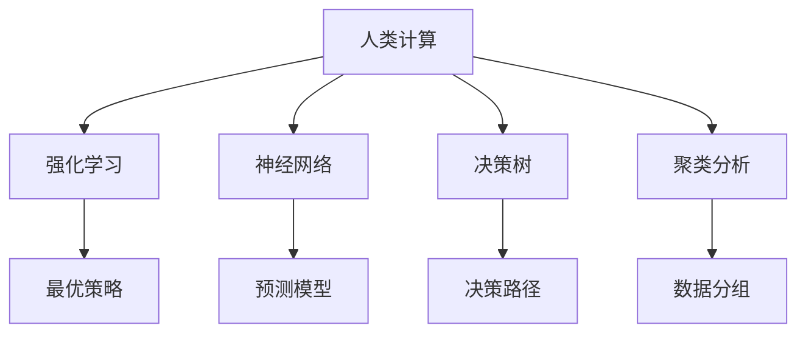

                 

## 1. 背景介绍

在当今数字化、智能化的商业环境中，人工智能（AI）已经成为了推动创新与效率的核心动力。其中，人类计算（Human Compute）作为AI的一个重要分支，通过模拟人类思维的计算模型，带来了革命性的变革，特别是在商业应用中。本文将深入探讨人类计算在商业中的创新应用，旨在为各行业的商业领袖、IT决策者提供全面、深刻的见解。

## 2. 核心概念与联系

### 2.1 核心概念概述

在探讨人类计算在商业中的应用前，首先需要理解一些核心概念：

- **人类计算（Human Compute）**：一种模拟人类思维的计算模型，通过逻辑推理、直觉判断等人类特有的认知过程，来解决问题和优化决策。与传统计算模型的规则化、逻辑化不同，人类计算更侧重于灵活性、创造力和决策直觉。

- **强化学习（Reinforcement Learning, RL）**：一种机器学习技术，通过试错机制让模型在特定环境中学习最优决策策略。人类计算中的许多决策过程，例如市场营销策略、供应链优化等，都可以通过强化学习进行模拟和优化。

- **决策树（Decision Trees）**：一种基于树形结构的决策模型，通过树状结构表示决策过程，每个节点代表一个决策点，每个分支代表一个可能的决策结果。人类计算中常使用决策树来辅助复杂的商业决策，帮助决策者理清思路，做出最优选择。

- **神经网络（Neural Networks）**：一种模仿人脑神经元结构的网络模型，通过大量数据训练，可以自动学习和提取数据中的复杂模式。在商业应用中，神经网络用于预测分析、市场趋势预测等。

- **聚类分析（Clustering Analysis）**：一种无监督学习技术，通过将数据分成不同的组，找出数据的内在结构，在商业中常用于客户细分、产品分类等。

这些核心概念在商业中相互联系，通过人类计算模型模拟人类的认知和决策过程，强化学习和神经网络提供了强大的算法支持，决策树和聚类分析提供了结构化和非结构化的数据处理方法，共同构成了人类计算的完整架构。

### 2.2 核心概念原理和架构的 Mermaid 流程图



此流程图展示了人类计算中的核心概念相互关联的结构，强化学习提供策略优化，神经网络进行模式识别和预测，决策树和聚类分析则帮助组织和结构化数据，最终支持复杂的商业决策过程。

## 3. 核心算法原理 & 具体操作步骤

### 3.1 算法原理概述

人类计算在商业应用中，主要是通过模拟人类思维的计算模型，来优化决策和提升效率。其核心算法包括强化学习、神经网络、决策树和聚类分析等，这些算法通过各自的优势和特点，共同支撑了人类计算的决策过程。

### 3.2 算法步骤详解

1. **数据收集**：
   - 收集商业活动中的数据，包括市场数据、销售数据、客户反馈等。数据的质量和多样性对人类计算的效果至关重要。

2. **数据预处理**：
   - 对收集到的数据进行清洗、去重、归一化等预处理操作，确保数据的一致性和可靠性。

3. **模型训练**：
   - 使用强化学习、神经网络和聚类分析等算法，对数据进行训练。强化学习模型通过试错机制学习最优策略，神经网络用于发现数据中的复杂模式，聚类分析将数据分组，以便更好地理解其结构。

4. **决策支持**：
   - 根据训练好的模型，结合商业背景和专业知识，辅助决策者进行决策。决策树等可视化工具可以帮助决策者理清思路，选择最优方案。

### 3.3 算法优缺点

**优点**：
- 模拟人类决策，灵活性强，能够处理复杂的商业问题。
- 结合多种算法，综合利用数据，提升决策准确性。
- 不需要大量标注数据，数据获取成本较低。

**缺点**：
- 模型复杂度高，训练和推理成本较高。
- 依赖于数据质量，低质量数据可能导致错误决策。
- 对商业背景和专业知识要求较高，需要结合领域知识进行解释和调整。

### 3.4 算法应用领域

人类计算在商业中的应用领域广泛，主要包括以下几个方面：

- **市场营销**：使用强化学习模拟消费者行为，优化广告投放策略。
- **供应链管理**：结合神经网络和决策树，优化库存管理和物流配送。
- **金融投资**：通过神经网络进行市场趋势预测，辅助投资决策。
- **客户服务**：利用聚类分析进行客户细分，提供个性化服务。
- **风险管理**：通过强化学习预测风险事件，提前采取预防措施。

这些应用领域展示了人类计算在商业中的巨大潜力和广泛适用性。

## 4. 数学模型和公式 & 详细讲解 & 举例说明

### 4.1 数学模型构建

假设有一家电商公司需要优化其市场营销策略，以提高销售额。其数据集包含过去一年的广告投放数据和销售额数据，目标是找到最优的广告投放策略。

定义数据集 $D=\{(x_i, y_i)\}_{i=1}^N$，其中 $x_i$ 表示广告特征（如广告预算、广告时间、广告类型等），$y_i$ 表示销售额。

### 4.2 公式推导过程

设广告投放策略为 $\pi$，则强化学习的目标是最小化期望损失：

$$
\min_{\pi} \mathbb{E}_{(x,y)\sim D}[\ell(\pi(x),y)]
$$

其中 $\ell$ 为损失函数，可以是均方误差或交叉熵等。通过强化学习算法（如Q-learning），训练得到策略 $\pi^*$，使得期望损失最小化。

在训练过程中，可以使用以下公式进行策略更新：

$$
Q(x,a) \leftarrow Q(x,a) + \alpha [r(x,a) + \gamma \max_{a'}Q(x',a')] - Q(x,a)
$$

其中 $(x,a)$ 表示广告投放策略，$r(x,a)$ 表示广告投放的即时回报，$Q(x,a)$ 表示广告投放的Q值，$x'$ 表示广告投放后的状态，$a'$ 表示下一步广告投放策略。

### 4.3 案例分析与讲解

以某电子商务公司为例，通过强化学习优化其广告投放策略。公司收集了过去一年的广告投放数据和销售额数据，定义广告投放特征 $x$ 和销售额 $y$，构建强化学习模型，模拟不同广告投放策略的效果，最终找到最优的广告投放策略。

## 5. 项目实践：代码实例和详细解释说明

### 5.1 开发环境搭建

要进行人类计算的商业应用开发，首先需要搭建开发环境。推荐使用Python和TensorFlow等流行的深度学习框架。

1. 安装Anaconda：
   - 从官网下载并安装Anaconda，创建虚拟环境。
   - 使用以下命令创建虚拟环境：

     ```bash
     conda create -n human-compute python=3.8
     conda activate human-compute
     ```

2. 安装TensorFlow和相关依赖：
   - 使用以下命令安装TensorFlow：

     ```bash
     pip install tensorflow==2.x
     ```

3. 安装TensorBoard：
   - TensorBoard是TensorFlow的可视化工具，用于监控模型训练过程和性能：

     ```bash
     pip install tensorboard
     ```

### 5.2 源代码详细实现

以下是一个简单的强化学习算法实现，用于模拟电商广告投放策略优化：

```python
import tensorflow as tf
import numpy as np

# 定义广告特征和销售额
x = np.random.rand(100, 5)  # 广告特征
y = np.random.rand(100)     # 销售额

# 定义强化学习模型
class ReinforcementLearningModel(tf.keras.Model):
    def __init__(self):
        super().__init__()
        self.dense1 = tf.keras.layers.Dense(10, activation='relu')
        self.dense2 = tf.keras.layers.Dense(1, activation='linear')
    
    def call(self, inputs):
        x = self.dense1(inputs)
        x = self.dense2(x)
        return x

# 定义优化器和损失函数
model = ReinforcementLearningModel()
optimizer = tf.keras.optimizers.Adam(learning_rate=0.01)
loss_fn = tf.keras.losses.MeanSquaredError()

# 训练强化学习模型
@tf.function
def train_step(x, y):
    with tf.GradientTape() as tape:
        predictions = model(x)
        loss = loss_fn(y, predictions)
    gradients = tape.gradient(loss, model.trainable_variables)
    optimizer.apply_gradients(zip(gradients, model.trainable_variables))

# 训练模型
for i in range(100):
    train_step(x, y)
```

### 5.3 代码解读与分析

此代码实现了一个简单的强化学习模型，用于模拟广告投放策略优化。首先定义了广告特征和销售额，然后构建了一个神经网络模型，包含两个全连接层，使用ReLU激活函数。训练过程中，使用Adam优化器进行梯度下降，损失函数为均方误差，通过多次迭代更新模型参数，最小化广告投放策略的期望损失。

## 6. 实际应用场景

### 6.1 市场营销优化

市场营销优化是商业中最为常见的应用场景之一。通过模拟人类决策过程，强化学习可以帮助企业在复杂的市场环境中，优化广告投放策略，提高广告效果和ROI。

### 6.2 供应链管理

供应链管理涉及库存管理、物流配送等多个环节，通过神经网络和决策树，可以模拟和优化供应链流程，提高效率，降低成本。

### 6.3 金融投资决策

金融投资决策面临巨大的不确定性和风险，通过神经网络进行市场趋势预测，强化学习进行策略优化，可以帮助投资者做出更为合理的投资决策。

### 6.4 客户服务优化

客户服务是企业与客户互动的重要环节，通过聚类分析进行客户细分，可以提供个性化的服务，提升客户满意度。

### 6.5 风险管理

风险管理是商业中不可或缺的部分，通过强化学习预测风险事件，企业可以提前采取预防措施，减少损失。

## 7. 工具和资源推荐

### 7.1 学习资源推荐

1. **Coursera《强化学习》课程**：由斯坦福大学Andrew Ng教授主讲，深入浅出地介绍了强化学习的理论和应用，适合初学者入门。

2. **《Deep Learning》书籍**：Ian Goodfellow等著，全面介绍了深度学习的基本原理和应用，是深度学习领域的经典之作。

3. **Kaggle**：机器学习和数据科学竞赛平台，提供大量商业数据分析和优化问题，可以练习和应用人类计算技术。

### 7.2 开发工具推荐

1. **TensorFlow**：由Google开发的深度学习框架，提供强大的算法和工具支持。

2. **PyTorch**：由Facebook开发的深度学习框架，灵活易用，支持动态图和静态图两种计算模式。

3. **TensorBoard**：TensorFlow的可视化工具，用于监控模型训练过程和性能。

### 7.3 相关论文推荐

1. **"Human Compute: A Survey"**：综述了人类计算的最新进展，包括强化学习、神经网络、决策树等核心技术。

2. **"Deep Learning in Marketing"**：介绍了深度学习在市场营销中的应用，包括广告投放、客户分析等。

3. **"Reinforcement Learning in Finance"**：探讨了强化学习在金融投资中的应用，包括策略优化、风险管理等。

## 8. 总结：未来发展趋势与挑战

### 8.1 研究成果总结

人类计算在商业中的应用已经取得了显著进展，但其潜力仍未完全释放。目前的主要研究成果包括：

- 强化学习在市场营销中的广泛应用，优化广告投放策略。
- 神经网络在金融投资中的市场趋势预测，辅助投资决策。
- 聚类分析在客户细分中的个性化服务，提升客户满意度。

### 8.2 未来发展趋势

未来，人类计算在商业中的应用将呈现以下几个趋势：

1. **多模态数据融合**：结合图像、语音、文本等多种模态数据，提升决策的全面性和准确性。

2. **自适应学习**：开发自适应学习算法，使模型能够根据环境变化自动调整策略，提高鲁棒性和适应性。

3. **可解释性**：提高模型的可解释性，使其能够提供决策依据和解释，增强决策的透明度和信任度。

4. **跨领域应用**：拓展人类计算在更多领域的应用，如医疗、物流、能源等，提升各行业的智能化水平。

### 8.3 面临的挑战

尽管人类计算在商业中的应用前景广阔，但仍面临一些挑战：

1. **数据质量**：高质量的数据是训练模型的基础，如何获取和处理高质量数据，仍是一个难题。

2. **算法复杂性**：人类计算模型通常复杂度高，训练和推理成本较高，需要高效的算法和工具支持。

3. **计算资源**：大规模数据和复杂模型的训练和推理，需要强大的计算资源，如何降低计算成本，提高效率，是未来的重要研究方向。

### 8.4 研究展望

未来，人类计算在商业中的应用研究将集中在以下几个方向：

1. **混合算法**：结合多种算法，取长补短，提高决策的全面性和准确性。

2. **联邦学习**：通过分布式训练，降低对集中式数据中心的依赖，保护数据隐私。

3. **边缘计算**：将计算任务分布到边缘设备上，提高实时性和效率。

4. **道德与隐私**：在应用过程中，需要考虑伦理和隐私问题，保护用户数据安全和隐私。

人类计算在商业中的应用前景广阔，但其发展仍面临诸多挑战。通过不断探索和创新，相信人类计算技术将在未来的商业环境中发挥更大的作用，推动各行业的智能化转型和升级。

## 9. 附录：常见问题与解答

**Q1: 人类计算与人工智能的区别是什么？**

A: 人类计算更侧重于模拟人类的思维和决策过程，注重灵活性、创造力和直觉判断，而人工智能则是通过算法和模型进行计算和决策，注重规则化和逻辑化。

**Q2: 人类计算在商业中如何应用强化学习？**

A: 强化学习可以通过试错机制，学习最优策略，模拟人类决策过程，优化广告投放、供应链管理等商业活动。

**Q3: 人类计算中常用的算法有哪些？**

A: 强化学习、神经网络、决策树和聚类分析是常用的算法。这些算法通过各自的优势和特点，共同支撑了人类计算的决策过程。

**Q4: 人类计算在商业中需要考虑哪些因素？**

A: 数据质量、算法复杂度、计算资源和道德与隐私等是主要考虑因素。

**Q5: 未来人类计算在商业中的应用前景如何？**

A: 未来，人类计算将结合多种算法，拓展跨领域应用，提高决策全面性和准确性，具有广阔的发展前景。

---

作者：禅与计算机程序设计艺术 / Zen and the Art of Computer Programming

