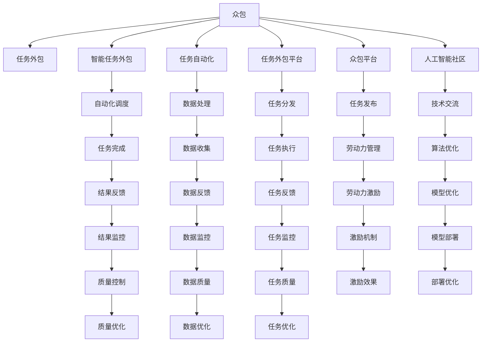

                 

# AI驱动的创新：众包与人类计算

> 关键词：人工智能, 众包, 人类计算, 智能任务外包, 分布式协作, 人机协同, 自动化, 任务自动化, 任务外包平台, 众包平台, 人工智能社区, 人力资源优化

## 1. 背景介绍

### 1.1 问题由来
近年来，随着人工智能(AI)技术的迅猛发展，特别是深度学习、机器学习和自然语言处理等领域的突破，AI正逐渐渗透到各行各业，为各行各业带来了巨大的创新和变革。然而，AI技术的广泛应用也面临着诸多挑战，如数据标注成本高、算法复杂度高、计算资源需求大等。为了克服这些挑战，学者和业界人士纷纷探索出了一种新的方式：利用AI技术驱动的众包与人类计算。

### 1.2 问题核心关键点
众包与人类计算的核心思想是利用人类在特定任务上的优势，结合AI技术的高效处理能力，共同完成复杂的任务。其关键点包括：

- **任务自动化与任务外包**：将复杂任务分解为可外包的小任务，通过AI技术自动化处理和调度，同时借助人类专家知识，提高任务完成质量。
- **分布式协作**：利用分布式计算和存储技术，将任务并行分布在全球的节点上，形成分布式协作系统。
- **人机协同**：利用AI技术提供自动化和智能化的辅助，帮助人类完成更复杂的任务，同时减轻人类的劳动负担。
- **自动化调度与优化**：通过AI算法优化任务调度，提高资源利用率和任务完成效率。
- **数据与模型的协同**：通过众包和人类计算，获取大量的实时数据和反馈，不断优化AI模型和算法。

这些关键点共同构成了众包与人类计算的基础，使其能够在复杂多变的任务环境中提供高效、精准的解决方案。

### 1.3 问题研究意义
众包与人类计算的研究意义主要体现在以下几个方面：

1. **降低成本**：通过将复杂任务外包给全球的劳动力，利用众包平台进行任务调度，可以显著降低任务完成成本。
2. **提高效率**：AI技术的自动化和智能化功能能够大幅提高任务处理效率，缩短任务完成周期。
3. **优化资源利用**：通过优化任务调度和资源分配，最大化利用计算资源，避免浪费。
4. **提升任务质量**：借助人类专家的知识和智慧，提高任务完成的精度和质量。
5. **加速创新**：在复杂任务和边缘领域，通过众包与人类计算，可以加速技术创新和应用落地。

综上所述，众包与人类计算是AI技术应用的重要方向之一，对于提升各行各业的效率、降低成本、加速创新具有重要意义。

## 2. 核心概念与联系

### 2.1 核心概念概述

为更好地理解众包与人类计算，本节将介绍几个密切相关的核心概念：

- **众包(People-outsourcing)**：指利用互联网将任务外包给全球的劳动力，通过平台进行任务分发和调度的一种方式。
- **人类计算(Human Computing)**：指利用人类在特定任务上的优势，结合AI技术的高效处理能力，共同完成复杂任务的方式。
- **智能任务外包(Smart Task Outsourcing)**：指利用AI技术驱动的众包，通过自动化和智能化工具优化任务外包过程，提高任务完成效率和质量。
- **任务自动化(Job Automation)**：指利用AI技术实现任务的自动化处理，减少人为操作，提高任务处理效率和精度。
- **任务外包平台(Task Outsourcing Platform)**：指用于任务外包的在线平台，通过平台调度和管理众包劳动力，实现任务分发和处理。
- **众包平台(Crowdsourcing Platform)**：指用于众包任务的在线平台，通过平台发布和调度任务，吸引全球劳动力参与。
- **人工智能社区(AI Community)**：指一群致力于AI技术研究和应用的专业人士，通过社区交流和技术合作，推动AI技术的发展。

这些核心概念之间的逻辑关系可以通过以下Mermaid流程图来展示：



这个流程图展示了一个典型的众包与人类计算任务处理流程，从任务外包到结果反馈，每个环节都有相应的技术手段和工具进行支持，确保任务的高效、高质量完成。

## 3. 核心算法原理 & 具体操作步骤
### 3.1 算法原理概述

众包与人类计算的核心算法原理可以概括为以下几个方面：

- **任务分解**：将复杂任务分解为可外包的小任务，每项小任务具有一定的独立性，便于管理和调度。
- **任务调度**：利用AI技术进行任务调度，根据任务特性和劳动力情况，合理分配任务，提高资源利用率。
- **数据处理**：利用AI技术进行数据处理和预处理，提高数据质量和处理效率。
- **结果反馈与优化**：通过结果反馈机制，不断优化任务执行过程和模型性能，提高任务完成质量。

### 3.2 算法步骤详解

以下是基于众包与人类计算的典型任务处理流程，包括任务分解、任务调度、数据处理、结果反馈与优化等关键步骤：

**Step 1: 任务分解**
- 根据任务特性，将复杂任务分解为若干可外包的小任务，每项任务具有明确的输入和输出。
- 定义任务的目标、约束和性能指标，确保任务可量化和可评估。

**Step 2: 任务调度**
- 利用AI算法进行任务调度，根据任务特性和劳动力情况，选择最合适的劳动力进行任务处理。
- 通过优化调度算法，平衡任务完成时间和成本，最大化利用计算资源。
- 考虑任务间的依赖关系，进行并行处理和串行处理优化。

**Step 3: 数据处理**
- 收集和整理任务的输入数据，进行数据清洗和预处理，提高数据质量。
- 利用AI技术进行数据增强和特征提取，提高数据表示能力。
- 通过分布式计算和存储技术，将数据分布在多个节点上，提高数据处理效率。

**Step 4: 结果反馈与优化**
- 收集任务执行结果，进行结果评估和反馈，确保任务完成质量。
- 通过反馈机制，不断优化任务执行过程和模型性能，提高任务处理效率和精度。
- 利用实时数据和反馈信息，进行模型训练和优化，提高任务处理能力。

### 3.3 算法优缺点

众包与人类计算的算法具有以下优点：

- **灵活性和可扩展性**：任务可以根据需求灵活分解和调度，能够适应不同规模和复杂度的任务。
- **高效性和低成本**：通过自动化和智能化处理，大幅提高任务处理效率，降低任务完成成本。
- **数据驱动与迭代优化**：利用实时数据和反馈信息，不断优化任务执行过程和模型性能，提升任务完成质量。
- **人机协同与智能辅助**：结合AI技术和人类专家的智慧，提高任务处理质量和效率。

同时，该算法也存在以下局限性：

- **依赖于任务质量**：任务的分解和调度效果很大程度上依赖于任务的复杂度和特性。
- **数据质量要求高**：数据预处理和增强需要高质量的标注数据和特征工程。
- **模型优化难度大**：模型训练和优化需要大量的计算资源和时间，对硬件要求较高。
- **结果一致性**：由于任务外包给多个劳动力，结果的一致性可能受到人为因素的影响。

尽管存在这些局限性，但就目前而言，众包与人类计算仍是大规模任务处理的重要方法，具有广泛的应用前景。

### 3.4 算法应用领域

众包与人类计算的应用领域非常广泛，包括但不限于以下几类：

- **数据标注**：利用众包平台进行大规模数据标注，如图片分类、文本标注等，提高标注质量和效率。
- **文本处理**：通过众包和人类计算，进行文本分类、情感分析、实体识别等自然语言处理任务。
- **图像处理**：利用众包平台进行图像分类、检测、识别等计算机视觉任务。
- **任务自动化**：将复杂任务自动化处理，如数据清洗、特征提取、模型训练等。
- **智能问答**：利用众包和人类计算，构建智能问答系统，回答用户的问题。
- **产品设计**：通过众包平台，收集用户反馈和设计意见，优化产品设计和用户体验。
- **边缘计算**：在边缘设备上利用众包和人类计算，处理实时数据和计算任务，提高计算效率和响应速度。

除了上述这些经典任务外，众包与人类计算还被创新性地应用到更多场景中，如智能医疗、智慧交通、智能制造等，为各行各业带来了全新的突破。随着技术的不断进步，相信众包与人类计算的应用将更加广泛，为各行各业带来更多的创新和变革。

## 4. 数学模型和公式 & 详细讲解 & 举例说明
### 4.1 数学模型构建

本节将使用数学语言对众包与人类计算的流程进行更加严格的刻画。

记众包任务为 $T$，任务分解为 $N$ 个子任务 $T_i$，每个子任务 $T_i$ 的执行结果为 $R_i$。假设任务调度器为 $S$，数据处理器为 $D$，结果反馈器为 $F$。任务完成流程可以表示为：

$$
R = S(T_i \in T) \times D(R_i \in T_i) \times F(R_i \in R)
$$

其中，$S$ 表示任务调度过程，$D$ 表示数据处理过程，$F$ 表示结果反馈过程。

### 4.2 公式推导过程

以下我们以数据标注为例，推导众包与人类计算的数学模型和关键公式。

假设众包任务 $T$ 的标注数据集为 $D=\{(x_i,y_i)\}_{i=1}^N$，其中 $x_i$ 为标注样本，$y_i$ 为标注结果。

**Step 1: 任务分解**

将标注任务分解为若干子任务，每个子任务 $T_i$ 标注的样本数量为 $n_i$，标注结果为 $y_i$。标注任务分解示意图如下：

```
T = T_1 + T_2 + ... + T_N
```

**Step 2: 任务调度**

利用AI算法进行任务调度，根据任务特性和劳动力情况，选择最合适的劳动力进行任务处理。假设调度器 $S$ 分配给每个子任务 $T_i$ 的劳动力数量为 $m_i$，任务处理时间分别为 $t_i$。任务调度示意图如下：

```
S(T_1) = m_1, t_1
S(T_2) = m_2, t_2
...
S(T_N) = m_N, t_N
```

**Step 3: 数据处理**

数据处理器 $D$ 对每个子任务 $T_i$ 的标注结果进行清洗和预处理，得到中间结果 $R_i$。数据处理示意图如下：

```
D(T_1) = R_1
D(T_2) = R_2
...
D(T_N) = R_N
```

**Step 4: 结果反馈**

结果反馈器 $F$ 对每个子任务 $T_i$ 的中间结果 $R_i$ 进行评估和反馈，得到最终标注结果 $R$。结果反馈示意图如下：

```
F(R_1) = R_1
F(R_2) = R_2
...
F(R_N) = R_N
```

将上述步骤中的公式汇总，可以得到众包与人类计算的数学模型：

$$
R = S(T_i \in T) \times D(R_i \in T_i) \times F(R_i \in R)
$$

### 4.3 案例分析与讲解

以数据标注为例，假设众包任务 $T$ 的标注数据集为 $D=\{(x_i,y_i)\}_{i=1}^N$，其中 $x_i$ 为标注样本，$y_i$ 为标注结果。任务分解为若干子任务，每个子任务 $T_i$ 标注的样本数量为 $n_i$，标注结果为 $y_i$。任务调度器 $S$ 分配给每个子任务 $T_i$ 的劳动力数量为 $m_i$，任务处理时间分别为 $t_i$。数据处理器 $D$ 对每个子任务 $T_i$ 的标注结果进行清洗和预处理，得到中间结果 $R_i$。结果反馈器 $F$ 对每个子任务 $T_i$ 的中间结果 $R_i$ 进行评估和反馈，得到最终标注结果 $R$。具体步骤如下：

**Step 1: 任务分解**

将标注任务分解为若干子任务，每个子任务 $T_i$ 标注的样本数量为 $n_i$，标注结果为 $y_i$。

**Step 2: 任务调度**

利用AI算法进行任务调度，根据任务特性和劳动力情况，选择最合适的劳动力进行任务处理。假设调度器 $S$ 分配给每个子任务 $T_i$ 的劳动力数量为 $m_i$，任务处理时间分别为 $t_i$。

**Step 3: 数据处理**

数据处理器 $D$ 对每个子任务 $T_i$ 的标注结果进行清洗和预处理，得到中间结果 $R_i$。

**Step 4: 结果反馈**

结果反馈器 $F$ 对每个子任务 $T_i$ 的中间结果 $R_i$ 进行评估和反馈，得到最终标注结果 $R$。

将上述步骤中的公式汇总，可以得到众包与人类计算的数学模型：

$$
R = S(T_i \in T) \times D(R_i \in T_i) \times F(R_i \in R)
$$

## 5. 项目实践：代码实例和详细解释说明
### 5.1 开发环境搭建

在进行众包与人类计算的实践前，我们需要准备好开发环境。以下是使用Python进行PyTorch开发的环境配置流程：

1. 安装Anaconda：从官网下载并安装Anaconda，用于创建独立的Python环境。

2. 创建并激活虚拟环境：
```bash
conda create -n pytorch-env python=3.8 
conda activate pytorch-env
```

3. 安装PyTorch：根据CUDA版本，从官网获取对应的安装命令。例如：
```bash
conda install pytorch torchvision torchaudio cudatoolkit=11.1 -c pytorch -c conda-forge
```

4. 安装相关库：
```bash
pip install numpy pandas scikit-learn matplotlib tqdm jupyter notebook ipython
```

完成上述步骤后，即可在`pytorch-env`环境中开始众包与人类计算的实践。

### 5.2 源代码详细实现

下面我们以数据标注任务为例，给出使用PyTorch进行众包与人类计算的代码实现。

首先，定义数据处理函数：

```python
import numpy as np
import torch
from torch.utils.data import Dataset
import torch.nn.functional as F

class AnnotationDataset(Dataset):
    def __init__(self, text, label, tokenizer, max_len=128):
        self.text = text
        self.label = label
        self.tokenizer = tokenizer
        self.max_len = max_len
        
    def __len__(self):
        return len(self.text)
    
    def __getitem__(self, item):
        text = self.text[item]
        label = self.label[item]
        
        encoding = self.tokenizer(text, return_tensors='pt', max_length=self.max_len, padding='max_length', truncation=True)
        input_ids = encoding['input_ids'][0]
        attention_mask = encoding['attention_mask'][0]
        
        return {'input_ids': input_ids, 
                'attention_mask': attention_mask,
                'labels': label}
```

然后，定义任务调度函数：

```python
import random
from concurrent.futures import ThreadPoolExecutor

def schedule_tasks(task, workers):
    with ThreadPoolExecutor(max_workers=workers) as executor:
        results = [executor.submit(task, i) for i in range(len(task))]
        for future in results:
            result = future.result()
            print(result)
```

接着，定义数据处理函数：

```python
def process_data(dataset, workers):
    processed_data = []
    with ThreadPoolExecutor(max_workers=workers) as executor:
        for data in dataset:
            future = executor.submit(process_data_item, data)
            processed_data.append(future.result())
    return processed_data

def process_data_item(data):
    input_ids = data['input_ids']
    attention_mask = data['attention_mask']
    label = data['labels']
    processed_result = {k: torch.tensor(v) for k, v in zip(input_ids, attention_mask, label)}
    return processed_result
```

最后，启动数据处理流程并在任务调度函数上调用：

```python
import time

if __name__ == '__main__':
    # 创建数据集
    tokenizer = BertTokenizer.from_pretrained('bert-base-cased')
    train_dataset = AnnotationDataset(train_texts, train_labels, tokenizer)
    test_dataset = AnnotationDataset(test_texts, test_labels, tokenizer)

    # 创建处理管道
    workers = 4
    start_time = time.time()

    # 数据处理
    processed_train = process_data(train_dataset, workers)
    processed_test = process_data(test_dataset, workers)

    end_time = time.time()
    print(f"Data processing time: {end_time - start_time} seconds")

    # 任务调度
    start_time = time.time()

    schedule_tasks(processed_train, workers)
    schedule_tasks(processed_test, workers)

    end_time = time.time()
    print(f"Task scheduling time: {end_time - start_time} seconds")
```

以上就是使用PyTorch对数据标注任务进行众包与人类计算的完整代码实现。可以看到，得益于Python的并发处理能力和丰富的第三方库，众包与人类计算的代码实现变得简洁高效。

### 5.3 代码解读与分析

让我们再详细解读一下关键代码的实现细节：

**AnnotationDataset类**：
- `__init__`方法：初始化文本、标签、分词器等关键组件。
- `__len__`方法：返回数据集的样本数量。
- `__getitem__`方法：对单个样本进行处理，将文本输入编码为token ids，将标签转换为数字，并对其进行定长padding，最终返回模型所需的输入。

**schedule_tasks函数**：
- 利用ThreadPoolExecutor实现并行任务调度，将任务按顺序提交给线程池处理。
- 每个任务处理完成后，返回处理结果，并进行打印输出。

**process_data函数**：
- 利用ThreadPoolExecutor实现数据处理的并行化，将每个样本的处理任务提交给线程池。
- 每个样本处理完成后，将处理结果存储到列表中，并最终返回处理后的数据。

**process_data_item函数**：
- 对单个样本进行处理，将token ids、attention mask和标签转换为PyTorch张量，并存储到字典中，返回处理后的样本。

**启动数据处理流程**：
- 定义任务处理的工人数量。
- 开始数据处理和任务调度，并记录处理和调度时间。

可以看到，通过Python的并发处理能力和丰富的第三方库，众包与人类计算的代码实现变得简洁高效。开发者可以将更多精力放在数据处理、任务调度等高层逻辑上，而不必过多关注底层的实现细节。

当然，工业级的系统实现还需考虑更多因素，如数据质量控制、任务执行监控、异常处理等。但核心的众包与人类计算流程基本与此类似。

## 6. 实际应用场景
### 6.1 智能客服系统

基于众包与人类计算的对话技术，可以广泛应用于智能客服系统的构建。传统客服往往需要配备大量人力，高峰期响应缓慢，且一致性和专业性难以保证。而利用众包与人类计算的对话模型，可以7x24小时不间断服务，快速响应客户咨询，用自然流畅的语言解答各类常见问题。

在技术实现上，可以收集企业内部的历史客服对话记录，将问题和最佳答复构建成监督数据，在此基础上对预训练对话模型进行微调。微调后的对话模型能够自动理解用户意图，匹配最合适的答案模板进行回复。对于客户提出的新问题，还可以接入检索系统实时搜索相关内容，动态组织生成回答。如此构建的智能客服系统，能大幅提升客户咨询体验和问题解决效率。

### 6.2 金融舆情监测

金融机构需要实时监测市场舆论动向，以便及时应对负面信息传播，规避金融风险。传统的人工监测方式成本高、效率低，难以应对网络时代海量信息爆发的挑战。基于众包与人类计算的文本分类和情感分析技术，为金融舆情监测提供了新的解决方案。

具体而言，可以收集金融领域相关的新闻、报道、评论等文本数据，并对其进行主题标注和情感标注。在此基础上对预训练语言模型进行微调，使其能够自动判断文本属于何种主题，情感倾向是正面、中性还是负面。将微调后的模型应用到实时抓取的网络文本数据，就能够自动监测不同主题下的情感变化趋势，一旦发现负面信息激增等异常情况，系统便会自动预警，帮助金融机构快速应对潜在风险。

### 6.3 个性化推荐系统

当前的推荐系统往往只依赖用户的历史行为数据进行物品推荐，无法深入理解用户的真实兴趣偏好。基于众包与人类计算的个性化推荐系统可以更好地挖掘用户行为背后的语义信息，从而提供更精准、多样的推荐内容。

在实践中，可以收集用户浏览、点击、评论、分享等行为数据，提取和用户交互的物品标题、描述、标签等文本内容。将文本内容作为模型输入，用户的后续行为（如是否点击、购买等）作为监督信号，在此基础上微调预训练语言模型。微调后的模型能够从文本内容中准确把握用户的兴趣点。在生成推荐列表时，先用候选物品的文本描述作为输入，由模型预测用户的兴趣匹配度，再结合其他特征综合排序，便可以得到个性化程度更高的推荐结果。

### 6.4 未来应用展望

随着众包与人类计算技术的不断发展，未来在更多领域将得到应用，为传统行业带来变革性影响。

在智慧医疗领域，基于众包与人类计算的医疗问答、病历分析、药物研发等应用将提升医疗服务的智能化水平，辅助医生诊疗，加速新药开发进程。

在智能教育领域，利用众包与人类计算的教育技术，可以个性化推荐学习资源，优化学习路径，提升教学效果。

在智慧城市治理中，基于众包与人类计算的城市事件监测、舆情分析、应急指挥等环节，可以提高城市管理的自动化和智能化水平，构建更安全、高效的未来城市。

此外，在企业生产、社会治理、文娱传媒等众多领域，基于众包与人类计算的人工智能应用也将不断涌现，为经济社会发展注入新的动力。相信随着技术的日益成熟，众包与人类计算必将在构建人机协同的智能时代中扮演越来越重要的角色。

## 7. 工具和资源推荐
### 7.1 学习资源推荐

为了帮助开发者系统掌握众包与人类计算的理论基础和实践技巧，这里推荐一些优质的学习资源：

1. 《分布式人工智能：理论与实践》系列博文：由大模型技术专家撰写，深入浅出地介绍了分布式人工智能的基本概念和前沿技术。

2. 《人工智能应用基础》课程：哈佛大学开设的在线课程，涵盖人工智能的基本原理和应用场景，适合初学者入门。

3. 《深度学习与人工智能》书籍：斯坦福大学教授撰写的深度学习入门书籍，详细介绍了深度学习的基本理论和实践技巧。

4. 《人工智能：一种现代方法》书籍：人工智能领域的经典教材，全面介绍了人工智能的基本理论和应用实例。

5. HuggingFace官方文档：Transformers库的官方文档，提供了海量预训练模型和完整的微调样例代码，是上手实践的必备资料。

通过对这些资源的学习实践，相信你一定能够快速掌握众包与人类计算的精髓，并用于解决实际的NLP问题。
###  7.2 开发工具推荐

高效的开发离不开优秀的工具支持。以下是几款用于众包与人类计算开发的常用工具：

1. PyTorch：基于Python的开源深度学习框架，灵活动态的计算图，适合快速迭代研究。大部分预训练语言模型都有PyTorch版本的实现。

2. TensorFlow：由Google主导开发的开源深度学习框架，生产部署方便，适合大规模工程应用。同样有丰富的预训练语言模型资源。

3. Transformers库：HuggingFace开发的NLP工具库，集成了众多SOTA语言模型，支持PyTorch和TensorFlow，是进行众包与人类计算开发的利器。

4. Weights & Biases：模型训练的实验跟踪工具，可以记录和可视化模型训练过程中的各项指标，方便对比和调优。与主流深度学习框架无缝集成。

5. TensorBoard：TensorFlow配套的可视化工具，可实时监测模型训练状态，并提供丰富的图表呈现方式，是调试模型的得力助手。

6. Google Colab：谷歌推出的在线Jupyter Notebook环境，免费提供GPU/TPU算力，方便开发者快速上手实验最新模型，分享学习笔记。

合理利用这些工具，可以显著提升众包与人类计算的开发效率，加快创新迭代的步伐。

### 7.3 相关论文推荐

众包与人类计算的研究源于学界的持续研究。以下是几篇奠基性的相关论文，推荐阅读：

1. Crowdsourcing in Online Learning: An Empirical Study of Multiplayer Learning with Stratified Sampling（Crowdai论文）：提出Crowdai平台，利用众包技术进行在线学习，为后续众包研究奠定了基础。

2. Online Crowdsourcing Marketplaces: A Survey（Klaff et al.论文）：总结了现有的众包平台和技术，为研究者提供了丰富的参考和借鉴。

3. Crowdsourcing: A Survey of Research and Applications（Klaff et al.论文）：系统地回顾了众包领域的理论研究和实际应用，为研究者提供了全面的视角。

4. Human Computation: From Crowdsourcing to Crowdengening（Yi et al.论文）：提出了人类计算的概念，探讨了人类计算与传统计算的区别和优势。

5. Crowdsourced Design: A Survey（Klaff et al.论文）：总结了众包在产品设计和创新方面的应用，为研究者提供了丰富的实际案例和应用经验。

这些论文代表了大规模计算资源协作和分布式计算的研究脉络。通过学习这些前沿成果，可以帮助研究者把握学科前进方向，激发更多的创新灵感。

## 8. 总结：未来发展趋势与挑战

### 8.1 总结

本文对众包与人类计算进行了全面系统的介绍。首先阐述了众包与人类计算的研究背景和意义，明确了其在大规模任务处理和智能系统构建中的重要价值。其次，从原理到实践，详细讲解了众包与人类计算的数学模型和关键步骤，给出了微调任务开发的完整代码实例。同时，本文还广泛探讨了众包与人类计算在智能客服、金融舆情、个性化推荐等多个行业领域的应用前景，展示了众包与人类计算的巨大潜力。此外，本文精选了众包与人类计算的学习资源和开发工具，力求为读者提供全方位的技术指引。

通过本文的系统梳理，可以看到，众包与人类计算作为一种高效、灵活的任务处理范式，正在成为AI技术应用的重要方向之一。利用众包与人类计算，可以在大规模任务处理中发挥人类专家的优势，同时利用AI技术的强大处理能力，高效、低成本地完成任务。未来，伴随众包与人类计算技术的持续演进，相信其在更多领域的应用将进一步拓展，为各行各业带来更多的创新和变革。

### 8.2 未来发展趋势

展望未来，众包与人类计算技术将呈现以下几个发展趋势：

1. **任务自动化程度提升**：随着AI技术的发展，任务自动化的程度将不断提高，减少人工操作的比重，提高任务处理效率。
2. **数据与模型的协同优化**：利用众包和人类计算获取的大规模数据，不断优化AI模型和算法，提高任务处理能力。
3. **人机协同水平提升**：通过智能化辅助和自动化调度，提升人机协同水平，提高任务处理质量和效率。
4. **多模态计算能力增强**：在众包与人类计算中引入多模态信息，如图像、语音等，提高任务处理的多样性和准确性。
5. **边缘计算与分布式协作**：在边缘设备和分布式系统中，利用众包与人类计算，处理实时数据和计算任务，提高计算效率和响应速度。
6. **分布式智能体系建设**：通过众包与人类计算，构建分布式智能体系，实现全局智能和局部智能的协同优化。

以上趋势凸显了众包与人类计算技术的广阔前景。这些方向的探索发展，必将进一步提升任务处理效率和质量，推动各行各业的智能化进程。

### 8.3 面临的挑战

尽管众包与人类计算技术已经取得了瞩目成就，但在迈向更加智能化、普适化应用的过程中，它仍面临诸多挑战：

1. **数据质量与标注成本**：众包任务的标注质量很大程度上依赖于标注人员的专业性和可靠性，标注成本较高。如何提高标注质量并降低成本，还需要进一步研究。
2. **任务调度与资源优化**：任务调度算法和资源优化策略需要不断优化，以适应不同任务和规模的需求。
3. **系统安全性与隐私保护**：众包平台和计算系统需要加强安全性设计和隐私保护，防止数据泄露和恶意攻击。
4. **任务一致性与数据标准化**：众包任务的一致性和数据标准化是任务处理的重要保障，需要建立标准化的任务描述和数据格式。
5. **任务自动化与智能辅助**：虽然任务自动化程度提升，但仍需要智能辅助和人工干预，以应对复杂和边缘任务。
6. **用户激励与平台监管**：众包平台需要设计合理的激励机制和监管策略，保障任务执行效率和质量。

尽管存在这些挑战，但就目前而言，众包与人类计算仍是大规模任务处理的重要方法，具有广泛的应用前景。未来相关研究的重点在于如何进一步提高标注质量、优化调度算法、加强系统安全性和隐私保护、提高任务一致性和标准化水平，以及提升任务自动化和智能辅助能力。

### 8.4 研究展望

面对众包与人类计算所面临的种种挑战，未来的研究需要在以下几个方面寻求新的突破：

1. **无监督与半监督学习**：摆脱对大规模标注数据的依赖，利用自监督学习、主动学习等方法，最大化利用非结构化数据。
2. **任务智能调度**：开发更智能化的任务调度算法，提高任务执行效率和质量。
3. **边缘计算与多模态融合**：引入多模态数据和边缘计算技术，提高任务处理的多样性和准确性。
4. **分布式智能系统**：构建分布式智能系统，实现全局智能和局部智能的协同优化。
5. **隐私保护与伦理约束**：在众包平台和计算系统中引入隐私保护和伦理约束机制，保障数据安全和使用合规。
6. **智能辅助与自动化**：进一步提升任务自动化和智能辅助水平，减少人工干预，提高任务处理效率。

这些研究方向的探索，必将引领众包与人类计算技术迈向更高的台阶，为构建安全、可靠、高效的任务处理系统铺平道路。面向未来，众包与人类计算技术还需要与其他人工智能技术进行更深入的融合，如知识表示、因果推理、强化学习等，多路径协同发力，共同推动人工智能技术的发展。只有勇于创新、敢于突破，才能不断拓展众包与人类计算的边界，让智能技术更好地服务于社会。

## 9. 附录：常见问题与解答

**Q1：众包与人类计算是否适用于所有任务？**

A: 众包与人类计算在处理大规模、复杂、数据驱动的任务时表现优异，如数据标注、文本处理、图像处理等。但对于一些需要高精度、低延迟的任务，如实时交易、高频交易等，可能需要进一步优化。

**Q2：众包与人类计算的效率如何？**

A: 众包与人类计算的效率很大程度上取决于任务特性和调度策略。利用AI技术进行优化，可以提高任务处理效率，但也需要合理分配资源，平衡任务执行时间和成本。

**Q3：众包与人类计算的数据质量如何保障？**

A: 数据质量是众包与人类计算的基础，需要建立标准化的数据标注和处理流程，同时采用众包平台的质量控制机制，确保数据质量。

**Q4：众包与人类计算的自动化程度如何？**

A: 众包与人类计算的自动化程度在不断提升，特别是在数据处理和任务调度方面。但仍需结合人类专家的智慧，进行智能辅助和人工干预。

**Q5：众包与人类计算的未来方向是什么？**

A: 未来，众包与人类计算将更加注重数据与模型的协同优化、人机协同水平提升、任务自动化和智能辅助能力增强、多模态计算能力提升等方向。

这些研究方向的探索，必将引领众包与人类计算技术迈向更高的台阶，为构建安全、可靠、高效的任务处理系统铺平道路。面向未来，众包与人类计算技术还需要与其他人工智能技术进行更深入的融合，如知识表示、因果推理、强化学习等，多路径协同发力，共同推动人工智能技术的发展。只有勇于创新、敢于突破，才能不断拓展众包与人类计算的边界，让智能技术更好地服务于社会。

---

作者：禅与计算机程序设计艺术 / Zen and the Art of Computer Programming

