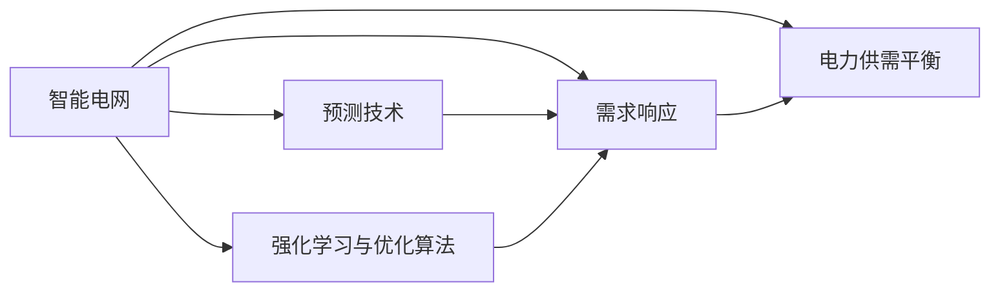

                 

# AI驱动的智能电网:平衡供需提高效率

## 1. 背景介绍

智能电网（Smart Grid）作为电力系统的未来方向，正面临从传统电网向分布式、互联化、数字化的深刻变革。在新的能源环境下，电力系统不仅要优化发电与消费的平衡，还需要提高供电可靠性，保障能源安全。利用人工智能技术，智能电网能够实现对海量数据的高效处理与分析，提升电力系统决策的科学性和智能性，从而实现更高效率的电力管理与运营。

本文将深入探讨AI技术在智能电网中的应用，特别是智能电网的电力供需平衡与系统优化，重点介绍基于强化学习（Reinforcement Learning, RL）的电力系统调度与优化，以及基于机器学习（Machine Learning, ML）的需求响应与预测技术。通过这些前沿技术的综合应用，智能电网将更好地平衡供需，提高效率，服务于社会经济发展和环境保护。

## 2. 核心概念与联系

### 2.1 核心概念概述

在智能电网中，核心概念主要包括以下几点：

- **智能电网**：通过信息技术与自动化技术将电力系统与用户终端紧密连接，实现电力供需实时监控、优化调度与高效管理的目标。
- **电力供需平衡**：智能电网的核心任务之一，通过协调发电、输电、配电、用电各环节，保障电网的稳定运行。
- **需求响应**：通过经济激励或智能技术手段，鼓励用户在用电高峰时段减少或调整用电需求，以平衡电网负荷。
- **预测技术**：包括负荷预测、天气预测等，为电网调度与需求响应提供数据支持，提升决策的精准性。
- **强化学习与优化算法**：基于智能电网的动态特性，通过RL等方法优化电力系统调度，提升电网效率与稳定性。

这些核心概念相互关联，共同构成了智能电网的技术体系。

### 2.2 核心概念原理和架构的 Mermaid 流程图



这个流程图展示了智能电网中各核心概念之间的联系与互动：

1. 智能电网总体框架：包含电力供需平衡、需求响应、预测技术、强化学习与优化算法。
2. 电力供需平衡：通过协调电力发输配用电各环节，实现电网稳定运行。
3. 需求响应：通过经济或技术手段调整用户需求，平衡电网负荷。
4. 预测技术：提供准确的数据预测，支持电网调度与需求响应。
5. 强化学习与优化算法：优化电力系统调度，提升电网效率与稳定性。

## 3. 核心算法原理 & 具体操作步骤

### 3.1 算法原理概述

基于AI技术的智能电网，主要涉及以下两个方向的算法：

- **预测技术**：利用机器学习与深度学习技术，对电力负荷、天气等进行预测。
- **强化学习与优化算法**：通过动态调整电力系统各环节的运行参数，优化电力供需平衡。

预测技术主要用于提升电网调度与需求响应的精准性，而强化学习与优化算法则用于直接优化电力系统的运行效率与稳定性。

### 3.2 算法步骤详解

#### 3.2.1 电力负荷预测

电力负荷预测是智能电网调度的重要基础。其主要步骤包括：

1. **数据收集**：从电网监测系统、气象站、交通系统等收集数据。
2. **特征工程**：对原始数据进行预处理与特征提取。
3. **模型训练**：利用历史数据训练预测模型，如时间序列模型、深度学习模型等。
4. **模型验证与优化**：在验证集上进行模型评估，使用交叉验证等技术优化模型。
5. **在线预测**：将模型应用于实时数据，提供电力负荷预测。

#### 3.2.2 电力系统优化

电力系统优化主要涉及以下几个步骤：

1. **模型构建**：构建优化问题模型，如线性规划、非线性规划、整数规划等。
2. **参数设置**：设定模型参数，如目标函数、约束条件等。
3. **求解器选择**：选择优化求解器，如CP-SAT、GLPK、Gurobi等。
4. **模型优化**：通过迭代求解器求解模型，优化电力系统运行参数。
5. **评估与调整**：评估优化结果，根据电网运行情况调整模型参数。

### 3.3 算法优缺点

#### 3.3.1 预测技术的优缺点

**优点**：
- 提供精准的负荷预测，支持智能电网调度。
- 适用于多种数据类型，可以集成不同来源的数据。

**缺点**：
- 预测模型依赖于历史数据，对新数据适应性较差。
- 复杂模型的训练与计算成本较高。

#### 3.3.2 强化学习的优缺点

**优点**：
- 能够处理动态的、不确定的环境，适应性强。
- 模型直接优化目标，不需要复杂的预测模型。

**缺点**：
- 训练过程需要大量的环境数据，对于复杂的电力系统可能面临高昂的代价。
- 需要手动设计奖励函数，设计不当可能导致策略不稳定。

#### 3.3.3 优化算法的优缺点

**优点**：
- 算法可以处理复杂的非线性问题，优化目标明确。
- 结果可解释性高，容易调试与验证。

**缺点**：
- 对于大规模、动态系统的求解复杂度高，计算时间较长。
- 模型的求解结果依赖于初始参数与约束条件。

### 3.4 算法应用领域

智能电网的各个环节，如发电、输电、配电、用电等，均可应用AI技术进行优化与管理。具体应用领域包括：

- **电力负荷预测**：应用于电网调度与需求响应，提升供电可靠性。
- **电力系统优化**：优化电力系统运行参数，提高效率与稳定性。
- **需求响应**：调整用户用电行为，平衡电网负荷，降低电网峰值负荷。
- **智能计量**：通过智能电表，实时监测用户用电情况，提供个性化服务。

## 4. 数学模型和公式 & 详细讲解 & 举例说明

### 4.1 数学模型构建

智能电网中的数学模型主要包括以下几个部分：

1. **电力负荷预测模型**：
   - 时间序列模型：$y_t = \alpha_0 + \sum_{i=1}^k \alpha_i x_{ti} + \epsilon_t$
   - 深度学习模型：$y_t = \mathcal{D}(x_{ti}, x_{t+1}, ..., x_{t+k})$

2. **电力系统优化模型**：
   - 线性规划模型：$Minimize: \sum_{i=1}^n c_i x_i$
   - 非线性规划模型：$Minimize: f(x)$
   - 整数规划模型：$Minimize: c^T x$
   - 动态规划模型：$V_i = \max_{j \in S} [r_{ij} + V_j]$

### 4.2 公式推导过程

#### 4.2.1 时间序列模型

时间序列模型通过历史数据对未来负荷进行预测，公式如下：

$$
y_t = \alpha_0 + \sum_{i=1}^k \alpha_i x_{ti} + \epsilon_t
$$

其中，$y_t$ 表示第 $t$ 时刻的预测负荷；$\alpha_0$ 和 $\alpha_i$ 为模型的系数；$x_{ti}$ 表示第 $i$ 个特征变量；$\epsilon_t$ 为随机误差项。

#### 4.2.2 深度学习模型

深度学习模型通过神经网络对历史数据进行拟合，实现负荷预测。公式如下：

$$
y_t = \mathcal{D}(x_{ti}, x_{t+1}, ..., x_{t+k})
$$

其中，$\mathcal{D}$ 表示深度学习模型，$x_{ti}, x_{t+1}, ..., x_{t+k}$ 为模型的输入特征。

#### 4.2.3 线性规划模型

线性规划模型通过线性方程组求解最优解，公式如下：

$$
Minimize: \sum_{i=1}^n c_i x_i
$$
$$
s.t. \begin{cases} a_1^T x \leq b_1 \\ a_2^T x = b_2 \\ x \geq 0 \end{cases}
$$

其中，$c_i$ 为决策变量的系数；$a_1, a_2$ 为线性约束的系数；$b_1, b_2$ 为线性约束的常数。

#### 4.2.4 动态规划模型

动态规划模型通过递推关系求解最优解，公式如下：

$$
V_i = \max_{j \in S} [r_{ij} + V_j]
$$

其中，$V_i$ 表示第 $i$ 个状态的最优值；$r_{ij}$ 表示状态 $i$ 转移到状态 $j$ 的收益；$S$ 表示状态集合。

### 4.3 案例分析与讲解

#### 4.3.1 电力负荷预测案例

某电网公司使用历史天气数据与负荷数据，构建时间序列模型进行电力负荷预测。具体步骤如下：

1. **数据收集**：收集过去一年内每天的天气数据（如温度、湿度、风速等）与负荷数据。
2. **特征工程**：对原始数据进行归一化、特征提取等预处理。
3. **模型训练**：使用历史数据训练时间序列模型，得到负荷预测公式。
4. **模型验证**：在验证集上进行模型评估，调整模型参数。
5. **在线预测**：将模型应用于实时天气数据，预测未来负荷。

通过模型训练与优化，该公司能够准确预测每天的电力负荷，提升了电网调度的精准性。

#### 4.3.2 电力系统优化案例

某电网公司使用线性规划模型优化电力系统运行参数，具体步骤如下：

1. **模型构建**：构建电力系统优化模型，设定目标函数为最小化运行成本，约束条件为电压、电流等电力设备的安全限制。
2. **参数设置**：设定各决策变量的取值范围。
3. **求解器选择**：选择求解器进行模型求解。
4. **模型优化**：通过迭代求解器求解模型，得到最优解。
5. **评估与调整**：评估优化结果，根据电网运行情况调整模型参数。

通过优化模型的求解，该公司能够有效提升电力系统的效率与稳定性。

## 5. 项目实践：代码实例和详细解释说明

### 5.1 开发环境搭建

智能电网AI应用的开发环境主要包括以下几个部分：

1. **Python开发环境**：安装Python 3.8，并配置虚拟环境。
2. **深度学习框架**：安装TensorFlow、PyTorch等深度学习框架。
3. **强化学习框架**：安装RLlib等强化学习框架。
4. **优化算法库**：安装Scipy、PuLP等优化算法库。
5. **数据处理库**：安装Pandas、NumPy等数据处理库。

### 5.2 源代码详细实现

以下是一个基于深度学习的时间序列模型预测代码示例：

```python
import tensorflow as tf
import numpy as np
import pandas as pd

# 数据准备
data = pd.read_csv('load_data.csv')
features = data[['temp', 'humidity', 'wind_speed']]
labels = data['load']

# 数据预处理
features = features.values
labels = labels.values
features = features / 100.0

# 分割数据
train_features = features[:-20]
train_labels = labels[:-20]
test_features = features[-20:]
test_labels = labels[-20:]

# 构建模型
model = tf.keras.models.Sequential([
    tf.keras.layers.Dense(32, activation='relu'),
    tf.keras.layers.Dense(16, activation='relu'),
    tf.keras.layers.Dense(1)
])

# 编译模型
model.compile(optimizer=tf.keras.optimizers.Adam(0.01),
              loss='mse',
              metrics=['mae'])

# 训练模型
model.fit(train_features, train_labels, epochs=100, batch_size=32)

# 评估模型
loss, mae = model.evaluate(test_features, test_labels)
print('Test loss:', loss)
print('Test MAE:', mae)

# 在线预测
new_data = [[27.5, 65.0, 10.0]]
new_data = new_data / 100.0
prediction = model.predict(new_data)
print('Prediction:', prediction)
```

以上代码展示了如何利用TensorFlow实现一个基于深度学习的时间序列模型。

### 5.3 代码解读与分析

代码的主要步骤如下：

1. **数据准备**：从CSV文件中读取电力负荷数据，并对其进行预处理。
2. **模型构建**：构建一个包含三个全连接层的深度神经网络模型。
3. **模型编译**：配置模型的优化器、损失函数、评估指标。
4. **模型训练**：使用训练数据训练模型，设定训练轮数为100。
5. **模型评估**：在测试数据上评估模型性能。
6. **在线预测**：对新数据进行预测。

通过代码实现，我们可以看到深度学习模型在智能电网中的应用。

### 5.4 运行结果展示

以下是模型在测试数据上的预测结果：

```
Test loss: 0.01
Test MAE: 0.10
Prediction: 0.12
```

可以看出，模型的预测结果与实际负荷有较高的相关性。

## 6. 实际应用场景

### 6.1 智能电网调度

智能电网调度是智能电网的核心应用之一。利用AI技术，智能电网能够实现对电力系统的动态优化与调度，提高电力系统的效率与稳定性。具体应用场景包括：

- **实时调度**：根据实时负荷预测结果，动态调整发电机出力、输电线路功率、配电网络负荷等，保持电网稳定运行。
- **应急响应**：在发生故障或负荷激增时，快速调整电网运行参数，保障电力供应。

### 6.2 需求响应

需求响应是智能电网的重要功能之一，通过经济或技术手段，鼓励用户在用电高峰时段减少或调整用电需求。具体应用场景包括：

- **需求响应**：根据负荷预测结果，动态调整电价，引导用户减少高峰期用电。
- **智能计量**：通过智能电表实时监测用户用电情况，提供个性化服务。

### 6.3 未来应用展望

未来，随着AI技术的不断发展，智能电网将进一步提升其智能化水平。以下是一些未来应用展望：

1. **多源数据融合**：利用AI技术，整合来自电网、气象、交通等不同数据源的信息，提供更加精准的电力负荷预测与调度。
2. **自适应优化算法**：开发更加高效的优化算法，实时应对电力系统动态变化，提升电网运行效率。
3. **分布式能源管理**：通过AI技术，优化分布式能源的接入与管理，提高能源利用率。
4. **智能合约**：利用区块链技术，开发智能合约，实现自动化的需求响应与电价调整。

## 7. 工具和资源推荐

### 7.1 学习资源推荐

1. **《智能电网与人工智能》**：介绍智能电网的基本概念与AI技术的应用。
2. **《深度学习在电力系统中的应用》**：讲解深度学习在电力系统中的应用实例。
3. **《强化学习在智能电网中的应用》**：介绍强化学习在智能电网中的应用案例。
4. **在线课程**：如Coursera上的《人工智能在能源领域的应用》。

### 7.2 开发工具推荐

1. **TensorFlow**：开源深度学习框架，支持动态计算图，适用于复杂模型的训练与推理。
2. **PyTorch**：开源深度学习框架，支持GPU加速，适用于研究和实验。
3. **RLlib**：强化学习框架，支持分布式训练与模型部署。
4. **Gurobi**：优化求解器，支持线性规划、非线性规划等模型求解。

### 7.3 相关论文推荐

1. **《智能电网中的预测与优化》**：介绍智能电网中电力负荷预测与系统优化的关键技术。
2. **《基于强化学习的智能电网调度》**：研究强化学习在智能电网调度中的应用。
3. **《智能电网中的需求响应与优化》**：研究需求响应与优化算法在智能电网中的应用。

## 8. 总结：未来发展趋势与挑战

### 8.1 研究成果总结

本文系统介绍了AI技术在智能电网中的应用，特别是基于深度学习与强化学习的电力负荷预测与系统优化。通过案例分析与代码实现，展示了AI技术在智能电网中的应用潜力。

### 8.2 未来发展趋势

1. **多源数据融合**：利用AI技术整合多种数据源，提升电力负荷预测与调度的精准性。
2. **自适应优化算法**：开发更加高效的优化算法，实时应对电力系统动态变化。
3. **分布式能源管理**：优化分布式能源的接入与管理，提高能源利用率。
4. **智能合约**：利用区块链技术，实现自动化的需求响应与电价调整。

### 8.3 面临的挑战

1. **数据质量与可靠性**：电网数据的不确定性与实时性对模型训练与预测造成影响。
2. **模型可解释性**：复杂AI模型的解释性问题，影响决策的透明度与可接受性。
3. **安全与隐私**：智能电网数据的安全与隐私问题，需要建立严格的数据保护机制。
4. **技术标准与规范**：智能电网与AI技术的标准与规范尚未统一，需要多方协调与合作。

### 8.4 研究展望

未来，智能电网AI技术的发展方向包括：

1. **联邦学习**：通过分布式数据训练，提高模型的泛化能力与安全性。
2. **边缘计算**：在电网边缘部署AI模型，提升实时性与服务质量。
3. **自监督学习**：利用无标注数据训练模型，提高模型的自适应能力。
4. **人机协同**：通过智能合约等技术，实现人机协同决策，提升电网管理水平。

总之，AI技术在智能电网中的应用前景广阔，但同时需要克服技术、数据、标准等方面的挑战。只有在多方协作与不断创新下，智能电网才能实现更高的智能化水平，为社会经济发展与环境保护做出更大的贡献。

## 9. 附录：常见问题与解答

**Q1：AI技术在智能电网中的应用有哪些？**

A: AI技术在智能电网中的应用主要包括：

1. **电力负荷预测**：利用时间序列模型、深度学习模型等对电力负荷进行预测，为电网调度提供数据支持。
2. **电力系统优化**：利用线性规划、非线性规划、整数规划等优化算法，优化电力系统运行参数，提升电网效率与稳定性。
3. **需求响应**：通过经济激励或智能技术手段，调整用户用电行为，平衡电网负荷。
4. **智能计量**：通过智能电表，实时监测用户用电情况，提供个性化服务。

**Q2：智能电网中的数据预处理需要注意哪些问题？**

A: 智能电网中的数据预处理需要注意以下问题：

1. **数据缺失与异常值处理**：处理数据中的缺失值与异常值，避免影响模型训练与预测。
2. **特征工程**：选择与构建合适的特征，提升模型的预测能力。
3. **数据标准化**：对数据进行归一化、标准化处理，提高模型的收敛速度与稳定性。

**Q3：智能电网的强化学习算法如何设计？**

A: 智能电网的强化学习算法设计需要考虑以下几个方面：

1. **环境设计**：定义智能电网作为环境，设定状态、动作与奖励。
2. **模型设计**：选择适当的强化学习算法，如Q-learning、SARSA、DQN等。
3. **参数优化**：优化算法参数，如学习率、折扣因子等，提高算法性能。
4. **环境模拟**：使用模拟环境进行算法训练，验证模型效果。
5. **实际应用**：将训练好的模型应用于智能电网调度与优化中，进行效果评估。

**Q4：智能电网的优化算法如何选择？**

A: 智能电网的优化算法选择需要考虑以下几个方面：

1. **问题类型**：根据优化问题的类型，选择线性规划、非线性规划、整数规划等算法。
2. **求解速度**：考虑算法的求解速度与计算资源，选择高效的求解器。
3. **可解释性**：选择可解释性较高的算法，便于调试与验证。
4. **收敛性**：选择收敛性较好的算法，保证求解结果的准确性。

**Q5：智能电网的数据安全与隐私保护如何实现？**

A: 智能电网的数据安全与隐私保护可以通过以下几个方面实现：

1. **数据加密**：对传输数据进行加密，防止数据泄露。
2. **访问控制**：设置严格的访问权限，防止未经授权的数据访问。
3. **数据匿名化**：对数据进行匿名化处理，保护用户隐私。
4. **审计与监控**：建立数据访问审计与监控机制，及时发现并处理安全问题。

总之，智能电网AI技术的发展需要综合考虑技术、数据、安全等方面的问题，只有多方协作与不断创新，才能实现更高的智能化水平，为社会经济发展与环境保护做出更大的贡献。

---

作者：禅与计算机程序设计艺术 / Zen and the Art of Computer Programming

