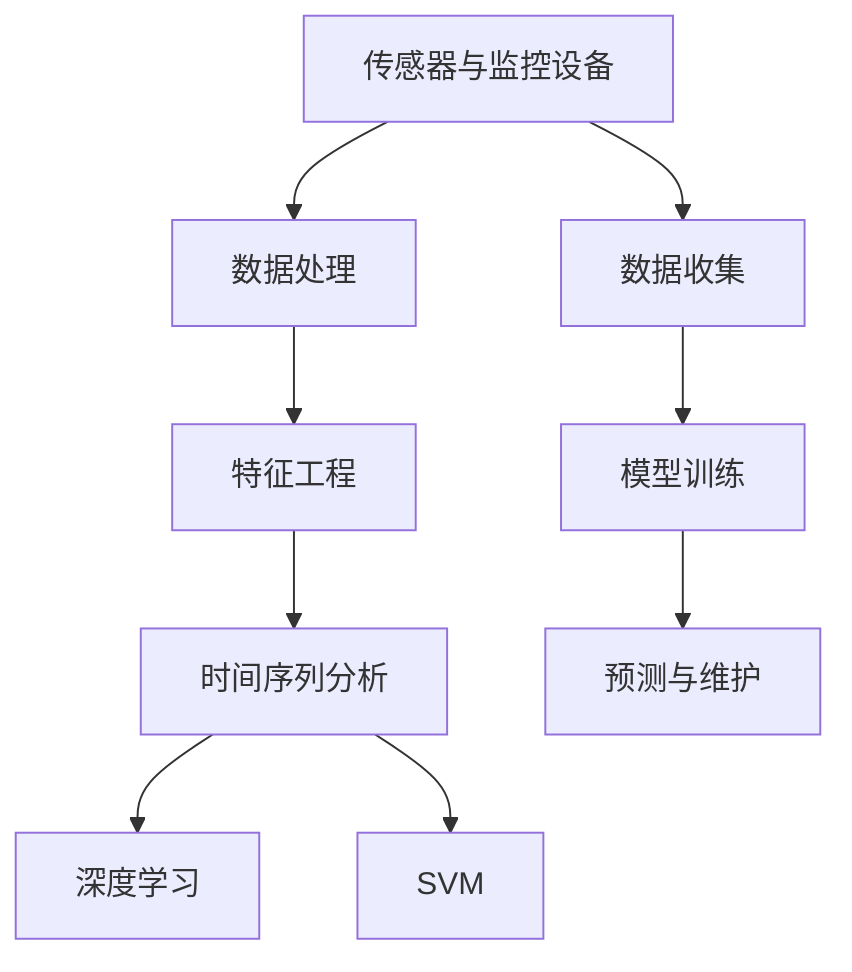

                 

# AI驱动的预测性维护:降低设备故障风险

> 关键词：预测性维护,预防性维护,设备健康监测,故障诊断,机器学习,人工智能,深度学习

## 1. 背景介绍

### 1.1 问题由来

在现代工业生产中，设备故障往往会给企业带来巨大的经济损失。传统的维护模式通常是定期进行预防性维护，这种方式往往过于保守，导致设备维护成本高昂，且无法充分利用设备的有效工作时间。预测性维护（Predictive Maintenance, PM）利用现代技术和数据，通过预测设备未来的健康状态和故障风险，实现预防性维护，进而优化维护策略，降低设备故障的风险和维护成本。

预测性维护的兴起源于互联网和大数据技术的发展。企业可以通过传感器和监控设备收集设备运行数据，再通过数据分析和机器学习技术，识别出设备的异常行为和潜在的故障风险，从而采取针对性的维护措施。这种基于数据的预测性维护方式相比传统的定期预防性维护，更加精细化、智能化，能够提高设备的利用率，降低维护成本，成为工业生产中的重要技术手段。

### 1.2 问题核心关键点

预测性维护的核心在于如何高效利用设备运行数据，结合历史数据和实时监测，通过预测模型实现对设备未来状态的精准预测，从而指导维护决策。预测性维护主要包含以下几个关键步骤：

1. **数据收集**：通过传感器和监控设备收集设备运行数据。
2. **数据处理**：清洗和预处理数据，处理缺失值和异常值，转化为模型可用的格式。
3. **特征工程**：提取和构造设备运行特征，设计合适的特征表示方法。
4. **模型训练**：选择和训练预测模型，如时间序列分析、支持向量机、深度学习等。
5. **预测与维护**：使用训练好的模型对设备进行状态预测，据此制定维护计划。

这些关键步骤构成了预测性维护的基本流程，通过智能化的数据分析和模型训练，实现设备的故障预测和维护优化。

## 2. 核心概念与联系

### 2.1 核心概念概述

为更好地理解预测性维护的核心概念，本节将介绍几个紧密相关的核心概念：

- **预测性维护（Predictive Maintenance, PM）**：利用现代技术和数据分析，预测设备未来的健康状态和故障风险，实现预防性维护，从而优化维护策略，降低设备故障的风险和维护成本。
- **传感器与监控设备**：用于实时监测设备运行状态的硬件设备，如振动传感器、温度传感器、压力传感器等。
- **时间序列分析（Time Series Analysis）**：一种基于时间维度的数据分析方法，用于处理和分析时间序列数据，如设备运行数据。
- **深度学习（Deep Learning）**：一种基于多层神经网络的机器学习方法，广泛应用于图像识别、语音识别、自然语言处理等场景。
- **支持向量机（Support Vector Machine, SVM）**：一种常用的机器学习分类算法，通过寻找最优超平面实现分类。
- **特征工程（Feature Engineering）**：数据预处理和特征构造的过程，设计适合模型训练的特征表示方法。
- **异常检测（Anomaly Detection）**：识别出设备运行数据的异常行为，判断设备的健康状态。

这些核心概念之间的逻辑关系可以通过以下Mermaid流程图来展示：



这个流程图展示了许多关键概念及其之间的关系：

1. 设备通过传感器和监控设备实时收集运行数据。
2. 数据经过处理和特征工程，转化为模型可用的格式。
3. 时间序列分析和深度学习算法用于模型训练。
4. 训练好的模型用于预测设备状态，指导维护决策。

这些概念共同构成了预测性维护的完整流程，通过智能化的数据分析和模型训练，实现设备的故障预测和维护优化。

## 3. 核心算法原理 & 具体操作步骤
### 3.1 算法原理概述

预测性维护的算法原理主要基于机器学习和数据分析，通过构建预测模型来预测设备未来的健康状态和故障风险。常见的预测模型包括时间序列分析、支持向量机、深度学习等。

- **时间序列分析**：基于时间维度的数据分析方法，通过历史数据的趋势、周期性等特征，预测设备未来的运行状态。
- **支持向量机**：通过寻找最优超平面实现分类，适用于二分类或多分类预测任务。
- **深度学习**：通过多层神经网络进行特征学习和模式识别，适用于复杂的非线性预测任务。

这些算法通过学习设备运行数据的历史规律和特征，预测设备未来的运行状态，从而实现预测性维护。预测性维护的核心在于如何高效利用设备运行数据，结合历史数据和实时监测，通过预测模型实现对设备未来状态的精准预测，从而指导维护决策。

### 3.2 算法步骤详解

基于机器学习的预测性维护流程主要包括以下几个步骤：

**Step 1: 数据收集与预处理**

- 使用传感器和监控设备收集设备的运行数据，如振动、温度、压力等。
- 清洗和处理数据，处理缺失值和异常值，转化为模型可用的格式。

**Step 2: 特征工程**

- 提取和构造设备运行特征，设计合适的特征表示方法。例如，计算振动信号的频谱特征、均值、标准差等。
- 选择合适的特征选择方法，如PCA、LASSO等，减少特征维度，提高模型效率。

**Step 3: 模型训练**

- 选择适合的机器学习模型，如时间序列分析、支持向量机、深度学习等。
- 使用历史数据训练模型，调整模型超参数，如学习率、正则化参数等。
- 使用交叉验证等方法评估模型性能，避免过拟合。

**Step 4: 模型评估与优化**

- 使用测试集评估模型性能，如准确率、召回率、F1值等。
- 对模型进行优化，如参数调整、集成学习等，提高模型精度。

**Step 5: 预测与维护**

- 使用训练好的模型对设备进行状态预测，判断设备是否出现异常。
- 根据预测结果制定维护计划，如更换零件、进行预防性维护等。

### 3.3 算法优缺点

预测性维护算法具有以下优点：

- 精确性高：通过学习设备运行的历史数据和特征，能够实现对未来状态的精准预测。
- 成本低：避免不必要的预防性维护，降低维护成本，提高设备的利用率。
- 自动化程度高：利用机器学习算法自动化预测和维护，减少人工干预。

同时，预测性维护算法也存在一些缺点：

- 数据依赖性强：预测模型依赖于高质量的数据，数据的准确性和完整性直接影响模型性能。
- 模型复杂度高：深度学习等模型往往参数较多，训练和推理耗时较长。
- 解释性不足：深度学习模型通常是"黑盒"系统，难以解释其内部工作机制和决策逻辑。

尽管存在这些局限性，但预测性维护算法相比传统的定期预防性维护，具有更高的效率和精度，能够显著降低设备故障的风险和维护成本。

### 3.4 算法应用领域

预测性维护算法广泛应用于以下几个领域：

- **工业制造**：如汽车制造、电子设备制造等行业，预测设备故障，优化生产流程，提高产品质量。
- **能源行业**：如发电厂、输变电设施，预测设备故障，保障电力供应的稳定性和安全性。
- **交通行业**：如铁路、公路、航空等行业，预测设备故障，保证交通安全和运营效率。
- **医疗设备**：如CT机、MRI机等，预测设备故障，保障患者安全和医疗质量。

除了以上应用领域外，预测性维护算法还被创新性地应用到更多场景中，如城市基础设施监测、智能物流设备管理等，为各行各业带来了新的技术解决方案。

## 4. 数学模型和公式 & 详细讲解 & 举例说明

### 4.1 数学模型构建

基于时间序列分析的预测性维护模型主要包含以下数学模型：

- **ARIMA模型**：自回归积分滑动平均模型，通过历史数据预测未来趋势。
- **LSTM模型**：长短期记忆网络，用于处理时间序列数据，适用于复杂的预测任务。
- **SVM模型**：支持向量机，通过寻找最优超平面实现分类。

**ARIMA模型**：

$$
y_t = c + \sum_{i=1}^{p} \phi_i y_{t-i} + \sum_{j=1}^{d} \theta_j \Delta^j y_t + \sum_{k=1}^{q} \gamma_k \epsilon_{t-k} + \varepsilon_t
$$

其中 $y_t$ 表示第 $t$ 时刻的设备状态，$c$ 为常数项，$\phi_i$ 为自回归系数，$\theta_j$ 为差分系数，$\gamma_k$ 为误差项，$\varepsilon_t$ 为随机误差。

**LSTM模型**：

$$
h_t = \tanh(W_h \cdot [h_{t-1}, x_t]) + U_i \cdot \sigma(h_{t-1}, x_t)
$$

其中 $h_t$ 表示第 $t$ 时刻的隐藏状态，$x_t$ 表示第 $t$ 时刻的输入，$W_h$ 和 $U_i$ 为权重矩阵，$\sigma$ 为激活函数。

**SVM模型**：

$$
\hat{y} = \begin{cases}
1, & w \cdot x + b > 0 \\
0, & w \cdot x + b \leq 0
\end{cases}
$$

其中 $y$ 表示实际标签，$x$ 表示特征向量，$w$ 为权重向量，$b$ 为偏置项。

### 4.2 公式推导过程

以LSTM模型为例，推导其前向传播的数学公式。

LSTM模型的前向传播过程可以表示为：

$$
h_t = \tanh(W_h \cdot [h_{t-1}, x_t]) + U_i \cdot \sigma(h_{t-1}, x_t)
$$

其中，$W_h$ 和 $U_i$ 为权重矩阵，$\sigma$ 为激活函数，$h_t$ 表示第 $t$ 时刻的隐藏状态，$x_t$ 表示第 $t$ 时刻的输入。

通过链式法则，可以推导出模型对参数 $w$ 和 $b$ 的梯度公式为：

$$
\frac{\partial \ell}{\partial w} = \frac{\partial \ell}{\partial h_t} \frac{\partial h_t}{\partial w}
$$

$$
\frac{\partial \ell}{\partial b} = \frac{\partial \ell}{\partial h_t} \frac{\partial h_t}{\partial b}
$$

其中 $\ell$ 为损失函数，$\frac{\partial \ell}{\partial h_t}$ 为损失函数对隐藏状态的梯度，$\frac{\partial h_t}{\partial w}$ 和 $\frac{\partial h_t}{\partial b}$ 为前向传播过程中的链式梯度。

在得到梯度公式后，即可带入优化算法如Adam、SGD等进行模型参数的更新，完成模型的迭代优化。

### 4.3 案例分析与讲解

以工业设备预测性维护为例，分析如何构建ARIMA模型。

**Step 1: 数据收集**

通过传感器和监控设备收集设备的振动、温度、压力等运行数据。

**Step 2: 数据预处理**

清洗和处理数据，处理缺失值和异常值，转化为模型可用的格式。

**Step 3: 特征工程**

提取和构造设备运行特征，如振动信号的频谱特征、均值、标准差等。

**Step 4: 模型训练**

选择ARIMA模型，使用历史数据训练模型，调整模型超参数。

**Step 5: 模型评估**

使用测试集评估模型性能，如准确率、召回率、F1值等。

**Step 6: 预测与维护**

使用训练好的ARIMA模型对设备进行状态预测，判断设备是否出现异常，制定维护计划。

通过以上步骤，可以构建一个基于时间序列分析的预测性维护模型，实现设备的故障预测和维护优化。

## 5. 项目实践：代码实例和详细解释说明
### 5.1 开发环境搭建

在进行预测性维护实践前，我们需要准备好开发环境。以下是使用Python进行TensorFlow和Keras开发的环境配置流程：

1. 安装Anaconda：从官网下载并安装Anaconda，用于创建独立的Python环境。

2. 创建并激活虚拟环境：
```bash
conda create -n tf-env python=3.8 
conda activate tf-env
```

3. 安装TensorFlow和Keras：根据CUDA版本，从官网获取对应的安装命令。例如：
```bash
pip install tensorflow keras
```

4. 安装各类工具包：
```bash
pip install numpy pandas scikit-learn matplotlib tqdm jupyter notebook ipython
```

完成上述步骤后，即可在`tf-env`环境中开始预测性维护实践。

### 5.2 源代码详细实现

下面以预测工业设备故障为例，给出使用TensorFlow和Keras进行LSTM模型训练的代码实现。

首先，定义模型架构：

```python
from tensorflow.keras.models import Sequential
from tensorflow.keras.layers import LSTM, Dense, Dropout

model = Sequential()
model.add(LSTM(128, input_shape=(None, 1)))
model.add(Dropout(0.2))
model.add(Dense(1, activation='sigmoid'))
```

然后，定义训练和评估函数：

```python
from tensorflow.keras.callbacks import EarlyStopping
from tensorflow.keras.models import load_model
import pandas as pd

def train_model(model, train_data, val_data, epochs=100, batch_size=32):
    model.compile(loss='binary_crossentropy', optimizer='adam', metrics=['accuracy'])
    history = model.fit(train_data, epochs=epochs, batch_size=batch_size, validation_data=val_data, callbacks=[EarlyStopping(patience=3)])
    return history

def evaluate_model(model, test_data):
    score = model.evaluate(test_data)
    print(f'Test loss: {score[0]:.4f}')
    print(f'Test accuracy: {score[1]*100:.2f}%')
```

接着，定义数据处理函数：

```python
def preprocess_data(data):
    data = data.dropna().reset_index(drop=True)
    features = data.drop('label', axis=1)
    labels = data['label']
    features = features.values.reshape(-1, 1)
    return features, labels
```

最后，启动训练流程并在测试集上评估：

```python
# 数据加载
train_data = pd.read_csv('train.csv')
val_data = pd.read_csv('val.csv')
test_data = pd.read_csv('test.csv')

# 数据预处理
features_train, labels_train = preprocess_data(train_data)
features_val, labels_val = preprocess_data(val_data)
features_test = preprocess_data(test_data)

# 模型训练
history = train_model(model, features_train, features_val, epochs=100, batch_size=32)

# 模型评估
evaluate_model(model, features_test)
```

以上就是使用TensorFlow和Keras进行LSTM模型训练的完整代码实现。可以看到，TensorFlow和Keras的强大封装使得模型的构建和训练变得相对简洁高效。

### 5.3 代码解读与分析

让我们再详细解读一下关键代码的实现细节：

**模型定义**：
- 使用Sequential模型定义LSTM层，输入维度为(None, 1)，输出维度为1，激活函数为sigmoid。
- Dropout层用于防止过拟合。

**数据预处理**：
- 使用pandas库读取数据，进行缺失值处理和索引重置。
- 提取特征和标签，并转化为模型可用的格式。

**模型训练**：
- 使用compile方法定义损失函数、优化器和评估指标。
- 使用fit方法训练模型，并在验证集上设置EarlyStopping回调，避免过拟合。
- 返回训练历史，包含损失和精度随训练轮数的变化。

**模型评估**：
- 使用evaluate方法在测试集上评估模型性能，打印出损失和精度。

**训练流程**：
- 定义总训练轮数和批次大小，开始循环迭代
- 每个epoch内，在训练集上进行前向传播和反向传播，更新模型参数
- 在验证集上评估模型性能，根据EarlyStopping回调决定是否停止训练
- 在测试集上评估模型性能，输出最终测试结果

可以看到，TensorFlow和Keras使得预测性维护的模型构建和训练变得非常简便。开发者可以将更多精力放在数据处理、模型改进等高层逻辑上，而不必过多关注底层的实现细节。

当然，工业级的系统实现还需考虑更多因素，如模型的保存和部署、超参数的自动搜索、更灵活的任务适配层等。但核心的预测性维护流程基本与此类似。

## 6. 实际应用场景
### 6.1 工业设备预测性维护

在工业设备预测性维护中，预测性维护可以实时监测设备运行状态，预测设备未来的故障风险，从而及时采取维护措施，避免设备故障带来的经济损失。例如，在汽车制造中，预测性维护可以实时监测生产线上的设备状态，预测设备是否即将出现故障，提前进行维修，减少停机时间。

在电子设备制造中，预测性维护可以实时监测生产设备的状态，预测设备是否需要更换零件，避免生产过程中设备的突然故障，保障生产的稳定性和连续性。

### 6.2 能源行业预测性维护

在能源行业中，预测性维护可以实时监测发电厂、输变电设施的状态，预测设备是否出现故障，提前进行维修，减少电力供应中断的风险。例如，在风力发电厂中，预测性维护可以实时监测风机的运行状态，预测风机是否即将出现故障，提前进行维护，保障发电的稳定性和安全性。

在核电站中，预测性维护可以实时监测反应堆的状态，预测设备是否需要更换部件，避免设备故障带来的安全风险，保障核电站的安全运行。

### 6.3 交通行业预测性维护

在交通行业中，预测性维护可以实时监测铁路、公路、航空等交通设施的状态，预测设备是否出现故障，提前进行维护，保障交通的安全和效率。例如，在铁路系统中，预测性维护可以实时监测火车的运行状态，预测是否需要更换零部件，避免设备故障导致的列车脱轨事故，保障铁路运输的安全。

在机场中，预测性维护可以实时监测航班的运行状态，预测是否需要更换飞机部件，避免设备故障导致的航班延误，保障航空运输的顺畅。

### 6.4 未来应用展望

随着预测性维护技术的不断发展，未来将在更多领域得到应用，为各行各业带来新的技术解决方案。

在智慧医疗领域，预测性维护可以实时监测医疗设备的运行状态，预测设备是否出现故障，保障医疗设备的稳定运行，保障患者的健康和安全。例如，在CT机中，预测性维护可以实时监测设备的运行状态，预测设备是否需要更换部件，避免设备故障带来的医疗风险。

在智能物流领域，预测性维护可以实时监测物流设备的运行状态，预测设备是否出现故障，提前进行维护，保障物流运输的顺畅和效率。例如，在无人机系统中，预测性维护可以实时监测无人机的运行状态，预测设备是否需要更换部件，避免设备故障导致的安全事故，保障无人机的安全飞行。

## 7. 工具和资源推荐
### 7.1 学习资源推荐

为了帮助开发者系统掌握预测性维护的理论基础和实践技巧，这里推荐一些优质的学习资源：

1. **《Python深度学习》**：Ian Goodfellow等人所著，深入浅出地介绍了深度学习的基本概念和实际应用，包括预测性维护相关的内容。

2. **CS229《机器学习》**：斯坦福大学开设的机器学习课程，涵盖了机器学习的基本理论和算法，包括时间序列分析和深度学习。

3. **《机器学习实战》**：Peter Harrington所著，提供了大量的实战案例，帮助读者理解机器学习算法的实际应用，包括预测性维护相关的案例。

4. **Kaggle竞赛平台**：提供了大量预测性维护相关的数据集和竞赛任务，可以通过实践提高预测性维护的技能。

5. **GitHub开源项目**：GitHub上有很多预测性维护的开源项目和代码库，可以参考和学习。

通过对这些资源的学习实践，相信你一定能够快速掌握预测性维护的理论基础和实践技巧，并用于解决实际的预测性维护问题。

### 7.2 开发工具推荐

高效的开发离不开优秀的工具支持。以下是几款用于预测性维护开发的常用工具：

1. **TensorFlow**：由Google主导开发的深度学习框架，提供了丰富的API和工具，支持多种机器学习模型。

2. **Keras**：基于TensorFlow开发的高级神经网络API，提供了简洁的API接口，支持快速搭建和训练模型。

3. **PyTorch**：Facebook开发的深度学习框架，提供了动态计算图和高效的张量操作，适合研究和实验。

4. **Matplotlib**：Python中的绘图库，用于可视化训练过程中的损失和精度变化。

5. **TensorBoard**：TensorFlow配套的可视化工具，用于实时监测模型训练过程，提供丰富的图表展示。

6. **Scikit-learn**：Python中的机器学习库，提供了多种经典的机器学习算法，包括时间序列分析和深度学习。

7. **Pandas**：Python中的数据处理库，提供了数据清洗、预处理和特征提取等功能，适合数据密集型任务。

合理利用这些工具，可以显著提升预测性维护任务的开发效率，加快创新迭代的步伐。

### 7.3 相关论文推荐

预测性维护技术的发展源于学界的持续研究。以下是几篇奠基性的相关论文，推荐阅读：

1. **Time Series Analysis: Forecasting and Control**：由George Box等人所著，详细介绍了时间序列分析的基本原理和方法，是预测性维护领域的经典教材。

2. **Long Short-Term Memory**：由Hochreiter和Schmidhuber所著，介绍了长短期记忆网络的基本原理和方法，适用于预测性维护中的时间序列分析。

3. **Predictive Maintenance: A Survey**：由Najma et al.所著，总结了预测性维护的研究现状和发展趋势，涵盖时间序列分析、深度学习等多种方法。

4. **Deep Learning for Predictive Maintenance**：由Sundararajan et al.所著，介绍了深度学习在预测性维护中的应用，包括LSTM、CNN等模型。

5. **Support Vector Machines: Theory and Applications**：由Boser等人所著，介绍了支持向量机的基本原理和方法，适用于预测性维护中的分类任务。

这些论文代表了大规模数据驱动的预测性维护技术的发展脉络。通过学习这些前沿成果，可以帮助研究者把握学科前进方向，激发更多的创新灵感。

## 8. 总结：未来发展趋势与挑战

### 8.1 总结

本文对预测性维护技术进行了全面系统的介绍。首先阐述了预测性维护的研究背景和意义，明确了预测性维护在降低设备故障风险、优化维护策略等方面的独特价值。其次，从原理到实践，详细讲解了预测性维护的数学模型和关键步骤，给出了预测性维护任务开发的完整代码实例。同时，本文还广泛探讨了预测性维护方法在工业设备、能源行业、交通系统等多个领域的应用前景，展示了预测性维护技术的巨大潜力。此外，本文精选了预测性维护技术的各类学习资源，力求为读者提供全方位的技术指引。

通过本文的系统梳理，可以看到，预测性维护技术在各行各业中已经得到了广泛应用，为工业生产带来了显著的经济效益。未来，伴随预测性维护技术的进一步发展，预测性维护将实现从预防性维护到预测性维护的飞跃，成为工业生产中不可或缺的技术手段。

### 8.2 未来发展趋势

展望未来，预测性维护技术将呈现以下几个发展趋势：

1. **数据驱动与智能决策**：随着物联网和智能设备的普及，预测性维护将更多依赖实时监测数据，通过智能决策算法实现设备的精准预测和维护。
2. **深度学习与强化学习**：预测性维护将结合深度学习和强化学习，进一步提升模型的预测精度和自适应能力。
3. **多模态融合**：预测性维护将结合多种传感器数据，如振动、温度、声音等，实现多模态信息的融合，提高预测的准确性和鲁棒性。
4. **联邦学习**：预测性维护将采用联邦学习等分布式训练方法，避免数据泄露和隐私风险，提升模型的泛化能力。
5. **边缘计算**：预测性维护将结合边缘计算技术，在设备端进行实时分析和决策，提升系统的响应速度和效率。

这些趋势凸显了预测性维护技术的广阔前景。这些方向的探索发展，必将进一步提升预测性维护的精度和效率，实现更加智能化、自动化的设备管理。

### 8.3 面临的挑战

尽管预测性维护技术已经取得了瞩目成就，但在迈向更加智能化、普适化应用的过程中，它仍面临着诸多挑战：

1. **数据质量问题**：预测性维护依赖高质量的数据，数据的准确性和完整性直接影响模型的性能。数据的获取和处理需要投入大量的人力和资源。
2. **计算资源限制**：深度学习模型参数较多，训练和推理耗时较长，需要高性能计算资源支持。
3. **模型可解释性不足**：深度学习模型通常是"黑盒"系统，难以解释其内部工作机制和决策逻辑。这对于高风险应用领域如医疗、金融等尤为重要。
4. **隐私与安全问题**：预测性维护涉及大量的设备运行数据，如何保护数据隐私和系统安全，避免数据泄露和恶意攻击，是一个重要的研究方向。

尽管存在这些挑战，但预测性维护技术相比传统的预防性维护，具有更高的效率和精度，能够显著降低设备故障的风险和维护成本。未来的研究需要在数据质量、计算资源、模型可解释性等方面寻求新的突破。

### 8.4 研究展望

面对预测性维护所面临的挑战，未来的研究需要在以下几个方面寻求新的突破：

1. **数据治理与质量控制**：建立数据质量控制机制，确保数据准确、完整、一致，提升数据驱动的预测性维护效果。
2. **高效计算与模型压缩**：开发高效计算框架和模型压缩方法，提高预测性维护模型的计算效率和实时性。
3. **模型可解释性增强**：引入可解释性技术，如注意力机制、可视化等，增强预测性维护模型的解释能力，提升系统可信度。
4. **隐私保护与安全防护**：开发隐私保护技术，如联邦学习、差分隐私等，保护数据隐私和系统安全。
5. **多模态融合与边缘计算**：结合多种传感器数据，实现多模态信息的融合，结合边缘计算技术，提升系统的实时性和可靠性。

这些研究方向的探索，必将引领预测性维护技术迈向更高的台阶，为构建智能化的设备管理系统铺平道路。面向未来，预测性维护技术还需要与其他人工智能技术进行更深入的融合，如知识表示、因果推理、强化学习等，多路径协同发力，共同推动预测性维护技术的进步。只有勇于创新、敢于突破，才能不断拓展预测性维护的边界，让预测性维护技术更好地服务于工业生产，造福人类社会。

## 9. 附录：常见问题与解答

**Q1: 预测性维护与预防性维护有什么区别？**

A: 预测性维护和预防性维护是两种不同的维护策略。预防性维护是基于时间周期对设备进行定期检查和维护，无论设备是否出现故障都进行维护。而预测性维护是根据设备运行状态和历史数据，预测设备未来的故障风险，只有在预测到设备即将出现故障时才进行维护，从而避免不必要的维护，降低维护成本。

**Q2: 预测性维护需要什么样的数据？**

A: 预测性维护需要高质量的设备运行数据，包括振动、温度、压力、电流、电压等传感器数据。数据的准确性和完整性直接影响模型的性能，需要定期进行数据清洗和处理。

**Q3: 预测性维护需要多少标注数据？**

A: 预测性维护通常只需要少量标注数据，如设备故障的故障码、维修记录等。标注数据的数量不需要很大，但需要保证数据的代表性，涵盖设备的各个运行状态。

**Q4: 预测性维护的模型选择有哪些？**

A: 预测性维护的模型选择包括时间序列分析、支持向量机、深度学习等。时间序列分析适用于线性趋势的预测，支持向量机适用于二分类或多分类预测，深度学习适用于复杂的非线性预测。

**Q5: 预测性维护的评估指标有哪些？**

A: 预测性维护的评估指标包括准确率、召回率、F1值等。准确率表示模型预测的正确率，召回率表示模型正确预测的正样本占实际正样本的比例，F1值是准确率和召回率的调和平均数，综合评估模型的性能。

通过这些常见问题的解答，相信你对预测性维护有了更深入的了解，并能够更好地应用于实际工程中。

---

作者：禅与计算机程序设计艺术 / Zen and the Art of Computer Programming

